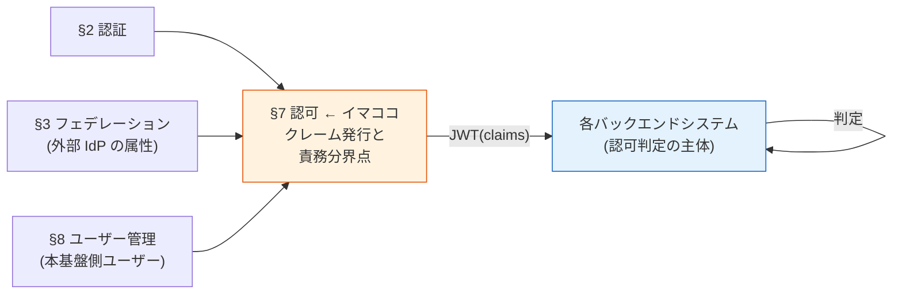
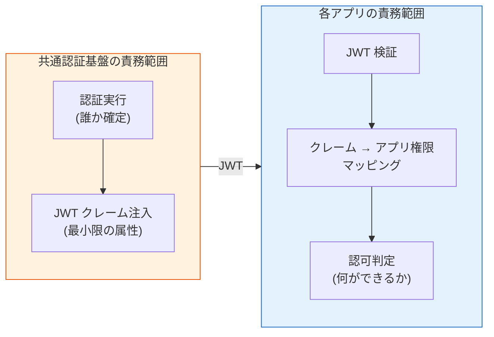
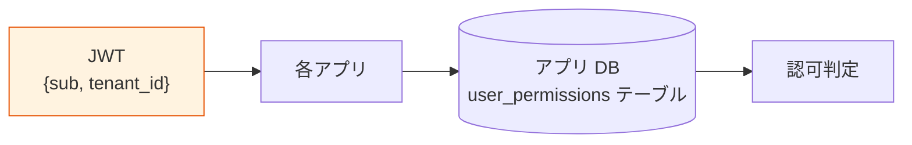
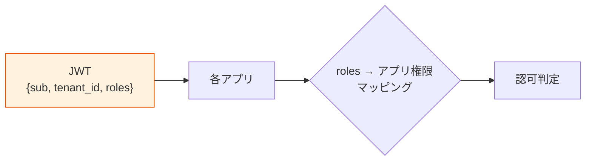
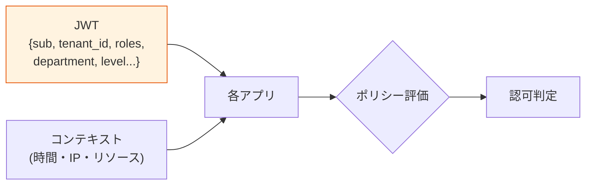
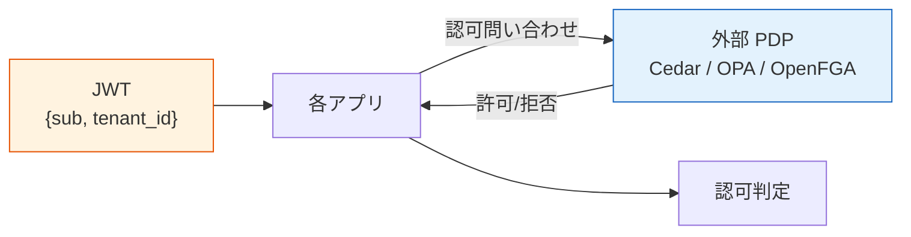

# §7 認可

> 上位 SSOT: [00-index.md](00-index.md)
> 詳細: [../functional-requirements.md §5 FR-AUTHZ](../functional-requirements.md)、[../../common/authz-architecture-design.md](../../common/authz-architecture-design.md)
> カバー範囲: FR-AUTHZ §5.1 基本 / §5.2 細粒度

---

## §7.0 前提と背景

### 用語整理

| 用語 | 本基盤での意味 |
|---|---|
| **認証（Authentication）** | 「誰か」を確定する仕組み（**本基盤の責務**）|
| **認可（Authorization）** | 「何ができるか」を決める仕組み（**各アプリの責務**）|
| **クレーム（Claim）** | JWT に含まれるユーザー属性（`sub`, `tenant_id`, `email` 等）|
| **RP（Relying Party）** | JWT を受け取って認可判定するアプリケーション |
| **PEP / PDP**（Policy Enforcement / Decision Point）| 認可判定の実行点 / 判定点。本基盤外の概念 |
| **責務分界点** | 認証基盤と各アプリの境界線。本章で明示 |
| **EAM / DAM** | Gartner / KuppingerCole が定義する "Externalized / Dynamic Authorization Management" カテゴリ |

### なぜここ（§7）で決めるか



認証は「誰か」を確定する仕事。**認可は "それでもって何ができるか" を決める**。本基盤は **JWT クレーム発行までを担当**、最終的な認可判定は各バックエンドシステムが JWT を検証して実施（責務分離）。

---

### §7.0.A 本基盤の認可スタンス（最重要・要合意）

> **本基盤は「認証 + 最小限のクレーム発行」までを担当。認可判定は各アプリ側の責務とする。**



#### このスタンスの業界根拠（2026 年時点）

「認証 ≠ 認可、認可は外部化せよ」は **業界のメインストリーム推奨**。一次資料：

| 出典 | 主張の要旨 |
|---|---|
| **OAuth.net 公式** | "OAuth 2.0 is **a delegation protocol** for conveying authorization decisions... **OAuth 2.0 is not an authentication protocol**." → 認証と認可は別レイヤー |
| **NIST SP 800-63C**（連邦政府 Identity Federation 公式） | "**The RP（各アプリ）** uses information in the assertion to identify the subscriber and **make authorization decisions** about their access to resources controlled by the RP." → 認可は RP の責務と明記 |
| **2026 JWT Best Practices**（Curity / Auth0 / Permit.io 等） | "JWTs should be **minimal pointers, not data stores**" ／ "JWTs are best at communicating **identity, not permissions**" |
| **Gartner**（業界アナリスト） | "**Externalize authorization logic**; if it's hardcoded, it's technical debt." カテゴリを "**Externalized Authorization Management (EAM)**" として正式定義 |
| **KuppingerCole** | 同カテゴリを "**Dynamic Authorization Management (DAM)**" として推奨。"Externalizing authorization decisions outside of applications" を新世代 IAM の核と位置付け |
| **OpenID AuthZEN 1.0**（2026 年 1 月 Final） | この分離思想を実現するため、認可 API を標準化（認可エンジンの交換可能性を確保）|

#### アンチパターン警告

> "A common anti-pattern is using JWT as a substitute for per-request authorization checks." — 業界共通の警告

→ JWT に過剰な認可情報を詰める / IdP に認可ロジックを集中させるのは **アンチパターン**。

#### このスタンスを採る理由（業界根拠 × 本プロジェクト固有理由）

| 理由 | 説明 | 根拠 |
|---|---|---|
| **不特定多数のシステムが繋ぎ込まれる前提** | 各アプリの業務ロジック・権限モデルは事前に分からない。基盤が認可まで踏み込むと、各アプリの自由度を縛る | 本プロジェクト固有 |
| **責務分離は業界標準** | 認証 = 信頼の源泉（基盤）／ 認可 = 業務判断（アプリ）。混在させると変更コストが爆発 | OAuth.net / NIST SP 800-63C |
| **拡張性の確保** | 後から ABAC / ReBAC / UMA / Cedar / OPA / OpenFGA など好きな PDP を導入できる | Gartner EAM / KuppingerCole DAM |
| **基盤側の安定性** | クレーム形式が安定 → 各アプリは何年経っても同じ JWT 検証で動く | JWT Best Practices |
| **顧客ごとの認可方針の違いに対応** | 顧客 A は roles で OK、顧客 B は ABAC 必須、顧客 C は外部 PDP 利用、を個別に対応可能 | 本プロジェクト固有 |
| **Technical debt 回避** | 認可ロジックを基盤に hardcode すると Gartner 警告通り技術的負債化 | Gartner 明示 |

→ **本スタンスは「妥当」を超えて、業界のベストプラクティスそのもの**。

#### 共通認証基盤として「認可（クレーム発行）」を検討する意義

| 観点 | 個別アプリで実装 | 共通認証基盤で実装 |
|---|---|---|
| ユーザー識別 | アプリごとに別 ID 体系 | **基盤 `sub` で全アプリ統一** |
| テナント分離 | アプリごとに `tenant_id` 抽出ロジック | **基盤が JWT に注入、アプリは検証のみ** |
| 属性正規化（[§3.2.2](03-federation.md#322-属性マッピング--クレーム変換--fr-fed-009)） | アプリごとに IdP クレーム差異を吸収 | **基盤で 1 度だけ正規化** |
| JWT 発行と署名 | アプリでは不可能 | **基盤が秘密鍵で署名、各アプリは公開鍵で検証** |

→ 「最小限の正規化済みクレームを安全に発行する」までが基盤の仕事。**その先（業務ロジックに紐づく認可）は各アプリ**。

#### 本章で扱うサブセクション

| サブセクション | 内容 | 関連 FR |
|---|---|---|
| §7.1 認証基盤が発行する JWT クレーム | 必須クレーム / オプション / カスタマイズ余地 | FR-AUTHZ-001〜008 |
| §7.2 各アプリの認可設計パターン | 4 パターン併記、顧客が選択 | FR-AUTHZ-009, 010 |

---

## §7.1 認証基盤が発行する JWT クレーム（→ FR-AUTHZ §5.1）

> **このサブセクションで定めること**: 認証基盤が JWT に**注入するクレームの範囲**（最小限：`sub`/`tenant_id`/`email` 〜 オプション：`roles`/カスタム属性）。
> **主な判断軸**: 必要なクレーム最小構成、カスタムクレーム要望、`roles` を JWT に含めるか / アプリ DB で管理するか
> **§7 全体との関係**: §7.0.A スタンス「**基盤は最小限、認可はアプリ**」を**発行クレーム**として具体化。§7.2 は「アプリ側がそれをどう使うか」

### 業界の現在地

**JWT クレームの 2026 ベストプラクティス**（multi-tenant SaaS 文脈）:
- **最小限主義**: 「アプリが使う属性のみ」を JWT に含める（余計な属性は漏洩リスク）
- **改ざん防止**: `tenant_id` 等のセキュリティ属性は基盤側で必ず注入（ユーザー自己申告不可）
- **tenant-scoped**: ロール・グループはテナント別の意味で発行
- **正規化済み**: 外部 IdP の命名揺れを基盤側で吸収（[§3.2.2](03-federation.md#322-属性マッピング--クレーム変換--fr-fed-009)）
- **JWT はポインタ、データストアではない**: 詳細権限は基盤外に置き、JWT は識別情報のみ

### 我々のスタンス（北極星に基づく）

| 北極星の柱 | クレーム発行での実現 |
|---|---|
| **絶対安全** | `tenant_id` は改ざん不可、署名検証必須、最小限のクレームで漏洩リスク最小 |
| **どんなアプリでも** | OIDC 標準 + 最小限の追加クレーム = どんなアプリでも同じ方法で検証可能 |
| **効率よく** | アプリは JWT を信じるだけ、認可判定は自分のロジックで実施可 |
| **運用負荷・コスト最小** | クレーム仕様が安定 → アプリ側変更不要、基盤の保守が容易 |

### 発行するクレームの 3 段階

| 段階 | クレーム | 採用判断 | 推奨度 |
|---|---|---|:---:|
| **A. 最小（Must）**| `sub`（ユーザー ID）、`iss`、`exp`、`aud` | OIDC 標準、全顧客 Must | ⭐⭐⭐ |
| **B. 識別拡張（Must）**| `tenant_id`（テナント識別）、`email` | マルチテナント前提で必須 | ⭐⭐⭐ |
| **C. オプション**| `roles`、`groups`、`name`、カスタム属性 | 顧客要件次第 | ⭐⭐ |

→ **A + B が本基盤のデフォルト発行クレーム**。C は顧客と相談して個別に決定。

### 対応能力マトリクス

| 機能 | Cognito | Keycloak (OSS/RHBK) | PoC 検証 |
|---|:---:|:---:|:---:|
| 標準 OIDC クレーム（`sub`/`iss`/`exp`/`aud`）| ✅ | ✅ | ✅ |
| `tenant_id` 注入 | ✅ Pre Token Lambda V2 | ✅ Protocol Mapper（宣言的）| ✅ Phase 8 / 9 |
| `roles` 注入 | ✅ Pre Token Lambda V2 | ✅ Protocol Mapper（Realm Role）| ✅ Phase 8 / 9 |
| カスタムクレーム注入 | ✅ Pre Token Lambda V2 | ✅ Protocol Mapper | ✅ |
| Access Token への注入 | ⚠ Pre Token V2 必須 | ✅ Protocol Mapper（標準）| ✅ Phase 8 / 9 |
| API Gateway / Lambda Authorizer 統合 | ✅ | ✅ | ✅ Phase 3 / 9 |
| マルチイシュア対応 | ✅ | ✅ | ✅ Phase 4, 5, 9 |
| クレーム改ざん防止 | ✅ RS256 署名 | ✅ RS256 署名 | ✅ |

### ベースライン

**1. デフォルト発行クレーム**:

```json
{
  "sub": "user-uuid",              // Must: 一意ユーザー ID
  "tenant_id": "acme-corp",        // Must: テナント識別
  "email": "alice@acme.com",       // Must: ユーザー識別補助
  "iss": "https://auth.example.com",
  "aud": "client-id",
  "exp": 1234567890,
  "iat": 1234560000
}
```

**2. オプションで追加可能（顧客選択）**:

| クレーム | 用途 | 採用例 |
|---|---|---|
| `roles` | ロール認可をしたいアプリ | 全アプリで RBAC 採用時 |
| `groups` | グループベース認可 | 部署権限を持つアプリ |
| `name` | 表示名 | UI 表示用 |
| `custom:*` | 顧客固有属性 | 部署 ID、コストセンター、契約レベル等 |

**3. 顧客に対して提示する選択肢**:

> 「**御社の各アプリで認可をどう実装するかを教えてください**。それに応じて、JWT に何を含めるか決めます。例えば：
> - 「ユーザー ID だけあれば、あとはアプリ DB で権限管理」→ `sub` + `tenant_id` だけで OK
> - 「会社名で簡易判定したい」→ `tenant_id` を含む
> - 「ロールも基盤側で持ちたい」→ `roles` を追加
> - 「個別属性で細かく判定したい」→ カスタムクレームを追加」

### TBD / 要確認

| 確認項目 | 回答例 |
|---|---|
| 必要なクレームの最小構成 | A のみ / A+B / A+B+C |
| カスタムクレーム要望 | 部署 / 役職 / コストセンター / その他 |
| `roles` を JWT に含めるか | はい（RBAC ベース）/ いいえ（アプリ DB で管理）|
| Access Token と ID Token への注入範囲 | 両方 / ID Token のみ |

---

## §7.2 各アプリの認可設計パターン（→ FR-AUTHZ §5.2、業界知見の集約）

> **このサブセクションで定めること**: 本基盤は認可判定をしない代わりに、**各アプリが認可をどう実装するかの選択肢**（A: アプリ DB / B: RBAC / C: ABAC / D: 外部 PDP）を顧客が選択できる形で提示する。
> **主な判断軸**: 各アプリの認可パターン（A〜D、アプリごとに異なっても可）、細粒度認可の要否、採用したい外部 PDP（Cedar / OPA / OpenFGA 等）
> **§7 全体との関係**: §7.0.A スタンス通り、本基盤は介入しない。本サブセクションは「**アプリ側の設計支援情報**」として提示する位置付け

本基盤は判定に介入しないが、各アプリが採れる代表的なパターンを示し、顧客が選択できるようにする。

### 業界の現在地

各アプリで採用可能な認可アプローチ:

| アプローチ | モデル | 適用範囲 |
|---|---|---|
| **アプリ DB 認可** | アプリ独自 | 認証は基盤、認可はアプリ DB で完結 |
| **RBAC**（roles クレーム）| Role-Based | 標準的、多くのアプリで採用 |
| **ABAC**（属性ベース）| Attribute-Based | 動的判定（時間・IP・部署） |
| **ReBAC**（関係ベース）| Relationship-Based | OpenFGA / SpiceDB、複雑な階層 |
| **外部 PDP**（Policy Decision Point）| Cedar / OPA | Amazon Verified Permissions / Open Policy Agent |
| **UMA 2.0** | Resource-Owner Based | Keycloak Authorization Services |

### 我々のスタンス（北極星に基づく）

| 北極星の柱 | 認可設計での実現 |
|---|---|
| **絶対安全** | tenant 境界は JWT クレームで保証、各アプリは tenant スコープ検証を必ず実施 |
| **どんなアプリでも** | 4 パターン併記。顧客のアプリ種別 / 規模 / 要件に応じて選択可能 |
| **効率よく** | 基盤側で追加実装なし。各アプリは独立して認可ロジックを進化可能 |
| **運用負荷・コスト最小** | RBAC で済むなら細粒度導入しない。導入時は外部 PDP（マネージド）優先 |

### 認可設計パターン 4 案

#### パターン A：アプリ DB 認可（最小構成）



- 基盤からは `sub` と `tenant_id` のみ受け取る
- アプリ DB で `user_id → permissions` を管理
- 最大柔軟性、アプリ設計自由
- 採用例：認可ロジックが業務複雑なシステム

#### パターン B：RBAC（roles クレーム利用）



- 基盤が `roles` クレームを発行（manager / employee 等）
- アプリは roles → 自分の権限にマッピング
- 標準的、ほとんどのアプリで採用可能
- 採用例：標準的な業務システム

#### パターン C：ABAC（属性ベース、動的判定）



- 基盤がカスタム属性（部署 / レベル等）を JWT に注入
- アプリ側で属性 × コンテキストでポリシー評価
- 動的判定が必要な場合に採用
- 採用例：金融、医療、機密データを扱うシステム

#### パターン D：外部 PDP（Cedar / OPA / OpenFGA / UMA）



- 認可ロジックを外部 PDP に完全委譲
- アプリは PDP に問い合わせるだけ
- 大規模・複雑・複数アプリで認可ポリシー統一したい場合
- 採用例：大規模 SaaS、AI Agent 認可、UMA リソース共有

### パターン選定ガイド

| 顧客の要件 | 推奨パターン |
|---|---|
| シンプル、アプリ独立進化したい | A. アプリ DB 認可 |
| 標準的な RBAC で十分 | B. RBAC |
| 部署・属性で動的判定したい | C. ABAC |
| 細粒度認可（リソース共有等）| D. 外部 PDP（UMA / Cedar / OPA） |
| AWS native + 細粒度 | D. **Amazon Verified Permissions + Cedar** |
| Keycloak 採用 + 細粒度 | D. **Keycloak Authorization Services（UMA）** |
| マイクロサービス多数 | D. **OPA** |
| 組織階層型データ共有 | D. **OpenFGA / SpiceDB** |
| AI Agent 認可（将来）| D. **Cedar（Amazon Bedrock 採用）/ SpiceDB（LangChain 統合）** |

### ベースライン

| 項目 | ベースライン |
|---|---|
| デフォルト推奨 | **パターン B（RBAC）** または **パターン A（アプリ DB）** |
| アプリごとに異なるパターン | 許容（基盤は介入しない）|
| パターン D 採用時の選定 | 顧客要件 + プラットフォーム（Cognito / Keycloak）と整合 |
| tenant 境界の検証 | **全パターンで必須**（JWT.tenant_id 検証）|

### TBD / 要確認

| 確認項目 | 回答例 |
|---|---|
| 各アプリで採用したい認可パターン | A / B / C / D（アプリごとに別でも可）|
| 細粒度認可の要否 | 不要 / 必要（パターン D） |
| 採用したい外部 PDP | Cedar / AVP / OPA / OpenFGA / Keycloak Auth Services / なし |
| プラットフォーム選定への影響 | UMA Must → Keycloak、AVP 優先 → Cognito |

---

### 参考資料（§7 全体）

#### スタンスの業界根拠（§7.0.A）

- [OAuth.net - End User Authentication with OAuth 2.0](https://oauth.net/articles/authentication/)（OAuth は認可委譲プロトコル、認証ではない）
- [NIST SP 800-63C - Federation Guide](https://pages.nist.gov/800-63-3/sp800-63c.html)（認可は RP の責務）
- [JWT Best Practices 2026 - Permit.io](https://www.permit.io/blog/how-to-use-jwts-for-authorization-best-practices-and-common-mistakes)
- [JWT Best Practices - Curity](https://curity.io/resources/learn/jwt-best-practices/)
- [Gartner - Externalized Authorization Management 概要](https://www.gartner.com/en/documents/2358815)
- [KuppingerCole - Dynamic Authorization Management](https://www.kuppingercole.com/watch/authorization-before-we-externalise-it-eic24)
- [OpenID AuthZEN 1.0 Final 2026](https://openid.net/wg/authzen/)

#### 認可モデル・PDP

- [Authorization models 解説 - Medium 2026](https://medium.com/@iamprovidence/authorization-models-ibac-rbac-pbac-abac-rebac-acl-dac-mac-b274aa5bdf08)
- [RBAC vs ABAC vs PBAC - Oso](https://www.osohq.com/learn/rbac-vs-abac-vs-pbac)
- [RBAC vs ReBAC - Security Boulevard 2026](https://securityboulevard.com/2026/01/rbac-vs-rebac-comparing-role-based-relationship-based-access-control/)
- [Cedar Policy Language Guide - StrongDM 2026](https://www.strongdm.com/cedar-policy-language)
- [Amazon Verified Permissions 公式](https://aws.amazon.com/verified-permissions/)
- [Keycloak Authorization Services 公式](https://www.keycloak.org/docs/latest/authorization_services/)
- [Multi-tenant SaaS Access Control with AVP - AWS Blog](https://aws.amazon.com/blogs/security/saas-access-control-using-amazon-verified-permissions-with-a-per-tenant-policy-store/)
