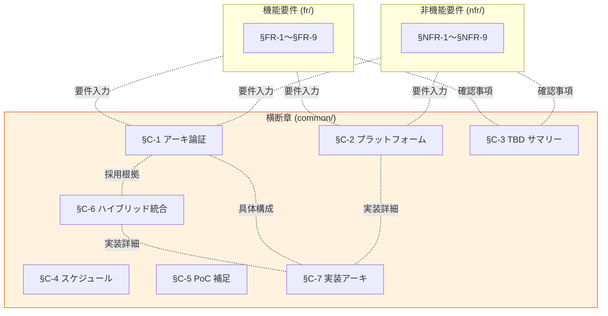

# 横断章（Common）一覧

> 上位 SSOT: [../00-index.md](../00-index.md)

---

## 章一覧

| 章 | ファイル | 内容 |
|---|---|---|
| §C-1 | [01-architecture.md](01-architecture.md) | アーキテクチャ論証 — Identity Broker パターン（Hub-and-Spoke）+ 物理分離レベル + 規模スケーリング戦略 |
| §C-2 | [02-platform.md](02-platform.md) | 実装プラットフォーム（Cognito / Keycloak OSS / RHBK）選定軸 |
| §C-3 | [03-tbd-summary.md](03-tbd-summary.md) | TBD / 要確認 事項サマリー（ヒアリング項目集約） |
| §C-4 | [04-schedule.md](04-schedule.md) | 想定スケジュール（合意 → ヒアリング → 設計 → 実装） |
| §C-5 | [05-poc-note.md](05-poc-note.md) | 弊社内の事前検証について（PoC 控えめに） |
| §C-6 | [06-architecture-decision-hybrid.md](06-architecture-decision-hybrid.md) | アーキテクチャ判断 — ハイブリッド統合の根拠と設計 |
| **§C-7** | **[07-implementation-architecture.md](07-implementation-architecture.md)** | **実装アーキテクチャ — 全体構成図 + 28 構成要素詳細 + シーケンス + データフロー**（ADR-001〜053 統合、本番想定の SSOT）|

---

## 横断章の役割

- **§C-1 / §C-2 / §C-6** は FR / NFR の要件を受けて、**アーキ採用根拠と方向性**を決める章
- **§C-7** は §C-1 / §C-6 で確定した方向性を、ADR-001〜053 統合で**本番実装の全体構成図と構成要素詳細**として SSOT 化
- **§C-3** は FR / NFR の各 "TBD / 要確認" を **横断集約**
- **§C-4 / §C-5** は **プロセス／背景補足**

---

## 関連

- [../00-index.md](../00-index.md): proposal 全体 SSOT
- [../fr/00-index.md](../fr/00-index.md): 機能要件章一覧
- [../nfr/00-index.md](../nfr/00-index.md): 非機能要件章一覧
