# §C-1 アーキテクチャ — Identity Broker パターン

> 上位 SSOT: [00-index.md](00-index.md)   
> 詳細: [../../../common/identity-broker-multi-idp.md](../../../common/identity-broker-multi-idp.md)
>
> **⚠ 重要 — アーキテクチャ方針の再検討（2026-05-26）**:
> 本章は「完全統合（Identity Broker 一択）」を前提とした分析だが、設計レビュー段階で 6 つの懸念（SPOF / 過剰品質 / アプリ最適化放棄 / 個別変更困難 / 想定外対応 / 等）が提起された。これを踏まえた **ハイブリッド統合（コア統合 + エッジ自律）への方針転換提案**を [§C-6 アーキテクチャ判断: ハイブリッド統合の根拠と設計](06-architecture-decision-hybrid.md) で詳述。
>
> **読み方**:
> - 本章 §C-1 の Broker パターン分析は **ハイブリッドのコア層に適用**される（コア層内は引き続き Broker パターンで設計）
> - 全体アーキテクチャの最終判断は §C-6 を参照
> - D-6 ヒアリングは §C-6 §12 の拡張項目で確認

---

## §C-1.0 前提と背景

### 用語整理

| 用語 | 本基盤での意味 |
|---|---|
| **Identity Broker** | 複数の外部 IdP と各システムの間に立ち、認証を仲介するアーキテクチャパターン |
| **Hub-and-Spoke** | 中央集約型の通信トポロジー。本基盤の物理表現 |
| **IdP**(Identity Provider) | 顧客企業の認証情報を持つ外部システム(Entra ID / Okta / HENNGE 等) |
| **RP**(Relying Party) | 本基盤の JWT を受け取って認可判定するアプリ |
| **Federation Hub** | Identity Broker の別称(Microsoft / KuppingerCole 用語) |
| **Identity Fabric** | KuppingerCole 提唱の新世代 IAM 統合概念。Broker を内包したより広い枠組み |

### なぜここ(§C-1)で決めるか

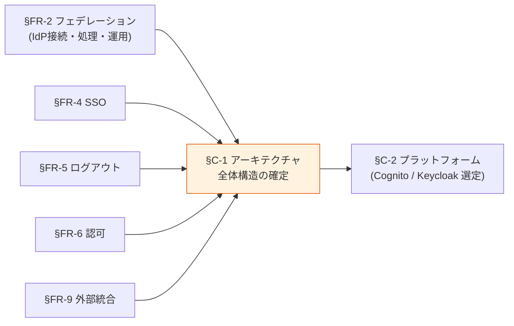
```mermaid
flowchart LR
    S3["§FR-2 フェデレーション<br/>(IdP接続・処理・運用)"]
    S5["§FR-4 SSO"]
    S6["§FR-5 ログアウト"]
    S7["§FR-6 認可"]
    S10["§FR-9 外部統合"]
    S11["§C-1 アーキテクチャ<br/>全体構造の確定"]
    S12["§C-2 プラットフォーム<br/>(Cognito / Keycloak 選定)"]

    S3 --> S11
    S5 --> S11
    S6 --> S11
    S7 --> S11
    S10 --> S11
    S11 --> S12

    style S11 fill:#fff3e0,stroke:#e65100
```

§FR-1-§FR-9 で「**個別の機能・運用方針**」を確定してきた。§C-1 は **それらを束ねた "アーキテクチャ全体像"** を確定する。
§C-1 の方向性が決まれば、§C-2 「**どのプラットフォームで実装するか**」が判断可能になる。

### §C-1.0.A 本基盤のアーキテクチャスタンス

> **Identity Broker パターン(Hub-and-Spoke 型)を採用する。これは選択というより、§FR-2 で示した要件から構造的に導かれる必然である。**

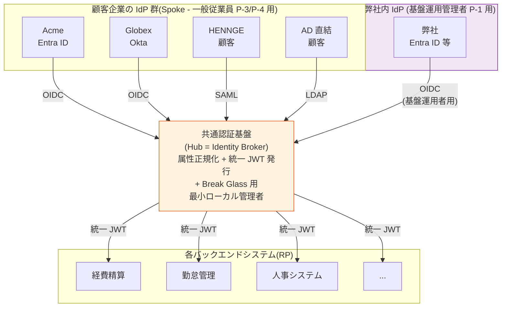
```mermaid
flowchart TB
    subgraph CustomerIdP["顧客企業の IdP 群(Spoke - 一般従業員 P-3/P-4 用)"]
        C1["Acme<br/>Entra ID"]
        C2["Globex<br/>Okta"]
        C3["HENNGE<br/>顧客"]
        C4["AD 直結<br/>顧客"]
    end

    subgraph InternalIdP["弊社内 IdP (基盤運用管理者 P-1 用)"]
        I1["弊社<br/>Entra ID 等"]
    end

    Hub["共通認証基盤<br/>(Hub = Identity Broker)<br/>属性正規化 + 統一 JWT 発行<br/>+ Break Glass 用<br/>最小ローカル管理者"]

    subgraph Apps["各バックエンドシステム(RP)"]
        A1["経費精算"]
        A2["勤怠管理"]
        A3["人事システム"]
        A4["..."]
    end

    C1 -->|OIDC| Hub
    C2 -->|OIDC| Hub
    C3 -->|SAML| Hub
    C4 -->|LDAP| Hub
    I1 -->|"OIDC<br/>(基盤運用者用)"| Hub
    Hub -->|統一 JWT| A1
    Hub -->|統一 JWT| A2
    Hub -->|統一 JWT| A3
    Hub -->|統一 JWT| A4

    style Hub fill:#fff3e0,stroke:#e65100
    style InternalIdP fill:#f3e5f5,stroke:#7b1fa2
```

> **利用者カテゴリの位置付け**（[§FR-1.2.0.0](../fr/01-auth.md#fr-1200-ローカルユーザーとは何か--利用者カテゴリ別の分析) と整合）:
> - **顧客 IdP 群（Spoke）**: 顧客の一般従業員（P-3）+ テナント管理者（P-2、顧客 IdP あり時）の認証
> - **弊社内 IdP**: 基盤運用管理者（P-1）の認証。**γ シナリオ採用時に Must**
> - **共通基盤内最小ローカル**: Break Glass 用ローカル管理者（数名）+ IdP なし顧客分（シナリオ β / α 時の P-2/P-4）

#### このスタンスの業界根拠

| 出典 | 主張 |
|---|---|
| **Microsoft Azure Architecture Center** | "**Federated Identity Pattern**" として公式パターン化。"a federated identity provider acts as a broker, integrating IdPs via authentication protocols" |
| **KuppingerCole Leadership Compass: Identity Fabrics** | Identity Fabric の foundational layer に Broker パターンを位置付け。「**Orchestration, signal-driven decisions, seamless integration**」が新世代 IAM の核 |
| **Hub-and-Spoke Architectural Pattern** | "Hub component includes **identity and access control**, spokes inherit policies"。エンタープライズ統合の定石パターン |
| **AWS Cognito 公式 / Keycloak Identity Brokering** | 両プラットフォームが Broker パターンをネイティブ実装 |
| **WJAETS-2025 学術論文** | Broker パターンで「**統合点 18→6 に削減**」の定量効果を示す実証研究 |

### 共通認証基盤として「アーキテクチャ全体像」を確定する意義

| 観点 | 個別アプリで実装 | Broker パターン採用 |
|---|---|---|
| 顧客 IdP 追加 | 全アプリで個別対応 | **Broker に 1 度設定するだけ** |
| 各システムが検証する issuer | 顧客数 × プロトコル数 | **1 つだけ** |
| クレーム差異の吸収 | 各システムで対応 | **Broker で一元正規化** |
| テスト・セキュリティレビュー | 全組合せ | **Broker のみ** |
| 顧客追加リードタイム | 全システム改修 | **基盤の IdP 設定追加のみ(< 1 営業日)** |
| 管理運用コスト(業界調査) | 高 | **最大 60% 削減**(WJAETS-2025) |

→ Broker パターン採用は「**基本方針 4 軸すべての実現**」の中核装置。

### §C-1.0.B 代替アーキテクチャスタンスの参考図（§C-1.0.A と同粒度比較）

> **このサブセクションの目的**: §C-1.0.A で示した「完全統合（Broker パターン）」スタンスに対する、**ハイブリッド統合** と **完全分散** の代替スタンスを、**同じ粒度の構成図**で並列提示。設計レビュー段階で提起された 6 懸念（SPOF / 過剰品質 / アプリ最適化放棄 等）の議論で、3 つのスタンスを **同じ視覚言語で 1 度に比較**できる位置付け。
> **詳細分析**: 各代替の詳細設計は [§C-1.2.C 代替アーキテクチャの比較](#c-12c-代替アーキテクチャの比較完全統合--ハイブリッド--完全分散) と [§C-6 アーキテクチャ判断: ハイブリッド統合](06-architecture-decision-hybrid.md) を参照。

#### 図 1: 完全統合（§C-1.0.A 再掲、参考）

§C-1.0.A の図を参照（**当初の前提**、本基盤の現スタンス）。

#### 図 2: ハイブリッド統合（コア + エッジ、§C-6 推奨）

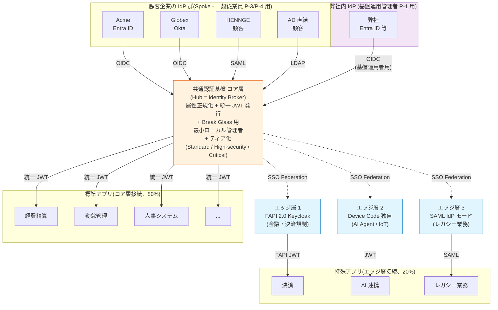
```mermaid
flowchart TB
    subgraph CustomerIdP_H["顧客企業の IdP 群(Spoke - 一般従業員 P-3/P-4 用)"]
        C1_H["Acme<br/>Entra ID"]
        C2_H["Globex<br/>Okta"]
        C3_H["HENNGE<br/>顧客"]
        C4_H["AD 直結<br/>顧客"]
    end

    subgraph InternalIdP_H["弊社内 IdP (基盤運用管理者 P-1 用)"]
        I1_H["弊社<br/>Entra ID 等"]
    end

    Core_H["共通認証基盤 コア層<br/>(Hub = Identity Broker)<br/>属性正規化 + 統一 JWT 発行<br/>+ Break Glass 用<br/>最小ローカル管理者<br/>+ ティア化<br/>(Standard / High-security / Critical)"]

    EdgeFAPI_H["エッジ層 1<br/>FAPI 2.0 Keycloak<br/>(金融・決済規制)"]
    EdgeAI_H["エッジ層 2<br/>Device Code 独自<br/>(AI Agent / IoT)"]
    EdgeLegacy_H["エッジ層 3<br/>SAML IdP モード<br/>(レガシー業務)"]

    subgraph StdApps_H["標準アプリ(コア層接続、80%)"]
        A1_H["経費精算"]
        A2_H["勤怠管理"]
        A3_H["人事システム"]
        A4_H["..."]
    end

    subgraph SpecApps_H["特殊アプリ(エッジ層接続、20%)"]
        AD_H["決済"]
        AE_H["AI 連携"]
        AF_H["レガシー業務"]
    end

    C1_H -->|OIDC| Core_H
    C2_H -->|OIDC| Core_H
    C3_H -->|SAML| Core_H
    C4_H -->|LDAP| Core_H
    I1_H -->|"OIDC<br/>(基盤運用者用)"| Core_H

    Core_H -->|統一 JWT| A1_H
    Core_H -->|統一 JWT| A2_H
    Core_H -->|統一 JWT| A3_H
    Core_H -->|統一 JWT| A4_H

    Core_H -. SSO Federation .-> EdgeFAPI_H
    Core_H -. SSO Federation .-> EdgeAI_H
    Core_H -. SSO Federation .-> EdgeLegacy_H

    EdgeFAPI_H -->|FAPI JWT| AD_H
    EdgeAI_H -->|JWT| AE_H
    EdgeLegacy_H -->|SAML| AF_H

    style Core_H fill:#fff3e0,stroke:#e65100
    style InternalIdP_H fill:#f3e5f5,stroke:#7b1fa2
    style EdgeFAPI_H fill:#e1f5fe,stroke:#0277bd
    style EdgeAI_H fill:#e1f5fe,stroke:#0277bd
    style EdgeLegacy_H fill:#e1f5fe,stroke:#0277bd
```

> **ハイブリッド統合の利用者カテゴリ位置付け**:
> - **顧客 IdP 群 / 弊社内 IdP**: §C-1.0.A と同じ（コア層に接続）
> - **コア層**: 標準アプリ（80% 想定）を統合、ティア化（Standard / High-security / Critical）で過剰品質回避
> - **エッジ層**: 特殊要件アプリ（20% 想定）が独自基盤、コア層と **SSO Federation で連携**
> - 詳細は [§C-6 §6.2-6.4](06-architecture-decision-hybrid.md)

#### 図 3: 完全分散（各アプリ独自認証、SSO は IdP セッション依存）

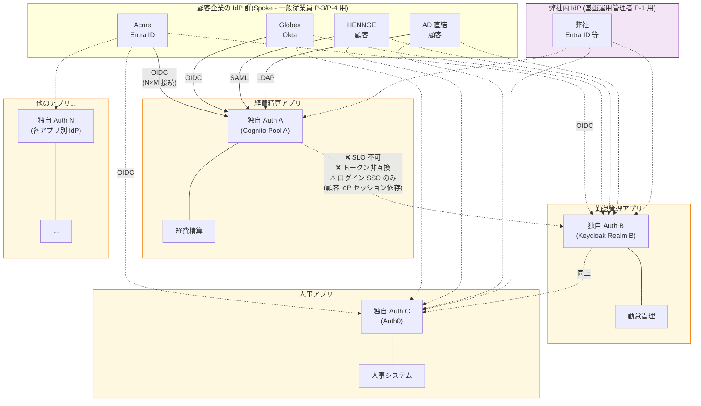
```mermaid
flowchart TB
    subgraph CustomerIdP_D["顧客企業の IdP 群(Spoke - 一般従業員 P-3/P-4 用)"]
        C1_D["Acme<br/>Entra ID"]
        C2_D["Globex<br/>Okta"]
        C3_D["HENNGE<br/>顧客"]
        C4_D["AD 直結<br/>顧客"]
    end

    subgraph InternalIdP_D["弊社内 IdP (基盤運用管理者 P-1 用)"]
        I1_D["弊社<br/>Entra ID 等"]
    end

    subgraph AppA_FullD["経費精算アプリ"]
        AuthA_D["独自 Auth A<br/>(Cognito Pool A)"]
        AppA_D["経費精算"]
        AuthA_D --- AppA_D
    end

    subgraph AppB_FullD["勤怠管理アプリ"]
        AuthB_D["独自 Auth B<br/>(Keycloak Realm B)"]
        AppB_D["勤怠管理"]
        AuthB_D --- AppB_D
    end

    subgraph AppC_FullD["人事アプリ"]
        AuthC_D["独自 Auth C<br/>(Auth0)"]
        AppC_D["人事システム"]
        AuthC_D --- AppC_D
    end

    subgraph AppN_FullD["他のアプリ..."]
        AuthN_D["独自 Auth N<br/>(各アプリ別 IdP)"]
        AppN_D["..."]
        AuthN_D --- AppN_D
    end

    C1_D -->|"OIDC<br/>(N×M 接続)"| AuthA_D
    C1_D -.OIDC.-> AuthB_D
    C1_D -.OIDC.-> AuthC_D
    C1_D -.-> AuthN_D
    C2_D -->|OIDC| AuthA_D
    C2_D -.-> AuthB_D
    C2_D -.-> AuthC_D
    C3_D -->|SAML| AuthA_D
    C3_D -.-> AuthB_D
    C3_D -.-> AuthC_D
    C4_D -->|LDAP| AuthA_D
    C4_D -.-> AuthB_D
    C4_D -.-> AuthC_D

    I1_D -.-> AuthA_D
    I1_D -.-> AuthB_D
    I1_D -.-> AuthC_D

    AuthA_D -. ❌ SLO 不可<br/>❌ トークン非互換<br/>⚠ ログイン SSO のみ<br/>(顧客 IdP セッション依存) .-> AuthB_D
    AuthB_D -. 同上 .-> AuthC_D

    style InternalIdP_D fill:#f3e5f5,stroke:#7b1fa2
    style AppA_FullD fill:#fff8e1,stroke:#f57c00
    style AppB_FullD fill:#fff8e1,stroke:#f57c00
    style AppC_FullD fill:#fff8e1,stroke:#f57c00
    style AppN_FullD fill:#fff8e1,stroke:#f57c00
```

> **完全分散スタンスの特徴**:
> - **共通 Hub なし**: 各アプリが顧客 IdP + 弊社内 IdP に直接 federation
> - **N×M 接続**: 顧客 1500 社 × アプリ 10 個 = **15,000 federation 設定**
> - **SSO**: ログイン時のみ顧客 IdP セッション経由で成立、SLO / トークンリレーは不可
> - **アプリ最適化**: 各アプリで最適 IdP 選定可能（但し運用負荷 N 倍）
> - 詳細は [§C-1.2.C.2 「分散 + SSO + SPOF フリー」3 つの現実パターン](#c-12c2-分散--sso--spof-フリーを実現する-3-つの現実パターン)

#### 3 スタンス俯瞰比較（同粒度図ベース）

| 観点 | 完全統合（図 1 = §C-1.0.A）| **ハイブリッド統合（図 2）** ⭐ | 完全分散（図 3）|
|---|:-:|:-:|:-:|
| **共通 Hub** | 1 つ | コア 1 + エッジ N | なし |
| **アプリ最適化** | ❌ 不可 | ✅ エッジで可 | ✅ 完全 |
| **SPOF 影響範囲** | 全アプリ | コアのみ | 各アプリ独立 |
| **顧客 IdP 接続** | 1 箇所集約 | コア層に集約 | **N×M = 15,000** |
| **SSO** | ✅ 自動 | ✅ コア自動 + エッジ Federation | ⚠ ログインのみ |
| **SLO（全アプリログアウト）** | ✅ | ✅ | ❌ |
| **トークンリレー** | ✅ | ✅ Token Exchange 等 | ❌ |
| **過剰品質回避** | ❌ | ✅ ティア化 | ✅ |
| **運用人員** | 1 チーム | コア + 限定エッジ | **N チーム** |
| **業界実例** | Slack / Notion | **Auth0 / Microsoft / Okta** | 大手金融業務系 |
| **御社規模での適性** | △（1500 顧客で Pool 分割必須）| **◎ 推奨** | ×（N×M 設定爆発）|

→ **3 つのスタンスを §C-1.0.A 同粒度で並列比較**することで、設計判断の俯瞰が容易。詳細根拠は §C-1.2.C / §C-6。

### 本章で扱うサブセクション

| サブセクション | 内容 |
|---|---|
| §C-1.1 Broker パターン採用根拠 | なぜ Broker か、要件からの構造的導出、業界根拠 |
| §C-1.2 全体アーキテクチャ | 構成要素・データフロー・各章との対応 |
| §C-1.3 採用しない代替パターン | Point-to-Point / Mesh / Identity Fabric / BYOI の位置付け |
| §C-1.4 物理分離レベルと Broker パターンの関係 | 6 段階分離レベル(L1〜L6)と Broker 採用境界、業界実例 |
| §C-1.5 規模スケーリング戦略（1500-3000 顧客企業）| Cognito Hard Limit と Pool 分割戦略 |
| §C-1.6 TBD / 要確認 | - |

### 🎯 内側プロトコル方針: **アプリへの発行は OIDC 推奨**（2026-06-03 確定）

> Broker パターンは**外側（受信）と内側（発行）の 2 面**を持つ。**内側プロトコル（接続アプリへの発行）は OIDC を推奨方針**とする。

**方針の核**:

| 区分 | 推奨方針 |
|---|---|
| **新規開発アプリ** | **OIDC 一択**（SAML SP として新規構築しない）|
| **既存アプリ: OIDC 化可能** | OIDC 化を優先検討（Phase 1-2 で対応）|
| **既存アプリ: OIDC 化困難 / 短期不可** | SAML IdP 発行 (K5) で当面接続 + 中期 OIDC 移行計画 |
| **既存 SaaS（自社管轄外）** | SaaS 側仕様に従う（既存 SaaS の多くは SAML SP のみ → K5 必要）|

**外側（顧客 IdP からの受信）は SAML + OIDC 両方サポート継続**（顧客側 IdP は仕様統制不可のため両対応必須）。

**なぜ内側 OIDC 推奨か**（4 つの根拠）:
1. **製品選定の自由度拡大** — K5 発生件数を抑制すれば Cognito 採用余地が広がる（[ティア使い分け](#) と整合）
2. **開発・運用負荷の低減** — SDK 選択肢豊富、JWT 検証が単一フォーマット
3. **業界トレンドとの整合** — Microsoft / Google / Auth0 / Okta 全社が「新規=OIDC、SAML=legacy 互換用」スタンス
4. **機能拡張の容易さ** — Token Exchange / DPoP / mTLS / RFC 9470 step-up 等モダン仕様はすべて OIDC/OAuth ベース

**ヒアリング連動**:
- **D-7（Phase D 前提合意）**: 「内側プロトコル方針: OIDC 推奨を前提合意」を顧客と合意
- **マスター表 C 列 P=g / 列 S K5**: ☑する前に「OIDC 化検討の余地はないか」を必ず確認
- 詳細: [hearing-checklist.md D-7 / B-100 マスター表 C](../../hearing-checklist.md)、[terms-and-codes-reference.md §7 末尾の方針](../../terms-and-codes-reference.md)

### 🎯 ドメイン構成方針: **サブドメイン構成を推奨**（2026-06-04 確定）

> Broker パターンは「**認証基盤 (Hub)** と **複数アプリ**」の構成。各アプリのドメインを **同一親ドメインのサブドメイン**（`app1.example.com` / `app2.example.com` / `auth.example.com`）で配置することを推奨。

**結論**: サブドメイン構成は本方式（Identity Broker + Cognito/Keycloak + Bearer JWT + OIDC SSO）に対して**問題なく動作**し、**完全別ドメイン構成より複数観点で有利**。

**サブドメイン構成のメリット（5 つ）**:

| # | メリット | 内容 |
|:-:|---|---|
| 1 | **SameSite/CORS の制約緩和** | Same-Site 扱い、`SameSite=Lax` で動作可能（完全別ドメインは `None+Secure` 必須）|
| 2 | **現代ブラウザ規制（ITP / 3rd-party Cookie 廃止）の影響小** | Same-Site なので 3rd-party Cookie 規制の対象外 |
| 3 | **BFF パターンとの相性最良** | [Curity BFF Gold Standard 2025](https://curity.io/resources/learn/the-bff-pattern/) が同一親ドメイン構成を推奨 |
| 4 | **TLS 証明書管理がシンプル** | ワイルドカード証明書 1 枚（`*.example.com`）で全アプリ対応 |
| 5 | **Cognito Custom Domain 制約の回避** | 認証基盤を `auth.example.com` の 1 つだけにすれば 1 Region 4 上限の影響なし |

**設計上の最重要原則**:
- ❌ **Cookie の `Domain` を親ドメイン（`.example.com`）に設定しない** — アプリ間 Cookie 漏洩リスク
- ✅ **各アプリの Cookie は各サブドメインに限定**（Host-only Cookie 推奨）
- ✅ **SSO は OIDC リダイレクトで Hub セッション参照** — アプリ間 Cookie 共有は不要かつ非推奨

**業界実例**: Google Workspace / AWS Console / Microsoft 365 / Slack / Salesforce 等、大手 SaaS の主流。

**詳細**: [common/subdomain-architecture-notes.md](../../../common/subdomain-architecture-notes.md) に技術仕様 + 設計原則 + 注意点 + ヒアリング項目を網羅。

**ヒアリング連動**: マスター表 C（B-100）の補足として「ドメイン構成 5 項目」を確認（[hearing-checklist.md](../../hearing-checklist.md) 参照）。

---

## §C-1.1 Broker パターン採用根拠

> **このサブセクションで定めること**: なぜ Identity Broker パターンを採用するかの **論理的導出**(§FR-2 で確定した要件から自動的に決まる)と業界根拠。   
> **主な判断軸**: §FR-2 の要件確定状況(マルチ IdP 要否 / 統一クレーム要否 / 顧客追加で各システム変更不要要否)   
> **§C-1 全体との関係**: §C-1.0.A のスタンスを「**要件 → 帰結**」のロジックで裏付ける

### §FR-2 の要件から Broker パターンが自動導出される

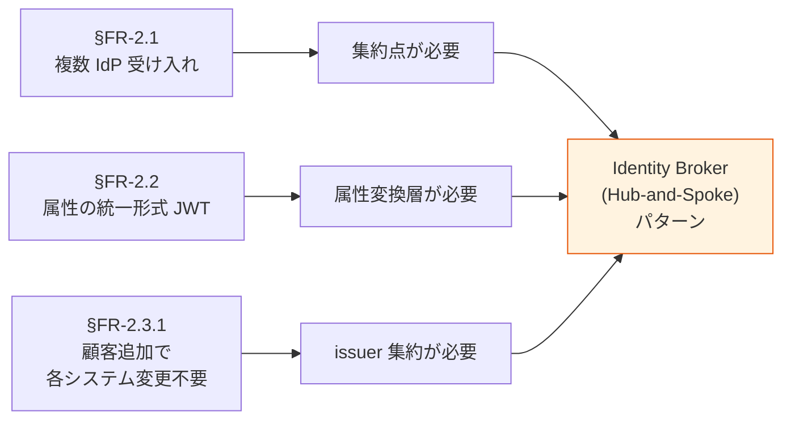
```mermaid
flowchart LR
    R1["§FR-2.1<br/>複数 IdP 受け入れ"] --> D1["集約点が必要"]
    R2["§FR-2.2<br/>属性の統一形式 JWT"] --> D2["属性変換層が必要"]
    R3["§FR-2.3.1<br/>顧客追加で<br/>各システム変更不要"] --> D3["issuer 集約が必要"]

    D1 --> Conclusion["Identity Broker<br/>(Hub-and-Spoke)<br/>パターン"]
    D2 --> Conclusion
    D3 --> Conclusion

    style Conclusion fill:#fff3e0,stroke:#e65100
```

### 要件と帰結の対応表

| §FR-2 の要件 | 帰結 |
|---|---|
| §FR-2.1 FR-FED-001〜007 が Must(複数 IdP 受け入れ) | **集約点が必要** = Hub |
| §FR-2.2.2 FR-FED-009 が Must(属性正規化) | **変換層が必要** = Hub 内属性マッピング |
| §FR-2.3.1 FR-FED-010 が Must(複数 IdP 並行運用) | **単一 issuer で発行** = Hub が JWT 発行 |
| §FR-2.3.2 FR-FED-011 が Must(顧客追加で各システム変更不要) | **アプリの依存先は Hub のみ** = Hub-and-Spoke 不可避 |

→ §FR-2 の Must 要件が決まれば、Broker パターン採用は **構造的に必然**(選択肢ではない)。

### 業界の現在地(業界根拠)

- **Microsoft Azure Architecture Center "Federated Identity Pattern"**: 公式クラウドデザインパターンカタログに登録(成熟したパターン)
- **KuppingerCole Identity Fabrics**: Broker を新世代 IAM の "Foundation" と位置付け、Leadership Compass で評価対象化
- **Keycloak / Cognito**: 両プラットフォームが Identity Brokering を**ネイティブ機能**として提供
- **学術定量効果**(WJAETS-2025): 統合点 18→6 削減、管理運用コスト 60% 削減

### 我々のスタンス(基本方針に基づく)

| 基本方針の柱 | Broker パターンでの実現 |
|---|---|
| **絶対安全** | 信頼境界が明確(Hub のみが発行する JWT を信頼)、各システムは Broker JWT のみ検証 |
| **どんなアプリでも** | 統一クレーム形式により**どんなバックエンドでも同じ方法で検証可能** |
| **効率よく** | 顧客追加で各システム変更不要、IdP 接続 < 1 営業日([§FR-2.3.2](../fr/02-federation.md#332-顧客追加オンボーディング--fr-fed-011)) |
| **運用負荷・コスト最小** | 統合点 60% 削減(業界調査)、テスト範囲は Broker のみ |

### ベースライン

| 項目 | ベースライン |
|---|---|
| アーキテクチャパターン | **Identity Broker(Hub-and-Spoke)採用** — Must |
| Hub の物理実装 | Cognito User Pool または Keycloak Realm([§C-2](02-platform.md) で選定) |
| マルチテナント方式 | **単一 Pool/Realm + 複数 IdP**([§FR-2.3.A](../fr/02-federation.md#33a-アーキテクチャ判断単一-poolrealm--複数-idp-を採用) で根拠) |
| 業界整合性 | Microsoft / KuppingerCole / AWS / OSS いずれの設計指針とも整合 |

### TBD / 要確認

| 確認項目 | 回答例 |
|---|---|
| Broker パターン採用に異論ないか | はい(推奨) / 反対意見あり |
| Hub の物理境界(単一基盤 / 用途別分離) | 単一 / 用途別(金融とそれ以外で分離等) |
| 既存 IdP(既存認証基盤含む)からの移行制約 | 段階移行 / 一括移行 / なし |

---

## §C-1.2 全体アーキテクチャ

> **このサブセクションで定めること**: Broker パターンを採用した本基盤の **全体構成図・データフロー・構成要素**の整理。各章で個別に扱った内容を 1 つの絵に統合。   
> **主な判断軸**: 構成要素の網羅性、データフローの正確性、運用主体の明示   
> **§C-1 全体との関係**: §C-1.1 の採用根拠を**実装イメージ**として可視化。§C-2 プラットフォーム選定の前提となる絵

### 全体構成図

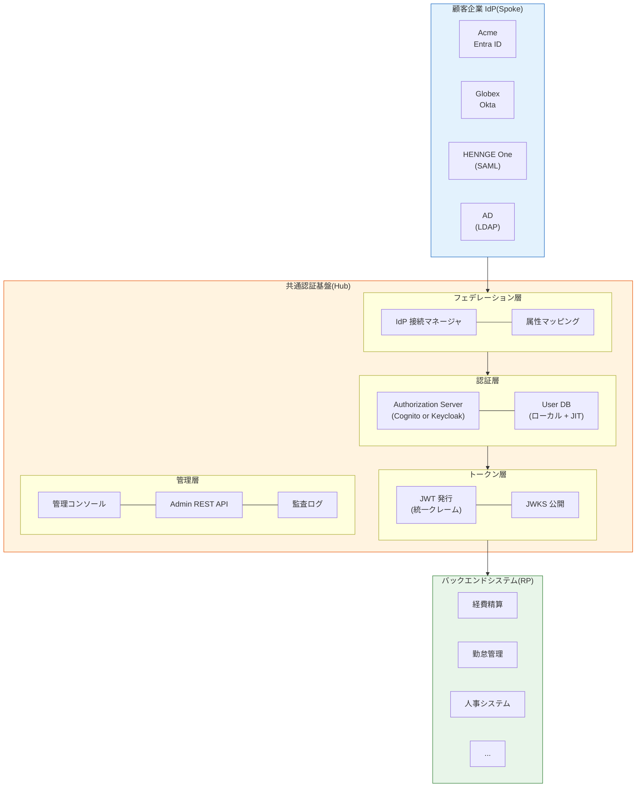
```mermaid
flowchart TB
    subgraph CustomerIdP["顧客企業 IdP(Spoke)"]
        direction LR
        IdP1["Acme<br/>Entra ID"]
        IdP2["Globex<br/>Okta"]
        IdP3["HENNGE One<br/>(SAML)"]
        IdP4["AD<br/>(LDAP)"]
    end

    subgraph Basis["共通認証基盤(Hub)"]
        direction TB
        subgraph Auth["認証層"]
            AS["Authorization Server<br/>(Cognito or Keycloak)"]
            UD["User DB<br/>(ローカル + JIT)"]
            AS --- UD
        end
        subgraph Federation["フェデレーション層"]
            FED["IdP 接続マネージャ"]
            MAP["属性マッピング"]
            FED --- MAP
        end
        subgraph Token["トークン層"]
            JWT["JWT 発行<br/>(統一クレーム)"]
            JWKS["JWKS 公開"]
            JWT --- JWKS
        end
        subgraph Mgmt["管理層"]
            ADMIN["管理コンソール"]
            API["Admin REST API"]
            LOG["監査ログ"]
            ADMIN --- API --- LOG
        end
    end

    subgraph Apps["バックエンドシステム(RP)"]
        direction LR
        APP1["経費精算"]
        APP2["勤怠管理"]
        APP3["人事システム"]
        APP4["..."]
    end

    CustomerIdP --> Federation
    Federation --> Auth
    Auth --> Token
    Token --> Apps

    style Basis fill:#fff3e0,stroke:#e65100
    style CustomerIdP fill:#e3f2fd,stroke:#1565c0
    style Apps fill:#e8f5e9,stroke:#2e7d32
```

### データフロー(典型ログインケース)

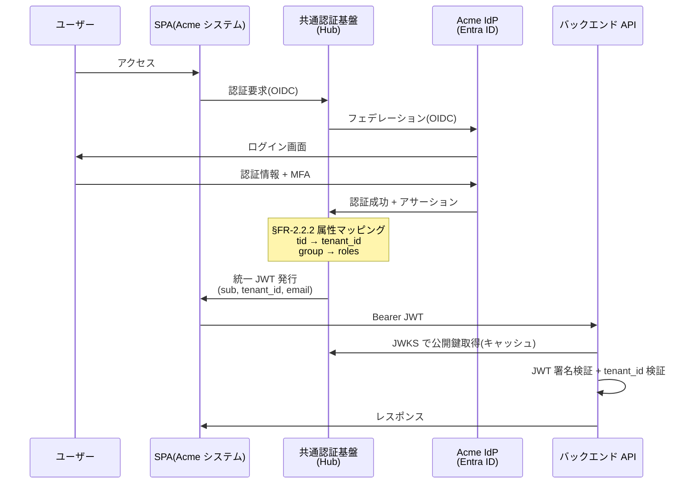
```mermaid
sequenceDiagram
    participant U as ユーザー
    participant S as SPA(Acme システム)
    participant H as 共通認証基盤<br/>(Hub)
    participant I as Acme IdP<br/>(Entra ID)
    participant A as バックエンド API

    U->>S: アクセス
    S->>H: 認証要求(OIDC)
    H->>I: フェデレーション(OIDC)
    I->>U: ログイン画面
    U->>I: 認証情報 + MFA
    I->>H: 認証成功 + アサーション
    Note over H: §FR-2.2.2 属性マッピング<br/>tid → tenant_id<br/>group → roles
    H->>S: 統一 JWT 発行<br/>(sub, tenant_id, email)
    S->>A: Bearer JWT
    A->>H: JWKS で公開鍵取得(キャッシュ)
    A->>A: JWT 署名検証 + tenant_id 検証
    A->>S: レスポンス
```

### 構成要素マッピング(各章との対応)

| 構成要素 | 関連章 |
|---|---|
| 認証層(Authorization Server) | [§FR-1 認証](../fr/01-auth.md), [§FR-3 MFA](../fr/03-mfa.md), [§FR-4 SSO](../fr/04-sso.md), [§FR-5 ログアウト](../fr/05-logout-session.md) |
| フェデレーション層 | [§FR-2 フェデレーション](../fr/02-federation.md) |
| トークン層(JWT / JWKS) | [§FR-6 認可](../fr/06-authz.md), [§FR-9.1 プロトコル](../fr/09-integration.md#101-プロトコル準拠--fr-int-81) |
| 管理層 | [§FR-7 ユーザー管理](../fr/07-user.md), [§FR-8 管理機能](../fr/08-admin.md), [§FR-9.3 API・IaC](../fr/09-integration.md#103-apiiacwebhook--fr-int-83) |
| 監査層 | [§FR-8.2 監査](../fr/08-admin.md#92-監査可視性--fr-admin-72), [§FR-9.2 ログ・SIEM](../fr/09-integration.md#102-ログ監視--fr-int-82) |

### システム間接続パターンの一覧（静的な接続関係）

「**どこからどこへ、どんな目的で接続するか**」の俯瞰。動的なシーケンス図は次の「§C-1.2.A フロー図のインデックス」を参照。

| # | 接続元 | 接続先 | プロトコル | 認証方式 | 用途 |
|:---:|---|---|---|---|---|
| 1 | エンドユーザー（ブラウザ）| アプリ SPA / SSR | HTTPS | Cookie / Bearer | 業務操作 |
| 2 | アプリ SPA / SSR | 共通認証基盤（Hub）| **OIDC / OAuth 2.0**（Authorization Code + PKCE）| client_id（+ client_secret）| **ログイン / トークン取得** |
| 3 | 共通認証基盤（Hub）| 外部 IdP（Entra ID / Okta / HENNGE 等）| **OIDC / SAML 2.0 / LDAP** | client_secret / 証明書 | **フェデレーション（Spoke 側）** |
| 4 | 共通認証基盤（Hub）| アプリ SPA / SSR | HTTPS リダイレクト | — | **Authorization Code / Token 返却** |
| 5 | アプリ SPA / SSR | バックエンド API | HTTPS | **Bearer JWT**（共通基盤発行）| 業務 API 呼び出し |
| 6 | バックエンド API | 共通認証基盤（Hub）| HTTPS | — | **JWKS 取得**（公開鍵キャッシュ）|
| 7 | 共通認証基盤（Hub）| 各アプリ Back-Channel エンドポイント | HTTPS POST | client_secret | **Back-Channel Logout 通知**（[§FR-5.1](../fr/05-logout-session.md)）|
| 8 | 管理者（基盤運用）| 共通認証基盤の管理 API | HTTPS | IAM / Realm Admin | **テナント / IdP / Client 管理**（[§FR-8](../fr/08-admin.md)）|
| 9 | 監視 / 監査基盤 | 共通認証基盤の監査ログ | HTTPS / Kinesis | IAM | **CloudTrail / Event Listener**（[§FR-9.2](../fr/09-integration.md)）|
| 10 | （オプション）SPA | **BFF サーバー** | HTTPS | **HttpOnly Cookie**（セッション ID）| トークンを SPA に持たせない（[§FR-1.1 B](../fr/01-auth.md)）|
| 11 | （オプション）**BFF サーバー** | 共通認証基盤（Hub）| OIDC | client_secret（Confidential）| BFF が代理でトークン取得 |
| 12 | （オプション）**BFF サーバー** | バックエンド API | HTTPS | Bearer JWT 代理添付 | SPA からの API リクエストを BFF が中継 |

### §C-1.2.A 認証フロー・接続フロー図のインデックス

本資料群では、ユースケース別の**動的フロー（シーケンス図）を各章に分散配置**している。本セクションは逆引きインデックス。

| フロー / シナリオ | 場所 | 内容 |
|---|---|---|
| **フェデユーザーのログイン（典型 OIDC）** | §C-1.2 上記「データフロー」 | フェデレーション + JIT + 統一 JWT 発行 |
| **ローカルユーザーのログイン** | [§FR-1.1](../fr/01-auth.md#fr-11-認証フロー--grant-type-fr-auth-11) | ID/PW + MFA → JWT（Authorization Code + PKCE） |
| **SPA → BFF → 認可サーバー → API**（BFF パターン全体）| [bff-implementation-notes.md §6](../../../common/bff-implementation-notes.md) | ログイン / API 呼び出し / Refresh / ログアウトの 4 シーケンス |
| **API 呼び出し（JWT 検証）** | §C-1.2 上記「データフロー」末尾 + [authz-architecture-design.md](../../../common/authz-architecture-design.md) | Bearer JWT → JWKS → 検証 → tenant_id 検証 |
| **ステップアップ MFA**（RFC 9470）| [§FR-3.3](../fr/03-mfa.md) | AAL2 → AAL3 昇格、`acr_values` 要求 |
| **MFA 重複回避**（フェデユーザー、`amr` 信頼）| [§FR-2.2.3](../fr/02-federation.md) | 外部 IdP の MFA 主張を信頼してスキップ |
| **マルチテナント SSO 挙動**（3 シナリオ） | [§FR-2.3.C](../fr/02-federation.md#33c-マルチテナント環境での-sso-挙動) | 同一テナント内 / クロステナント / テナント切替 UI |
| **顧客 IdP 追加オンボーディング** | [§FR-2.3.2](../fr/02-federation.md) | IdP 情報受領 → Terraform PR → デプロイ → 疎通確認 |
| **4 レイヤーログアウト**（L1〜L4）| [§FR-5.1](../fr/05-logout-session.md) | ローカル / IdP セッション破棄 / フェデ連動 / Back-Channel |
| **Refresh Token Rotation（自動更新）** | [§FR-5.2](../fr/05-logout-session.md) + [bff-implementation-notes.md §6.3](../../../common/bff-implementation-notes.md) | Refresh 検出 → 新 Token 発行 → 旧 Refresh 破棄 |
| **継続的アクセス評価（CAEP、将来発展形）** | [§FR-5.4](../fr/05-logout-session.md) | リアルタイム deprovision / イベント駆動セッション無効化 |
| **本番想定の実装アーキ（SSOT）**| [§C-7 実装アーキテクチャ](07-implementation-architecture.md) | ADR-001〜053 統合の本番構成、28 構成要素 + 6 シーケンス + 4 データフロー |
| **PoC 実装の実構成図（参考）** | [doc/common/architecture-poc-history.md](../../../common/architecture-poc-history.md) | Phase 1-9 で実装した検証構成（Cognito / Keycloak 並列、2026-03-30 時点）|
| **Identity Broker パターンの詳細図群** | [doc/common/identity-broker-multi-idp.md](../../../common/identity-broker-multi-idp.md) | 抽象設計 / マルチ IdP 認証 / 属性変換 / スケール / セキュリティ |
| **8 つのシステム設計パターン**（IdP × SPA/SSR × DR）| [doc/common/system-design-patterns.md](../../../common/system-design-patterns.md) | 構成図 + 通信フロー + プロトコル詳細 |
| **プラットフォーム別本番想定構成**（Cognito / Keycloak OSS / RHBK）| [doc/common/platform-architecture-patterns.md](../../../common/platform-architecture-patterns.md) | **3 プラットフォームそれぞれの本番アーキテクチャ図** + Multi-AZ / Auto Scaling / DR / 月額コスト + 選定フロー |

→ **proposal §C-1.2 の全体構成図は「論理アーキテクチャの俯瞰」、各ユースケースの詳細フローは「該当章 + 内部技術メモ」に委譲**する設計。

---

### §C-1.2.B 想定 AWS 構成図（要件定義用、統合 + マーカー版）

> **このサブセクションで定めること**: 要件定義フェーズで顧客に提示する **「想定する AWS 構成」の叩き台**。プラットフォーム選定前提のため、Cognito / Keycloak 両採用パターンを **1 枚に統合 + マーカーで差分明示**。論理図（§C-1.2）の AWS リソースレベル表現。   
> **主な判断軸**: 顧客 IT 担当が理解しやすい抽象度、未確定箇所のマーカー、本番想定構成（[platform-architecture-patterns.md](../../../common/platform-architecture-patterns.md)）への詳細委譲   
> **§C-1 全体との関係**: §C-1.2 の論理図を「AWS リソース視点」に翻訳。**顧客ヒアリングの叩き台**として使い、Phase D で確定図へ進化させる前提

#### 全体構成図（3 アカウント前提、Cognito / Keycloak 統合表現）

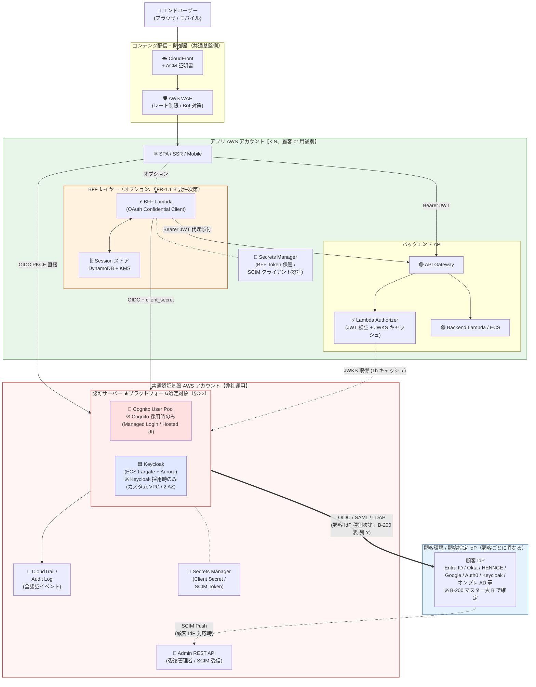
```mermaid
flowchart TB
    User["👥 エンドユーザー<br/>(ブラウザ / モバイル)"]

    subgraph CustomerEnv["顧客環境 / 顧客指定 IdP（顧客ごとに異なる）"]
        CustIdP["顧客 IdP<br/>Entra ID / Okta / HENNGE /<br/>Google / Auth0 / Keycloak /<br/>オンプレ AD 等<br/>※ B-200 マスター表 B で確定"]
    end

    subgraph CDN["コンテンツ配信 + 防御層（共通基盤側）"]
        CF["☁️ CloudFront<br/>+ ACM 証明書"]
        WAF["🛡️ AWS WAF<br/>(レート制限 / Bot 対策)"]
    end

    subgraph AuthAccount["共通認証基盤 AWS アカウント【弊社運用】"]
        direction TB
        subgraph AuthServer["認可サーバー ★プラットフォーム選定対象（§C-2）"]
            Cog["🔴 Cognito User Pool<br/>※ Cognito 採用時のみ<br/>(Managed Login / Hosted UI)"]
            KC["🟦 Keycloak<br/>(ECS Fargate + Aurora)<br/>※ Keycloak 採用時のみ<br/>(カスタム VPC / 2 AZ)"]
        end
        AdminAPI["📡 Admin REST API<br/>(委譲管理者 / SCIM 受信)"]
        CT["📝 CloudTrail /<br/>Audit Log<br/>(全認証イベント)"]
        Secrets_A["🔐 Secrets Manager<br/>(Client Secret /<br/>SCIM Token)"]
    end

    subgraph AppAccount["アプリ AWS アカウント【× N、顧客 or 用途別】"]
        direction TB
        SPA["⚛️ SPA / SSR / Mobile"]
        subgraph BFFLayer["BFF レイヤー（オプション、§FR-1.1 B 要件次第）"]
            BFFλ["⚡ BFF Lambda<br/>(OAuth Confidential Client)"]
            DDB["🗄️ Session ストア<br/>DynamoDB + KMS"]
        end
        subgraph BE["バックエンド API"]
            APIGW["🟣 API Gateway"]
            Authλ["⚡ Lambda Authorizer<br/>(JWT 検証 + JWKS キャッシュ)"]
            BEλ["🟢 Backend Lambda / ECS"]
        end
        Secrets_App["🔐 Secrets Manager<br/>(BFF Token 保管 /<br/>SCIM クライアント認証)"]
    end

    User --> CF
    CF --> WAF
    WAF --> SPA

    SPA -->|"OIDC PKCE 直接"| AuthServer
    SPA -.オプション.-> BFFλ
    BFFλ -->|"OIDC + client_secret"| AuthServer
    BFFλ <--> DDB
    BFFλ -.- Secrets_App

    AuthServer ==>|"OIDC / SAML / LDAP<br/>(顧客 IdP 種別次第、B-200 表 列 Y)"| CustIdP
    CustIdP -.SCIM Push<br/>(顧客 IdP 対応時).-> AdminAPI

    SPA -->|"Bearer JWT"| APIGW
    BFFλ -->|"Bearer JWT 代理添付"| APIGW
    APIGW --> Authλ
    APIGW --> BEλ
    Authλ -.JWKS 取得 (1h キャッシュ).-> AuthServer

    AuthServer --> CT
    AuthServer -.- Secrets_A

    style AuthAccount fill:#fff5f5,stroke:#cc0000
    style AppAccount fill:#e8f5e9,stroke:#2e7d32
    style CustomerEnv fill:#e3f2fd,stroke:#1565c0
    style BFFLayer fill:#fff3e0,stroke:#e65100
    style AuthServer fill:#fff0f0,stroke:#cc0000
    style Cog fill:#ffe0e0
    style KC fill:#e0e8ff
```

#### マーカー凡例

| マーカー | 意味 |
|---|---|
| **※ Cognito 採用時のみ** / **※ Keycloak 採用時のみ** | [§C-2 プラットフォーム選定](02-platform.md) 後に **どちらか一方** が確定 |
| **※ B-200 マスター表 B で確定** | [hearing-script B-2](../../hearing-script/02-idp-federation.md) の顧客 IdP リスト次第 |
| **※ §FR-1.1 B 要件次第** | [§FR-1.1](../fr/01-auth.md) の SPA 認証方式（BFF or PKCE 直接）次第。**オプション層**として点線で表現 |
| **※ 顧客 IdP 対応時** | 顧客 IdP の SCIM Provisioning 対応有無次第（[B-401](../../hearing-script/04-user-management.md)）|

#### 構成要素の役割（顧客 IT 担当向け 1-2 行解説）

| アカウント / 層 | 構成要素 | 役割 |
|---|---|---|
| **顧客環境** | 顧客 IdP | 顧客企業の認証基盤。本基盤と OIDC / SAML / LDAP でフェデレーション。顧客ごとに異なる |
| **共通基盤** | CloudFront + WAF | コンテンツ配信 + DDoS / Bot 防御。全顧客共通の入口 |
| 共通基盤 | **Cognito User Pool** / **Keycloak** | 認可サーバー。**選定対象**（[§C-2](02-platform.md)）。フェデ受信 + JWT 発行を担当 |
| 共通基盤 | Admin REST API | 委譲管理者 / SCIM 受信エンドポイント。顧客アプリ運用がユーザー CRUD に使用 |
| 共通基盤 | CloudTrail / Audit Log | 全認証イベントの監査ログ。法定保存期間に応じて S3 へ転送 |
| 共通基盤 | Secrets Manager | OAuth Client Secret / SCIM Token 等の機密情報を KMS で暗号化保管 |
| **アプリアカウント** | SPA / SSR / Mobile | エンドユーザーが操作するフロントエンド。各アプリ独自に実装 |
| アプリアカウント | **BFF Lambda（オプション）** | SPA の代わりに OAuth トークンを保管。XSS リスク低減（金融 / 医療等で推奨）|
| アプリアカウント | Session ストア（DynamoDB）| BFF 採用時の session_id ↔ token マッピング保管 |
| アプリアカウント | API Gateway | バックエンド API のエントリポイント。Lambda Authorizer で JWT 検証 |
| アプリアカウント | Lambda Authorizer | JWT 署名検証 + 認可コンテキスト構築。JWKS を 1 時間キャッシュ |
| アプリアカウント | Backend Lambda / ECS | 業務ロジック実装。認可判定（[§FR-6.0.A](../fr/06-authz.md) 意味 B）はここで行う |
| アプリアカウント | Secrets Manager（アプリ側）| BFF 用 Token / SCIM クライアント認証情報の保管 |

#### 議論用マーカー（顧客との詰めポイント）

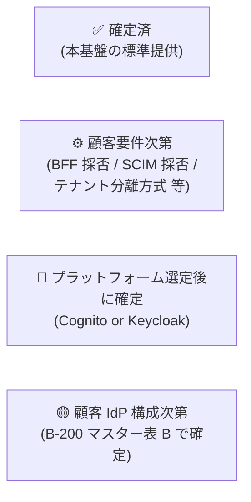
```mermaid
flowchart LR
    A["✅ 確定済<br/>(本基盤の標準提供)"]
    B["⚙️ 顧客要件次第<br/>(BFF 採否 / SCIM 採否 /<br/>テナント分離方式 等)"]
    C["🔵 プラットフォーム選定後に確定<br/>(Cognito or Keycloak)"]
    D["🟡 顧客 IdP 構成次第<br/>(B-200 マスター表 B で確定)"]
```

| 確定度 | 該当箇所 | 確定タイミング |
|---|---|---|
| ✅ **確定済**（本基盤標準提供）| CloudFront / WAF / Admin REST API / CloudTrail / Lambda Authorizer / JWT 検証経路 | 既定 |
| 🔵 **プラットフォーム選定後に確定** | Cognito User Pool or Keycloak（ECS + Aurora）| [§C-2](02-platform.md) 確定後（Phase D）|
| 🟡 **顧客 IdP 構成次第** | フェデ経路（OIDC / SAML / LDAP）、Identity Brokering の設定 | [B-200](../../hearing-script/02-idp-federation.md) マスター表 B 完成後 |
| ⚙️ **顧客要件次第（採否選択）** | BFF レイヤー / SCIM 受信 / DR 構成 / マルチリージョン | Phase B-C ヒアリング後 |

#### 詳細版へのリンク（プラットフォーム選定後）

本図はあくまで **要件定義フェーズの叩き台**。プラットフォーム選定後は以下の **本番想定構成図**に進化:

| 採用プラットフォーム | 詳細構成図 | 補足 |
|---|---|---|
| **Cognito** | [platform-architecture-patterns.md §2.1 Cognito 全体構成図](../../../common/platform-architecture-patterns.md) | Lambda Triggers / DR Account / 月額試算込み |
| **Keycloak OSS** | [platform-architecture-patterns.md §3.1 Keycloak OSS 全体構成図](../../../common/platform-architecture-patterns.md) | VPC / 2 AZ / Aurora / Internal ALB（Option B 完成形）|
| **Keycloak RHBK** | [platform-architecture-patterns.md §4.1 RHBK 構成パターン](../../../common/platform-architecture-patterns.md) | OSS との差分 + Red Hat サポート前提 |

#### ヒアリング時の使い方

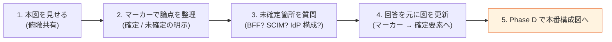
```mermaid
flowchart LR
    S1["1. 本図を見せる<br/>(俯瞰共有)"]
    S2["2. マーカーで論点を整理<br/>(確定 / 未確定の明示)"]
    S3["3. 未確定箇所を質問<br/>(BFF? SCIM? IdP 構成?)"]
    S4["4. 回答を元に図を更新<br/>(マーカー → 確定要素へ)"]
    S5["5. Phase D で本番構成図へ"]

    S1 --> S2 --> S3 --> S4 --> S5

    style S5 fill:#fff3e0,stroke:#e65100
```

→ **要件定義 → 本番構成**へ滑らかに進化する叩き台として使用。

---

### §C-1.2.C 代替アーキテクチャの比較（完全統合 / ハイブリッド / 完全分散）

> **このサブセクションで定めること**: §C-1.2 で示した「完全統合」を中心に、**3 つの代替アーキテクチャを構成図ベースで比較**。設計レビュー段階で提起された 6 つの懸念（SPOF / 過剰品質 / アプリ最適化放棄 / 個別変更困難 / 想定外対応 等）を踏まえ、それぞれの構造的特徴を可視化する。
> **主な判断軸**: SSO 維持 / 単一障害点リスク / アプリ最適化 / 過剰品質回避 / 個別要件変更 / 想定外アプリ対応の 6 観点。
> **§C-1.2 全体との関係**: §C-1.2 の構成図は「完全統合」を採用した場合の詳細。本サブセクションでは **3 つの選択肢を同じ視覚言語で並列**し、最終判断（[§C-6 アーキテクチャ判断](06-architecture-decision-hybrid.md)）の根拠資料とする。
> **§C-1.4 / §C-6 との関係**: §C-1.4（物理分離レベル）と §C-6（ハイブリッド推奨）の議論を、**4 つの全体構成図で 1 度に俯瞰**できる位置付け。

#### 図 A. 完全統合版（参考、現状の §C-1.2 簡略版）

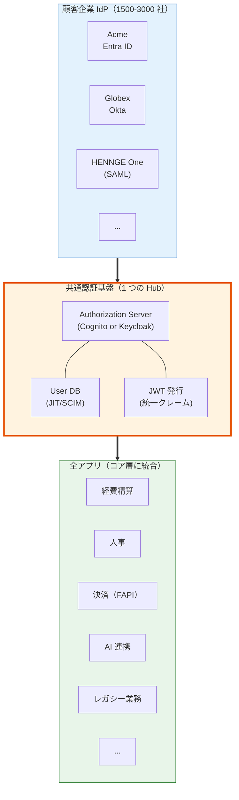
```mermaid
flowchart TB
    subgraph CustomerIdP_A["顧客企業 IdP（1500-3000 社）"]
        direction LR
        IdP_A1["Acme<br/>Entra ID"]
        IdP_A2["Globex<br/>Okta"]
        IdP_A3["HENNGE One<br/>(SAML)"]
        IdP_AN["..."]
    end

    subgraph Hub_A["共通認証基盤（1 つの Hub）"]
        direction TB
        AS_A["Authorization Server<br/>(Cognito or Keycloak)"]
        UD_A["User DB<br/>(JIT/SCIM)"]
        JWT_A["JWT 発行<br/>(統一クレーム)"]
        AS_A --- UD_A
        AS_A --- JWT_A
    end

    subgraph Apps_A["全アプリ（コア層に統合）"]
        direction LR
        APP_A1["経費精算"]
        APP_A2["人事"]
        APP_A3["決済（FAPI）"]
        APP_A4["AI 連携"]
        APP_A5["レガシー業務"]
        APP_AN["..."]
    end

    CustomerIdP_A ==> Hub_A
    Hub_A ==> Apps_A

    style Hub_A fill:#fff3e0,stroke:#e65100,stroke-width:3px
    style CustomerIdP_A fill:#e3f2fd,stroke:#1565c0
    style Apps_A fill:#e8f5e9,stroke:#2e7d32
```

**特徴**: 1 つの Hub に全アプリ統合、SSO は自動成立。
**強み**: SSO 自動、運用集約、セキュリティ baseline 統一。
**弱点**: SPOF（全アプリ依存）、最大公約数の過剰品質、変更困難、想定外アプリ対応不可、プラットフォーム選定が一発勝負。

---

#### 図 B. ハイブリッド版（コア統合 + エッジ自律）⭐ §C-6 推奨

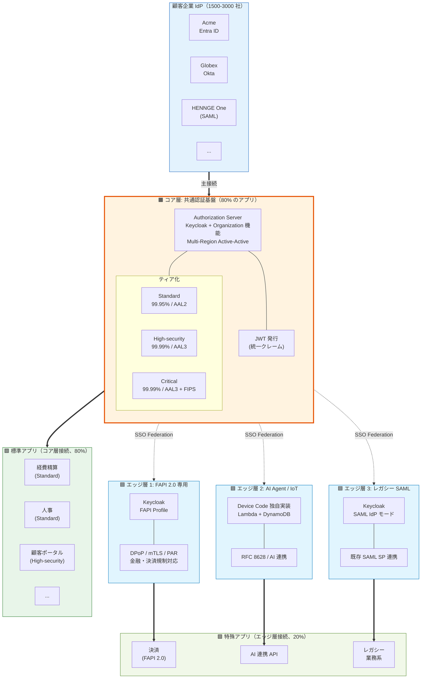
```mermaid
flowchart TB
    subgraph CustomerIdP_H["顧客企業 IdP（1500-3000 社）"]
        direction LR
        IdP_H1["Acme<br/>Entra ID"]
        IdP_H2["Globex<br/>Okta"]
        IdP_H3["HENNGE One<br/>(SAML)"]
        IdP_HN["..."]
    end

    subgraph Core["🟧 コア層: 共通認証基盤（80% のアプリ）"]
        direction TB
        CoreAS["Authorization Server<br/>Keycloak + Organization 機能<br/>Multi-Region Active-Active"]
        subgraph CoreTier["ティア化"]
            direction LR
            T1["Standard<br/>99.95% / AAL2"]
            T2["High-security<br/>99.99% / AAL3"]
            T3["Critical<br/>99.99% / AAL3 + FIPS"]
        end
        CoreJWT["JWT 発行<br/>(統一クレーム)"]
        CoreAS --- CoreTier
        CoreAS --- CoreJWT
    end

    subgraph EdgeFAPI["🟦 エッジ層 1: FAPI 2.0 専用"]
        direction TB
        Edge1AS["Keycloak<br/>FAPI Profile"]
        Edge1Note["DPoP / mTLS / PAR<br/>金融・決済規制対応"]
        Edge1AS --- Edge1Note
    end

    subgraph EdgeAI["🟦 エッジ層 2: AI Agent / IoT"]
        direction TB
        Edge2AS["Device Code 独自実装<br/>Lambda + DynamoDB"]
        Edge2Note["RFC 8628 / AI 連携"]
        Edge2AS --- Edge2Note
    end

    subgraph EdgeLegacy["🟦 エッジ層 3: レガシー SAML"]
        direction TB
        Edge3AS["Keycloak<br/>SAML IdP モード"]
        Edge3Note["既存 SAML SP 連携"]
        Edge3AS --- Edge3Note
    end

    subgraph StdApps["🟩 標準アプリ（コア層接続、80%）"]
        direction LR
        App_H1["経費精算<br/>(Standard)"]
        App_H2["人事<br/>(Standard)"]
        App_H3["顧客ポータル<br/>(High-security)"]
        App_H4["..."]
    end

    subgraph SpecApps["🟩 特殊アプリ（エッジ層接続、20%）"]
        direction LR
        App_HD["決済<br/>(FAPI 2.0)"]
        App_HE["AI 連携 API"]
        App_HF["レガシー<br/>業務系"]
    end

    CustomerIdP_H ==>|主接続| Core
    Core ==> StdApps

    Core -. SSO Federation .-> EdgeFAPI
    Core -. SSO Federation .-> EdgeAI
    Core -. SSO Federation .-> EdgeLegacy

    EdgeFAPI ==> App_HD
    EdgeAI ==> App_HE
    EdgeLegacy ==> App_HF

    style Core fill:#fff3e0,stroke:#e65100,stroke-width:3px
    style EdgeFAPI fill:#e1f5fe,stroke:#0277bd
    style EdgeAI fill:#e1f5fe,stroke:#0277bd
    style EdgeLegacy fill:#e1f5fe,stroke:#0277bd
    style CustomerIdP_H fill:#e3f2fd,stroke:#1565c0
    style StdApps fill:#e8f5e9,stroke:#2e7d32
    style SpecApps fill:#f1f8e9,stroke:#558b2f
```

**特徴**:
- **🟧 コア層**（オレンジ）: Keycloak 単一 Realm + Organization で 80% のアプリを統合。**3 ティア**で過剰品質回避
- **🟦 エッジ層**（水色）: 特殊要件アプリごとに独立した認証基盤。FAPI / AI Agent / レガシー SAML 等
- **太矢印（==>）**: 直接認証経路
- **点線矢印（<-.-->）**: SSO Federation（コア ↔ エッジで信頼関係を共有、ユーザーは 1 回ログイン）

**強み**: コア層内 SSO + エッジ Federation で SSO 維持 / ティア化で過剰品質回避 / エッジで最適化と想定外対応可 / SPOF 影響範囲を限定。
**弱点**: 運用 2 系統（コア + エッジ）/ Federation 設計の専門性必要 / ガバナンス強化必要。

**認証フロー例（決済アプリへのアクセス）**:
1. ユーザーが経費精算アプリにログイン（コア層で認証）→ コア層 SSO セッション確立
2. ユーザーが決済アプリにアクセス → エッジ FAPI 層に認証要求
3. エッジ FAPI 層は **コア層を IdP として Trust** → Federation Auth Request
4. コア層が既存セッション認識 → Assertion 発行
5. エッジ FAPI 層がエッジ独自 JWT（FAPI 準拠）を発行
6. ユーザーは **再ログイン不要で決済アプリ利用可**（SSO 成立）

---

#### 図 C-a. 完全分散版（純粋分散、各アプリ直接 IdP 接続）

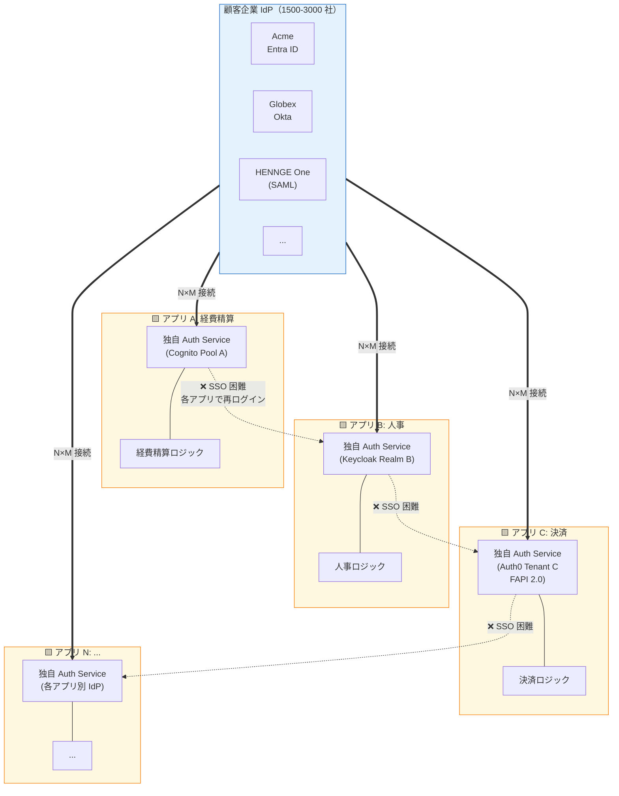
```mermaid
flowchart TB
    subgraph CustomerIdP_D["顧客企業 IdP（1500-3000 社）"]
        direction LR
        IdP_D1["Acme<br/>Entra ID"]
        IdP_D2["Globex<br/>Okta"]
        IdP_D3["HENNGE One<br/>(SAML)"]
        IdP_DN["..."]
    end

    subgraph AppA_D["🟨 アプリ A: 経費精算"]
        direction TB
        AuthA_D["独自 Auth Service<br/>(Cognito Pool A)"]
        App_DA1["経費精算ロジック"]
        AuthA_D --- App_DA1
    end

    subgraph AppB_D["🟨 アプリ B: 人事"]
        direction TB
        AuthB_D["独自 Auth Service<br/>(Keycloak Realm B)"]
        App_DB1["人事ロジック"]
        AuthB_D --- App_DB1
    end

    subgraph AppC_D["🟨 アプリ C: 決済"]
        direction TB
        AuthC_D["独自 Auth Service<br/>(Auth0 Tenant C<br/>FAPI 2.0)"]
        App_DC1["決済ロジック"]
        AuthC_D --- App_DC1
    end

    subgraph AppN_D["🟨 アプリ N: ..."]
        direction TB
        AuthN_D["独自 Auth Service<br/>(各アプリ別 IdP)"]
        App_DN1["..."]
        AuthN_D --- App_DN1
    end

    CustomerIdP_D ==>|N×M 接続| AuthA_D
    CustomerIdP_D ==>|N×M 接続| AuthB_D
    CustomerIdP_D ==>|N×M 接続| AuthC_D
    CustomerIdP_D ==>|N×M 接続| AuthN_D

    AuthA_D -. ❌ SSO 困難<br/>各アプリで再ログイン .-> AuthB_D
    AuthB_D -. ❌ SSO 困難 .-> AuthC_D
    AuthC_D -. ❌ SSO 困難 .-> AuthN_D

    style AppA_D fill:#fff8e1,stroke:#f57c00
    style AppB_D fill:#fff8e1,stroke:#f57c00
    style AppC_D fill:#fff8e1,stroke:#f57c00
    style AppN_D fill:#fff8e1,stroke:#f57c00
    style CustomerIdP_D fill:#e3f2fd,stroke:#1565c0
```

**特徴**: 各アプリが独自の認証基盤を持ち、顧客 IdP に直接接続。中央集約なし。

**強み**: アプリごと完全最適化 / SPOF なし / 変更完全自由。
**弱点**:
- 🔴 **N×M 接続爆発**: 顧客 IdP 1500 × アプリ 10 = **15,000 接続を保守**
- 🔴 **SSO 不成立**: 各アプリ独立 → ユーザーは各アプリで毎回ログイン
- 🔴 **運用人員 N 倍**: アプリチームごとに認証専門家が必要
- 🟡 **セキュリティ baseline drift**: 各アプリで MFA / パスワードポリシー等がバラバラ
- 🔴 **顧客 IdP 側負担増**: 顧客企業も 10 個の SAML/OIDC 接続を管理

→ **SSO 必須要件が満たせない**ため、御社の用途では事実上採用不可。

---

#### 図 C-b. 完全分散版（Federation Hub 経由で SSO 維持、Identity Mesh / Fabric 初期形態）

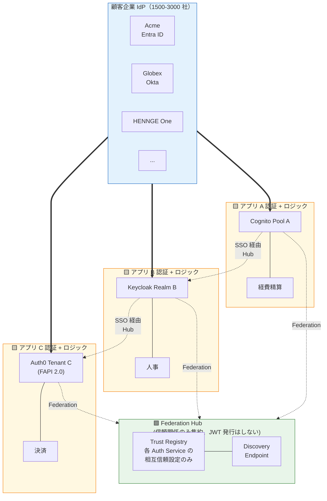
```mermaid
flowchart TB
    subgraph CustomerIdP_F["顧客企業 IdP（1500-3000 社）"]
        direction LR
        IdP_F1["Acme<br/>Entra ID"]
        IdP_F2["Globex<br/>Okta"]
        IdP_F3["HENNGE One"]
        IdP_FN["..."]
    end

    subgraph FedHub["🟩 Federation Hub<br/>(信頼関係のみ集約、JWT 発行はしない)"]
        Trust["Trust Registry<br/>各 Auth Service の<br/>相互信頼設定のみ"]
        Discovery["Discovery<br/>Endpoint"]
        Trust --- Discovery
    end

    subgraph AppA_F["🟨 アプリ A 認証 + ロジック"]
        AuthA_F["Cognito Pool A"]
        App_FA1["経費精算"]
        AuthA_F --- App_FA1
    end

    subgraph AppB_F["🟨 アプリ B 認証 + ロジック"]
        AuthB_F["Keycloak Realm B"]
        App_FB1["人事"]
        AuthB_F --- App_FB1
    end

    subgraph AppC_F["🟨 アプリ C 認証 + ロジック"]
        AuthC_F["Auth0 Tenant C<br/>(FAPI 2.0)"]
        App_FC1["決済"]
        AuthC_F --- App_FC1
    end

    CustomerIdP_F ==> AuthA_F
    CustomerIdP_F ==> AuthB_F
    CustomerIdP_F ==> AuthC_F

    AuthA_F -. Federation .-> FedHub
    AuthB_F -. Federation .-> FedHub
    AuthC_F -. Federation .-> FedHub

    AuthA_F -. SSO 経由<br/>Hub .-> AuthB_F
    AuthB_F -. SSO 経由<br/>Hub .-> AuthC_F

    style AppA_F fill:#fff8e1,stroke:#f57c00
    style AppB_F fill:#fff8e1,stroke:#f57c00
    style AppC_F fill:#fff8e1,stroke:#f57c00
    style CustomerIdP_F fill:#e3f2fd,stroke:#1565c0
    style FedHub fill:#e8f5e9,stroke:#2e7d32
```

**特徴**: Federation Hub で **JWT 発行はしないが、各 Auth Service の相互信頼**のみ集約。SSO を Hub 経由で維持。

**強み**: SSO 維持可 / アプリ最適化 / SPOF 影響は Hub 障害時のみ（既存セッションは継続）。
**弱点**: 各アプリ Auth Service の運用負荷は変わらず / Hub 設計が複雑 / セキュリティ baseline は各アプリ規約依存 / **業界実例少なく専門性ハードル高**（GakuNin / eduGAIN 等の学術連邦のみ）。

---

#### 4 構成の俯瞰比較表

| 観点 | A. 完全統合 | **B. ハイブリッド** ⭐ | C-a. 純粋分散 | C-b. Fed Hub 経由 |
|---|:-:|:-:|:-:|:-:|
| **認証基盤数** | 1 | コア 1 + エッジ N | N（各アプリ）| N + Hub |
| **顧客 IdP 接続** | 1 箇所に集約 | コア層 1 箇所に集約 | **N×M = 15,000** | Hub or 各アプリ |
| **SSO** | ✅ 自動 | ✅ コア自動 + エッジ Federation | ❌ 困難 | ✅ Hub 経由 |
| **SPOF 影響範囲** | 全アプリ | コアのみ（エッジ独立）| 各アプリ独立 | Hub 障害で新規 SSO 停止 |
| **アプリ最適化** | ❌ | ✅ エッジで可 | ✅ 完全 | ✅ 完全 |
| **過剰品質回避** | ❌ | ✅ ティア化 | ✅ | ✅ |
| **個別要件変更** | ❌ 困難 | ✅ エッジ自由 | ✅ 自由 | ✅ 自由 |
| **想定外アプリ対応** | ❌ | ✅ エッジで新規対応 | ✅ | ✅ |
| **運用人員** | 1 チーム | コアチーム + 限定的エッジ | **N チーム必須** | N チーム + Hub チーム |
| **業界実例** | Slack / Notion | **Auth0 / Microsoft / Okta** | 大手金融機関業務系 | GakuNin（学術連邦）|
| **御社規模（1500-3000 社）での適性** | △ | **◎ 推奨** | × | △（運用専門性必要）|

#### 視覚言語の凡例

- **🟧 オレンジ（共通認証基盤）**: 統合された認証基盤
- **🟦 水色（エッジ層）**: 特殊要件アプリの独自基盤
- **🟦 薄青（顧客 IdP）**: 顧客企業の認証基盤
- **🟩 緑（アプリ）**: バックエンドシステム
- **🟨 黄（独立認証付きアプリ）**: 分散版での自前 Auth + App セット
- **太矢印（==>）**: 直接認証経路
- **点線（<-.-->）**: Federation / 信頼関係

→ **詳細な根拠と推奨判断は [§C-6 アーキテクチャ判断: ハイブリッド統合の根拠と設計](06-architecture-decision-hybrid.md)** を参照。

---

### §C-1.2.C.1 Federation Hub の 5 つの実装パターンと SPOF 評価

> **このサブセクションが解消する誤解**: 「Federation Hub = SPOF」は**短絡的**。Hub の実装パターンには 5 種類あり、**Pattern A の設計なら SPOF を回避可能**。OIDC Federation 1.0（IETF）や SAML Federation（GakuNin / eduGAIN）は実際にこの設計を採用している。

#### 5 つの実装パターン分類

| パターン | Hub の役割 | 認証フローへの介在 | Hub 障害時の影響 | SPOF 度 | 業界実例 |
|---|---|---|---|---|---|
| **A. Metadata Registry のみ** | 信頼関係・公開鍵・エンドポイント情報を**公開のみ**（静的、署名済）| ❌ 介在しない | 既存キャッシュで継続稼働 / 新規 trust 追加のみ不可 | **🟢 低**（実質 SPOF フリー）| **OIDC Federation 1.0**（IETF）、**SAML Federation Metadata Aggregate** |
| **B. Discovery Service** | ユーザーに「どの IdP に行くか」を選択させる UI / API | ⚠ 初回のみ介在 | デフォルト動作・直接 URL アクセスで継続可 | **🟢 低-中** | **Shibboleth DS**、**eduGAIN Discovery** |
| **C. Runtime Federation Broker** | 認証要求を各 IdP に**リアルタイム転送・属性変換** | ✅ 常時介在 | クロスアプリ認証停止 | **🔴 中-高** | **AWS IAM Identity Center**（中央 SSO ポータル）、**Azure AD B2B** |
| **D. SLO Orchestrator** | 全アプリへログアウト通知配信（Back-Channel Logout 仲介）| 部分介在（ログアウト時のみ）| SLO 不成立（ログインは可）| **🟡 中**（SLO のみ）| **OIDC Back-Channel Logout (RFC 8417) hub** |
| **E. Central Token Service** | JWT 発行を集約 | ✅ 常時介在 | **全認証停止 = ほぼ完全統合と同等** | **🔴 高**（= 完全統合）| **Auth0 / Cognito の本来の動作**（これは Hub ではなく Token Issuer）|

#### パターン別の Hub 障害時動作詳細

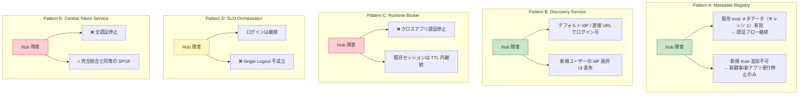
```mermaid
flowchart TB
    subgraph PA["Pattern A: Metadata Registry"]
        PAH["Hub 障害"]
        PAH --> PA1["既存 trust メタデータ（キャッシュ）有効<br/>→ 認証フロー継続"]
        PAH --> PA2["新規 trust 追加不可<br/>→ 新顧客/新アプリ受付停止のみ"]
    end

    subgraph PB["Pattern B: Discovery Service"]
        PBH["Hub 障害"]
        PBH --> PB1["デフォルト IdP / 直接 URL でログイン可"]
        PBH --> PB2["新規ユーザーの IdP 選択 UI 喪失"]
    end

    subgraph PC["Pattern C: Runtime Broker"]
        PCH["Hub 障害"]
        PCH --> PC1["❌ クロスアプリ認証停止"]
        PCH --> PC2["既存セッションは TTL 内継続"]
    end

    subgraph PD["Pattern D: SLO Orchestrator"]
        PDH["Hub 障害"]
        PDH --> PD1["ログインは継続"]
        PDH --> PD2["❌ Single Logout 不成立"]
    end

    subgraph PE["Pattern E: Central Token Service"]
        PEH["Hub 障害"]
        PEH --> PE1["❌ 全認証停止"]
        PEH --> PE2["= 完全統合と同等の SPOF"]
    end

    style PAH fill:#c8e6c9,stroke:#2e7d32
    style PBH fill:#c8e6c9,stroke:#2e7d32
    style PCH fill:#ffcdd2,stroke:#c62828
    style PDH fill:#fff9c4,stroke:#f57f17
    style PEH fill:#ffcdd2,stroke:#c62828
```

→ **A/B パターンなら SPOF は事実上ない**（キャッシュベース、設計が薄い）
→ **C-E パターンは SPOF**（程度の差はあるが）
→ **業界の標準 OIDC/SAML Federation は Pattern A/B 設計**

#### 既存図 C-b の精緻化（修正版位置付け）

前述の **図 C-b（Federation Hub 経由分散版）** は、デフォルト解釈では **Pattern C/D（runtime 関与あり）** として SPOF リスクのある図に見えるが、**Pattern A（metadata-only）として設計すれば SPOF フリー**にできる。後述 §C-1.2.C.2 の図 E（Metadata-only Federation Hub）が **同じ構造を SPOF フリー設計**で再描画したもの。

---

### §C-1.2.C.2 「分散 + SSO + SPOF フリー」を実現する 3 つの現実パターン

> **このサブセクションの狙い**: 「真に分散しつつ SSO 対応する」要件に対して、技術的に実装可能な 3 パターンを提示。各パターンの強み・弱み・御社規模での適性を客観的に評価する。

#### 図 D. パターン X: BYOI（Bring Your Own Identity）— 最もシンプル

**思想**: 各アプリが**顧客 IdP に直接 federation**。弊社側に Hub を一切持たない。顧客 IdP のセッションが SSO の Source of Truth。

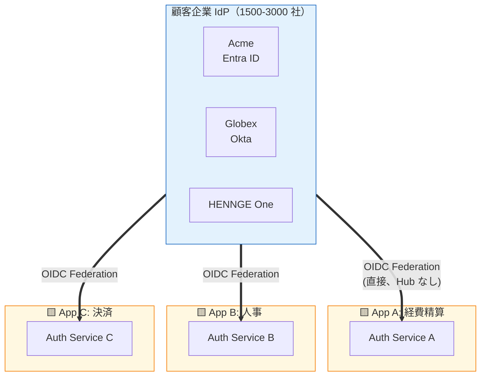
```mermaid
flowchart TB
    subgraph CustIdP_X["顧客企業 IdP（1500-3000 社）"]
        IdP_X1["Acme<br/>Entra ID"]
        IdP_X2["Globex<br/>Okta"]
        IdP_X3["HENNGE One"]
    end

    subgraph AppA_X["🟨 App A: 経費精算<br/>(Cognito Pool A)"]
        AuthA_X["Auth Service A"]
    end
    subgraph AppB_X["🟨 App B: 人事<br/>(Keycloak Realm B)"]
        AuthB_X["Auth Service B"]
    end
    subgraph AppC_X["🟨 App C: 決済<br/>(Auth0 FAPI)"]
        AuthC_X["Auth Service C"]
    end

    CustIdP_X ==>|"OIDC Federation<br/>(直接、Hub なし)"| AuthA_X
    CustIdP_X ==>|OIDC Federation| AuthB_X
    CustIdP_X ==>|OIDC Federation| AuthC_X

    style CustIdP_X fill:#e3f2fd,stroke:#1565c0
    style AppA_X fill:#fff8e1,stroke:#f57c00
    style AppB_X fill:#fff8e1,stroke:#f57c00
    style AppC_X fill:#fff8e1,stroke:#f57c00
```

**SSO 動作**: 顧客 IdP セッション再利用で全アプリ自動 SSO。ユーザーは 1 度顧客 IdP に認証すれば、各アプリで再認証なし。
**SPOF（弊社側）**: **ゼロ**（顧客 IdP の SPOF は元々顧客責任）
**業界実例**: 多数の小規模 SaaS で採用
**問題**: **N×M 設定爆発**（顧客 1500 × アプリ 10 = **15,000 federation 設定を保守**）

#### 図 E. パターン Y: Metadata-only Federation Hub（OIDC Federation 1.0 / SAML Federation）

**思想**: Hub は **trust metadata 公開のみ**（静的、署名済）。各アプリは metadata をキャッシュ、認証フローは直接。Hub は **runtime に介在しない**ため SPOF フリー。

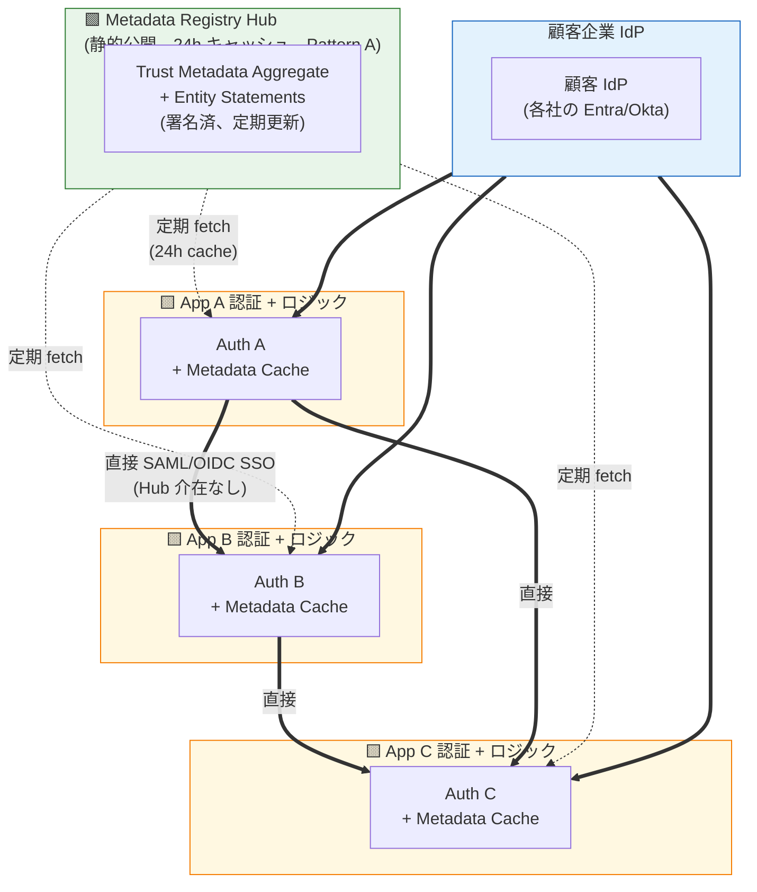
```mermaid
flowchart TB
    subgraph Hub_Y["🟩 Metadata Registry Hub<br/>(静的公開、24h キャッシュ、Pattern A)"]
        Meta_Y["Trust Metadata Aggregate<br/>+ Entity Statements<br/>(署名済、定期更新)"]
    end

    subgraph CustIdP_Y["顧客企業 IdP"]
        IdP_Y["顧客 IdP<br/>(各社の Entra/Okta)"]
    end

    subgraph AppA_Y["🟨 App A 認証 + ロジック"]
        AuthA_Y["Auth A<br/>+ Metadata Cache"]
    end
    subgraph AppB_Y["🟨 App B 認証 + ロジック"]
        AuthB_Y["Auth B<br/>+ Metadata Cache"]
    end
    subgraph AppC_Y["🟨 App C 認証 + ロジック"]
        AuthC_Y["Auth C<br/>+ Metadata Cache"]
    end

    Hub_Y -.定期 fetch<br/>(24h cache).-> AuthA_Y
    Hub_Y -.定期 fetch.-> AuthB_Y
    Hub_Y -.定期 fetch.-> AuthC_Y

    CustIdP_Y ==> AuthA_Y
    CustIdP_Y ==> AuthB_Y
    CustIdP_Y ==> AuthC_Y

    AuthA_Y ==>|"直接 SAML/OIDC SSO<br/>(Hub 介在なし)"| AuthB_Y
    AuthB_Y ==>|直接| AuthC_Y
    AuthA_Y ==>|直接| AuthC_Y

    style Hub_Y fill:#e8f5e9,stroke:#2e7d32
    style CustIdP_Y fill:#e3f2fd,stroke:#1565c0
    style AppA_Y fill:#fff8e1,stroke:#f57c00
    style AppB_Y fill:#fff8e1,stroke:#f57c00
    style AppC_Y fill:#fff8e1,stroke:#f57c00
```

**SSO 動作**: 各アプリ間で OIDC/SAML Federation で直接 SSO（App A → App B が IdP として trust）
**SPOF**: **実質ゼロ**（Hub down → キャッシュで継続、24h 後の metadata 更新が止まるだけ）
**業界実例**: **GakuNin（学術連邦）/ eduGAIN / OIDC Federation 1.0（IETF）**
**問題**: 顧客 IdP 接続は依然 N×M（Hub は信頼関係の集約のみ、顧客接続を集約しない）

#### 図 F. パターン Z: Pure Federation Mesh（完全相互信頼、Hub なし）

**思想**: Hub すらなく、各アプリが相互に IdP として trust。

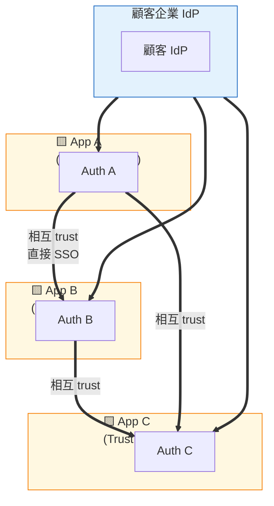
```mermaid
flowchart TB
    subgraph CustIdP_Z["顧客企業 IdP"]
        IdP_Z["顧客 IdP"]
    end

    subgraph AppA_Z["🟨 App A<br/>(Trust List: B, C)"]
        AuthA_Z["Auth A"]
    end
    subgraph AppB_Z["🟨 App B<br/>(Trust List: A, C)"]
        AuthB_Z["Auth B"]
    end
    subgraph AppC_Z["🟨 App C<br/>(Trust List: A, B)"]
        AuthC_Z["Auth C"]
    end

    CustIdP_Z ==> AuthA_Z
    CustIdP_Z ==> AuthB_Z
    CustIdP_Z ==> AuthC_Z

    AuthA_Z ==>|相互 trust<br/>直接 SSO| AuthB_Z
    AuthB_Z ==>|相互 trust| AuthC_Z
    AuthA_Z ==>|相互 trust| AuthC_Z

    style CustIdP_Z fill:#e3f2fd,stroke:#1565c0
    style AppA_Z fill:#fff8e1,stroke:#f57c00
    style AppB_Z fill:#fff8e1,stroke:#f57c00
    style AppC_Z fill:#fff8e1,stroke:#f57c00
```

**SPOF**: **完全ゼロ**
**業界実例**: **ほぼ存在しない**（理論上、研究実装のみ）
**問題**: **N×N trust 設定爆発**（10 アプリで 90 trust 関係、20 アプリで 380 trust 関係）+ 顧客 IdP 接続は依然 N×M

---

### §C-1.2.C.3 SSO 動作詳細（分散構成でのシーケンス図）

> **このサブセクションの狙い**: 分散構成（パターン X/Y/Z）で SSO がどう動くか、**ログイン / SLO / トークンリレーの 3 シナリオ**で詳細フローを示す。

#### シーケンス図 1: ログインフロー（SSO 成立シーン）

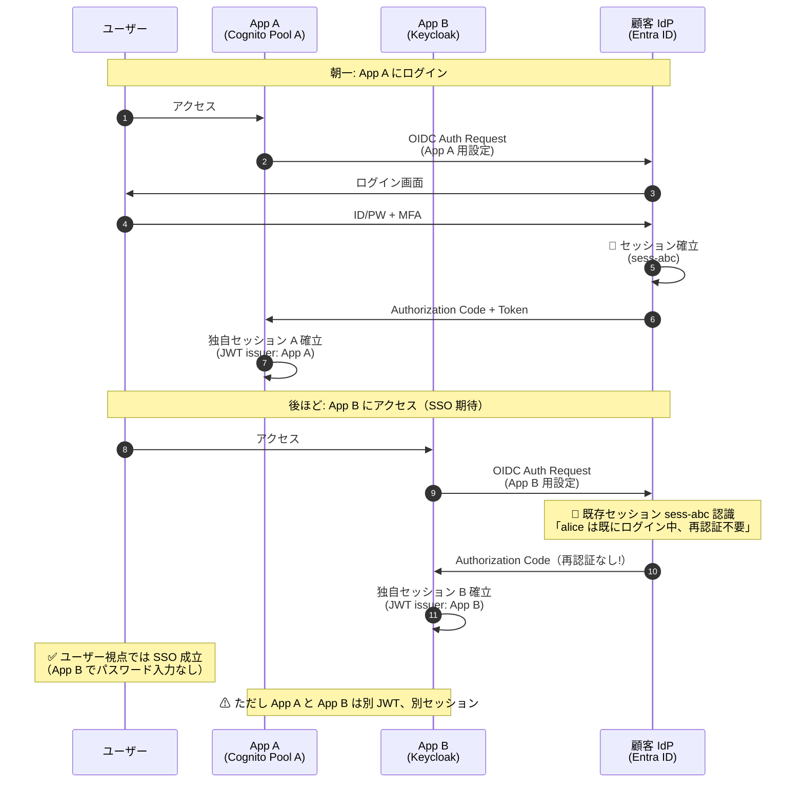
```mermaid
sequenceDiagram
    autonumber
    participant U as ユーザー
    participant AppA as App A<br/>(Cognito Pool A)
    participant AppB as App B<br/>(Keycloak)
    participant IdP as 顧客 IdP<br/>(Entra ID)

    Note over U,IdP: 朝一: App A にログイン
    U->>AppA: アクセス
    AppA->>IdP: OIDC Auth Request<br/>(App A 用設定)
    IdP->>U: ログイン画面
    U->>IdP: ID/PW + MFA
    IdP->>IdP: 🔵 セッション確立<br/>(sess-abc)
    IdP->>AppA: Authorization Code + Token
    AppA->>AppA: 独自セッション A 確立<br/>(JWT issuer: App A)

    Note over U,IdP: 後ほど: App B にアクセス（SSO 期待）
    U->>AppB: アクセス
    AppB->>IdP: OIDC Auth Request<br/>(App B 用設定)
    Note over IdP: 🔵 既存セッション sess-abc 認識<br/>「alice は既にログイン中、再認証不要」
    IdP->>AppB: Authorization Code（再認証なし!）
    AppB->>AppB: 独自セッション B 確立<br/>(JWT issuer: App B)

    Note over U: ✅ ユーザー視点では SSO 成立<br/>（App B でパスワード入力なし）
    Note over AppA,AppB: ⚠ ただし App A と App B は別 JWT、別セッション
```

→ **「ログイン時の SSO」は分散構成でも顧客 IdP セッションで成立する**。これは pattern X/Y/Z すべてで同じ。

#### シーケンス図 2: ログアウトフロー（SLO の現実）

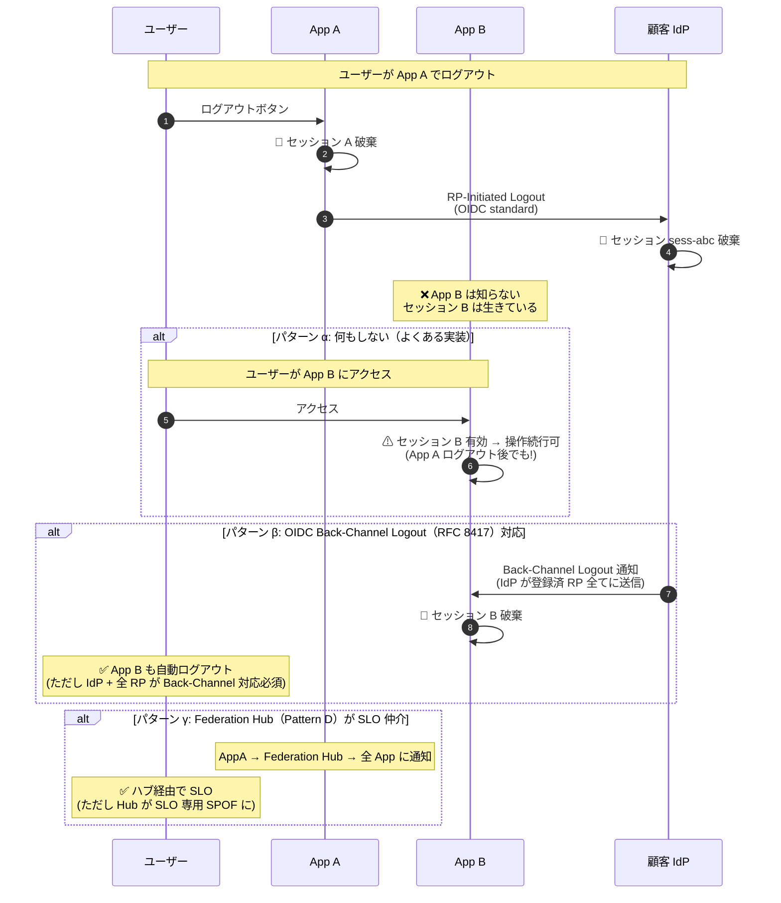
```mermaid
sequenceDiagram
    autonumber
    participant U as ユーザー
    participant AppA as App A
    participant AppB as App B
    participant IdP as 顧客 IdP

    Note over U,IdP: ユーザーが App A でログアウト
    U->>AppA: ログアウトボタン
    AppA->>AppA: 🔴 セッション A 破棄
    AppA->>IdP: RP-Initiated Logout<br/>(OIDC standard)
    IdP->>IdP: 🔴 セッション sess-abc 破棄

    Note over AppB: ❌ App B は知らない<br/>セッション B は生きている

    alt パターン α: 何もしない（よくある実装）
        Note over U,AppB: ユーザーが App B にアクセス
        U->>AppB: アクセス
        AppB->>AppB: ⚠ セッション B 有効 → 操作続行可<br/>(App A ログアウト後でも!)
    end

    alt パターン β: OIDC Back-Channel Logout（RFC 8417）対応
        IdP->>AppB: Back-Channel Logout 通知<br/>(IdP が登録済 RP 全てに送信)
        AppB->>AppB: 🔴 セッション B 破棄
        Note over U: ✅ App B も自動ログアウト<br/>(ただし IdP + 全 RP が Back-Channel 対応必須)
    end

    alt パターン γ: Federation Hub（Pattern D）が SLO 仲介
        Note over AppA: AppA → Federation Hub → 全 App に通知
        Note over U: ✅ ハブ経由で SLO<br/>(ただし Hub が SLO 専用 SPOF に)
    end
```

→ **SLO は分散構成では困難**。可能なのは：
- 顧客 IdP が **OIDC Back-Channel Logout（RFC 8417）対応** + 全アプリが対応 → 自動 SLO
- それ以外は **各アプリで個別ログアウト**必要

#### シーケンス図 3: クロスアプリトークンリレー（API 間呼び出し）の現実

```mermaid
sequenceDiagram
    autonumber
    participant U as ユーザー
    participant AppA as App A
    participant AppB_API as App B API

    Note over U,AppB_API: シナリオ: App A から App B の API を呼び出し
    U->>AppA: 操作
    AppA->>AppA: JWT A 持っている<br/>(issuer: App A's auth)

    AppA->>AppB_API: JWT A を Bearer ヘッダーで送信
    Note over AppB_API: ❌ JWT A は App A 用<br/>(issuer / audience 不一致)<br/>→ 検証失敗
    AppB_API-->>AppA: 401 Unauthorized

    Note over AppA,AppB_API: 解決策（完全分散では困難）
    Note over AppA: 1. App A のユーザーで再認証要求 → UX 悪化
    Note over AppA: 2. Token Exchange (RFC 8693) 必要 → 統合 or 専用基盤要
    Note over AppA: 3. Service Account でユーザー文脈喪失 → 監査不能
```

→ **クロスアプリ API 呼び出しは完全分散では事実上不可**（OIDC issuer 違いで JWT 受理不可）。Token Exchange (RFC 8693) には Token Issuer の統合が必要 = 結局 Hub 必要。

---

### §C-1.2.C.4 御社規模での評価とハイブリッドに行き着く理由

#### 3 パターン（X/Y/Z）の御社規模での適性

| 観点 | X. BYOI | Y. Metadata Hub | Z. Pure Mesh |
|---|:-:|:-:|:-:|
| **SPOF（弊社側）** | ✅ ゼロ | ✅ 実質ゼロ（キャッシュ）| ✅ 完全ゼロ |
| **SSO（ログイン）** | ✅ 顧客 IdP 経由 | ✅ Federation で直接 | ✅ 相互 trust で直接 |
| **SLO（全アプリログアウト）** | ⚠ IdP Back-Channel Logout 次第 | ⚠ 同上 + Federation 規約次第 | ❌ 各アプリ個別 |
| **クロスアプリトークンリレー** | ❌ 不可 | ❌ 不可 | ❌ 不可 |
| **属性一貫性** | ⚠ 各アプリ独自マッピング | ⚠ Federation 規約次第 | ⚠ 各アプリ独自 |
| **顧客 IdP 側負担** | 🔴 **N×M = 15,000 federation 設定** | 🔴 同上 | 🟢 一切ない |
| **アプリ間 trust 設定** | 不要 | M×M（10 アプリで 100）| **M×M = 100**（10 アプリ）/ **400**（20 アプリ）|
| **新規アプリ追加** | 各顧客 IdP に新規設定（1500 回）| 同上 + Hub に metadata 登録 | 全既存アプリの trust list 更新 |
| **新規顧客追加** | 各アプリで新規 federation 設定（M 回）| 同上 + Hub 登録 | 顧客 IdP 不要 |
| **業界実例** | 多数の小規模 SaaS | GakuNin / eduGAIN / OIDC Federation 1.0 | **ほぼ存在しない** |
| **御社規模適性** | △（N×M 爆発）| ⚠（Y 中規模なら OK、3000 顧客は厳しい）| × |

#### 御社規模 1500-3000 顧客での厳しい現実

| パターン | 設定総数 | 運用負荷 | 結論 |
|---|---|---|---|
| X. BYOI | **1500 顧客 × 10 アプリ = 15,000 federation 設定** | 顧客企業が「10 個のアプリ用 federation 設定」を各 IdP で管理 | **顧客側負担が破綻** |
| Y. Metadata Hub | 同上 + Hub metadata 管理 | 顧客側負担 + 弊社 Hub 運用 | 同上 |
| Z. Pure Mesh | アプリ 10-20 個なら 100-400 trust | アプリ間 trust は管理可能だが、依然顧客接続が課題 | **アプリ間は OK だが顧客接続が課題** |

→ **「真の分散 + SSO + SPOF フリー」は技術的には可能だが、御社規模では顧客側 N×M 設定が運用破綻**。

#### ハイブリッド版が現実解な理由（再確認）

御社規模で「分散 + SSO + SPOF フリー」を追求すると、結局以下に行き着く：

1. **顧客 IdP 接続の集約は必須**（N×M = 15,000 は管理不能）→ 中央点が必要
2. ただし**中央点を SPOF にしないため、Multi-Region Active-Active**で設計
3. **アプリ最適化は中央点と並列でエッジ層**で実現
4. **エッジ層は中央点と Federation で SSO 維持**

→ これは図 B（ハイブリッド版）**そのもの**。「分散したい」要望を真剣に追求すると、御社規模ではハイブリッドに収束する。

#### 分散指向の意思決定者向けの妥協案

完全分散にこだわる場合、以下の妥協案がある：

| 妥協案 | 内容 | 適用条件 |
|---|---|---|
| **小規模顧客に絞る** | 100 社程度ならパターン X が運用可能 | 事業規模を限定する判断 |
| **アプリ数を絞る** | 5 アプリ以下ならパターン Z が運用可能 | アプリ統合・廃止 |
| **顧客 IdP 接続だけ集約**（IdP Proxy）| 顧客 IdP 接続のみ集約、アプリ認証は分散（部分的ハイブリッド）| IdP Proxy 専用基盤の構築・運用が必要 |

→ 御社の事業計画次第。1500-3000 顧客 × 10+ アプリでの「真の分散」は技術的・運用的に成立しない。

#### 参考: 業界 Federation 標準の SPOF フリー設計

| 標準 / 実装 | パターン | Hub 障害時の動作 |
|---|---|---|
| **OIDC Federation 1.0**（IETF 2023〜）| A | Trust Anchor 障害時、各 Entity は cached Entity Statement で継続 |
| **SAML Metadata Aggregate**（eduGAIN）| A | 24h refresh cycle、Hub 障害時もキャッシュで継続 |
| **Shibboleth Discovery Service** | B | Hub 障害時、各 SP のデフォルト IdP または直接 URL でログイン可 |
| **AWS IAM Identity Center** | C/D | Hub 障害時、各 AWS サービスへのフェデレーションは停止 |
| **Auth0 Universal Login** | E | Auth0 障害時、全認証停止（= Token Issuer の SPOF）|

→ **OIDC/SAML の本格的な Federation 標準は Pattern A/B 設計**で SPOF を回避している。Pattern C-E は実質的に Token Issuer / Auth Service そのもので、それは「Hub」ではなく「中央認証基盤」。

#### 結論

| 質問 | 答え |
|---|---|
| Federation Hub は SPOF か? | **実装パターン次第**（Pattern A/B なら SPOF フリー、C-E は SPOF）|
| 分散構成で SSO 維持できるか? | **可能**（顧客 IdP セッション経由）|
| 御社規模 1500-3000 顧客で完全分散は実用的か? | **❌ 不可**（顧客側 N×M 設定が運用破綻）|
| 「分散 + SSO + SPOF フリー」を追求するとどうなるか? | **ハイブリッド版（図 B）に収束する** |

→ §C-6 の **ハイブリッド推奨は、分散思想を真剣に検討した結果としても合理的**。

---

### §C-1.2.D Bearer JWT / JWKS の標準動作と認可フロー種別の整理

> **このサブセクションの目的**: 構成図（§C-1.2 / §C-1.2.B）と認証フロー図（§C-1.2.A）に登場する「**Bearer JWT**」「**JWKS**」「**Lambda Authorizer**」の標準動作を明確化。あわせて「**認可フロー**」という用語が文脈で複数の意味を持つ問題を整理し、6 種類のフローをタグ付きで定義する。
> **主な判断軸**: 顧客 / アプリチームとの議論で「どのフローの話か」を機械的に識別できるよう、共通語彙を確立。
> **§C-1.2 全体との関係**: §C-1.2 の構成図に登場する矢印・データフローが「OAuth/OIDC 標準のどの動作か」を逆引きできる位置付け。

#### §C-1.2.D.1 認証・認可関連フロー 6 種類の整理表

| # | フロー名 | 内容 | 主役 | OAuth/OIDC 標準用語 | 本基盤での該当箇所 |
|:-:|---|---|---|---|---|
| 1 | **認証フロー**（Authentication Flow）| ユーザーが**誰か**を確認 + 識別 | 認証基盤 + 顧客 IdP | Authentication | §C-1.2 構成図、§FR-1.1 |
| 2 | **認可フロー（意味 A）**（Authorization Grant Flow）| OAuth 2.0 で **Token を発行する仕組み**（Authorization Code + PKCE 等）| 認証基盤（Authorization Server）| Authorization Grant | §FR-1.1 認証フロー一覧、マスター表 C 列 P |
| 3 | **トークン検証フロー**（Token Validation）| Bearer JWT の**署名・有効期限・audience 検証** | API Gateway + Lambda Authorizer | Token Validation | §C-1.2.B Lambda Authorizer、§C-1.2.A 図 4 |
| 4 | **認可判定フロー（意味 B）**（Resource Access Control）| tenant_id / roles から **リソースアクセス可否を判定** | アプリ Backend | Authorization Decision | §FR-6.0.A スタンス、Backend Lambda |
| 5 | **ログアウトフロー**（Logout Flow）| セッション終了、4 レイヤー（L1〜L4）| 認証基盤 + アプリ + 顧客 IdP | Logout / SLO（Single Logout）| §FR-5、B-701〜B-706 |
| 6 | **Federation フロー** | コア層 ↔ エッジ層 / 顧客 IdP 間の **トラスト連携** | 各認証層 | Federation | §C-1.2.C.2、§C-6 §6.4 |

#### §C-1.2.D.2 「認可フロー」の 2 つの意味（混同しやすい）

> **重要**: 「認可フロー」は OAuth / OIDC 文脈で **2 つの異なる意味**を持つため、議論時に必ず文脈を明示する。

| 「認可」の意味 | 何の話か | 担当者 | OAuth 用語 |
|---|---|---|---|
| **意味 A: 認可フレームワーク**（OAuth 2.0 そのもの）| **Token をどう発行するか**（フロー / プロトコル）| **認証基盤**（Authorization Server）| Authorization Grant Flow / OAuth Flow |
| **意味 B: 認可判定**（リソース保護）| **alice は /expense/123 にアクセスできるか?** | **各アプリ**（Resource Server）| Resource Access Control / Authorization Decision |

→ 本基盤のスタンス（[§FR-6.0.A](../fr/06-authz.md)）: **「意味 B の認可判定は各アプリの責務」**。本基盤は **意味 A の認可（Token 発行制御）** と **意味 B のための材料提供（クレーム / JWT 検証手段）** を担当。

#### §C-1.2.D.3 「API 認可フロー」の正確な分解（§C-1.2.B 構成図の動作）

§C-1.2.B 構成図に登場する `SPA → API Gateway → Lambda Authorizer → JWKS → Backend Lambda` の経路は、上記 6 種類のフローのうち **#3 + #4 をまたぐ複合フロー**：

```mermaid
sequenceDiagram
    autonumber
    participant SPA
    participant APIGW as API Gateway
    participant Authz as Lambda Authorizer
    participant Cache as Authorizer<br/>メモリキャッシュ
    participant Auth as 認証基盤<br/>(JWKS Endpoint)
    participant BE as Backend Lambda

    Note over SPA,BE: 前提: SPA は事前に #2 認可フロー（意味 A）<br/>で JWT を取得済み

    SPA->>APIGW: GET /api/expense<br/>Authorization: Bearer <JWT>
    APIGW->>Authz: 認可判定要求

    Note over Authz: ⓪ JWT のヘッダー解析<br/>kid = "abc123" 抽出

    alt 初回 or キャッシュ TTL 切れ（1h ごと）
        Authz->>Auth: ① GET /.well-known/jwks.json
        Auth->>Authz: JWKS（公開鍵リスト）
        Authz->>Cache: ② キャッシュ保存（1h）
    else キャッシュヒット（ほぼ毎回）
        Authz->>Cache: kid=abc123 の公開鍵取得<br/>(1ms 以下)
        Cache->>Authz: 公開鍵
    end

    Note over Authz: ③ #3 トークン検証フロー<br/>ローカルで JWT 署名検証<br/>(認証基盤に問い合わせ不要)<br/>+ exp / aud / iss / tenant_id 検証

    Authz->>APIGW: 検証 OK + 認可コンテキスト
    APIGW->>BE: API 呼び出し + 認可コンテキスト

    Note over BE: ④ #4 認可判定フロー（意味 B）<br/>tenant_id / roles から<br/>「alice は /expense/123 を編集可?」判定

    BE->>SPA: レスポンス
```

**推奨タイトル**: **「Bearer JWT による API 認可フロー」**（#3 トークン検証 + #4 認可判定の複合フロー）

#### §C-1.2.D.4 Bearer JWT とは

**Bearer JWT** は OAuth 2.0 標準（RFC 6750）の **トークン送信方式**：

- **Bearer Token** = 「持参者トークン」（持っていれば誰でも使える）
- **JWT** = JSON Web Token（認証基盤が発行した署名付き Token、RFC 7519）
- **送信方法**: HTTP Authorization ヘッダーに `Authorization: Bearer eyJhbGc...` の形式で添付

**JWT の中身（例）**:

```json
ヘッダー: { "alg": "RS256", "kid": "abc123", "typ": "JWT" }
ペイロード: {
  "iss": "https://auth.example.com",
  "sub": "alice@acme.com",
  "aud": "expense-api",
  "tenant_id": "acme",
  "roles": ["user", "approver"],
  "exp": 1717000000,
  "iat": 1716996400
}
署名: 認証基盤の秘密鍵で RS256 署名
```

→ アプリは JWT を見るだけで「誰が、どのテナント、どの権限で来ているか」が分かる（**self-contained / stateless**）。

#### §C-1.2.D.5 JWKS とは

**JWKS**（JSON Web Key Set、RFC 7517）= 認証基盤が発行する **公開鍵の一覧** を JSON 形式で公開する仕組み。

- Endpoint 例: `https://auth.example.com/.well-known/jwks.json`
- **目的**: API 側で JWT の署名を**ローカル検証**するために、認証基盤の公開鍵を取得
- **キャッシュ戦略**: 1 時間程度（KID 変更時のみ更新）

**JWKS の内容例**:

```json
{
  "keys": [
    {
      "kty": "RSA",
      "kid": "abc123",
      "use": "sig",
      "alg": "RS256",
      "n": "0vx7agoebGcQSuuPiL...",
      "e": "AQAB"
    }
  ]
}
```

#### §C-1.2.D.6 JWKS 方式 vs Token Introspection の選択

「API 側で JWT が本物か検証する」方式は 2 つあり、本基盤は **JWKS 方式（標準）** を採用：

| 観点 | **JWKS 方式（本基盤標準）** | Token Introspection（RFC 7662）|
|---|---|---|
| **認証基盤への通信頻度** | **初回 + 1h ごと**（実質キャッシュヒット）| **API 呼び出しの度** |
| **レイテンシ** | キャッシュヒット = 1ms 以下 | 毎回 50-200ms |
| **認証基盤負荷** | 軽（1h に 1 回 / アプリ）| 重（全 API リクエストの度）|
| **認証基盤の SPOF 影響** | **キャッシュ TTL 内は継続動作**（基盤障害でも 1h は耐える）| **基盤障害で全 API 停止** |
| **トークン即時失効** | ❌ TTL 内は失効不可 | ✅ 即座に反映 |
| **採用シーン** | 標準的な OAuth/OIDC API | 即時失効必須（[K8 Access Token Revocation](#c-12c1-federation-hub-の-5-つの実装パターンと-spof-評価) 等）|

→ **JWKS 方式は「分散検証 + 性能 + SPOF 影響緩和」の標準解**。Token Introspection は規制要件で即時失効必須な場合（[B-704 → K8](#c-12c1-federation-hub-の-5-つの実装パターンと-spof-評価)）にのみ採用。

#### §C-1.2.D.7 「Authorizer → JWKS」矢印の正しい解釈

§C-1.2.B 構成図の `Authλ -.JWKS 取得 (1h キャッシュ).-> AuthServer` 矢印について、**よくある誤解と正しい理解**：

| 誤解 | 正しい理解 |
|---|---|
| ❌ JWT 検証の度に認証基盤に問い合わせている | ✅ **公開鍵を取得するためのアクセス**。初回 + 1h ごとのみ、以降はオフライン検証 |
| ❌ Authorizer が SPOF を作っている | ✅ **キャッシュで吸収**、認証基盤障害時も 1h は継続動作可 |
| ❌ 全 API 呼び出しがクリティカルパスに認証基盤への通信を含む | ✅ **クリティカルパスは Authorizer ローカル完結**（JWKS は事前取得済） |
| ❌ 矢印が双方向矢印になっていない | ✅ **点線（-.->）が「常時通信ではない、キャッシュ前提」を意味**する |

→ **矢印の設計は正しい**、Bearer JWT + JWKS の標準動作を表現したもの。

#### §C-1.2.D.8 関連リファレンス

- [§FR-6.0.A 認可スタンス](../fr/06-authz.md): 「意味 B の認可判定はアプリ責務」
- [§FR-1.1 認証フロー](../fr/01-auth.md): Authorization Grant Flow（意味 A）の詳細
- [マスター表 C 補足 2 K8](../../hearing-script/01-auth-flow.md): Token Introspection が必要な場合（規制要件）
- [terms-and-codes-reference.md](../../terms-and-codes-reference.md): Bearer JWT / JWKS / Token Introspection 等の用語整理

---

## §C-1.3 採用しない代替パターン

> **このサブセクションで定めること**: 検討した代替パターン(Point-to-Point / Mesh / Identity Fabric / BYOI)と、**なぜ採用しないか**の整理。   
> **主な判断軸**: 各代替パターンの本プロジェクト要件への適合度   
> **§C-1 全体との関係**: §C-1.1 の Broker 採用判断を、**代替案を排除した結果**として補強

### 代替パターン 5 つの位置付け

| パターン | 位置付け | 採用判断 |
|---|---|:---:|
| **① Point-to-Point**(個別連携) | 各システム ↔ 各 IdP を直接連携 | ❌ **却下**(顧客追加で全システム改修必要、N×M 接続) |
| **② Federation Mesh** | 複数 Broker が相互信頼するメッシュ | △ **将来オプション**(大学連合 GakuNin / 政府間連邦の規模が必要) |
| **③ Identity Fabric**(KuppingerCole) | Broker + IGA / PAM / AM を統合した上位概念 | △ **将来発展形**(本基盤の Broker 採用後、段階的拡張可能) |
| **④ BYOI**(Bring Your Own Identity) | B2B SaaS で顧客が自社 IdP を持ち込む要件呼称 | ✅ **本基盤で実現**(Broker パターンが BYOI の実装手段) |
| **⑤ 各アプリ独自ローカル認証** | 各アプリが独自 Login UI + ユーザー DB + パスワード管理を持つ。共通基盤は OAuth/OIDC で連携する外部 IdP としてのみ動作 | ❌ **却下**(Broker パターン崩壊、SSO 不可、品質差、コンプライアンス重複。詳細: [§FR-1.2.0](../fr/01-auth.md#220-ローカルユーザー認証の主体--11-アーキテクチャと連動)) |

### 各代替パターンとの関係

```mermaid
flowchart TB
    subgraph Today["本基盤(現在)"]
        Broker["Broker パターン<br/>(採用)"]
    end

    subgraph Rejected["却下"]
        P2P["Point-to-Point<br/>N×M 接続地獄"]
    end

    subgraph FutureScope["将来の発展形(必要時に拡張)"]
        Fabric["Identity Fabric<br/>(IGA+PAM+AM 統合)"]
        Mesh["Federation Mesh<br/>(複数 Broker 連邦)"]
    end

    subgraph CustomerView["顧客視点の呼称"]
        BYOI["BYOI<br/>(Broker パターンの実現)"]
    end

    Broker -.将来拡張.-> Fabric
    Broker -.大規模時.-> Mesh
    Broker --実現手段--> BYOI

    style Broker fill:#fff3e0,stroke:#e65100
    style P2P fill:#fff0f0,stroke:#cc0000
```

### 各代替パターンを採用しない理由

**① Point-to-Point(却下)**
- N×M(顧客数 × システム数)の接続が爆発
- 顧客追加で全システム改修が必要
- テスト範囲が膨大
- 基本方針「効率よく」「運用負荷低」と真逆

**② Federation Mesh(将来検討、現状は不要)**
- 複数 Broker が相互信頼する大規模連邦
- 採用ケース:大学連合(学術認証 GakuNin / eduGAIN)、政府間連邦
- 本プロジェクトの想定規模(顧客 100〜1000 社)では過剰
- 将来基盤が複数拠点・複数組織に拡張する場合に検討

**③ Identity Fabric(将来発展形)**
- KuppingerCole 提唱の新世代 IAM 統合概念
- Broker(本基盤) + IGA(Identity Governance) + PAM(Privileged Access) + AM(Access Management)の統合
- 本基盤は Identity Fabric の **Foundation** に位置付けられる
- 将来 IGA / PAM を追加導入する場合の自然な発展経路

**④ BYOI(実は採用)**
- 「顧客が自社 IdP を持ち込める」という**要件側の呼称**
- 実装手段としての Broker パターンとイコール
- 本基盤は BYOI の標準実装と言える

**⑤ 各アプリ独自ローカル認証(却下)**
- 各アプリが独自 Login UI + ユーザー DB + パスワード管理を持つ
- 共通基盤は外部 IdP として OAuth/OIDC で連携のみ
- 却下理由:
  - **Broker パターンの本質崩壊**: 集約点が消え、issuer が各アプリに分散
  - **SSO 不可能**: 同じユーザーがアプリ A と B で別認証セッション
  - **セキュリティの品質差**: パスワードハッシュ・MFA・侵害検出が各アプリで個別実装 → 最弱アプリが全体の天井
  - **コンプライアンス対応重複**: GDPR / SOC 2 / ISO 27001 を全アプリで個別対応必要
  - **退職時 deprovision 漏れリスク**: 基盤 1 回 → 全アプリ反映、にならない
  - **コスト**: 認証 UI / DB / バックエンドを N アプリ分実装
- 詳細評価と却下理由: [§FR-1.2.0 ローカルユーザー認証の主体](../fr/01-auth.md#220-ローカルユーザー認証の主体--11-アーキテクチャと連動)
- ただし **既存システム移行期間中の暫定運用（C 案ハイブリッド）は例外的に許容**（§FR-1.2.0 参照）

---

## §C-1.4 物理分離レベルと Broker パターンの関係

> **このサブセクションで定めること**: 「テナント分離をどこまで物理的に行うか」という顧客との議論において、**物理分離を強めるほど Broker パターンが成立しなくなる**という構造的トレードオフを明示。   
> **主な判断軸**: 顧客が要求する分離レベル（論理 / 物理ハイブリッド / 完全物理）  
> **§C-1 全体との関係**: §C-1.1 で採用した Broker パターンが、**どこまでの分離要求と両立するか**の境界線を示す。§FR-2.3.A.2（IdP なし顧客の選択肢）と §C-1.3（採用しない代替）と地続きの議論。

### §C-1.4.0 用語前提: Realm（Keycloak）≈ User Pool（Cognito）= 認証境界

物理分離の議論の前に、**Keycloak Realm と Cognito User Pool は同列に語れる概念**であることを明確化する。両者ともユーザー / 外部 IdP / クライアントを内包する独立した認証単位（tenancy boundary）。

| 概念 | Keycloak | Cognito | 説明 |
|---|---|---|---|
| **認証境界** | **Realm** | **User Pool** | 独立した認証単位、境界をまたぐ SSO は自動成立しない |
| **アプリ登録単位** | Client | App Client | 個別アプリ（expense-app / payment-app 等）の設定 |
| **SSO 範囲** | Realm 内のクライアント間で自動成立 | Pool 内の App Client 間で自動成立 | この境界が「分離の単位」になる |
| **外部 IdP 接続** | Realm 内 IdP | Pool 内 IdP | 顧客 IdP を Federation 接続する |

#### 階層構造の例

```
Keycloak Realm "shared"                Cognito User Pool "shared-pool"
├── Users（ローカルユーザー）           ├── Users
├── Identity Providers                ├── Identity Providers
│   ├── acme-entra-id                 │   ├── acme-entra-id
│   └── globex-okta                   │   └── globex-okta
├── Clients                           ├── App Clients
│   ├── expense-app                   │   ├── expense-app
│   ├── payment-app                   │   ├── payment-app
│   └── hr-app                        │   └── hr-app
└── Sessions                          └── Hosted UI
```

→ 以下 L1〜L6 の「分離」とは、**この Realm/Pool（認証境界）の単位をどう設けるか**の選択を指す。

#### よくある誤解への即答

| 誤解 | 訂正 |
|---|---|
| **「Realm をアプリ単位で分けるべき?」** | ❌ 非推奨。アプリ間 SSO が完全に失われる = SSO 基盤の意味なし。アプリは **Client（同一 Realm 内）** として登録するのが正しい単位 |
| **「Realm を顧客（IdP）単位で分けることはできないのでは?」** | ✅ 可能。それが **L3 物理分離**。同一 Realm 内のアプリ間で SSO は成立するため、「顧客 acme のユーザーが acme の全アプリで SSO」は実現できる |
| **「全顧客 L3 にすれば最も安全」** | ⚠ Identity Broker パターン崩壊、N×M Client 登録、Cognito Custom Domain 4 個 Hard Limit、設定ドリフト等の重大デメリット |

### 「全部物理分離 = Broker パターン採用不可」の理解は概ね正しい

顧客から **「テナントごとに完全に物理的に分離してほしい」** という要求が出た場合、これは構造的に Broker パターンを放棄することと等価。理由は明確で:

- **Broker = 単一 Hub で issuer / 属性正規化 / JWT 発行を集約する**ことが本質
- すべて物理分離するということは **Hub が顧客数ぶん必要** = もはや Hub ではなく N 個の独立基盤
- 各システム（RP）が検証する issuer も顧客数ぶんになり、§FR-2.3.2「顧客追加で各システム変更不要」が崩壊
- → **Broker パターン採用の構造的必然性（§C-1.1）が消失** = 共通認証基盤を構築する意味そのものがなくなる

### 物理分離の 6 段階グラデーション

実際には「論理 ↔ 物理」は二者択一ではなく、**6 段階のグラデーション**で考えるべき。

```mermaid
flowchart LR
    L1["L1<br/>完全集約<br/>(単一 Pool+IdP)"]
    L2["L2<br/>論理分離<br/>(単一 Pool+<br/>複数 IdP)"]
    L3["L3<br/>ハイブリッド<br/>(規制顧客のみ<br/>別 Pool/Realm)"]
    L4["L4<br/>階層 Broker<br/>(子 Broker を<br/>顧客側に)"]
    L5["L5<br/>Federation Mesh<br/>(複数 Broker<br/>相互信頼)"]
    L6["L6<br/>完全分散<br/>(顧客ごと独立基盤)"]

    L1 --> L2 --> L3 --> L4 --> L5 --> L6

    style L2 fill:#fff3e0,stroke:#e65100
    style L3 fill:#fff3e0,stroke:#e65100
    style L1 fill:#ffe0e0,stroke:#cc0000
    style L6 fill:#ffe0e0,stroke:#cc0000
```

### 各レベルの特性比較

| Lv | 名称 | 物理分離の範囲 | Broker パターン互換性 | 実装難度 | 採用事例 |
|:---:|---|---|:---:|:---:|---|
| L1 | 完全集約 | 顧客ごと IdP も持たない（基盤内ローカルユーザーのみ）| ◎ Broker が最大価値 | 低 | 単一テナント SaaS |
| **L2** | **論理分離（標準）** | 単一 Pool/Realm + 複数 IdP + `tenant_id` クレーム | ◎ **Broker の標準形** | 中 | **Slack / Notion / Linear / Box** |
| **L3** | **ハイブリッド** | 規制業種顧客のみ別 Pool/Realm（金融・医療等）+ 一般顧客は L2 | ○ **Broker を顧客カテゴリ別に複数化** | 中〜高 | **Auth0 Private Cloud / Microsoft Entra GCC / Okta Custom Cell** |
| L4 | 階層 Broker | Hub Broker の下に顧客側 Broker を配置 | △ Broker 多段化 | 高 | 大企業内グループ会社統合 |
| L5 | Federation Mesh | 完全独立した複数 Broker が相互信頼 | △ Broker の連邦化（§C-1.3） | 極めて高 | GakuNin（学術認証）/ eduGAIN / 政府間連邦 |
| L6 | 完全分散 | 顧客ごとに完全独立した認証基盤 | ✗ **Broker 不成立** | 不要（基盤要らず）| **オンプレ個別構築 / 顧客自前運用** |

→ **L1 と L6 は Broker パターンの否定**（前者は「集約しすぎて顧客 IdP なし」、後者は「分散しすぎて Hub なし」）。**L2-L3 が現実解**。

### 業界の実例で見る分離レベル

| 企業 / サービス | 採用レベル | 内容 |
|---|:---:|---|
| **Slack** | **L2** | 単一 Pool + Workspace ごとの IdP 接続 + ワークスペース ID で分離 |
| **Notion** | **L2** | 単一 Pool + Workspace SSO + workspace_id で分離 |
| **Linear** | **L2** | 単一 Pool + SAML / SCIM 接続 + organization_id |
| **Box** | **L2** | 単一基盤 + Enterprise SSO + enterprise_id |
| **Auth0 Private Cloud** | **L3** | 標準は共有テナント / 規制業種は専用 Private Cloud（別 Pool）|
| **Microsoft Entra GCC / GCC-High / DoD** | **L3** | 一般顧客は共有 Entra ID / 米政府機関は GCC（別物理クラスタ）|
| **Okta Custom Cell** | **L3** | 標準は Shared Cell / 高セキュリティ顧客は Dedicated Cell |
| **AWS GovCloud** | **L3** に近い | リージョン物理分離（同じ Cognito だが別エンドポイント）|
| **GakuNin（学術認証）** | **L5** | 各大学が独立した Broker を持ち、相互信頼でメッシュ化 |

→ **業界のメインストリームは L2 標準 + L3 オプション**。L1（完全集約のみ）も L6（完全分散のみ）も実用ベンダーには見当たらない。

### 顧客が「全部物理分離」と言うときの本当のニーズ

顧客の「物理分離してほしい」要求は、多くの場合は以下のいずれか（または組み合わせ）で、**L6 の完全分離を求めているわけではない**ことが多い。

| 顧客の表現 | 真のニーズ | 対応レベル |
|---|---|:---:|
| 「他社とパスワードが同じ DB にあるのは嫌」 | パスワードハッシュの DB 同居回避 | **§FR-2.3.A.2 D 案ハイブリッド**（IdP 化）で L2 のまま解決可 |
| 「監査時に他社データに触れない構成にしたい」 | 監査スコープ限定 | **L3 ハイブリッド**（規制顧客のみ別 Pool / Realm）|
| 「データ主権上、別国・別リージョンに置きたい」 | リージョン分離 | **L3 ハイブリッド**（リージョン別 Pool）|
| 「マルチテナント脆弱性（CVE）の影響を分離したい」 | Blast radius 限定 | **L3 ハイブリッド** + テナントごと暗号鍵分離 |
| 「他社と同じソフトを使うのが信用上 NG」 | 専有環境の見え方 | **L3 ハイブリッド** or **Dedicated Cell 提案** |

→ **本当に L6 を要求しているケースはほぼない**。L3 のハイブリッドで多くの分離ニーズは満たせる。

### 「全部物理分離」を要求された場合の本基盤の立場

| 本基盤の立場 | 内容 |
|---|---|
| **基本: L2 を標準提供** | 単一 Pool/Realm + 複数 IdP（[§FR-2.3.A](../fr/02-federation.md#33a-アーキテクチャ判断単一-poolrealm--複数-idp-を採用)） |
| **オプション: L3 を選択肢に** | 規制業種顧客 / 大口顧客のみ別 Pool / Realm を提供（追加料金）|
| **顧客が L6 を強硬に求める場合** | **本基盤の対象外**。顧客自前運用 or 個別 SI 案件として扱う（Broker 価値が消えるため）|
| **L4 / L5 への発展** | 将来 M&A / 子会社統合 / 業界連合の規模になった場合に検討（[§C-1.3](#§c-13-採用しない代替パターン)）|

### 結論

> **「全部物理分離」= Broker パターン放棄 = 本基盤の存在価値消失**、という構造的事実は顧客に明示すべき。  
> 実務上は **L2（論理分離）を標準**とし、**L3（規制顧客のみハイブリッド物理分離）をオプション**として提供する形が業界標準であり、本基盤の方針。  
> 顧客の「物理分離」要望は、**真のニーズを掘って [§FR-2.3.A.2](../fr/02-federation.md#33a2-idp-なし顧客のユーザー管理) の 4 オプション（A〜D）や L3 で満たせるか**を最初に検討する。

### TBD / 要確認

| 確認項目 | 回答例 |
|---|---|
| 標準提供レベルは L2 で合意できるか | 合意 / 別案 |
| L3（規制顧客向け別 Pool）の提供範囲 | 全顧客対応 / 一定規模以上のみ / 提供しない |
| L6 を求める顧客の扱い | 対象外 / 個別 SI / 顧客自前運用支援 |
| 「物理分離」要求顧客への真のニーズヒアリング手順 | ヒアリングテンプレ化 / 営業判断 |

---

## §C-1.5 規模スケーリング戦略（1500-3000 顧客企業）

> **このサブセクションで定めること**: 顧客企業数（テナント数）が **1500-3000 規模** になった場合の、L2 論理分離の維持可否と Hard Limit 抵触対策。**A-15（顧客企業数）** との連動章。
> **主な判断軸**: Cognito Hard Limit（IdP per Pool、Custom Domain）の抵触判定、Keycloak 単一 Realm の運用限界。

### §C-1.5.0 規模を聞く理由

**MAU（A-1/A-2）とは別軸**で、**顧客企業数（テナント数 = IdP 接続数）** が **Cognito Hard Limit に直接抵触**する。MAU が小さくても顧客企業が 1500 社あれば Cognito 単一 Pool は不可。事業計画に応じた **5 年後想定** まで把握することで、初期設計段階で **スケール戦略** を組み込む。

### §C-1.5.1 Cognito Hard Limit と顧客企業数の関係

#### 主要な Hard Limit（2026 時点）

| リソース | デフォルト上限 | 引き上げ可否 | 1500-3000 顧客時の影響 |
|---|---:|---|---|
| **Identity Providers per User Pool** | 1,000 | ⚠ 引き上げ要相談（実質ハード）| 単一 Pool では **不足**（1500 で抵触）|
| **SAML IdPs per User Pool**（実質）| 約 50-100 | 個別案件 | **HENNGE / ADFS / 国内 IDaaS が 100 社超で抵触** |
| **User Pools per AWS account per Region** | 1,000 | ✅ 引き上げ可 | 3000 顧客分けても OK（10-30 Pool で済む）|
| **Custom Domain per Region** | **4** | ❌ **完全ハード** | Pool ごとに別 Domain にすると 4 Pool で詰む |
| **App Clients per User Pool** | 10,000 | ✅ 引き上げ可 | 余裕あり |
| **AdminCreateUser API** | 50 RPS | ✅ 引き上げ可 | バルクインポート時注意 |
| **M2M Token endpoint** | 150 RPS | ✅ 引き上げ可 | 大規模バッチ時注意 |

→ **問題は IdP 上限（特に SAML）と Custom Domain 4 個 Hard Limit**。

#### Cognito 採用時の Pool 分割戦略（変形 L2）

**Pool あたり 100-200 顧客が現実解**：

```
本基盤 Cognito（事業者 AWS アカウント）
├── User Pool "shared-cohort-01"（顧客 1-100、SAML 80 + OIDC 20）
│   ├── 100 IdP
│   └── App Clients: expense / payment / hr ...
├── User Pool "shared-cohort-02"（顧客 101-200）
│   └── 100 IdP
├── ...（15-30 Pool）
└── 共通 Custom Domain: auth.example.com（Path で Pool ルーティング、Lambda@Edge）
```

**運用上の課題**：
- **Custom Domain 4 個 Hard Limit**: Pool ごとに別 Domain にすると 4 Pool 目で詰む
  - 対策 1: **共通 Domain + Path で Pool ルーティング**（Lambda@Edge / API Gateway で Pool ID 判定）
  - 対策 2: **複数リージョンに分散**（4 Pool × 4 リージョン = 16 Pool まで、さらに複雑）
- **アプリ側**: 30 Pool それぞれに App Client 登録 = **30 個の issuer 検証**ロジック（Lambda Authorizer で multi-issuer 対応必須）
- **顧客振り分けロジック**: HRD（メールドメイン → どの Pool か）の実装が必要
- **Pool 間 SSO**: ❌ 不成立（顧客またぎの SSO は B2B では不要）

→ **これは「変形 L2」**。論理分離の思想は維持しつつ、Cognito 制約で物理的に複数 Pool に分かれる。

### §C-1.5.2 Keycloak の Limit と顧客企業数の関係

| リソース | 上限 | 1500-3000 顧客時の評価 |
|---|---|---|
| **Realm 数** | 実質無制限（PostgreSQL DB 性能依存）| 単一 Realm で対応推奨 |
| **Identity Providers per Realm** | 実質無制限（数千 OK）| ✅ 1500-3000 IdP 可能 |
| **Clients per Realm** | 実質無制限（万 OK）| ✅ 余裕 |
| **Users per Realm** | 数千万（適切な DB 設計）| 全顧客総ユーザー数次第 |
| **Organizations per Realm**（26+）| 実質無制限 | ✅ 1500-3000 Organization OK |

#### Keycloak 採用時の構成（Organization 機能活用）

```
Realm "shared"（1 つだけ）
├── Organizations: 1500-3000（顧客企業ごとに 1 Organization）
├── Identity Providers: 1500-3000
├── Clients: 10〜30 程度（全アプリ）
└── 単一 Custom Domain: auth.example.com（顧客数によらず 1 つで OK）
```

**メリット**：
- **Custom Domain は 1 つで完結**（Cognito の Hard Limit 問題なし）
- **Identity Broker パターン完全成立**（各アプリは Realm 1 つだけを Trust）
- **アプリ追加は 1 回**（全顧客で利用可能）
- **顧客追加は IdP + Organization 登録 1 回**

**留意点**：
- **Admin Console** で 3000 IdP 一覧表示は重い → **Organization 単位での管理**で UX 向上
- **DB チューニング**: PostgreSQL の indexing、Realm cache size 設定が必要
- **JWKS endpoint キャッシュ**: アプリ側で適切にキャッシュ（5 分等）すれば認証レイテンシ問題なし

### §C-1.5.3 プラットフォーム比較（1500-3000 顧客規模）

| 観点 | **Cognito**（複数 Pool 分割必須）| **Keycloak**（単一 Realm + Organization）|
|---|---|---|
| **Pool/Realm 数** | **15-30 Pool**（cohort 別、100-200 顧客/Pool）| **1 Realm**（Organization 機能で論理分割）|
| **Custom Domain** | 4 Pool しか持てない → Path ルーティング or 複数リージョン | **共通 1 つ**で全 3000 顧客カバー |
| **アプリ追加コスト** | 各 Pool に App Client 登録（**15-30 回**）| **1 回**で完結 |
| **顧客追加コスト** | どの Pool に入れるか判定 + 登録 | **Organization + IdP 登録 1 回** |
| **Identity Broker パターン** | ⚠ 部分崩壊（multi-issuer Lambda Authorizer で吸収）| **✅ 完全成立** |
| **運用画面操作性** | Pool ごとに Console 切替 | Organization 単位で集約管理（26+）|
| **DB 設計負荷** | AWS マネージドで不要 | PostgreSQL チューニング必要 |
| **リスク** | **SAML IdP Hard Limit に確実に抵触** | DB / Cache チューニング失敗時の性能劣化 |
| **本基盤での評価** | **規模が大きいほど不利**（運用複雑化）| **規模が大きいほど有利**（単一 Realm で対応）|

→ **1500-3000 顧客規模では Keycloak が圧倒的に有利**（Cognito 採用時は Pool 分割の運用負荷が顕著に重い）。

### §C-1.5.4 認証性能（per-request 性能）

総顧客数とは別に、**1 回の認証リクエストあたりの性能**：

| 観点 | 影響 | 顧客数依存 |
|---|---|---|
| **JWT 発行レイテンシ** | 100-300ms（標準）| ❌ 顧客数に依存しない |
| **JWKS 検証**（アプリ側）| キャッシュで 1ms 以下 | ❌ 依存しない |
| **HRD 解決**（メールドメイン → IdP）| 1-10ms（DB ルックアップ）| ⚠ 顧客数に弱依存（インデックスで対応）|
| **Token Exchange / Lambda Authorizer** | 100-500ms | ❌ 依存しない |
| **Cognito レート制限**（M2M 150 RPS / Pool）| - | ⚠ Pool 分割により 1 Pool あたりは緩和 |
| **Keycloak DB クエリ** | 1-50ms | ⚠ インデックス・キャッシュチューニング次第 |

→ **3000 顧客でも認証レイテンシは劣化しない**（適切な設計なら）。問題になるのは **管理画面操作・初期化時間・バッチ処理レート**。

### §C-1.5.5 5 年見据えた拡張シナリオ

#### Keycloak 採用シナリオ

| Year | 顧客数 | 構成 | 運用ポイント |
|:---:|---:|---|---|
| 0 | 1,500 | 単一 Realm + Organization | DB は PostgreSQL r6i.2xlarge クラス、JWKS キャッシュ 5 分 |
| 3 | 2,500 | 単一 Realm + 性能監視強化 | Realm 起動時間 / 認可レイテンシ監視 |
| 5 | 3,000 | 単一 Realm or 2-3 分割 | L3 物理分離顧客（数社）は別 Realm |
| 8 | 5,000+ | 複数 Realm 分割 | 地域別 / 業種別 Realm |

#### Cognito 採用シナリオ（参考）

| Year | 顧客数 | 必要 Pool 数 | 課題 |
|:---:|---:|---:|---|
| 0 | 1,500 | **15** | Pool 分割設計が初期から必要 |
| 3 | 2,500 | **25** | Pool 間でのアプリ Client 同期運用 |
| 5 | 3,000 | **30** | **運用負荷が線形に増加**、人員 増員必須 |

→ Cognito 採用は **規模拡大に伴い運用負荷が爆発**するため、1500-3000 顧客規模では Keycloak を強推奨。

### §C-1.5.6 規模別の本基盤対応マトリクス

| 顧客企業数 | 推奨プラットフォーム | 構成 | 運用負荷 |
|---:|---|---|---|
| 〜100 社 | Cognito / Keycloak 両方可 | 単一 Pool/Realm | 低 |
| 〜500 社 | **Keycloak 推奨** | 単一 Realm + Organization | 中 |
| **1500-3000 社** | **Keycloak 強推奨** | 単一 Realm + Organization + DB チューニング | 中〜高 |
| 〜10000 社 | Keycloak（複数 Realm 分割）| Realm 分割 + 専任 SRE | 高 |

### TBD / 要確認

| 確認項目 | 回答例 |
|---|---|
| 想定顧客企業数（現状 / 3 年 / 5 年）| 1500 / 2500 / 3000 等 |
| 規模軸での Cognito vs Keycloak 選定合意 | Keycloak 強推奨に合意 / Cognito Pool 分割で進める |
| Pool 分割戦略採用時の Custom Domain 構成 | 共通 1 Domain + Path ルーティング / 複数リージョン |
| Keycloak DB 性能基準 | 認可レイテンシ P95 〇〇 ms 以下 等 |

---

## §C-1.6 TBD / 要確認

| 確認項目 | 回答例 |
|---|---|
| Broker パターン採用に異論ないか | 異論なし(推奨) / 他案を検討したい |
| 物理境界(用途別分離の必要性) | 単一基盤 / 用途別分離 |
| 既存システム認証基盤からの移行戦略 | 段階移行 / 一括移行 / 並行稼働 |
| 将来の Identity Fabric への発展可能性 | あり(IGA / PAM 統合検討) / Broker で完結予定 |
| Federation Mesh への発展可能性 | あり(複数拠点・複数組織想定) / 単一 Broker で完結 |

---

### 参考資料(§C-1 全体)

#### Broker パターン業界根拠

- [Microsoft Azure Architecture Center - Federated Identity Pattern](https://learn.microsoft.com/en-us/azure/architecture/patterns/federated-identity)
- [KuppingerCole Leadership Compass: Identity Fabrics](https://www.kuppingercole.com/research/lc81426/identity-fabrics)
- [KuppingerCole Identity Fabric 2025 / 2026](https://www.kuppingercole.com/blog/reinwarth/the-kuppingercole-identity-fabric-2025)
- [Keycloak Identity Brokering 公式](https://www.keycloak.org/docs/latest/server_admin/index.html)
- [AWS Cognito - User pool sign-in with third party IdPs](https://docs.aws.amazon.com/cognito/latest/developerguide/cognito-user-pools-identity-federation.html)
- [WJAETS-2025 Federated identity management](https://journalwjaets.com/sites/default/files/fulltext_pdf/WJAETS-2025-0919.pdf)

#### Hub-and-Spoke パターン

- [Enterprise Integration Patterns - Hub and Spoke](https://www.enterpriseintegrationpatterns.com/ramblings/03_hubandspoke.html)
- [Hub-and-Spoke Architecture 2026 Guide - CloudOpsNow](https://www.cloudopsnow.in/hub-and-spoke/)

#### 内部ドキュメント

- [identity-broker-multi-idp.md](../../../common/identity-broker-multi-idp.md): Broker パターン詳細
- [§FR-2.3.A アーキテクチャ判断](../fr/02-federation.md#33a-アーキテクチャ判断単一-poolrealm--複数-idp-を採用): 単一 Pool/Realm + 複数 IdP の根拠
