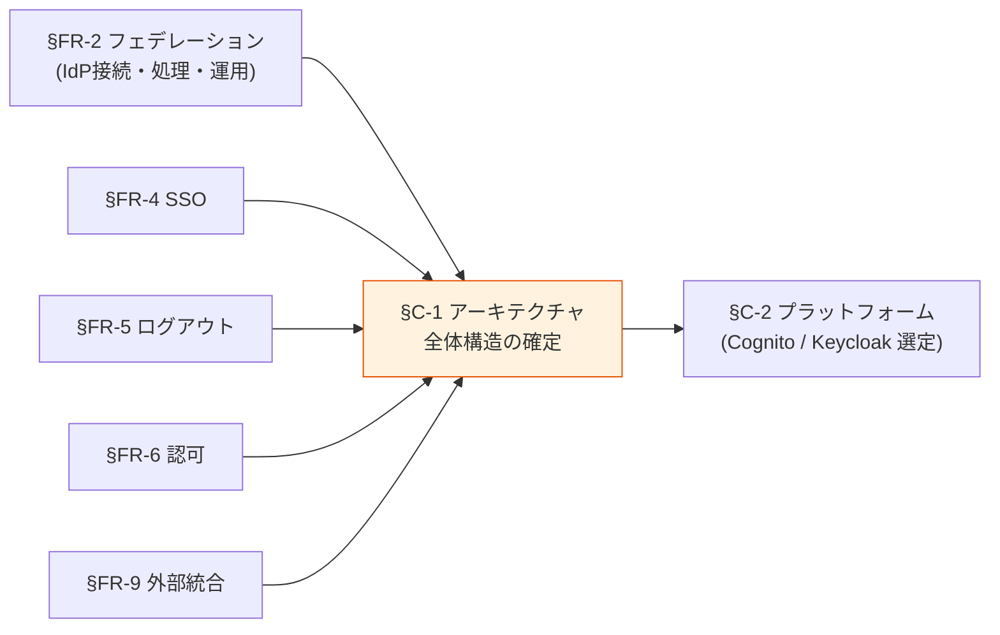
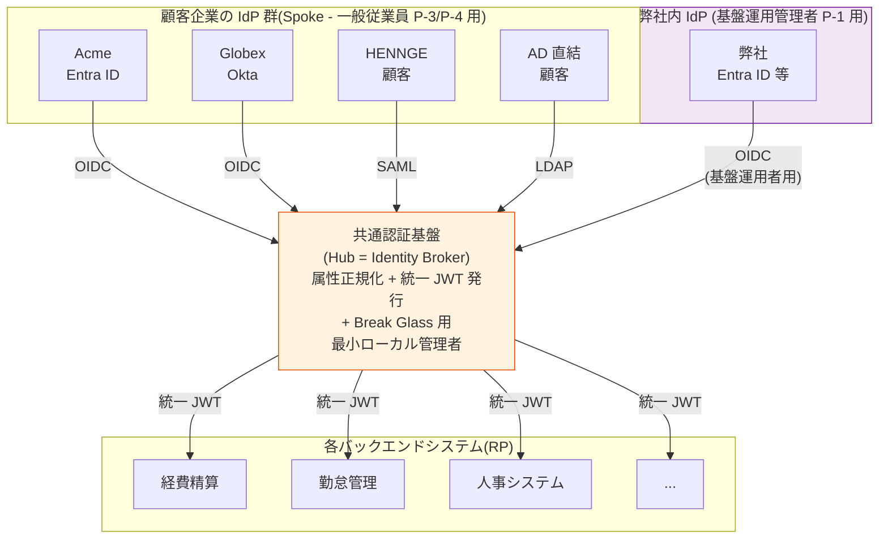
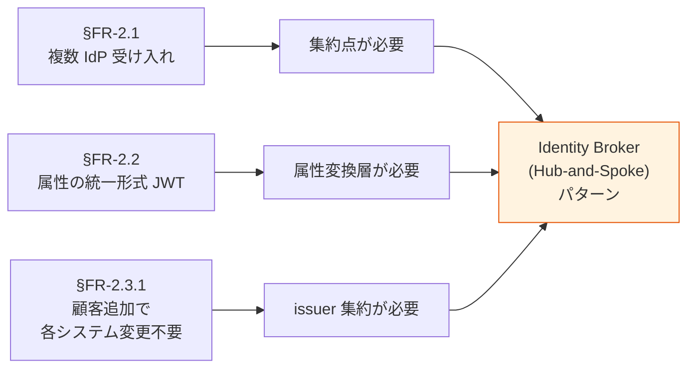
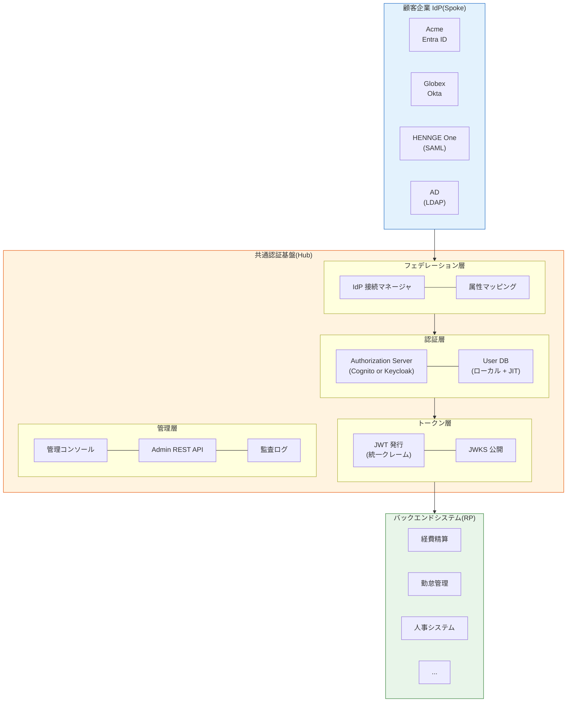
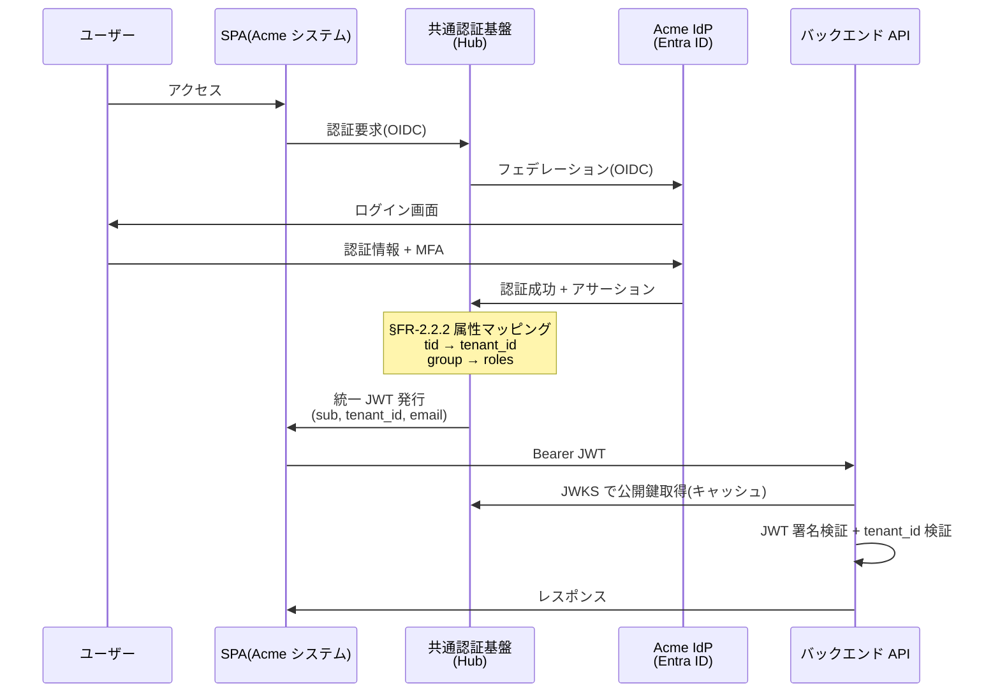
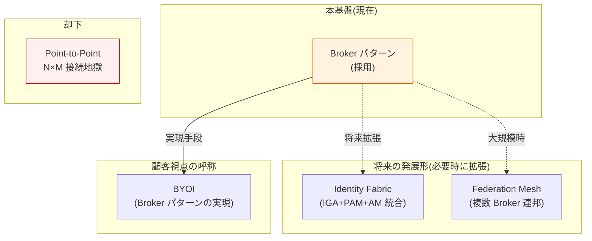
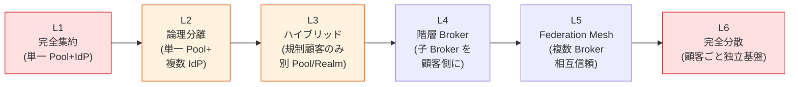

# §C-1 アーキテクチャ — Identity Broker パターン

> 上位 SSOT: [00-index.md](00-index.md)   
> 詳細: [../../../common/identity-broker-multi-idp.md](../../../common/identity-broker-multi-idp.md)

---

## §C-1.0 前提と背景

### 用語整理

| 用語 | 本基盤での意味 |
|---|---|
| **Identity Broker** | 複数の外部 IdP と各システムの間に立ち、認証を仲介するアーキテクチャパターン |
| **Hub-and-Spoke** | 中央集約型の通信トポロジー。本基盤の物理表現 |
| **IdP**(Identity Provider) | 顧客企業の認証情報を持つ外部システム(Entra ID / Okta / HENNGE 等) |
| **RP**(Relying Party) | 本基盤の JWT を受け取って認可判定するアプリ |
| **Federation Hub** | Identity Broker の別称(Microsoft / KuppingerCole 用語) |
| **Identity Fabric** | KuppingerCole 提唱の新世代 IAM 統合概念。Broker を内包したより広い枠組み |

### なぜここ(§C-1)で決めるか

§FR-1-§FR-9 で「**個別の機能・運用方針**」を確定してきた。§C-1 は **それらを束ねた "アーキテクチャ全体像"** を確定する。
§C-1 の方向性が決まれば、§C-2 「**どのプラットフォームで実装するか**」が判断可能になる。

### §C-1.0.A 本基盤のアーキテクチャスタンス

> **Identity Broker パターン(Hub-and-Spoke 型)を採用する。これは選択というより、§FR-2 で示した要件から構造的に導かれる必然である。**

> **利用者カテゴリの位置付け**（[§FR-1.2.0.0](../fr/01-auth.md#fr-1200-ローカルユーザーとは何か--利用者カテゴリ別の分析) と整合）:
> - **顧客 IdP 群（Spoke）**: 顧客の一般従業員（P-3）+ テナント管理者（P-2、顧客 IdP あり時）の認証
> - **弊社内 IdP**: 基盤運用管理者（P-1）の認証。**γ シナリオ採用時に Must**
> - **共通基盤内最小ローカル**: Break Glass 用ローカル管理者（数名）+ IdP なし顧客分（シナリオ β / α 時の P-2/P-4）

#### このスタンスの業界根拠

| 出典 | 主張 |
|---|---|
| **Microsoft Azure Architecture Center** | "**Federated Identity Pattern**" として公式パターン化。"a federated identity provider acts as a broker, integrating IdPs via authentication protocols" |
| **KuppingerCole Leadership Compass: Identity Fabrics** | Identity Fabric の foundational layer に Broker パターンを位置付け。「**Orchestration, signal-driven decisions, seamless integration**」が新世代 IAM の核 |
| **Hub-and-Spoke Architectural Pattern** | "Hub component includes **identity and access control**, spokes inherit policies"。エンタープライズ統合の定石パターン |
| **AWS Cognito 公式 / Keycloak Identity Brokering** | 両プラットフォームが Broker パターンをネイティブ実装 |
| **WJAETS-2025 学術論文** | Broker パターンで「**統合点 18→6 に削減**」の定量効果を示す実証研究 |

### 共通認証基盤として「アーキテクチャ全体像」を確定する意義

| 観点 | 個別アプリで実装 | Broker パターン採用 |
|---|---|---|
| 顧客 IdP 追加 | 全アプリで個別対応 | **Broker に 1 度設定するだけ** |
| 各システムが検証する issuer | 顧客数 × プロトコル数 | **1 つだけ** |
| クレーム差異の吸収 | 各システムで対応 | **Broker で一元正規化** |
| テスト・セキュリティレビュー | 全組合せ | **Broker のみ** |
| 顧客追加リードタイム | 全システム改修 | **基盤の IdP 設定追加のみ(< 1 営業日)** |
| 管理運用コスト(業界調査) | 高 | **最大 60% 削減**(WJAETS-2025) |

→ Broker パターン採用は「**基本方針 4 軸すべての実現**」の中核装置。

### 本章で扱うサブセクション

| サブセクション | 内容 |
|---|---|
| §C-1.1 Broker パターン採用根拠 | なぜ Broker か、要件からの構造的導出、業界根拠 |
| §C-1.2 全体アーキテクチャ | 構成要素・データフロー・各章との対応 |
| §C-1.3 採用しない代替パターン | Point-to-Point / Mesh / Identity Fabric / BYOI の位置付け |
| §C-1.4 物理分離レベルと Broker パターンの関係 | 6 段階分離レベル(L1〜L6)と Broker 採用境界、業界実例 |

---

## §C-1.1 Broker パターン採用根拠

> **このサブセクションで定めること**: なぜ Identity Broker パターンを採用するかの **論理的導出**(§FR-2 で確定した要件から自動的に決まる)と業界根拠。   
> **主な判断軸**: §FR-2 の要件確定状況(マルチ IdP 要否 / 統一クレーム要否 / 顧客追加で各システム変更不要要否)   
> **§C-1 全体との関係**: §C-1.0.A のスタンスを「**要件 → 帰結**」のロジックで裏付ける

### §FR-2 の要件から Broker パターンが自動導出される

### 要件と帰結の対応表

| §FR-2 の要件 | 帰結 |
|---|---|
| §FR-2.1 FR-FED-001〜007 が Must(複数 IdP 受け入れ) | **集約点が必要** = Hub |
| §FR-2.2.2 FR-FED-009 が Must(属性正規化) | **変換層が必要** = Hub 内属性マッピング |
| §FR-2.3.1 FR-FED-010 が Must(複数 IdP 並行運用) | **単一 issuer で発行** = Hub が JWT 発行 |
| §FR-2.3.2 FR-FED-011 が Must(顧客追加で各システム変更不要) | **アプリの依存先は Hub のみ** = Hub-and-Spoke 不可避 |

→ §FR-2 の Must 要件が決まれば、Broker パターン採用は **構造的に必然**(選択肢ではない)。

### 業界の現在地(業界根拠)

- **Microsoft Azure Architecture Center "Federated Identity Pattern"**: 公式クラウドデザインパターンカタログに登録(成熟したパターン)
- **KuppingerCole Identity Fabrics**: Broker を新世代 IAM の "Foundation" と位置付け、Leadership Compass で評価対象化
- **Keycloak / Cognito**: 両プラットフォームが Identity Brokering を**ネイティブ機能**として提供
- **学術定量効果**(WJAETS-2025): 統合点 18→6 削減、管理運用コスト 60% 削減

### 我々のスタンス(基本方針に基づく)

| 基本方針の柱 | Broker パターンでの実現 |
|---|---|
| **絶対安全** | 信頼境界が明確(Hub のみが発行する JWT を信頼)、各システムは Broker JWT のみ検証 |
| **どんなアプリでも** | 統一クレーム形式により**どんなバックエンドでも同じ方法で検証可能** |
| **効率よく** | 顧客追加で各システム変更不要、IdP 接続 < 1 営業日([§FR-2.3.2](../fr/02-federation.md#332-顧客追加オンボーディング--fr-fed-011)) |
| **運用負荷・コスト最小** | 統合点 60% 削減(業界調査)、テスト範囲は Broker のみ |

### ベースライン

| 項目 | ベースライン |
|---|---|
| アーキテクチャパターン | **Identity Broker(Hub-and-Spoke)採用** — Must |
| Hub の物理実装 | Cognito User Pool または Keycloak Realm([§C-2](02-platform.md) で選定) |
| マルチテナント方式 | **単一 Pool/Realm + 複数 IdP**([§FR-2.3.A](../fr/02-federation.md#33a-アーキテクチャ判断単一-poolrealm--複数-idp-を採用) で根拠) |
| 業界整合性 | Microsoft / KuppingerCole / AWS / OSS いずれの設計指針とも整合 |

### TBD / 要確認

| 確認項目 | 回答例 |
|---|---|
| Broker パターン採用に異論ないか | はい(推奨) / 反対意見あり |
| Hub の物理境界(単一基盤 / 用途別分離) | 単一 / 用途別(金融とそれ以外で分離等) |
| 既存 IdP(既存認証基盤含む)からの移行制約 | 段階移行 / 一括移行 / なし |

---

## §C-1.2 全体アーキテクチャ

> **このサブセクションで定めること**: Broker パターンを採用した本基盤の **全体構成図・データフロー・構成要素**の整理。各章で個別に扱った内容を 1 つの絵に統合。   
> **主な判断軸**: 構成要素の網羅性、データフローの正確性、運用主体の明示   
> **§C-1 全体との関係**: §C-1.1 の採用根拠を**実装イメージ**として可視化。§C-2 プラットフォーム選定の前提となる絵

### 全体構成図

### データフロー(典型ログインケース)

### 構成要素マッピング(各章との対応)

| 構成要素 | 関連章 |
|---|---|
| 認証層(Authorization Server) | [§FR-1 認証](../fr/01-auth.md), [§FR-3 MFA](../fr/03-mfa.md), [§FR-4 SSO](../fr/04-sso.md), [§FR-5 ログアウト](../fr/05-logout-session.md) |
| フェデレーション層 | [§FR-2 フェデレーション](../fr/02-federation.md) |
| トークン層(JWT / JWKS) | [§FR-6 認可](../fr/06-authz.md), [§FR-9.1 プロトコル](../fr/09-integration.md#101-プロトコル準拠--fr-int-81) |
| 管理層 | [§FR-7 ユーザー管理](../fr/07-user.md), [§FR-8 管理機能](../fr/08-admin.md), [§FR-9.3 API・IaC](../fr/09-integration.md#103-apiiacwebhook--fr-int-83) |
| 監査層 | [§FR-8.2 監査](../fr/08-admin.md#92-監査可視性--fr-admin-72), [§FR-9.2 ログ・SIEM](../fr/09-integration.md#102-ログ監視--fr-int-82) |

### システム間接続パターンの一覧（静的な接続関係）

「**どこからどこへ、どんな目的で接続するか**」の俯瞰。動的なシーケンス図は次の「§C-1.2.A フロー図のインデックス」を参照。

| # | 接続元 | 接続先 | プロトコル | 認証方式 | 用途 |
|:---:|---|---|---|---|---|
| 1 | エンドユーザー（ブラウザ）| アプリ SPA / SSR | HTTPS | Cookie / Bearer | 業務操作 |
| 2 | アプリ SPA / SSR | 共通認証基盤（Hub）| **OIDC / OAuth 2.0**（Authorization Code + PKCE）| client_id（+ client_secret）| **ログイン / トークン取得** |
| 3 | 共通認証基盤（Hub）| 外部 IdP（Entra ID / Okta / HENNGE 等）| **OIDC / SAML 2.0 / LDAP** | client_secret / 証明書 | **フェデレーション（Spoke 側）** |
| 4 | 共通認証基盤（Hub）| アプリ SPA / SSR | HTTPS リダイレクト | — | **Authorization Code / Token 返却** |
| 5 | アプリ SPA / SSR | バックエンド API | HTTPS | **Bearer JWT**（共通基盤発行）| 業務 API 呼び出し |
| 6 | バックエンド API | 共通認証基盤（Hub）| HTTPS | — | **JWKS 取得**（公開鍵キャッシュ）|
| 7 | 共通認証基盤（Hub）| 各アプリ Back-Channel エンドポイント | HTTPS POST | client_secret | **Back-Channel Logout 通知**（[§FR-5.1](../fr/05-logout-session.md)）|
| 8 | 管理者（基盤運用）| 共通認証基盤の管理 API | HTTPS | IAM / Realm Admin | **テナント / IdP / Client 管理**（[§FR-8](../fr/08-admin.md)）|
| 9 | 監視 / 監査基盤 | 共通認証基盤の監査ログ | HTTPS / Kinesis | IAM | **CloudTrail / Event Listener**（[§FR-9.2](../fr/09-integration.md)）|
| 10 | （オプション）SPA | **BFF サーバー** | HTTPS | **HttpOnly Cookie**（セッション ID）| トークンを SPA に持たせない（[§FR-1.1 B](../fr/01-auth.md)）|
| 11 | （オプション）**BFF サーバー** | 共通認証基盤（Hub）| OIDC | client_secret（Confidential）| BFF が代理でトークン取得 |
| 12 | （オプション）**BFF サーバー** | バックエンド API | HTTPS | Bearer JWT 代理添付 | SPA からの API リクエストを BFF が中継 |

### §C-1.2.A 認証フロー・接続フロー図のインデックス

本資料群では、ユースケース別の**動的フロー（シーケンス図）を各章に分散配置**している。本セクションは逆引きインデックス。

| フロー / シナリオ | 場所 | 内容 |
|---|---|---|
| **フェデユーザーのログイン（典型 OIDC）** | §C-1.2 上記「データフロー」 | フェデレーション + JIT + 統一 JWT 発行 |
| **ローカルユーザーのログイン** | [§FR-1.1](../fr/01-auth.md#fr-11-認証フロー--grant-type-fr-auth-11) | ID/PW + MFA → JWT（Authorization Code + PKCE） |
| **SPA → BFF → 認可サーバー → API**（BFF パターン全体）| [bff-implementation-notes.md §6](../../../common/bff-implementation-notes.md) | ログイン / API 呼び出し / Refresh / ログアウトの 4 シーケンス |
| **API 呼び出し（JWT 検証）** | §C-1.2 上記「データフロー」末尾 + [authz-architecture-design.md](../../../common/authz-architecture-design.md) | Bearer JWT → JWKS → 検証 → tenant_id 検証 |
| **ステップアップ MFA**（RFC 9470）| [§FR-3.3](../fr/03-mfa.md) | AAL2 → AAL3 昇格、`acr_values` 要求 |
| **MFA 重複回避**（フェデユーザー、`amr` 信頼）| [§FR-2.2.3](../fr/02-federation.md) | 外部 IdP の MFA 主張を信頼してスキップ |
| **マルチテナント SSO 挙動**（3 シナリオ） | [§FR-2.3.C](../fr/02-federation.md#33c-マルチテナント環境での-sso-挙動) | 同一テナント内 / クロステナント / テナント切替 UI |
| **顧客 IdP 追加オンボーディング** | [§FR-2.3.2](../fr/02-federation.md) | IdP 情報受領 → Terraform PR → デプロイ → 疎通確認 |
| **4 レイヤーログアウト**（L1〜L4）| [§FR-5.1](../fr/05-logout-session.md) | ローカル / IdP セッション破棄 / フェデ連動 / Back-Channel |
| **Refresh Token Rotation（自動更新）** | [§FR-5.2](../fr/05-logout-session.md) + [bff-implementation-notes.md §6.3](../../../common/bff-implementation-notes.md) | Refresh 検出 → 新 Token 発行 → 旧 Refresh 破棄 |
| **継続的アクセス評価（CAEP、将来発展形）** | [§FR-5.4](../fr/05-logout-session.md) | リアルタイム deprovision / イベント駆動セッション無効化 |
| **PoC 実装の実構成図（参考）** | [doc/common/architecture.md](../../../common/architecture.md) | Phase 1-9 で実装した検証構成（Cognito / Keycloak 並列）|
| **Identity Broker パターンの詳細図群** | [doc/common/identity-broker-multi-idp.md](../../../common/identity-broker-multi-idp.md) | 抽象設計 / マルチ IdP 認証 / 属性変換 / スケール / セキュリティ |
| **8 つのシステム設計パターン**（IdP × SPA/SSR × DR）| [doc/common/system-design-patterns.md](../../../common/system-design-patterns.md) | 構成図 + 通信フロー + プロトコル詳細 |
| **プラットフォーム別本番想定構成**（Cognito / Keycloak OSS / RHBK）| [doc/common/platform-architecture-patterns.md](../../../common/platform-architecture-patterns.md) | **3 プラットフォームそれぞれの本番アーキテクチャ図** + Multi-AZ / Auto Scaling / DR / 月額コスト + 選定フロー |

→ **proposal §C-1.2 の全体構成図は「論理アーキテクチャの俯瞰」、各ユースケースの詳細フローは「該当章 + 内部技術メモ」に委譲**する設計。

---

## §C-1.3 採用しない代替パターン

> **このサブセクションで定めること**: 検討した代替パターン(Point-to-Point / Mesh / Identity Fabric / BYOI)と、**なぜ採用しないか**の整理。   
> **主な判断軸**: 各代替パターンの本プロジェクト要件への適合度   
> **§C-1 全体との関係**: §C-1.1 の Broker 採用判断を、**代替案を排除した結果**として補強

### 代替パターン 5 つの位置付け

| パターン | 位置付け | 採用判断 |
|---|---|:---:|
| **① Point-to-Point**(個別連携) | 各システム ↔ 各 IdP を直接連携 | ❌ **却下**(顧客追加で全システム改修必要、N×M 接続) |
| **② Federation Mesh** | 複数 Broker が相互信頼するメッシュ | △ **将来オプション**(大学連合 GakuNin / 政府間連邦の規模が必要) |
| **③ Identity Fabric**(KuppingerCole) | Broker + IGA / PAM / AM を統合した上位概念 | △ **将来発展形**(本基盤の Broker 採用後、段階的拡張可能) |
| **④ BYOI**(Bring Your Own Identity) | B2B SaaS で顧客が自社 IdP を持ち込む要件呼称 | ✅ **本基盤で実現**(Broker パターンが BYOI の実装手段) |
| **⑤ 各アプリ独自ローカル認証** | 各アプリが独自 Login UI + ユーザー DB + パスワード管理を持つ。共通基盤は OAuth/OIDC で連携する外部 IdP としてのみ動作 | ❌ **却下**(Broker パターン崩壊、SSO 不可、品質差、コンプライアンス重複。詳細: [§FR-1.2.0](../fr/01-auth.md#220-ローカルユーザー認証の主体--11-アーキテクチャと連動)) |

### 各代替パターンとの関係

### 各代替パターンを採用しない理由

**① Point-to-Point(却下)**
- N×M(顧客数 × システム数)の接続が爆発
- 顧客追加で全システム改修が必要
- テスト範囲が膨大
- 基本方針「効率よく」「運用負荷低」と真逆

**② Federation Mesh(将来検討、現状は不要)**
- 複数 Broker が相互信頼する大規模連邦
- 採用ケース:大学連合(学術認証 GakuNin / eduGAIN)、政府間連邦
- 本プロジェクトの想定規模(顧客 100〜1000 社)では過剰
- 将来基盤が複数拠点・複数組織に拡張する場合に検討

**③ Identity Fabric(将来発展形)**
- KuppingerCole 提唱の新世代 IAM 統合概念
- Broker(本基盤) + IGA(Identity Governance) + PAM(Privileged Access) + AM(Access Management)の統合
- 本基盤は Identity Fabric の **Foundation** に位置付けられる
- 将来 IGA / PAM を追加導入する場合の自然な発展経路

**④ BYOI(実は採用)**
- 「顧客が自社 IdP を持ち込める」という**要件側の呼称**
- 実装手段としての Broker パターンとイコール
- 本基盤は BYOI の標準実装と言える

**⑤ 各アプリ独自ローカル認証(却下)**
- 各アプリが独自 Login UI + ユーザー DB + パスワード管理を持つ
- 共通基盤は外部 IdP として OAuth/OIDC で連携のみ
- 却下理由:
  - **Broker パターンの本質崩壊**: 集約点が消え、issuer が各アプリに分散
  - **SSO 不可能**: 同じユーザーがアプリ A と B で別認証セッション
  - **セキュリティの品質差**: パスワードハッシュ・MFA・侵害検出が各アプリで個別実装 → 最弱アプリが全体の天井
  - **コンプライアンス対応重複**: GDPR / SOC 2 / ISO 27001 を全アプリで個別対応必要
  - **退職時 deprovision 漏れリスク**: 基盤 1 回 → 全アプリ反映、にならない
  - **コスト**: 認証 UI / DB / バックエンドを N アプリ分実装
- 詳細評価と却下理由: [§FR-1.2.0 ローカルユーザー認証の主体](../fr/01-auth.md#220-ローカルユーザー認証の主体--11-アーキテクチャと連動)
- ただし **既存システム移行期間中の暫定運用（C 案ハイブリッド）は例外的に許容**（§FR-1.2.0 参照）

---

## §C-1.4 物理分離レベルと Broker パターンの関係

> **このサブセクションで定めること**: 「テナント分離をどこまで物理的に行うか」という顧客との議論において、**物理分離を強めるほど Broker パターンが成立しなくなる**という構造的トレードオフを明示。   
> **主な判断軸**: 顧客が要求する分離レベル（論理 / 物理ハイブリッド / 完全物理）  
> **§C-1 全体との関係**: §C-1.1 で採用した Broker パターンが、**どこまでの分離要求と両立するか**の境界線を示す。§FR-2.3.A.2（IdP なし顧客の選択肢）と §C-1.3（採用しない代替）と地続きの議論。

### 「全部物理分離 = Broker パターン採用不可」の理解は概ね正しい

顧客から **「テナントごとに完全に物理的に分離してほしい」** という要求が出た場合、これは構造的に Broker パターンを放棄することと等価。理由は明確で:

- **Broker = 単一 Hub で issuer / 属性正規化 / JWT 発行を集約する**ことが本質
- すべて物理分離するということは **Hub が顧客数ぶん必要** = もはや Hub ではなく N 個の独立基盤
- 各システム（RP）が検証する issuer も顧客数ぶんになり、§FR-2.3.2「顧客追加で各システム変更不要」が崩壊
- → **Broker パターン採用の構造的必然性（§C-1.1）が消失** = 共通認証基盤を構築する意味そのものがなくなる

### 物理分離の 6 段階グラデーション

実際には「論理 ↔ 物理」は二者択一ではなく、**6 段階のグラデーション**で考えるべき。

### 各レベルの特性比較

| Lv | 名称 | 物理分離の範囲 | Broker パターン互換性 | 実装難度 | 採用事例 |
|:---:|---|---|:---:|:---:|---|
| L1 | 完全集約 | 顧客ごと IdP も持たない（基盤内ローカルユーザーのみ）| ◎ Broker が最大価値 | 低 | 単一テナント SaaS |
| **L2** | **論理分離（標準）** | 単一 Pool/Realm + 複数 IdP + `tenant_id` クレーム | ◎ **Broker の標準形** | 中 | **Slack / Notion / Linear / Box** |
| **L3** | **ハイブリッド** | 規制業種顧客のみ別 Pool/Realm（金融・医療等）+ 一般顧客は L2 | ○ **Broker を顧客カテゴリ別に複数化** | 中〜高 | **Auth0 Private Cloud / Microsoft Entra GCC / Okta Custom Cell** |
| L4 | 階層 Broker | Hub Broker の下に顧客側 Broker を配置 | △ Broker 多段化 | 高 | 大企業内グループ会社統合 |
| L5 | Federation Mesh | 完全独立した複数 Broker が相互信頼 | △ Broker の連邦化（§C-1.3） | 極めて高 | GakuNin（学術認証）/ eduGAIN / 政府間連邦 |
| L6 | 完全分散 | 顧客ごとに完全独立した認証基盤 | ✗ **Broker 不成立** | 不要（基盤要らず）| **オンプレ個別構築 / 顧客自前運用** |

→ **L1 と L6 は Broker パターンの否定**（前者は「集約しすぎて顧客 IdP なし」、後者は「分散しすぎて Hub なし」）。**L2-L3 が現実解**。

### 業界の実例で見る分離レベル

| 企業 / サービス | 採用レベル | 内容 |
|---|:---:|---|
| **Slack** | **L2** | 単一 Pool + Workspace ごとの IdP 接続 + ワークスペース ID で分離 |
| **Notion** | **L2** | 単一 Pool + Workspace SSO + workspace_id で分離 |
| **Linear** | **L2** | 単一 Pool + SAML / SCIM 接続 + organization_id |
| **Box** | **L2** | 単一基盤 + Enterprise SSO + enterprise_id |
| **Auth0 Private Cloud** | **L3** | 標準は共有テナント / 規制業種は専用 Private Cloud（別 Pool）|
| **Microsoft Entra GCC / GCC-High / DoD** | **L3** | 一般顧客は共有 Entra ID / 米政府機関は GCC（別物理クラスタ）|
| **Okta Custom Cell** | **L3** | 標準は Shared Cell / 高セキュリティ顧客は Dedicated Cell |
| **AWS GovCloud** | **L3** に近い | リージョン物理分離（同じ Cognito だが別エンドポイント）|
| **GakuNin（学術認証）** | **L5** | 各大学が独立した Broker を持ち、相互信頼でメッシュ化 |

→ **業界のメインストリームは L2 標準 + L3 オプション**。L1（完全集約のみ）も L6（完全分散のみ）も実用ベンダーには見当たらない。

### 顧客が「全部物理分離」と言うときの本当のニーズ

顧客の「物理分離してほしい」要求は、多くの場合は以下のいずれか（または組み合わせ）で、**L6 の完全分離を求めているわけではない**ことが多い。

| 顧客の表現 | 真のニーズ | 対応レベル |
|---|---|:---:|
| 「他社とパスワードが同じ DB にあるのは嫌」 | パスワードハッシュの DB 同居回避 | **§FR-2.3.A.2 D 案ハイブリッド**（IdP 化）で L2 のまま解決可 |
| 「監査時に他社データに触れない構成にしたい」 | 監査スコープ限定 | **L3 ハイブリッド**（規制顧客のみ別 Pool / Realm）|
| 「データ主権上、別国・別リージョンに置きたい」 | リージョン分離 | **L3 ハイブリッド**（リージョン別 Pool）|
| 「マルチテナント脆弱性（CVE）の影響を分離したい」 | Blast radius 限定 | **L3 ハイブリッド** + テナントごと暗号鍵分離 |
| 「他社と同じソフトを使うのが信用上 NG」 | 専有環境の見え方 | **L3 ハイブリッド** or **Dedicated Cell 提案** |

→ **本当に L6 を要求しているケースはほぼない**。L3 のハイブリッドで多くの分離ニーズは満たせる。

### 「全部物理分離」を要求された場合の本基盤の立場

| 本基盤の立場 | 内容 |
|---|---|
| **基本: L2 を標準提供** | 単一 Pool/Realm + 複数 IdP（[§FR-2.3.A](../fr/02-federation.md#33a-アーキテクチャ判断単一-poolrealm--複数-idp-を採用)） |
| **オプション: L3 を選択肢に** | 規制業種顧客 / 大口顧客のみ別 Pool / Realm を提供（追加料金）|
| **顧客が L6 を強硬に求める場合** | **本基盤の対象外**。顧客自前運用 or 個別 SI 案件として扱う（Broker 価値が消えるため）|
| **L4 / L5 への発展** | 将来 M&A / 子会社統合 / 業界連合の規模になった場合に検討（[§C-1.3](#§c-13-採用しない代替パターン)）|

### 結論

> **「全部物理分離」= Broker パターン放棄 = 本基盤の存在価値消失**、という構造的事実は顧客に明示すべき。  
> 実務上は **L2（論理分離）を標準**とし、**L3（規制顧客のみハイブリッド物理分離）をオプション**として提供する形が業界標準であり、本基盤の方針。  
> 顧客の「物理分離」要望は、**真のニーズを掘って [§FR-2.3.A.2](../fr/02-federation.md#33a2-idp-なし顧客のユーザー管理) の 4 オプション（A〜D）や L3 で満たせるか**を最初に検討する。

### TBD / 要確認

| 確認項目 | 回答例 |
|---|---|
| 標準提供レベルは L2 で合意できるか | 合意 / 別案 |
| L3（規制顧客向け別 Pool）の提供範囲 | 全顧客対応 / 一定規模以上のみ / 提供しない |
| L6 を求める顧客の扱い | 対象外 / 個別 SI / 顧客自前運用支援 |
| 「物理分離」要求顧客への真のニーズヒアリング手順 | ヒアリングテンプレ化 / 営業判断 |

---

## §C-1.5 TBD / 要確認

| 確認項目 | 回答例 |
|---|---|
| Broker パターン採用に異論ないか | 異論なし(推奨) / 他案を検討したい |
| 物理境界(用途別分離の必要性) | 単一基盤 / 用途別分離 |
| 既存システム認証基盤からの移行戦略 | 段階移行 / 一括移行 / 並行稼働 |
| 将来の Identity Fabric への発展可能性 | あり(IGA / PAM 統合検討) / Broker で完結予定 |
| Federation Mesh への発展可能性 | あり(複数拠点・複数組織想定) / 単一 Broker で完結 |

---

### 参考資料(§C-1 全体)

#### Broker パターン業界根拠

- [Microsoft Azure Architecture Center - Federated Identity Pattern](https://learn.microsoft.com/en-us/azure/architecture/patterns/federated-identity)
- [KuppingerCole Leadership Compass: Identity Fabrics](https://www.kuppingercole.com/research/lc81426/identity-fabrics)
- [KuppingerCole Identity Fabric 2025 / 2026](https://www.kuppingercole.com/blog/reinwarth/the-kuppingercole-identity-fabric-2025)
- [Keycloak Identity Brokering 公式](https://www.keycloak.org/docs/latest/server_admin/index.html)
- [AWS Cognito - User pool sign-in with third party IdPs](https://docs.aws.amazon.com/cognito/latest/developerguide/cognito-user-pools-identity-federation.html)
- [WJAETS-2025 Federated identity management](https://journalwjaets.com/sites/default/files/fulltext_pdf/WJAETS-2025-0919.pdf)

#### Hub-and-Spoke パターン

- [Enterprise Integration Patterns - Hub and Spoke](https://www.enterpriseintegrationpatterns.com/ramblings/03_hubandspoke.html)
- [Hub-and-Spoke Architecture 2026 Guide - CloudOpsNow](https://www.cloudopsnow.in/hub-and-spoke/)

#### 内部ドキュメント

- [identity-broker-multi-idp.md](../../../common/identity-broker-multi-idp.md): Broker パターン詳細
- [§FR-2.3.A アーキテクチャ判断](../fr/02-federation.md#33a-アーキテクチャ判断単一-poolrealm--複数-idp-を採用): 単一 Pool/Realm + 複数 IdP の根拠
