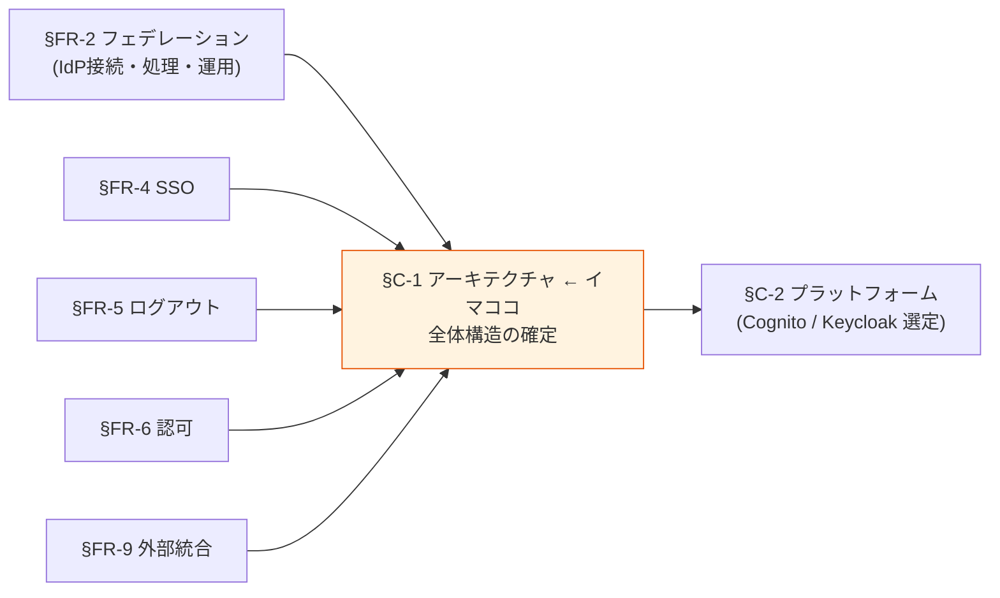
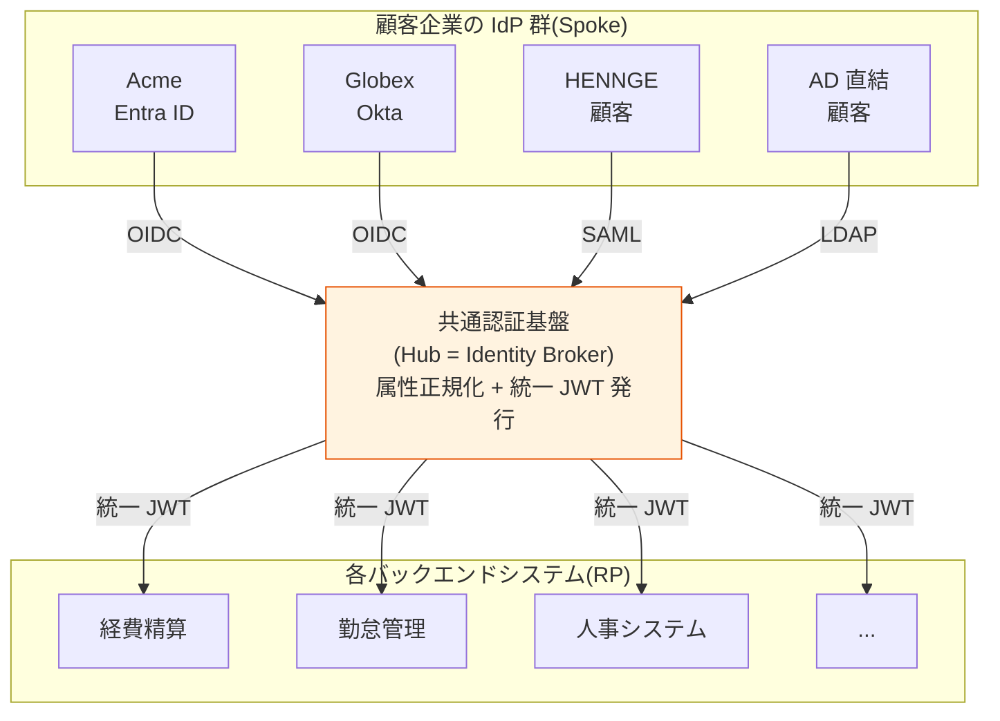
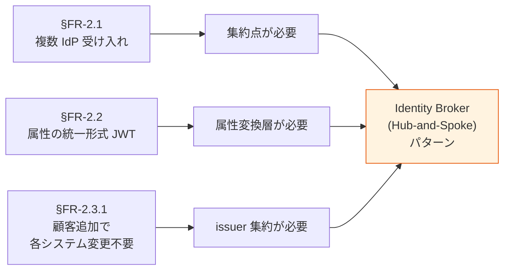
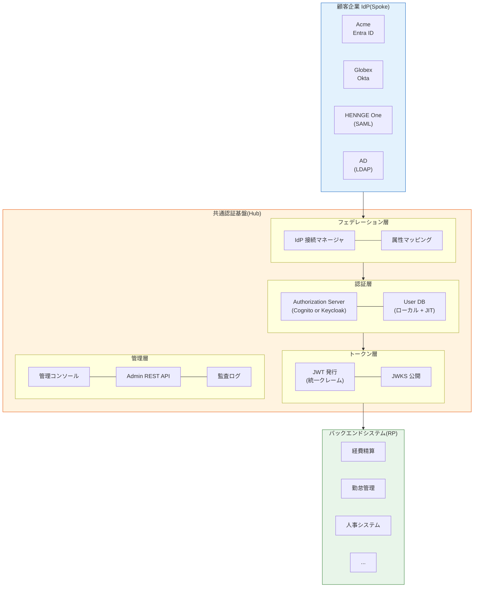
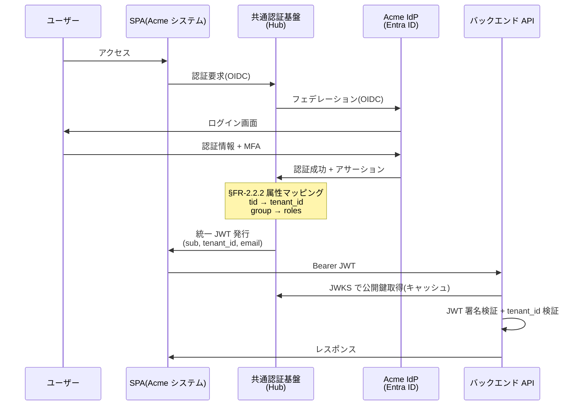
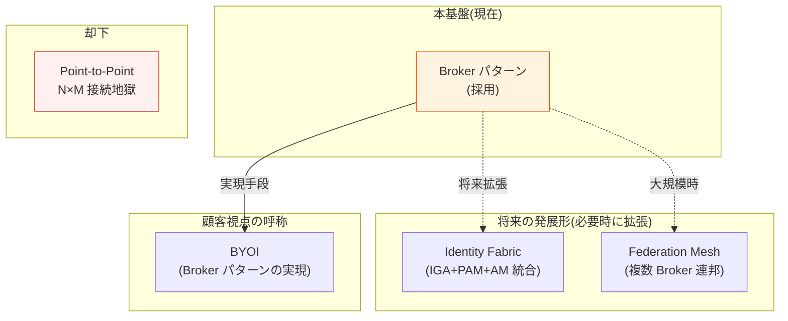

# §C-1 アーキテクチャ — Identity Broker パターン

> 上位 SSOT: [00-index.md](00-index.md)
> 詳細: [../../../common/identity-broker-multi-idp.md](../../../common/identity-broker-multi-idp.md)

---

## §C-1.0 前提と背景

### 用語整理

| 用語 | 本基盤での意味 |
|---|---|
| **Identity Broker** | 複数の外部 IdP と各システムの間に立ち、認証を仲介するアーキテクチャパターン |
| **Hub-and-Spoke** | 中央集約型の通信トポロジー。本基盤の物理表現 |
| **IdP**(Identity Provider) | 顧客企業の認証情報を持つ外部システム(Entra ID / Okta / HENNGE 等) |
| **RP**(Relying Party) | 本基盤の JWT を受け取って認可判定するアプリ |
| **Federation Hub** | Identity Broker の別称(Microsoft / KuppingerCole 用語) |
| **Identity Fabric** | KuppingerCole 提唱の新世代 IAM 統合概念。Broker を内包したより広い枠組み |

### なぜここ(§C-1)で決めるか

§FR-1-§FR-9 で「**個別の機能・運用方針**」を確定してきた。§C-1 は **それらを束ねた "アーキテクチャ全体像"** を確定する。
§C-1 の方向性が決まれば、§C-2 「**どのプラットフォームで実装するか**」が判断可能になる。

### §C-1.0.A 本基盤のアーキテクチャスタンス

> **Identity Broker パターン(Hub-and-Spoke 型)を採用する。これは選択というより、§FR-2 で示した要件から構造的に導かれる必然である。**

#### このスタンスの業界根拠

| 出典 | 主張 |
|---|---|
| **Microsoft Azure Architecture Center** | "**Federated Identity Pattern**" として公式パターン化。"a federated identity provider acts as a broker, integrating IdPs via authentication protocols" |
| **KuppingerCole Leadership Compass: Identity Fabrics** | Identity Fabric の foundational layer に Broker パターンを位置付け。「**Orchestration, signal-driven decisions, seamless integration**」が新世代 IAM の核 |
| **Hub-and-Spoke Architectural Pattern** | "Hub component includes **identity and access control**, spokes inherit policies"。エンタープライズ統合の定石パターン |
| **AWS Cognito 公式 / Keycloak Identity Brokering** | 両プラットフォームが Broker パターンをネイティブ実装 |
| **WJAETS-2025 学術論文** | Broker パターンで「**統合点 18→6 に削減**」の定量効果を示す実証研究 |

### 共通認証基盤として「アーキテクチャ全体像」を確定する意義

| 観点 | 個別アプリで実装 | Broker パターン採用 |
|---|---|---|
| 顧客 IdP 追加 | 全アプリで個別対応 | **Broker に 1 度設定するだけ** |
| 各システムが検証する issuer | 顧客数 × プロトコル数 | **1 つだけ** |
| クレーム差異の吸収 | 各システムで対応 | **Broker で一元正規化** |
| テスト・セキュリティレビュー | 全組合せ | **Broker のみ** |
| 顧客追加リードタイム | 全システム改修 | **基盤の IdP 設定追加のみ(< 1 営業日)** |
| 管理運用コスト(業界調査) | 高 | **最大 60% 削減**(WJAETS-2025) |

→ Broker パターン採用は「**北極星 4 軸すべての実現**」の中核装置。

### 本章で扱うサブセクション

| サブセクション | 内容 |
|---|---|
| §C-1.1 Broker パターン採用根拠 | なぜ Broker か、要件からの構造的導出、業界根拠 |
| §C-1.2 全体アーキテクチャ | 構成要素・データフロー・各章との対応 |
| §C-1.3 採用しない代替パターン | Point-to-Point / Mesh / Identity Fabric / BYOI の位置付け |

---

## §C-1.1 Broker パターン採用根拠

> **このサブセクションで定めること**: なぜ Identity Broker パターンを採用するかの **論理的導出**(§FR-2 で確定した要件から自動的に決まる)と業界根拠。
> **主な判断軸**: §FR-2 の要件確定状況(マルチ IdP 要否 / 統一クレーム要否 / 顧客追加で各システム変更不要要否)
> **§C-1 全体との関係**: §C-1.0.A のスタンスを「**要件 → 帰結**」のロジックで裏付ける

### §FR-2 の要件から Broker パターンが自動導出される

### 要件と帰結の対応表

| §FR-2 の要件 | 帰結 |
|---|---|
| §FR-2.1 FR-FED-001〜007 が Must(複数 IdP 受け入れ) | **集約点が必要** = Hub |
| §FR-2.2.2 FR-FED-009 が Must(属性正規化) | **変換層が必要** = Hub 内属性マッピング |
| §FR-2.3.1 FR-FED-010 が Must(複数 IdP 並行運用) | **単一 issuer で発行** = Hub が JWT 発行 |
| §FR-2.3.2 FR-FED-011 が Must(顧客追加で各システム変更不要) | **アプリの依存先は Hub のみ** = Hub-and-Spoke 不可避 |

→ §FR-2 の Must 要件が決まれば、Broker パターン採用は **構造的に必然**(選択肢ではない)。

### 業界の現在地(業界根拠)

- **Microsoft Azure Architecture Center "Federated Identity Pattern"**: 公式クラウドデザインパターンカタログに登録(成熟したパターン)
- **KuppingerCole Identity Fabrics**: Broker を新世代 IAM の "Foundation" と位置付け、Leadership Compass で評価対象化
- **Keycloak / Cognito**: 両プラットフォームが Identity Brokering を**ネイティブ機能**として提供
- **学術定量効果**(WJAETS-2025): 統合点 18→6 削減、管理運用コスト 60% 削減

### 我々のスタンス(北極星に基づく)

| 北極星の柱 | Broker パターンでの実現 |
|---|---|
| **絶対安全** | 信頼境界が明確(Hub のみが発行する JWT を信頼)、各システムは Broker JWT のみ検証 |
| **どんなアプリでも** | 統一クレーム形式により**どんなバックエンドでも同じ方法で検証可能** |
| **効率よく** | 顧客追加で各システム変更不要、IdP 接続 < 1 営業日([§FR-2.3.2](../fr/02-federation.md#332-顧客追加オンボーディング--fr-fed-011)) |
| **運用負荷・コスト最小** | 統合点 60% 削減(業界調査)、テスト範囲は Broker のみ |

### ベースライン

| 項目 | ベースライン |
|---|---|
| アーキテクチャパターン | **Identity Broker(Hub-and-Spoke)採用** — Must |
| Hub の物理実装 | Cognito User Pool または Keycloak Realm([§C-2](02-platform.md) で選定) |
| マルチテナント方式 | **単一 Pool/Realm + 複数 IdP**([§FR-2.3.A](../fr/02-federation.md#33a-アーキテクチャ判断単一-poolrealm--複数-idp-を採用) で根拠) |
| 業界整合性 | Microsoft / KuppingerCole / AWS / OSS いずれの設計指針とも整合 |

### TBD / 要確認

| 確認項目 | 回答例 |
|---|---|
| Broker パターン採用に異論ないか | はい(推奨) / 反対意見あり |
| Hub の物理境界(単一基盤 / 用途別分離) | 単一 / 用途別(金融とそれ以外で分離等) |
| 既存 IdP(既存認証基盤含む)からの移行制約 | 段階移行 / 一括移行 / なし |

---

## §C-1.2 全体アーキテクチャ

> **このサブセクションで定めること**: Broker パターンを採用した本基盤の **全体構成図・データフロー・構成要素**の整理。各章で個別に扱った内容を 1 つの絵に統合。
> **主な判断軸**: 構成要素の網羅性、データフローの正確性、運用主体の明示
> **§C-1 全体との関係**: §C-1.1 の採用根拠を**実装イメージ**として可視化。§C-2 プラットフォーム選定の前提となる絵

### 全体構成図

### データフロー(典型ログインケース)

### 構成要素マッピング(各章との対応)

| 構成要素 | 関連章 |
|---|---|
| 認証層(Authorization Server) | [§FR-1 認証](../fr/01-auth.md), [§FR-3 MFA](../fr/03-mfa.md), [§FR-4 SSO](../fr/04-sso.md), [§FR-5 ログアウト](../fr/05-logout-session.md) |
| フェデレーション層 | [§FR-2 フェデレーション](../fr/02-federation.md) |
| トークン層(JWT / JWKS) | [§FR-6 認可](../fr/06-authz.md), [§FR-9.1 プロトコル](../fr/09-integration.md#101-プロトコル準拠--fr-int-81) |
| 管理層 | [§FR-7 ユーザー管理](../fr/07-user.md), [§FR-8 管理機能](../fr/08-admin.md), [§FR-9.3 API・IaC](../fr/09-integration.md#103-apiiacwebhook--fr-int-83) |
| 監査層 | [§FR-8.2 監査](../fr/08-admin.md#92-監査可視性--fr-admin-72), [§FR-9.2 ログ・SIEM](../fr/09-integration.md#102-ログ監視--fr-int-82) |

---

## §C-1.3 採用しない代替パターン

> **このサブセクションで定めること**: 検討した代替パターン(Point-to-Point / Mesh / Identity Fabric / BYOI)と、**なぜ採用しないか**の整理。
> **主な判断軸**: 各代替パターンの本プロジェクト要件への適合度
> **§C-1 全体との関係**: §C-1.1 の Broker 採用判断を、**代替案を排除した結果**として補強

### 代替パターン 5 つの位置付け

| パターン | 位置付け | 採用判断 |
|---|---|:---:|
| **① Point-to-Point**(個別連携) | 各システム ↔ 各 IdP を直接連携 | ❌ **却下**(顧客追加で全システム改修必要、N×M 接続) |
| **② Federation Mesh** | 複数 Broker が相互信頼するメッシュ | △ **将来オプション**(大学連合 GakuNin / 政府間連邦の規模が必要) |
| **③ Identity Fabric**(KuppingerCole) | Broker + IGA / PAM / AM を統合した上位概念 | △ **将来発展形**(本基盤の Broker 採用後、段階的拡張可能) |
| **④ BYOI**(Bring Your Own Identity) | B2B SaaS で顧客が自社 IdP を持ち込む要件呼称 | ✅ **本基盤で実現**(Broker パターンが BYOI の実装手段) |
| **⑤ 各アプリ独自ローカル認証** | 各アプリが独自 Login UI + ユーザー DB + パスワード管理を持つ。共通基盤は OAuth/OIDC で連携する外部 IdP としてのみ動作 | ❌ **却下**(Broker パターン崩壊、SSO 不可、品質差、コンプライアンス重複。詳細: [§FR-1.2.0](../fr/01-auth.md#220-ローカルユーザー認証の主体--11-アーキテクチャと連動)) |

### 各代替パターンとの関係

### 各代替パターンを採用しない理由

**① Point-to-Point(却下)**
- N×M(顧客数 × システム数)の接続が爆発
- 顧客追加で全システム改修が必要
- テスト範囲が膨大
- 北極星「効率よく」「運用負荷低」と真逆

**② Federation Mesh(将来検討、現状は不要)**
- 複数 Broker が相互信頼する大規模連邦
- 採用ケース:大学連合(学術認証 GakuNin / eduGAIN)、政府間連邦
- 本プロジェクトの想定規模(顧客 100〜1000 社)では過剰
- 将来基盤が複数拠点・複数組織に拡張する場合に検討

**③ Identity Fabric(将来発展形)**
- KuppingerCole 提唱の新世代 IAM 統合概念
- Broker(本基盤) + IGA(Identity Governance) + PAM(Privileged Access) + AM(Access Management)の統合
- 本基盤は Identity Fabric の **Foundation** に位置付けられる
- 将来 IGA / PAM を追加導入する場合の自然な発展経路

**④ BYOI(実は採用)**
- 「顧客が自社 IdP を持ち込める」という**要件側の呼称**
- 実装手段としての Broker パターンとイコール
- 本基盤は BYOI の標準実装と言える

**⑤ 各アプリ独自ローカル認証(却下)**
- 各アプリが独自 Login UI + ユーザー DB + パスワード管理を持つ
- 共通基盤は外部 IdP として OAuth/OIDC で連携のみ
- 却下理由:
  - **Broker パターンの本質崩壊**: 集約点が消え、issuer が各アプリに分散
  - **SSO 不可能**: 同じユーザーがアプリ A と B で別認証セッション
  - **セキュリティの品質差**: パスワードハッシュ・MFA・侵害検出が各アプリで個別実装 → 最弱アプリが全体の天井
  - **コンプライアンス対応重複**: GDPR / SOC 2 / ISO 27001 を全アプリで個別対応必要
  - **退職時 deprovision 漏れリスク**: 基盤 1 回 → 全アプリ反映、にならない
  - **コスト**: 認証 UI / DB / バックエンドを N アプリ分実装
- 詳細評価と却下理由: [§FR-1.2.0 ローカルユーザー認証の主体](../fr/01-auth.md#220-ローカルユーザー認証の主体--11-アーキテクチャと連動)
- ただし **既存システム移行期間中の暫定運用（C 案ハイブリッド）は例外的に許容**（§FR-1.2.0 参照）

---

## §C-1.4 TBD / 要確認

| 確認項目 | 回答例 |
|---|---|
| Broker パターン採用に異論ないか | 異論なし(推奨) / 他案を検討したい |
| 物理境界(用途別分離の必要性) | 単一基盤 / 用途別分離 |
| 既存システム認証基盤からの移行戦略 | 段階移行 / 一括移行 / 並行稼働 |
| 将来の Identity Fabric への発展可能性 | あり(IGA / PAM 統合検討) / Broker で完結予定 |
| Federation Mesh への発展可能性 | あり(複数拠点・複数組織想定) / 単一 Broker で完結 |

---

### 参考資料(§C-1 全体)

#### Broker パターン業界根拠

- [Microsoft Azure Architecture Center - Federated Identity Pattern](https://learn.microsoft.com/en-us/azure/architecture/patterns/federated-identity)
- [KuppingerCole Leadership Compass: Identity Fabrics](https://www.kuppingercole.com/research/lc81426/identity-fabrics)
- [KuppingerCole Identity Fabric 2025 / 2026](https://www.kuppingercole.com/blog/reinwarth/the-kuppingercole-identity-fabric-2025)
- [Keycloak Identity Brokering 公式](https://www.keycloak.org/docs/latest/server_admin/index.html)
- [AWS Cognito - User pool sign-in with third party IdPs](https://docs.aws.amazon.com/cognito/latest/developerguide/cognito-user-pools-identity-federation.html)
- [WJAETS-2025 Federated identity management](https://journalwjaets.com/sites/default/files/fulltext_pdf/WJAETS-2025-0919.pdf)

#### Hub-and-Spoke パターン

- [Enterprise Integration Patterns - Hub and Spoke](https://www.enterpriseintegrationpatterns.com/ramblings/03_hubandspoke.html)
- [Hub-and-Spoke Architecture 2026 Guide - CloudOpsNow](https://www.cloudopsnow.in/hub-and-spoke/)

#### 内部ドキュメント

- [identity-broker-multi-idp.md](../../../common/identity-broker-multi-idp.md): Broker パターン詳細
- [§FR-2.3.A アーキテクチャ判断](../fr/02-federation.md#33a-アーキテクチャ判断単一-poolrealm--複数-idp-を採用): 単一 Pool/Realm + 複数 IdP の根拠
