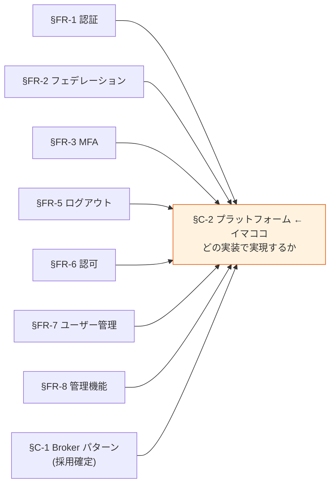
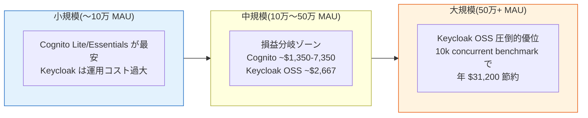
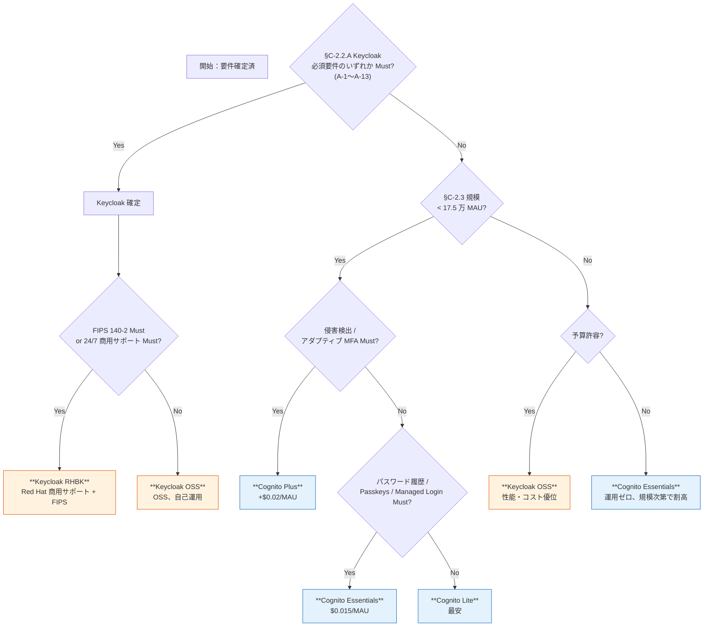
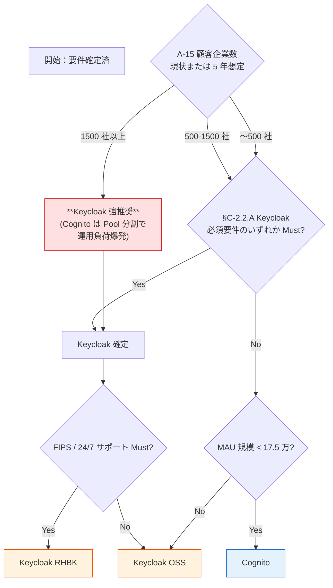

# §C-2 実装プラットフォーム

> 上位 SSOT: [00-index.md](00-index.md)   
> 詳細: [../../platform-selection-decision.md](../../platform-selection-decision.md)、[../../../adr/006-cognito-vs-keycloak-cost-breakeven.md](../../../adr/006-cognito-vs-keycloak-cost-breakeven.md)、[../../../adr/014-auth-patterns-scope.md](../../../adr/014-auth-patterns-scope.md)、[../../../adr/015-rhbk-validation-deferred.md](../../../adr/015-rhbk-validation-deferred.md)

---

## §C-2.0 前提と背景

### 用語整理

| 用語 | 本基盤での意味 |
|---|---|
| **Cognito** | AWS のマネージド IdP サービス（フルマネージド SaaS）|
| **Keycloak OSS** | Red Hat オープンソース版（コミュニティサポート）|
| **Keycloak RHBK**（Red Hat build of Keycloak）| Red Hat 商用版（24/7 サポート、FIPS 140-2 対応）|
| **MAU**（Monthly Active User）| 月間アクティブユーザー数。Cognito の課金単位 |
| **TCO**（Total Cost of Ownership）| 初期 + 運用 + 人件費を含む総保有コスト |
| **ティア**（Cognito 用語）| Lite / Essentials / Plus の 3 段階。機能・価格が異なる |
| **損益分岐点**（Break-even Point）| Cognito と Keycloak のコストが逆転する MAU 規模 |

### なぜここ（§C-2）で決めるか

§FR-1〜§FR-9 で「**何を実現するか**」を要件として確定、§C-1 で「**どんなアーキテクチャで実現するか**」を確定。§C-2 は最終ステップで「**どの製品で実装するか**」を要件次第で決定する。

### §C-2.0.A 本基盤のプラットフォーム選定スタンス

> **3 候補（Cognito / Keycloak OSS / Keycloak RHBK）を併記し、§FR-1〜§FR-9 の要件確定状況により自動判定する。本基盤の AWS マルチアカウント構成は、3 候補のいずれでも動作する設計とする。**

このスタンスの根拠：
- 顧客要件次第で最適解が変わる（事前確定不要）
- 3 候補とも AWS 上で動作可能、構成自由度を確保
- §FR-1〜§FR-9 で確定した要件から自動的に絞り込まれる
- Cognito → Keycloak OSS → RHBK の昇格パスを残す

### 本章で扱うサブセクション

| サブセクション | 内容 |
|---|---|
| §C-2.1 候補プラットフォーム整理 | 3 候補の特性比較 |
| §C-2.2 選定論点（Keycloak 必須化 / Cognito 優位 / 両者ノックアウト） | §FR-1〜§FR-9 で積み上がった選定論点を**詳細**で集約 |
| §C-2.3 コスト比較・TCO | MAU 規模別の損益分岐と 3 年 TCO 試算 |
| §C-2.4 選定フロー | 要件 → 推奨プラットフォームの意思決定図 |

---

## §C-2.1 候補プラットフォーム整理

> **このサブセクションで定めること**: 3 候補（Cognito / Keycloak OSS / Keycloak RHBK）の基本特性を網羅比較し、選定論点の前提情報を整理。   
> **主な判断軸**: 各プラットフォームの性質（マネージド vs 自己ホスト）、ライセンス、サポートライフサイクル、エコシステム   
> **§C-2 全体との関係**: §C-2.2 以降の選定論点を判断する **共通土台**

> 💡 **本番想定構成図 / マルチアカウント連携 / Auto Scaling / DR / 月額コスト試算** の詳細は内部技術メモ [`platform-architecture-patterns.md`](../../../common/platform-architecture-patterns.md) を参照。**3 プラットフォームそれぞれの mermaid 構成図と選定ガイドが含まれる**（最新化対象）。

### 3 候補の基本特性

| 観点 | AWS Cognito | Keycloak OSS | Keycloak RHBK |
|---|---|---|---|
| **性質** | フルマネージド SaaS | OSS（自己ホスト） | OSS + 商用サポート |
| **運用負荷** | 低（AWS 透過） | 中〜高（パッチ・バージョンアップ） | 中（Red Hat サポート支援） |
| **自由度** | 中 | 高 | 高 |
| **商用サポート** | ✅ AWS Support | ❌ コミュニティ（ベストエフォート） | ✅ Red Hat 24/7 |
| **FIPS 140-2** | ⚠ FIPS Endpoint 経由 | ❌ | ✅ ネイティブ |
| **ライセンス費** | $0/月 + 従量 | $0（OSS） | サブスク（OpenShift / Runtimes 等にバンドル）|
| **リリースサイクル** | AWS 透過 | 年 4 minor + 2-3 年ごと major、**LTS なし** | 26.x = 2 年サポート、27.x 以降 = 3 年 |
| **エコシステム** | AWS 全サービス統合 | プラグイン豊富 | Red Hat Application Foundations |
| **PoC 検証** | ✅ Phase 1-9 | ✅ Phase 6-9 | ❌（[ADR-015](../../../adr/015-rhbk-validation-deferred.md) で先送り） |

### Cognito 3 ティアの詳細（2026 年現在）

| ティア | 機能 | 価格 / MAU | 無料枠 |
|---|---|---|---|
| **Lite** | 基本認証、社外 IdP、パスワード認証 | $0.0055〜$0.0025（規模次第） | **10,000 MAU 無料** |
| **Essentials**（新規プールのデフォルト）| Lite + Managed Login + Passkeys + Email MFA + Access Token カスタマイズ + パスワード履歴 | **$0.015**（フラット）| **10,000 MAU 無料** |
| **Plus** | Essentials + **Adaptive Authentication**（リスクベース）+ **Compromised Credentials Detection** | **$0.02**（フラット）| ❌ 無料枠なし |

→ フェデユーザー（SAML/OIDC 経由）は全ティアで **50 MAU 無料**、超過は $0.015/MAU（ティア不問）

### Keycloak OSS のリリースサイクル

- **年 4 minor リリース**、**メジャー 2-3 年ごと**
- **LTS なし**（明示的に開発元が宣言）→ 古い版を使い続けることはできない
- 新メジャー後、旧版は **6 ヶ月のメンテナンス期間**のみ
- パッチ適用・バージョンアップが運用上の負荷
- 解決策：RHBK 採用で **2-3 年の延長サポート**

---

## §C-2.2 選定論点（詳細）

> **このサブセクションで定めること**: 各章で「**Keycloak 必須化**」「**Cognito 優位**」「**両者で対応不可な要件があるか**」と特定された要件の**詳細解説**。顧客要件確定により自動的にプラットフォームが絞られる。   
> **主な判断軸**: 各要件が Must / Should / Could / Won't のいずれか   
> **§C-2 全体との関係**: §C-2.4 選定フローの**判定ロジック**を構成

### A. Keycloak（OSS or RHBK）必須化要因の詳細

各要因について「**何ができないのか**」「**Cognito で代替手段はあるか**」「**いつ必要になるか**」を明示。

#### A-1. FR-AUTH-005 Token Exchange（RFC 8693）

| 観点 | 内容 |
|---|---|
| **Cognito 状況** | **ネイティブ非対応**（AWS 公式が明言：「The Token Exchange grant type is not among the supported grant types」）|
| **代替手段** | AWS IAM Identity Center の `TokenExchangeGrant` API（別サービス）、Cognito Identity Pool で AWS Credentials への変換（限定用途）、Lambda + 認可サーバー自前実装 |
| **Keycloak** | ✅ ネイティブ対応（FAPI Profile） |
| **いつ必要** | マイクロサービス間で**ユーザー文脈を伝播**させる On-Behalf-Of 呼び出し（例：API Gateway がユーザー JWT を受け取り、別マイクロサービスへ別 audience の JWT を発行）|
| **回避可能か** | 部分的に可能。代替手段は **複雑性が高い + 一部機能制限**。マイクロサービス間連携が多いなら Keycloak が圧倒的に効率的 |

#### A-2. FR-AUTH-006 Device Code Flow（RFC 8628）

| 観点 | 内容 |
|---|---|
| **Cognito 状況** | **ネイティブ非対応**（AWS Security Blog で明言：「Cognito doesn't natively support extension grants」）|
| **代替手段** | AWS 公式サンプル：**Lambda + DynamoDB で自前実装**（[aws-samples/cognito-device-grant-flow](https://github.com/aws-samples/cognito-device-grant-flow)）|
| **Keycloak** | ✅ ネイティブ対応 |
| **いつ必要** | CLI ツール / IoT デバイス / Smart TV / **AI Agent** など、**入力制約デバイス**の認証 |
| **回避可能か** | 可能だが Lambda + DynamoDB の自前運用が必要。1-2 デバイスなら現実的、多種多様な制約デバイス対応なら Keycloak |

#### A-3. FR-AUTH-007 mTLS Client Authentication（RFC 8705）

| 観点 | 内容 |
|---|---|
| **Cognito 状況** | **ネイティブ非対応 + FAPI 不適合**（ID Token の署名アルゴリズムが RS256 のみで変更不可、これは FAPI で禁止）|
| **代替手段** | AWS サンプル：OAuth proxy + 証明書バインディング（複雑なインフラ追加）|
| **Keycloak** | ✅ FAPI Profile + RFC 8705 ネイティブ |
| **いつ必要** | **FAPI（Financial-grade API）準拠**、金融取引、規制業界の高セキュリティ M2M |
| **回避可能か** | 限定的。FAPI 完全準拠が Must なら **Cognito 単独では不可能**、Keycloak / RHBK 必須 |

#### A-4. FR-FED-006 SAML 2.0 IdP モード発行

| 観点 | 内容 |
|---|---|
| **Cognito 状況** | **ネイティブ非対応**（SAML は受け入れ＝SP モードのみ、発行＝IdP モードは不可）|
| **代替手段** | なし（本基盤が他システムに対して SAML アサーションを発行することは構造的に不可能）|
| **Keycloak** | ✅ SAML 2.0 IdP モード対応 |
| **いつ必要** | 既存システム（特にレガシー SaaS / オンプレ）が **SAML SP として動作**しており、SAML アサーション受け入れを要求する場合 |
| **回避可能か** | 不可能（OIDC への移行を要求しない限り）。SAML 発行が Must なら **Keycloak 必須** |

#### A-5. FR-FED-007 LDAP / Active Directory 直接連携

| 観点 | 内容 |
|---|---|
| **Cognito 状況** | **ネイティブ非対応**（LDAP / AD への直接接続不可）。公式 federation 対応は Social / OIDC / SAML の 3 種のみ（[cognito-user-pools-identity-federation.html](https://docs.aws.amazon.com/cognito/latest/developerguide/cognito-user-pools-identity-federation.html)）。**AD Connector も Cognito 非対応**（[AD Connector 対応サービス公式](https://docs.aws.amazon.com/directoryservice/latest/admin-guide/ad_connector_manage_apps_services.html) は Chime / WorkSpaces / IAM Identity Center / AWS Console のみ）|
| **代替手段** | **AD → AD FS → SAML → Cognito**（AWS 公式 [Security Blog 推奨パターン](https://aws.amazon.com/blogs/security/simplify-web-app-authentication-a-guide-to-ad-fs-federation-with-amazon-cognito-user-pools/)）、または **AD → Entra Connect → Entra ID → OIDC → Cognito**（クラウド経由）。**直結は不可、フェデブリッジ必須** |
| **Keycloak** | ✅ User Federation で**直接 LDAP / AD バインド**（ネイティブ機能、AD FS / Entra 不要）|
| **いつ必要** | オンプレ AD があり、**AD FS / Entra ID を経由したくない**場合（クラウド禁止規制 / 中堅企業の上位ライセンス回避 / レガシー直結維持）|
| **回避可能か** | AD FS / Entra ID を立てれば可能だが、顧客側に**運用負荷 + ライセンスコスト**が発生。AD 直結 Must なら Keycloak 採用が現実解 |
| **詳細証跡** | [reference/cognito-knockout-conditions.md §10 K-12 検証手順](../../../reference/cognito-knockout-conditions.md) の Step 1-4 で再現可能 |

#### A-6. FR-MFA-007 ロール単位 MFA 制御

| 観点 | 内容 |
|---|---|
| **Cognito 状況** | ⚠ ユーザー単位のみ標準（ロール単位はサポートなし） |
| **代替手段** | Pre Token Generation Lambda V2 でロール参照 → 動的に MFA 要求するカスタム実装 |
| **Keycloak** | ✅ Authentication Flow で**ロール条件付き MFA** を宣言的に定義可能 |
| **いつ必要** | 「**管理者は MFA 必須、一般ユーザーは任意**」など、ロール別に MFA を制御 |
| **回避可能か** | 可能。ただし Cognito では Lambda 実装 + テストが必要、Keycloak は GUI / Realm Export で完結 |

#### A-7. FR-SSO-007 Back-Channel Logout（OIDC 仕様）

| 観点 | 内容 |
|---|---|
| **Cognito 状況** | **ネイティブ非対応**（AWS re:Post で公式回答：「Cognito does not support single logout for OpenID Identity Providers」）|
| **代替手段** | Front-Channel Logout（ブラウザ依存、信頼性低） / アプリ側で独自セッション無効化リクエスト実装 |
| **Keycloak** | ✅ ネイティブ対応（PoC Phase 7 で実証済）|
| **いつ必要** | 1 ユーザーがログアウト時に **同 IdP 内の全 RP に確実に通知**（ブラウザ閉じても確実） |
| **回避可能か** | Front-Channel で代替可だが信頼性低。Back-Channel Must なら **Keycloak 必須** |

#### A-8. FR-SSO-009 Access Token Revocation（RFC 7009）

> **事実修正（2026-05 調査）**: 当初「Cognito は Access Token revoke 不可 / Keycloak は可」と記述したが、**事実は両者とも Access Token の個別 revoke は不可**。Refresh Token を revoke することで関連 Access Token を間接無効化する設計が両者共通。差は「外部リソースサーバーで revoke 反映する手段」にある。

| 観点 | 内容 |
|---|---|
| **Cognito 状況** | ⚠ `/oauth2/revoke` + `RevokeToken` API は **Refresh Token 対象**。Access Token は **`origin_jti` クレームを介して revoke 識別**。**外部リソースサーバー（Lambda Authorizer / API Gateway / 自前検証）は標準では revoke 情報を知らない**（公式: "Revoked tokens will still be valid if they are verified using any JWT library that verifies the signature and expiration"）|
| **Cognito 代替手段** | (a) Access Token TTL を短く設定（5-15 分）→ 自然失効で吸収 / (b) `origin_jti` を Lambda Authorizer で revoke リスト照合（自前実装）/ (c) `AdminUserGlobalSignOut` で全 Token 強制無効化 |
| **Keycloak 状況** | ⚠ `/protocol/openid-connect/revoke` は **RFC 7009 準拠（10.0.0+）だが Access Token 個別 revoke は不可**（公式: "Keycloak chose not to support invalidating individual access tokens"）。Refresh Token revoke で関連 Access Token を間接無効化 |
| **Keycloak 代替手段** | (a) Access Token TTL を短く設定 / (b) **Token Introspection (`/introspect`) を外部リソースサーバーが都度問い合わせ**（標準提供、パフォーマンスコスト）/ (c) Logout API で全セッション破棄 |
| **両者の差** | **構造は同じ、実装の手軽さで Keycloak 有利**（Introspection 標準提供 vs `origin_jti` 自前実装）|
| **いつ必要** | 盗難時の**即時無効化**、退職時即時アクセス遮断、規制要件（即時 revocation 法定義務） |
| **回避可能か** | (a) の短 TTL で大半吸収可能（両者共通）。完全即時無効化が Must なら Keycloak の Introspection 経由 or Cognito の origin_jti 自前実装、どちらでも対応可だが Keycloak が楽 |

#### A-9. FR-AUTHZ-009 UMA 2.0（User-Managed Access）

| 観点 | 内容 |
|---|---|
| **Cognito 状況** | **ネイティブ非対応**（リソースレベル認可は基盤側で提供せず） |
| **代替手段** | **外部 PDP（Amazon Verified Permissions + Cedar / OPA / OpenFGA）**を別途採用（[§FR-6.2](../fr/06-authz.md#72-各アプリの認可設計パターン--fr-authz-52)）|
| **Keycloak** | ✅ Authorization Services でネイティブ UMA 2.0 対応 |
| **いつ必要** | 「**ドキュメント X を user A だけが閲覧可、user B は編集可**」のような**リソース所有者ベース**の細粒度認可 |
| **回避可能か** | 可能。Cedar / OPA で外部化（[§FR-6.2 パターン D](../fr/06-authz.md#72-各アプリの認可設計パターン--fr-authz-52) 参照）。UMA 2.0 specifically Must なら Keycloak |

#### A-10. FR-USER-003 SCIM 2.0 ネイティブプロビジョニング

| 観点 | 内容 |
|---|---|
| **Cognito 状況** | **ネイティブ非対応**（注意：AWS IAM Identity Center は SCIM 対応だが、これは Cognito とは**別サービス**）|
| **代替手段** | AWS Lambda + DynamoDB で SCIM エンドポイント自前実装（[Medium 記事](https://medium.com/awsblackbelt/implementing-scim-with-aws-cognito-a-serverless-adventure-1db603abc617)）|
| **Keycloak** | ✅ プラグイン対応（標準的） |
| **いつ必要** | 顧客 IdP（Entra ID / Okta 等）から**自動ユーザー同期 + 退職時の自動 deprovision** |
| **回避可能か** | 可能だが Lambda 実装 + 運用負荷大。エンタープライズ顧客が SCIM Must なら Keycloak 推奨 |

#### A-11. FR-ADMIN-011 テナント管理者委譲（顧客企業の自社運用）

| 観点 | 内容 |
|---|---|
| **Cognito 状況** | ⚠ **AWS IAM で実現可能だが複雑**（顧客企業ごとに IAM ロール / グループ設計が必要、誤設定リスク高い）|
| **代替手段** | AWS IAM ポリシー + Cognito Group 分離 + アプリ側で管理 UI 自前実装 |
| **Keycloak** | ✅ **Realm-level Admin Role** で標準的に委譲可能 |
| **いつ必要** | 顧客企業の管理者が**自社テナント内のユーザー / ロール / MFA ポリシーを自律管理** |
| **回避可能か** | 可能だが Cognito では実装 / テスト / セキュリティレビューの負担大。委譲 Must なら Keycloak 推奨 |

#### A-12. クロス IdP SSO 信頼レベル制御（L3 検証ありき信頼）

> **詳細**: [§FR-4.2 リスクと対策可否マトリクス](../fr/04-sso.md#リスクと対策可否マトリクス事実調査ベース2026-05-時点)

外部 IdP の SSO セッションを「**どこまで・どう信頼するか**」の制御（L1 完全信頼 / L2 部分信頼 / L3 検証ありき / L4 不信任）。規制業種顧客（金融・医療・PCI DSS）で L3 が必須となる場合、プラットフォーム選定に直結:

| 観点 | 内容 |
|---|---|
| **Cognito 状況** | ⚠ **`acr_values` 未サポート、`max_age` 未サポート**。`prompt=login` のみ 2025-05〜（Essentials+ + Managed Login のみ）|
| **Cognito 代替手段** | (a) Custom Auth Challenge Lambda で AAL 判定を自前実装 / (b) Pre Token Lambda V2 で `auth_time` 検査して古ければエラー / (c) `prompt=login` で毎回再認証（UX 最悪）|
| **Keycloak 状況** | ✅ **`acr_values` / `max_age` / ACR-to-LoA Mapping すべて標準対応**（26.x、ただし `max_age` に複数バグあり: Issue #32764, #33641, #46078）|
| **Keycloak 代替手段** | (a) Realm/Client レベルで ACR to LoA 設定 / (b) Step-up Authentication フロー / (c) IdP brokering 時は「Pass max_age」設定必須 |
| **いつ必要** | 金融機関の業務系、PCI DSS 対象、規制業種（医療・防衛）、「**重要操作前に必ず本基盤で再認証**」の業務要件 |
| **回避可能か** | Cognito では Lambda 自前実装で部分対応可だが、AAL 判定とステップアップフローの組み合わせは複雑度高。**L3 を Must とする顧客が多いなら Keycloak が事実上必須** |

リスク 5 項目への対策可否（[§FR-4.2 リスク表](../fr/04-sso.md#リスクと対策可否マトリクス事実調査ベース2026-05-時点) 参照）:

| リスク | Cognito で完全対処 | Keycloak で完全対処 |
|---|:---:|:---:|
| IdP セッション乗っ取り | ❌（両者軽減のみ）| ❌ |
| 退職処理遅延 | △ 短 TTL + 自前 | △ 短 TTL + Introspection |
| `amr` 偽装 | ✅ 接続承認制 | ✅ 接続承認制 |
| AAL 不整合 | ❌ Lambda 自前 | ✅ ACR to LoA 標準 |
| 古い `auth_time` | ❌ 未対応 | ⚠ 標準だが 26.x バグ |
| **合計（完全/標準対処）** | **1/5** | **2.5/5** |

→ A-12 は **A-1〜A-11 と並ぶ Keycloak 必須化要因の 12 番目**。L3 検証ありき信頼が必須なら Keycloak へ。

#### A-13. FR-ADMIN-012 ログイン画面の高度カスタマイズ（L4-L8）

> **詳細**: [§FR-2.3.3.A](../fr/02-federation.md#fr-233a-画面所在マトリクスとカスタマイズ-3-パターン) パターン A' のカスタマイズ範囲の限界 / [branding-strategy-evidence.md §7.A](../../../common/branding-strategy-evidence.md) カスタマイズレベル別マトリクス

A-11 でパターン A' を採用する場合、認証基盤側ログイン画面の **DOM 構造変更を含む高度カスタマイズ（L4-L8）** が必要かどうかでプラットフォーム選定に決定的影響。

| 観点 | 内容 |
|---|---|
| **L1-L3（ロゴ・色・基本配置）**| ✅ Cognito Managed Login Branding（20 Style 上限 / Pool） / ✅ Keycloak Theme（制限なし）|
| **L4（テキスト・文言変更）** | **❌ Cognito 不可**（公式: "You can't modify or localize text"、多言語パラメータのみ） / ✅ Keycloak `messages.properties` |
| **L5（要素追加・削除）** | **❌ Cognito 不可** / ✅ Keycloak FreeMarker |
| **L6（要素並び順変更）** | **❌ Cognito 不可** / ✅ Keycloak |
| **L7（HTML 構造完全自由）** | **❌ Cognito 不可** / ✅ Keycloak `.ftl` テンプレート |
| **L8（カスタム JS / 動的挙動）** | **❌ Cognito 不可** / ✅ Keycloak |
| **代替手段（Cognito）** | (a) Custom UI（SDK 経由）自前実装 / (b) **User Pool 分離**（[§7.D](../../../common/branding-strategy-evidence.md) - SSO 喪失・Identity Broker 崩壊で原則回避）/ (c) アプリ側カスタム UI に寄せる（OAuth 2.1 非準拠許容） |
| **Keycloak** | ✅ Theme（FreeMarker + CSS + `.properties`）で L1-L8 すべて対応、**SSO 維持・Identity Broker 維持** |
| **いつ必要** | 「文言を独自に変更したい」「ログイン画面に利用規約同意チェックボックス追加」「フォームと外部 IdP ボタンの並び順変更」「完全に自社デザインの HTML」等 |
| **回避可能か** | L4-L8 が顧客要件で Must なら Cognito 単独では困難。**Keycloak 採用が事実上必須**（[§7.D User Pool 分離の代償](../../../common/branding-strategy-evidence.md) 参照、Pool 分離は最終手段）|

##### 「軽微な文言修正」も Cognito では実は不可

「ロゴ・配色を超えた軽微な修正」と思われがちな**ボタン文言変更**（"ログイン" → "サインイン"）や**エラーメッセージ調整**も、Cognito Managed Login Branding では多言語パラメータ経由のみで、独自文言には変更不可。

→ **Keycloak `messages.properties` で 1 行追加するだけ**で対応可能。これが Keycloak の「変更容易」の典型例（[§FR-2.3.3.A](../fr/02-federation.md#fr-233a-画面所在マトリクスとカスタマイズ-3-パターン) 動作原理 / [branding-strategy-evidence.md §7.C](../../../common/branding-strategy-evidence.md) Keycloak Theme の動作原理 参照）。

→ A-13 は **A-1〜A-12 と並ぶ Keycloak 必須化要因の 13 番目**。L4-L8 カスタマイズが Must なら Keycloak へ。

→ **A-1〜A-13 のいずれかが Must なら Keycloak（OSS or RHBK）必須化**。完全 knockout（不可能）は A-4 SAML IdP モード / A-3 FAPI 完全準拠。それ以外は **代替手段あり**だが**運用負荷大**。

### B. Cognito 優位点（Keycloak が弱い領域）

| 観点 | 内容 |
|---|---|
| **B-1. AI / ML 駆動のアダプティブ MFA** | Cognito Plus は **AI/ML ベースの risk score を built-in 提供**（[§FR-3.2](../fr/03-mfa.md#42-mfa-適用ポリシー--fr-mfa-32)）。Keycloak は Conditional Flow でカスタムロジック実装可だが**built-in AI/ML なし** |
| **B-2. 侵害クレデンシャル検出（Compromised Credentials）** | Cognito Plus は HIBP 相当の機能を**ネイティブ提供**。Keycloak は **コミュニティプラグイン**（RHBK サポート対象外）|
| **B-3. 監査ログの改ざん防止** | Cognito = **CloudTrail immutable** が自動的に揃う。Keycloak = Event Listener 出力先次第（自前設計）|
| **B-4. AWS Identity Pool 統合** | Cognito = AWS STS と統合し**AWS リソースに直接アクセス**可（IAM Role 引き受け）。Keycloak = 直接統合なし、追加実装必要 |
| **B-5. マネージドサービス** | Cognito = **パッチ・バージョンアップ完全 AWS 透過**。Keycloak OSS = **LTS なし**、年 4 リリース、6 ヶ月メンテで強制 upgrade |
| **B-6. 無料 MAU 枠** | Cognito Lite/Essentials = **10,000 MAU 無料**。Keycloak = インフラ最小 $987/月 + 運用人件費 |
| **B-7. SIEM 連携の容易さ** | Cognito = CloudWatch → Splunk/Datadog 標準コネクタ。Keycloak = Event Listener 自前転送 |

### B'. SCIM 受信実装コストの差（プラットフォーム選定の補強材料）

> 本基盤は **SCIM 2.0 受信機能を Must で実装** する方針（[§FR-7.4.0.A](../fr/07-user.md#fr-740-scim-の位置づけと本基盤のスタンス)）。プラットフォーム選定では「**SCIM 必須化要因**」には含めないが、初期実装コスト・維持コストに差があるため補強材料として整理:

| 観点 | Cognito | Keycloak OSS | Keycloak RHBK |
|---|---|---|---|
| **SCIM サーバー実装** | ❌ ネイティブなし、**Lambda + API Gateway で自前実装**（SCIM 2.0 REST API 仕様準拠が必要） | ✅ **community プラグイン**あり | ⚠ community プラグイン（**RHBK 公式サポート対象外**）|
| **初期実装コスト** | **$20-50k 相当**（2-4 週間）| **$5-15k 相当**（プラグイン導入 + 設定）| 同左 + Red Hat サポート外の責任分担調整 |
| **CRUD エンドポイント** | Cognito Admin API へのアダプター実装が必要 | Keycloak Admin API に直結 | 同左 |
| **スキーマ拡張** | Lambda 内で実装 | Realm 設定で標準対応 | 同左 |
| **エラー処理 / リトライ** | API Gateway + DLQ + CloudWatch Alarms で構築 | プラグインに依存 | 同左 |
| **維持コスト**（CVE / バージョンアップ）| 低（Cognito Admin API は AWS マネージド）| 中（プラグインの追従責任あり）| 中（RHBK 公式外なので自社責任）|
| **AWS IAM Identity Center 連携経路**（オプション）| ✅ Identity Center → Cognito の同期構成も検討余地あり | △ 連携には追加実装 | 同左 |

→ **SCIM 受信 Must 化は両プラットフォームで実装可能**。Cognito は Lambda 自作で対応、Keycloak はプラグイン採用。**Cognito のコスト劣位は他項目の優位（B-1〜B-7）で十分相殺可能**なため、SCIM 単独でプラットフォーム選定を逆転させる材料ではない。
→ ただし [§NFR-3.1 MAU](../nfr/03-scalability.md) で**Keycloak 優位の規模感**になる場合は、SCIM 実装の容易さも Keycloak 採用判断の補強になる。

### C. 両プラットフォームで対応不可な要件はないか

「**両者ノックアウト**」となる要件がないか、各章を再点検：

| 観点 | Cognito | Keycloak | 結論 |
|---|:---:|:---:|---|
| OIDC 1.0 標準準拠 | ✅ | ✅ | 両方 OK |
| OAuth 2.0 全 Grant Type（ROPC/Implicit 除く） | ⚠ 一部非対応 | ✅ | Keycloak で全カバー |
| SAML 2.0（SP / IdP 両モード） | ⚠ SP のみ | ✅ | Keycloak で両対応 |
| MFA 要素（TOTP/WebAuthn/SMS/Email）| ✅ | ✅ | 両方 OK |
| Passkeys / FIDO2 | ✅（Essentials+） | ✅ | 両方 OK |
| マルチテナント | ✅ User Pool 内 | ✅ Realm 内 | 両方 OK |
| 監査ログ | ✅ CloudTrail | ✅ Event Listener | 両方 OK |
| Webhook イベント | ⚠ Lambda 経由 | ✅ Event Listener | 両方カバー可 |
| Terraform IaC | ✅ | ✅ | 両方 OK |
| カスタム UI / ブランディング | ✅ Custom UI（SDK） / Managed Login | ✅ Theme / Custom | 両方 OK |
| メールカスタマイズ | ✅ Custom Email Sender Lambda | ✅ Email Theme | 両方 OK |
| Identity Fabric の発展 | ⚠ Cognito 単独では困難 | ⚠ 追加 IGA/PAM 必要 | **両者とも単独では不完全**（[§C-1.3](01-architecture.md#113-採用しない代替パターン) 参照） |

→ **完全な両者ノックアウトは見つからず**（OAuth/OIDC 標準は両方サポート、要件次第で代替手段あり）。
→ 唯一「**プラットフォーム単独では不完全**」なのは Identity Fabric（KuppingerCole の新世代統合概念）への発展。これは IGA / PAM を別途導入する**長期戦略**であり、本基盤の初期スコープ外。

---

## §C-2.3 コスト比較・TCO

> **このサブセクションで定めること**: MAU 規模別の**コスト試算**と、Cognito vs Keycloak の**損益分岐点**を明示。3 年 TCO で比較。   
> **主な判断軸**: 想定 MAU 規模（1 年後 / 3 年後）、運用人件費、商用サポート要否   
> **§C-2 全体との関係**: 要件で決まらない場合の**コスト要素**による選定判断

### Cognito 月額コスト（2026 年現在）

| MAU 規模 | Lite | Essentials | Plus |
|---|---|---|---|
| 〜10K | **$0**（無料枠）| **$0**（無料枠）| $200 |
| 50K | $220 | $600 | $1,000 |
| 100K | $450 | $1,350 | $2,000 |
| 500K | $1,225 | $7,350 | $10,000 |
| 1M | $2,450 | $14,850 | $20,000 |

### Keycloak 月額コスト（業界ベンチマーク）

| 項目 | OSS（自前運用） | RHBK |
|---|---|---|
| インフラ（ECS + RDS + ALB） | ~$987（既存 ADR-006）| ~$987 |
| 運用人件費（月） | ~$1,680（21h/月 × $80）| ~$840（半減想定、Red Hat 支援）|
| サブスクリプション | $0 | $5,000〜30,000/年/ノード |
| **小計** | **~$2,667/月** | **~$2,250-4,300/月** |

### 損益分岐点

### 3 年 TCO 試算

| 規模 | Cognito Essentials | Keycloak OSS | Keycloak RHBK |
|---|---|---|---|
| 10 万 MAU | **$54K** | $124K | $200K+ |
| 50 万 MAU | $270K | **$124K** | $200K+ |
| 100 万 MAU | $540K | **$124K** | $200K+ |

→ **損益分岐：約 17.5 万 MAU**（[ADR-006](../../../adr/006-cognito-vs-keycloak-cost-breakeven.md) 詳細）
→ **Plus ティア利用時の損益分岐：約 7.5 万 MAU**（侵害検出 / アダプティブ MFA Must 時）

### パフォーマンス比較（10k concurrent users、業界ベンチマーク）

| 指標 | Cognito 2026 | Keycloak 22 |
|---|---|---|
| 認証 / 秒 | 5,700 | **8,200**（44% 多い）|
| p99 レイテンシ | 194ms | **112ms**（42% 低い）|
| 月額 TCO | $6,800 | **$4,200** |
| 運用工数 | 1x | **3.2x**（DevOps なしの場合）|

→ **大規模・高負荷では Keycloak が性能・コスト両面で優位**、ただし運用工数増

---

## §C-2.4 選定フロー

> **このサブセクションで定めること**: 要件確定 → 推奨プラットフォームを**自動判定**する意思決定フローチャート。   
> **主な判断軸**: §C-2.2 の必須化要因 × §C-2.3 のコスト判断   
> **§C-2 全体との関係**: 顧客が要件を確定すれば、本フローで**機械的に**推奨プラットフォームが決まる

### 意思決定フローチャート

### 典型 4 シナリオ

| シナリオ | 想定 | 推奨プラットフォーム |
|---|---|---|
| **A. SaaS 中小（〜10 万 MAU）+ 標準要件** | 標準的な B2B SaaS | **Cognito Essentials**（運用ゼロ、コスト最適）|
| **B. SaaS 中小 + 高セキュリティ要件** | フィンテック / 医療系で侵害検出 Must | **Cognito Plus**（+$0.02/MAU で侵害検出ネイティブ）|
| **C. 大規模（10 万 MAU 超）or 特殊要件** | Token Exchange / SCIM / Back-Channel Logout Must、または大規模 | **Keycloak OSS**（性能・コスト優位、要 DevOps）|
| **D. 規制対応必須**（金融・政府）| FIPS 140-2 or 24/7 商用サポート Must | **Keycloak RHBK**（Red Hat サポート + FIPS）|

### §C-2.4.A 規模軸：顧客企業数（テナント数）による判定

> **MAU 軸とは別の独立軸**として、**顧客企業数（テナント数 = IdP 接続数）** が **Cognito Hard Limit（IdP per Pool ~1000、SAML 実質 ~100、Custom Domain 4/region）** に直接抵触するため、規模で機械的にプラットフォーム選定が絞られる。

#### 規模別の推奨プラットフォーム（A-15 連動）

| 顧客企業数 | 推奨プラットフォーム | 構成 | 主な制約 |
|---:|---|---|---|
| **〜100 社** | Cognito / Keycloak 両方可 | 単一 Pool/Realm | なし |
| **〜500 社** | **Keycloak 推奨** | 単一 Realm + Organization | Cognito は SAML 顧客多数で Pool 分割要 |
| **〜1500 社** | **Keycloak 強推奨** | 単一 Realm + Organization + DB チューニング | Cognito は **15 Pool 必須 + Custom Domain 4/region 抵触** |
| **〜3000 社** | **Keycloak 強推奨** | 単一 Realm or 2-3 分割 | Cognito は **30 Pool**、運用負荷爆発 |
| **〜10000 社** | Keycloak（複数 Realm 分割）| Realm 分割 + 専任 SRE | Cognito は事実上不可 |

→ **1500-3000 顧客企業規模では Keycloak が事実上必須**（Cognito 採用時の Pool 分割運用負荷が看過できない）。詳細は [§C-1.5 規模スケーリング戦略](01-architecture.md#c-15-規模スケーリング戦略1500-3000-顧客企業)。

#### 規模軸を反映した拡張意思決定フロー

→ **規模軸（A-15）が先に来る**: 1500 社以上なら他要件によらず Keycloak、それ未満は従来通り §C-2.2 必須要因と MAU で判定。

### ベースライン

| 項目 | ベースライン |
|---|---|
| 選定ロジック | §C-2.4 フローチャートで自動判定 |
| 採用判断のタイミング | 要件定義完了後（§FR-1〜§FR-9 の TBD 解消後） |
| 段階的拡張 | Cognito Lite → Essentials → Plus → Keycloak OSS → RHBK の昇格パスを残す |
| マルチプラットフォーム並行運用 | 用途別に分離（例：標準業務 = Cognito、金融業務 = RHBK）も検討可 |

---

## §C-2.5 TBD / 要確認

| 確認項目 | 回答例 | 影響 |
|---|---|---|
| 想定 MAU 規模（1 年後 / 3 年後）| N 万 / M 万 | コスト損益分岐 |
| **顧客企業数（現状 / 5 年後想定、A-15）** | 例: 1500 / 3000 社 | **1500 社以上で Keycloak 強推奨**（Cognito Hard Limit 抵触）|
| Token Exchange / Device Code / mTLS の要否 | はい / いいえ | **Keycloak 必須化**（A-1, A-2, A-3）|
| SAML IdP モード / LDAP 直結の要否 | はい / いいえ | **Keycloak 必須化**（A-4, A-5）|
| Back-Channel Logout / Access Token Revocation Must | はい / いいえ | **Keycloak 必須化**（A-7, A-8）|
| SCIM 2.0 ネイティブ Must | はい / いいえ | **Keycloak 必須化**（A-10）|
| テナント管理者委譲 Must | はい / いいえ | **Keycloak 必須化**（A-11）|
| FIPS 140-2 認定 Must | はい / いいえ | **RHBK 必須化** |
| 24/7 商用サポート Must | はい / いいえ | Cognito or RHBK |
| アダプティブ MFA / 侵害検出 Must | はい / いいえ | **Cognito Plus or Keycloak カスタム**（B-1, B-2）|
| 既存 AWS 利用状況 | 既に利用 / 新規 | エコシステム整合性 |
| 予算レンジ（3 年 TCO）| $N | プラットフォーム選定 |

---

### 参考資料（§C-2 全体）

#### Cognito 公式

- [Amazon Cognito Pricing 公式 2026](https://aws.amazon.com/cognito/pricing/)
- [Cognito 新ティア発表（Essentials/Plus 2024-11）](https://aws.amazon.com/about-aws/whats-new/2024/11/new-feature-tiers-essentials-plus-amazon-cognito/)
- [Cognito Token Exchange 非対応 公式回答](https://repost.aws/questions/QUO3Q1dpQOTHKY9F6JVl3hEQ/does-aws-cognito-support-oauth-2-0-token-exchange-grant-type)
- [Cognito Device Grant Flow サンプル実装](https://aws.amazon.com/blogs/security/implement-oauth-2-0-device-grant-flow-by-using-amazon-cognito-and-aws-lambda/)
- **Cognito Back-Channel Logout 非対応の証跡**:
  - [AWS Cognito Federation Endpoints（公式）](https://docs.aws.amazon.com/cognito/latest/developerguide/federation-endpoints.html) — 全エンドポイント一覧に backchannel_logout_endpoint なし（9 エンドポイントのみ）
  - [AWS Cognito Logout Endpoint（公式）](https://docs.aws.amazon.com/cognito/latest/developerguide/logout-endpoint.html) — "The `/logout` endpoint only supports `HTTPS GET`. The user pool client typically makes this request through the system browser."（browser GET のみ、server-to-server 非対応）
  - [OpenID Connect Back-Channel Logout 1.0 仕様](https://openid.net/specs/openid-connect-backchannel-1_0.html) — `backchannel_logout_supported` 等のメタデータが必要だが Cognito Discovery JSON に不在
  - [rieckpil "OIDC Logout with AWS Cognito and Spring Security"](https://rieckpil.de/oidc-logout-with-aws-cognito-and-spring-security/) — "AWS Cognito doesn't implement the RP-Initiated Logout specification (yet). However, AWS Cognito offers a proprietary logout mechanism."
  - [Keycloak Discussion #30353](https://github.com/keycloak/keycloak/discussions/30353) — Keycloak 連携で Cognito だけ back-channel logout が動かない（Entra/Okta は動く）コミュニティ報告
  - [LocalStack Issue #12914](https://github.com/localstack/localstack/issues/12914) — Cognito Discovery が `end_session_endpoint`（RP-Initiated）のみ含み、back-channel 系は含まないことを確認
- [Cognito mTLS サンプル](https://github.com/aws-samples/sample-cognito-user-mtls-idp)
- **Cognito LDAP / AD 直結 非対応の証跡**:
  - [AWS Cognito User Pool sign-in with third party identity providers（公式）](https://docs.aws.amazon.com/cognito/latest/developerguide/cognito-user-pools-identity-federation.html) — サポート IdP 種別は **Social / OIDC / SAML のみ**、LDAP / AD 直結は不在
  - [Configuring identity providers for your user pool（公式）](https://docs.aws.amazon.com/cognito/latest/developerguide/cognito-user-pools-identity-provider.html) — 設定手順章は **3 種類のみ**（Social IdP / OIDC IdP / SAML IdP）、AD / LDAP 設定手順は存在しない
  - [AD Connector 対応サービス一覧（公式）](https://docs.aws.amazon.com/directoryservice/latest/admin-guide/ad_connector_manage_apps_services.html) — Chime / WorkSpaces / IAM Identity Center / AWS Management Console のみ列挙、**Cognito 不在**
  - [AWS Security Blog: Simplify web app authentication: A guide to AD FS federation with Amazon Cognito user pools](https://aws.amazon.com/blogs/security/simplify-web-app-authentication-a-guide-to-ad-fs-federation-with-amazon-cognito-user-pools/) — AWS 公式が示す回避パターン（AD → AD FS → SAML → Cognito）

#### Keycloak / RHBK

- [Keycloak vs Cognito 10k concurrent benchmark - johal.in 2026](https://johal.in/benchmark-keycloak-220-vs-aws-cognito-2026-10k/)
- [Keycloak vs AWS Cognito - SkyCloak 2026](https://skycloak.io/blog/keycloak-vs-cognito-comparison/)
- [Red Hat build of Keycloak 公式](https://access.redhat.com/products/red-hat-build-of-keycloak/)
- [RHBK Subscription Requirements](https://access.redhat.com/articles/7044244)
- [RHBK FIPS 140-2 Support](https://developers.redhat.com/articles/2023/11/21/red-hat-build-keycloak-provides-fips-140-2-support)
- [Keycloak Release Cycle - GitHub Discussion](https://github.com/keycloak/keycloak/discussions/25688)

#### 内部 ADR

- [ADR-006 Cognito vs Keycloak Cost Breakeven](../../../adr/006-cognito-vs-keycloak-cost-breakeven.md)
- [ADR-014 Auth Patterns Scope](../../../adr/014-auth-patterns-scope.md)
- [ADR-015 RHBK Validation Deferred](../../../adr/015-rhbk-validation-deferred.md)
