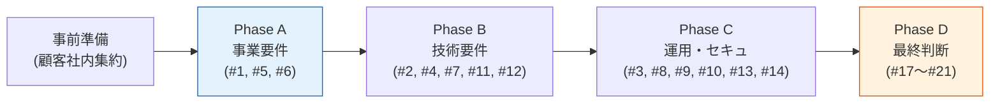

# §C-3 TBD / 要確認 事項サマリー

> 上位 SSOT: [00-index.md](00-index.md)
> 詳細: [../../hearing-checklist.md](../../hearing-checklist.md)
> 関連: [requirements-process-plan.md](../../requirements-process-plan.md)

---

## §C-3.0 本章の位置づけ

本章は **proposal/ 全章で挙げた TBD / 要確認 事項を横断的に集約**し、ヒアリングで最優先で確定すべき項目を可視化する。

各章の "TBD / 要確認" は **顧客固有の事情で決まる**ため、ベースラインだけでは確定できない。本章は:
- 影響度が大きい確認項目（プラットフォーム選定に直結）を上位に
- 顧客ヒアリング前に把握すべき論点を整理
- ヒアリング後の更新も継続反映

| 想定読者 | 利用シーン |
|---|---|
| 顧客側 | 事前に整理しておくべき事項（情シス + 業務部門の合議が必要な事項）の把握 |
| 弊社側 | ヒアリングシナリオの組み立て、各章の収束順序の判断 |

詳細マトリクスは [../../hearing-checklist.md](../../hearing-checklist.md) に集約（全 67 項目、Phase A〜D、優先度・回答欄付き）。本章はその中から **proposal 提示時点で最重要 + 章横断視点**で抜粋。

---

## §C-3.1 最優先 TBD（プラットフォーム選定に直結）

> これらが確定すれば、**Cognito / Keycloak OSS / Keycloak RHBK のいずれが推奨か**が自動的に決まる。

| # | 章 | 確認項目 | 影響 | 関連 |
|:---:|---|---|---|---|
| 1 | [§NFR-3.1 MAU](../nfr/03-scalability.md) | **1 年後 / 3 年後の想定 MAU 規模** | 17.5 万 MAU が損益分岐。規模次第で Cognito ↔ Keycloak の優位が逆転 | [ADR-006](../../../adr/006-cognito-vs-keycloak-cost-breakeven.md) |
| 2 | [§FR-2.1 IdP 接続](../fr/02-federation.md) | **顧客 IdP の種別**（Entra ID / Okta / SAML / LDAP / HENNGE / 自社製等） | SAML IdP モード / LDAP 直結が Must → **Keycloak 必須化** | [§C-2.2](02-platform.md) Keycloak 必須要因 |
| 3 | [§NFR-7.2 業界認定](../nfr/07-compliance.md) | **FIPS 140-2 / 24/7 商用サポート Must か** | FIPS Must → **RHBK 必須化** | [§C-2.2](02-platform.md) RHBK 必須要因 |
| 4 | [§FR-9.1 プロトコル](../fr/09-integration.md) | **Token Exchange / Device Code / mTLS / Back-Channel Logout / Access Token Revocation のいずれかが Must か** | いずれか Must → **Keycloak 必須化** | [§C-2.2](02-platform.md) |
| 5 | [§NFR-8 コスト](../nfr/08-cost.md) | **3 年 TCO の予算レンジ** | コスト制約から候補絞り込み | [§C-2.3](02-platform.md) |
| 6 | [§NFR-7.1 規制](../nfr/07-compliance.md) | **適用地域・データ所在地制約** | GDPR / ISMAP 等で構成変化 | — |
| 7 | [§FR-3.1 MFA 要素](../fr/03-mfa.md) | **Passkey / WebAuthn 必須か** | Cognito Plus または Keycloak で対応、Lite/Essentials は不可 | — |
| 8 | [§NFR-4.3 攻撃対策](../nfr/04-security.md) | **侵害クレデンシャル検出 Must か** | Cognito Plus または Keycloak+HIBP 必須 | — |

---

## §C-3.2 顧客業務・運用に関する TBD

> プラットフォーム選定後の **設計・実装フェーズ**で必要だが、ヒアリングで早めに把握したい項目。

| # | 章 | 確認項目 | 影響 |
|:---:|---|---|---|
| 9 | [§NFR-1.1 SLA](../nfr/01-availability.md) | **目標 SLA**（99.9% / 99.95% / 99.99%） | DR 構成・運用工数・コスト連動 |
| 10 | [§NFR-5.1 RTO/RPO](../nfr/05-dr.md) | **RTO / RPO 目標** | フェイルオーバー方式選定 |
| 11 | [§FR-2.3.2 オンボーディング](../fr/02-federation.md) | **顧客追加リードタイム目標**（< 1 営業日 / 数日 / 週単位） | 自動化レベル決定 |
| 12 | [§FR-7.4 プロビジョニング](../fr/07-user.md) | **JIT / SCIM / 手動** の方針 | API・運用フロー設計 |
| 13 | [§NFR-6.1 ログ保存](../nfr/06-operations.md) | **監査ログ法定保存期間**（1 年 / 3 年 / 6 年 / 10 年） | ストレージコスト |
| 14 | [§NFR-6.3 サポート](../nfr/06-operations.md) | **24/7 サポート Must か** | RHBK 採用判断 / 自社運用体制 |
| 15 | [§NFR-9.1 ユーザー移行](../nfr/09-migration.md) | **既存ユーザー件数・既存システム種別・移行ウィンドウ** | 移行方式（バルク / JIT / SCIM）選定 |
| 16 | [§NFR-9.2 パスワード移行](../nfr/09-migration.md) | **既存パスワードハッシュ形式 / 全員再設定可否** | Keycloak Custom Hash Provider 要否 |

---

## §C-3.3 アーキテクチャ・運用主体に関する TBD

> [§C-1 アーキテクチャ](01-architecture.md) と [§C-2 プラットフォーム](02-platform.md) に紐づく **戦略的判断**。

| # | 章 | 確認項目 | 影響 |
|:---:|---|---|---|
| 17 | [§C-1.4](01-architecture.md) | Broker パターン採用に異論ないか | 採用前提の確認 |
| 18 | [§C-1.4](01-architecture.md) | **Hub の物理境界**（単一基盤 / 用途別分離） | アカウント設計 |
| 19 | [§C-1.4](01-architecture.md) | **既存認証基盤からの移行戦略**（段階 / 一括 / 並行稼働） | 移行計画 |
| 20 | [§C-2.5](02-platform.md) | **運用主体**（弊社 / 顧客 / 共同） | 体制・SLA・契約 |
| 21 | [§FR-2.3.A](../fr/02-federation.md) | **マルチテナント分離方式**（単一 Pool/Realm + 複数 IdP / Pool分離） | 分離レベル次第で Pool/Realm 設計 |

---

## §C-3.4 確認の進め方

詳細な進め方: [requirements-process-plan.md](../../requirements-process-plan.md) / [requirements-hearing-strategy.md](../../requirements-hearing-strategy.md)

---

## §C-3.5 各章 TBD への辿り着き口

| 章 | リンク |
|---|---|
| §FR-1 認証 | [fr/01-auth.md](../fr/01-auth.md) |
| §FR-2 フェデレーション | [fr/02-federation.md](../fr/02-federation.md) |
| §FR-3 MFA | [fr/03-mfa.md](../fr/03-mfa.md) |
| §FR-4 SSO | [fr/04-sso.md](../fr/04-sso.md) |
| §FR-5 ログアウト・セッション管理 | [fr/05-logout-session.md](../fr/05-logout-session.md) |
| §FR-6 認可 | [fr/06-authz.md](../fr/06-authz.md) |
| §FR-7 ユーザー管理 | [fr/07-user.md](../fr/07-user.md) |
| §FR-8 管理機能 | [fr/08-admin.md](../fr/08-admin.md) |
| §FR-9 外部統合 | [fr/09-integration.md](../fr/09-integration.md) |
| §NFR-1 可用性 | [nfr/01-availability.md](../nfr/01-availability.md) |
| §NFR-2 性能 | [nfr/02-performance.md](../nfr/02-performance.md) |
| §NFR-3 拡張性 | [nfr/03-scalability.md](../nfr/03-scalability.md) |
| §NFR-4 セキュリティ | [nfr/04-security.md](../nfr/04-security.md) |
| §NFR-5 DR | [nfr/05-dr.md](../nfr/05-dr.md) |
| §NFR-6 運用 | [nfr/06-operations.md](../nfr/06-operations.md) |
| §NFR-7 コンプライアンス | [nfr/07-compliance.md](../nfr/07-compliance.md) |
| §NFR-8 コスト | [nfr/08-cost.md](../nfr/08-cost.md) |
| §NFR-9 移行性 | [nfr/09-migration.md](../nfr/09-migration.md) |
| §C-1 アーキテクチャ | [01-architecture.md](01-architecture.md) |
| §C-2 プラットフォーム | [02-platform.md](02-platform.md) |
