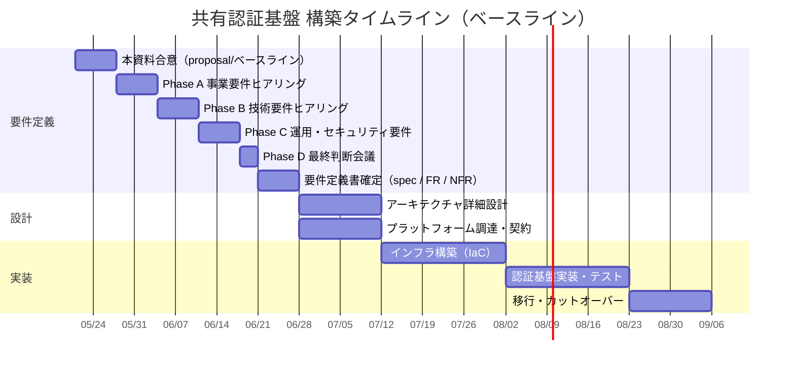
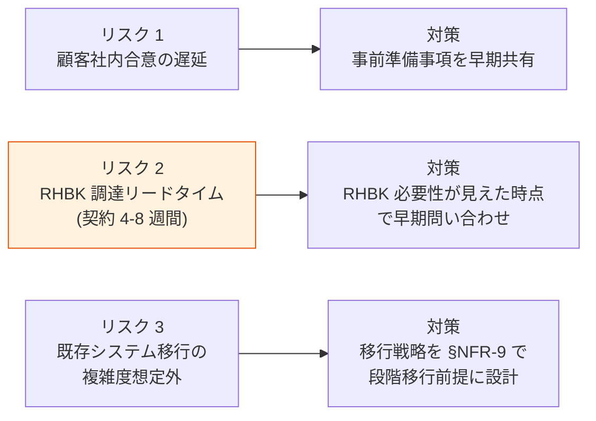

# §C-4 想定スケジュール

> 上位 SSOT: [00-index.md](00-index.md)
> 詳細プロセス: [../../requirements-process-plan.md](../../requirements-process-plan.md)（4 段階プロセスの実装可能性評価フレーム・終了基準）
> ヒアリング戦略: [../../requirements-hearing-strategy.md](../../requirements-hearing-strategy.md)

---

## §C-4.0 本章の位置づけ

本基盤の要件定義 → 設計 → 実装 までの **想定タイムライン**を顧客と合意する。各 Week の作業内容と成果物を明示し、双方の準備時期を揃える。

開始時期・各 Phase の所要は **顧客固有の事情**で変動するため、本章はベースライン（標準シナリオ）を提示し、TBD として確定タイミングを残す。

---

## §C-4.1 全体マイルストーン（ベースライン）

---

## §C-4.2 各 Phase の作業内容

| Week | フェーズ | 主作業 | 成果物 |
|---|---|---|---|
| Week 0 | 準備 | 本資料（proposal/）の最終調整 | proposal/ 各章ベースライン |
| Week 1 | **本資料合意** | 顧客と proposal/ 各章を読み合わせ、§FR-X / §NFR-X / §C-X のベースライン合意 | 合意済 proposal/、Phase A 質問票 |
| Week 2 | **Phase A 事業要件** | MAU 規模・適用地域・予算・移行戦略を確定 | [hearing-phase-a.md](../../hearing-phase-a.md) |
| Week 3 | **Phase B 技術要件** | IdP 種別・MFA 方式・SSO/ログアウト・認可方式を確定 | [hearing-phase-b.md](../../hearing-phase-b.md) |
| Week 4 | **Phase C 運用・セキュ** | SLA・RTO/RPO・FIPS・24/7 サポート・監査保存期間を確定 | [hearing-phase-c.md](../../hearing-phase-c.md) |
| Week 5 | **Phase D 最終判断** | プラットフォーム選定（Cognito / Keycloak OSS / RHBK） | [hearing-phase-d.md](../../hearing-phase-d.md)、[platform-selection-decision.md](../../platform-selection-decision.md) |
| Week 6 | **要件定義書確定** | requirements-spec.md / functional-requirements.md / non-functional-requirements.md 最終化 | 要件定義書一式 |
| Week 7-8 | アーキテクチャ詳細設計 | AWS 構成 / IAM / VPC / 監視 / DR 設計 | 詳細設計書 |
| Week 7-8 | 調達・契約 | RHBK サブスク調達（採用時）/ AWS Enterprise Support 等 | 契約書 |
| Week 9-11 | インフラ構築 | Terraform / IaC / CI/CD パイプライン | デプロイ可能インフラ |
| Week 12-14 | 認証基盤実装・テスト | 機能テスト / 性能 / DR / セキュリティ試験 | テスト合格 |
| Week 15-16 | 移行・カットオーバー | 既存ユーザー移行 / 段階切替 | 本番稼働 |

---

## §C-4.3 顧客側の準備事項

各 Phase ヒアリング前に顧客側で集約しておくと、ヒアリングが空回りせず確定までの所要時間が大幅に短縮される。

| Phase | 顧客側準備 | 関連部門 |
|---|---|---|
| Phase A | MAU 実績データ・3 年事業計画・予算レンジ・適用地域・既存システム棚卸し | 経営 / 情シス / 経企 |
| Phase B | 既存 IdP / SAML IdP 情報・既存システム認証連携の現状・既存 MFA 方式 | 情シス / セキュリティ / 各業務システム担当 |
| Phase C | 業務 SLA 要件・法定保存期間・コンプラ要件（FIPS / ISMAP 等）・運用体制 | 情シス / セキュリティ / 法務 / 監査 |
| Phase D | プラットフォーム選定の意思決定者・決裁ルート | 経営 / 情シス |

---

## §C-4.4 リスクとバッファ

| リスク | 影響 | 緩和策 |
|---|---|---|
| 顧客社内合意の遅延 | Week 単位の遅れ | §C-3 TBD 事前準備を早期共有 |
| RHBK 調達リードタイム | 設計フェーズ開始遅延 | FIPS / 24/7 が見えた時点で [rhbk-vendor-inquiry.md](../../rhbk-vendor-inquiry.md) を送付 |
| 既存システム移行の複雑度 | 実装後半の遅延 | [§NFR-9 移行性](../nfr/09-migration.md) を段階移行前提で設計 |

---

## §C-4.5 TBD / 要確認

| 確認項目 | 回答例 |
|---|---|
| **本資料合意の開始時期**（Week 1 起点） | 2026-MM-DD |
| 各 Phase の所要週数 | ベースライン 1 週 / 短縮可 / 拡張要 |
| 設計フェーズへの引き渡し時期 | Week 7（標準） / より早く / より遅く |
| 本番稼働目標 | Week 16（標準） / 目標時期 YYYY-MM |
| 並行する他プロジェクト | あり（リソース調整必要）/ なし |

---

## 参考

- [../../requirements-process-plan.md](../../requirements-process-plan.md): 4 段階プロセスの詳細・終了基準
- [../../requirements-hearing-strategy.md](../../requirements-hearing-strategy.md): Phase A〜D 個別の進め方
- [../../hearing-checklist.md](../../hearing-checklist.md): 全ヒアリング項目（67 項目）
