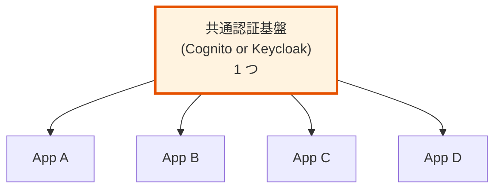
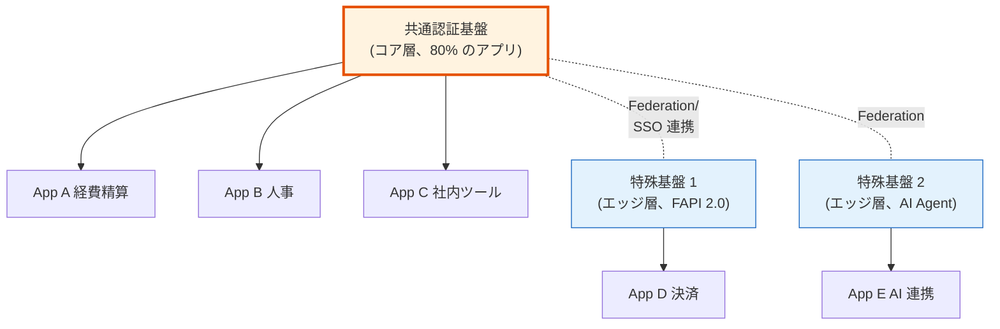
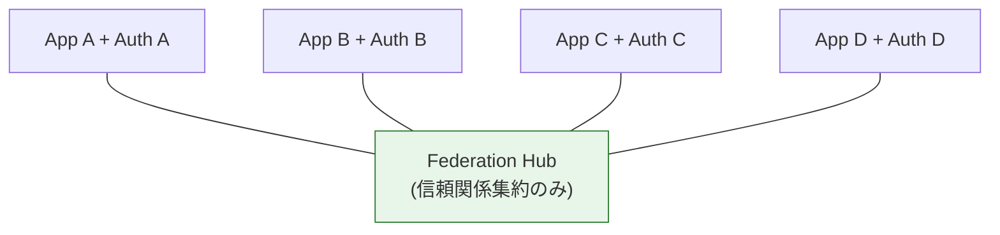
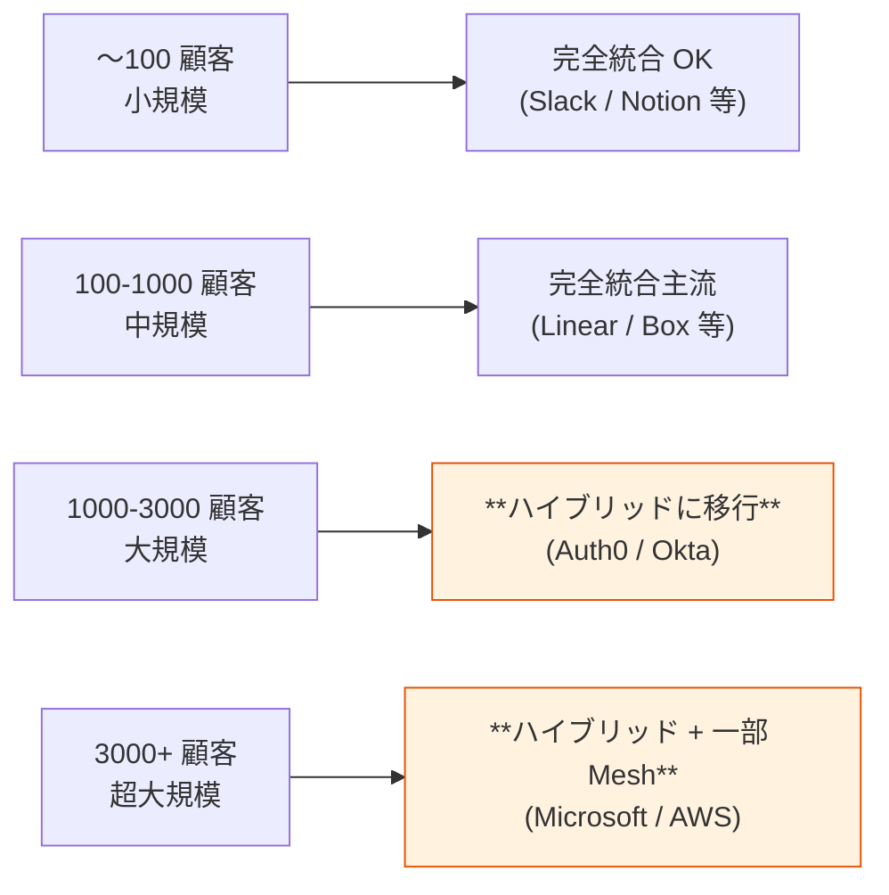
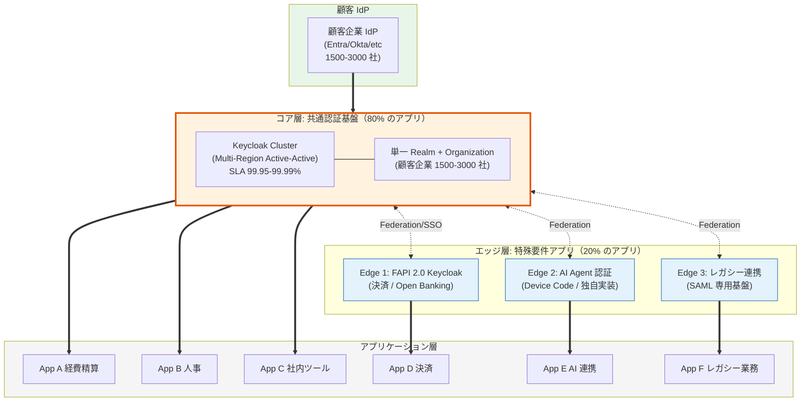
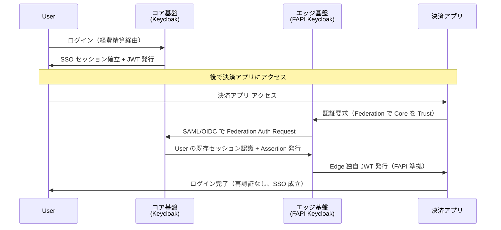

# §C-6 アーキテクチャ判断: ハイブリッド統合の根拠と設計

> **本ドキュメントの位置づけ**: 当初前提とした「共通認証基盤への完全統合（Identity Broker パターン一択）」について、再検討の過程で提起された 6 つの懸念を踏まえ、**ハイブリッド統合**（コア統合 + エッジ自律）を推奨アーキテクチャとして提案する根拠と詳細設計を示す調査文書。
>
> **対象読者**: 顧客側意思決定者（経営層 / 情シス責任者 / アプリオーナー）+ 弊社設計責任者
> **用途**: D-6（Identity Broker パターン採用前提合意）ヒアリングの**前提資料**として、関係者全員で前提を揃えるためのドキュメント。
> **§C-1 / §C-2 との関係**: §C-1 で確立した Broker パターン分析は **コア層に適用**、§C-2 のプラットフォーム選定は **コア / エッジ両層に拡張適用**される。

---

## 0. エグゼクティブサマリー

### 結論

**御社規模（顧客企業 1500-3000 社、対象アプリ 10+）における推奨アーキテクチャは「ハイブリッド統合」**:

- **コア層**: 80% のアプリを共通認証基盤に統合（Keycloak + 単一 Realm + Organization 機能、99.95% SLA、AAL2）
- **エッジ層**: 20% の特殊要件アプリは独自基盤を許容、共通基盤と Federation で SSO 維持
- **ティア化**: コア層内に Standard / High-security / Critical の 3 段階を設置、アプリは必要なティアを選択

### 主要根拠

1. **当初提案の「完全統合」は重要な弱点を持つ**: SPOF / 過剰品質 / 変更困難 / 想定外対応不可
2. **業界実例の検証**: 規模が大きくなるほど、Microsoft / Okta / Auth0 等は **ハイブリッド型**に移行している
3. **御社規模では Cognito 単一 Pool が物理的に不可**（Hard Limit 抵触、§C-1.5 参照）→ どのみち「変形 L2」になる
4. **SSO 要件と統合度は分離可能**: Federation で SSO 達成しつつ、アプリ自律性を維持できる

### 期待される効果

| 観点 | 完全統合 | **ハイブリッド** | 完全分散 |
|---|:-:|:-:|:-:|
| **SSO 維持** | ✅ | ✅（コア内自動 + エッジ federation）| ⚠ 複雑 |
| **可用性（SPOF 影響範囲）** | ❌ 全アプリ | ⚠ コアのみ影響、エッジは独立 | ✅ 各独立 |
| **アプリ最適化** | ❌ | ✅ エッジで自由 | ✅ |
| **過剰品質回避** | ❌ | ✅ ティア化 | ✅ |
| **個別要件変更** | ❌ | ✅ エッジ自由 | ✅ |
| **想定外アプリ対応** | ❌ | ✅ エッジで新規対応 | ✅ |
| **運用コスト** | ✅ 集約 | ⚠ コア + 限定的エッジ | ❌ N 倍 |
| **セキュリティ baseline** | ✅ 統一 | ✅ コア統一、エッジは規約 | ❌ ドリフト |

→ **ハイブリッドが 8 観点中 7 観点で「○ 以上」、明確な弱点なし**。

---

## 1. 背景: なぜ再検討したか

### 1.1 当初の前提

本基盤は当初、**「Identity Broker パターンによる完全統合」**を前提として設計を進めていた（§C-1.1 で根拠提示）：

- 単一 Realm/Pool に全アプリを統合
- 顧客 IdP を一元連携
- JWT 発行統一による各アプリの「Broker 1 つを Trust するだけ」設計
- マルチテナント（L2 論理分離 + tenant_id クレーム、§C-1.4）

### 1.2 再検討の契機 — 6 つの懸念

設計レビュー段階で、以下の 6 つの本質的懸念が提起された：

| # | 懸念 | 影響 |
|:-:|---|---|
| 1 | **SSO は必須要件としてあるが、統合は唯一の解か?** | アーキテクチャ前提の見直し |
| 2 | **単一障害点（SPOF）になるリスク** | 可用性・BCP |
| 3 | **アプリごとの実装最適化の放棄** | 各アプリの最適 IdP 選定が不可 |
| 4 | **BCP・セキュリティを厳しい方に合わせるため、多くのアプリで過剰品質** | コスト膨張・運用負荷 |
| 5 | **個別要件変更の困難**（こっち Cognito、こっち Keycloak 等が不可）| アプリ自律性の喪失 |
| 6 | **不特定多数 / 想定されていないアプリへの対応リスク** | 将来拡張性 |

これらは**いずれも完全統合の本質的弱点を突いた正当な指摘**であり、提案を補強する必要がある。

### 1.3 検討アプローチ

以下の 3 段階で再評価：

1. **6 つの懸念の深掘り分析** — 各懸念の実態とリスクを定量化
2. **アーキテクチャ選択肢の整理** — 4 つの選択肢を業界実例で比較
3. **御社規模での評価** — 1500-3000 顧客企業 × 10+ アプリの規模で最適解を導出

---

## 2. アーキテクチャ選択肢の整理（4 つ）

### 2.1 選択肢 A: 完全統合（Identity Broker 一択）



**特徴**: 1 つの認証基盤に全アプリを統合。当初提案。

**メリット**: SSO 自動成立 / 運用集約 / セキュリティ baseline 統一 / コスト効率（規模次第）
**デメリット**: SPOF / 最大公約数の過剰品質 / 変更困難 / 想定外対応不可 / プラットフォーム選定が一発勝負

### 2.2 選択肢 B: ハイブリッド（コア統合 + エッジ自律）⭐ 推奨



**特徴**: 標準的なアプリは共通基盤に統合（コア）、特殊要件のアプリは独自基盤を許容（エッジ）、Federation で SSO 維持。

**メリット**: SSO 維持 / アプリ最適化可能（エッジ）/ 過剰品質回避（ティア化）/ 想定外対応可能 / SPOF リスク分散
**デメリット**: コア + エッジで運用 2 系統 / Federation 設計の専門性必要 / ガバナンス強化必要

### 2.3 選択肢 C: 完全分散（各アプリ独立 + Federation で SSO）



**特徴**: 各アプリが独自の認証基盤を持ち、Federation Hub で SSO 用の信頼関係のみ共有。

**メリット**: アプリごと完全最適化 / SPOF なし / 変更完全自由
**デメリット**: SSO 実装複雑 / 運用コスト N 倍 / セキュリティ baseline drift / 専門人員 N 倍

### 2.4 選択肢 D: Identity Mesh / Fabric（次世代）

```mermaid
flowchart LR
    A[App A] ⇄ B[App B] ⇄ C[App C]
    A ⇄ C
    Fabric["Identity Fabric<br/>(Trust + Policy + Discovery)"]
    A --- Fabric
    B --- Fabric
    C --- Fabric

    style Fabric fill:#e1bee7,stroke:#6a1b9a
```

**特徴**: KuppingerCole 等が提唱する次世代パターン。Trust / Policy / Discovery を Fabric で集約しつつ、各アプリは自律的に IdP 選択。

**メリット**: 究極の柔軟性 / 業界の future direction
**デメリット**: **標準化途上 / 実装事例少 / リスク高**（PoC レベル、本番採用は 2027-2028 以降推奨）

---

## 3. 6 つの懸念の深掘り分析

### 3.1 懸念 1: SSO 必須 vs 統合 — 同義ではない

**重要な認識整理**: SSO 要件と統合は別軸の議論である。

| SSO 実現方式 | 統合度 | 実現可否 | 代表例 |
|---|---|:-:|---|
| 単一認証基盤内で全アプリ共有 | 完全統合 | ✅ | Slack / Notion |
| 複数認証基盤を Federation で繋ぐ | 部分統合（ハイブリッド）| ✅ | Microsoft Entra + GCC / Auth0 Public + Private Cloud |
| Token Forwarding / Session Sharing | 緩い統合 | ✅ | レガシー業務系の SSO |
| 各アプリ独立 + Federation Hub のみ共有 | 最小統合 | ✅ | GakuNin（学術認証）|

→ **SSO 必須であっても、「全統合」は唯一の解ではない**。

### 3.2 懸念 2: 単一障害点（SPOF）

#### 3.2.1 実態の比較

| 観点 | 完全統合 | ハイブリッド | 完全分散 |
|---|---|---|---|
| **1 回障害の影響範囲** | **全アプリ停止** | コア層のみ（エッジは独立稼働）| 該当アプリのみ |
| **障害発生頻度** | 低（1 基盤）| 中（コア + N エッジ）| 高（N 基盤）|
| **復旧体制** | 1 チーム集中 → 早い | コア集中 + エッジ自律 | N チーム分散 → 連携困難 |
| **BCP 投資効率** | ✅ 集中投資で 99.99% 達成可 | ✅ コアに集中、エッジは要件次第 | ❌ 各基盤への分散投資 |
| **過去の業界事例** | Cognito us-east-1 障害（2019, 2021, 2023）で複数 SaaS 同時停止 | - | - |

#### 3.2.2 「SPOF」の本当のリスク評価

**統合 = SPOF」と単純化するのは誤り**。重要なのは：

- **障害発生確率 × 影響範囲 × 復旧時間** = リスク総量
- 統合: 障害発生確率は最小、影響範囲最大、復旧最速 → 投資次第で 99.99% 達成可能
- 分散: 障害発生確率最大、影響範囲最小、復旧分散 → 全体可用性はばらつき

#### 3.2.3 ハイブリッドでの対応

- **コア層**: Multi-Region + Active-Active で 99.95-99.99% SLA を実現
- **エッジ層**: 各アプリが自分の必要 SLA を選択（コア依存 / 独自冗長化）
- **影響範囲限定**: コア障害でもエッジアプリは独立稼働可能（federation キャッシュで継続動作）

### 3.3 懸念 3: アプリごとの実装最適化の放棄

#### 3.3.1 アプリ多様性の実例

異なるアプリには異なる最適認証基盤がある：

| アプリタイプ | 最適認証基盤 | 理由 |
|---|---|---|
| **高トラフィック公開アプリ** | Cognito | AWS 統合、無限スケール、$0.0055-0.025/MAU |
| **内部管理ツール（管理者多数）**| Keycloak | 豊富な Admin API、Theme カスタマイズ、Group/Role 管理 |
| **FAPI 2.0 準拠 決済アプリ** | Keycloak（FAPI Profile）| DPoP / mTLS / Pushed Authorization Requests 標準対応 |
| **レガシー SAML SP** | Keycloak | SAML IdP モード対応（Cognito 非対応）|
| **AI Agent / IoT 認証** | Keycloak（Device Code）or 自前 | Cognito 非対応の Device Code Flow |
| **シンプル内部 CLI** | ローカル認証 + IAM | 重い認証フロー不要、IAM で十分 |

#### 3.3.2 各選択肢での対応

- **完全統合**: 全アプリで「最大公約数の機能セット」のみ。**最適なツール選定の余地なし**
- **ハイブリッド**: コア層は標準、エッジ層は **最適な IdP を自由に選定可能**
- **完全分散**: 全アプリで最適化、ただし SSO 実装と運用コストの負担大

→ **ハイブリッドは「80% のアプリは標準で十分」+「20% の特殊アプリは最適化」を両立**。

### 3.4 懸念 4: BCP / セキュリティ過剰

#### 3.4.1 「最大公約数 vs 最小公倍数」問題

統合基盤の場合、**最も厳しいアプリの要件に全体を合わせる必要**が発生する：

| アプリ | 必要 SLA | 必要 AAL | 監査ログ保存 | 想定コスト規模 |
|---|---|---|---|---|
| 経費精算（社内）| 99.5% | AAL2 | 1 年 | 標準 |
| **決済システム（金融規制）** | **99.99%** | **AAL3 Phishing-resistant** | **7 年（FFIEC）** | **高** |
| 内部 CLI ツール | 99% | AAL1 | 不要 | 最小 |
| 顧客向けポータル | 99.9% | AAL2 | 1 年 | 標準 |

**統合基盤の場合**：
- **「全アプリに 99.99% / AAL3 / 7 年保存」が一律適用**される
- 経費精算や CLI には明らかに過剰
- コスト線形膨張（Plus ティア +$0.02/MAU、Splunk 監査ログ保存料、24/7 サポート）

#### 3.4.2 ハイブリッドでのティア化アプローチ

**コア層内にティアを設置**：

| ティア | SLA | AAL | 監査ログ | 対象アプリ |
|---|---|---|---|---|
| **Standard** | 99.95% | AAL2 | 1 年 | 一般的な内部・B2B アプリ（経費精算 / 人事 / 顧客ポータル 等）|
| **High-security** | 99.99% | AAL3 | 3 年 | 個人情報・機微情報を扱うアプリ |
| **Critical** | 99.99% | AAL3 + FIPS | 7 年 | 金融 / 医療 / 規制業種アプリ |
| **エッジ層（独自）** | アプリ要件次第 | 同左 | 同左 | 完全独自要件のアプリ |

各アプリは必要なティアを選択することで、**過剰品質を回避**できる。

### 3.5 懸念 5: 個別要件変更の困難

#### 3.5.1 ガバナンス vs 自律性のトレードオフ

| 観点 | 完全統合 | ハイブリッド | 完全分散 |
|---|---|---|---|
| **変更の意思決定** | 全アプリ合意必要 | コア = 統一、エッジ = 自由 | 各アプリ独立 |
| **標準遵守** | ✅ 強制 | ✅ コア内強制 / エッジは規約 | ❌ ドリフト |
| **変更速度** | 遅い | コア = 遅、エッジ = 速 | 速い |
| **セキュリティ baseline** | ✅ 統一 | ✅ コア統一 / エッジ規約 | ❌ バラつく |
| **特殊要件への対応** | ❌ 困難 | ✅ エッジで対応 | ✅ 自由 |

#### 3.5.2 ハイブリッドでの解決

- **コア層**: 全アプリ共通の認証基盤、ガバナンス強化（変更は CCB 経由 / Git PR レビュー）
- **エッジ層**: アプリチームが**自律的に IdP 選定・運用可能**
  - 例: 決済アプリは Keycloak FAPI Profile に乗せ替え可能（他アプリに影響なし）
  - 例: AI Agent アプリは独自 Device Code 実装可能

### 3.6 懸念 6: 想定外アプリへの対応

#### 3.6.1 「過去の決定」が「未来の制約」になる問題

完全統合では、初期選定が**5 年後の新規アプリ追加を制約**する：

- 例: Cognito 採用後、3 年後に FAPI 2.0 準拠アプリが追加 → Token Exchange 必要 → **全アプリ Keycloak 移行**（事実上不可能）
- 例: Web3 / Decentralized Identity 対応のアプリ → 既存基盤では対応困難

#### 3.6.2 ハイブリッドでの解決

- **新規アプリは「コア / エッジ」を選択可能**
- 既存コアに合わない要件のアプリは **エッジで対応**
- Federation 接続で SSO 維持
- **5 年後の不確実性に対応する余地**を確保

---

## 4. 業界実例の調査

### 4.1 規模別の採用パターン

| 企業 / サービス | 規模 | 採用パターン | 備考 |
|---|---|---|---|
| **Slack** | 大 | 完全統合 | 単一 Realm、Workspace で論理分離 |
| **Notion** | 中 | 完全統合 | 同上 |
| **Linear** | 中 | 完全統合 | SAML + SCIM、organization_id 識別 |
| **Box** | 大 | 完全統合 | enterprise_id 識別 |
| **Auth0**（製品）| 大 | **ハイブリッド** | Public Cloud + Private Cloud（規制顧客向け別基盤）|
| **Microsoft Entra** | 超大 | **ハイブリッド** | Public + GCC（米政府）+ GCC-High + DoD（4 階層分離）|
| **Okta** | 超大 | **ハイブリッド** | Shared Cell + Dedicated Cell（顧客契約次第）|
| **AWS**（自社認証）| 超大 | **ハイブリッド** | IAM + IAM Identity Center + Cognito + 内部 SSO（4 系統並行）|
| **大手金融機関** | 大 | **ハイブリッド〜完全分散** | 業務系ごと独立基盤、Federation で連携 |
| **GakuNin（学術認証）** | 巨大 | **Identity Mesh** | 各大学が独立 Broker、相互信頼でメッシュ化 |

### 4.2 規模との相関



→ **規模が大きくなるほど、業界実例は「ハイブリッド」に集約**している。

### 4.3 主要参考文献

- **KuppingerCole Leadership Compass: Identity Fabrics**（2024-2025）: 大規模組織の Identity Fabric / Mesh への移行トレンド
- **Microsoft Entra GCC アーキテクチャ公開資料**: 政府機関向け Dedicated Cell の運用設計
- **Auth0 Private Cloud Reference Architecture**: 規制業種向けハイブリッド構成
- **Okta Custom Cell Architecture**: Shared / Dedicated Cell の切り分け基準
- **AWS Cognito Service Quotas**（2024-2025）: Hard Limit の実態
- **本基盤 PoC 結果**: §C-5 PoC 補足 で確認した Cognito / Keycloak の対応差分

---

## 5. 御社規模での評価マトリクス

### 5.1 御社規模の整理

- **顧客企業数**: 現状 1,500 社 → 5 年後 3,000 社想定（A-15 参照）
- **対象アプリ数**: 10+（A-3 で確認予定）
- **業種多様性**: 規制業種を含む可能性あり（金融 / 医療 / B2B SaaS）
- **SSO 要件**: 必須
- **ステークホルダー**: アプリオーナー / 情シス / セキュリティ / 経営層

### 5.2 4 選択肢の評価

| 選択肢 | 御社規模での適合性 | コメント |
|---|:-:|---|
| **A. 完全統合** | △ | Cognito は 1500 顧客で Pool 分割必須（実質ハイブリッド化）、Keycloak でも特殊要件アプリへの対応に限界 |
| **B. ハイブリッド** | ◎ **強推奨** | スケール / 特殊要件 / BCP / 自律性すべてバランス取れる、業界実例多数 |
| **C. 完全分散** | × | アプリ 10+ × 顧客 3000 = 運用爆発、SSO 実装も複雑、専門人員 N 倍 |
| **D. Identity Mesh** | △ | 標準化途上、3-5 年後の次世代として位置付け、現時点本番採用は時期尚早 |

### 5.3 規模特有の制約

- **Cognito 単一 Pool は 1500 顧客で物理的に不可**（IdP per Pool 〜1000、SAML 実質 〜100、Custom Domain 4/region）
- **どのみち「変形 L2（複数 Pool 分割 + Lambda@Edge）」になる** → これは事実上ハイブリッド構成
- **Keycloak 採用なら単一 Realm + Organization 機能で対応可能**、ただし将来の特殊要件アプリへの対応を考えるとエッジ層を許容する設計が望ましい

→ **御社規模では、初期からハイブリッド設計を採用するのが業界実例とも整合**。

---

## 6. ハイブリッドアーキテクチャの詳細設計

### 6.1 全体構造



### 6.2 コア層の設計

#### 6.2.1 基本構成

- **プラットフォーム**: Keycloak（OSS or RHBK、規制要件で決定）
- **デプロイ**: Multi-Region Active-Active（東京 + 大阪 等）
- **マルチテナント**: 単一 Realm + Organization 機能（Keycloak 26+）
- **対象アプリ**: 標準的な認証要件のアプリ（80% 想定）

#### 6.2.2 ティア化

| ティア | SLA | AAL | 監査ログ | 適用アプリ例 |
|---|---|---|---|---|
| **Standard**（デフォルト）| 99.95% | AAL2 | 1 年 | 経費精算、人事、社内ツール、一般 B2B SaaS |
| **High-security** | 99.99% | AAL3 | 3 年 | 個人情報・機微情報を扱うアプリ |
| **Critical** | 99.99% | AAL3 + FIPS | 7 年 | 金融・医療など規制業種アプリ（ただし業種次第でエッジ層に移すことも検討）|

#### 6.2.3 SSO 範囲

- **コア層内**: 自動 SSO（Realm 内のアプリ間）
- **コア → エッジ**: Federation 経由で SSO 維持

### 6.3 エッジ層の設計

#### 6.3.1 エッジ層に該当するアプリの判定基準

以下のいずれかに該当するアプリは **エッジ層を検討**：

1. **コア層では対応不可の技術要件**（Token Exchange / Device Code / FAPI 2.0 等で**コアのプラットフォームでサポートされない**）
2. **コア層の SLA / AAL を大幅に超える要件**（99.999% SLA、独自 MFA 等）
3. **完全に独自の認証フロー**（Web3、独自プロトコル、特殊 IoT 等）
4. **アプリオーナーが独自運用を強く希望**（業務継続性の独立性確保 等）
5. **規制要件で「物理的に独立した認証基盤」が必須**（一部金融規制 等）

#### 6.3.2 典型的なエッジ層アプリの例

| アプリ | 採用基盤 | 理由 |
|---|---|---|
| 決済（FAPI 2.0 準拠）| Keycloak FAPI Profile | DPoP / mTLS / PAR 必須 |
| AI Agent 認証 | 独自 Device Code 実装 | 標準 Cognito / Keycloak で未対応の AI 連携プロトコル |
| レガシー業務系（SAML SP-only）| Keycloak SAML IdP モード | 古い SAML SP との連携、専用設定 |
| 規制業種専用（金融 / 医療）| 別 Keycloak Cluster + 物理分離 | コンプラ要件で物理分離必須 |

### 6.4 Federation 接続パターン

#### 6.4.1 SSO 連携（コア → エッジ）



#### 6.4.2 接続プロトコル

- **コア → エッジ**: OIDC Federation または SAML SP モード
- **エッジは Core を Identity Provider として登録**
- ユーザーは Core で 1 度認証すれば、Edge アプリでも SSO 成立

### 6.5 Federation-Friendly 設計原則

ハイブリッド構成を将来も維持・拡張するための設計原則：

1. **コア基盤は OIDC/SAML 標準準拠** — 他基盤との Federation 接続を容易に
2. **JWT クレーム標準化** — Edge 層でも同じクレーム構造を利用可能に
3. **新規アプリ追加時の判定フローを明文化**（§7 参照）
4. **アプリの「opt out」許容** — 既存コア統合アプリでも、後にエッジ層に移管可能
5. **Discovery エンドポイント整備** — アプリは自動で適切な認証基盤を発見

---

## 7. アプリ振分け基準（コア / エッジ判定フロー）

新規アプリ追加 / 既存アプリ振分けの判定フローを明文化：

```mermaid
flowchart TB
    Start[新規アプリ追加 / 振分け検討]

    Q1{コア基盤で<br/>技術要件を満たせるか?<br/>(K1-K8 Knockout 等)}
    Q1 -->|No| Edge["エッジ層採用<br/>(独自基盤 + Federation)"]
    Q1 -->|Yes| Q2

    Q2{コア基盤の<br/>Standard ティアで<br/>SLA/AAL 要件を<br/>満たせるか?}
    Q2 -->|Yes| CoreStd["コア層 / Standard ティア"]
    Q2 -->|No| Q3

    Q3{High-security<br/>ティアで満たせるか?}
    Q3 -->|Yes| CoreHigh["コア層 / High-security ティア"]
    Q3 -->|No| Q4

    Q4{Critical<br/>ティアで満たせるか?}
    Q4 -->|Yes| CoreCrit["コア層 / Critical ティア"]
    Q4 -->|No| Edge

    Q5{アプリオーナーが<br/>独自運用を強く希望<br/>(自律性要件)?}
    CoreStd --> Q5
    CoreHigh --> Q5
    CoreCrit --> Q5
    Q5 -->|Yes| Edge
    Q5 -->|No| Final["コア層採用確定"]

    style Edge fill:#e3f2fd,stroke:#1565c0
    style CoreStd fill:#fff3e0,stroke:#e65100
    style CoreHigh fill:#fff3e0,stroke:#e65100
    style CoreCrit fill:#fff3e0,stroke:#e65100
    style Final fill:#e8f5e9,stroke:#2e7d32
```

### 7.1 判定例

| アプリ | 判定結果 | 理由 |
|---|---|---|
| 経費精算 SaaS | **コア / Standard** | 標準的な OIDC 認証、AAL2 で十分 |
| 人事システム | **コア / Standard** | 同上 |
| 社内 CLI ツール | **コア / Standard** | 認証フロー標準、ローカル認証 + JIT |
| 顧客向けポータル（一般）| **コア / Standard** | 同上 |
| 個人情報を扱う顧客ポータル | **コア / High-security** | AAL3 必要 |
| **決済システム（FAPI 2.0）** | **エッジ層** | DPoP / mTLS 必要、コアでサポート困難 |
| **AI Agent 連携 API** | **エッジ層** | Device Code Flow 必要 |
| **レガシー SAML SP（改修不可）**| **エッジ層** | SAML IdP モード必要、コアで非対応の可能性 |
| 金融規制対応アプリ | **コア / Critical or エッジ** | FIPS 必須なら Critical、物理分離契約ならエッジ |

---

## 8. 6 つの懸念への対応マトリクス

| 懸念 | ハイブリッドでの対応 |
|---|---|
| **1. SSO は必須要件** | コア層内 = 自動 SSO、コア ↔ エッジ = Federation で SSO 維持。すべてのアプリ間で SSO 成立可能 |
| **2. SPOF リスク** | コア層 = Multi-Region Active-Active で 99.95-99.99% SLA。エッジ層は独立稼働可能（コア障害でも継続動作） |
| **3. アプリごとの実装最適化の放棄** | エッジ層で**各アプリの最適 IdP を自由選定可**。コア層も Standard/High-security/Critical のティア選択あり |
| **4. BCP/セキュリティ過剰** | **ティア化**で各アプリが必要なレベルを選択。一律過剰品質を回避 |
| **5. 個別要件変更の困難** | エッジ層は **アプリチームが自律的に変更可能**。コア層は CCB ガバナンス |
| **6. 想定外アプリへの対応** | エッジ層で **新規プロトコル・新規 IdP を独自採用可能**。コア層を変えずに対応 |

---

## 9. 期待される効果

### 9.1 定量効果（試算）

| 観点 | 完全統合 | **ハイブリッド** | 差分 |
|---|---|---|---|
| **初期構築コスト** | $X | $X × 1.2-1.3（コア + 1 エッジ）| +20-30% |
| **3 年運用コスト** | $Y | $Y × 1.1-1.2（エッジは限定的）| +10-20% |
| **アプリ追加時間（標準）** | 1 営業日 | 1 営業日（コア）| 変化なし |
| **アプリ追加時間（特殊）** | **数週間〜数ヶ月**（コア改修）| 1-2 週間（エッジ追加）| **大幅改善** |
| **特殊要件アプリの対応可否** | ❌ プラットフォーム選定に依存 | ✅ 対応可能 | **質的改善** |
| **障害影響範囲** | 全アプリ | コアのみ | **70-80% 縮小**（エッジ 20% 想定）|

→ **初期コスト +20-30% の投資**で、**5 年以上にわたる柔軟性・可用性・将来対応力**を獲得。

### 9.2 定性効果

- **アプリオーナーの自律性向上** — 特殊要件は自分で決められる
- **将来不確実性への対応力** — 5 年後の新規アプリ追加に対応可能
- **顧客への提案力強化** — 規制業種顧客に「物理分離オプション」を提供可能
- **業界スタンダードへの整合** — Auth0/Microsoft/Okta と同じ思想

---

## 10. リスクと対策

| リスク | 影響 | 対策 |
|---|---|---|
| **エッジ層の乱立** — アプリチームが安易に「自分で作る」と言い出す | 運用コスト爆発 | §7 判定フローを厳格に運用、CCB 承認必須 |
| **Federation 設計の専門性不足** | 接続不安定、セキュリティリスク | 初期に Federation 専門家（外部 SI / Auth コンサル）を関与、設計ガイドライン整備 |
| **コア + エッジで運用人員 2 系統必要** | 人件費増 | コア層に集中投資 + エッジは「最小限の運用」契約（アプリチーム責任）|
| **コア / エッジの境界判定でもめる** | 政治的議論で意思決定遅延 | §7 判定フローを意思決定者承認の上で文書化、適用は機械的に |
| **セキュリティ baseline がエッジでドリフト** | コンプラ違反リスク | エッジ層にも最低限の規約（パスワードポリシー / MFA / 監査ログ）を契約条件化 |

---

## 11. 段階的移行戦略

### 11.1 Phase 1（初期 6 ヶ月）— コア層構築

- コア層（Keycloak + Organization）を構築
- 80% の標準アプリをコア層に統合
- ティア化なし（Standard 一律）

### 11.2 Phase 2（6-12 ヶ月）— エッジ層追加 + ティア導入

- 特殊要件アプリの 1-2 個をエッジ層として構築（PoC 兼用）
- Federation 接続を実装・検証
- コア層に High-security / Critical ティアを導入

### 11.3 Phase 3（12-24 ヶ月）— 拡張・最適化

- エッジ層を段階的に拡張（特殊要件アプリの追加）
- コア層のティア間移動運用を確立
- アプリチーム向けのセルフサービスポータル整備

### 11.4 Phase 4（24 ヶ月以降）— Identity Fabric への発展可能性

- 業界標準化動向を見極めつつ、必要に応じて Identity Fabric / Mesh への発展を検討

---

## 12. 必要な意思決定事項（D-6 拡張）

D-6 ヒアリング項目を以下のように拡張：

| 確認項目 | 選択肢 | 影響 |
|---|---|---|
| **D-6.1 アーキテクチャ方針** | 完全統合 / **ハイブリッド** / 完全分散 / Mesh | 全体方針確定 |
| **D-6.2 コア層 / エッジ層の境界判定基準** | §7 判定フローで合意 / 別案 | 運用ガバナンス |
| **D-6.3 ティア化の採否** | 採用（3 ティア）/ 採用（2 ティア Standard + Critical）/ 不採用（Standard のみ）| コア層内設計 |
| **D-6.4 初期エッジ層のスコープ** | 該当アプリの特定 + 件数想定 | Phase 2 計画 |
| **D-6.5 Federation 設計の責任分担** | 弊社（コア + 主要エッジ）/ アプリチーム（自エッジ）/ ハイブリッド | 運用体制 |
| **D-6.6 セキュリティ baseline 規約** | エッジ層にも適用する最低限の規約 | コンプラ |
| **D-6.7 段階的移行スケジュール** | §11 Phase 1-3 で合意 / 別計画 | 実行計画 |

---

## 13. 結論と次のステップ

### 13.1 結論

御社規模（1500-3000 顧客、10+ アプリ）における推奨アーキテクチャは **ハイブリッド統合（コア統合 + エッジ自律）** です。

- ✅ 6 つの懸念すべてに合理的に対応可能
- ✅ 業界実例（Auth0 / Microsoft / Okta / AWS）と整合
- ✅ 御社規模では Cognito 完全統合が物理的に不可、Keycloak でも将来制約あり
- ✅ 初期コスト +20-30% で 5 年以上の柔軟性・将来対応力を獲得

### 13.2 次のステップ

#### Step 1: 本ドキュメントのレビュー（弊社 + 顧客内）
- 経営層 / 情シス責任者 / アプリオーナー / セキュリティ責任者に共有
- 各観点での疑問・反論を収集

#### Step 2: D-6 拡張ヒアリングの実施
- 上記 §12 D-6.1-6.7 を確認
- 合意形成

#### Step 3: 既存提案文書の更新
- §C-1 Identity Broker → ハイブリッドアーキテクチャに書き換え
- §C-2 プラットフォーム選定 → コア / エッジ別の選定基準を追加
- §FR-2.3 マルチテナント → ティア化反映
- ヒアリング項目（127 件）に**コア / エッジ判定**を追加

#### Step 4: PoC（Phase 2 相当）
- コア層 1 + エッジ層 1 のミニマム構成を PoC
- Federation 接続を実機検証

#### Step 5: 本番設計フェーズ移行

---

## 14. 参考文献・調査ソース

### 14.1 業界実例ドキュメント

- [Microsoft Entra GCC Architecture](https://learn.microsoft.com/en-us/azure/azure-government/) — 政府機関向け Dedicated Cell 構成
- [Auth0 Private Cloud Reference Architecture](https://auth0.com/docs/customize/deploy-monitor/private-cloud) — 規制業種向けハイブリッド
- [Okta Cell-based Architecture](https://www.okta.com/blog/) — Shared / Dedicated Cell の切り分け
- [AWS Cognito Service Quotas](https://docs.aws.amazon.com/cognito/latest/developerguide/limits.html) — Hard Limit 一覧

### 14.2 アーキテクチャ理論

- KuppingerCole Leadership Compass: Identity Fabrics（2024-2025）
- [Microsoft Azure Architecture - Federated Identity Pattern](https://learn.microsoft.com/en-us/azure/architecture/patterns/federated-identity)
- [Enterprise Integration Patterns - Hub and Spoke](https://www.enterpriseintegrationpatterns.com/ramblings/03_hubandspoke.html)

### 14.3 関連内部ドキュメント

- [§C-1 Identity Broker アーキテクチャ](01-architecture.md) — Broker パターン理論（コア層に適用）
- [§C-1.4 物理分離レベルと Broker パターン](01-architecture.md#c-14-物理分離レベルと-broker-パターンの関係) — L1〜L6 物理分離グラデーション
- [§C-1.5 規模スケーリング戦略](01-architecture.md#c-15-規模スケーリング戦略1500-3000-顧客企業) — Cognito Hard Limit と Pool 分割
- [§C-2 プラットフォーム選定](02-platform.md) — Cognito vs Keycloak 評価
- [§C-5 PoC 補足](05-poc-note.md) — 弊社 PoC 結果
- [poc-summary-evaluation.md](../../poc-summary-evaluation.md) — PoC 総括

### 14.4 ヒアリング項目との対応

- [A-15 顧客企業数](../../hearing-checklist.md) — 規模軸の入力
- [B-100 マスター表 C](../../hearing-script/01-auth-flow.md) — アプリ別の特殊要件（K1-K8）が **エッジ層判定の主軸**
- [B-200 マスター表 B](../../hearing-script/02-idp-federation.md) — 顧客 IdP（コア層側で集約）
- [D-6 Identity Broker パターン採用前提合意](../../hearing-script/11-operations.md) — 本ドキュメントの直接的な意思決定対象

---

## 改訂履歴

| 日付 | 内容 |
|---|---|
| 2026-05-26 | 初版作成。完全統合 → ハイブリッド統合への方針転換提案 |
