# §C-7 実装アーキテクチャ — 全体構成図と構成要素詳細（本番想定）

> 上位 SSOT: [00-index.md](00-index.md)
> 論証層（Identity Broker パターン採用根拠 / 物理分離 / 規模戦略）: [§C-1 アーキテクチャ](01-architecture.md)
> 詳細実装ノート: [doc/common/](../../../common/)（PoC 実構成 / Keycloak ネットワーク詳細 / hook 実装詳細など）
> **前バージョン（PoC 実構成）**: [architecture-poc-history.md](../../../common/architecture-poc-history.md)（参考、2026-03-30 時点）

---

> **本章の位置付け**
>
> §C-1 は「**なぜこのアーキテクチャか**」の論証層（Identity Broker パターン採用根拠 / 物理分離レベル / 規模スケーリング戦略）。
> 本章 §C-7 は「**何をどう作るか**」の実装層 — ADR-001〜053 で確定した全構成要素を統合した**本番想定の全体構成図 + 構成要素詳細**。
>
> | 用途 | 参照先 |
> |---|---|
> | アーキテクチャ採用根拠 / 比較分析 | [§C-1](01-architecture.md) |
> | プラットフォーム選定 | [§C-2](02-platform.md) |
> | ハイブリッド統合の根拠 | [§C-6](06-architecture-decision-hybrid.md) |
> | **本番実装の構成要素一覧 / 配置 / シーケンス** | **本章 §C-7** |

**最終更新**: 2026-06-24（Phase 5 全面反映） / **対象**: 要件定義フェーズ確定済の構成（ADR-001〜054 反映）

> **⚠ 2026-06-24 設計レビュー Phase 1-5 反映完了**:
>
> **Phase 1**：利用者カテゴリ P-1〜P-4 再整理（旧 P-5 → P-4 統合、旧 P-6 B2C → 対象外、B2B 専用）+ UI 日本語化（Launchpad → サービス選択画面 / Tenant Admin Portal → ユーザ管理画面 / Account Console → アカウント設定画面 / Sorry SPA → エラー/案内画面）
>
> **Phase 2**：ADR-040 PAM **Out of Scope** / ADR-036 Audit **Scope Reduced**（都度メール対応）/ ADR-042 Turnstile **Phase 2 オプション化** / ADR-050 Mobile 範囲明確化 / ADR-052 認証 API への Rate Limit のみに縮小 / ADR-046 暫定維持
>
> **Phase 3**：ADR-039 v2 — **5 アカウント体系**（Network / ネットワーク監査 / 監査 / Auth / App）+ **アプリごと独立 CloudFront/WAF** + Route 53 各 App Acct 別管理 + **/admin パス保護方針**
>
> **Phase 4**：**ADR-054 ID 統合戦略 新規** — 人事 DB を SoT、Keycloak User Attribute マッピング、5 Phase × 1.5 年移行、メアド不可対応（社員番号ベース）
>
> **Phase 5**：**ユーザ管理画面の認可スコープ = C 案ハイブリッド確定** — L1 アクセス可否（ON/OFF）は本基盤、L2 アプリ内詳細権限は各アプリ、JWT は `{sub, tenant_id, apps[], roles{}}` 最小化（Auth0/Okta/Entra ID 同パターン）
>
> **Phase 6（2026-06-25）**：**HRD 実装方式 = Custom Authenticator SPI（Java、社内開発）採用確定** — [ADR-055](../../../adr/055-hrd-implementation-method-selection.md) で 3 方式裏どり調査の上、Phase 1 = 方式 A（SPI、共通 URL、社内 Java 開発）/ Phase 2 候補 = 方式 C（URL + CloudFront Function）併用。実行基盤次第で CI/CD ツールチェーン変化（EKS = GitHub Actions + ECR + Helm / ROSA = Tekton + Quay.io + rhbk-operator）。詳細は §C-7.3.4.4 Custom SPI / §C-7.3.29 ID 統合構成 参照。

---

## §C-7.0 本資料の位置付け

### §C-7.0.1 目的

要件定義フェーズで確定したすべての構成要素を網羅的に整理し、**本番想定構成の唯一のソース**となる。後工程で drawio に転記して詳細図を作成する前提で、まず Mermaid で要素を可視化する。

### §C-7.0.2 ドキュメント構成

| 章 | 内容 | 詳細度 |
|---|---|---|
| §C-7.1 | 全体概要（4 軸方針 + 主要アーキ判断のサマリ）| ハイレベル |
| §C-7.2 | アーキテクチャ全体構成図 | **大きな Mermaid 1 枚 + 凡例**（全要素入り）|
| §C-7.3 | レイヤー別 構成要素詳細（28 サブセクション）| AWS リソースレベル詳細 |
| §C-7.4 | 主要シーケンス図（6 枚）| ユースケース別フロー |
| §C-7.5 | データフロー詳細（4 枚）| 認証 / 監査 / ITDR / SCIM |
| §C-7.6 | 関連 ADR / 出典マッピング | トレーサビリティ |
| §C-7.7 | drawio 転記時の注意 | 図化方針 |
| §C-7.8 | 残作業と更新ポリシー | メンテナンス |
| §C-7.9 | 関連ドキュメント | リファレンス |

### §C-7.0.3 確定 ADR との対応

| 主要 ADR | 構成要素への影響 |
|---|---|
| [ADR-017](../../../adr/017-multitenant-l2-single-realm.md) マルチテナント L2 | Broker KC = Single Realm + Organizations |
| [ADR-018](../../../adr/018-user-identifier-3layer-emailless.md) 識別子 3 階層 | Layer A `sub` / Layer B `external_id` / Layer C IdP `sub` |
| [ADR-019](../../../adr/019-existing-system-migration.md) 移行戦略 | User Storage SPI（並走期）|
| [ADR-020](../../../adr/020-hrd-hint-keys-mixed-login.md) HRD ヒントキー | First Browser Flow + HRD Authenticator |
| [ADR-021](../../../adr/021-post-login-landing-ux.md) Landing UX | サービス選択画面 SPA + Sorry |
| [ADR-022](../../../adr/022-aws-edge-sorry-control.md) AWS edge Sorry | CloudFront + Lambda@Edge |
| [ADR-023](../../../adr/023-servicenow-sp-integration.md) ServiceNow SP | SAML JIT + side_door + sso_source |
| [ADR-025](../../../adr/025-scim-positioning-and-receive-stance.md) SCIM（**§H 追記 2026-07-08**：LDAP(s) 顧客の JIT/SCIM 扱い）| SCIM 2.0 Server（Phase Two plugin）+ **LDAP User Federation Provider（Keycloak 標準）で LDAP 顧客対応**（§C-7.3.4.4.B）|
| [ADR-026](../../../adr/026-aal-mismatch-stepup-mfa.md) ステップアップ MFA | Step-up Authenticator |
| [ADR-029](../../../adr/029-local-user-categories-and-scope-scenarios.md) 利用者カテゴリ | P-1〜P-4 + I-1〜I-5 + M-1〜M-5 |
| [ADR-030](../../../adr/030-minimal-jwt-claim-design.md) 最小 JWT | Protocol Mapper 設定 |
| [ADR-031](../../../adr/031-amr-saml-mfa-evaluation.md) amr/SAML 統合評価 | Identity Provider Mapper |
| [ADR-032](../../../adr/032-ciam-platform-cost-comparison-10m-mau.md) CIAM コスト | Keycloak OSS 確定 |
| **[ADR-033](../../../adr/033-keycloak-2tier-broker-idp-architecture.md) 2-tier アーキ** | **Broker KC + IdP KC の物理分離** |
| [ADR-034](../../../adr/034-adaptive-authentication.md) Adaptive Auth | Risk Engine Lambda |
| [ADR-035](../../../adr/035-identity-threat-detection-response.md) ITDR | EventBridge + Lambda + DynamoDB |
| [ADR-036](../../../adr/036-customer-audit-support.md) Customer Audit | Trust Center + Customer Portal |
| [ADR-037](../../../adr/037-shared-responsibility-and-lightweight-iga.md) Shared Responsibility | 軽量 IGA 機能 |
| [ADR-038](../../../adr/038-tenant-admin-portal.md) ユーザ管理画面 | Admin SPA + Lambda |
| **[ADR-039 v2](../../../adr/039-centralized-network-account-edge-layer.md) ネットワーク監査アカウント設計** | **5 アカウント体系**（Network / **ネットワーク監査** / 監査 / Auth / App）+ **アプリごと独立 CloudFront/WAF** + /admin パス保護方針（2026-06-24 全面書き直し）|
| **[ADR-040](../../../adr/040-pam-jit-admin-privilege-management.md) PAM / JIT 管理者** | **IAM Identity Center + Session Manager + Keycloak Composite Role + Break-Glass** |
| **[ADR-041](../../../adr/041-workload-identity-spiffe.md) Workload Identity** | **EKS Pod Identity + Keycloak Federated Identity Credentials**（client_secret 廃止）|
| **[ADR-042](../../../adr/042-bot-detection-captcha.md) Bot Detection / CAPTCHA** | **AWS WAF Bot Control + ATP + Cloudflare Turnstile（Invisible）の 3 層防御** |
| **[ADR-043](../../../adr/043-accessibility-wcag-2-2-aa.md) Accessibility WCAG 2.2 AA** | **Keycloak Theme カスタム + axe-core CI + ACR Trust Center 公開** |
| **[ADR-044](../../../adr/044-tabletop-exercise-incident-drill.md) Tabletop Exercise** | **3 種 × 4 頻度マトリクス**（経営 Tabletop / 技術 Tabletop / Functional / Game Day / Red Team / 顧客通知シミュ）|
| **[ADR-045](../../../adr/045-cryptographic-key-management-strategy.md) 鍵管理戦略集約** | **3 階層 KMS CMK**（L1 基盤共通 / L2 アカウント別 / L3 テナント別）+ JWT 署名 **ES256** + 機能別 Multi-Region Key |
| **[ADR-046](../../../adr/046-supply-chain-security.md) Supply Chain Security** | **6 層 Defense**（コード署名 / SBOM / コンテナ署名 / SLSA L3 / Cosign 検証 / Runtime 継続スキャン）|
| **[ADR-047](../../../adr/047-post-quantum-cryptography-migration-plan.md) PQC マイグレーション** | **3 フェーズ移行**（Discover 2026-27 / Hybrid 2028-30 / Full PQC 2031-35）+ ML-KEM-768 / ML-DSA-65 / SLH-DSA-128 |
| **[ADR-048](../../../adr/048-data-portability-subject-rights.md) Data Portability** | **4 経路 × 6 権利**（GDPR Art.15-21 + APPI 33-36 条）+ 機械可読 5 形式 + Cryptographic Erasure |
| **[ADR-049](../../../adr/049-vendor-risk-management-tprm.md) Vendor Risk Management** | **5 階層 Tiering + DDQ + Continuous Monitoring**（SOC 2 CC9.2 / ISO 27001 A.5.19-23 / PCI DSS §12.8 / DORA）|
| **[ADR-050](../../../adr/050-mobile-sdk-native-auth.md) Mobile SDK** | **AppAuth + PKCE + System Browser + WebAuthn Platform + Push MFA（Phase 2）**（OAuth 2.1 / RFC 8252 準拠）|
| **[ADR-055](../../../adr/055-hrd-implementation-method-selection.md) HRD 実装方式選定** | **Phase 1 = Custom Authenticator SPI（Java、社内開発）採用確定** / Phase 2 = URL + CloudFront Function 併用候補。実行基盤別 CI/CD・バージョン追従併記（EKS / ROSA Classic / HCP）|
| **[ADR-051](../../../adr/051-multi-region-dr-failover.md) Multi-Region DR** | **Active-Passive Warm Standby + Aurora Global + DynamoDB Global Tables + S3 CRR + KMS MRK**（Tier 2 RTO 1h / RPO 1min、Tier 1 規制業種 30min オプション）|
| **[ADR-052](../../../adr/052-multi-tenant-isolation-rate-limiting.md) Multi-tenant Isolation** | **Pool + Hybrid Silo + 3 軸 Rate Limit（Per-tenant / Per-client / Per-IP）+ Tier 別 Quota** |
| **[ADR-053](../../../adr/053-observability-strategy.md) Observability** | **OpenTelemetry + AMP + AMG + X-Ray + SLO Burn Rate**（Datadog 等比 5-8 倍コスト削減）|
| **[ADR-057](../../../adr/057-csrf-protection-responsibility-boundary.md) CSRF 対策の責任分界** | **L1 認証基盤 UI = Keycloak 標準 / L2 OAuth・SAML 認可 = `state` + PKCE + `RelayState` を RP ガイドで必須化 / L3 アプリ API = Bearer JWT + CORS + SameSite Lax で原則免疫**（[§C-7.3.30](#c-7-3-30-csrf-対策の責任分界adr-057-2026-07-06-新規)）|

---

## §C-7.1 全体概要

### §C-7.1.1 基本方針 4 軸

| 軸 | 内容 |
|---|---|
| **絶対安全** | NIST SP 800-63B Rev 4 準拠 + ITDR + Adaptive Auth + Zero Trust |
| **どんなアプリでも** | OIDC / SAML / SCIM 標準準拠、Broker パターン |
| **効率よく** | 顧客追加で各システム変更不要、IaC（Terraform）|
| **低運用負荷・コスト** | Keycloak OSS、10M MAU で Entra/Cognito 比 100 倍コスト削減 |

### §C-7.1.2 主要アーキ判断

| 判断 | 採用方針 | 根拠 ADR |
|---|---|---|
| プラットフォーム | **Keycloak OSS（自社ホスト）**、Cognito / Entra External ID は MAU 単価でコスト破綻 | ADR-032 |
| マルチテナント | **Single Realm + Organizations**（L2 論理分離、Multi-Realm は性能劣化）| ADR-017 |
| アーキテクチャ | **2-tier**（Broker KC + IdP KC 物理分離）| ADR-033 |
| 識別子 | **3 階層**（Layer A `sub` / Layer B `external_id` / Layer C IdP `sub`）| ADR-018 |
| 認証強度 | **静的ステップアップ + 動的 Adaptive Auth の二重防御** | ADR-026 + ADR-034 |
| 検知 | **ITDR**（6 検知領域 × 4 対応レベル）| ADR-035 |
| 責務分担 | **Shared Responsibility Model**（顧客所有・弊社ホスト）| ADR-037 |
| 顧客 UI | **自作 ユーザ管理画面 SPA** | ADR-038 |
| 特権アクセス | **JIT 昇格 + Session Manager + Break-Glass**（APPI / PCI DSS 準拠）| ADR-040 |
| Workload 認証 | **EKS Pod Identity + Keycloak FedID**（Secret ゼロ化、PCI DSS §8.6）| ADR-041 |
| Bot 防御 | **3 層**（WAF Bot Control + ATP / Turnstile Invisible / ITDR Anomaly）| ADR-042 |
| Accessibility | **WCAG 2.2 AA + JIS X 8341-3**（障害者差別解消法 / EAA 対応、ACR 公開）| ADR-043 |
| インシデント訓練 | **3 種 × 4 頻度マトリクス**（SOC 2 / PCI DSS / APPI 演習要件充足）| ADR-044 |
| 鍵管理戦略 | **3 階層 KMS CMK + JWT 署名 ES256 + Crypto-Agility**（PCI DSS §3/§4 充足）| ADR-045 |
| Supply Chain | **6 層 Defense + SLSA L3 + SBOM CycloneDX + Cosign 署名検証**（PCI DSS §6.4.3 / EU CRA）| ADR-046 |
| PQC 対応 | **3 フェーズ移行 2026-2035**（HNDL 対策、ML-KEM-768 / ML-DSA-65 / SLH-DSA-128）| ADR-047 |
| Data Portability | **4 経路 × 6 権利 + 機械可読 5 形式**（GDPR Art.15-21 + APPI 33-36 条 + Cryptographic Erasure）| ADR-048 |
| Vendor Risk (TPRM) | **5 階層 Tiering + DDQ + Continuous Monitoring**（SOC 2 CC9.2 / DORA）| ADR-049 |
| モバイル認証 | **AppAuth PKCE + WebAuthn Platform + DPoP**（OAuth 2.1 / RFC 8252 準拠、Phase 1-3）| ADR-050 |
| Multi-Region DR | **Active-Passive Warm Standby + Aurora Global + KMS MRK**（Tier 2 RTO 1h / RPO 1min）| ADR-051 |
| マルチテナント Isolation | **Pool + Hybrid Silo + 3 軸 Rate Limit + Tier 別 Quota**（Noisy Neighbor 防止）| ADR-052 |
| Observability | **OpenTelemetry + AMP + AMG + X-Ray + SLO Burn Rate**（年 $32K）| ADR-053 |

---

## §C-7.2 アーキテクチャ全体構成図

> **本セクションでは大きな Mermaid 1 枚で全要素を表示**。drawio 転記時の元データ。

### §C-7.2.1 図の読み方（凡例）

| 表記 | 意味 |
|---|---|
| **太枠の subgraph**（🟠 / 🟢 / 🔵 / 🟣）| **AWS アカウント境界** |
| 黄色丸 👤 | **アクター**（人間の役割、IAM Role）|
| オレンジ枠 | **AWS サービス**（EKS / Aurora / Lambda 等）|
| サービス枠内のアイテム | **そのサービスの機能・コンポーネント** |
| 実線矢印 → | **データ / リクエストの流れ** |
| 点線矢印 -.-> | **認可 / 監査 / 暗号化 等の付随処理** |
| 雷マーク 🔐 | **暗号化境界 / KMS CMK 適用** |

### §C-7.2.2 アーキテクチャ全体図

> **⚠ 2026-06-24 Phase 3 v2 反映**: 本図は **5 アカウント体系 + アプリごと独立 CloudFront/WAF** に書き直し済。詳細は [ADR-039 v2](../../../adr/039-centralized-network-account-edge-layer.md) 参照。
>
> **5 アカウント体系サマリ**:
>
> ```mermaid
> flowchart LR
>     N[🔷 ネットワーク Acct<br/>Transit GW / VPC ピアリング<br/>DX / VPN]
>     NA[🟣 ネットワーク監査 Acct<br/>アプリごと独立 CloudFront + WAF<br/>+ Lambda@Edge + Network Firewall<br/>+ Shield Advanced + ACM]
>     A[🔵 監査 Acct<br/>AWS Organizations<br/>CloudTrail Org Trail<br/>監査ログ集約 S3]
>     AP[🟠 Auth Platform Acct<br/>Broker KC + IdP-KC<br/>Aurora + SPA + ITDR<br/>ユーザ管理画面 Backend]
>     APP[🟢 App Acct N 個<br/>Internal ALB + ECS/Lambda<br/>Route 53 Hosted Zone<br/>各アプリチーム管理]
>
>     N -.|Transit| AP
>     N -.|Transit| APP
>     NA -.|CF→Public ALB| AP
>     NA -.|CF→VPC Origins| APP
>     A -.|集約| NA
>     A -.|集約| AP
>     A -.|集約| APP
>
>     style N fill:#cfe8ff
>     style NA fill:#fff3e0
>     style A fill:#e3f2fd
>     style AP fill:#fce4ec
>     style APP fill:#e8f5e9
> ```
>
> 以下の詳細図は **v1（4 アカウント体系）時の概念図**として参考残置。v2 対応の詳細図は drawio 化時に作成予定（[§C-7.7](#§c-7.7-drawio-転記時の注意) 参照）。
>
> **🆕 2026-06-25 HRD Authenticator SPI 追加**：Broker Keycloak 内に **Custom HRD Authenticator SPI**（Java、社内開発）が配置される（[§C-7.3.4.4.A](#c-73-4-4a-hrd-authenticator-spi-詳細2026-06-25-追加phase-1-採用確定) / [ADR-055](../../../adr/055-hrd-implementation-method-selection.md)）。識別子先行（D 案）+ メールドメイン（A 案）ハイブリッドで Keycloak User Attribute マッピング DB を参照し、`kc_idp_hint` AuthNote を設定 → Identity Provider Redirector 標準機能で IdP リダイレクト。

```mermaid
flowchart TB
    %% ===== Actors (top) =====
    P1(["👤 P-1<br/>基盤運用管理者"])
    P2(["👤 P-2<br/>テナント管理者"])
    P3(["👤 P-3<br/>現行で IdP があった従業員"])
    P4(["👤 P-4<br/>現行で IdP がなかった従業員"])
    SNBG(["👤 SN Break Glass<br/>管理者"])
    I1(["👤 I-1<br/>AWS 運用者"])
    CustAuditor(["👤 顧客監査人<br/>外部"])

    %% ===== Customer Side =====
    subgraph CustomerSide["🔵 顧客環境（社外）"]
        direction TB
        subgraph CustIdP["顧客 IdP（フェデ顧客）"]
            Entra["Microsoft Entra ID<br/>OIDC + SAML"]
            Okta["Okta<br/>OIDC + SAML"]
            ADFS["ADFS<br/>SAML"]
        end
        SN["🏢 ServiceNow SP<br/>Multi-Provider SSO Plugin<br/>per-user sso_source"]
        CustHR["顧客 HR システム<br/>SCIM Client"]
        CustSIEM["顧客 SIEM<br/>Splunk / Sentinel / 他"]
    end

    %% ===== Network Account (NEW, ADR-039) =====
    subgraph NetAcct["🟣 AWS アカウント: Network Acct（NEW, ADR-039）"]
        direction TB

        subgraph EdgeLayer["☁️ Edge 層（全社集約）"]
            direction LR
            R53["Route 53<br/>全 Hosted Zone"]
            ACM["ACM<br/>全 TLS 証明書 us-east-1"]
            WAF["AWS WAF<br/>Web ACL + Bot Control<br/>+ Rate Limit + Geo"]
            Shield["AWS Shield Advanced<br/>全社購入"]
            subgraph CFDist["CloudFront Distributions（全集約）"]
                CFAuth["auth.example.com<br/>Broker KC 前段"]
                CFAdmin["admin.basis.example.com<br/>Admin SPA"]
                CFLP["launchpad.example.com<br/>サービス選択画面 SPA + /sorry"]
                CFTC["compliance.example.com<br/>Trust Center"]
                CFApp["apps.example.com/*<br/>全業務アプリ前段"]
            end
            LE["Lambda@Edge<br/>origin-response<br/>403 Sorry 制御"]
        end
    end

    %% ===== Auth Platform Account =====
    subgraph AuthAcct["🟠 AWS アカウント: Auth Platform Account"]
        direction TB

        subgraph AuthNetLayer["🔗 ALB 層"]
            direction LR
            ExtALB["External ALB<br/>Broker KC<br/>※ Network Acct CF からのみ受信<br/>secret header 検証"]
            IntALB["Internal ALB<br/>JWKS / Admin API / IdP-KC"]
        end

        subgraph SPALayer["🖥 SPA 層（S3 + OIDC）"]
            direction LR
            S3Admin["S3: Admin SPA"]
            S3LP["S3: サービス選択画面 SPA + Sorry"]
            S3TC["S3: Trust Center (公開)"]
            S3CP["S3: Customer Portal (認証要)"]
        end

        subgraph Tier1["🟡 Tier 1: Broker Keycloak"]
            direction TB
            subgraph BrokerEKS["EKS Cluster (Broker)"]
                BKPods["Keycloak Pods<br/>10-20 / Multi-AZ<br/>1,250 MB / pod"]
                BKCache["Infinispan Cache<br/>(distributed)"]
            end
            subgraph BrokerKCInternals["Broker KC Internals"]
                BRealm["Single Realm + Organizations<br/>全顧客分"]
                BFlow["First Browser Flow<br/>+ HRD Authenticator<br/>+ Risk-based Authenticator SPI<br/>+ Step-up Flow"]
                BMapper["Protocol Mapper<br/>tenant_id / external_id / azp / roles"]
                BIdPMap["Identity Provider Mapper<br/>amr / SAML AC → mfa_indicator"]
                BSPI["Custom SPI<br/>(Event Listener / User Storage)"]
            end
            subgraph BrokerDB["Aurora PostgreSQL (Broker)"]
                BAurora[("r6g.2xlarge × 3-4<br/>Multi-AZ<br/>I/O-Optimized")]
            end
            BKMS["🔐 KMS CMK (Broker 専用)"]
            BSecret["Secrets Manager"]
        end

        subgraph Tier2["🟢 Tier 2: IdP Keycloak"]
            direction TB
            subgraph IdPKCEKS["EKS Cluster (IdP-KC)"]
                IKPods["Keycloak Pods<br/>5-10 / Multi-AZ"]
            end
            subgraph IdPKCInternals["IdP-KC Internals"]
                IRealm["Single Realm + Organizations<br/>IdP なし顧客のみ"]
                IAccount["アカウント設定画面<br/>(エンドユーザー<br/>セルフサービス)"]
                IRegFlow["Registration Flow<br/>+ Custom Approval<br/>Authenticator"]
            end
            subgraph IdPKCDB["Aurora PostgreSQL (IdP-KC)"]
                IAurora[("r6g.xlarge × 2-3<br/>Multi-AZ")]
            end
            IKMS["🔐 KMS CMK (IdP-KC 専用)"]
        end

        subgraph ITDRLayer["⚡ ITDR + Adaptive Auth"]
            direction LR
            EB["EventBridge<br/>Event Bus"]
            RiskLambda["Risk Engine Lambda<br/>(Node.js/Python)<br/>7 軸スコア算出"]
            ITDRDB[("DynamoDB<br/>履歴 / IP / デバイス")]
            ThreatIntel["Threat Intel<br/>HIBP / Spamhaus"]
            SNS["SNS<br/>通知配信"]
            SIEMConv["Lambda<br/>OCSF 変換"]
        end

        subgraph AdminBackend["🔧 ユーザ管理画面 Backend"]
            direction LR
            APIGW["API Gateway<br/>api.basis.example.com<br/>/admin/*"]
            LambdaAuth["Lambda Authorizer<br/>(L1 JWT 検証)"]
            AdminLambda["Admin Lambda<br/>(L2 tenant_id 検証<br/>+ L3 Org スコープ)"]
            AdminDDB[("DynamoDB<br/>設定 + 監査ログ")]
        end

        subgraph SCIMLayer["🔄 SCIM / Webhook"]
            SCIMServer["SCIM 2.0 Server<br/>(Phase Two plugin)<br/>受信 /Users /Groups"]
            WebhookLambda["Webhook Lambda<br/>(発信 SCIM / 通知)"]
        end

        subgraph TCBackend["📋 Trust Center / Customer Portal"]
            TCAuth["Customer Portal<br/>OIDC 認証"]
        end
    end

    %% ===== App Accounts =====
    subgraph AppAcct["🟢 AWS アカウント: App Account A (N 個)"]
        direction TB
        AppALB["Internal ALB<br/>VPC Origins で<br/>Network Acct CF から受信"]
        AppAPI["App API Gateway<br/>+ Lambda Authorizer"]
        AppCompute["ECS / Lambda<br/>アプリ実体"]
        AppDB[("App DB<br/>Aurora / DynamoDB")]
    end

    %% ===== Audit Account =====
    subgraph AuditAcct["🔵 AWS アカウント: Audit / Compliance Account"]
        direction LR
        CTAggr["CloudTrail<br/>Organization Trail"]
        AuditS3[("S3: 監査ログ集約")]
        Athena["Athena<br/>監査クエリ"]
        SIEMOut["EventBridge → Lambda<br/>OCSF 変換 → 顧客 SIEM"]
    end

    %% ===== Migration Layer (並走期のみ) =====
    subgraph MigrationLayer["⏳ 移行層（並走期のみ）"]
        OldIAM[("旧 IAM<br/>並走中")]
        SNRESTAuth["ServiceNow REST API<br/>/api/now/auth<br/>(SN PW 検証)"]
    end

    %% ===== Connections: Actors → SPA / Apps =====
    P1 -->|AWS Console| AuthAcct
    P2 -->|OIDC SSO| CFAdmin
    P3 -->|OIDC| CFAuth
    P3 -->|SSO| CFApp
    P3 -->|SAML SSO| SN
    P4 -->|ID/PW + MFA| CFAuth
    SNBG -->|/side_door.do| SN
    I1 -->|IAM Identity Center| AuthAcct
    CustAuditor -->|公開| CFTC
    CustAuditor -->|OIDC| TCAuth

    %% ===== Edge: DNS / TLS / WAF / Shield =====
    R53 -.DNS解決.-> CFAuth
    R53 -.DNS解決.-> CFAdmin
    R53 -.DNS解決.-> CFLP
    R53 -.DNS解決.-> CFTC
    R53 -.DNS解決.-> CFApp
    ACM -.TLS.-> CFAuth
    ACM -.TLS.-> CFAdmin
    ACM -.TLS.-> CFLP
    ACM -.TLS.-> CFTC
    ACM -.TLS.-> CFApp
    WAF -.保護.-> CFAuth
    WAF -.保護.-> CFAdmin
    WAF -.保護.-> CFLP
    WAF -.保護.-> CFTC
    WAF -.保護.-> CFApp
    Shield -.DDoS 防御.-> CFAuth
    Shield -.DDoS 防御.-> CFApp

    %% ===== CloudFront (Network Acct) → Cross-account origins =====
    CFAuth -->|Public ALB origin<br/>+ secret header| ExtALB
    CFAdmin -->|OAC| S3Admin
    CFLP -->|OAC| S3LP
    CFTC -->|OAC| S3TC
    CFTC -->|OAC| S3CP
    CFApp -->|VPC Origins<br/>cross-account| AppALB
    ExtALB --> BKPods

    %% ===== Broker KC ↔ Customer IdP =====
    Entra <-.OIDC/SAML.-> BKPods
    Okta <-.OIDC/SAML.-> BKPods
    ADFS <-.SAML.-> BKPods

    %% ===== Broker KC ↔ IdP-KC =====
    BKPods <-.OIDC 内部.-> IntALB
    IntALB --> IKPods

    %% ===== Broker KC → SN (SAML 発行) =====
    BKPods -.SAML 発行.-> SN

    %% ===== Broker KC → Apps =====
    BKPods -.JWT 発行.-> AppAPI

    %% ===== KC Internals =====
    BKPods --- BRealm
    BKPods --- BFlow
    BKPods --- BMapper
    BKPods --- BIdPMap
    BKPods --- BSPI
    BKPods --> BAurora
    BKPods -.読み.- BSecret
    BKMS -.🔐 暗号化.-> BAurora

    IKPods --- IRealm
    IKPods --- IAccount
    IKPods --- IRegFlow
    IKPods --> IAurora
    IKMS -.🔐 暗号化.-> IAurora

    %% ===== ユーザ管理画面 flow =====
    S3Admin -->|API 呼出| APIGW
    APIGW --> LambdaAuth
    LambdaAuth --> AdminLambda
    AdminLambda -->|Admin REST API<br/>via Internal ALB| IntALB
    AdminLambda --> AdminDDB

    %% ===== SCIM =====
    CustHR -.SCIM Push.-> SCIMServer
    SCIMServer --> BKPods
    WebhookLambda -.SCIM Push.-> SN

    %% ===== ITDR =====
    BSPI -.Event.-> EB
    EB --> RiskLambda
    RiskLambda --> ITDRDB
    RiskLambda -.IP/Hash 問合.-> ThreatIntel
    RiskLambda -->|高リスク| SNS
    SNS -.Slack/PagerDuty.-> I1
    SNS --> SIEMConv
    SIEMConv -.OCSF.-> CustSIEM
    RiskLambda -.Score 返却.-> BFlow

    %% ===== App-side flow (Network Acct CF経由) =====
    AppALB --> AppAPI
    AppALB --> AppCompute
    AppAPI --> AppCompute
    AppCompute --> AppDB
    AppCompute -.403 + X-Sorry-Reason.-> LE
    LE -.302 to /sorry.-> CFLP

    %% ===== Audit =====
    BKPods -.Event.-> CTAggr
    IKPods -.Event.-> CTAggr
    AdminLambda -.Event.-> CTAggr
    AppCompute -.Event.-> CTAggr
    CTAggr --> AuditS3
    AuditS3 --> Athena
    AuditS3 --> SIEMOut
    SIEMOut -.OCSF.-> CustSIEM

    %% ===== Migration (並走期のみ、点線) =====
    BSPI -.User Storage SPI.-> OldIAM
    BSPI -.User Storage SPI.-> SNRESTAuth
    SNRESTAuth -.PW 検証.-> SN

    %% ===== Customer Portal → Trust Center backend =====
    TCAuth -.OIDC.-> BKPods

    %% ===== Styling =====
    style CustomerSide fill:#e3f2fd,stroke:#1565c0,stroke-width:3px
    style NetAcct fill:#f3e5f5,stroke:#6a1b9a,stroke-width:3px
    style AuthAcct fill:#fff3e0,stroke:#e65100,stroke-width:3px
    style AppAcct fill:#e8f5e9,stroke:#388e3c,stroke-width:3px
    style AuditAcct fill:#e1f5fe,stroke:#0277bd,stroke-width:3px
    style MigrationLayer fill:#fafafa,stroke:#666,stroke-dasharray: 3 3

    style EdgeLayer fill:#f3e5f5
    style AuthNetLayer fill:#fff8e1
    style SPALayer fill:#e0f7fa
    style Tier1 fill:#fff8e1
    style Tier2 fill:#e8f5e9
    style ITDRLayer fill:#fce4ec
    style AdminBackend fill:#e3f2fd
    style SCIMLayer fill:#f1f8e9
    style TCBackend fill:#fff3e0

    style BrokerEKS fill:#ffe0b2
    style IdPKCEKS fill:#c8e6c9
    style BrokerKCInternals fill:#ffe0b2
    style IdPKCInternals fill:#c8e6c9
    style CFDist fill:#fffde7

    style P1 fill:#fffacd
    style P2 fill:#fffacd
    style P3 fill:#fffacd
    style P4 fill:#fffacd
    style SNBG fill:#fffacd
    style I1 fill:#fffacd
    style CustAuditor fill:#fffacd

    style BKMS fill:#fff,stroke:#d32f2f
    style IKMS fill:#fff,stroke:#d32f2f
```

> **注**: 図が複雑なため drawio 転記時には**論理ゾーン別に色分け / レイヤー再配置**を推奨。Mermaid の制約で配置が固定できない要素は drawio で手動調整。

### §C-7.2.3 AWS アカウント境界の整理

> **2026-06-23 更新**: [ADR-039](../../../adr/039-centralized-network-account-edge-layer.md) により **Network 専用 Acct を新設**、CloudFront / WAF / Lambda@Edge / Route 53 / ACM を全社集約。最小構成が **3 → 4 アカウント**に変更。

> **⚠ 2026-06-24 Phase 3 v2 更新**：4 アカウント → **5 アカウント体系**（[ADR-039 v2](../../../adr/039-centralized-network-account-edge-layer.md)）

| アカウント | 担当チーム | 役割 | 主要リソース | 数 |
|---|---|---|---|:---:|
| 🔷 **ネットワーク Acct** | Network チーム | **インフラネットワーク（L3 接続性）**| Transit Gateway / VPC ピアリング / Direct Connect / Site-to-Site VPN | **1** |
| 🟣 **ネットワーク監査 Acct**（NEW）| Network 監査 / Security チーム | **エッジ層 + 通信監視（L4-L7）**| **アプリごと独立 CloudFront + WAF**（n セット）/ Lambda@Edge（CF と同一 Acct）/ Network Firewall / Shield Advanced / ACM（CloudFront 用）| **1** |
| 🔵 **監査 Acct** | Compliance チーム | **組織統制 + コンプライアンス監査**| AWS Organizations / CloudTrail Organization Trail / 監査ログ集約 S3（Object Lock 7 年）/ Security Hub / GuardDuty 集約 | **1** |
| 🟠 **Auth Platform Acct** | 認証基盤チーム | 認証基盤コア | EKS（Broker KC + IdP-KC）+ Aurora × 2 + KMS × 2 + SPA S3 + ITDR Lambda + ユーザ管理画面 Backend + Trust Center 内部 + **Route 53 Hosted Zone（basis.example.com）**| **1** |
| 🟢 **App Acct A, B, C...** | 各アプリチーム | 各業務アプリ稼働 | **Internal ALB**（VPC Origins 経由でネットワーク監査 Acct CloudFront から受信）+ アプリ実体 + App API + **Route 53 Hosted Zone（app-X.example.com、各アプリチーム管理）**| **N** |

→ **最小構成 = ネットワーク + ネットワーク監査 + 監査 + Auth Platform + App の 5 アカウント体系**

#### §C-7.2.3.A アカウント間の責務分担（v1 → v2 変更点ハイライト）

| 領域 | v1（旧 ADR-039、4 アカウント）| **v2（新 ADR-039、5 アカウント、2026-06-24 確定）**|
|---|---|---|
| CloudFront / WAF | Network Acct 集約、Distribution でアプリ分散 | **ネットワーク監査 Acct、アプリごとに独立 CloudFront + 独立 WAF セット** |
| Lambda@Edge | Network Acct（CF 同一）| **ネットワーク監査 Acct、アプリごと独立** |
| Route 53 | Network Acct 集約 | **各 App Acct で別管理**（Hosted Zone はアプリチーム所有）|
| ACM 証明書 | Network Acct（us-east-1）| **ネットワーク監査 Acct（us-east-1）** |
| Transit Gateway | Network Acct（兼用）| **ネットワーク Acct（純粋インフラ）と分離** |
| Network Firewall | 未定義 | **ネットワーク監査 Acct**（Centralized Egress + 通信検査）|
| WAF ルール管理 | Network チームが共通ルール統制 | **Network 監査チームが一元統制 + アプリ別カスタマイズ可能** |
| AWS Shield Advanced | Network Acct | **ネットワーク監査 Acct で全社購入**（$3K/月 × 1）|
| App の ALB | Internal ALB（VPC Origins）| 同上（変更なし）|
| **/admin パス保護** | 未定義 | **🆕 KC ネイティブ `/admin` は WAF 全 IP Deny + Internal（VPN→Transit GW）のみ** |
| CloudTrail Organization Trail | Audit Acct | **監査 Acct** |

---

## §C-7.3 レイヤー別 構成要素詳細

### §C-7.3.1 アクター（人間 + M2M）

#### §C-7.3.1.1 人間アクター（利用者カテゴリ P-1〜P-4 + I-1〜I-5）

| ID | アクター | 利用者カテゴリ | 認証方式 | 主なアクセス先 | 根拠 ADR |
|:---:|---|---|---|---|---|
| 👤 P-1 | 基盤運用管理者 | A | 弊社 IdP + Break Glass ローカル | AWS IAM Identity Center / Keycloak Admin Console | ADR-029 |
| 👤 P-2 | テナント管理者 | A | 顧客 IdP / IdP-KC | **ユーザ管理画面**（`admin.basis.example.com`）| ADR-029, 038 |
| 👤 P-3 | 現行で IdP があった従業員 | A | 顧客 IdP（Entra/Okta 等）| 各業務アプリ / サービス選択画面 / ServiceNow | ADR-029 |
| 👤 P-4 | 現行で IdP がなかった従業員（旧 P-5 ゲスト/外部協力者 統合）| A | IdP-KC（PW + MFA）+ 招待 URL（ゲスト系）| 同上 | ADR-029, 033 |
| 👤 — | ServiceNow Break Glass 管理者 | A 派生 | SN ローカル PW + Hardware MFA | ServiceNow 直接（`/side_door.do`）| ADR-023 §J-3-A |
| 👤 I-1 | AWS インフラ運用者 | B | AWS IAM Identity Center | AWS Console / CLI / Terraform | ADR-029 |
| 👤 I-2 | Keycloak 運用者 | B | AWS IAM + kubectl auth | EKS / Bastion 経由 | ADR-029 |
| 👤 I-3 | 監視・SRE 担当 | B | AWS IAM / Datadog SSO | CloudWatch / Grafana（Read-Only）| ADR-029 |
| 👤 I-4 | セキュリティ監査者 | B | SIEM 認証 | CloudTrail / SIEM（Read-Only）| ADR-029 |
| 👤 I-5 | ベンダー / SI サポート | B | IAM Role STS 一時付与（24-72h）| 限定リソース | ADR-029 |
| 👤 — | **顧客監査人**（外部）| — | Customer Portal OIDC | **Trust Center + Customer Portal** | ADR-036 |

#### §C-7.3.1.2 M2M アクター（Category C）

| ID | M2M | 認証方式 | 用途 | 根拠 ADR |
|:---:|---|---|---|---|
| M-1 | アプリ間サービス（OBO）| **Token Exchange（RFC 8693）** + Client Credentials | マイクロサービス間でユーザー文脈伝播 | ADR-029, FR-6.3 |
| M-2 | CI/CD パイプライン | AWS IAM Role（GitHub OIDC Federation）| IaC デプロイ | ADR-029 |
| M-3 | SCIM プロビジョニング元 | 本基盤発行 SCIM Bearer Token | 顧客 IdP → 本基盤 | ADR-025, 029 |
| M-4 | Webhook 受信側 | **HMAC 署名** | 本基盤 → 外部システム通知 | ADR-029 |
| M-5 | IoT / CLI デバイス | Device Code Flow（RFC 8628）| 入力制約デバイス | ADR-029 |

### §C-7.3.2 AWS アカウント構成

#### §C-7.3.2.1 Auth Platform Account 詳細

| 領域 | 主要リソース | 構成 | 根拠 |
|---|---|---|---|
| Network | VPC + Private Subnet（Multi-AZ）+ NAT GW + VPC Endpoint | 単一 VPC、Multi-AZ | ADR-010 |
| Tier 1 Broker | EKS Cluster + Aurora PostgreSQL（I/O-Optimized）+ KMS CMK | r6g.2xlarge × 3-4 | ADR-033 |
| Tier 2 IdP-KC | EKS Cluster（別）+ Aurora PostgreSQL（別）+ KMS CMK（別）| r6g.xlarge × 2-3 | ADR-033 |
| Edge | CloudFront（複数 distribution）+ ACM + WAF + Route 53 | ドメイン別 distribution | ADR-011, 013 |
| ITDR | EventBridge + Risk Engine Lambda + DynamoDB + SNS | サーバーレス | ADR-035 |
| Admin Backend | API Gateway + Admin Lambda + DynamoDB（設定 / 監査ログ）| サーバーレス | ADR-038 |
| Sorry | Lambda@Edge（origin-response trigger） | グローバル | ADR-022 |
| Trust Center | S3 + CloudFront + OIDC Customer Portal | 公開 + 認証要 | ADR-036 |
| 監視 | CloudWatch + CloudTrail | 標準 | NFR-6 |

#### §C-7.3.2.2 App Account（N 個）詳細

| 領域 | 主要リソース | 役割 |
|---|---|---|
| Compute | ECS / Lambda / EC2 等（アプリ次第）| アプリ実体 |
| Edge | CloudFront + Lambda@Edge（origin-response）| 403 → Sorry リダイレクト |
| API | API Gateway + Lambda Authorizer | OIDC JWT 検証 + アプリ API |
| データ | Aurora / DynamoDB 等（アプリ次第）| アプリデータ |

#### §C-7.3.2.3 Audit/Compliance Account 詳細

| 領域 | リソース | 役割 |
|---|---|---|
| ログ集約 | CloudTrail Organization Trail + S3 + Athena | 全アカウントの AWS API 監査 |
| アプリログ集約 | CloudWatch Logs Cross-account + Kinesis Firehose | アプリ層ログ集約 |
| SIEM 連携 | EventBridge + Lambda（OCSF 変換）| 顧客 SIEM へ出力 |

### §C-7.3.3 Network 層（外部 → 内部の流れ）

> **⚠ 2026-06-24 v2 更新**: [ADR-039 v2](../../../adr/039-centralized-network-account-edge-layer.md) で **5 アカウント体系 + アプリごと独立 CloudFront/WAF** に変更:
> - **ネットワーク Acct（🔷）**：Transit Gateway / VPC ピアリング / DX / VPN（純粋なインフラ）
> - **ネットワーク監査 Acct（🟣 NEW）**：**アプリごと独立 CloudFront + 独立 WAF**（n セット） / Lambda@Edge（アプリごと、CF と同 Acct 必須）/ Network Firewall / Shield Advanced / ACM（CloudFront 用）
> - **監査 Acct（🔵）**：AWS Organizations / CloudTrail Org Trail / 監査ログ集約 S3
> - **Route 53 は各 App Acct で別管理**（Hosted Zone はアプリチーム所有、`app-X.example.com` 等）
> - **/admin パス保護**：KC ネイティブ `/admin` は WAF で全 IP Deny + Internal（VPN/社内→Transit GW）のみ
>
> 以下の §C-7.3.3.1〜4 の詳細は v1 時の記述（参考残置）。v2 詳細は [ADR-039 §A/§B/§D/§E](../../../adr/039-centralized-network-account-edge-layer.md) 参照。

> **旧 2026-06-23 注記（v1、破棄）**: Network Acct 集約モデル → v2 で 5 アカウント体系 + アプリごと独立 CloudFront/WAF に変更

#### §C-7.3.3.1 Network Acct（🟣）配置リソース

| # | コンポーネント | 役割 | 設定詳細 | 根拠 |
|:---:|---|---|---|---|
| 1 | Route 53 | DNS（全社集約）| 全 Hosted Zone（`example.com` / `basis.example.com` 等）| ADR-039 |
| 2 | ACM（us-east-1）| TLS 証明書（CloudFront 用）| カスタムドメイン × 5+ | ADR-039 |
| 3 | CloudFront Distributions（全集約）| CDN | Auth / Admin / サービス選択画面 / Trust Center / Apps の **5+ distribution** | ADR-011, 013, 039 |
| 4 | AWS WAF | Web ACL | 一元管理（Network チーム）、OWASP Core Rule Set / Known Bad Inputs / Bot Control / Rate Limit / Geo | ADR-013, 039 |
| 5 | AWS Shield Advanced | DDoS 防御 | 全社購入（$3K/月 × 1）| ADR-039 |
| 6 | Lambda@Edge | Edge Function | origin-response trigger、403 検出 → 302 Sorry リダイレクト（CF と同一 Acct 必須）| ADR-022, 039 |

#### §C-7.3.3.2 Auth Platform Acct（🟠）配置リソース

| # | コンポーネント | 役割 | 設定詳細 | 根拠 |
|:---:|---|---|---|---|
| 7 | External ALB | LB（Broker KC 受信）| Network Acct CF からのみ受信、**secret header 検証** | ADR-011, 039 |
| 8 | Internal ALB | 内部 LB | JWKS / Admin API / IdP-KC 連携 | ADR-012 |
| 9 | VPC | ネットワーク | Multi-AZ、Private Subnet + Public Subnet（ALB 用）| ADR-010 |
| 10 | VPC Endpoint | 内外通信 VPC 完結 | S3 / KMS / Secrets / Logs / SES 等 | ADR-010 |

#### §C-7.3.3.3 App Acct（🟢）配置リソース

| # | コンポーネント | 役割 | 設定詳細 | 根拠 |
|:---:|---|---|---|---|
| 11 | **Internal ALB**（**公開不要**）| LB（App 受信）| **VPC Origins** で Network Acct CF から PrivateLink 経由接続 | ADR-039 |
| 12 | VPC | ネットワーク | App アカウント独自 VPC | — |

#### §C-7.3.3.4 カスタムドメイン一覧

| ドメイン | 用途 | CloudFront | Origin |
|---|---|---|---|
| `auth.example.com` | Broker KC 認証エンドポイント | Network Acct CF | Auth Acct External ALB（Public ALB + secret header）|
| `admin.basis.example.com` | ユーザ管理画面 SPA | Network Acct CF | Auth Acct S3（OAC）|
| `launchpad.example.com` | サービス選択画面 SPA + Sorry | Network Acct CF | Auth Acct S3（OAC）|
| `compliance.example.com` | Trust Center 公開部 + Customer Portal | Network Acct CF | Auth Acct S3（OAC）|
| `apps.example.com/*`（パス別ルーティング）| 全業務アプリ前段 | Network Acct CF | 各 App Acct Internal ALB（VPC Origins）|
| `api.basis.example.com` | ユーザ管理画面 API | Auth Acct API GW（直接）| Lambda |

### §C-7.3.4 認証コア Tier 1：Broker Keycloak

#### §C-7.3.4.1 構成要素

| カテゴリ | コンポーネント | 詳細 | 根拠 |
|---|---|---|---|
| Compute | EKS Cluster（Tier 1 専用）| Keycloak 26.x コンテナ、HA Multi-AZ | ADR-033 |
| Pod | Keycloak Pods | 10-20 pod、auto-scaling、1,250 MB / pod | ADR-033 |
| DB | Aurora PostgreSQL（I/O-Optimized）| r6g.2xlarge × 3-4、Multi-AZ | ADR-033 |
| Cache | Infinispan（Keycloak 内蔵）| Session / User cache、distributed | ADR-033 |
| 鍵 | KMS CMK（Broker 専用）| DB 暗号化 + JWT 署名鍵 | ADR-033 |
| Secrets | AWS Secrets Manager | DB password / admin credentials | NFR-4 |

#### §C-7.3.4.2 Realm 構成

| 項目 | 設定 | 根拠 |
|---|---|---|
| Realm 数 | **1**（Single Realm + Organizations）| ADR-017 |
| Organization 数 | 顧客テナント数（数百〜千+）| ADR-017 |
| Default IdP | （未設定）= 自動 redirect 無効 | ADR-038 §J-3-B |
| Identifier-First | **有効**（Keycloak v26 Organizations 標準）| ADR-020 |

#### §C-7.3.4.3 Authentication Flow

| Flow | 構成要素 | 役割 | 根拠 |
|---|---|---|---|
| First Browser Flow | Identity Provider Redirector + HRD Authenticator | IdP 振り分け（メールドメイン / 識別子先行）| ADR-020 |
| Browser Flow | Custom Conditional Authenticator（Risk-based）| Adaptive Auth Score 連動 | ADR-034 |
| First Broker Login | Confirm Link Existing + Verify by Email + Detect Existing Broker User | アカウントリンク確認 | ADR-027 |
| Step-up Flow | ACR to LoA Mapping | 操作の重要度別 MFA 強制 | ADR-026 |

#### §C-7.3.4.4 Custom SPI

| SPI | 用途 | 根拠 |
|---|---|---|
| **HRD Authenticator SPI** ★ **Phase 1 採用確定（2026-06-25）** | **識別子先行 HRD（D 案 + A 案ハイブリッド）**、社内 Java 開発、Keycloak User Attribute マッピング DB 参照 | **ADR-020 / ADR-055** |
| Risk-based Authenticator SPI | コンテキストベース動的判定（IP / 地理 / デバイス等） | ADR-034 |
| Event Listener SPI（G-1〜G-6 + L-GD-1〜L-GD-5 拡張）| ITDR / 監査ログ Webhook + Golden JWT/SAML/LDAP 検知シグナル発行 | ADR-035 / **ADR-060 §C.2**（2026-07-08 拡張）|
| User Storage SPI | 旧 DB / ServiceNow REST API キャッシュ移行（並走期）| ADR-019, 023 §J-2 |
| **LDAP User Federation Provider**（Keycloak 標準）| 顧客 IdP が LDAP(s) 直結の場合の User Federation、JIT 相当（Import Users = ON）+ Full Sync による SCIM 代替 | **ADR-025 §H**（2026-07-08 追加）|
| Custom Authorization SPI | SoD ルール判定（軽量 IGA）| ADR-037 |
| **Kerberos / GSSAPI Authenticator**（Keycloak 標準、**Phase 2 候補**）| Windows ドメイン参加 PC からの seamless SSO（SPNEGO）、B-LDAP-5 / B-IdP-Protocol-3 で要否確認 | ADR-025 §H.9 L-3 論点（2026-07-08 追加）|

##### §C-7.3.4.4.A HRD Authenticator SPI 詳細（2026-06-25 追加、Phase 1 採用確定）

> **詳細は [ADR-055 §A](../../../adr/055-hrd-implementation-method-selection.md) 参照**

| 観点 | 内容 |
|---|---|
| **実装** | Java SPI、`org.keycloak.authentication.Authenticator` インターフェース実装 |
| **開発体制** | **社内 Java 開発者**で実装（外部委託・OSS Fork は不採用） |
| **初期開発工数** | **1-2 週間** |
| **メンテ頻度** | EKS Upstream Keycloak 採用時：年 4-6 回 / ROSA + RHBK 採用時：年 1-2 回（[ADR-055 §A.7](../../../adr/055-hrd-implementation-method-selection.md)） |
| **マッピング DB 参照** | **Keycloak User Attribute 直接**（ADR-054 ID 統合戦略の構成と直結）+ Aurora 補助テーブル（多属性時） |
| **判定ロジック** | 識別子形式判定（`@` 含む = A 案 email ドメイン / `ACME-` 接頭辞 = D 案 顧客独自 ID / マッピング DB ルックアップ）|
| **フォールバック** | パターン非マッチ時は通常 PW フォーム（B 案 IdP セレクター）に降格 |
| **デプロイ** | Custom Keycloak Container Image に JAR 配置 + `/opt/keycloak/providers/` + `kc.sh build` |
| **テスト方針** | 別途検討（Phase X TBD）|
| **CI/CD ツールチェーン** | EKS：GitHub Actions + ECR + Helm + ArgoCD / ROSA：OpenShift Pipelines (Tekton) + Quay.io + rhbk-operator + OpenShift GitOps（[ADR-055 §A.6](../../../adr/055-hrd-implementation-method-selection.md)）|

##### §C-7.3.4.4.B LDAP User Federation Provider 詳細（2026-07-08 追加、顧客 IdP が LDAP(s) の場合）

> **詳細は [ADR-025 §H](../../../adr/025-scim-positioning-and-receive-stance.md) 参照**

| 観点 | 内容 |
|---|---|
| **実装** | **Keycloak 標準機能**（Custom SPI 開発不要）|
| **対象顧客** | 顧客 IdP が LDAP(s) 直結（オンプレ AD 中心、金融/製造/官公庁で頻出）、マスター表 B 列 Y γ 判定 |
| **JIT 相当** | Import Users = ON（推奨）、初回ログイン時に `ldap_search` + `ldap_bind` → Keycloak DB キャッシュ |
| **SCIM 相当** | Full Sync（1 h 標準 / 5 min 金融規制、B-LDAP-2 で確認）、退職者 deprovisioning 用 |
| **接続** | LDAPS TCP 636 必須（Plain LDAP 389 禁止）、経路は Direct Connect / VPN / VPC Peering（B-LDAP-7）|
| **Bind Service Account** | **Read-only + 限定 OU 権限**（B-LDAP-6）、資格情報は KMS L2 CMK 暗号化管理 |
| **Sync Registrations** | **OFF**（Keycloak → LDAP 書込禁止、Read-Only 運用） |
| **主要マッパー** | User Attribute Mapper / Group Mapper / msad-user-account-control Mapper（AD 側 Disabled 状態反映）|
| **セキュリティ考慮** | 本基盤経由でパスワードが AD に届く → Log scrubbing 必須（[ADR-060 §A](../../../adr/060-auth-protocol-attack-path-residual-tbd.md)）+ AD 側 MFA は bind で検証不可 → 本基盤側追加 MFA 必須（[ADR-009](../../../adr/009-mfa-responsibility-by-idp.md)）|
| **Golden LDAP 検知** | Bind Service Account 乗っ取り検知（L-GD-1〜L-GD-5、[ADR-060 §C.2.2](../../../adr/060-auth-protocol-attack-path-residual-tbd.md)）|
| **egress 経路監査** | Network Firewall + VPC Flow Log（[ADR-039 v2 §F.1.A](../../../adr/039-centralized-network-account-edge-layer.md)）|
| **Cognito 対応可否** | ❌ **Cognito 不可**（LDAP 直結の User Federation なし）→ Keycloak 必須化（ADR-014 K-12）|

##### §C-7.3.4.4.C Kerberos / GSSAPI Authenticator（2026-07-08 追加、Phase 2 候補）

> **詳細は [ADR-025 §H.9 L-3 論点](../../../adr/025-scim-positioning-and-receive-stance.md) 参照**

| 観点 | 内容 |
|---|---|
| **Phase** | **Phase 2 候補**（Phase 1 不採用、B-LDAP-5 / B-IdP-Protocol-3 で要否確認）|
| **対象** | Windows ドメイン参加 PC からの seamless SSO（SPNEGO）、業務系オンプレ環境の顧客要望 |
| **実装** | **Keycloak 標準機能**（Custom SPI 開発不要）、KDC 連携設定 |
| **前提条件** | Kerberos KDC への接続経路 + Kerberos Realm 設定 + Keytab 発行 |
| **Cognito 対応可否** | ❌ **Cognito 不可**（K-13）→ Keycloak 必須化 |
| **Phase 1 前倒しトリガー** | 大口顧客の必須要件 / セキュリティ規制で SPNEGO 必須の業界 |

#### §C-7.3.4.5 Protocol Mapper（JWT クレーム生成）

| Mapper | 出力クレーム | 根拠 |
|---|---|---|
| Standard | `sub` / `iss` / `exp` / `iat` / `aud` | OIDC 標準 |
| Custom | `tenant_id`（Organization から）| ADR-018, 030 |
| Custom | `external_id`（Layer B）| ADR-018 |
| Custom | `azp`（接続元アプリ ID）| ADR-030 |
| Custom | `roles`（テナント別ロール）| ADR-030 |
| Conditional | `legacy_user_id`（並走期、後で外す）| ADR-019 |

#### §C-7.3.4.6 Identity Provider Mapper

| Mapper | 受信値 | コピー先 | 根拠 |
|---|---|---|---|
| OIDC `amr` → `mfa_indicator` | `amr` | User Attribute `mfa_indicator` | ADR-031 |
| SAML `AuthnContextClassRef` → `mfa_indicator` | `Saml.AuthnContextClassRef` | 同上 | ADR-031 |
| SAML Microsoft `authnmethodsreferences` → `mfa_indicator` | 拡張属性 | 同上 | ADR-031 |

### §C-7.3.5 認証コア Tier 2：IdP Keycloak

#### §C-7.3.5.1 構成要素

| カテゴリ | コンポーネント | 詳細 | 根拠 |
|---|---|---|---|
| Compute | EKS Cluster（Tier 2 専用、Tier 1 と分離）| Keycloak 26.x | ADR-033 |
| Pod | Keycloak Pods | 5-10 pod、auto-scaling | ADR-033 |
| DB | Aurora PostgreSQL（別クラスタ）| r6g.xlarge × 2-3 | ADR-033 |
| 鍵 | KMS CMK（IdP-KC 専用、Broker と分離）| DB 暗号化 + 署名鍵 | ADR-033 |
| Realm | Single Realm + Organizations | IdP なし顧客のみ | ADR-033 |
| アカウント設定画面 | Keycloak 標準 | エンドユーザーセルフサービス（PW リセット / MFA 管理）| ADR-029 |
| Registration Flow | Custom Approval Authenticator | サインアップ承認 | ADR-019 §C |

#### §C-7.3.5.2 接続先（Tier 1 から）

- **OIDC RP として Broker KC からのみ接続を受ける**（インターネット直接公開しない）
- Internal ALB 経由、VPC 内通信
- Broker KC は `kc_idp_hint=idp-kc` で routing

### §C-7.3.6 外部 IdP 接続（受信側、フェデ顧客）

| IdP 製品 | プロトコル | 接続パターン | 根拠 |
|---|---|---|---|
| Microsoft Entra ID | OIDC + SAML | 標準（`amr` 標準対応）| ADR-031 |
| Okta | OIDC + SAML | 標準 | ADR-031 |
| Google Workspace | OIDC + SAML | 標準 | ADR-031 |
| ADFS | SAML（Claim Rule 要設定）| 顧客側設定要 | ADR-031 |
| HENNGE One | SAML | 個別確認 | ADR-020 |
| 内部 IdP（Tier 2）| OIDC | Broker からのみ | ADR-033 |
| 弊社内 IdP（P-1 用）| OIDC | Entra ID 等 | ADR-029 |

### §C-7.3.7 外部 SP 接続（発行側、本基盤 → SaaS）

| SP | プロトコル | パターン | 根拠 |
|---|---|---|---|
| **ServiceNow** | SAML 2.0（Multi-Provider SSO Plugin）| パターン B SSO + SAML JIT 推奨 / per-user `sso_source` | ADR-023 |
| Salesforce | SAML | 業界標準 | ADR-023 §F |
| Workday | SAML | 同上 | ADR-023 §F |
| 業務アプリ A/B/C | OIDC | Authorization Code + PKCE / BFF | ADR-014 |
| サービス選択画面 SPA | OIDC | 同上 | ADR-021 |
| ユーザ管理画面 SPA | OIDC（admin ロール検証）| 同上 | ADR-038 |
| Customer Portal（Trust Center 認証部）| OIDC | 顧客監査人向け | ADR-036 |

### §C-7.3.8 UI レイヤー（SPA 群 5 種）

| SPA | ドメイン | 配信 | 用途 | 根拠 |
|---|---|---|---|---|
| **サービス選択画面 SPA** | `launchpad.example.com` | CloudFront + S3 | 認証後の entitled apps タイル + Sorry 統合 | ADR-021 |
| **ユーザ管理画面 SPA** | `admin.basis.example.com` | CloudFront + S3 | ユーザー CRUD / IGA / 監査ログ UI（顧客テナント管理者向け）| ADR-038 |
| **エラー / 案内画面 SPA**（サービス選択画面 内 or 独立）| `launchpad.example.com/sorry` | CloudFront + S3 | 権限なし時の案内 + entitled apps リスト | ADR-022 |
| **Trust Center**（公開部分）| `compliance.example.com` | CloudFront + S3 | SOC 2 概要 / ISO 27001 / GDPR DPA / Subprocessor List 等 | ADR-036 |
| **Customer Portal**（認証要部分）| `compliance.example.com/portal` | CloudFront + S3 + OIDC | DDQ / Compliance Matrix / NDA 下エビデンス | ADR-036 |

### §C-7.3.9 プロビジョニング・統合層

| カテゴリ | コンポーネント | 役割 | 根拠 |
|---|---|---|---|
| 受信 SCIM | SCIM 2.0 Server（Phase Two Keycloak plugin）| 顧客 IdP からの自動同期 | ADR-025 |
| 発信 SCIM | Keycloak Event Listener SPI + SCIM Client Lambda | ServiceNow 等への push（パターン C オプション）| ADR-023 |
| Webhook | Phase Two `keycloak-events` + Lambda | 外部システム通知 | ADR-035 |
| JIT | Keycloak First Broker Login Flow | フェデユーザー自動作成 | ADR-027 |
| User Storage SPI | Keycloak Custom SPI | 旧 DB / SN REST API キャッシュ移行（並走期）| ADR-019, 023 §J-2 |

### §C-7.3.10 セキュリティ・検知層（ITDR + Adaptive Auth）

#### §C-7.3.10.1 ITDR コンポーネント（ADR-035）

| コンポーネント | 役割 | 設定 |
|---|---|---|
| EventBridge | イベント Routing | Keycloak Event Listener からのイベント受信 |
| Risk Engine Lambda | スコア算出 + アクション判定 | Node.js / Python、7 軸評価 |
| DynamoDB（On-Demand）| 履歴 | ログイン履歴 / IP 履歴 / デバイス履歴 |
| Threat Intel | 外部連携 | HIBP API / Spamhaus / Cisco Talos |
| SNS | 通知配信 | Slack / PagerDuty / SIEM 統合 |
| SIEM 連携 | 顧客 SIEM | OCSF（推奨）/ CEF / LEEF / Syslog |

#### §C-7.3.10.2 検知 6 領域 × 対応 4 レベル

| 検知領域 | L1 Log | L2 Re-auth | L3 Block | L4 Critical |
|---|:---:|:---:|:---:|:---:|
| Compromised Credentials | ✅ | ✅ | ✅ | — |
| Anomaly Login | ✅ | ✅ | ✅ | — |
| Token Theft / Replay | ✅ | — | ✅ | ✅ |
| Session Hijacking | ✅ | ✅ | ✅ | — |
| Privileged Account Abuse | ✅ | — | ✅ | ✅ |
| MFA Bypass Attempt | ✅ | — | ✅ | ✅ |

#### §C-7.3.10.3 Adaptive Authentication（ADR-034）

| Score 範囲 | アクション |
|---|---|
| 0-30 Low | 通常認証 |
| 31-70 Medium | ステップアップ MFA |
| 71-100 High | Block + 管理者通知 |

### §C-7.3.11 AWS edge Sorry 制御（ADR-022 + ADR-039 v2 更新）

> **⚠ 2026-06-24 v2 更新**: [ADR-039 v2](../../../adr/039-centralized-network-account-edge-layer.md) で **アプリごと独立 CloudFront + 独立 Lambda@Edge**（ネットワーク監査 Acct）に変更。**各アプリの CloudFront に対応する Lambda@Edge** が Sorry 制御を担う。エラー / 案内画面 SPA は Auth Acct S3 で配信、OAC で各 CloudFront から参照。

> **旧 2026-06-23 注記（v1、破棄）**：Network Acct 集約 CloudFront + 共通 Lambda@Edge → v2 でアプリごと独立に変更

| コンポーネント | 役割 | 配置 |
|---|---|---|
| CloudFront Distribution（業務アプリ前段 `apps.example.com/*`）| メインの edge | **🟣 Network Acct**（旧: App Account → 移動）|
| Lambda@Edge（origin-response trigger）| 403 検出 → 302 Sorry リダイレクト | **🟣 Network Acct**（旧: Auth Acct → 移動）|
| エラー / 案内画面 SPA（`launchpad.example.com/sorry`）| `/sorry?app=x&reason=Y` で表示 | 🟠 Auth Platform Acct S3（OAC で Network Acct CF から配信）|

#### フロー

```
App が 403 + X-Sorry-Reason ヘッダ返却
  → Network Acct CloudFront Distribution の origin-response
  → Lambda@Edge（Network Acct）で 403 検出
  → 302 redirect to launchpad.example.com/sorry?app=X&reason=Y
  → Network Acct CloudFront 経由で Auth Acct S3 の エラー / 案内画面 SPA 表示
```

→ **アプリ側は「403 + ヘッダ返却」のみ**、Sorry のリダイレクトは Network Acct で集約処理。

### §C-7.3.12 監査・コンプライアンス層（ADR-036, NFR-7）

| コンポーネント | 役割 | 配置 |
|---|---|---|
| CloudTrail Organization Trail | AWS API 監査（全アカウント）| Audit Account |
| CloudWatch Logs / Metrics | アプリログ・メトリクス | 各アカウント → Audit Account 集約 |
| Keycloak Event Logs | 認証イベント | Broker / IdP-KC 両方 |
| DynamoDB（監査ログ）| ユーザ管理画面 操作ログ | Auth Platform Account（ADR-038）|
| SIEM 連携 | 顧客 SIEM へ出力 | EventBridge + Lambda（OCSF 変換）|
| Trust Center（公開部）| 標準 10 アーティファクト公開 | Auth Platform Account |
| Customer Portal（認証要部）| NDA 下エビデンス | OIDC 認証要 |

### §C-7.3.13 ユーザ管理画面 バックエンド（ADR-038）

> **⚠ 2026-06-24 認可スコープ C 案ハイブリッド確定**: ユーザ管理画面で編集する認可は**2 段階**:
> - **L1 アクセス可否（ON/OFF）**：本基盤の**ユーザ管理画面**で管理（「経費精算アプリ使用可？」）
> - **L2 アプリ内詳細権限**：**各アプリ側で管理**（「経費精算で承認上限は？」）
>
> JWT 構造：`{sub, tenant_id, apps: ["expense", "attendance"], roles: {expense: "approver", ...}}`（最小化）
> 各アプリは JWT の `roles` を起点に自分の DB で詳細権限を解決。業界標準（Auth0 / Okta / Microsoft Entra ID 同パターン）。詳細は [ADR-038 冒頭注記](../../../adr/038-tenant-admin-portal.md) 参照。

| コンポーネント | 役割 | 設定 |
|---|---|---|
| API Gateway（`api.basis.example.com/admin/*`）| Admin API エンドポイント | OIDC JWT 検証（Lambda Authorizer）|
| Admin Lambda（テナントスコープ検証）| 3 層スコープチェック | Node.js / Python |
| Lambda Authorizer | L1 JWT 検証 | API Gateway 統合 |
| DynamoDB（テナント設定）| Portal 設定 | テナント別 |
| DynamoDB（監査ログ）| 全管理操作ログ | EventBridge 連動 |
| Keycloak Admin API（呼出先）| Broker + IdP-KC | Internal ALB 経由 |

### §C-7.3.14 移行層（ADR-019、並走期のみ）

| コンポーネント | 役割 | 廃止タイミング |
|---|---|---|
| User Storage SPI（Broker / IdP-KC）| 旧 DB → Keycloak DB キャッシュ移行 | 並走期終了で廃止 |
| 旧 IAM（並走対象）| 既存認証システム | アプリ単位順次廃止 |
| ServiceNow REST API（`/api/now/auth`）| 既存 SN ユーザー PW 検証 | 並走期終了で廃止 |
| 識別子マッピング DB | 旧 user_id ↔ Layer A `sub` | 並走期終了で外す or Layer B `external_id` として永続化 |

### §C-7.3.15 特権アクセス管理 PAM（ADR-040、**Out of Scope**）

> **⚠ 2026-06-24 Out of Scope 確定**: [ADR-040](../../../adr/040-pam-jit-admin-privilege-management.md) は **本基盤対象外**（弊社運用者の AWS Console / Keycloak Admin Console アクセス管理は認証基盤の機能ではなく弊社運用体制側）。
>
> **代替方針**（[ADR-039 v2 §E](../../../adr/039-centralized-network-account-edge-layer.md) で実装）：
> - **KC ネイティブ `/admin` パス**：CloudFront WAF で**全 IP Deny + Internal（VPN/社内→Transit GW→Auth Acct Internal ALB）のみ**
> - **ユーザ管理画面**（`admin.basis.example.com`）：顧客テナント管理者が外部からアクセス可、ADR-038（別物として完全分離）
>
> 以下の §C-7.3.15.1〜3 は参考情報として残置、Phase 1 採用対象外。

> APPI 第 23 条 / PCI DSS v4.0 §7 / §8 / §10 を 1 つの設計で同時充足。常時特権付与を禁止し、JIT 昇格 + Session 記録 + Break-Glass の 4 層モデル。

#### §C-7.3.15.1 4 層 PAM コンポーネント

| 層 | 対象操作 | コンポーネント | 配置 | 規制対応 |
|---|---|---|---|---|
| **L1 Break-Glass** | 全システム障害時の最高権限 | 物理金庫 + FIDO2（YubiKey）+ 各 AWS Acct の `break-glass@` | 各 AWS Acct | PCI DSS 8.2.2 / APPI 安全管理 |
| **L2 インフラ層** | AWS Console / kubectl / DB | **IAM Identity Center**（SSO + Permission Set）+ **Systems Manager Session Manager**（全セッション録画）| 🔵 Audit Acct（IIC）/ 全 Acct（SSM）| PCI DSS 10.2.1 |
| **L3 アプリ層** | Keycloak Realm / IdP 設定 | Composite Role `<role>-eligible` / `-active` + **EventBridge Lambda**（期限到来で自動 unassign）| 🟠 Auth Platform Acct | PCI DSS 10.2.1 |
| **L4 テナント特権** | 全ユーザー削除 / 全 MFA リセット | ユーザ管理画面 内 **JIT 承認ワークフロー**（SoD：申請者 ≠ 承認者）| 🟠 Auth Platform Acct（ADR-038）| APPI 第 23 条 |

#### §C-7.3.15.2 セッション記録 + ログ保管

| ログソース | 保管先 | 期間 | 改ざん防止 |
|---|---|---|---|
| IAM Identity Center | CloudTrail Organization | 7 年 | S3 Object Lock |
| Session Manager（コマンド + 標準入出力）| CloudWatch Logs → 🔵 Audit Acct S3 | 1 年 + Glacier 6 年 | S3 Object Lock |
| Keycloak Admin Events | 🔵 Audit Acct OpenSearch | 1 年 + S3 6 年 | S3 Object Lock |
| ユーザ管理画面 Audit | 🔵 Audit Acct OpenSearch | 1 年 + S3 6 年 | テナント別 CMK |
| Break-Glass 利用 | 上記 + PagerDuty 自動通知 | 7 年 + 役員レビュー記録 | 同上 |

#### §C-7.3.15.3 承認 SLA + 訓練

- 承認 SLA：通常 4h、緊急 15min（Pager 起動）
- 半年ごとの **Break-Glass 訓練**（Tabletop Exercise）→ SOC 2 Type II / PCI DSS 監査エビデンス
- 特権アカウント定期レビュー：半年ごと（PCI DSS 7.2.4）、ユーザ管理画面 で証跡生成

### §C-7.3.16 Workload Identity（ADR-041）

> マイクロサービス前提（顧客打ち合わせ確認済み）。PCI DSS §8.6.1 / §8.6.2 を Pod Identity + Federated Identity Credentials で同時充足、Client Secret ゼロ化。

#### §C-7.3.16.1 4 認証境界とコンポーネント

| 境界 | 方式 | コンポーネント | 配置 | Token |
|---|---|---|---|---|
| **Pod → AWS リソース** | **EKS Pod Identity**（2024 GA、IRSA 後継）| pod-identity-agent DaemonSet + IAM Role | 🟢 App Acct（Pod 単位）| STS Session Token（1h）|
| **ECS → AWS リソース** | Task Role（既存）| ECS Task Definition + IAM Role | 🟢 App Acct | 同上 |
| **Lambda → AWS リソース** | Execution Role（既存）| Lambda 関数 + IAM Role | 🟢 App Acct | 同上 |
| **アプリ → Keycloak（M2M）** | **Federated Identity Credentials**（K8s SA JWT → Keycloak Token Exchange、`grant_type=jwt-bearer`）| K8s ServiceAccount + Keycloak Client（`use.jwks.url=true`、`jwks.url=https://kubernetes.default.svc/openid/v1/jwks`）| 🟢 App Acct（SA）+ 🟠 Auth Acct（Client）| Keycloak Access Token（1h）|
| **Cross-Acct 通信** | mTLS + ALB or VPC Endpoint + IAM | 2 段階 STS AssumeRole | 🟢 App Acct A → 🟢 App Acct B | STS Session Token |

#### §C-7.3.16.2 Phase 1 採用構成 + Phase 2 候補

| Phase | コンポーネント | 採用判断 |
|---|---|---|
| **Phase 1（採用）** | EKS Pod Identity + Keycloak FedID + 既存 Task / Execution Role | AWS 標準、追加製品ゼロ |
| **Phase 2 候補** | SPIFFE / SPIRE Server + SDS Agent + Service Mesh（Istio）| マイクロサービス 50+ / マルチクラウド / 完全 Zero Trust 要件発生時 |

#### §C-7.3.16.3 監査ログ統合

| ログ | 内容 | 保管先 |
|---|---|---|
| EKS Audit Log | K8s API 全リクエスト（SA Token 発行含む）| 🟢 App Acct CloudWatch → 🔵 Audit Acct S3 |
| CloudTrail | Pod Identity → STS AssumeRole | CloudTrail Organization Trail |
| Keycloak Admin Events | client_credentials / FedID 発行 | 🔵 Audit Acct OpenSearch |
| App Access Log | Pod 間 HTTP 呼び出し | 🟢 App Acct CloudWatch → 🔵 Audit Acct S3 |

→ ITDR（§C-7.3.10）と統合し、**Service Account の異常使用**（通常 Pod 以外からの Token 利用 / Cross-Acct 異常 AssumeRole）を検知。

### §C-7.3.17 Bot Detection / Credential Stuffing 対策（ADR-042）

> **⚠ 2026-06-24 Turnstile を Phase 2 オプション化**: Phase 1 は **L1 AWS WAF Bot Control + ATP + L3 ITDR の 2 層構成**（WAF だけで PCI DSS §6.4.2 充足、Keycloak Custom Authenticator のメンテ負担回避）。L2 Cloudflare Turnstile + Keycloak Custom Authenticator は **Phase 2 オプション**（実運用で WAF だけで捌けない攻撃を観測した場合のみ追加）。
>
> 以下の §C-7.3.17.1〜3 の L2 Turnstile 記述は **Phase 2 候補**として残置、Phase 1 採用は L1 + L3 のみ。

> 認証エンドポイントへの自動化攻撃を 2 層多層防御（Phase 1）で対応。PCI DSS v4.0 §6.4.2（2025/3 強制）を WAF で充足。

#### §C-7.3.17.1 3 層 Bot Defense コンポーネント

| 層 | コンポーネント | 配置 | 判定対象 | UX 影響 |
|---|---|---|---|---|
| **L1 Network 層** | **AWS WAF Bot Control**（Common + Targeted、`/realms/*/auth` に Targeted 限定）+ **ATP**（Account Takeover Prevention、ログイン経路のみ）| 🟣 Network Acct（[ADR-039](../../../adr/039-centralized-network-account-edge-layer.md)）| TLS Fingerprint / IP Reputation / Header 異常 / ログイン成功率 | なし（透明）|
| **L2 アプリ層** | **Cloudflare Turnstile**（Invisible、`data-size="invisible"`）+ **Keycloak Authenticator SPI**（カスタム TurnstileAuthenticator）| 🟠 Auth Platform Acct | デバイス指紋 + ふるまい | Invisible 時なし |
| **L3 アカウント層** | ITDR Anomaly Login + Adaptive Auth（既存 ADR-034 / 035）| 🟠 Auth Platform Acct | アカウント単位異常 | ステップアップ MFA |

#### §C-7.3.17.2 Account Enumeration 対策

| 対策 | Keycloak 設定 |
|---|---|
| 汎用エラーメッセージ | `Username Type=email` 固定、`Invalid username or password` のみ |
| Constant-time response | カスタム Authenticator で意図的遅延（200ms）|
| PW Reset で「メール送信した」と常に表示 | Forgot Password 成功画面共通化 |
| Brute Force Protection | `failureFactor=5` + `maxFailureWaitSeconds=900` |

#### §C-7.3.17.3 監査ログ + ITDR 統合

| ログ | 保管先 |
|---|---|
| WAF Logs（Bot Control / ATP）| Kinesis Firehose → 🔵 Audit Acct S3 |
| Turnstile siteverify API ログ | Keycloak Event Logs |
| Adaptive Auth Score | DynamoDB（ADR-034）|

→ ITDR EventBridge へ集約し、WAF ATP + Turnstile Score + Adaptive Auth Score を統合スコアリング。

### §C-7.3.18 Accessibility 設計（ADR-043）

> WCAG 2.2 AA + JIS X 8341-3:2016 AA 準拠を全 UI 接点で必須。障害者差別解消法（2024/4 民間義務化）+ EAA（2025/6 EU 施行）対応。

#### §C-7.3.18.1 対象 UI と準拠目標

| UI | 準拠目標 | 検証 | ACR 公開 |
|---|---|---|---|
| Keycloak ログイン画面（Theme `custom-accessible`）| WCAG 2.2 AA + JIS X 8341-3 AA | axe-core + NVDA / VoiceOver + 当事者テスト | ✅ |
| アカウント設定画面 | 同上 | 同上 | ✅ |
| サービス選択画面 SPA（[ADR-021](../../../adr/021-post-login-landing-ux.md)）| 同上 | 同上 | ✅ |
| エラー / 案内画面 SPA | 同上 | axe-core + 手動 | ✅ |
| ユーザ管理画面（[ADR-038](../../../adr/038-tenant-admin-portal.md)）| WCAG 2.2 AA + **ATAG 2.0 AA** | axe-core + 手動 + ATAG 専用テスト | ✅ |
| Trust Center / Customer Portal（[ADR-036](../../../adr/036-customer-audit-support.md)）| WCAG 2.2 AA | axe-core + 手動 | ✅ |

#### §C-7.3.18.2 CI / 検証パイプライン

```
PR → axe-core via Playwright（CI、AA 違反は merge ブロック）
   → NVDA / VoiceOver 月次手動テスト（社内）
   → 当事者テスト年 1 回（インフォアクシア等）
   → ACR（VPAT 2.5 形式）半期更新 → Trust Center 公開
```

#### §C-7.3.18.3 CAPTCHA Accessibility 必須化（ADR-042 連動）

Cloudflare Turnstile の以下機能を必ず有効化:
- Audio CAPTCHA フォールバック（WCAG 1.1.1 / 1.4.2）
- キーボード操作（WCAG 2.1.1）
- `data-language="ja"`（WCAG 3.1.1）
- 高コントラスト対応（WCAG 1.4.3）

→ WCAG 3.3.8「アクセシブルな認証（最低限）」基準準拠。

### §C-7.3.19 Tabletop Exercise / インシデント訓練（ADR-044）

> 技術設計（ADR-035 ITDR / 040 PAM / 042 Bot Detection）の実効性を「人と組織」で検証。SOC 2 CC7.4 / PCI DSS §12.10.2 / APPI 通知体制を 1 つの設計で同時充足。

#### §C-7.3.19.1 演習体系 — 3 種 × 4 頻度マトリクス

| 演習種別 | 対象 | 頻度 | 期間 | 関係者 |
|---|---|---|---|---|
| **A. 経営 Tabletop** | 重大インシデント想定 | 年 1 | 半日 | 経営 + IR + 法務 + 広報 |
| **B. 技術 Tabletop** | ITDR シナリオ別 | 四半期 | 2-3h | SOC / IR / SRE |
| **C. Functional Exercise**（Break-Glass）| 実環境承認・操作 | 半期 | 4h | IR + 該当チーム |
| **D. Game Day**（AWS 障害注入）| Region 障害 / failover | 半期 | 1 日 | SRE + IR |
| **E. Red Team / Purple Team** | 外部委託 + 内部 SOC | 年 1 | 1-2 週 | 外部 + 内部 |
| **F. 顧客通知シミュレーション** | 大規模漏洩想定 | 半期 | 2h | IR + 法務 + 広報 + CS |

#### §C-7.3.19.2 シナリオライブラリ（12 件、MITRE ATT&CK ベース）

| ID | シナリオ | 関連 ADR |
|---|---|---|
| S-01 | Credential Stuffing 大規模攻撃 | ADR-035 / 042 |
| S-02 | Account Takeover + データ exfiltration | ADR-035 |
| S-03 | Insider Threat（管理者の不正操作）| ADR-040 |
| S-04 | Phishing → MFA Bypass → Privilege Escalation | ADR-035 |
| S-05 | Supply Chain Attack | Phase C 別 ADR |
| S-06 | Keycloak Realm Lockout | ADR-040 Break-Glass |
| S-07 | Region 障害（AWS Tokyo 全停止）| ADR-033 + Game Day |
| S-08 | Aurora データ破壊（Ransomware 想定）| NFR-5 DR |
| S-09 | Cloudflare（Turnstile）障害 | ADR-042 フォールバック |
| S-10 | Customer Audit 緊急対応 | ADR-036 |
| S-11 | 10M ユーザー漏洩想定の顧客通知 | APPI 第 26 条 / GDPR 33 条 |
| S-12 | Workload Identity 異常 | ADR-041 |

#### §C-7.3.19.3 改善ループ

```
演習 → Hot Wash → AAR（5 営業日内、NIST SP 800-84 準拠）→ CISO Review → Action Items 化（Jira/PR）→ 90 日トラッキング → 次回演習で改善検証
```

#### §C-7.3.19.4 監査エビデンス（ADR-036 Trust Center 連動）

| エビデンス | 公開範囲 | 更新頻度 |
|---|---|---|
| 演習年間カレンダー | Trust Center 公開部 | 年次 |
| 実施実績サマリ + KPI 達成率 | Trust Center 公開部 | 半期 |
| 詳細 AAR | Customer Portal（NDA）| 演習ごと |
| Break-Glass 訓練記録 | Customer Portal | 半期 |
| Red Team レポートサマリ | Customer Portal（NDA）| 年次 |

### §C-7.3.20 鍵管理アーキテクチャ（ADR-045）

> 3 階層 KMS CMK モデルで PCI DSS §3 / §4 + APPI 第 23 条を充足。JWT 署名は ES256（業界トレンド）、Phase 2 で PQC 対応へ Crypto-Agility 基盤を構築。

#### §C-7.3.20.1 3 階層 CMK モデル

| 階層 | スコープ | 数 | 主要 Key Alias | 配置 |
|---|---|---|---|---|
| **L1 基盤共通**（MRK）| 全テナント共通 | 〜10 個 | `alias/network-shared` / `alias/audit-logs` / `alias/cloudtrail-org` / `alias/dr-replication` | 🟣 Network / 🔵 Audit |
| **L2 アカウント別** | AWS Acct 単位 | 各 5-10 個 | `alias/auth-aurora` / `alias/broker-aurora` / `alias/auth-dynamodb` / **`alias/keycloak-jwt-signing`**（ECC_NIST_P256）/ `alias/auth-s3` / `alias/auth-secrets` | 各 Acct |
| **L3 テナント別**（大規模顧客のみ）| 顧客テナント単位 | テナント数分 | `alias/tenant-acme` 等 | 🟠 Auth Acct |

#### §C-7.3.20.2 暗号化境界マトリクス

| データ | 鍵 | アルゴリズム |
|---|---|---|
| **JWT 署名鍵**（private、取出不可）| `keycloak-jwt-signing`（L2）| **ES256（ECDSA P-256）** |
| ユーザー PW ハッシュ / MFA Secret / WebAuthn | `auth-aurora`（L2）+ アプリ層 AES-256-GCM 追加 | TDE + Application Layer |
| ITDR 履歴 / Adaptive Auth Score | `auth-dynamodb`（L2）| AES-256-GCM |
| 監査ログ / Session Manager 録画 | `audit-logs`（L1）| AES-256-GCM |
| Tenant Audit Log（大規模顧客）| `tenant-X`（L3）| AES-256-GCM |
| Break-Glass パスワード | `break-glass-vault`（L1）+ 物理金庫 | AES-256-GCM + 物理 |

#### §C-7.3.20.3 鍵管理者 SoD（PCI DSS §3.6.1.4 / §3.7）

- **Key Administrator**（CISO 部門のみ）：CreateKey / ScheduleKeyDeletion / PutKeyPolicy（鍵使用権限は持たない）
- **Key User**（Service Role）：Encrypt / Decrypt / GenerateDataKey（鍵管理権限は持たない）
- **Auditor**（Read-Only）：ListKeys / DescribeKey / CloudTrail 閲覧
- **削除プロセス**：Pending Window 30 日 + 顧客通知 + Audit 記録

#### §C-7.3.20.4 CloudHSM 採用判断

- **Phase 1 不採用**：KMS FIPS 140-2 Level 2 で APPI / SOC 2 / PCI DSS §3 充足、CloudHSM は HSM/月 $1,600+ で過剰
- **Phase 2 候補**：金融顧客 FIPS Level 3 要求 / 政府系 CC EAL4+ 要求 / 顧客 HSM 持込（XKS）

### §C-7.3.21 ソフトウェアサプライチェーンセキュリティ（ADR-046）

> 6 層 Defense（コード / 依存 / コンテナ / ビルド / 配布 / ランタイム）で log4shell / xz-utils 類似事案を予防。SLSA L3 を 12 ヶ月以内達成目標。

#### §C-7.3.21.1 6 層 Defense コンポーネント

| 層 | コンポーネント | 配置 |
|---|---|---|
| **L1 ソースコード** | GitHub Branch Protection + **Sigstore Gitsign**（コミット署名）+ GitHub Advanced Security + GitGuardian | GitHub |
| **L2 依存ライブラリ** | **CycloneDX SBOM 自動生成** + **Trivy 脆弱性スキャン** + **Renovate 自動更新** | GitHub Actions |
| **L3 コンテナ** | **distroless Base Image** + ECR `image_tag_mutability=IMMUTABLE` + Image Scan on Push + **Cosign 署名 + Rekor TL** | 🟠 Auth Acct ECR / 🟢 App Acct ECR |
| **L4 ビルドパイプライン** | GitHub Actions + **OIDC Federation（IRSA）** + **SLSA Provenance 生成**（slsa-framework/slsa-github-generator）| GitHub |
| **L5 配布** | **Kyverno Cluster Policy**（Cosign Verify、未署名 Image deploy ブロック）| 🟠 Auth Acct EKS / 🟢 App Acct EKS |
| **L6 ランタイム** | **Trivy Operator** + **AWS Inspector v2**（ECR / Lambda / EC2 継続スキャン）| 全 Acct |

#### §C-7.3.21.2 脆弱性 SLA

| Severity | 修正 SLA | 例外承認 |
|---|---|---|
| Critical（CVSS 9.0+）| **24 時間** | CISO のみ |
| High（CVSS 7.0-8.9）| **7 日** | CISO + SRE Lead |
| Medium（CVSS 4.0-6.9）| 30 日 | SRE Lead |
| Low | 90 日 / 次期メジャー | SRE |

#### §C-7.3.21.3 PCI DSS §6.4.3 第三者スクリプト管理（2025/3 強制）

| 画面 | 第三者スクリプト | 対応 |
|---|---|---|
| Keycloak ログイン画面 | Cloudflare Turnstile | SRI ハッシュ + CSP Strict |
| アカウント設定画面 / サービス選択画面 SPA / エラー / 案内画面 SPA / ユーザ管理画面 | なし or 業務上必要なもののみ | CSP Strict |
| Trust Center | Webフォント等 | SRI + CSP |

→ **`third-party-scripts.yaml`**（Git 管理）でインベントリ、四半期レビュー + 新規追加時 CISO 承認。

#### §C-7.3.21.4 SBOM 公開（ADR-036 Trust Center 連動）

| 項目 | 公開範囲 | 更新頻度 |
|---|---|---|
| SBOM（CycloneDX）| Trust Center 公開部 | 月次 |
| SLSA Level | 公開部 | 半期 |
| 採用 Base Image / 主要依存 | 公開部 | 半期 |
| 第三者スクリプトインベントリ | 公開部 | 四半期 |
| ベンダー / Sub-processor 一覧 | 公開部 | 半期 |
| 詳細脆弱性レポート | Customer Portal（NDA）| 月次 |

### §C-7.3.22 Post-Quantum Cryptography 対応（ADR-047）

> NIST FIPS 203/204/205（2024/8 公開）に基づく PQC マイグレーション計画。HNDL（Harvest Now, Decrypt Later）攻撃対策として長期保管データの将来安全性を確保。

#### §C-7.3.22.1 3 フェーズ移行ロードマップ

| Phase | 期間 | 主要アクション | KPI |
|---|---|---|---|
| **Phase 1 Discover & Prepare** | 2026-2027 | 暗号インベントリ作成 + Crypto-Agility 設計 + ベンダー追跡開始 | インベントリ 100% / Agility 設計完了 |
| **Phase 2 Hybrid Deployment** | 2028-2030 | Hybrid TLS（X25519+ML-KEM-768）+ Hybrid JWT 署名（ES256+ML-DSA-65）+ Hybrid SAML | 全 inbound TLS Hybrid 100% |
| **Phase 3 Full PQC** | 2031-2035 | 古典暗号廃止、純 PQC へ完全移行 | 純 PQC 100% |

#### §C-7.3.22.2 採用アルゴリズム

| 用途 | アルゴリズム | NIST 標準 | 根拠 |
|---|---|---|---|
| 鍵交換 | **ML-KEM-768** | FIPS 203 | NIST L3、業界標準パラメータ（Chrome / Cloudflare 採用）|
| 短命署名（JWT）| **ML-DSA-65** | FIPS 204 | NIST L3、性能重視 |
| **長期署名**（監査ログ 13 年 / Session 録画 7 年）| **SLH-DSA-128** | FIPS 205 | ハッシュベース、Lattice 突破の保険 |

#### §C-7.3.22.3 HNDL 攻撃影響データ + 優先度

| データ | 寿命 | HNDL リスク | 優先 |
|---|---|---|---|
| 監査ログ（S3 Object Lock 7+6=13 年）| 〜2039 | **高** | ★★★ |
| 顧客個人情報（在籍 5-10 年）| 〜2036 | **高** | ★★★ |
| Session Manager 録画（7 年）| 〜2033 | **高** | ★★★ |
| TLS 通信（HNDL 標的）| 即時 | 中 | ★★ |
| 短命 JWT（1h-12h）| 即時 | 低 | ★ |

#### §C-7.3.22.4 Crypto-Agility 設計

```
アプリ → Crypto Abstraction Layer → [古典暗号 / Hybrid / Pure PQC]
                                  ↑ 設定で切替可能（KMS Key Spec / Keycloak Realm Settings）
```

- アルゴリズム ID を設定可能化（環境変数 / KMS Key Spec）
- JWT/SAML に algorithm header（`alg`）でランタイム識別
- ハイブリッド署名対応（1 トークンに古典 + PQC 両署名）
- 鍵ロールオーバー機能で旧鍵 90 日並走（無停止切替）

#### §C-7.3.22.5 Trust Center 公開（ADR-036 連動）

| 項目 | 公開範囲 | 更新頻度 |
|---|---|---|
| PQC ロードマップ概要 | Trust Center 公開部 | 半期 |
| Phase 別目標 | 公開部 | 半期 |
| 採用アルゴリズム一覧 | 公開部 | — |
| 達成率（Phase 1: X%、Phase 2: Y% 等）| 公開部 | 四半期 |
| 詳細暗号インベントリ | Customer Portal（NDA）| 四半期 |

### §C-7.3.23 データポータビリティ + DSAR Backend（ADR-048）

> **⚠ 2026-06-24 ADR-036 連動更新**: 関連 ADR-036 Customer Audit Support が **Scope Reduced**（Trust Center / Customer Portal 削除、都度メール対応）に縮小。本 DSAR Backend（ADR-048）はそのまま維持（GDPR / APPI 規制必須）、ただし顧客監査人向けエビデンス提供仕組みは Trust Center 経由ではなく**都度メール対応**に変更。

> Shared Responsibility Model（ADR-037）の IdP-KC 移行ユーザーに対し、データ主体権利行使（GDPR Art.15-21 + APPI 33-36 条）を技術的に提供。

#### §C-7.3.23.1 DSAR Backend コンポーネント

| コンポーネント | 役割 | 配置 |
|---|---|---|
| API Gateway（`api.basis.example.com/admin/dsar/*`）| DSAR API エンドポイント | 🟠 Auth Acct |
| DSAR Workflow Lambda | リクエスト受領 + ルーティング | 🟠 Auth Acct |
| Step Functions State Machine | 自動化フロー（受領→本人確認→処理→通知）| 🟠 Auth Acct |
| Validate Lambda | 本人確認（MFA / Email / DPO 確認）| 🟠 Auth Acct |
| Export Lambda | データエクスポート（JSON / CSV / XLSX / SCIM 2.0 / OIDC UserInfo）| 🟠 Auth Acct |
| Delete Lambda | 論理削除（30 日 Pending）→ 物理削除 + 匿名化 | 🟠 Auth Acct |
| Notify Lambda | SES + Slack 通知 | 🟠 Auth Acct |
| DynamoDB（`dsar-requests`）| リクエスト履歴 | 🟠 Auth Acct |
| S3（presigned URL 7 日）| エクスポートファイル一時保管 | 🟠 Auth Acct |
| OpenSearch | DSAR 監査ログ 7 年 | 🔵 Audit Acct |

#### §C-7.3.23.2 4 経路 × 6 権利

| 経路 | 権利 |
|---|---|
| ユーザ管理画面（ADR-038）/ データ主体権利申請画面 Phase 2（`account.basis.example.com/rights`）/ 法定書面 / DPO 直接連絡 | Access / Rectification / **Portability** / Erasure / Restriction / Object |

#### §C-7.3.23.3 削除戦略（3 段階）

```
削除請求 → 本人確認 → 論理削除（30 日 Pending、Tenant + DPO 通知）→ 物理削除 + Cryptographic Erasure（L3 CMK 削除）→ 監査ログのみ匿名化 13 年保管
```

#### §C-7.3.23.4 SLA 監視

| 規制 | SLA | アラート |
|---|---|---|
| GDPR Art.12 | 30 日（最大 +60 日延長可、理由通知）| 25 日経過で Tenant + DPO 通知 |
| APPI 第 33 条 | 「遅滞なく」（実運用 14 日目標）| 10 日経過で Tenant 通知 |
| 削除実行（30 日後）| 25 日経過で削除予定通知 | Email |

### §C-7.3.24 Vendor Risk Management / TPRM（ADR-049）

> SOC 2 CC9.2 / ISO 27001 A.5.19-23 / PCI DSS §12.8 / EU DORA を 1 つのフレームワークで充足、CrowdStrike / Salesloft 級ベンダーインシデント対策。

#### §C-7.3.24.1 5 階層 Vendor Tiering

| Tier | 例 | 管理レベル |
|---|---|---|
| **Tier 0 Foundation** | AWS | 業界公開情報受領、AWS DPA |
| **Tier 1 Critical** | Cloudflare / Keycloak（OSS） | SIG Full + CAIQ、半期再評価、Right to Audit、SecurityScorecard A 評価維持、代替候補 2 つ |
| **Tier 2 Important** | Phase Two / GitHub / PagerDuty / NRI セキュア | SIG Lite、年次再評価、インシデント通知 48h |
| **Tier 3 Standard** | Slack / Datadog | 簡易 DDQ、年次再評価 |
| **Tier 4 Low Risk** | インフォアクシア等 | 隔年、簡易 NDA |

#### §C-7.3.24.2 vendor-registry.yaml（Git 管理）

```yaml
vendors:
  - name: Cloudflare
    tier: 1
    purposes: [Bot Detection (Turnstile), Future DNS / WAF Edge]
    data_processed: [Device Fingerprint, IP Address (transient)]
    region: US (SCC + DPA)
    certifications: [SOC2-Type2, ISO27001, CSA-STAR-L2]
    ddq_score: 4.3 / 5.0
    next_review: 2026-07-15
    alternative_candidates: [hCaptcha, AWS WAF Captcha Native]
```

#### §C-7.3.24.3 新規ベンダー追加プロセス

```
追加ニーズ → 初期評価（SIG Lite）→ GitHub PR + 3 人レビュー（CISO + 法務 + チーム Lead）→ 契約交渉（必須条項チェックリスト）→ Onboard（Trust Center 更新）→ Continuous Monitoring 開始
```

#### §C-7.3.24.4 Continuous Monitoring（Phase 2）

- **SecurityScorecard**（Tier 1 全社、Grade A 維持、B 降格で要レビュー / C で即対応）
- **NVD / RSS / Vendor Status Page** 毎週月曜自動チェック（GitHub Actions）
- **ベンダーインシデント記録**：CrowdStrike / Salesloft 級は Customer Portal で 24h 内顧客通知

#### §C-7.3.24.5 Sub-processor 透明性（Trust Center 公開）

- 全ベンダー一覧 + 用途 + データ種別 + 認証 + Tier を Trust Center 公開部で随時公開
- 新規追加時 30 日前通知 + 顧客拒否権

### §C-7.3.25 モバイルアプリ認証（ADR-050）

> **⚠ 2026-06-24 適用範囲明確化**:
> - **対象**：**弊社が提供する業務アプリのモバイル版**に、顧客企業のエンドユーザ（P-3 / P-4）がログインする場面
> - **非対象**：ユーザ管理画面のモバイル版（管理者向け、Web のみ）/ 顧客企業が自社開発するモバイルアプリ（顧客側で決定）/ 弊社運用者のモバイル管理操作（PAM スコープ、Out of Scope）

> 弊社業務アプリのモバイル版エンドユーザ認証に向けた標準。OAuth 2.1 / RFC 8252 / WebAuthn Platform / DPoP 業界標準準拠、Auth0 / Okta Mobile SDK 比 5-10 倍コスト削減。

#### §C-7.3.25.1 認証フロー

```
モバイルアプリ
  → AppAuth SDK（OpenID Foundation 公式）
  → System Browser（iOS ASWebAuthenticationSession / Android Chrome Custom Tabs）
  → CloudFront（🟣 Network Acct）
  → Broker Keycloak（PKCE + WebAuthn Platform Auth）
  → Universal Links / App Links で App 再起動
  → Token Exchange（PKCE 検証 + DPoP Token Binding）
  → Keychain（iOS Secure Enclave）/ Android Keystore（Hardware-backed）保存
  → Biometric ロック（再アクセス時必須）
```

#### §C-7.3.25.2 推奨 SDK

| Platform | SDK |
|---|---|
| iOS | **AppAuth-iOS**（OpenID Foundation 公式）+ 弊社薄ラッパー |
| Android | **AppAuth-Android**（同公式）+ 弊社薄ラッパー |
| React Native | **react-native-app-auth** |
| Flutter | **flutter_appauth** |

#### §C-7.3.25.3 WebAuthn Platform Authenticator

iOS Face ID / Touch ID / Android Biometric Prompt を Passkey 同等として活用。Conditional UI Passkey（iOS 17 / Android 14+）で UX 最大化。

Keycloak Realm Setting:
- `webAuthnPolicyAuthenticatorAttachment: "platform"`
- `webAuthnPolicyUserVerificationRequirement: "required"`
- `webAuthnPolicyRequireResidentKey: "Yes"`

#### §C-7.3.25.4 Push 通知 MFA（Phase 2）

| コンポーネント | 役割 |
|---|---|
| AWS SNS Mobile Push | APNs / FCM 配信 |
| Keycloak Custom Authenticator SPI | Push 送信要求 + 承認結果受領 |
| モバイルアプリ Push Handler | 通知表示（Number Matching + Context）+ Biometric 承認 |

**MFA Fatigue Attack 対策（2022 Uber 教訓）**:
- Number Matching（画面表示 2 桁数字をモバイル入力）
- Context 表示（ログイン元 IP / 地域 / アプリ / 時刻）
- Push 試行回数制限（5 分間に 3 回まで）
- Adaptive Auth 連動（高 Risk Score 時は Push 送信せず Step-up）

#### §C-7.3.25.5 デバイス検証（Phase 2）

| OS | API |
|---|---|
| iOS | **App Attest**（アプリ + デバイス真正性、ジェイルブレイク検知）|
| Android | **Play Integrity API**（同上 + デバッガアタッチ検知）|

→ 検証失敗時は Adaptive Auth Score +30 で Step-up MFA / Block。

#### §C-7.3.25.6 Refresh Token Binding（DPoP RFC 9449）

Refresh Token を発行先 App + Device に Bind、漏洩しても秘密鍵を持たない攻撃者は使用不可。Keycloak v22+ で DPoP 標準対応。

### §C-7.3.26 Multi-Region DR / Failover（ADR-051）

> Active-Passive Warm Standby + Aurora Global + KMS MRK で SOC 2 A1.2 / PCI DSS §12.10 / ISO 22301 / DORA を 1 つの設計で同時充足。

#### §C-7.3.26.1 Region 配置

| Region | 役割 | Aurora | EKS | DR Replica |
|---|---|---|---|---|
| **ap-northeast-1（東京）** | Primary | Writer + 2 Reader | 6 Replicas | — |
| **ap-northeast-3（大阪）** | DR | Secondary（Read-Only、Warm）| 1 Replica（Warm Standby）| ✅ |

#### §C-7.3.26.2 Tier 別 RTO / RPO

| Tier | RTO | RPO | 適用 |
|---|---|---|---|
| Tier 1 Premium（規制業種）| **30 分** | **1 分** | 金融 / 医療 / 公的機関 / DORA |
| Tier 2 Standard | **1 時間** | **1 分** | デフォルト |
| Tier 3 Best Effort | 4 時間 | 15 分 | PoC |

#### §C-7.3.26.3 データ層 DR コンポーネント

| データ | Replication |
|---|---|
| Aurora（Broker DB / IdP-KC DB）| **Aurora Global Database**（Storage-level、< 1 sec lag、Managed Failover）|
| DynamoDB（ITDR / Adaptive Auth / Tenant Audit / DSAR Requests）| **Global Tables**（Active-Active、Last-Writer-Wins）|
| S3（監査ログ / SPA bundle / エラー / 案内画面 SPA / Export）| **Cross-Region Replication**（CRR、Object Lock 含む）|
| KMS | **Multi-Region Keys (MRK)**（[ADR-045](../../../adr/045-cryptographic-key-management-strategy.md)）|
| Keycloak Realm 設定 | **GitOps（Terraform）+ Realm Export 日次自動 → S3 → DR Import** |

#### §C-7.3.26.4 Network 層 Failover

- CloudFront Multi-Origin Failover（自動）
- Route 53 Health Check + Failover Routing（TTL 30 秒）
- WAF / Shield / Turnstile / Lambda@Edge はグローバル分散（Failover 不要）

#### §C-7.3.26.5 Failover 自動化 vs 手動承認

| 障害 | 自動 / 手動 |
|---|---|
| 単一 AZ / Multi-AZ / EKS Cluster | **自動** |
| Aurora Primary Failover（同 Region 内）| **自動**（RDS Managed） |
| **Aurora Global Promote（Cross-Region）** | **手動承認**（Split-Brain 防止）|
| **DR Region 全体 Failover** | **手動承認** |
| **Failback** | **手動承認**（データ整合性確認後）|

#### §C-7.3.26.6 DR 訓練（[ADR-044](../../../adr/044-tabletop-exercise-incident-drill.md) S-07 連動）

- 半期 Game Day（Tokyo 完全停止 → Osaka Failover シミュレーション）
- Runbook RB-DR-01〜05 を演習で検証
- RTO/RPO 達成率 90%+ / 100% を KPI

### §C-7.3.27 認証 API への Rate Limit（ADR-052 縮小、旧マルチテナント Isolation）

> **⚠ 2026-06-24 Scope Reduced**: ユーザー指摘「これは API の話で認証の話ではない」を受けて**認証 API への Per-tenant Rate Limit のみに縮小**。Pool / Silo モデル、Tier 別 SLA、Quota（MAU / API 呼出 / Storage）、Tenant Tagging、API Versioning、Lambda Authorizer + DynamoDB Atomic Counter、Spike Arrest 6 層等は**スコープアウト**（API プラットフォーム側で別途検討）。
>
> **本基盤に残る部分（Phase 1）**：
> - 認証エンドポイント（`/realms/.../auth`, `/token`, `/admin`）への WAF Rate Limit + API Gateway Usage Plan
> - 429 + Retry-After Header + X-RateLimit-* 標準ヘッダ
>
> 以下の §C-7.3.27.1〜5 は v1 時の記述（参考残置）。Phase 1 採用は上記のみ。

> 旧：Pool Model + 3 軸 Rate Limit（Per-tenant / Per-client / Per-IP）+ Tier 別 Quota → 認証 API への Rate Limit のみに縮小

#### §C-7.3.27.1 マルチテナント モデル

| モデル | 採用 |
|---|---|
| Pool（標準）| ✅ Phase 1 全顧客 |
| Hybrid Silo（IdP-KC 専用化）| Enterprise オプション |
| Full Silo（全リソース専用）| 規制業種要求時のみ |

#### §C-7.3.27.2 Per-tenant Rate Limit 実装

| Layer | 対策 |
|---|---|
| L1 CloudFront | 全体 100K RPS 上限 |
| L2 AWS WAF | Per-IP 2000 req/5min（[ADR-042](../../../adr/042-bot-detection-captcha.md)）|
| L3 API Gateway Usage Plan | Per-API Key Throttle |
| L4 **Lambda Authorizer** | **Per-tenant Token Bucket on DynamoDB Atomic Counter**（本 ADR 中核） |
| L5 EKS HPA | CPU 70% で Pod 自動拡張 |
| L6 Aurora Auto-Scaling | Read Replica 自動追加 |

#### §C-7.3.27.3 Tier 別 SLA / Quota

| Tier | 認証 RPS | Admin RPS | Token RPS | 月間 MAU | 月間 API |
|---|---|---|---|---|---|
| Enterprise | 1000 | 100 | 500 | 無制限 | 1 億 |
| Standard | 100 | 20 | 50 | 10 万 | 1,000 万 |
| Best Effort | 10 | 5 | 10 | 1,000 | 10 万 |

#### §C-7.3.27.4 Tenant Tagging（コスト按分 + 性能監視）

全 AWS リソース + ログ + メトリクスに `tenant_id` / `tier` / `environment` / `cost_center` Tag 必須。Cost Explorer で Per-tenant 月次コスト一覧 + CloudWatch で Per-tenant メトリクス。

#### §C-7.3.27.5 API Versioning

- 日付ベース URL（`/v2026-06-23/...`）
- 12 ヶ月並走
- Sunset Header（RFC 8594）+ Deprecation 通知 6/3/1 ヶ月前

### §C-7.3.28 Observability（ADR-053）

> OpenTelemetry + AWS Managed Services（AMP / AMG / X-Ray）+ SLO with Error Budget で SOC 2 CC7.1-7.2 / PCI DSS §10 / DORA Continuous Monitoring を 1 つの設計で同時充足。商用 APM 比 5-8 倍コスト削減。

#### §C-7.3.28.1 計装 + Backend

| 3 Pillars | 計装 | Backend |
|---|---|---|
| **Metrics** | OpenTelemetry SDK（自動 + 手動）| **Amazon Managed Prometheus (AMP)** |
| **Logs** | アプリ JSON 構造化 + Keycloak Events | **CloudWatch Logs**（3 ヶ月）→ **OpenSearch**（1 年）→ **S3 Glacier**（6 年）|
| **Traces** | OpenTelemetry SDK + AWS X-Ray SDK 互換 | **AWS X-Ray**（OTLP 経由）|

#### §C-7.3.28.2 OTel Collector 配置

| 場所 | 役割 |
|---|---|
| **EKS DaemonSet** | Pod メトリクス + Trace 受信 |
| **Lambda Layer**（ADOT）| Lambda 自動計装 |
| **Cross-Acct Collector**（🔵 Audit Acct ECS Fargate）| 全 Acct 集約 + Backend 送信 |

#### §C-7.3.28.3 SLO 標準値

| サービス | 可用性 SLO | レイテンシ p99 | Error Budget |
|---|---|---|---|
| **Auth API**（/realms/.../auth）| **99.9%**（年 43.2 分）| < 500ms | 月 43.2 分 |
| **Token API**（/token）| **99.95%**（年 21.6 分）| < 200ms | 月 21.6 分 |
| **Admin API**（/admin/...）| **99.5%**（年 3.6h）| < 1s | 月 3.6h |
| **JWKS Endpoint** | **99.99%**（年 4.3 分）| < 100ms | 月 4.3 分 |

#### §C-7.3.28.4 Error Budget Burn Rate Alert

| Burn Rate | 期間 | アラート |
|---|---|---|
| 14.4× | 1h | **Critical PagerDuty** |
| 6× | 6h | **High Slack #incident** |
| 3× | 24h | Medium Slack #ops |
| 1× | 通常 | Dashboard のみ |

#### §C-7.3.28.5 Dashboards 体系（Amazon Managed Grafana）

| ダッシュボード | 対象 |
|---|---|
| CISO Executive | CISO + 経営 |
| SRE On-Call | SRE / IR（全 SLO + Error Budget + Active Alert）|
| Service Owner | 各 Lead（RED + ビジネス指標）|
| ユーザ管理画面 | 顧客（自テナント利用状況 + Quota）|
| Cost Optimization | FinOps（Per-tenant コスト）|
| Security Operations | SOC（ITDR Alert + Adaptive Auth Score）|
| DR / Resilience | SRE Lead（Multi-Region Lag + 訓練結果）|

#### §C-7.3.28.6 Trace Sampling

| 種別 | サンプリング率 |
|---|---|
| 正常リクエスト | **1%** |
| Error（5xx）| **100%** |
| Slow（p99 超過）| **100%** |
| 顧客サポート時（特定テナント）| **100%**（一時的）|
| Security Event（ITDR）| **100%** |

### §C-7.3.29 ID 統合構成（ADR-054、2026-06-24 新規）

> **🆕 2026-06-24 新規**: [ADR-054 ID 統合戦略](../../../adr/054-id-integration-strategy.md) — 人事 DB を SoT として、Keycloak User Attribute にマッピング DB を集約、段階的移行（5 Phase × 1.5 年）。メアド不可対応として社員番号ベース統合。

> **🆕 2026-06-25 HRD Authenticator SPI 連動**: 本 §C-7.3.29 のマッピング DB（Keycloak User Attribute）は、ログイン時に **HRD Authenticator SPI**（[§C-7.3.4.4.A](#c-73-4-4a-hrd-authenticator-spi-詳細2026-06-25-追加phase-1-採用確定) / [ADR-055](../../../adr/055-hrd-implementation-method-selection.md)）から直接参照され、識別子（社員番号等）→ IdP マッピングを解決する。両 ADR は **ID 統合（保存・更新）+ HRD 解決（読取）** の構成として一体運用される。

#### §C-7.3.29.1 ID 統合構成全体図

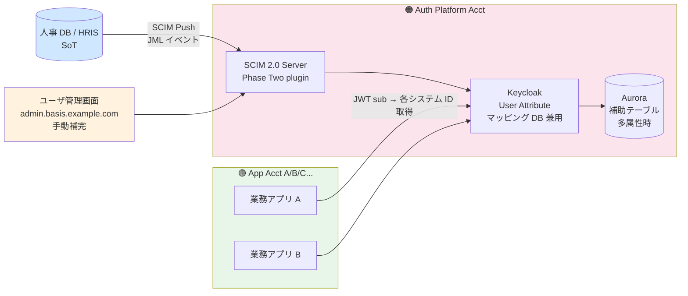

#### §C-7.3.29.2 SoT + マッピング DB 構成

| 要素 | 配置 | 役割 |
|---|---|---|
| **人事 DB（HRIS）= SoT** | 顧客環境 or 弊社環境 | 人物マスター、JML プロセス起点（Joiner / Mover / Leaver）|
| **SCIM 2.0 Server**（Phase Two）| 🟠 Auth Platform Acct | 人事 DB からの SCIM Push 受信 |
| **Keycloak User Attribute（主）**| 🟠 Auth Platform Acct | 統合 ID + 各システム ID マッピング集約 |
| **Aurora 補助テーブル（補助）**| 🟠 Auth Platform Acct | 多属性時の補助（Phase 2 候補）|
| **ユーザ管理画面** | 🟠 Auth Platform Acct（バックエンド）| 人事 DB 非カバー分の手動補完（派遣 / 業務委託 / ゲスト）|

#### §C-7.3.29.3 Keycloak User Attribute スキーマ

```json
{
  "id": "550e8400-e29b-41d4-a716-446655440000",     // Layer A sub
  "username": "EMP-001234",                          // Layer B external_id（社員番号、ログイン ID）
  "email": "yamada@company.com",                     // 表示用、認証 ID ではない
  "firstName": "太郎",
  "lastName": "山田",
  "attributes": {
    "hr_employee_id": "EMP-001234",
    "accounting_id": "K-12345",
    "app_a_user_id": "user_yamada_t@app-a.local",
    "servicenow_user_id": "yamada.t",
    "ad_sam_account": "yamada.t",
    "department": "営業部",
    "hire_date": "2020-04-01",
    "employee_type": "正社員"  // 正社員 / 派遣 / 業務委託 / ゲスト
  }
}
```

→ アプリは JWT の `sub` から、自分が必要なシステム ID を取得可能。

#### §C-7.3.29.4 メアド非保有 / 部署メアド対応

| 要件 | 採用 |
|---|---|
| **ログイン識別子** | **社員番号（`EMP-001234`）**（推奨）or AD `sAMAccountName`、メアド/電話/UUID は不採用 |
| **表示名** | 人事 DB から取得（`山田 太郎`）|
| **メアド**（オプション）| 通知 / パスワードリセット用、認証 ID ではない |
| **External ID**（ADR-018 Layer B）| 社員番号と同一の場合多い |

#### §C-7.3.29.5 5 Phase 移行計画（ADR-054 §D）

| Phase | 内容 | 期間 |
|---|---|---|
| Phase 1 | 現状調査（B-ID-1〜10 ヒアリング + id-inventory.yaml）| 3 ヶ月 |
| Phase 2 | SoT 決定（人事 DB）+ マッピング DB 設計 + 名寄せ | 3 ヶ月 |
| Phase 3 | 人事 DB → SCIM Push 連携 + Pilot 検証 | 2 ヶ月 |
| Phase 4 | 各アプリ統合（1 アプリ 1 ヶ月、並列可）| 半年〜1 年 |
| Phase 5 | 旧 ID 廃止 + 完全統合運用 | 2 ヶ月 |
| **合計** | | **約 1.5 年（10 アプリ想定）** |

---

### §C-7.3.30 CSRF 対策の責任分界（ADR-057、2026-07-06 新規）

> **§C-7.3.30.0 背景・なぜここで決めるか**
>
> 顧客レビューで「**CSRF トークンは認証基盤で発行すべきか、各 API で発行すべきか**」と質問が出た。SPA + Bearer JWT + Keycloak UI + SAML/OAuth フロー + モバイルの **4 系統混在**で誤設計しやすいため、責任層 L1〜L3 を明示分界する必要がある。詳細判断は **[ADR-057](../../../adr/057-csrf-protection-responsibility-boundary.md)** に集約。

#### §C-7.3.30.1 責任層 3 分界（L1 / L2 / L3）

| 責任層 | 対象 | CSRF 対策 | 主体 |
|---|---|---|---|
| **L1 認証基盤内 UI** | Keycloak ログイン画面 / アカウント設定画面 / Admin Console | Keycloak 標準の CSRF トークン + POST 化 | **本基盤（追加実装ゼロ）** |
| **L2 OAuth/OIDC/SAML 認可フロー** | authorize / SAML AuthnRequest | `state` + PKCE + `nonce` / SAML `RelayState` + `InResponseTo` | **本基盤（RP ガイドで顧客に必須化）** |
| **L3 アプリ API（状態変更）** | ユーザ管理画面 API / 各業務アプリ API / モバイル BFF | **Bearer JWT + CORS + Origin/Referer + SameSite Lax で原則 CSRF 免疫**、Cookie セッション時は Double Submit Cookie or Synchronizer Token | **各アプリ / API プラットフォーム（本基盤はパターン提示のみ）** |

#### §C-7.3.30.2 なぜ「認証基盤で全部やらない」か

- **OWASP 原則**：CSRF トークンは **状態変更が起きる箇所で検証**（認証基盤は API の状態変更ポイントを知らない）
- **SPOF 回避**：認証基盤に CSRF トークン発行 API を持たせると、各 API が「認証基盤に問い合わせて検証」→ 認証基盤がボトルネック
- **Bearer JWT 前提**：SPA + `Authorization: Bearer <token>` はブラウザ自動送信されず **CSRF 免疫**（[ADR-030](../../../adr/030-minimal-jwt-claim-design.md) 前提）
- **業界標準**：Auth0 / Okta / Microsoft Entra ID すべて同モデル（「CSRF は API 側の責任」を明記）

#### §C-7.3.30.3 Bearer JWT 免疫の 3 前提条件（ADR-057 §C）

| 条件 | 説明 |
|---|---|
| **C-1: Cookie 保管禁止** | JWT を Cookie に保存しない（localStorage / Memory / sessionStorage 保管）|
| **C-2: 明示付与のみ** | `Authorization: Bearer <token>` を JS が明示的にセット |
| **C-3: CORS 適切設定** | Origin ホワイトリスト明示 + `Access-Control-Allow-Credentials: false` |

**留意**：C-1（localStorage 保管）は XSS リスクとセット対策（CSP + DOMPurify + React 標準 escape）が必須。

#### §C-7.3.30.4 見落としがちな 5 パターン（[ADR-057 §A.2](../../../adr/057-csrf-protection-responsibility-boundary.md#a2-見落としがちな-5-パターン)）

- **A. Login CSRF** → 本基盤（`state` + Keycloak 標準）
- **B. Logout CSRF** → 本基盤（`logout` を POST 化、`id_token_hint` + `POST_LOGOUT_REDIRECT_URI`）
- **C. IdP-initiated SAML CSRF** → 本基盤 + SP 側（SP-initiated 必須化、[ADR-023 §J](../../../adr/023-servicenow-sp-integration.md) 連動）
- **D. OAuth `state` 未検証** → 顧客 RP（本基盤は実装ガイド提供）
- **E. Refresh Token CSRF** → 顧客 RP / API プラットフォーム（SameSite=Strict + Custom Header）

#### §C-7.3.30.5 Phase 1 採用構成（2026-07-06 確定）

| 項目 | 採用 |
|---|---|
| L1 | Keycloak 標準機能（追加実装ゼロ）|
| L2 | OAuth `state` + PKCE + OIDC `nonce` 必須化を **RP 実装ガイド + 顧客 Integration Guide** に明記 |
| L2（SAML）| SP-initiated 推奨、IdP-initiated は原則不許可（要件時のみ短命 nonce Cookie）|
| L3（本基盤直下）| Bearer JWT 前提（ADR-030）+ CORS Origin ホワイトリスト + SameSite=Lax |
| L3（API プラットフォーム）| Double Submit Cookie 参照実装を [doc/api-platform/](../../../api-platform/) で別途標準化 |
| Trust Center 記載 | 顧客監査向け説明は [customer-doc/security.md](../../../common/customer-doc/security.md) に格納（ADR-036 縮小により Trust Center は撤去）|

#### §C-7.3.30.6 4 系統別 対策マトリクス

| 系統 | 認証情報の運び方 | CSRF 成立 | 本基盤責任 | アプリ責任 |
|---|---|:---:|:---:|:---:|
| **Cookie セッション（Keycloak UI）** | Session Cookie 自動送信 | ✅ | ✅ Keycloak 標準 | — |
| **Bearer JWT SPA** | JS 明示付与 | ❌（免疫）| — CORS 設定のみ | ✅ CORS + Origin 検証 |
| **BFF + HttpOnly Cookie** | Session Cookie 自動送信 | ✅ | — | ✅ Double Submit / Synchronizer |
| **モバイル（AppAuth）** | Bearer JWT 明示付与 | ❌（免疫）| — | ✅ PKCE 必須（ADR-050 連動）|

#### §C-7.3.30.7 関連 ADR

- **[ADR-057](../../../adr/057-csrf-protection-responsibility-boundary.md)**（本セクションの詳細判断）
- [ADR-030 最小 JWT クレーム設計](../../../adr/030-minimal-jwt-claim-design.md)（Bearer JWT 前提）
- [ADR-020 HRD ヒントキー戦略](../../../adr/020-hrd-hint-keys-mixed-login.md)（`state` パラメータの使用）
- [ADR-023 ServiceNow SP 連携](../../../adr/023-servicenow-sp-integration.md)（SAML `RelayState` + IdP-initiated 拒否）
- [ADR-024 ログイン画面アーキテクチャ](../../../adr/024-login-screen-architecture-branding.md)（Custom Theme での hidden CSRF field 保持義務）
- [ADR-038 ユーザ管理画面](../../../adr/038-tenant-admin-portal.md)（L3 実装例：Bearer JWT + Lambda Authorizer）
- [ADR-050 モバイルアプリ認証](../../../adr/050-mobile-sdk-native-auth.md)（PKCE + System Browser の CSRF 免疫根拠）

---

## §C-7.4 主要シーケンス図

### §C-7.4.1 フェデ顧客の SSO ログイン（SP-Initiated）

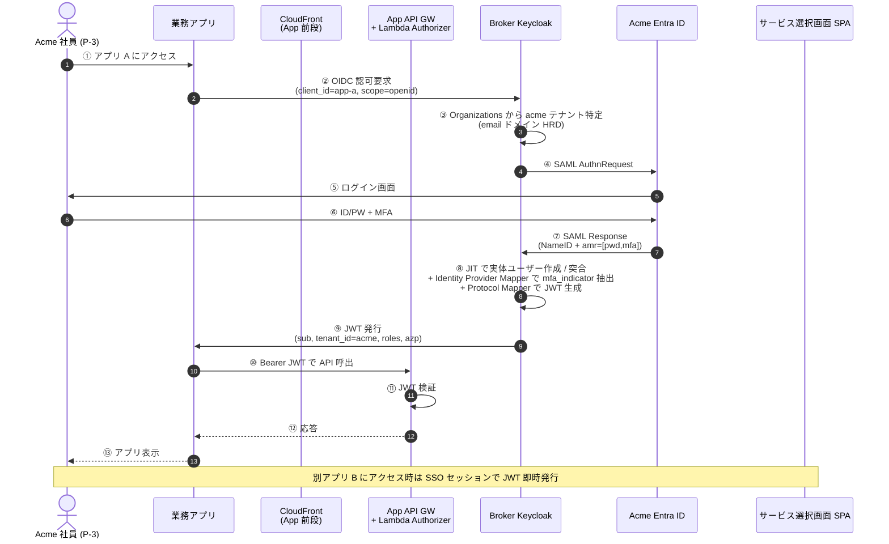

### §C-7.4.2 IdP-KC 移行顧客のログイン（2-tier、ADR-033）

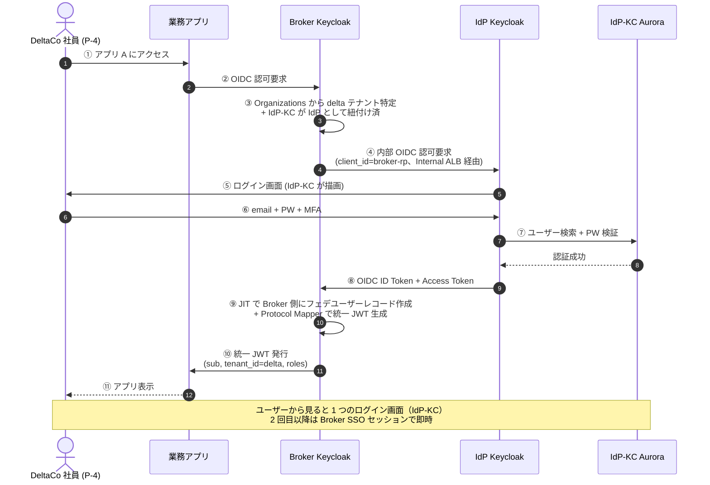

### §C-7.4.3 ServiceNow Inbound（既存 SN ローカルユーザー SAML JIT + 並走 SPI、ADR-023 §J）

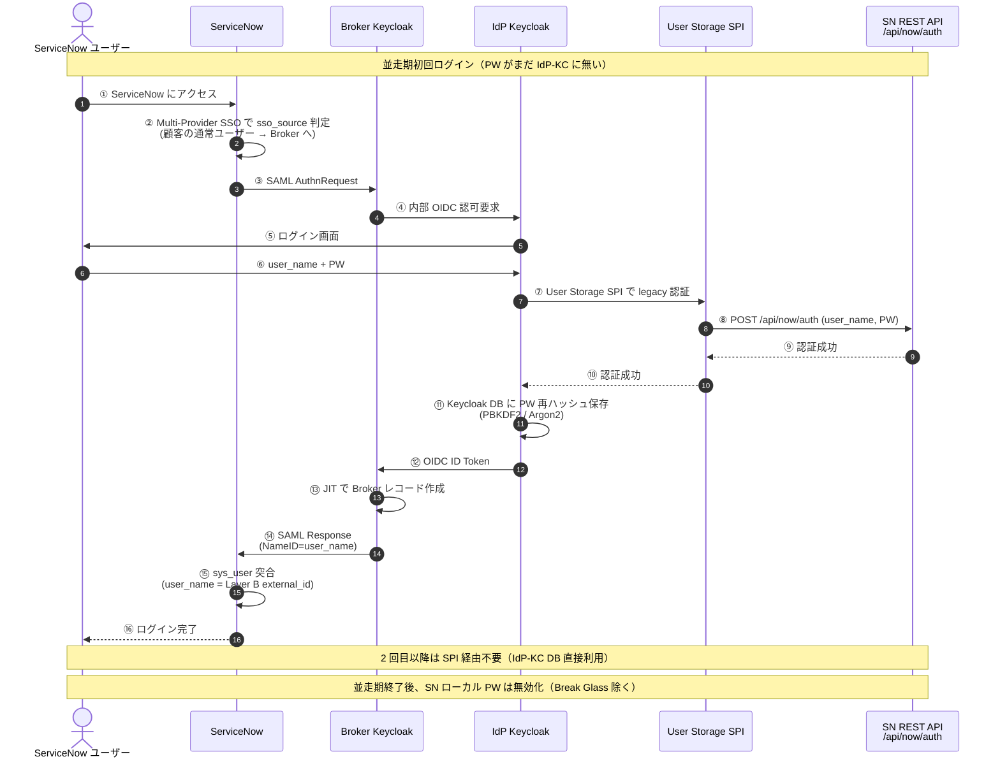

### §C-7.4.4 ユーザ管理画面 でユーザー作成（3 層テナントスコープ、ADR-038）

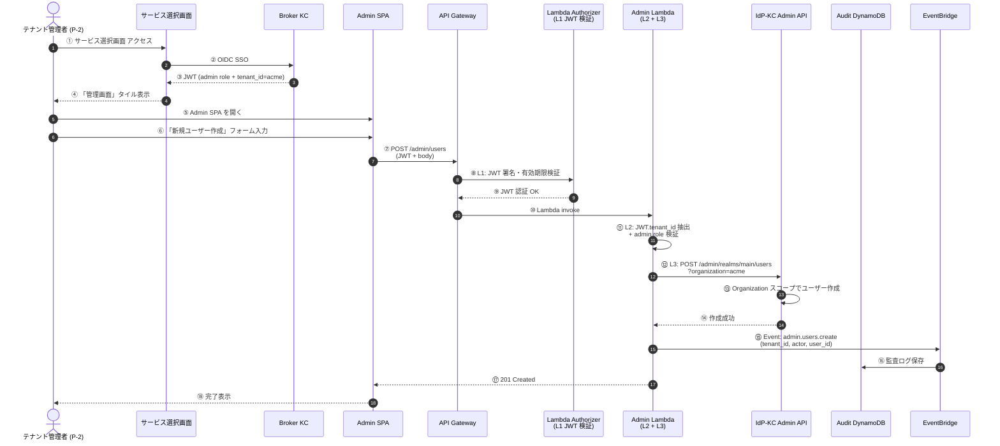

### §C-7.4.5 Adaptive Auth + ITDR 連携（異常検知 → ステップアップ、ADR-034 + 035）

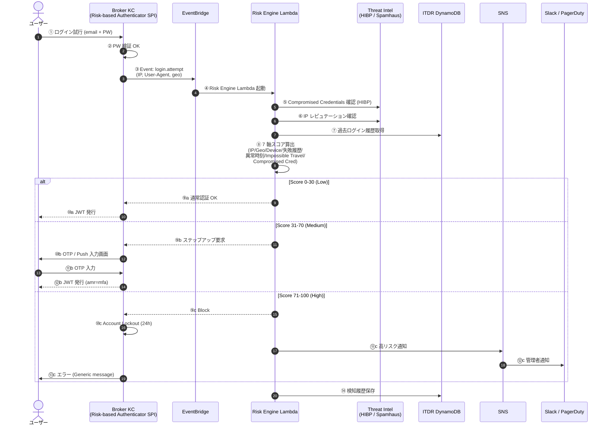

### §C-7.4.6 退職時 Deprovision（顧客 IdP SCIM Push のケース）

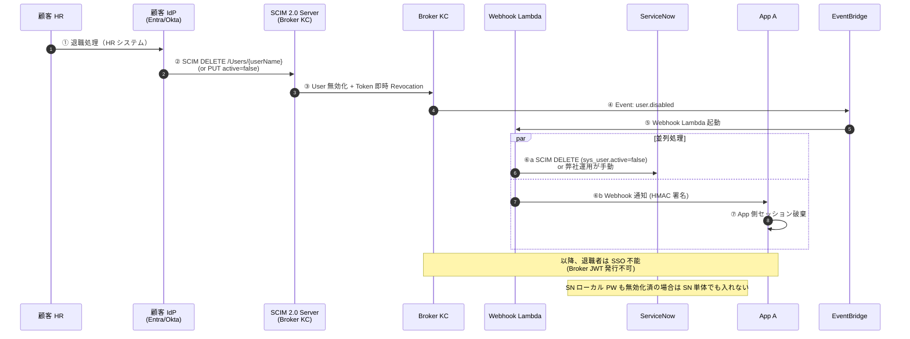

### §C-7.4.7 LDAP 顧客の SSO ログイン（Bind Pull モデル、Import Users = ON、2026-07-08 追加）

> **[ADR-025 §H](../../../adr/025-scim-positioning-and-receive-stance.md) 波及**：顧客 IdP が LDAP(s) 直結の場合の認証フロー。OIDC/SAML の Redirect Push と根本的に異なり、**本基盤 → 顧客 AD への Bind Pull** モデル。パスワードが本基盤経由で AD に届く点に注意。

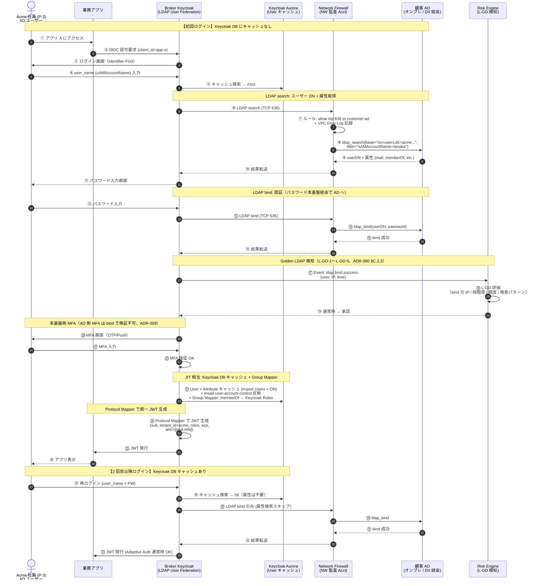

**フローの要点**：

| ステップ | ポイント |
|---|---|
| ⑤ キャッシュ確認 | Import Users = ON なので 2 回目以降は AD への属性検索スキップ、性能◎ |
| ⑥〜⑯ LDAPS TCP 636 | Network Firewall で egress 許可 + VPC Flow Log 監査（[ADR-039 §F.1.A](../../../adr/039-centralized-network-account-edge-layer.md)）|
| ⑫〜⑯ Bind 認証 | **パスワードが本基盤経由で AD に届く**（Zero Knowledge 崩れ、Log scrubbing 必須）|
| ⑰〜⑲ Golden LDAP 検知 | Bind Service Account 乗っ取り検知（[ADR-060 §C.2.2](../../../adr/060-auth-protocol-attack-path-residual-tbd.md)）|
| ⑳〜㉒ 本基盤側 MFA | AD 側 MFA (Duo / Windows Hello) は LDAP bind で検証されないため本基盤側で追加必須（[ADR-009](../../../adr/009-mfa-responsibility-by-idp.md)）|
| ㉓ JIT 相当 | Keycloak DB キャッシュ + msad-user-account-control で AD 側 Disabled 状態反映 |
| ㉗〜㉝ 2 回目以降 | 属性検索スキップで LDAP 呼び出し回数 1 回のみ（性能最適）|

### §C-7.4.8 LDAP 顧客の退職時 Deprovision（Full Sync、SCIM 代替、2026-07-08 追加）

> **[ADR-025 §H.4](../../../adr/025-scim-positioning-and-receive-stance.md)**：LDAP 顧客は **SCIM 不要**、LDAP Sync（バッチ）で退職者 deprovisioning を代替。§C-7.4.6（SCIM Push Deprovision）と対比。

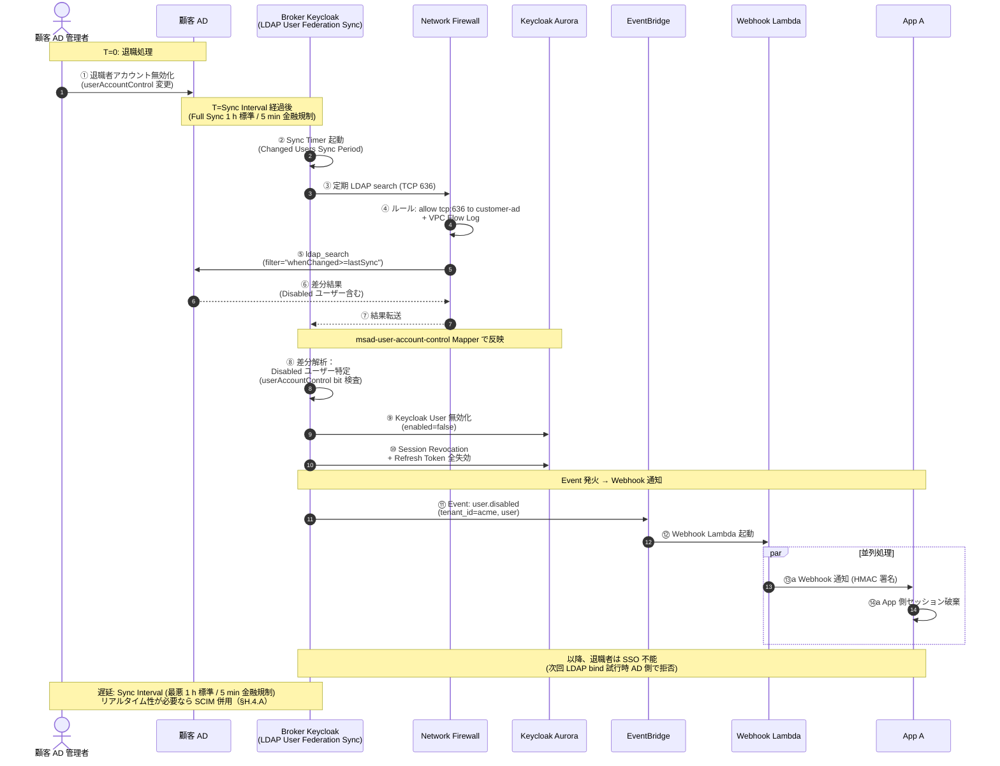

**§C-7.4.6（SCIM Push）との比較**：

| 観点 | SCIM Push（§C-7.4.6）| LDAP Sync（§C-7.4.8）|
|---|---|---|
| 起動タイミング | HR 更新時に IdP → 本基盤 push | Sync Interval バッチ |
| 遅延 | 即時（秒単位）| Sync 頻度次第（1 h 標準 / 5 min 金融規制）|
| プロトコル | HTTPS + SCIM 2.0 REST | LDAPS TCP 636 |
| 方向 | IdP → 本基盤 | 本基盤 → 顧客 AD（pull）|
| SCIM 併用要否 | — | HR 別ソース時のみ（B-LDAP-3、[ADR-025 §H.4.A](../../../adr/025-scim-positioning-and-receive-stance.md)）|
| 顧客 IdP タイプ | Entra ID / Okta 等（SCIM 対応）| オンプレ AD 等（LDAP のみ）|


---

## §C-7.5 データフロー詳細

### §C-7.5.1 認証フロー（全体集約図）

すべての認証フロー（フェデ / IdP-KC / SAML SP / Token Exchange）を集約した俯瞰図:

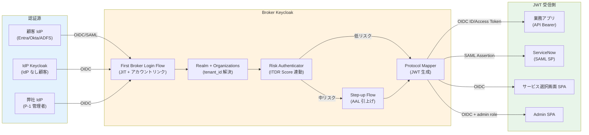

### §C-7.5.2 監査ログフロー（全アカウント → Audit Account）

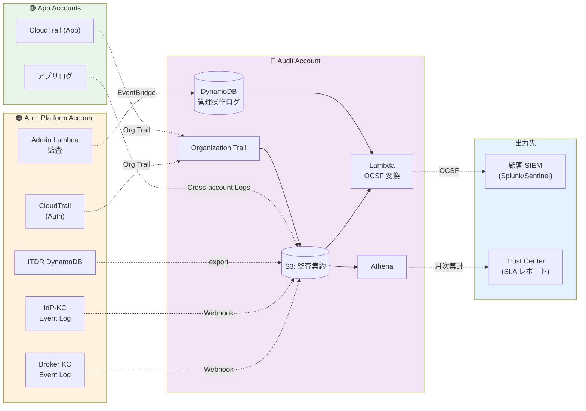

### §C-7.5.3 ITDR イベントフロー（ADR-035）

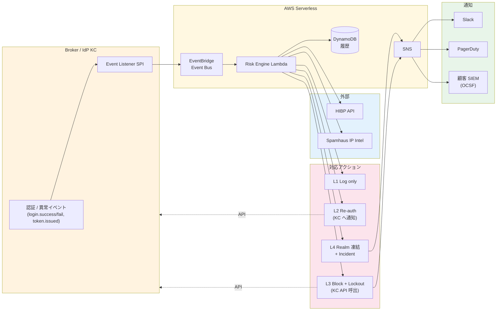

### §C-7.5.4 SCIM プロビジョニングフロー（受信 / 発信）

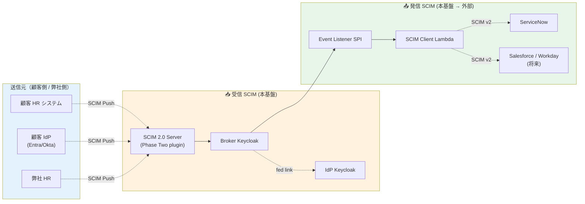


---

## §C-7.6 関連 ADR / 出典マッピング

§C-7.0.3 に上掲。各構成要素には根拠 ADR を明示済。

### §C-7.6.1 PoC 構成との対応（前バージョン）

PoC 実構成（2026-03-30 時点）は [architecture-poc-history.md](../../../common/architecture-poc-history.md) を参照。本番想定構成との主な差分:

| 項目 | PoC | 本番想定 |
|---|---|---|
| プラットフォーム | Cognito + Keycloak（並列検証）| **Keycloak 2-tier（Broker + IdP-KC）**（ADR-033）|
| アカウント | 1 アカウント | **3-4 アカウント分離**（Auth + App × N + Audit + Network）|
| マルチテナント | User Pool 単位 | **Single Realm + Organizations**（ADR-017）|
| 識別子 | email 中心 | **Layer A/B/C 3 階層**（ADR-018）|
| MFA | 静的 | **静的 + Adaptive Auth 二重防御**（ADR-026 + 034）|
| 検知 | なし | **ITDR**（ADR-035）|
| Admin UI | Keycloak Admin Console | **ユーザ管理画面 SPA**（ADR-038）|
| 監査支援 | なし | **Trust Center + Customer Portal**（ADR-036）|

---

## §C-7.7 drawio 転記時の注意

### §C-7.7.1 §C-7.2.2 全体図の drawio 化方針

Mermaid の制約で配置が固定できないため、drawio 転記時に以下を意識:

| 項目 | 推奨 |
|---|---|
| アカウント境界 | **太枠 + アカウント色**で明示（🟠 Auth Platform / 🟢 App / 🔵 Audit / 🟣 Network）|
| アクター配置 | 図の左端に縦並び（顧客側）+ 右端（弊社運用）|
| AWS サービスアイコン | **AWS 公式 simpleicons / AWS Architecture Icons** を使用 |
| データフロー色分け | 認証 = 黒、認可 = 緑、監査 = グレー、暗号化 = 赤 |
| 凡例 | 別ボックスで配置 |
| Tier 1 vs Tier 2 | **垂直に積む**（上が Broker、下が IdP-KC）|
| 移行層（並走期）| **点線 + 灰色背景**で「期間限定」を示す |

### §C-7.7.2 推奨レイアウト（drawio 用）

```
┌─────────────────────────────────────────────────────────┐
│  Actors (top row)                                        │
├─────────────────┬───────────────────┬───────────────────┤
│ Customer Side   │ Auth Platform     │ App Accounts      │
│ (左、青)         │  (中央、橙)        │ (右、緑)           │
│                 │                   │                   │
│ ・顧客 IdP       │  ┌─Edge Layer──┐  │ ┌─CloudFront──┐  │
│ ・ServiceNow    │  └────┬────────┘  │ │ ・Lambda@Edge│  │
│ ・顧客 HR        │       ↓           │ │ ・App API    │  │
│ ・顧客 SIEM      │  ┌─SPA Layer──┐   │ │ ・App Compute│  │
│                 │  └────┬────────┘  │ └──────────────┘  │
│                 │       ↓           │                   │
│                 │  ┌─Tier 1 Broker┐ │                   │
│                 │  │ Keycloak     │ │                   │
│                 │  └────┬─────────┘ │                   │
│                 │       ↓           │                   │
│                 │  ┌─Tier 2 IdP-KC┐ │                   │
│                 │  │ Keycloak     │ │                   │
│                 │  └──────────────┘ │                   │
│                 │  ┌─ITDR/Admin/  │ │                   │
│                 │  │  TC Layer    │ │                   │
│                 │  └──────────────┘ │                   │
├─────────────────┴───────────────────┴───────────────────┤
│  Audit Account (bottom、紫)                              │
└─────────────────────────────────────────────────────────┘
```

### §C-7.7.3 drawio 推奨ツール

- **draw.io（diagrams.net）**: 無料、AWS Architecture Icons 標準搭載
- **AWS Application Composer**: AWS 公式、サーバーレス特化
- **Excalidraw**: 手書き風、軽量

---

## §C-7.8 残作業と更新ポリシー

### §C-7.8.1 残作業

| 項目 | 内容 | タイミング |
|---|---|---|
| ADR Accepted 昇格 | ADR-001〜053 を Proposed → Accepted へ昇格（要件定義フェーズ完了基準）| 要件定義レビュー完了時 |
| drawio 詳細図 | 本資料の Mermaid を元に作成 | 要件定義 → 設計フェーズ移行時 |
| Phase 2/3 ADR 候補 | Q Developer Self-Service Portal / コスト試算詳細集約 / 運用 Runbook 集 | Phase 1 着手後 |
| 各アカウントの IAM 詳細 | Cross-account Role 設計 | 設計フェーズ |
| ネットワーク詳細図 | VPC CIDR / Subnet 設計 | 設計フェーズ |

### §C-7.8.2 更新ポリシー

- **新規 ADR 採択時**: §C-7.0.3 マッピング表に追加、影響する §C-7.3 サブセクションを更新、必要なら §C-7.2.2 全体図に要素追加
- **構成変更時**: 本資料を**唯一のソース**として優先更新、その後 drawio へ転記
- **PoC 関連の更新**: PoC 履歴は [architecture-poc-history.md](../../../common/architecture-poc-history.md) に残し、本資料は本番想定構成のみ

---

## §C-7.9 関連ドキュメント

### §C-7.9.1 要件定義 SSOT（proposal/common/ 同階層）

- [§C-1 アーキテクチャ — Identity Broker パターン論証](01-architecture.md)
- [§C-2 プラットフォーム選定](02-platform.md)
- [§C-3 TBD サマリ](03-tbd-summary.md)
- [§C-4 スケジュール](04-schedule.md)
- [§C-5 PoC ノート](05-poc-note.md)
- [§C-6 ハイブリッド統合の根拠と設計](06-architecture-decision-hybrid.md)

### §C-7.9.2 実装ノート（doc/common/）

- [doc/common/keycloak-network-architecture.md](../../../common/keycloak-network-architecture.md) — Keycloak ネットワーク詳細
- [doc/common/identity-broker-multi-idp.md](../../../common/identity-broker-multi-idp.md) — Identity Broker 実装詳細
- [doc/common/jit-scim-coexistence-keycloak.md](../../../common/jit-scim-coexistence-keycloak.md) — JIT/SCIM 実装詳細
- [doc/common/hrd-implementation-keycloak.md](../../../common/hrd-implementation-keycloak.md) — HRD 実装詳細
- [doc/common/scim-operations.md](../../../common/scim-operations.md) — SCIM 運用ガイド
- [doc/common/branding-strategy-evidence.md](../../../common/branding-strategy-evidence.md) — ブランディング詳細
- [doc/common/platform-architecture-patterns.md](../../../common/platform-architecture-patterns.md) — アーキパターン
- [doc/common/hook-architecture-keycloak.md](../../../common/hook-architecture-keycloak.md) — Hook アーキテクチャ
- [doc/common/broker-data-model.md](../../../common/broker-data-model.md) — Broker データモデル

### §C-7.9.3 ADR

- [doc/adr/00-index.md](../../../adr/00-index.md) — ADR 全 53 本のインデックス

### §C-7.9.4 PoC 履歴

- [architecture-poc-history.md](../../../common/architecture-poc-history.md) — PoC 実構成（2026-03-30 時点、参考）

### §C-7.9.5 drawio 詳細図（2026-06-25 追加）

> 本章の Mermaid 図を **drawio (diagrams.net)** で開ける詳細図に変換、AWS Architecture Icons を用いた本番想定図。

| ファイル | 内容 |
|---|---|
| [README.md](../../../common/drawio/README.md) | drawio 作図仕様書（ノード一覧 / AWS アイコン指定 / 接続関係 / 配置方針）|
| [architecture-v2-overview.drawio](../../../common/drawio/architecture-v2-overview.drawio) | **5 アカウント体系全体俯瞰**（5 Swim Lane + 主要コンポーネント + 凡例）|
| [architecture-v2-network-detail.drawio](../../../common/drawio/architecture-v2-network-detail.drawio) | **ネットワーク監査 Acct 詳細**（アプリごと独立 CloudFront/WAF/Lambda@Edge + Network Firewall + Shield Advanced + Cross-Account 接続 3 種）|

**drawio で開く方法**：
- VS Code 拡張：[Draw.io Integration](https://marketplace.visualstudio.com/items?itemName=hediet.vscode-drawio) インストール後、`.drawio` ファイルダブルクリック
- オンライン版：https://app.diagrams.net/ で File → Open from → Device
- デスクトップ版：[drawio-desktop](https://github.com/jgraph/drawio-desktop/releases)

drawio で開いた後、左ペインの「Shape Categories」→「AWS19」を有効化すると、AWS Architecture Icons が利用可能。詳細追加は [README.md §5 作図の段階的進め方](../../../common/drawio/README.md) 参照。
