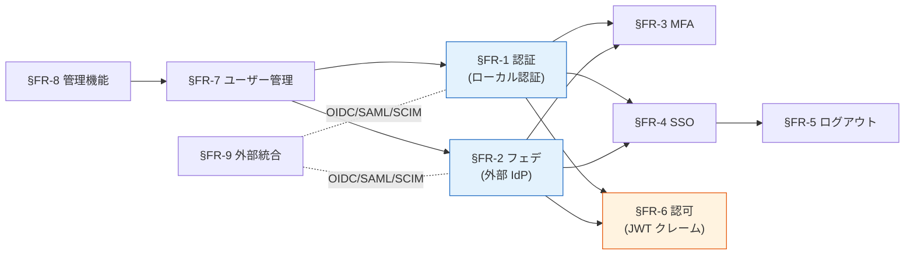

# 機能要件（FR）章一覧

> 上位 SSOT: [../00-index.md](../00-index.md)
> 詳細マトリクス: [../../functional-requirements.md](../../functional-requirements.md)（FR-AUTH/FED/MFA/SSO/AUTHZ/USER/ADMIN/INT）

---

## 章一覧

| 章 | ファイル | 内容 | 一次ソース（FR カタログ） |
|---|---|---|---|
| §FR-1 | [01-auth.md](01-auth.md) | 認証（認証フロー / パスワード） | [FR-AUTH §1](../../functional-requirements.md) |
| §FR-2 | [02-federation.md](02-federation.md) | フェデレーション（IdP 接続 / ユーザー処理 / マルチテナント運用） | [FR-FED §2](../../functional-requirements.md) |
| §FR-3 | [03-mfa.md](03-mfa.md) | MFA（要素 / 適用ポリシー） | [FR-MFA §3](../../functional-requirements.md) |
| §FR-4 | [04-sso.md](04-sso.md) | SSO（同一 IdP / クロス IdP） | [FR-SSO §4.1](../../functional-requirements.md) |
| §FR-5 | [05-logout-session.md](05-logout-session.md) | ログアウト・セッション管理（4 レイヤー / ライフサイクル / Revocation） | [FR-SSO §4.2-4.3](../../functional-requirements.md) |
| §FR-6 | [06-authz.md](06-authz.md) | 認可（JWT クレーム / 4 パターン） | [FR-AUTHZ §5](../../functional-requirements.md) |
| §FR-7 | [07-user.md](07-user.md) | ユーザー管理（CRUD / 属性ロール / セルフサービス / プロビジョニング） | [FR-USER §6](../../functional-requirements.md) |
| §FR-8 | [08-admin.md](08-admin.md) | 管理機能（設定 / 監査 / 委譲・カスタマイズ） | [FR-ADMIN §7](../../functional-requirements.md) |
| §FR-9 | [09-integration.md](09-integration.md) | 外部統合（プロトコル / ログ / API） | [FR-INT §8](../../functional-requirements.md) |

---

## 章間の依存関係

---

## 関連

- [../00-index.md](../00-index.md): proposal 全体 SSOT
- [../nfr/00-index.md](../nfr/00-index.md): 非機能要件章一覧
- [../common/01-architecture.md](../common/01-architecture.md): Identity Broker アーキテクチャ
- [../common/02-platform.md](../common/02-platform.md): プラットフォーム選定
