# §FR-1 認証

> 上位 SSOT: [00-index.md](00-index.md)   
> 詳細: [../../functional-requirements.md §1](../../functional-requirements.md)   
> カバー範囲: FR-AUTH §1.1 認証フロー / §1.2 パスワード・ローカルユーザー管理

---

## §FR-1.0 前提と背景

### 用語整理

| 用語 | 本基盤での意味 |
|---|---|
| **認証**（Authentication） | 「誰であるか」を確認する行為。認可（Authorization、「何ができるか」）とは別物 |
| **Grant Type** | OAuth 2.0 が定める認証フローの種類（Authorization Code / Client Credentials / Device Code 等） |
| **PKCE**（Proof Key for Code Exchange、RFC 7636） | Authorization Code Grant の盗難対策。OAuth 2.1 で必須化 |
| **ローカルユーザー** | フェデレーション IdP を経由せず、本基盤の User DB に直接登録されているユーザー。**ただし誰をローカルユーザーとして扱うかは [§FR-1.2.0.0](#fr-1200-ローカルユーザーとは何か--利用者カテゴリ別の分析) で利用者カテゴリ別に検討する** |
| **利用者カテゴリ** | 本基盤の利用者を性格別に分けた区分（P-1 基盤運用管理者 / P-2 テナント管理者 / P-3 IdP あり顧客従業員 / P-4 IdP なし顧客従業員 / P-5 ゲスト / P-6 B2C）。詳細は [§FR-1.2.0.0](#fr-1200-ローカルユーザーとは何か--利用者カテゴリ別の分析) |
| **Break Glass account** | IdP 障害時の最終防衛線として残す最小限のローカル管理者。大手 IaaS/SaaS の管理層で標準採用 |
| **BFF**（Backend For Frontend） | SPA のトークンをブラウザに置かず、サーバー側で保管するパターン |
| **NIST SP 800-63B Rev 4** | パスワード・MFA に関する米国政府ガイドライン（2024）。業界標準 |

### なぜここ（§FR-1）で決めるか

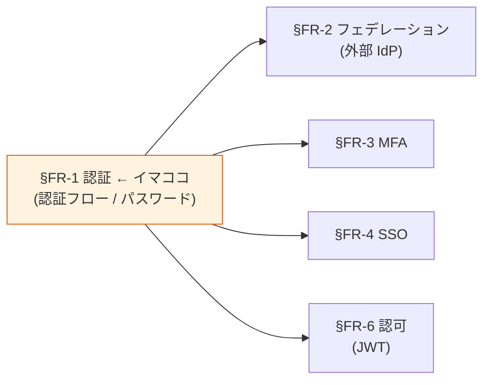

§FR-1 は **「どんな認証フローを受け入れる基盤か」** と **「ローカルユーザーをどう管理するか」** の 2 つを決める章。
- **§FR-1.1 認証フロー**: 外部から本基盤を呼び出すときの OAuth/OIDC 仕様 → §FR-2 以降の前提
- **§FR-1.2 パスワード**: ローカルユーザーのパスワードポリシー → §FR-3 MFA と組み合わせて「絶対安全」を実現

### §FR-1.0.A 本基盤の認証スタンス

> **OAuth 2.1 / OIDC 1.0 業界標準に徹底準拠する。Implicit / ROPC は採用しない。SPA は BFF パターンを推奨、PKCE 直接も併記。パスワードは NIST SP 800-63B Rev 4 準拠で「どんな顧客要件にも対応可」を担保する。**

### 共通認証基盤として「認証」を検討する意義

| 観点 | 個別アプリで実装した場合 | 共通認証基盤で実装した場合 |
|---|---|---|
| OAuth/OIDC 実装 | アプリごとに実装ばらつき | **基盤側で標準準拠、アプリは JWT を信じるだけ** |
| パスワードポリシー | アプリごとに別ルール → UX/セキュリティ品質バラバラ | **基盤側で一元定義、全顧客に共通適用** |
| 業界標準追従（OAuth 2.1 等） | 全アプリ追従が必要 | **基盤側 1 回でアプリ全体に反映** |
| AAL2 / AAL3 適合 | アプリごとに対応 → 弱い箇所が天井 | **基盤側で集約、全システムで同レベル保証** |

→ 認証を共通基盤に集約することで、**個別アプリでは到達不可能な統一レベルのセキュリティ・UX**を全アプリに提供。

### 本章で扱うサブセクション

| サブセクション | 内容 | 関連 FR |
|---|---|---|
| §FR-1.1 認証フロー / Grant Type | OAuth 2.0 / OIDC のフロー範囲、クライアント種別ごとの推奨、SPA の BFF 採否 | FR-AUTH-001〜008 |
| §FR-1.1.A BFF と DPoP の補完関係 | B-108（BFF）と B-109（DPoP）は別軸の対策、両者の脅威モデル比較、業界推奨、併用パターン | FR-AUTH-002 / FR-AUTH-015 想定 |
| §FR-1.2.0 ローカルユーザー認証の主体 | **§FR-1.2.0.0 ローカルユーザーの定義**（利用者カテゴリ P-1〜P-6 / 範囲シナリオ α〜δ）+ 共通基盤集約 / 各アプリ独自 / ハイブリッドの選択 + §FR-1.2.0.B クロスアカウント運用モデル | — |
| §FR-1.2 パスワード・ローカルユーザー管理 | パスワードポリシー、リセット、ロックアウト等 | FR-AUTH-009〜014 |

---

## §FR-1.1 認証フロー / Grant Type（→ FR-AUTH §1.1）

> **このサブセクションで定めること**: 本基盤がサポートする OAuth 2.0 / OIDC の認証フロー（Grant Type）の範囲、クライアント種別ごとに採用するフローのマッピング。   
> **主な判断軸**: 御社のクライアント種別（SPA / SSR / Mobile / M2M）、SPA で BFF 採用可否、Token Exchange / Device Code / mTLS のオプション要否   
> **§FR-1 全体との関係**: §FR-1 のうち「**認証プロトコル層**」を確定する。パスワード管理ポリシー（§FR-1.2）とは独立に判定可能

### ベースライン

**クライアント種別ごとの推奨フロー**:

| クライアント種別 | 推奨フロー | 標準 | 補足 |
|---|---|---|---|
| ローカルユーザー直接 | ID/PW（Hosted UI） | — | Broker のログイン画面で受付 |
| **SPA（ブラウザ）** | **2 案併記**：(a) BFF パターン / (b) Authorization Code + PKCE 直接 | RFC 6749 + RFC 7636 | BFF が業界推奨。トークンをブラウザに置かない |
| SSR Web | Authorization Code + **PKCE** + client_secret | RFC 6749 + RFC 7636 | OAuth 2.1 で confidential client でも PKCE 必須 |
| ネイティブモバイル | Authorization Code + PKCE（AppAuth 等） | RFC 6749 + RFC 7636 + RFC 8252 | OS 標準ブラウザ経由 |
| M2M（バッチ / サービス間） | Client Credentials | RFC 6749 §FR-3.4 | Resource Server + scope 設計が必要 |

**採用しないフロー**:
- **ROPC（Password Grant）**: OAuth 2.1 で正式削除。本基盤では Won't
- **Implicit Flow**: OAuth 2.1 で正式削除。本基盤では非対応

**オプション（要件次第で採用判定）**:
- **Device Code Flow（RFC 8628）**: CLI / IoT / Smart TV / **AI Agent** など入力制約デバイス向け
- **Token Exchange（RFC 8693）**: マイクロサービス間のユーザー文脈伝播（On-Behalf-Of）、API Gateway でのトークン変換
- **mTLS Client Authentication（RFC 8705）**: FAPI 準拠、金融、高セキュリティ M2M。PKI / TLS 終端制御が必要
- **DPoP（RFC 9449、Demonstrating Proof-of-Possession）**: Access Token の盗難対策（sender-constrained tokens）。**mTLS の代替として 2026 年から enterprise 採用が急増**（Auth0 2026-03 GA、Spring Security 6.5、Keycloak 26.4 対応）。FAPI 2.0 で mTLS と同等の選択肢。**TLS 終端制御不要、PKI 不要**で SPA / Mobile からも利用可能 → mTLS よりも実装ハードルが低い

**業界標準との整合**:

| 動向 | 状態 | 本ベースラインへの反映 |
|---|---|---|
| OAuth 2.1（draft-ietf-oauth-v2-1-15） | IETF Internet Draft。Spring Security 等は既に準拠実装 | 全 confidential client でも PKCE 必須化 |
| Implicit Flow / ROPC 削除 | OAuth 2.1 で正式削除 | Won't として明示 |
| SPA = BFF パターン推奨 | Curity / Duende / Auth0 / WorkOS 等が推奨 | SPA で 2 案併記 |
| Device Code = AI Agent 認証 | 入力制約デバイスの典型 + AI Agent でも採用増加 | オプションに位置付け |

### TBD / 要確認

**A. クライアント種別の特定（影響：基盤の Must 機能範囲）**

| 確認項目 | 回答形式 |
|---|---|
| 御社の SPA システムは？（React / Vue / Angular 等） | システム名と件数 |
| SSR Web は？（Next.js / Spring MVC / Django / Rails 等） | 同上 |
| ネイティブモバイル（iOS / Android）は？ | 有無 + 件数 |
| バッチ・サービス間 API 呼び出しは？ | 有無 + 件数 |

**B. SPA の認証方式選定（影響：アーキテクチャ複雑性 vs セキュリティ強度）**

##### B-1. BFF パターン vs 従来の PKCE 直接 比較表

| 観点 | 従来（PKCE 直接） | BFF パターン |
|---|---|---|
| **Access / Refresh Token 保管** | ブラウザ（メモリ / Storage）| BFF サーバー側（DB 暗号化）|
| **ブラウザが持つもの** | Token そのもの | セッション ID（HttpOnly Cookie）|
| **XSS による Token 漏洩** | ⚠ リスクあり（localStorage / メモリ盗難）| ✅ 防御（Cookie は JS 不可触）|
| **Refresh Token 盗難リスク** | ⚠ 長期間なりすまし可能 | ✅ Refresh Token はサーバー側のみ |
| **CSRF 攻撃** | ✅ Bearer ヘッダー方式で耐性 | ⚠ Cookie 認証で要対策（SameSite=Strict + CSRF トークン）|
| **NIST AAL2 / AAL3 適合** | △ 条件付き | ✅ 整合 |
| **業界推奨度（2026 IETF）** | △ レガシー扱い、低リスクのみ | ✅ **gold standard** |
| **アーキテクチャ複雑度** | ✅ 単純（SPA + 認可サーバー）| ⚠ BFF サーバー + セッションストア追加 |
| **必要なインフラ** | SPA ホスティングのみ | + Lambda or ECS + DynamoDB + KMS |
| **月額コスト目安（10K MAU）** | $0〜数ドル | $20〜50（小規模 Lambda 構成）|
| **実装言語の自由度** | SPA フレームワーク次第 | サーバー側で自由（Node/Python/Java 等）|
| **既存 SPA からの移行コスト** | — | 中（認証部分のみ書き換え、段階移行可）|
| **OAuth 2.1 整合（Confidential Client + PKCE）** | △ Public Client | ✅ Confidential Client |
| **Cookie ドメイン制約** | なし（Bearer ヘッダー）| 同一サイト前提（推奨）|
| **デバッグ性** | ブラウザツールで Token 直接確認可 | サーバー側ログ参照必要 |

##### B-2. 採用判断のガイドライン

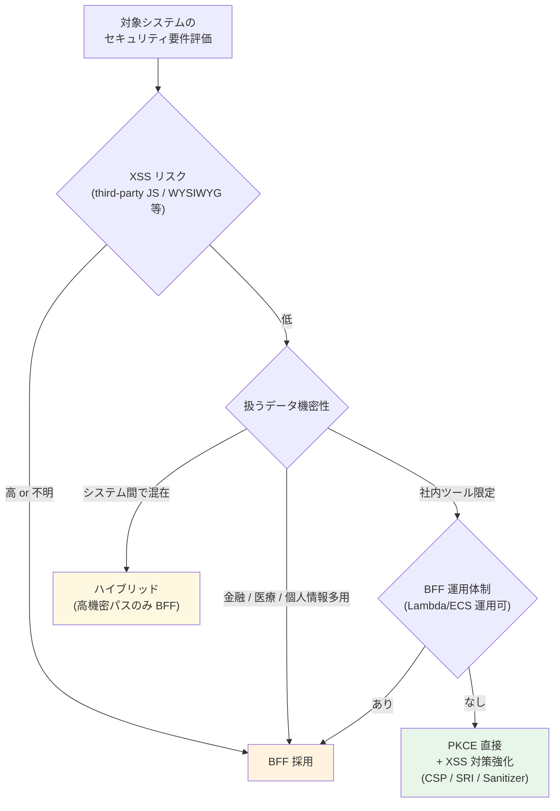

##### B-3. 本基盤としての方針案

| 顧客 / システム種別 | 推奨方式 |
|---|---|
| 金融 / 医療 / 行政 / 個人情報多用 SaaS | **BFF 採用必須** |
| B2B SaaS（一般業務） | **BFF 推奨**（基本方針「絶対安全」と整合）|
| 社内ツール / 機密性低 | PKCE 直接でも可（XSS 対策強化前提）|
| AI Agent / CLI / Mobile | PKCE 直接（Device Code 含む、BFF 不要）|

##### B-4. 段階移行・ハイブリッド運用について

既存 SPA がある場合は **PKCE → BFF への段階移行が可能**。
また、**システムごとに方式を選択（ハイブリッド運用）**も技術的に可能：

- 共通認証基盤（Cognito User Pool / Keycloak Realm）に **SPA Client（Public）と BFF Client（Confidential）を両方登録**しておけば、システムごとにどちらを使うか自由選択
- 例：「経費精算は PKCE 直接、人事システムは BFF」のような混在運用
- SSO は両方で機能（同一 IdP 内 SSO セッションを共有）

実装詳細・制約・運用上の注意点は内部技術メモ [`bff-implementation-notes.md`](../../../common/bff-implementation-notes.md) 参照。

---

→ 金融・医療・行政系なら BFF、社内ツール系なら PKCE 直接で十分というのが現場感覚。**システム種別ごとに方式を分けるハイブリッド運用も可能**。

##### B 補足: BFF パターンの実装可否（参考）

BFF パターンを採用する場合の補足情報:

- **両プラットフォームで実装可能**: Cognito / Keycloak のどちらも**認可サーバー側に Confidential Client を 1 つ追加するだけ**で対応可能（PoC からの差分は小）
- **本基盤での標準実装**: AWS Lambda + API Gateway + DynamoDB（既存 PoC の Lambda Authorizer 構成と統一）。ECS Fargate / Lambda Function URL も選択肢
- **既存リソースへの影響なし**: 既存の Lambda Authorizer / Backend Lambda は変更不要、BFF は「フロントとバックエンド API の間に挟む」追加レイヤー
- **段階移行**: 既存 PKCE 直接 SPA と BFF 構成を並列稼働 → 段階的に移行可能

##### B 補足-2: BFF の AWS アカウント配置と Lambda Authorizer との違い

> **よくある誤解**: 「**BFF は Lambda Authorizer のようなもの**」と捉えがちだが、**両者は別レイヤー**で組み合わせて使うのが標準。

**配置先 AWS アカウント**:

| コンポーネント | 配置先 AWS アカウント | 理由 |
|---|---|---|
| 認可サーバー（Cognito / Keycloak）| **共通基盤アカウント** | 全アプリ共通の認証 SaaS 的存在 |
| JWKS Endpoint | **共通基盤アカウント** | 公開鍵配布、複数アプリから参照 |
| **BFF**（Lambda / ECS）| **アプリ AWS アカウント** | アプリの SPA 専用セッション管理、アプリ実装の一部 |
| **セッションストア**（DynamoDB / Redis）| **アプリ AWS アカウント** | session_id ↔ token のマッピング保管（KMS 暗号化）|
| Lambda Authorizer | **アプリ AWS アカウント** | API Gateway の JWT 検証ゲート |
| Backend Lambda / ECS | **アプリ AWS アカウント** | 業務ロジック |

→ **BFF とセッションストアと Lambda Authorizer はすべてアプリ側 AWS アカウント**に配置。共通基盤アカウントは認可サーバー + JWKS のみ。

**BFF と Lambda Authorizer の責務の違い**:

| 観点 | BFF | Lambda Authorizer |
|---|---|---|
| **主機能** | OAuth フロー実行 + トークン保管 + **セッション Cookie 発行** | API Gateway 受付時の **JWT 署名検証 + 認可判定** |
| **入力** | ブラウザからの HTTP リクエスト + **セッション Cookie** | API Gateway からの **JWT (Authorization ヘッダー)** |
| **出力** | バックエンド API へのプロキシ + ブラウザへの応答 | API Gateway への **allow / deny ポリシー** |
| **状態保持** | あり（**セッションストア / トークンキャッシュ**）| なし（リクエストごとに JWT 検証）|
| **使用プロトコル** | OAuth 2.0 Client (Confidential) | JWT 検証（RFC 7519）|
| **役割の例え** | **ブラウザ用フロントドア** | **API のセキュリティガード** |

→ **BFF は Lambda Authorizer の代替ではなく追加レイヤー**。両方をアプリ側に置く構成が標準。

**全体フロー（BFF + Lambda Authorizer の組み合わせ、クロスアカウント表現）**:

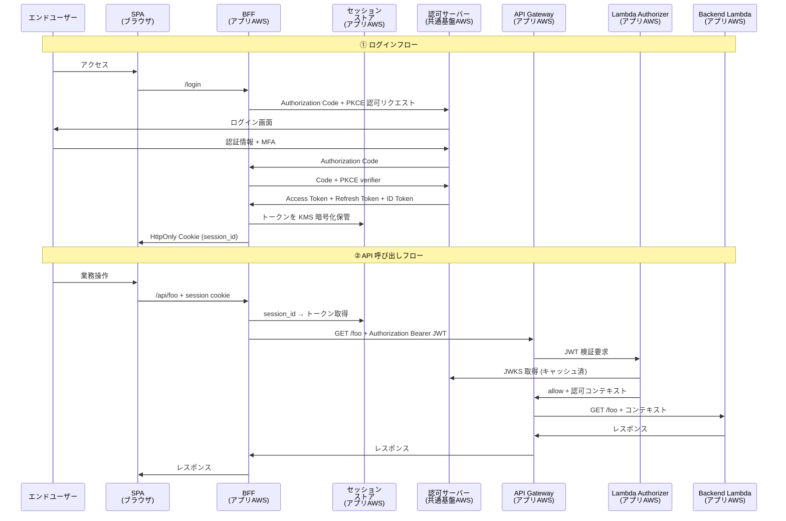

→ **二重防御**: ブラウザは JWT に一切触れず（BFF が隠蔽）、API Gateway は JWT で守られる（Lambda Authorizer が検証）。**XSS 経由のトークン盗難リスクをほぼゼロ化**できる。

→ 「採用するか / しないか」の方向性合意のみ本資料で扱い、**実装詳細・構成図・移行プランは内部技術メモ [`bff-implementation-notes.md`](../../../common/bff-implementation-notes.md) に分離**。

**C. オプションフローの要否（影響：プラットフォーム選定に直結）**

| 要件 ID | フロー | 要否確認の問い | 影響 |
|---|---|---|---|
| FR-AUTH-005 | Token Exchange | マイクロサービス間でユーザー文脈を伝播させたい呼び出しがあるか（詳細な業務質問・判定フローは **[§FR-6.3 マイクロサービス間トークンリレー](06-authz.md#fr-63-マイクロサービス間トークンリレー--ユーザー文脈伝播--fr-authz--fr-auth-005)** 参照）| **Yes → Keycloak 必須**（Cognito 非対応）|
| FR-AUTH-006 | Device Code | CLI / IoT / Smart TV / AI Agent クライアントを認証する予定があるか | **Yes → Keycloak 必須** |
| FR-AUTH-007 | mTLS | FAPI 準拠 / 金融取引 / 高セキュリティ M2M の要件があるか | **Yes → Keycloak 必須** |
| FR-AUTH-015（新規想定）| **DPoP（RFC 9449）** | sender-constrained tokens / FAPI 2.0 準拠 / 高セキュリティ API があるか（mTLS の代替として）| **Yes → Keycloak 必須**（Keycloak 26.4 ネイティブ対応、Cognito は標準非対応）|

これらが 1 つでも Yes なら、Cognito 単独では実現できないため、**Keycloak（または併用）が必須**になります。

### §FR-1.1.A BFF と DPoP の補完関係

> **このサブ・サブセクションで定めること**: BFF パターン（[B-108](../../hearing-checklist.md) で問う SPA 認証方式）と DPoP（[B-109](../../hearing-checklist.md) で問う Sender-Constrained Token）は **別軸の対策で補完関係**にあることを明示し、両者の対象範囲・推奨パターン・併用ケースを整理。   
> **主な判断軸**: ブラウザ層 XSS 対策（BFF が強い）vs トークン使用全体の防御（DPoP が強い）、M2M / モバイル統合の要否、FAPI 2.0 準拠要否   
> **§FR-1.1 内の位置付け**: B-108 と B-109 を**別軸として両方確認**するための背景整理

#### よくある誤解：「BFF があれば DPoP は不要」

```
❌ 誤: BFF を採用すれば SPA のトークン盗難リスクは解消するので、DPoP は不要
✅ 正: BFF と DPoP は守る対象が異なる。重なる部分もあるが、それぞれ独自の領域を持つ
```

#### 脅威モデル比較

| 攻撃 | BFF | DPoP |
|---|:---:|:---:|
| **XSS で LocalStorage / メモリからトークン盗難** | ✅ 完全に防ぐ（ブラウザにトークン無し） | ⚠ 鍵保管次第（後述）|
| **盗まれたトークンを別端末で使う**（Sender-Constrained）| △ 既に盗めないので問題化しない | ✅ **強力に防御** |
| **異なる API エンドポイントへのリプレイ** | × 該当しない | ✅ `htm` / `htu` で防御 |
| **M2M（サーバー間）のトークン盗難** | × **BFF はエンドユーザー向け、M2M は対象外** | ✅ M2M でも統一適用可 |
| **モバイル端末紛失時の流用** | × 該当しない | ✅ Keystore / Secure Enclave で防御 |
| **DPoP の秘密鍵自体が盗まれる**（XSS 経由）| × 該当しない | ⚠ WebCrypto non-extractable でも JS から `signMessage` 呼び出し可能 |
| **BFF サーバー自体の侵害** | ⚠ 防御不可（インフラ層）| × 該当しない |
| **IdP 側 SSO セッション乗っ取り**（外部 IdP Cookie 漏洩）| ❌ 防げない | ❌ 防げない |

→ **BFF はブラウザ層の攻撃に強い、DPoP はトークン使用全体に強い**。

#### DPoP の「隠れた弱点」：ブラウザでの鍵保管問題

DPoP の秘密鍵をブラウザでどう保管するかで XSS 耐性が大きく変わる:

| 保管方法 | XSS 耐性 | 備考 |
|---|:---:|---|
| `localStorage` / `sessionStorage` | ❌ 弱 | XSS で簡単に抜き取り可能 |
| `IndexedDB` | ❌ 弱 | 同上 |
| **WebCrypto API の non-extractable key**（推奨）| ⚠ **限定的に強い** | 鍵は取り出せないが、**XSS 攻撃者は JS から `signMessage()` を呼んで proof 作成可能** |
| Service Worker 内に隔離 | △ 中 | ブラウザ実装依存 |

→ **DPoP は「別端末への持ち出し」は完全防御するが、「当該ブラウザ上での悪用」は限定的**（[InfoQ: The DPoP Storage Paradox](https://www.infoq.com/articles/dpop-key-storage-unsolved-problem/)）。BFF の XSS 耐性は "根本的"、DPoP の XSS 耐性は "Sender-Constrained 領域に限定的"。

#### 業界の見解（2026 時点）

| 推奨元 | 立場 |
|---|---|
| **IETF OAuth Security BCP** | 両方推奨。**BFF を優先**、技術的に使えない場合 DPoP |
| **IETF / Curity / Duende**（2025〜）| **BFF を gold standard** |
| Auth0 / Okta / Microsoft | DPoP は「BFF の補完 / BFF 不可時の代替」 |
| **FAPI 2.0**（金融グレード API）| **DPoP 必須**（または mTLS） |

#### 推奨される使い分け

| シナリオ | 推奨 | 理由 |
|---|:---:|---|
| **SPA 単独の B2B SaaS**（業務系一般）| **BFF** | 業界 gold standard、XSS 完全防御 |
| **モバイル + SPA の混在** | **DPoP** | BFF は SPA 用、モバイル統一には DPoP |
| **M2M（サーバー間連携）が中心** | **DPoP** または **mTLS** | BFF は M2M に該当しない |
| **FAPI 2.0 準拠が必須**（金融）| **DPoP**（または mTLS）| 仕様で必須 |
| **規制業種・最高セキュリティ** | **BFF + DPoP 併用** | 多層防御（BFF が SPA 隠蔽、BFF → API で DPoP）|
| 一般業務系 + Sender-Constrained 不要 | **Bearer + 短 TTL** | 業界一般、コスト最適 |

#### B-108 と B-109 の使い分け

ヒアリング項目として:

| ID | 何を聞いているか | 関係 |
|---|---|---|
| **B-108 SPA 認証方式（BFF vs PKCE 直接）** | XSS 耐性。SPA に絞った話 | 主にブラウザ層 |
| **B-109 DPoP 採用要否** | Sender-Constrained Token 全般（M2M / モバイル含む）| トークン使用全体 |

→ **両者は別軸で、両方確認すべき**。「BFF を採用するから DPoP は不要」とは限らない（M2M がある場合 / FAPI 2.0 必要な場合）。

#### 実装負荷の比較

| 観点 | BFF | DPoP |
|---|---|---|
| SPA / モバイル クライアント実装 | **軽**（Cookie + 通常 HTTP）| **中〜重**（鍵生成 + Proof 署名 + jti 管理）|
| 認可サーバー設定 | 通常 OIDC（**軽**）| Keycloak: 軽（Admin Console 1 スイッチ）/ **Cognito: 不可** |
| リソースサーバー検証 | JWT 検証のみ（**軽**）| JWT + Proof 検証 + jti キャッシュ（**中**）|
| サーバーインフラ追加 | **BFF サーバー必須**（重） | **不要**（軽）|
| ライブラリ成熟度 | **◎ 非常に成熟**（`oauth2-proxy` / `next-auth` 等）| △ 発展中（[oauth4webapi](https://github.com/panva/oauth4webapi) 等）|
| 全体重心 | **サーバー側に重心** | **クライアント側に重心** |

→ **総コストは同等程度**、ただし重心が違う。BFF はサーバーインフラ追加、DPoP はクライアント実装の複雑化。

#### 本基盤での推奨方針

| 段階 | 推奨 |
|---|---|
| **デフォルト** | SPA → BFF（[B-108](../../hearing-checklist.md)）、M2M / モバイル無しなら DPoP 不要 |
| **モバイル / M2M / FAPI 2.0 が必要になった場合** | DPoP を追加検討（Keycloak 必須化） |
| **金融・規制業種** | BFF + DPoP 併用（多層防御）|

詳細実装パターンは [bff-implementation-notes.md §11.3](../../../common/bff-implementation-notes.md) 参照。

### 参考資料（業界動向の裏どり）

- [OAuth 2.1 (oauth.net)](https://oauth.net/2.1/)
- [OAuth 2.1 vs 2.0 - Stytch](https://stytch.com/blog/oauth-2-1-vs-2-0/)
- [OAuth 2.1: What's new - WorkOS](https://workos.com/blog/oauth-2-1-whats-new)
- [SPA Best Practices - Curity](https://curity.io/resources/learn/spa-best-practices/)
- [Web App Security Best Practices 2025 - Duende](https://duendesoftware.com/blog/20250805-best-practices-of-web-application-security-in-2025)
- [Device Authorization Grant - WorkOS](https://workos.com/blog/oauth-device-authorization-grant)
- [Token Exchange Why and How - Curity](https://curity.medium.com/token-exchange-in-oauth-why-and-how-to-implement-it-a7407367cb55)

---

## §FR-1.2.0 ローカルユーザー認証の主体（→ §1 アーキテクチャと連動）

> **このサブセクションで定めること**: 「ローカルユーザー」が**そもそも何を指すか**を定義したうえで、**どのカテゴリのユーザーをローカルとして基盤側に持つか**、および **その認証を共通基盤側で行うか各アプリ側で行うか**という認証主体の選択。   
> **主な判断軸**: ローカルユーザー範囲の定義、基本方針整合（特に「絶対安全」「効率よく」「運用負荷低」）、既存システムの認証実装の有無、移行戦略   
> **§FR-1 全体との関係**: §FR-1.2.0 が**前提のスタンス**、§FR-1.2 以降が**具体ポリシー**。**ローカルユーザーの定義と範囲が決まらないと §FR-1.2 のポリシー議論は意味を持たない**

### §FR-1.2.0.0 ローカルユーザーとは何か — 利用者カテゴリ別の分析

> **論点**: 「ローカルユーザー」を素朴に「IdP を経由せずパスワードで認証するユーザー全部」と定義すると、**P-1 基盤運用管理者**から **P-6 B2C エンドユーザー**まで性格の異なる利用者群を 1 箱に詰め込むことになる。範囲を絞れば運用負荷もリスクも変わるため、まず **利用者カテゴリ** を整理してから「どこまでをローカルにするか」を決めるべき。

#### 利用者カテゴリ全体マップ

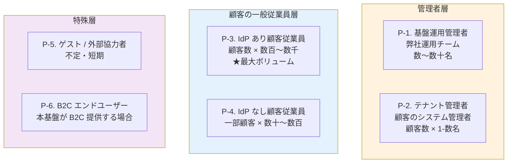

#### カテゴリ別の特性

| カテゴリ | 想定数 | 認証 SLA | 業務影響 | 自然な認証方式 |
|---|---|---|---|---|
| **P-1. 基盤運用管理者** | 弊社運用チーム数〜数十名 | 24/7 | 全顧客影響 | 弊社内 IdP（Entra ID 等）連携 / Break Glass 用に最小ローカル |
| **P-2. テナント管理者** | 顧客数 × 1-数名 | 営業時間 | 自テナント内のみ | 顧客 IdP（推奨）/ ローカル（妥協） |
| **P-3. IdP あり顧客従業員** | 顧客数 × 数百〜数千 | 営業時間 | 個人作業 | **顧客 IdP（フェデ）** |
| **P-4. IdP なし顧客従業員** | 一部顧客 × 数十〜数百 | 営業時間 | 個人作業 | ローカル / 顧客に IdP を持ってもらう |
| **P-5. ゲスト / 外部協力者** | 不定・短期 | 営業時間 | 限定 | 招待 URL + ローカル / ソーシャル（Google 等） |
| **P-6. B2C エンドユーザー** | 不定 | 24/7 | 個人 | ローカル + ソーシャル + Passkey |

#### 想定するユーザー全体表（4 カテゴリ統合版）

**P-1〜P-6 は「本基盤の認証を経由する人間ユーザー」のみをカバー**します。実際に本基盤を運用する上では、**インフラ運用者（AWS IAM 経由）/ M2M（システム間連携）/ 脅威モデル** も明示的に分類しておく必要があります。

##### Category A: 本基盤の認証を経由する人間ユーザー（上記 P-1〜P-6 と同じ）

| ID | ユーザー種類 | 概要 | 想定する認証方式 |
|:---:|---|---|---|
| **P-1** | 基盤運用管理者 | 弊社運用チーム、全顧客影響 | 弊社内 IdP + Break Glass ローカル |
| **P-2** | テナント管理者 | 顧客のシステム管理者 | 顧客 IdP（推奨）/ ローカル |
| **P-3** | IdP あり顧客従業員 | 顧客数 × 数百〜数千、**最大ボリューム** | 顧客 IdP（フェデ） |
| **P-4** | IdP なし顧客従業員 | 一部顧客のみ | ローカル |
| **P-5** | ゲスト / 外部協力者 | 不定・短期 | 招待 URL + ローカル / ソーシャル |
| **P-6** | B2C エンドユーザー | 本基盤が B2C 提供する場合 | ローカル + ソーシャル + Passkey |

##### Category B: 本基盤の認証を経由しないインフラ運用者（**従来は明示されていなかった層**）

| ID | ユーザー種類 | 概要 | 想定する認証方式 |
|:---:|---|---|---|
| **I-1** | AWS インフラ運用者 | Cognito / Lambda / VPC / API Gateway / DynamoDB 等を AWS Console / CLI / Terraform で直接操作 | **AWS IAM**（IAM Identity Center / IAM ユーザー / IAM Role）、**MFA 必須**、本基盤の認証とは別系統 |
| **I-2** | Keycloak / RHBK 運用者 | EKS / ECS / OpenShift 上の Keycloak を `kubectl` / `oc` / Helm で運用、SSH / Bastion 経由のコンテナアクセス | AWS IAM + kubectl auth / OpenShift OIDC、Bastion 経由の SSH キー |
| **I-3** | 監視・SRE 担当 | CloudWatch / Datadog / Grafana / Splunk でアラート受信・ダッシュボード閲覧 | AWS IAM / Datadog SSO / Grafana OAuth、**Read-Only 推奨** |
| **I-4** | セキュリティ監査者 | CloudTrail / Cognito 監査ログ / Keycloak Event Listener 出力を SIEM 経由で閲覧 | AWS IAM / SIEM 認証、**Read-Only 強制** |
| **I-5** | ベンダー / SI サポート担当 | Red Hat Support / AWS Support / 外部 SI ベンダー（緊急対応・設計支援等の一時的アクセス） | サポートチケット経由 / **IAM Role の STS 一時付与**、期間限定（24-72h）|

##### Category C: M2M（システム間連携、人間ではない）

| ID | ユーザー種類 | 概要 | 想定する認証方式 |
|:---:|---|---|---|
| **M-1** | アプリ間サービス（マイクロサービス OBO）| サービス A → サービス B 内部呼び出しでエンドユーザー文脈を伝播 | **本基盤発行 Token Exchange（RFC 8693）**（Keycloak 必須）+ Client Credentials |
| **M-2** | CI/CD パイプライン | Terraform Apply / GitHub Actions / CodePipeline で IaC デプロイ | **AWS IAM Role**（GitHub OIDC Federation / OIDC Provider 経由）、**IAM ユーザーは原則使わない** |
| **M-3** | SCIM プロビジョニング元 | 顧客 IdP（Entra / Okta 等）が本基盤の SCIM エンドポイントを叩いて自動同期 | **本基盤発行 SCIM Bearer Token**、TLS 経由 |
| **M-4** | Webhook 受信側 | 本基盤 → 外部システム（顧客アプリ / SIEM 等）への `user.created` 等通知 | **HMAC 署名**（本基盤側で生成、受信側で検証）、Bearer Token も併用可 |
| **M-5** | IoT / CLI デバイス | 入力制約デバイスからの認証（CLI ツール / Smart TV / AI Agent 等） | **本基盤発行 Device Code Flow（RFC 8628）**（Keycloak 標準対応 / Cognito は自前実装） |

##### Category D: 脅威モデル（参考、設計上明示すべき）

| ID | ユーザー種類 | 概要 | 想定する認証方式 |
|:---:|---|---|---|
| **T-1** | 外部攻撃者 | 不正アクセス試行、フィッシング、トークン盗難、ブルートフォース等 | （対象外、防御対象） |
| **T-2** | 内部不正者 | 特権アカウントの悪用、退職者の残存アクセス、内部からのデータ持ち出し | （対象外、防御対象、最小権限・監査ログで対応）|

##### 4 カテゴリの責務分担

| カテゴリ | 認証提供主体 | 本基盤のヒアリング対象 | 関連ヒアリング項目 | 関連設計章 |
|:---:|---|:---:|---|---|
| **A. 人間ユーザー（P-1〜P-6）** | 本基盤（Cognito / Keycloak）| ✅ | A-5-2, A-5-3, A-6, B-200 系, C-204 系 | §FR-1.2.0 / §FR-2 |
| **B. インフラ運用者（I-1〜I-5）** | AWS IAM / IAM Identity Center / Kubernetes RBAC 等 | △ | **A-5-4（新規）**, C-301 サポート体制 | [§NFR-6.4 構成変更プロセス](../nfr/06-operations.md) |
| **C. M2M（M-1〜M-5）** | 本基盤（Client Credentials / Token Exchange / SCIM Token / Device Code）| ✅ | B-103, B-104, B-105, B-401, B-405 | §FR-1.1, §FR-6.3 |
| **D. 脅威モデル（T-1, T-2）** | （対象外、防御対象） | — | [§NFR-4 セキュリティ](../nfr/04-security.md) 全般 | §NFR-4 |

→ **Category B のインフラ運用者は本基盤の認証を使わない**ため、Cognito / Keycloak の設計には影響しないが、**運用設計（[§NFR-6.4](../nfr/06-operations.md)）と監査ログ要件には直接関わる**。Category D は脅威モデルとしてセキュリティ章で扱う。

#### ローカルユーザー範囲の 4 シナリオ

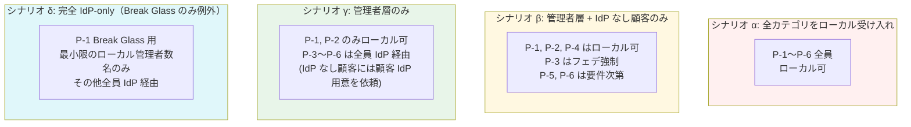

#### シナリオ別の比較

| 観点 | α 全カテゴリ | β 管理者 + IdPなし顧客 | γ 管理者のみ | δ Break Glass のみ |
|---|:---:|:---:|:---:|:---:|
| **ローカルユーザー総数** | 多（フル）| 中 | 少（顧客数×数名）| 極小（数名）|
| **対応可能な顧客範囲** | 全顧客 | 全顧客 | IdP 持つ顧客のみ | IdP 持つ顧客のみ |
| **顧客に IdP 準備依頼の必要性** | なし | IdP なし顧客のみ任意 | **すべての顧客に必須** | **すべての顧客に必須** |
| **侵害クレデンシャル検出の対象範囲** | 大 | 中 | 小 | 最小 |
| **MFA 対象** | 全員（負担大）| 全員（負担大）| 管理者のみ + フェデは IdP 側 | 管理者のみ |
| **パスワードポリシー運用負荷** | 高 | 中 | 低 | 最小 |
| **[§FR-1.2.0.B](#fr-120b-aws-アカウント境界による運用摩擦への対応) Layer 1-4 必要性** | 必須 | 必須 | 軽量化 | ほぼ不要 |
| **IdP 障害時の認証継続性** | ✅（ローカル切替可）| ✅ | ⚠（管理者のみ可）| ⚠ Break Glass のみ |
| **B2B SaaS としての顧客獲得幅** | 広い | 広い | やや狭い（IdP 必須）| 狭い |
| **Broker パターン純度** | △ | ⚠ | ✅ | ✅✅ |
| **業界事例** | Auth0 デフォルト / 中小 B2B | 多くの中堅 B2B SaaS | 大手エンタープライズ B2B 例: Notion Enterprise | Stripe / AWS 管理層 |

#### 我々のスタンス（暫定）

> **本基盤のローカルユーザー範囲の暫定スタンス**:
> - **第一推奨**: **シナリオ γ（管理者層のみローカル）**。**顧客の一般従業員はすべて顧客 IdP 経由を強制**することで、ローカルユーザー数を劇的に減らし、運用負荷・セキュリティリスク・コストを最小化する。これは「**B2B SaaS のエンタープライズ標準**」と整合し、Identity Broker パターンの純度も上がる。
> - **現実的フォールバック**: 顧客のうち IdP を持たない企業が一定数想定される場合は **シナリオ β** に後退。ただし IdP なし顧客には「**段階的に自社 IdP の導入を推奨**」する運用方針を併用。
> - **不採用**: シナリオ α（全カテゴリをローカル受け入れ）は管理者層と一般従業員を同じ User Pool/Realm で扱うことになり、運用・セキュリティ要件が混在して最適化困難。
> - **管理者層（P-1, P-2）の認証方式**: 
>   - **P-1 基盤運用管理者** は **弊社内 IdP（Entra ID 等）連携** が第一推奨。Break Glass 用に **2-3 名のローカル管理者**を残す（IdP 障害時の最終防衛線、業界標準）
>   - **P-2 テナント管理者** は **顧客 IdP 経由を推奨**、IdP なしの顧客は **ローカル管理者** を許容
> - **P-5 ゲスト / P-6 B2C** は対象外（要件確認後に追加検討）

#### カテゴリ別の認証主体と委譲モデル

| カテゴリ | 推奨認証 | 管理主体 | [§FR-1.2.0.B](#fr-120b-aws-アカウント境界による運用摩擦への対応) Layer |
|---|---|---|---|
| **P-1 基盤運用管理者** | 弊社内 IdP + Break Glass ローカル | 共通基盤運用チーム（自社で完結）| AWS IAM Identity Center |
| **P-2 テナント管理者**（IdP あり）| 顧客 IdP 経由 | 顧客 IdP 側 | フェデユーザー扱い |
| **P-2 テナント管理者**（IdP なし）| ローカル + MFA Must | 共通基盤運用がプロビジョン | Layer 3 委譲管理者 |
| **P-3 顧客従業員**（IdP あり）| 顧客 IdP 経由 | 顧客 IdP 側 | フェデユーザー扱い |
| **P-4 顧客従業員**（IdP なし）| ローカル + MFA 強推奨 | 顧客がテナント管理者として CRUD | Layer 3（テナント管理者）+ Layer 1（セルフサービス）|
| **P-5 ゲスト** | 招待 URL + ローカル or ソーシャル | 共通基盤運用 or テナント管理者 | Layer 1 + 招待リンク |
| **P-6 B2C** | ローカル + Passkey + ソーシャル | 自己登録 | Layer 1 セルフサービス完結 |

→ シナリオ γ / β 採用により、**ローカルユーザー数を顧客一般従業員規模 → 管理者層規模に圧縮**できる。これにより §FR-1.2.0.B Layer 1-4 の運用モデルが**より軽量に成立**する。

### 業界の現在地

OIDC / OAuth 2.0 の **Identity Broker パターン**を採用する組織では、**ローカルユーザーも基盤側に集約する**のが業界標準。ただし「**ローカルユーザーの範囲をどこまで広げるか**」は組織のターゲット顧客層次第:

- **中小企業中心の B2B SaaS** (例: 多数の SMB 顧客がいる) → 顧客の IdP 普及率が低いため、ローカル受け入れが必須（シナリオ α / β）
- **エンタープライズ B2B SaaS** (例: Notion Enterprise, Workday) → 顧客が IdP を持つ前提で **IdP 必須**化、ローカルは管理者層のみ（シナリオ γ）
- **大手 IaaS / PaaS の管理層** (AWS / Microsoft / Google) → Break Glass のみローカル、平時は全員 IdP（シナリオ δ）
- **B2C プラットフォーム** (Spotify, Netflix 等) → 当然ながら全員ローカル + ソーシャルログイン（α 系統）

各アプリで独自認証を持つと、Broker パターンの本質（集約点 1 つ、各アプリは JWT を信頼するだけ）が崩れ、SSO・コンプライアンス対応・運用面で大きな問題が発生する。

### 我々のスタンス（基本方針に基づく）

> **本基盤の前提：**   
> - **ローカルユーザーの範囲は §FR-1.2.0.0 のシナリオ β または γ を採用**（要顧客確認）。一般従業員カテゴリはできるだけ顧客 IdP に寄せる   
> - 採用シナリオ範囲内のローカルユーザーは **共通基盤（Cognito User Pool / Keycloak Realm）に集約する**（A 案）   
> - **各アプリで独自にローカル認証は持たない**（B 案不採用）   
> - **既存システムの移行期間は例外的にハイブリッド許容**（C 案、移行完了で A 案に統一）

### 3 つの選択肢

| 選択肢 | 概要 | 採用判断 |
|---|---|---|
| **A. 共通基盤集約** | 全ローカルユーザーを共通基盤の User DB に集約。各アプリは基盤発行 JWT を信頼するだけ | ✅ **Must** |
| **B. 各アプリ独自認証** | 各アプリが独自 Login UI + ユーザー DB + パスワード管理を持ち、共通基盤は OAuth/OIDC で連携する外部 IdP として動作 | ❌ **Won't** |
| **C. ハイブリッド** | レガシーアプリは独自認証を維持、新規は共通基盤を使う移行期間限定運用 | △ **移行期限定で許容** |

### 評価マトリクス

| 観点 | A. 共通基盤集約 | B. 各アプリ独自 | C. ハイブリッド |
|---|:---:|:---:|:---:|
| **SSO** | ✅ 全アプリで自動 | ❌ 不可能（別 DB） | ⚠ 共通基盤側のみ |
| **パスワードポリシー統一** | ✅ 一元管理 | ❌ 各アプリで別 | ⚠ 部分的 |
| **退職時 deprovision** | ✅ 基盤で 1 回 → 全アプリ反映 | ❌ 各アプリで手動 | ⚠ 混在対応必要 |
| **侵害クレデンシャル検出** | ✅ 基盤 1 箇所で実装 | ❌ 各アプリで個別 | ⚠ 一部のみ |
| **MFA 一元化** | ✅ 基盤で統一 | ❌ 各アプリで個別 | ⚠ 一部のみ |
| **GDPR 削除権対応** | ✅ 基盤で 1 回 | ❌ 各アプリで個別 | ⚠ 混在 |
| **監査ログ集約** | ✅ 一元 | ❌ 各アプリで個別 | ⚠ 混在 |
| **漏洩時の影響範囲** | ⚠ 基盤 1 箇所大 | ⚠ 各アプリで脆弱性管理必要 | ⚠ 混在 |
| **実装複雑度** | ✅ 単純 | ❌ 各アプリで認証実装 | ❌ 最も複雑（2 系統管理）|
| **運用負荷** | ✅ 基盤チームのみ | ❌ 各アプリチームで個別 | ❌ 混在 |
| **Broker パターン整合性**（[§1](../common/01-architecture.md)）| ✅ 完全整合 | ❌ パターン崩壊 | ⚠ 部分整合 |
| **基本方針「絶対安全」** | ✅ NIST 統一適用可 | ❌ 各アプリで品質差 | ⚠ 一部のみ |
| **基本方針「効率よく」** | ✅ 顧客追加で各アプリ変更不要 | ❌ 顧客追加で全アプリ改修 | ⚠ 段階対応 |

### B 案（各アプリ独自認証）を採用しない理由

| 理由 | 内容 |
|---|---|
| **Broker パターンの崩壊** | 各アプリで独自認証 → §1 の Hub-and-Spoke パターンの恩恵が消失。issuer が分散し、各アプリで複数 issuer 検証が必要 |
| **SSO 不可能** | 同じユーザーがアプリ A と B にログインしても別認証セッション。「一度のログインで全システム使える」UX が成立しない |
| **セキュリティの品質差** | 各アプリでパスワードハッシュ・レート制限・侵害検出・MFA を個別実装 → 品質が揃わず、最も弱いアプリが全体のセキュリティ天井になる |
| **コンプライアンス対応の重複** | GDPR 削除権、SOC 2 ユーザー監査、ISO 27001 等を**全アプリで個別対応**必要 |
| **退職時 deprovision の漏れリスク** | 基盤で 1 回 → 全アプリ反映、にならず、各アプリで個別対応必要 |
| **コスト** | 各アプリで認証 UI / DB / バックエンド実装 → 開発・運用コスト N 倍 |

### §FR-1.2.0.B AWS アカウント境界による運用摩擦への対応

> **論点**: A 案（共通基盤集約）を採ると、**共通基盤は専用 AWS アカウント**（アプリのアカウントとは別）に配置される。素朴に運用すると、ローカルユーザーの CRUD のたびに「共通基盤アカウントへの IAM 権限付与」や「アプリ運用チームから共通基盤運用チームへの作業申請」が発生し、業務スピードが落ちる懸念がある。
>
> **結論先出し**: この懸念は **「ユーザー CRUD を AWS IAM ベースで行う」前提を捨てれば解消する**。業界標準は **アプリケーション層の認証（Service Credentials / 委譲管理者 / SCIM / セルフサービス）** で CRUD を行い、AWS アカウント境界とは無関係に動かす設計。これにより A 案の集約メリットを保ったまま、現場運用は分散化できる。

#### 懸念事項の整理

| 操作 | 頻度 | 素朴な実装での摩擦 | 解消可能か |
|---|---|---|:---:|
| **ユーザー作成・削除・更新** | 高（日次）| アプリチームが共通基盤アカウントの IAM 権限申請 → 待ち時間発生 | ✅ **解消可能** |
| **パスワードリセット** | 高（日次）| 同上 | ✅ **解消可能**（セルフサービスも有効）|
| **MFA リセット・ロック解除** | 中（週次）| 同上 | ✅ **解消可能** |
| **ユーザー属性・ロール変更** | 中（週次）| 同上 | ✅ **解消可能** |
| **新規 IdP 接続追加** | 低（顧客追加時）| 共通基盤側の構成変更が必要 | △ **頻度低・申請許容** |
| **新規 App Client 追加** | 低（新アプリ立ち上げ時）| 同上 | △ **頻度低・申請許容** |
| **Realm / User Pool 設定変更** | 極低（半期 / 年）| 同上 | △ **頻度極低・申請許容** |

→ **高頻度操作（ユーザー CRUD）の摩擦は解消可能**。低頻度操作（構成変更）は AWS 側の作業申請を許容しても運用負荷は限定的。

#### 解決アプローチ（4 つのレイヤー）

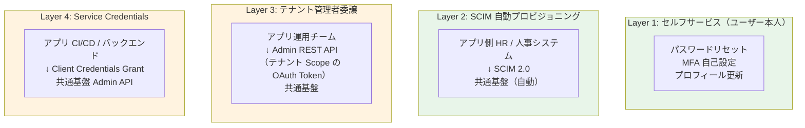

**各レイヤーの詳細**:

| レイヤー | 解決する摩擦 | 実装 | 業界根拠 |
|---|---|---|---|
| **Layer 1: セルフサービス** | パスワードリセット / MFA 設定の人手作業をゼロ化 | Cognito Hosted UI / Keycloak Account Console（標準機能） | NIST SP 800-63B / OWASP 推奨。Auth0 / Okta もデフォルト機能 |
| **Layer 2: SCIM 2.0** | アプリ側の人事/HR 変更を共通基盤に自動同期。手動 CRUD 自体を不要化 | Keycloak SCIM プラグイン / Cognito は Lambda 経由実装 | RFC 7644。Microsoft Entra / Okta / Google Workspace が業界標準採用 |
| **Layer 3: 委譲管理者** | テナント（顧客 / アプリ）ごとに専用の管理者ユーザーを作り、その管理者は **Admin REST API** を使って自分のテナント内のユーザー CRUD ができる。AWS IAM は使わない | Cognito Plus ティアの delegated admin / Keycloak Realm Admin Role | KuppingerCole の Multi-Tenant IAM ベストプラクティス。Auth0 Organizations 同等機能 |
| **Layer 4: Service Credentials** | アプリの CI/CD やバックエンドが Client Credentials Grant で取得したアクセストークンで Admin API を呼ぶ | OAuth 2.0 Client Credentials Grant（RFC 6749 §4.4）+ 限定スコープ Client | OAuth 標準。Stripe / GitHub / Twilio 等の SaaS が同一モデル |

**重要**: いずれも **AWS IAM とは別の認証チャネル**（アプリケーション層の OAuth）で動く。共通基盤の AWS アカウントに対する IAM 権限申請は **不要**。

#### 推奨運用モデル

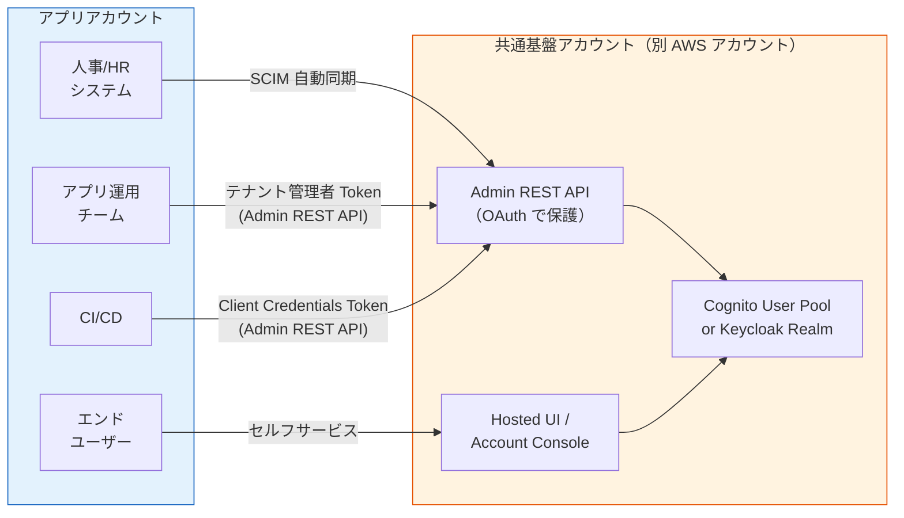

→ アプリチームは **自アカウント内に閉じた認証情報（OAuth Token）** で共通基盤を操作。AWS IAM 経由のクロスアカウント申請は発生しない。

#### 残る摩擦と対処

| 残る摩擦 | 対処 |
|---|---|
| 新規アプリ立ち上げ時の App Client 登録 | **Terraform IaC** で `proposal/common/01-architecture.md` の構成に従い PR ベース。AWS IAM 申請ではなく **Git PR 申請** |
| 新規顧客 IdP 登録 | 同上（Terraform で IdP オブジェクトを定義）|
| Realm / User Pool レベルの設定変更 | 同上（半期に 1 回程度の頻度） |
| 構成変更のレビュー責任 | **共通基盤運用チームが PR レビューを担当**。アプリチームは PR 提出のみ。実行は CI/CD |

→ **構成変更は AWS IAM ではなく Git PR ベース**にすることで、共通基盤運用チームの「ゲートキーパー」役割を維持しつつ、申請プロセスの軽量化（メール / チケット → PR レビュー）が可能。

#### 補足: B 案を再考する場合の条件

「アプリチームが完全な独立性を求める」場合のみ B 案を検討するが、次の **2 つすべてを満たす** ことが前提:

1. アプリが **物理的に SSO 不要**（独立した認証境界として扱われることが業務要件で確定）
2. アプリ独自のセキュリティ要件（PCI DSS の例で言う「カード処理アプリは完全分離」等）が**法的に強制**される

→ 上記 2 条件を満たさない限り、**Layer 1-4 の運用モデルで A 案を維持した方が運用負荷・セキュリティ品質ともに優位**。

### C 案（ハイブリッド）の許容範囲

C 案は**移行期限定**で許容（将来は A 案に統一する前提）：

| 状況 | 扱い |
|---|---|
| 既存システムが独自認証を持つ | **段階移行**を計画（一括移行 / 並行稼働 / 即時切替を選択）|
| 移行困難な特殊レガシー | **共通基盤と並行稼働**（既存ユーザーは既存認証、新規は基盤）、長期サポートはしない |
| 法規制で物理分離が必要 | テナント単位の Pool/Realm 分離（[§FR-2.3.A](02-federation.md#33a-アーキテクチャ判断単一-poolrealm--複数-idp-を採用) の B 案）で対応、独自認証は不要 |

→ **新規アプリは A 案 + Layer 1-4 の運用モデルを採用**。

### TBD / 要確認

**A. 利用者カテゴリと範囲（[§FR-1.2.0.0](#fr-1200-ローカルユーザーとは何か--利用者カテゴリ別の分析) と連動）**

| 確認項目 | 回答例 |
|---|---|
| **対象とする利用者カテゴリ**（P-1〜P-6） | P-1〜P-4（B2B 想定）/ P-1〜P-6（B2C 含む）/ その他 |
| **ローカルユーザー範囲シナリオ** | α 全カテゴリ / β 管理者+IdP なし顧客 / **γ 管理者のみ（推奨）** / δ Break Glass のみ |
| **想定顧客の IdP 普及率** | 90%+（大手中心、γ 採用可）/ 50-90%（β 採用）/ <50%（α 必要）|
| **IdP なし顧客への対応方針** | 顧客に IdP 準備を依頼 / 共通基盤側でローカル受け入れ / 顧客取らない |
| **P-1 基盤運用管理者の認証方式** | 弊社内 IdP（Entra ID 等）連携 / 完全ローカル / IdP + Break Glass 用ローカル |
| **P-2 テナント管理者の認証方式** | 顧客 IdP 経由 / ローカル / 顧客選択 |
| **P-5 ゲスト・P-6 B2C の対象範囲** | 対象外 / 対象（追加要件として §FR-1.X で詳細化）|

**B. 既存システムからの移行**

| 確認項目 | 回答例 |
|---|---|
| 既存システムで独自ローカル認証を持つアプリの有無 | あり（システム名 + ユーザー数）/ なし |
| 既存独自認証システムの扱い方針 | 段階移行 / 並行稼働 / 即時切替 / 維持（C 案）|
| 移行期間中のユーザー情報同期方針 | 同期する / しない（移行完了後に基盤に統一）|
| 既存パスワードハッシュの持ち越し（[§FR-1.2 B](#tbd--要確認-2) と連動）| 持ち越す（bcrypt 等）/ 全員再設定 |

**C. クロスアカウント運用モデル（[§FR-1.2.0.B](#fr-120b-aws-アカウント境界による運用摩擦への対応) と連動）**

| 確認項目 | 回答例 |
|---|---|
| **ユーザー CRUD 運用モデル** | Layer 1 セルフ / Layer 2 SCIM / Layer 3 委譲管理者 / Layer 4 Service Credentials のどれをどこまで採用するか |
| **アプリチームに委譲する操作範囲** | 自テナントユーザー CRUD のみ / + ロール変更 / + IdP 設定変更まで |
| **SCIM ソース（自動プロビジョニング元）** | 人事システム / Active Directory / なし（手動 + セルフサービスのみ）|
| **新規 App Client / IdP 追加の申請プロセス** | Git PR / 共通基盤チームへのチケット / 即時許可 |

---

### §FR-1.2.0.D ユーザー識別子戦略 — メール非保有・顧客独自 ID への対応

> **このサブセクションで定めること**: メールアドレスを持たないユーザー、および顧客が独自に決めた ID 体系を受け入れる場合の **識別子設計（3 階層モデル）** と、JIT 突合・アカウント復旧・通知の代替手段。   
> **主な判断軸**: email 非保有ユーザーの存在有無、顧客独自 ID の命名規則・不変性、アカウント復旧手段の物理制約、プラットフォーム（Cognito vs Keycloak）の制約耐性   
> **§FR-1 全体との関係**: §FR-1.2.0.0 が「**誰をローカルにするか**」、§FR-1.2.0.B が「**運用モデル**」、§FR-1.2.0.D が「**識別子設計**」。本サブセクションは [§FR-2.2.1.A](02-federation.md#fr-2.2.1.a-同一テナント内ユーザー重複の扱い)（テナント内ユーザー重複の突合キー）と [§FR-7.1](07-user.md#fr-7.1-ユーザー-crud--fr-user-6.1)（ユーザー CRUD のキー設計）の**前提**を確定させる

#### §FR-1.2.0.D.0 背景 — 「メールアドレスがある」前提の脆さ

業界の認証基盤デザインの多くは **email を主識別子（unique key / matching key / 復旧手段）** に置く設計を前提としている（OIDC standard claim `email` / Cognito の Sign-in Alias / Auth0 の Database Connection / 多くの IdP の NameID Format = emailAddress）。

しかし B2B 顧客の現実は次の通り:

- **フィールドワーカー / 工場 / 病院 / 小売 / 教育現場では、メールアドレスを付与されていないユーザーが普通に存在する**（業界調査：Authgear / OLOID 2026）
- 顧客が **独自 ID 体系**（社員番号、学籍番号、店舗番号、技能者 ID 等）を既に持っているケースが多く、新基盤でもこれを正準識別子として使いたいという要望がある
- 顧客の既存システムが「**システムごとにユーザーを別 ID で管理**」しているレガシー構成のため、新基盤に集約する段で「**どの ID を正準とするか**」を決める必要がある

「email 前提」を維持すると、JIT 突合 / パスワードリセット / アカウント復旧 / 通知 のすべてが破綻する。本サブセクションでは **email に依存しない識別子戦略** を業界事例に基づき確定する。

---

#### §FR-1.2.0.D.1 識別子の 3 階層モデル（業界標準）

業界標準は **3 つの層を明確に分離して管理する**こと。各層を混同（例：B を主キーに使う）すると改名・統合・移行で破綻する。

```mermaid
flowchart LR
    subgraph C["Layer C: IdP 側識別子"]
        CSub["IdP の sub<br/>例: ENTRA-abc123<br/>不変・IdP が採番"]
    end
    subgraph B["Layer B: 顧客可視 ID"]
        Ext["external_id / preferred_username<br/>例: ACME-EMP-0042<br/>顧客が決定・運用上可変"]
    end
    subgraph A["Layer A: 基盤生成内部 ID"]
        Sub["sub (UUID)<br/>例: a1b2c3d4-...<br/>不変・基盤が採番<br/>JWT sub クレーム / 全 DB FK"]
    end

    C -.identities[].userId.-> A
    B -.preferred_username 属性.-> A

    style A fill:#fff8e1
    style B fill:#e8f5e9
    style C fill:#e3f2fd
```

| Layer | 値の例 | 採番者 | 可変性 | 用途 |
|---|---|---|---|---|
| **A** `sub` | UUID `a1b2c3d4-...` | 本基盤 | **不変** | 内部参照、JWT `sub` クレーム、全 DB FK、監査ログ |
| **B** `external_id` / `preferred_username` | `ACME-EMP-0042` | 顧客 | 可（運用上）| 顧客向け表示、ヒューマンリーダブル ID、検索 |
| **C** `identities[].userId` | IdP の `sub` | 顧客 IdP | **不変**（IdP 側で）| フェデ突合、IdP リンク |

##### Failure Mode（混同するとどうなるか）

| 誤設計 | 起きる事故 |
|---|---|
| Layer B を主キー（FK）として DB に持つ | 顧客が「社員番号体系変更」「人事システム刷新」したときに全 FK が壊滅 |
| Layer A しか保持しない（B を持たない）| 顧客側で「うちの社員 ACME-001 は基盤で誰？」が解決不能。SCIM / API での照会が成立しない |
| Layer A と C を混同（IdP sub を基盤 sub にしてしまう）| 顧客が IdP 切替（Okta → Entra）時に同一人物が別 sub になり、ロール・履歴がロスト |
| email を Layer A の代替に使う | email 改名・退職メール再利用で同一人物判定が壊れる |

→ **3 層を明示的に分けて持つ**のが業界コンセンサス（Microsoft Entra / Auth0 / Okta / Salesforce すべて同じ構造）。

---

#### §FR-1.2.0.D.2 JIT 突合キー設計（email 非依存）

##### 業界アンチパターン

| アンチパターン | 出典・理由 |
|---|---|
| ❌ **email を unique key として JIT 突合** | Salesforce / Okta / ThousandEyes 公式：「email should never be used as the unique key」。email は変更可能・退職後再利用可・空欄ありえる |
| ❌ NameID Format = `emailAddress` を強制 | 顧客 IdP に email がない場合に破綻。AuthnRequest 側で format 指定を強制すると IdP 側で reject される |
| ❌ Layer B（顧客独自 ID）を直接 JWT `sub` に流す | 顧客が ID 改番すると全アプリのセッション・FK が壊れる |

##### 業界推奨

| 推奨パターン | 出典 |
|---|---|
| ✅ **canonical ID 優先順位**: `oid`（Microsoft）> `sub`（OIDC）> `nameidentifier`（SAML 古典）| ThousandEyes JIT Provisioning Doc |
| ✅ NameID Format: **`persistent`**（IdP 内不変、業界第一推奨）| SAML 2.0 仕様 + Atlassian / Bitbucket JIT ガイド |
| ✅ 複合キー: `tenant_id` + Layer B `external_id` で顧客内一意性確保 | Slack / Notion / Linear の B2B SaaS 実装パターン |
| ✅ Layer C → Layer A への mapping は IdP 単位で **immutable lookup table** として保持 | Microsoft Entra / Auth0 標準 |

##### JIT 突合キーの 3 シナリオ（顧客状況別）

| 顧客状況 | 推奨突合キー | 備考 |
|---|---|---|
| 顧客 IdP が email を発行 | `tenant_id + persistent NameID`（第一）、email は補助属性 | email 変更耐性確保。email を補助属性で持ち、認証復旧の連絡手段に活用 |
| 顧客 IdP が email を発行しない（or 一部のみ）| `tenant_id + persistent NameID + external_id` | external_id を IdP 属性として送信してもらう（例：SAML `employeeNumber`、OIDC custom claim）|
| 顧客が「社員番号で突合」を要望 | `tenant_id + employeeNumber` 属性（顧客独自 mapping）| 顧客独自設定として明示的に許容。属性マッピング設定を顧客テナントごとに分離 |

→ どのシナリオでも **email は「あれば使う補助属性」であり、unique key ではない**。

---

#### §FR-1.2.0.D.3 顧客独自 ID の受け入れ方針

##### 命名空間設計

```
顧客可視                     基盤内部表現
ACME-EMP-0042   →   preferred_username: "ACME-EMP-0042"
                    custom:external_id: "ACME-EMP-0042"
                    custom:tenant_id:   "acme"
                    sub:                "a1b2c3d4-..." (UUID, 不変)
```

- **顧客可視 ID = Layer B**。表示・検索・SCIM 等に使う
- **基盤内部一意化**: `tenant_id + external_id` で複合一意性を担保。顧客間で同じ `ACME-001` がぶつかっても OK
- **Layer A（sub）は絶対不変**。Layer B は人事システム移行等で改番可能だが、過去の external_id を **履歴属性として保持**

##### 不変性ポリシー

| 識別子 | 不変性 | 改名できる主体 | 履歴保持 |
|---|---|---|---|
| Layer A `sub` | **絶対不変** | なし | — |
| Layer B `external_id` | 運用上可変 | 顧客側管理者 / 基盤側（顧客申請） | 過去値を `external_id_history` に保持 |
| Layer B `preferred_username` | 運用上可変 | 同上 | 同上 |
| Layer C `identities[].userId` | IdP 内不変 | IdP 側でのみ | IdP 切替時は新規 link 追加（旧は archive） |

---

#### §FR-1.2.0.D.4 プラットフォーム制約（Cognito vs Keycloak）

email 非保有 + 顧客独自 ID 対応における **プラットフォーム機能差** は大きい。以下は AWS / Keycloak 公式ドキュメント確認結果。

| 制約 | Cognito | Keycloak |
|---|---|---|
| **email を必須にしない** | ✅ 可（**Pool 作成時のみ**、後から変更不可）| ✅ 可（Realm 設定で随時変更可）|
| **username の不変性** | **❌ 不変、作成後変更不可** | ✅ 変更可（管理者 / セルフサービス）|
| **`preferred_username`** | alias として可、ただし「**必須属性と alias は同時設定不可**」「**alias 設定時は登録時に値を入力不可**（confirmation 時のみ）」| username と独立、任意設定可、登録時設定可 |
| **必須属性の追加・変更**（Pool/Realm 作成後）| **❌ 不可** | ✅ 可 |
| **顧客独自 ID 受け入れ** | カスタム属性 `custom:external_id` で可、ただし alias 不可 → 検索インデックスは別途設計 | カスタム属性 + Identity Provider Mapper で柔軟、Search 標準対応 |
| **Email 不在時のアカウント復旧** | SES email 連携が前提強い、Admin Reset 可、SMS 連携可（Pinpoint）| Admin Reset + **Recovery Codes（2025-10 公式機能）** + SMS |
| **NameID Format 受け入れ柔軟性** | mapping は可だが editing UI 限定 | Identity Provider Mapper で任意マッピング |

##### 結論

- **email 非保有ユーザーを多く持つ顧客は Keycloak で対応する方が運用摩擦が小さい**
- Cognito での実装は技術的に可能だが、`username の不変性` × `preferred_username alias の制約` × `必須属性変更不可` のコンビにより、Pool 設計を間違えると**運用後の修正手段が極めて限定的**になる
- これは [[project-platform-direction-keycloak]] の Keycloak 確定方向を**補強する重要根拠**となる
- Cognito を採るとしても、**Pool 設計時点で email 任意 + preferred_username alias + custom external_id を慎重に設計**する必要があり、設計レビューが事実上必須

---

#### §FR-1.2.0.D.5 アカウント復旧・通知の代替手段（email 非保有時）

##### NIST SP 800-63B-4（2025-08 公開）の制約

| 制約 | 内容 |
|---|---|
| **SMS OTP** | **Restricted authenticator** に格下げ（仕様上禁止ではないが、組織のリスク承認が必要、Compensating Controls 必須）|
| **email を out-of-band 2FA に使用** | **不可**（email を 2 要素目として送る運用は仕様違反）|
| 推奨復旧モデル | **物理 multi-factor デバイス 2 つ**（プライマリ + バックアップ）の登録 |

##### email-less 復旧手段の評価

| 手段 | NIST 800-63B-4 適合 | 適用シナリオ | 備考 |
|---|---|---|---|
| **Recovery Codes**（紙配布 + ユーザー保管）| ✅ 推奨 | 全員（汎用）| Keycloak 26.x で公式機能、Cognito は Lambda 実装 |
| **Admin Reset**（管理者主導の新 PW 再発行）| ✅ 推奨 | 工場・病院など対面で配布可能な現場 | 内部統制プロセスに乗せる必要あり |
| **WebAuthn / Passkey 多重登録** | ✅ 強推奨 | スマホ / Yubikey 等を 2 つ登録 | NIST 800-63B Rev 4 が明示的に推奨 |
| **Push Notification**（モバイルアプリ）| ✅ 推奨 | スマホ持参の現場ワーカー | ベンダーロックインに注意 |
| **SMS OTP** | ⚠ Restricted（リスク承認必要）| 復旧手段に限り条件付きで容認可 | SIM スワップ攻撃リスク、補償統制必須 |
| **セキュリティ質問** | ❌ NIST が明確に非推奨（2017〜）| 採用しない | — |

##### 通知手段（パスワード変更・MFA 登録 等の通知）

| 通知手段 | email-less 環境での代替 |
|---|---|
| パスワード変更通知 | アプリ内バッジ / 管理者ダッシュボード / 紙の運用通知 |
| MFA 登録完了通知 | アプリ内通知 / 管理者画面 / Push |
| 重要セキュリティ通知（不正ログイン疑い）| Push + 次回ログイン時の強制画面表示 |

---

#### §FR-1.2.0.D.6 我々のスタンス（基本方針に基づく）

| 基本方針の柱 | 識別子戦略での実現 |
|---|---|
| **絶対安全** | email 改ざんに依存しない突合（Layer A/C 中心）、Recovery Codes + WebAuthn 多重登録で復旧手段を確保、NIST SP 800-63B-4 準拠 |
| **どんなアプリでも** | フィールドワーカー / 工場 / 病院 / 小売 / 教育 まで収容、顧客独自 ID 受容 |
| **効率よく認証** | 顧客既存 ID 体系をそのまま `preferred_username` として再利用、移行時の再採番不要 |
| **運用負荷・コスト最小** | 識別子 3 階層モデルで FK 切れずに改名・統合・移行を許容、Keycloak 標準機能で実装（Custom SPI 最小限） |

---

#### §FR-1.2.0.D.7 TBD / 要確認（B-IDM 系ヒアリング項目）

| 項目 ID | 確認内容 | 回答例 |
|---|---|---|
| **B-IDM-1** | email 非保有ユーザーの存在 | あり（業種・概算規模・想定 % ）/ なし |
| **B-IDM-2** | 顧客独自 ID の体系 | 社員番号 8 桁数字 / 部門コード + 連番 / 自由形式 / 顧客ごとに異なる |
| **B-IDM-3** | 顧客独自 ID の不変性 | 不変 / 異動で変更可 / 退職時のみ廃止 |
| **B-IDM-4** | 同一顧客内での ID 衝突可能性 | 衝突しない / 部門間で重複可（複合キー必要）|
| **B-IDM-5** | 顧客間での同名 ID 衝突想定 | あり（`tenant_id` プレフィックス必須）/ なし |
| **B-IDM-6** | アカウント復旧手段の物理制約 | email 不可 / SMS 可否 / 対面リセット可否 / Push 可否 |
| **B-IDM-7** | 既存システム間の ID 体系統一度 | 全システム同 ID / システムごとに別 ID（**既存統一の課題大**）|
| **B-IDM-8** | ServiceNow `user_name` との突合方針（Point 3 と連動）| ServiceNow の `user_name` = 顧客独自 ID 同じ / 別（mapping table 必要）|
| **B-IDM-9** | 顧客 IdP の NameID Format 受け入れ | `persistent` 受信可能 / `emailAddress` のみ / `unspecified` |
| **B-IDM-10** | 顧客側 IdP の email 送出率 | 全員送信 / 一部空欄 / 全員無し |
| **B-IDM-11** | 顧客独自 ID と SCIM `userName` の関係 | 同じ / 別マッピング必要 |
| **B-IDM-12** | 退職者 ID の再利用 | する（衝突回避要）/ しない |

---

#### 参考資料（§FR-1.2.0.D 全体）

- **AWS Cognito 公式ドキュメント**:
  - [Working with user attributes](https://docs.aws.amazon.com/cognito/latest/developerguide/user-pool-settings-attributes.html) — Required / Alias 属性の制約
  - [Mapping IdP attributes to profiles and tokens](https://docs.aws.amazon.com/cognito/latest/developerguide/cognito-user-pools-specifying-attribute-mapping.html)
- **Keycloak 公式ドキュメント**:
  - [Recovery Authentication Codes](https://www.keycloak.org/2025/10/recovery-codes) — 2025-10 リリース公式機能
  - [Managing users](https://www.keycloak.org/docs/latest/server_admin/index.html) — username/email 設定
- **NIST**:
  - [SP 800-63B-4 Digital Identity Guidelines](https://nvlpubs.nist.gov/nistpubs/SpecialPublications/NIST.SP.800-63B-4.pdf) — SMS Restricted, recovery model
- **JIT 突合 / SAML NameID**:
  - [Salesforce Federation ID for SSO](https://developer.salesforce.com/docs/atlas.en-us.packagingGuide.meta/packagingGuide/environment_hub_sso_mapping_federation_formula.htm) — 顧客独自 ID マッピング標準
  - [ThousandEyes SAML JIT Provisioning](https://docs.thousandeyes.com/product-documentation/user-management/user-registration/saml-jit-provisioning) — 「never use email as unique key」
  - [Microsoft Entra: Customize SAML token claims](https://learn.microsoft.com/en-us/entra/identity-platform/saml-claims-customization)
- **フィールドワーカー認証パターン**:
  - [Authgear: Frontline workforce authentication](https://www.authgear.com/post/auth0-alternatives-for-frontline-workforce-authentication)
  - [OLOID: Workforce IAM Complete Guide](https://www.oloid.com/blog/workforce-identity-and-access-management)

---

### §FR-1.2.0.E 既存システムからの混在モデル移行戦略（ローカル + フェデ併存からの集約）

> **このサブセクションで定めること**: 現行システムが **ローカルユーザー管理（サインアップ + ユーザー管理 UI）とフェデレーションを併存運用している** 状態から、本基盤（Keycloak ベース）へ移行する際の戦略を確定する。具体的には (1) 移行アプローチの 3 パターン選択、(2) ローカル PW ハッシュの移行手段、(3) サインアップ機能の引き継ぎ方針、(4) 並走期の運用設計、(5) 混在顧客（同一顧客内に local + fed 両方）の扱い、を扱う。   
> **主な判断軸**: 現行 PW ハッシュアルゴリズム、ロールバック容易性要件、移行期間の許容範囲、ユーザー数規模、サインアップ機能の現行実装   
> **§FR-1 全体との関係**: §FR-1.2.0.0 でローカルユーザー範囲（シナリオ α/β/γ/δ）、§FR-1.2.0.B で運用モデル（Layer 1-4）、§FR-1.2.0.D で識別子戦略を定めた。本サブセクションは**「現行から新基盤への遷移パス」**を確定。[§FR-7.4.7](07-user.md#fr-747-段階移行運用jit--scim-追加既存ユーザーマージ) の JIT→SCIM 段階移行とは別軸（こちらは「プラットフォーム集約」自体の移行）

#### §FR-1.2.0.E.0 背景 — なぜ "混在からの移行" を専用に扱うか

現行システムが「ローカル管理 + フェデ」両方を持つ場合、新基盤への移行は単純な「データ持ち越し」では済まない。具体的な摩擦:

| 摩擦点 | 内容 |
|---|---|
| **PW ハッシュの互換性** | 旧システムが bcrypt / Argon2 旧版 / 独自 algo の場合、Keycloak ネイティブ（PBKDF2 / Argon2 25+）と非互換。**強制リセットせずに移行する手段が必要** |
| **サインアップ UI の所在** | 既存のサインアップ機能を新基盤の Hosted UI に集約するか、アプリ側に残すか、廃止するか |
| **混在顧客の存在** | 同一顧客内で「社員=フェデ + 委託=ローカル」のような混在構成があると、移行も二重に必要 |
| **新旧の識別子衝突** | 旧システム ID と新基盤 Layer A `sub` の対応表が必要、並走期は両方が活きる |
| **ロールバックの単位** | アプリ単位 / 顧客単位 / 利用者カテゴリ単位 のどこで切替・戻すか |

→ これらを **戦略レベル**で先に確定しないと、運用開始後に「やっぱり戻したい」「PW 再設定通知が顧客で炎上」等の事故が起きる。

#### §FR-1.2.0.E.1 移行アプローチ 3 パターンの比較

業界（Ubisecure / Inteca / Strata.io / IdentityPlane 2025-2026 ガイドライン）は次の 3 パターンに収斂:

| 案 | 特徴 | リスク | 工数 | ロールバック容易性 | 推奨度 |
|---|---|---|---|:---:|:---:|
| **A. Big Bang（Rip & Replace）** | メンテ窓 1 回で全ユーザー / 全アプリを切替 | **🔴 高**（旧 IAM 即廃止、戻り道なし）| 短期集中 | ❌ 困難（再展開コスト大）| 小規模 / 単純構成のみ |
| **B. 並走（Parallel Run）**（**業界推奨・本基盤デフォルト**）| 旧 IAM が source、新基盤と双方向接続、**アプリ単位で順次切替** | 🟡 中（並走期の複雑性）| 中（3〜6 ヶ月）| **✅ 容易**（アプリ単位でロールバック可）| **★★★★★** |
| **C. 永続共存（Coexistence）** | 旧 + 新が共に本番稼働、ユーザーはどちらでもログイン可 | 🟡 中-高（長期複雑運用）| 長期 | ⚠ 制限的 | 例外（特殊レガシー）|

##### B 案（並走）の業界裏どり

Ubisecure / Inteca のガイダンス引用:
> "The legacy IAM remains the **primary source for identity data at the beginning**. The new platform runs alongside it, with connectivity back to the old directory or user store. You cut applications over incrementally starting with internal or low-risk apps to validate the pattern. **If a specific app runs into trouble, you do not have to roll back the whole migration**."

→ **「アプリ単位で切替・戻し可能」** が並走方式の最大の利点。Keymate の事例では Keycloak へ **12 million records/hour** で大量移行を実証している。

#### §FR-1.2.0.E.2 ローカル PW ハッシュ移行の 5 手段

##### Keycloak のネイティブ対応範囲

| アルゴリズム | Keycloak ネイティブ対応 | 備考 |
|---|:---:|---|
| **PBKDF2-SHA256 / SHA512** | ✅ | Keycloak 24 以前のデフォルト |
| **Argon2** | ✅ | Keycloak 25+ デフォルト |
| **bcrypt** | ❌（プラグイン / Custom SPI 必要）| `keycloak-bcrypt` OSS あり |
| **Argon2 旧版**（古いパラメータ）| ⚠ パラメータ次第 | Custom PasswordHashProvider 推奨 |
| **MD5 / SHA1 単純ハッシュ** | ❌ | 強制リセット推奨（セキュリティ低）|

##### 5 つの移行手段

| # | 手段 | Keycloak 実装 | 強制リセット要否 | 採用判断 |
|---|---|---|:---:|---|
| **①** | **既存値が PBKDF2 / Argon2 互換** | そのまま import（kcadm.sh / Realm Import）| ❌ 不要 | レア（旧システム = Keycloak 系のみ）|
| **②** | **User Storage SPI（キャッシュ移行）**（**業界標準・推奨**）| 旧 DB を一時的に認証ソースに、初回ログイン後に Keycloak DB へ移行 | ❌ 不要 | **★★★★★** |
| **③** | **Custom PasswordHashProvider SPI** | bcrypt / Argon2 旧版を Keycloak に永続的に追加 | ❌ 不要 | 旧 algo を恒久維持したい場合 |
| **④** | **強制リセット**（招待メール + Reset Credentials）| すべてのユーザーに「新規 PW 設定」案内 | ✅ **必要** | クリーン、ただし UX 悪化・サポート工数増 |
| **⑤** | **アプリ側で代理認証**（移行期のみ）| アプリが旧 DB で検証 → JWT を基盤に発行依頼（Token Exchange）| ❌ 不要 | 移行期のみ、段階廃止前提 |

##### 推奨：② User Storage SPI（キャッシュ移行）の動作

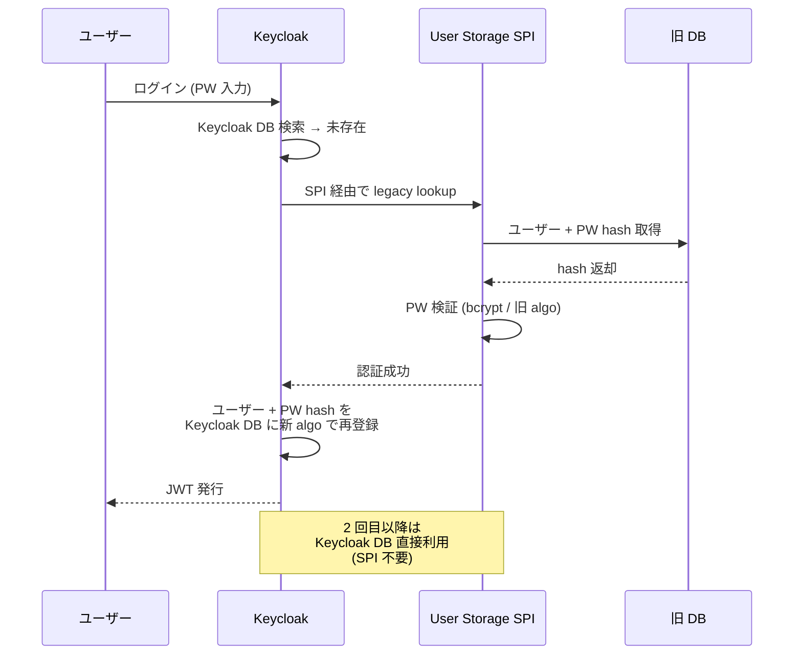

##### 重要な業界知見（codesoapbox.dev / Inteca）

> "Both authentication systems will have to be **deployed at the same time until every user has logged in at least once**, as there is no other way to achieve this goal while responsibly encrypting users' passwords."

→ **並走期間 = 全ユーザーが一度はログインする期間**。半年〜1 年が現実的（休眠ユーザー混在時）。並走期間終了時に未ログインユーザーは強制リセット or 削除。

#### §FR-1.2.0.E.3 サインアップ機能の引き継ぎ 3 パターン

| 案 | サインアップ UI 所在 | 承認フロー | 採用判断 | 業界実例 |
|---|---|---|---|---|
| **α. アプリ側に残置** | 各アプリの既存 UI | アプリ実装 | 既存 UI / フローを継続使用したい / 移行リスク最小化 | レガシー多数の混在環境 |
| **β. 共通基盤集約**（**業界標準・推奨**）| 認証基盤 Hosted UI | Keycloak **Registration Flow + Custom Approval Authenticator** | 統一 UX / 運用集約 | Microsoft Entra External ID self-service portal、Auth0 B2B Starter |
| **γ. 管理者作成のみ**（セルフ廃止）| なし | 管理者主導 (Admin UI / API) | 規制業種 / B2B 一部 | Salesforce Enterprise |

##### β 案（Keycloak Hosted Registration）の構成

- **Keycloak Registration Flow** が標準で登録 UI を提供
- 承認ワークフロー: 標準で「メール確認」のみ。**カスタム承認（テナント管理者承認）が必要なら Custom Required Action / Authenticator 実装**
- API Connectors 相当: Keycloak の Event Listener SPI で外部承認システム（Salesforce / Slack / 自社管理 UI）と連携可
- Microsoft Entra External ID の "Self-service sign-up + Approval workflow" と概念的に等価

##### サインアップ移行の意思決定軸

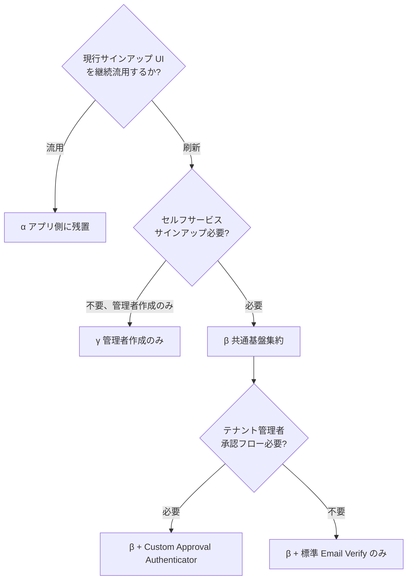

#### §FR-1.2.0.E.4 並走期の運用設計

##### 識別子マッピングの設計

並走期は **旧 user_id ↔ 新 Layer A `sub`** の対応表が必須。

| 持ち方 | 場所 | 用途 |
|---|---|---|
| **マッピング表（DB / KVS）** | 専用 service or 共通基盤の custom attribute | 旧 user_id を `external_id` カスタム属性として Layer B に保持 |
| **JWT クレーム** | `legacy_user_id` クレーム発行 | 旧 ID を必要とするアプリ向け |
| **アプリ側 lookup** | 各アプリの user_id 列に both 値を保持 | アプリ DB 移行を伴う場合のみ |

##### 切替単位の選択

| 単位 | 例 | 利点 | 欠点 |
|---|---|---|---|
| **アプリ単位**（**推奨**）| App A → App B → App C | ロールバック容易、リスク分散 | アプリ間 SSO が一時的に複雑化 |
| 顧客単位 | Acme 全アプリ → Globex 全アプリ | 顧客への影響説明がシンプル | 単一顧客で全アプリ巻き戻し必要時に重い |
| 利用者カテゴリ単位 | 管理者層 → 一般従業員 → ゲスト | リスク低層から開始 | 同一アプリ内で新旧混在、Sorry 多発 |

##### 並走期の SSO / セッション制御

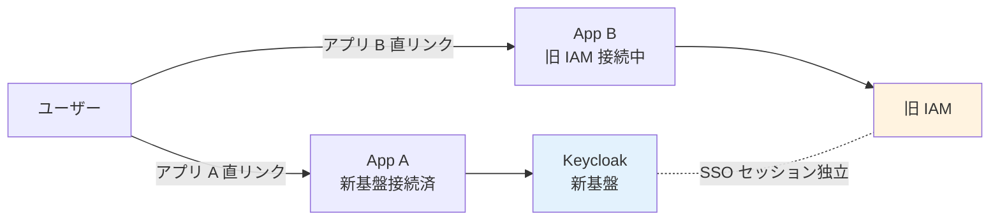

→ **並走期は「アプリごとに独立 SSO セッション」が現実解**。新旧を跨いだ SSO セッションは設計困難（業界事例なし）。ユーザーには「移行期は両方のログインが起きうる」と事前周知（B-616 リードタイム）。

##### ロールバック手段

| 切替後の問題 | ロールバック手段 |
|---|---|
| 特定アプリで認証エラー多発 | アプリの IdP 設定を旧 IAM に戻す（DNS / config 切替、1 時間以内） |
| 全アプリで Keycloak 障害 | DNS で `auth.example.com` を旧 IAM に向け、旧 IAM が引き続き全アプリの IdP として機能 |
| 識別子マッピング不整合発覚 | マッピング表を再生成 / 該当ユーザーのみ手動修正 |

#### §FR-1.2.0.E.5 混在顧客（同一顧客内 local + fed）の扱い

##### 典型シナリオ

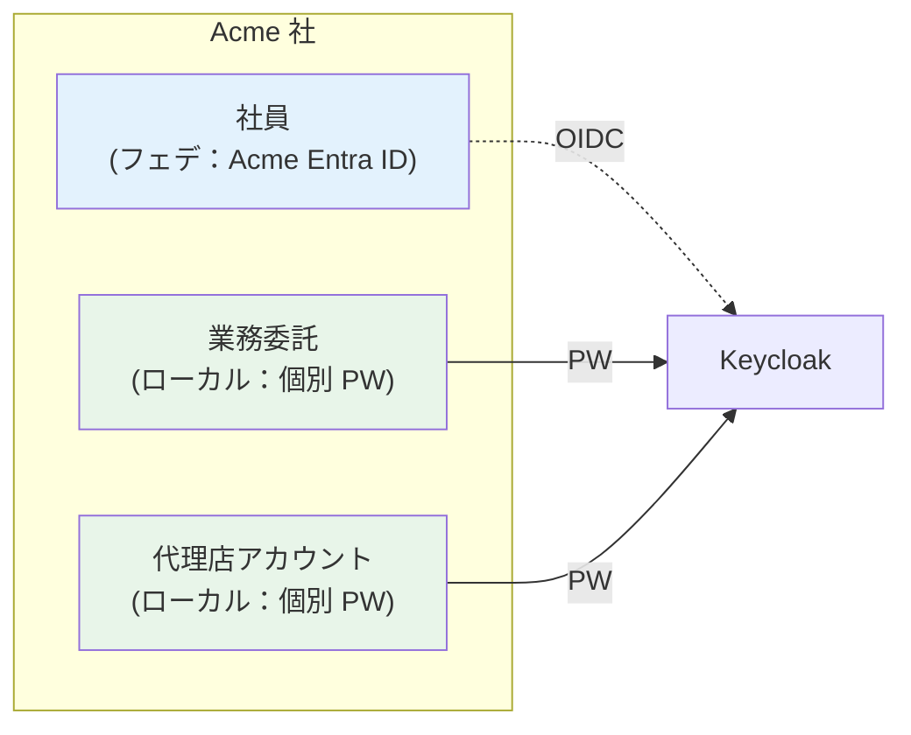

→ **業界標準パターン**（Microsoft Azure Architecture Center 2026）:
> "Some solutions allow federation to grant employees access, while also allowing access for contractors or users who don't have accounts in the federated IdP."

##### Keycloak Organizations での実装

| ユーザー種別 | Keycloak での扱い |
|---|---|
| 社員（フェデ）| Organization メンバー + 紐付け IdP 経由 |
| 委託・代理店（ローカル）| Organization メンバー but IdP 紐付けなし、ローカル PW |
| ゲスト（一時アクセス）| Organization 非所属 realm ユーザー |

→ [§FR-2.3.3.F](02-federation.md#fr-233f-フェデユーザー--ローカルユーザー混在時の-identifier-first-設計keycloak-v26-organizations-標準動作) で確定した **Identifier-First 標準動作**で同じログイン画面から両方扱える。

##### 混在顧客の移行手順

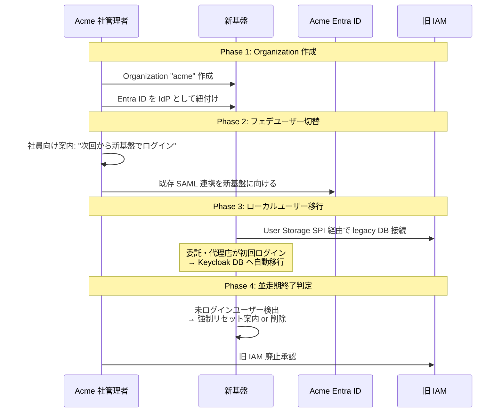

#### §FR-1.2.0.E.6 推奨デフォルトアプローチ

| 項目 | 推奨 |
|---|---|
| 移行アプローチ | **B. 並走（Parallel Run）** — アプリ単位で順次切替 |
| ローカル PW ハッシュ | **② User Storage SPI（キャッシュ移行）** — 初回ログイン後自動移行 |
| サインアップ機能 | **β. 共通基盤集約**（顧客がセルフサービス維持希望時）+ Custom Approval Authenticator |
| 並走期間 | **3〜6 ヶ月**（休眠ユーザーは半年で 90% カバー）|
| 切替単位 | **アプリ単位**（リスク低分散）|
| 識別子マッピング | 旧 user_id を Layer B `external_id` として保持、JWT に `legacy_user_id` クレーム発行 |
| 混在顧客 | Keycloak Organizations + Organization メンバー（IdP 紐付け有 / 無）で統合 |
| ロールバック単位 | アプリ単位（DNS / config 切替で 1 時間以内）|

#### §FR-1.2.0.E.7 我々のスタンス

| 基本方針の柱 | 移行戦略での実現 |
|---|---|
| **絶対安全** | 強制 PW リセットを避け、PW ハッシュをキャッシュ移行 SPI 経由で秘匿性維持 / NIST 準拠で再ハッシュ |
| **どんなアプリでも** | アプリ単位の切替・ロールバック、レガシー独自 algo にも対応 |
| **効率よく認証** | 並走期も SSO 体験を維持、ユーザーへの強制再操作を最小化 |
| **運用負荷・コスト最小** | 並走期 3〜6 ヶ月で短期完了、Custom SPI は移行期のみ運用 |

#### §FR-1.2.0.E.8 TBD / 要確認（B-MIG 系ヒアリング項目）

| 項目 ID | 確認内容 | 回答例 |
|---|---|---|
| **B-MIG-1** | 現行ローカル PW ハッシュアルゴリズム | bcrypt / Argon2 / PBKDF2 / 独自 / 不明 |
| **B-MIG-2** | 現行サインアップ機能の所在と承認フロー | 各アプリ / 共通 UI あり / 管理者作成のみ / 顧客承認フロー有無 |
| **B-MIG-3** | 移行アプローチ希望 | A Big Bang / **B 並走（推奨）** / C 永続共存 |
| **B-MIG-4** | 移行期間の希望 | 3 ヶ月 / 6 ヶ月 / 1 年 / 制約なし |
| **B-MIG-5** | 顧客側混在状況 | 全員フェデ / 全員ローカル / **混在あり**（社員フェデ + 委託ローカル等）|
| **B-MIG-6** | アプリ切替単位 | **アプリ単位（推奨）** / 顧客単位 / 利用者カテゴリ単位 |
| **B-MIG-7** | 並走期の旧システム維持責任 | 弊社 / 顧客 / 共同（運用窓口を明確化）|
| **B-MIG-8** | ロールバック容易性要件 | アプリ単位 1 時間以内 / 顧客単位 1 営業日以内 / 全体 1 週間 |
| **B-MIG-9** | 既存ユーザー数規模 | 全体合計 / 顧客あたり最大 / 想定ピーク同時ログイン |
| **B-MIG-10** | 強制 PW リセット許容範囲 | なし（① / ②）/ 一部のみ / 全員許容 |
| **B-MIG-11** | サインアップ UI 引継ぎ希望 | α アプリ側 / **β 共通基盤集約（推奨）** / γ 管理者作成のみ |
| **B-MIG-12** | 旧 user_id の保持期間 | 永続（external_id）/ 移行期のみ（並走期終了で破棄）|

#### 参考資料（§FR-1.2.0.E 全体）

- **業界移行戦略ガイドライン**:
  - [Ubisecure: How to migrate your IAM system](https://www.ubisecure.com/identity-platform/how-to-migrate-iam-system/) — Big Bang vs Parallel
  - [Inteca: IAM Migration Strategy 2026](https://inteca.com/business-insights/iam-migration/) — 並走 + アプリ単位切替が業界主流
  - [Strata.io: App Identity Modernization 2025](https://www.strata.io/resources/whitepapers/identity-modernization-app-migration-checklist/)
  - [IdentityPlane: Practical IAM Migration Strategies for High-Scale](https://www.identityplane.com/post/iam-migration-strategies-for-high-scale-user-bases)
- **Keycloak 移行実装**:
  - [Keycloak User Migration Plugin (codesoapbox.dev)](https://codesoapbox.dev/keycloak-user-migration/) — User Storage SPI でキャッシュ移行
  - [Keycloak Password Hashprovider Extension](https://github.com/inventage/keycloak-password-hashprovider-extension) — bcrypt / Argon2 旧版サポート
  - [Keymate: Massive Identity Migration to Keycloak (12M records/hr)](https://keymate.io/blog/tuning_keycloak_migration) — 大量移行性能実証
  - [DEV: Import bcrypt hashed user passwords into Keycloak](https://dev.to/carnewal/import-existing-users-with-bcrypt-hashed-passwords-in-keycloak-17oo)
- **B2B サインアップ + 混在モデル**:
  - [Microsoft Entra External ID Self-service sign-up + Approval](https://learn.microsoft.com/en-us/entra/external-id/self-service-sign-up-user-flow)
  - [Auth0 B2B SaaS Starter](https://github.com/auth0-developer-hub/auth0-b2b-saas-starter)
  - [Azure Architecture Center: Identity in Multitenant Solution](https://learn.microsoft.com/en-us/azure/architecture/guide/multitenant/considerations/identity) — 「Federation for employees + local for contractors」標準パターン

---

## §FR-1.2 パスワード・ローカルユーザー管理（→ FR-AUTH §1.2）

> **このサブセクションで定めること**: 本基盤の**ローカルユーザー**（フェデユーザーではなくパスワードで認証するユーザー）に対するパスワード管理ポリシー（長さ・複雑性・履歴・ローテーション・侵害検出等）。   
> **前提**: 認証主体は [§FR-1.2.0](#220-ローカルユーザー認証の主体--11-アーキテクチャと連動) で **A 案（共通基盤集約）採用**を前提とする。   
> **主な判断軸**: 適用される規制（PCI DSS / FFIEC / 業界独自）、NIST SP 800-63B Rev 4 準拠の意思、侵害クレデンシャル検出の要否   
> **§FR-1 全体との関係**: §FR-1.1 はフェデユーザー含む全認証フロー、§FR-1.2 はローカルユーザー固有のポリシー。フェデユーザーは [§FR-2 フェデレーション](02-federation.md) で扱う

「**どんな顧客パスワード要件にも対応可能**」という capability を示す。具体ポリシー値は §B 確認後に確定。

### 業界の現在地（2026 年時点の調査結果）

**NIST SP 800-63B Rev 4（2024 公開）が新ゴールドスタンダード**:

| 旧来の常識（〜2017） | NIST Rev 4 の指示 |
|---|---|
| 複雑性要件（大小・数字・記号）必須 | **"shall not" — 課してはならない** |
| 90 日ローテーション | **侵害証拠ない限り禁止** |
| 8 文字最低 | 8 文字（15 文字推奨、64 文字までサポート） |
| ペースト禁止 | **ペースト許可必須** |
| ブラックリストは任意 | **侵害クレデンシャル検出必須化** |

主要規制との関係:
- **PCI DSS v4.0** → NIST 準拠を許容（Compensating Control 不要）
- **ISO 27001 / SOC 2** → NIST 系業界標準に追随
- **個人情報保護法 / GDPR** → 具体パスワード要件指定なし、適切な技術的措置と表現
- **FFIEC（金融）** → 多要素重視、パスワード単独は不可

### 我々のスタンス（基本方針に基づく）

| 基本方針の柱 | パスワード領域での実現 |
|---|---|
| **絶対安全** | NIST SP 800-63B Rev 4 準拠をデフォルト推奨。侵害クレデンシャル検出を Must とする選択肢を提示 |
| **どんなアプリでも** | 下記マトリクスの通り、Cognito 3 ティア × Keycloak OSS × Keycloak RHBK の組み合わせで業界全要件をカバー |
| **効率よく** | AWS マルチアカウント前提で、顧客 / 用途ごとに最適なプラットフォーム・ティアを選択可能 |
| **運用負荷・コスト最小** | Cognito Lite で十分なら Lite（最安・運用ゼロ）。要件次第で Plus / Keycloak / RHBK へ段階的にせり上げる |

### 対応能力マトリクス（裏どり）

「どんな要件にも対応可能」を裏付ける全体像:

| 要件タイプ | Cognito Lite | Cognito Essentials | Cognito Plus | Keycloak OSS | Keycloak RHBK |
|---|:---:|:---:|:---:|:---:|:---:|
| 最小長 | ✅ (6-99) | ✅ | ✅ | ✅ | ✅ |
| 最大長 | ✅ (256 内部上限) | ✅ | ✅ | ✅ 明示設定可 | ✅ |
| 文字種（複雑性） | ✅ | ✅ | ✅ | ✅ | ✅ |
| ユーザー名/メール禁止 | ⚠ Pre Sign-up Lambda で実装可（※1）| ⚠ 同左 | ⚠ 同左 | ✅ `notUsername()` / `notEmail()` ポリシー標準 | ✅ 同左 |
| カスタム正規表現 | ⚠ Pre Sign-up Lambda で実装可（※1）| ⚠ 同左 | ⚠ 同左 | ✅ `regexPattern()` ポリシー標準 | ✅ 同左 |
| 履歴（N 個再利用禁止） | ❌ | ✅ (1-24) | ✅ | ✅ | ✅ |
| 定期ローテーション | ✅ | ✅ | ✅ | ✅ | ✅ |
| **侵害クレデンシャル検出** | ❌ | ❌ | ✅ **ネイティブ** | ⚠ HIBP プラグイン | ⚠ HIBP プラグイン（**Red Hat サポート対象外**）|
| ブラックリスト | ❌ | ❌ | △ 侵害検出に内包 | ✅ | ✅ |
| ハッシュアルゴリズム選択 | 透過 | 透過 | 透過 | ✅ (PBKDF2-SHA1/256/512) | ✅ |
| グループ別ポリシー | ❌ | ❌ | ❌ | ⚠ プラグイン要 | ⚠ プラグイン要 |
| **商用サポート（24/7）** | ✅ AWS Support | ✅ AWS Support | ✅ AWS Support | ❌ ベストエフォート（コミュニティ）| ✅ **Red Hat 24/7** |
| **SaaS / マネージド** | ✅ フルマネージド | ✅ フルマネージド | ✅ フルマネージド | ❌ 自己ホスト | ❌ 自己ホスト + 商用サポート |
| 価格モデル | 従量課金 / 安価 | 中 | +$0.02/MAU | OSS 無料 + AWS インフラ | $5,000〜30,000/年/ノード + AWS |

**※1**: Cognito にはネイティブなパスワード内容検証ポリシー（ユーザー名/メール禁止・カスタム正規表現）の**設定オプションは存在しない**が、**Pre Sign-up Lambda Trigger** で同等の実装が可能（AWS 公式 News Blog で "Safely Validating Usernames with Amazon Cognito" として紹介、`event.userAttributes.email` / `event.userName` を取得して新パスワードに含まれていれば拒否する Lambda を書く）。Keycloak のような宣言的設定との差はあるが、要件として実現できないわけではない。

→ Cognito Plus、Keycloak OSS+HIBP、Keycloak RHBK のいずれかで **NIST SP 800-63B Rev 4 完全準拠**が可能。Pre Sign-up Lambda を使えば Cognito 全ティアでも「ユーザー名/メール禁止・カスタム正規表現」要件に対応できる。

### ベースライン（推奨デフォルト + 設定範囲）

我々が現時点で推奨するデフォルト値（NIST Rev 4 ベース）:

| ポリシー | 推奨デフォルト | 設定可能範囲 | NIST Rev 4 整合 |
|---|---|---|:---:|
| 最小長 | **12 文字** | 8〜64+ | ✅ |
| 文字種要件 | **なし**（NIST 非推奨） | 任意組み合わせも可 | ✅ |
| 履歴 | 過去 5 個と一致禁止 | 0〜24 | — |
| 定期ローテーション | **なし**（侵害証拠時のみ強制変更） | 任意 | ✅ |
| 侵害クレデンシャル検出 | **有効**（Cognito Plus or Keycloak+HIBP） | ON/OFF | ✅ |
| アカウントロック | 5 回失敗で 30 分 | 任意 | — |
| セルフサービスリセット | 有効 | ON/OFF | — |
| 初期パスワード強制変更 | 有効 | ON/OFF | — |

→ 顧客が「PCI DSS 準拠で 12 文字 + 文字種要件 + 90 日ローテーション」を要求しても、「ISO 27001 ベースで複雑性不要」を要求しても、「金融系で侵害検出 Must」と要求しても、**いずれも対応可能**。

### TBD / 要確認

**A. 御社のパスワード要件**

| 確認項目 | 回答形式 |
|---|---|
| 適用される業界規制 | PCI DSS / FFIEC / 業界独自 / 規制なし |
| 既存パスワードポリシー | 文字長・複雑性・履歴・ローテーション |
| NIST SP 800-63B Rev 4 準拠を目指すか | はい / いいえ / 部分採用 |
| 侵害クレデンシャル検出（HIBP 等）の要否 | はい / いいえ |

**B. 既存システムからの移行**

| 確認項目 | 回答形式 |
|---|---|
| 既存ユーザーのパスワードハッシュ | 形式（bcrypt / PBKDF2 / 独自）+ 件数 |
| ハッシュ持ち越しの希望 | 持ち越す / 全員再設定で OK |

**C. サポート・運用形態の希望**（プラットフォーム選定に直結）

| 希望 | 推奨プラットフォーム |
|---|---|
| フルマネージド（SaaS 同等、サーバー管理不要） | **Cognito**（Lite / Essentials / Plus）|
| 自己ホストだが 24/7 商用サポート必須 | **Keycloak RHBK**（Red Hat サポート + $5K〜30K/年/ノード）|
| 自己ホスト + 自前運用 OK（OSS で十分） | **Keycloak OSS**（最小コスト、コミュニティサポート）|

**D. プラットフォーム選定への影響まとめ**

- 侵害検出ネイティブ Must + マネージド希望 → **Cognito Plus**（+$0.02/MAU）
- カスタム正規表現 / Not Username / 高度ブラックリストを**宣言的設定で運用したい** → **Keycloak（OSS or RHBK）**
- カスタム正規表現 / Not Username が要件にあるが、**Lambda 実装許容** → **Cognito 全ティア**でも対応可（※1）
- 24/7 商用サポート必須 → **Cognito 全ティア**、または **Keycloak RHBK**
- 上記なし、最安希望 → **Cognito Lite**

### 参考資料（業界動向の裏どり）

- [NIST SP 800-63B Rev 4 公式](https://pages.nist.gov/800-63-4/sp800-63b.html)
- [NIST 800-63B Rev 4 解説 - Enzoic](https://www.enzoic.com/blog/nist-sp-800-63b-rev4/)
- [Cognito Essentials/Plus 発表 - AWS What's New](https://aws.amazon.com/about-aws/whats-new/2024/11/new-feature-tiers-essentials-plus-amazon-cognito/)
- [Cognito Compromised Credentials Detection 公式](https://docs.aws.amazon.com/cognito/latest/developerguide/cognito-user-pool-settings-compromised-credentials.html)
- [Keycloak Password Policies 公式](https://www.keycloak.org/docs/latest/server_admin/index.html)
- [Keycloak HIBP プラグイン (community)](https://github.com/alexashley/keycloak-password-policy-have-i-been-pwned)
- [Red Hat build of Keycloak 公式](https://docs.redhat.com/en/documentation/red_hat_build_of_keycloak)
