# §FR-2 フェデレーション / 外部 IdP 連携

> 上位 SSOT: [00-index.md](00-index.md)   
> 詳細: [../../functional-requirements.md §2 FR-FED](../../functional-requirements.md)、[../../../common/identity-broker-multi-idp.md](../../../common/identity-broker-multi-idp.md)   
> カバー範囲: FR-FED §2.1 IdP 接続種別 / §2.2 ユーザー処理（§2.2.1 JIT / §2.2.2 属性マッピング / §2.2.3 MFA 重複回避）/ §2.3 マルチテナント運用

---

## §FR-2.0 前提と背景

### 用語整理

| 用語 | 本基盤での意味 |
|---|---|
| **フェデレーション** | 自社外の IdP（顧客企業の IdP 等）に認証を委譲し、認証結果を受け取る仕組み |
| **外部 IdP** | Microsoft Entra ID / Okta / Google Workspace / HENNGE One / 自社 AD 等、顧客が既に使用している認証基盤 |
| **OIDC / SAML / LDAP** | 外部 IdP を接続するための標準プロトコル（前 2 つは主流、LDAP はレガシー領域で根強い） |
| **JIT プロビジョニング** | 初回ログイン時に外部 IdP の情報をもとに本基盤側にユーザーを自動登録 |
| **属性マッピング** | IdP ごとに異なる属性名（tid / group 等）を本基盤の標準クレームに正規化 |
| **マルチテナント** | 複数の顧客企業のユーザーを単一基盤で受け入れ、テナント境界で分離 |

### なぜここ（§FR-2）で決めるか

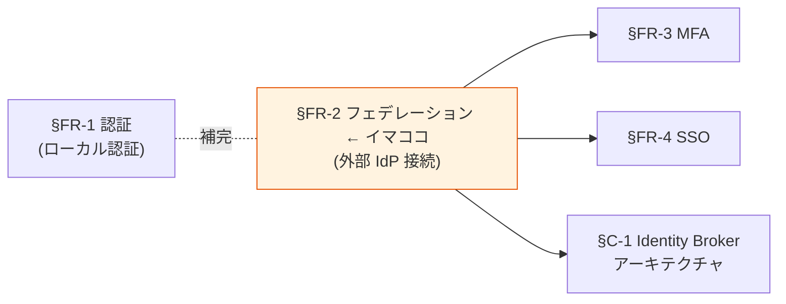

§FR-2 は **「どんな顧客 IdP でも受け入れられる基盤か」** を決める章。本基盤の **Identity Broker パターン**（[§C-1](../common/01-architecture.md)）の中核要件であり、ここの要件が確定すると Broker パターン採用は構造的に必然になる。
- **§FR-2.1 接続種別**: プロトコル / IdP 製品の対応範囲
- **§FR-2.2 ユーザー処理**: 受け入れたユーザーの内部表現（JIT / 属性マッピング / MFA 重複回避）
- **§FR-2.3 マルチテナント運用**: 複数 IdP の並行運用、顧客追加のオンボーディング

### §FR-2.0.A 本基盤のフェデレーションスタンス

> **OIDC / SAML 2.0 / LDAP の業界標準で接続可能な IdP は全て受け入れる。「どんな顧客 IdP でも繋ぎ込める」を capability として担保し、SAML IdP モード / LDAP 直結が必要な場合は Keycloak、それ以外は Cognito でも対応可能とする。マルチテナントは「単一 Pool/Realm + 複数 IdP」を採用し、顧客追加で各システム変更不要を実現する。**

### 共通認証基盤として「フェデレーション」を検討する意義

| 観点 | 個別アプリで実装した場合 | 共通認証基盤で実装した場合 |
|---|---|---|
| 顧客 IdP 接続 | 各アプリで個別連携（N アプリ × M IdP の組合せ爆発） | **基盤で 1 度設定 → 全アプリに波及** |
| 属性正規化 | アプリごとに別ロジック | **基盤側で OCSF/標準クレームに統一** |
| 顧客追加リードタイム | 全アプリ改修必要 | **基盤の IdP 設定追加のみ（< 1 営業日）** |
| プロトコル準拠 | アプリ実装ばらつき | **基盤側で OIDC/SAML 標準準拠** |
| MFA 重複回避 | アプリで判定不可 | **基盤側で `amr` クレーム検査** |

→ フェデレーションを共通基盤に集約することが、**Broker パターン採用の本質的価値**。顧客追加のフリクションレス化と統一クレーム形式が同時に実現する。

### §FR-2.0.B プロトコル組み合わせの全体像（受信側 × 発行側は独立）

> **混同しやすいポイント**: 「OIDC で認証 + OAuth でトークン発行」という表現は、実は **OIDC = OAuth 2.0 + ID Token** で同一系統。プロトコルは「**受信側（顧客 IdP → 本基盤）**」と「**発行側（本基盤 → アプリ）**」の **2 つの独立した軸**で考える。

#### 本基盤 = アイデンティティ仲介 Hub（Identity Broker）

> **注**: Identity Broker は「プロトコル変換」だけでなく、以下 5 つの機能を統合的に担う仲介装置:
> 1. **プロトコル変換**（SAML → OIDC 等）
> 2. **属性正規化**（IdP ごとに違う `tid` / `org_id` 等を統一 `tenant_id` に）
> 3. **Trust 集約**（各アプリは Broker 1 つだけを信頼）
> 4. **統一 JWT 発行**（受信側が何であれ同じフォーマット）
> 5. **オーケストレーション**（JIT / MFA 重複回避 / SSO セッション / ログアウト伝播）

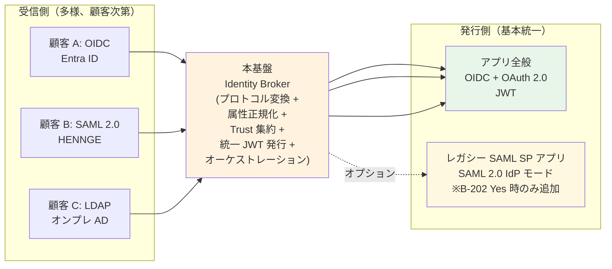

→ **受信側は顧客次第で多様、発行側は基本的に OIDC + OAuth で統一**。これにより**各アプリは「JWT 検証だけ」で完結**できる（Broker パターンの本質）。
→ **「プロトコル変換装置」は機能の 1 つを切り出した表現**。全体像は上記 5 機能を含む **アイデンティティ仲介 Hub**。

#### 組み合わせマトリクス

| 受信側プロトコル | 発行側プロトコル | 構成名 | 典型ケース | 本基盤の対応 |
|---|---|---|---|:---:|
| **OIDC** | **OIDC + OAuth 2.0** | 標準（現代的、推奨）| 新規構築、ほとんどの B2B SaaS | ✅ |
| **SAML 2.0 SP** | **OIDC + OAuth 2.0** | **SAML→JWT フェデブリッジ** | 顧客 IdP が HENNGE / ADFS、アプリは現代的 | ✅ |
| **LDAP** | **OIDC + OAuth 2.0** | AD→JWT 変換 | 顧客が AD 直結、アプリは JWT | ✅ Keycloak のみ |
| OIDC | **SAML 2.0 IdP** | レガシー SAML SP 連携 | 顧客 IdP は OIDC、既存アプリが SAML SP-only | ✅ Keycloak のみ |
| SAML 2.0 SP | **SAML 2.0 IdP** | フル SAML（古典 SSO）| 全体 SAML、稀 | ✅ Keycloak のみ |
| LDAP | **SAML 2.0 IdP** | AD→SAML 出力 | 稀、規制業界の特殊系 | ✅ Keycloak のみ |

#### OIDC と OAuth 2.0 の関係（よくある誤解）

| 用語 | 関係 |
|---|---|
| **OAuth 2.0** | **認可フレームワーク**（Token 発行プロトコル、RFC 6749）|
| **OIDC**（OpenID Connect 1.0）| **OAuth 2.0 + ID Token**（認証層を追加）|

→ 「**OIDC で認証 + OAuth で発行**」は技術的に同じ系統（OIDC が OAuth を内包）。**SAML だけが完全に別系統**。
→ **発行側は基本 OIDC + OAuth で統一**、**SAML IdP モードはオプション**（[B-202](../../hearing-script/02-idp-federation.md) Yes 時のみ追加）。
→ 受信側 / 発行側で **意味 A の認可（Token 発行制御）**は本基盤の責務。**意味 B の認可（業務判定）**はアプリ側（[§FR-6.0.A](06-authz.md)）。

### §FR-2.0.C 本基盤対応プロトコル一覧（早見表、12 プロトコル × 4 Tier）

> **「結局どんなプロトコルに対応する基盤か?」への 1 枚回答**。Tier 1 〜 4 で分類した全プロトコルと、各プラットフォームの対応状況を集約。顧客説明・新規参入者キャッチアップに利用可能。

#### Tier 1: 認証フェデレーション系（IdP 連携の中核 / 受信側）

| プロトコル | 種類 | 方向 | 用途 | Cognito | Keycloak | 関連 |
|---|---|---|---|:---:|:---:|---|
| **OIDC 1.0** | 認証 + ID | **受信** (顧客 IdP) | フェデログイン受け入れ | ✅ | ✅ | §FR-2.1 |
| **OIDC 1.0** | 認証 + ID | **発行** (アプリ向け) | 各アプリへ JWT 発行 | ✅ | ✅ | §FR-2.0.B |
| **SAML 2.0 SP** | 認証 | **受信** (顧客 IdP) | SAML 顧客 IdP（HENNGE 等）からの受信 | ✅ | ✅ | §FR-2.1 |
| **SAML 2.0 IdP** | 認証 | **発行** (アプリ向け) | 既存 SAML SP アプリへの発行 | ❌ **K-11** | ✅ | B-202 |
| **OAuth 2.0 Broker** ★NEW | 認可フロー | **受信** (OIDC 非対応 OAuth 2.0 IdP) | 純粋 OAuth 2.0 IdP からの受信（Keycloak 26.x で追加）| ❌ | ✅ | §FR-2.1 |
| **Social Login**（Google / Microsoft / Apple 等）★NEW | OIDC ベース | **受信** | （※本基盤は B2B 専用のため Phase 1 では非採用、ゲスト用途等で要件発生時に追加検討）| ✅ | ✅ | §FR-1.2 |
| **LDAP / LDAPS** | ディレクトリ認証 | **受信** (顧客 AD) | 顧客 AD への直接バインド | ❌ **K-12** | ✅ | §FR-2.1 |
| **Kerberos / SPNEGO** | チケット認証 | **受信** (顧客 AD) | Windows 統合認証（社内 PC SSO）| ❌ **K-13** | ✅ | §FR-2.1 |
| **WS-Federation** ★NEW | レガシー認証 | **受信** (古い ADFS) | 古い ADFS 環境（Microsoft も Entra ID 移行推奨）| ❌ | ⚠ extension | §FR-2.0.D |

#### Tier 2: OAuth 2.0/2.1 系（認可フロー / 発行側）

| プロトコル | 種類 | 方向 | 用途 | Cognito | Keycloak | 関連 |
|---|---|---|---|:---:|:---:|---|
| **Authorization Code + PKCE** | Grant Type | **発行** (SPA/SSR/Mobile) | ブラウザ経由ログイン | ✅ | ✅ | §FR-1.1 |
| **Client Credentials** | Grant Type | **発行** (M2M) | バッチ / マイクロサービス間 | ✅ | ✅ | §FR-1.1 |
| **Device Code (RFC 8628)** | Grant Type | **発行** (CLI/IoT) | CLI / IoT / Smart TV / AI Agent | ❌ **K-02** | ✅ | §FR-1.1 |
| **Token Exchange (RFC 8693)** | Grant Type | **発行** (OBO) | マイクロサービス間ユーザー文脈伝播 | ❌ **K-01** | ✅ | §FR-6.0.B |
| **mTLS Client Auth (RFC 8705)** | クライアント認証 | **受信** (M2M) | FAPI 準拠 / 高セキュリティ M2M | ❌ **K-03** | ✅ | §FR-1.1 |
| **DPoP (RFC 9449)** | トークン拘束 | **発行** (Sender-Constrained) | mTLS 代替 / Sender-Constrained Tokens | ❌ | ✅ | §FR-1.1 |

#### Tier 3: MFA 認証要素プロトコル

| プロトコル | 種類 | 方向 | 用途 | Cognito | Keycloak | 関連 |
|---|---|---|---|:---:|:---:|---|
| **WebAuthn / FIDO2 (Passkey)** | 認証要素 (Phishing-resistant) | 内部 | パスキー、ハードウェアキー | ✅ Essentials+ | ✅ | §FR-3.1 |
| **TOTP (RFC 6238)** | 認証要素 | 内部 | Google Authenticator 等 | ✅ | ✅ | §FR-3.1 |
| **SMS OTP** | 認証要素 (NIST 非推奨) | 内部 | レガシー互換 | ✅ | ✅ | §FR-3.1 |
| **Email OTP** | 認証要素 (NIST 非推奨) | 内部 | 本人確認補助 | ✅ Essentials+ | ✅ | §FR-3.1 |

#### Tier 4: 関連プロトコル（認証ではないが連携で必要）

| プロトコル | 種類 | 方向 | 用途 | Cognito | Keycloak | 関連 |
|---|---|---|---|:---:|:---:|---|
| **SCIM 2.0 (RFC 7644)** | プロビジョニング | **受信** (HR/IdP) | ユーザー同期、退職者 deprovisioning | ❌ ネイティブ（Lambda 自前）| ⚠ プラグイン | §FR-7.4 |
| **JWKS (RFC 7517)** | 鍵配布 | **発行** (アプリ向け) | 公開鍵の自動配布 | ✅ | ✅ | §FR-9.1 |
| **OIDC Discovery** | メタデータ配布 | **発行** (アプリ向け) | `.well-known/openid-configuration` | ✅ | ✅ | §FR-9.1 |
| **OIDC RP-Initiated Logout** | ログアウト | **発行** | ブラウザ経由ログアウト | ⚠ 独自実装 | ✅ | §FR-5.1 |
| **OIDC Back-Channel Logout 1.0** | ログアウト | **発行** | サーバー間直接ログアウト通知 | ❌ **K-07** | ✅ | §FR-5.1 |
| **Token Revocation (RFC 7009)** | トークン無効化 | **受信** | Access/Refresh Token 強制無効化 | ⚠ Refresh のみ | ✅ | §FR-5.3 |

#### Tier 別の必要度

| Tier | 必須度 | 採否判断 |
|---|---|---|
| **必須対応**（① OIDC 受信・発行 / OAuth Code+PKCE / Client Credentials / JWKS / Discovery）| 全顧客で使う | **Cognito / Keycloak どちらも対応** |
| **Should**（② SAML SP / Social Login / WebAuthn / TOTP / SCIM 受信）| 多くの顧客で必要（B2C 対応含む）| **Cognito / Keycloak どちらも対応** |
| **Conditional Must**（③ SAML IdP / LDAP / Device Code / Token Exchange / mTLS / DPoP / Back-Channel Logout / Kerberos / Access Token Revocation / OAuth 2.0 Broker）| 顧客要件次第で必須化 | **1 つでも該当すれば Keycloak 必須化** |
| **Could (extension)**（WS-Federation）| 古い ADFS 環境のみ、推奨は SAML/OIDC 移行 | extension 採用 or 顧客に IdP 変更依頼 |
| **オプション・非推奨**（④ SMS OTP / Email OTP）| レガシー互換のみ | NIST 非推奨、新規実装では Passkey 推奨 |

#### プラットフォーム別カバー率

| プラットフォーム | 必須対応 (①) | Should (②) | Conditional Must (③) | 合計 |
|---|:---:|:---:|:---:|---|
| **Cognito Lite** | ✅ | ⚠ Passkey 不可 | ❌ ほぼ全部不可 | 基本機能のみ |
| **Cognito Essentials** | ✅ | ✅ Passkey 可 | ❌ ③は不可 | 基本 + Passkey |
| **Cognito Plus** | ✅ | ✅ + 侵害検出 | ❌ ③は不可 | 基本 + 高度な MFA |
| **Keycloak OSS / RHBK** | ✅ | ✅ | ✅ **すべて対応** | **フルカバー** |

→ **「結局どれに対応するか」= 上記 22 プロトコル**（重複含む方向別カウント）。そのうち **必須・Should は両プラットフォーム共通**、**Conditional Must の領域は顧客要件次第で Keycloak 必須化** という構造。

→ Cognito 不可マーク（**K-XX**）の詳細は [reference/cognito-knockout-conditions.md](../../../reference/cognito-knockout-conditions.md) を参照。

### §FR-2.0.D 不採用プロトコルと判断根拠（ヒアリングで挙がっても採用しない）

> **本サブセクションで定めること**: §FR-2.0.C で採用対象外とした **業界既知だが本基盤で採用しないプロトコル** と、その判断根拠を明示。顧客ヒアリングで挙がった場合の即答資料 + 設計判断の整合性を確保。
> **主な判断軸**: 業界利用実態 / 後継プロトコル存在 / セキュリティ / Keycloak 対応状況
> **§FR-2.0 全体との関係**: §FR-2.0.C「採用するプロトコル」の対をなすセクション

#### 不採用プロトコル 6 種と判断根拠

| プロトコル | 状況 | 不採用理由 | 代替手段 |
|---|---|---|---|
| **WS-Trust** | Microsoft 系レガシー、Active Federation（API ベース）| ❌ ほぼ使われていない、業界トレンド = OIDC/SAML 移行 | SAML / OIDC へ移行依頼 |
| **OpenID 1.0 / 2.0** | OIDC の前身、廃止済 | ❌ **2014 年に OIDC が後継として標準化、既に廃止** | OIDC 採用 |
| **CAS** (Central Authentication Service) | 学術系 SSO プロトコル | ❌ 学術用途のみ、B2B SaaS では極めて稀 | SAML（Shibboleth）で代替 |
| **PKI / X.509 クライアント証明書** | 政府 / 金融 / 軍事の高セキュリティ用途 | ⚠ **別軸の認証**（フェデレーション ではない）、本基盤では mTLS（§FR-1.1）でカバー | mTLS Client Auth (RFC 8705) |
| **Smart Card** | 政府 / 軍事 | ⚠ **別軸の認証**、ユーザー直接認証手段 | 該当顧客なら mTLS + PKI |
| **HTTP Basic Auth / Digest Auth** | レガシー Web 認証 | ❌ **平文 / 弱ハッシュ、TLS 必須**、フェデレーションには不向き | OIDC / SAML へ移行 |

#### 顧客ヒアリングで挙がった場合の対応指針

| 顧客の発言 | 推奨回答 |
|---|---|
| 「**WS-Trust を使いたい**」 | 「WS-Trust はほぼ使われていないため対応していません。SAML / OIDC への移行をご検討ください」 |
| 「**OpenID 2.0 のままです**」 | 「OpenID 2.0 は廃止されており、OIDC への移行が業界標準です。Entra / Google Workspace への移行で対応可能」 |
| 「**CAS を使っています**」 | 「CAS は学術系の SSO プロトコルです。多くの IdP（Shibboleth / Keycloak 等）が SAML 2.0 も同時提供しているため、SAML 経由での接続をご提案します」 |
| 「**PKI / Smart Card で認証したい**」 | 「PKI / Smart Card は本基盤のフェデレーション層ではなく、**ユーザー直接認証層**で対応します（mTLS Client Auth, FR-1.1）」 |
| 「**WS-Federation のみの古い ADFS です**」 | 「ADFS 2019+ なら OIDC / SAML 対応可能ですので、ADFS のバージョンアップをご検討ください。やむを得ない場合は WS-Federation extension で対応可能（Keycloak 26.x）」 |

#### 採用プロトコルへの誘導戦略

| 現状の顧客 IdP | 推奨移行先 | 移行のメリット |
|---|---|---|
| WS-Federation（古い ADFS）| ADFS 2019+ で OIDC/SAML、または Entra ID 移行 | ✅ Microsoft 自身が推奨 / 新機能利用 |
| OpenID 2.0 | OIDC 採用 IdP（Auth0 / Okta / Google Workspace）| ✅ 業界標準 / 機能豊富 |
| CAS | Shibboleth SAML 2.0 | ✅ 学術界主流、本基盤対応 |
| HTTP Basic Auth | OIDC / SAML / SAML Sign-In | ✅ セキュリティ大幅向上 |

→ **本基盤の方針**: 「**OIDC + SAML 2.0 + Social Login + LDAP + Kerberos の組合せで業界 95%+ をカバー**」、不採用プロトコル要望には**代替手段を提案して顧客 IdP の近代化を支援**。

### 本章で扱うサブセクション

| サブセクション | 内容 | 関連 FR |
|---|---|---|
| §FR-2.1 IdP 接続種別 | 受け入れ可能なプロトコル / 主要 IdP 製品の接続実績 | FR-FED-001〜007 |
| §FR-2.2 ユーザー処理 | JIT プロビジョニング / 属性マッピング / MFA 重複回避 | FR-FED-008, 009, 012 |
| §FR-2.3 マルチテナント運用 | 複数 IdP 並行運用 / 顧客追加オンボーディング / Home Realm Discovery | FR-FED-010, 011, 013 |

---

## §FR-2.1 IdP 接続種別（→ FR-FED §2.1）

> **このサブセクションで定めること**: 本基盤が外部 IdP として**受け入れ可能なプロトコル**（OIDC / SAML 2.0 / LDAP）と、想定する**主要 IdP 製品**（Entra ID / Okta / HENNGE One 等）の接続実績。   
> **主な判断軸**: 御社・御社顧客の IdP 構成、SAML IdP 発行モード / LDAP 直接連携の要否（Keycloak 必須化に直結）   
> **§FR-2 全体との関係**: §FR-2.1 = 接続「できる範囲」、§FR-2.2 = 受け入れたユーザーの「処理」、§FR-2.3 = 「並行運用」

「**どんな顧客 IdP でも接続可能**」という capability を示す。具体接続先は §B 確認後に確定。

### 業界の現在地（2026 年時点の調査結果）

**グローバル**:
- **Microsoft Entra ID + Okta が 2 強**（合計でエンタープライズ需要の約 80% カバー）
- **Google Workspace** が残りの多くをカバー
- Ping / IBM / Oracle / Thales / Auth0 が次集団

**日本特有**:
- **HENNGE One** — 国内 IDaaS シェア No.1
- **GMO Trust Login** — 累計 1 万社以上の導入実績
- **Cloud Gate UNO、Extic** — 国産 IDaaS
- 共通点：いずれも **SAML 2.0 を主軸**（OIDC も対応進行中）

**プロトコル動向**:
- OIDC が新規システムの主流。SAML は依然エンタープライズ・SaaS で広く使用
- LDAP / Active Directory 直接連携はレガシー領域で根強い需要

### 我々のスタンス（基本方針に基づく）

| 基本方針の柱 | IdP 接続での実現 |
|---|---|
| **絶対安全** | 業界標準（OIDC 1.0 / SAML 2.0）準拠の IdP のみを受け入れる。独自プロトコルは受け入れない |
| **どんなアプリでも** | **OIDC または SAML が話せる IdP なら何でも接続可能**。Cognito / Keycloak 両方でグローバル主要 + 日本主要 IdP をカバー |
| **効率よく認証** | Broker パターンで顧客追加でも各システム変更不要（[§1](../common/01-architecture.md)）|
| **運用負荷・コスト最小** | OIDC は Discovery 自動化、SAML は Metadata XML 投入で完結。両方 Terraform 管理可能 |

### 対応能力マトリクス（裏どり）

**A. 接続方法（プロトコル別の対応）**

「**どんなプロトコルを話す IdP まで受けられるか**」の境界線：

| プロトコル | Cognito | Keycloak (OSS / RHBK) | 備考 |
|---|:---:|:---:|---|
| **OIDC IdP**（標準準拠なら何でも）| ✅ 標準対応 | ✅ 標準対応 | RFC 6749 / OIDC 1.0 |
| **SAML 2.0 SP モード**（外部 IdP からのアサーション受け入れ）| ✅ 標準対応 | ✅ 標準対応 | エンタープライズ / 日本 IDaaS が主に SAML |
| **SAML 2.0 IdP モード**（共通基盤が SAML を発行）| ❌ 不可 | ✅ 標準対応 | 共通基盤が他システムに対して SAML 発行 |
| **LDAP / Active Directory 直接連携** | ❌ 不可 | ✅ User Federation（標準機能）| ADFS 経由なし、AD 直結 |
| 独自プロトコル IdP | ❌ | ❌ | OIDC/SAML へのラッパー設計を要請 |

**B. 接続先（主要 IdP の対応実績）**

「**実際に名指しされる IdP を接続できるか**」の確認：

| IdP | プロトコル | Cognito | Keycloak (OSS / RHBK) | 備考 |
|---|---|:---:|:---:|---|
| Microsoft Entra ID（旧 Azure AD）| OIDC / SAML | ✅ | ✅ | グローバル No.1 |
| Okta | OIDC / SAML | ✅ | ✅ | グローバル 2 番手 |
| Google Workspace | OIDC / SAML | ✅ | ✅ | テック企業に多い |
| Auth0 | OIDC | ✅（PoC 実証済）| ✅（PoC 実証済）| Entra ID 代替として PoC 検証 |
| HENNGE One | SAML | ✅ | ✅ | 国内 IDaaS シェア No.1 |
| GMO Trust Login | SAML | ✅ | ✅ | 国内中堅、1 万社実績 |
| Cloud Gate UNO / Extic | SAML / OIDC | ✅ | ✅ | 国産 IDaaS |
| 顧客独自 SAML / OIDC IdP | SAML / OIDC | ✅ | ✅ | プロトコル準拠なら可 |
| ソーシャル（Google / Facebook / Apple / Amazon 等）| OIDC | ✅ ネイティブ統合 | ✅ ネイティブ統合 | コンシューマ向け |

### ベースライン

**1. プロトコル対応範囲**

| プロトコル | 対応 | 採用プラットフォーム |
|---|:---:|---|
| **OIDC 1.0**（外部 IdP として受け入れ） | ✅ Must | Cognito / Keycloak 両方 |
| **SAML 2.0 SP モード**（外部 IdP として受け入れ）| ✅ Must | Cognito / Keycloak 両方 |
| **SAML 2.0 IdP モード**（共通基盤が SAML を発行）| 要件次第 | **Keycloak のみ**（Cognito 不可）|
| **LDAP / AD 直接連携** | 要件次第 | **Keycloak のみ**（Cognito 不可）|
| 独自プロトコル IdP | ❌ Won't | OIDC/SAML へのラッパー設計を要請 |

**2. 主要 IdP の接続実績**（我々が裏どり済み）

| IdP | 種別 | 接続実績 | 想定優先度 |
|---|---|:---:|:---:|
| Microsoft Entra ID（旧 Azure AD）| OIDC / SAML | PoC で Auth0 を Entra ID 代替検証 | **Must 候補** |
| Auth0 | OIDC | ✅ PoC Phase 2, 7 で実証 | 検証完了 |
| Okta | OIDC / SAML | 公式手順あり | Should 候補 |
| Google Workspace | OIDC / SAML | 公式手順あり | Could 候補 |
| HENNGE One | SAML | 国内 No.1、SAML 経由で接続可能 | 国内顧客向け Must 候補 |
| GMO Trust Login | SAML | 国内 SAML 対応 | 国内中堅向け |
| 顧客独自 SAML / OIDC IdP | SAML / OIDC | プロトコル準拠なら接続可能 | 要件次第 |

**3. Custom Domain**

| 項目 | ベースライン |
|---|---|
| 認証エンドポイント URL | `auth.example.com` 等の顧客指定ドメイン |
| Cognito 実現方法 | Hosted UI Custom Domain + ACM 証明書 |
| Keycloak 実現方法 | Hostname 設定 + ACM/ALB 証明書 |
| 必要性 | フィッシング耐性 + ブランディング + DR 時の URL 統一に重要 |

### 接続対象 IdP の 2 つの分類（[§FR-1.2.0.0](01-auth.md#fr-1200-ローカルユーザーとは何か--利用者カテゴリ別の分析) 利用者カテゴリと連動）

本基盤が受け入れる IdP は、**利用者カテゴリ** によって 2 つに分類される:

| 分類 | 接続元 IdP | 認証する利用者 | 採用判断 |
|---|---|---|---|
| **(i) 顧客 IdP** | 顧客企業の IdP（Entra ID / Okta / HENNGE 等） | P-2 テナント管理者 / P-3 現行で IdP があった従業員 | **本章の主対象** |
| **(ii) 弊社内 IdP** | 弊社運用組織の社内 IdP（Entra ID 等） | P-1 基盤運用管理者 | **[§FR-1.2.0.0](01-auth.md#fr-1200-ローカルユーザーとは何か--利用者カテゴリ別の分析) γ シナリオ採用時に Must** |

→ (ii) 弊社内 IdP の接続は、γ シナリオ（管理者層のみローカル）採用時に「P-1 を弊社内 IdP 経由で認証 + Break Glass を最小ローカル管理」とするための前提。**Cognito / Keycloak 両方とも (i) と同じ仕組み（OIDC IdP 接続）で実現可能** で、構成上は単に「もう 1 つの IdP オブジェクト」を追加するだけ。

### IdP を持たない顧客への対応方針（γ / β シナリオの判定根拠）

[§FR-1.2.0.0](01-auth.md#fr-1200-ローカルユーザーとは何か--利用者カテゴリ別の分析) で議論したローカルユーザー範囲シナリオは、**顧客に IdP がない場合の対応方針**として §FR-2 でも具体化が必要:

| 顧客側状況 | γ シナリオ採用時の本基盤対応 | β シナリオ採用時の本基盤対応 |
|---|---|---|
| **顧客が IdP を持つ**（Entra / Okta / HENNGE 等）| フェデ受け入れ（標準） | フェデ受け入れ（標準） |
| **顧客が IdP を持たない（大手企業）** | **顧客に IdP 導入を依頼**（Microsoft 365 / Google Workspace のテナントを起点に Entra/Workspace を IdP 化等の支援案を提示） | 顧客判断（IdP 導入 or ローカルユーザー受け入れ） |
| **顧客が IdP を持たない（中小企業）** | **顧客取得を断念 or 営業所属判断**（γ の制約として明示） | **ローカルユーザー受け入れ** + [§FR-2.3.2 オンボーディング](#fr-232-顧客追加オンボーディング--fr-fed-011) の Quick Start プロセス |
| **顧客が独自プロトコル IdP のみ** | OIDC / SAML へのラッパー設計を依頼 | 同左 |

→ **シナリオ採用判断は本基盤のマーケットターゲット**を決める意思決定。営業観点での影響大。

### TBD / 要確認

**A. 御社・御社顧客の IdP 構成（影響最大）**

| 確認項目 | 回答例 |
|---|---|
| **基盤運用組織（弊社）の社内 IdP** | Entra ID / Okta / HENNGE One / オンプレ AD / なし（→ P-1 認証方式に直結、[§FR-1.2.0.0](01-auth.md#fr-1200-ローカルユーザーとは何か--利用者カテゴリ別の分析)）|
| エンドユーザー（顧客企業）の IdP | リスト + 各社の種別 |
| 想定する顧客企業数（1 年後 / 3 年後）| N 社 / M 社 |
| 顧客企業の IdP 種別の比率 | OIDC 系 X% / SAML 系 Y% / AD 直結 Z% |
| **顧客の IdP 普及率** | 90%+ → γ シナリオ採用可 / 50-90% → β / <50% → α 必要（[§FR-1.2.0.0](01-auth.md#fr-1200-ローカルユーザーとは何か--利用者カテゴリ別の分析)）|
| **IdP のない顧客への営業方針** | IdP 導入支援 / ローカルユーザー許容 / 顧客取得を断念 |

**B. プロトコル要件（プラットフォーム選定に直結）**

| 確認項目 | 影響 |
|---|---|
| SAML IdP モード（共通基盤が SAML 発行）が必要か | **Yes → Keycloak 必須**（Cognito 不可、FR-FED-006）|
| LDAP / AD 直接連携が必要か | **Yes → Keycloak 必須**（Cognito 不可、FR-FED-007）|
| 独自プロトコル IdP の有無 | ある場合は接続不可、ラッパー設計を要請 |

**B'. SCIM Provisioning（プロビジョニング層、[§FR-7.4.0](07-user.md#fr-740-scim-の位置づけと本基盤のスタンス) と連動）**

> 本基盤は SCIM 2.0 受信機能を実装する方針。顧客側の SCIM 対応状況を **顧客ごと**に確認する。

| 確認項目 | 回答例 |
|---|---|
| **Q1: 顧客 IdP の SCIM Provisioning 対応** | Entra ID Premium P1+ / Okta（全プラン）/ Google Cloud Identity Premium / HENNGE One（要確認）/ 自社製（通常未対応）/ なし / 不明 |
| **Q2: 顧客の SCIM 連携採用意思** | 採用希望 / 採用しない / 判断保留（顧客側で IdP 上位ライセンス + 連携設定が必要な旨を伝えた上で）|
| **Q3（詳細）**: 顧客 HR システムと IdP の連携状況、入退社フローの現状 | 顧客内部の現状（Workday / SAP / 国産 HR 系 / なし 等）|
| **Q4（Fallback）**: SCIM 不採用時、退職者 deprovisioning 責任を顧客側で持てるか | 顧客責任 / 弊社で定期バッチ運用希望 |

→ Q1 / Q2 の答えで [§FR-7.4](07-user.md) のプロビジョニング運用方式が決まり、退職者対応 SLA（[§NFR-6.5 D-3](../nfr/06-operations.md)）にも影響。

**C. Custom Domain**

| 確認項目 | 回答例 |
|---|---|
| カスタムドメインを使うか | 使う（推奨）/ 使わない |
| 想定ドメイン | `auth.example.com` 等 |
| TLS 証明書管理 | ACM / 既存証明書 |

### 参考資料（業界動向の裏どり）

- [ETR Research: Identity Security 2026](https://research.etr.ai/blog-observatory/identity-security-entra-and-okta-set-the-pace)
- [WorkOS: Best IAM Providers 2026](https://workos.com/blog/best-identity-access-management-providers-2026)
- [Cognito SAML IdP 公式](https://docs.aws.amazon.com/cognito/latest/developerguide/cognito-user-pools-saml-idp.html)
- [Cognito OIDC IdP 公式](https://docs.aws.amazon.com/cognito/latest/developerguide/cognito-user-pools-oidc-idp.html)
- [Keycloak Identity Brokering 公式](https://www.keycloak.org/docs/latest/server_admin/index.html)
- [HENNGE One IdP 解説](https://hennge.com/jp/service/one/glossary/what-is-idp/)
- [ITreview SSO 比較（日本）](https://www.itreview.jp/categories/sso)

---

## §FR-2.2 フェデレーションユーザー処理（→ FR-FED §2.2）

> **このサブセクションで定めること**: 外部 IdP で認証されたユーザーを本基盤がどう受け入れ・正規化するか（JIT プロビ・属性マッピング・MFA 重複回避）。Broker パターンの「**属性変換層**」の中核。   
> **主な判断軸**: SCIM 併用の必要性、属性命名規則、外部 IdP の MFA 主張をどこまで信頼するか   
> **§FR-2 全体との関係**: §FR-2.1 で「接続できる IdP」を決め、§FR-2.2 で「接続後の処理」を決め、§FR-2.3 で「並行運用」を扱う。

3 つの性質（プロビ / マッピング / MFA）に分けて記載。

### §FR-2.2.1 JIT プロビジョニング（→ FR-FED-008）

> **このサブ・サブセクションで定めること**: 外部 IdP 経由で初めてログインしたユーザーを基盤側で自動作成する方式（JIT）と、SCIM 2.0 との併用方針。   
> **主な判断軸**: 退職時の即時 deprovision 要件、SCIM 連携の必要性、デフォルト権限レベル   
> **§FR-2.2 内の位置付け**: 3 つのユーザー処理のうち「**初回作成**」を扱う。属性は §FR-2.2.2、MFA は §FR-2.2.3

#### 業界の現在地

| 方式 | 何をする | いつ使う |
|---|---|---|
| **JIT (Just-in-Time)** | SSO ログイン時に基盤側でユーザーレコードを自動作成 | 日常の新規ログイン受け入れ |
| **SCIM 2.0** | IdP 側からの API で事前プロビジョニング + ライフサイクル管理 | 大量投入・大量無効化・退職フロー |
| **推奨：ハイブリッド** | JIT で日常、SCIM で一括 | エンタープライズ |

業界ベストプラクティス（2026 年）:
- **デフォルト権限は最小**（後で属性マッピングでロール上書き）
- **JIT 生成イベントは必ず監査ログ記録**（誰がいつ自動生成されたか追跡可能に）

#### 我々のスタンス（基本方針に基づく）

| 基本方針の柱 | JIT 領域での実現 |
|---|---|
| **絶対安全** | デフォルト最小権限。JIT 生成は監査ログ必須 |
| **どんなアプリでも** | OIDC / SAML 標準準拠なら JIT 自動 |
| **効率よく** | 顧客企業の新規ユーザーは初回 SSO で即時利用可（事前プロビ不要） |
| **運用負荷・コスト最小** | JIT は自動、追加ライセンス不要。SCIM 併用は顧客要件に応じて |

#### 対応能力マトリクス

| 機能 | Cognito | Keycloak (OSS / RHBK) | 備考 |
|---|:---:|:---:|---|
| JIT プロビジョニング（OIDC）| ✅ 自動（初回ログイン時）| ✅ First Broker Login Flow | 両方標準 |
| JIT プロビジョニング（SAML）| ✅ 自動 | ✅ 自動 | 同上 |
| SCIM 2.0 プロビジョニング | ⚠ ネイティブ非対応（自前実装要） | ✅ プラグイン対応 | エンタープライズ要件次第 |
| デフォルト権限の指定 | ✅ App Client 設定 / Pre Token Lambda | ✅ Default Roles / First Login Flow | 両方標準 |
| JIT 生成監査ログ | ✅ CloudTrail | ⚠ Event Listener 自前実装 | Cognito が楽 |

#### ベースライン

| 項目 | ベースライン |
|---|---|
| 方式 | 初回 SSO ログイン時に基盤側でユーザーレコード自動作成 |
| デフォルト権限 | **最小権限**（業界ベストプラクティス）。後から属性マッピングでロール上書き |
| SCIM 併用 | 顧客が SCIM 対応 IdP の場合は併用（大量退職時の一括 deprovision 用）|
| 監査ログ | JIT 生成イベントを CloudWatch / Event Listener に出力 |

#### TBD / 要確認

| 確認項目 | 回答例 |
|---|---|
| JIT のみで十分か / SCIM 併用が必要か | 想定退職フローの規模次第 |
| デフォルト権限レベル | "最小権限" 標準で OK か、別レベルか |
| 既存ユーザーの初期投入方法 | バルクインポート / SCIM / JIT 任せ |
| JIT 生成イベントの通知先 | CloudWatch / SIEM / メール通知 |

---

### §FR-2.2.1.A 同一テナント内ユーザー重複の扱い

> **詳細は [ADR-027 同一テナント内ユーザー重複の扱い（7 シナリオ + アカウントリンク戦略）](../../../adr/027-tenant-user-duplication-handling.md) を参照**

> **このサブ・サブセクションで定めること**: 同一テナント内で同一人物が複数 IdP / ローカル経由で別レコード化する重複問題と、その統合（アカウントリンク）または独立扱いの設計判断。
> **主な判断軸**: 顧客が複数 IdP を持つか、IdP 切替計画があるか、ローカル + フェデ併存があるか、乗っ取りリスクを許容できるか
> **§FR-2.2 内の位置付け**: §FR-2.2.1 JIT 時の「既存ユーザー検出と統合判断」を扱う。クロステナント重複は [§FR-2.3.A.1](#fr-23a1-何が分離共有されているか--論理分離の実態顧客が必ず聞く論点) で扱う
> **⚠ 前提依存**: JIT 突合キーの第一推奨は `tenant_id + persistent NameID`、email は補助属性扱い（[§FR-1.2.0.D](01-auth.md#fr-120d-ユーザー識別子戦略--メール非保有顧客独自-id-への対応)）

#### 結論サマリ

| 項目 | 採用方針 |
|---|---|
| **重複扱い方針** | **A 統合（リンク）派**（業界標準：Microsoft Entra / Auth0 / Okta）|
| **自動リンク** | **原則行わない**。Email OTP 確認 or 既存パスワード再認証を経たリンクのみ |
| **Trust Email** | **IdP 単位で明示設定**（デフォルト false、顧客 IdP は性善説で扱わない）|
| **突合せキー** | email（補助）+ **immutable な `sub` / 雇用 ID（プライマリ）**（[ADR-018](../../../adr/018-user-identifier-3layer-emailless.md) と整合）|
| **管理者通知** | リンクイベントは監査ログ + 管理者通知（運用必須）|

#### 7 つの重複発生シナリオ（詳細は ADR-027）

| # | シナリオ | 発生原因 |
|:---:|---|---|
| 1 | 複数 IdP 併用（**最頻出**）| 各 IdP からの `sub` が別 |
| 2 | IdP 切替期間（Okta → Entra 移行中）| 旧 sub と新 sub が並存 |
| 3 | ローカル + フェデの併存 | 先ローカル登録、後 IdP 接続 |
| 4 | SCIM プロビ + JIT 競合 | 事前 SCIM の userName ≠ JIT 時の sub |
| 5 | 退職 → 再入社 | IdP 上は新規、基盤に旧履歴 |
| 6 | 複数役割（多重所属）| 1 人 = 複数組織コードで別レコード |
| 7 | 手動登録 + 自動流入 | AdminCreateUser vs JIT 流入 |

#### プラットフォーム実装の差（Cognito の落とし穴 3 点）

| # | 制約 | 影響 |
|:---:|---|---|
| 1 | **1 ユーザーあたり IdP リンクは 5 個まで（Hard limit）** | 多 IdP 顧客（製造業多重子会社、IdP 切替複数経験）で破綻 |
| 2 | **リンク操作の管理コンソール UI なし**（API のみ）| 運用者が CLI / 自前 UI 必須 |
| 3 | **既ログイン済 IdP の再リンクには既存プロファイル削除が必要** | 監査ログ・履歴分断 |

→ **B-406 で「あり」+ 経路に「複数 IdP」「IdP 切替」「SCIM + JIT 競合」が含まれる場合、Cognito は実質ノックアウト**。プラットフォーム選定の決定要因。

#### セキュリティ最大論点：アカウント乗っ取り対策

| 攻撃ベクター | 対策 |
|---|---|
| **他人 email アサーション流入による乗っ取り** | Trust Email を自動 true にしない + Email OTP 確認 |
| 同名同 email の偶然衝突 | 突合せキーを email でなく immutable な `sub` / 雇用 ID にする |
| 退職者再入社時のリンク誤動作 | soft-delete + 管理者承認後リンク |
| JIT 自動レコード生成 + 既存ローカル衝突 | First Broker Login Flow / Pre Sign-up Lambda で確認フロー必須 |
| サイレント乗っ取り | リンクイベントは監査ログ + 管理者通知 |

#### TBD / 要確認（[hearing-checklist.md](../../hearing-checklist.md) B-406〜B-410 と連動）

| 確認項目 | 回答例 |
|---|---|
| 同一テナント内で同一人物が複数経路でアクセスする想定はあるか | あり / なし |
| 想定経路 | 複数 IdP / ローカル + IdP / IdP 切替 / 退職再入社 / SCIM + JIT |
| 重複検出時の挙動 | 自動リンク / Email OTP 確認 / 既存パスワード再認証 / エラー停止 |
| 突合せキー | email / immutable sub / 雇用 ID / カスタム属性 |
| リンクのトリガー | 管理者主導 / ユーザー主導 / 自動 |
| IdP 切替計画の有無 | あり（時期）/ なし |

### §FR-2.2.2 属性マッピング / クレーム変換（→ FR-FED-009）

> **このサブ・サブセクションで定めること**: 各 IdP が返す多様な属性名・形式を本基盤の統一クレーム形式（`sub` / `tenant_id` / `roles` 等）に正規化する仕組み。   
> **主な判断軸**: 各システムが JWT に必要とする属性、IdP ごとのクレーム命名差異、Access Token への注入範囲   
> **§FR-2.2 内の位置付け**: 「**属性正規化**」を扱う。JIT は §FR-2.2.1、MFA は §FR-2.2.3。基盤発行クレーム全体像は [§FR-6.1](06-authz.md#71-認証基盤が発行する-jwt-クレーム--fr-authz-51) と整合

#### 業界の現在地

**Identity Broker の核心 = 「乱雑な入力を統一フォーマットに正規化する」属性変換層**

共通の落とし穴：
- IdP ごとの命名揺れ（`email` vs `User.Email` vs `NameID` vs `preferred_username`）
- SAML `NameID` ↔ OIDC `sub` の対応が曖昧
- `groups` クレームを盲信して別テナントのロールが混入
- 重複アカウント（同一ユーザーが複数 IdP 経由で別アカウントに）
- 属性更新タイミング（初回 JIT 時のみ vs 毎回上書き）

#### 我々のスタンス（基本方針に基づく）

| 基本方針の柱 | 属性マッピング領域での実現 |
|---|---|
| **絶対安全** | IdP 側クレームを Broker で「正規化」し統一形式 JWT を発行。各システムは Broker JWT のみ信頼 |
| **どんなアプリでも** | Entra `tid` / Okta `org_id` / HENNGE 属性 等の差異を吸収し、常に同じクレーム名で各システムに渡す |
| **効率よく** | マッピングは宣言的に記述（Terraform / Admin Console）、コード書かない |
| **運用負荷・コスト最小** | Cognito は `attribute_mapping`、Keycloak は IdP Mapper で完結。高度ロジックのみ Lambda / Custom Mapper |

#### 対応能力マトリクス

| 機能 | Cognito | Keycloak (OSS / RHBK) | 備考 |
|---|:---:|:---:|---|
| 属性マッピング（宣言的） | ✅ `attribute_mapping`（Terraform） | ✅ IdP Mapper（Admin Console / Terraform） | 両方標準 |
| クレーム変換（複雑ロジック）| ✅ Pre Token Lambda V2（Node.js / Python）| ✅ Protocol Mapper（宣言 + Java カスタム）| 言語の好み次第 |
| Access Token へのクレーム注入 | ⚠ Pre Token Lambda **V2** 必須（V1 は ID Token のみ）| ✅ Protocol Mapper（標準） | V2 はマイクロサービス認可で必須 |
| 属性更新タイミング制御 | ⚠ デフォルト JIT 時のみ、Pre Token Lambda で都度上書き可 | ✅ Sync Mode（Force / Import / Legacy）| Keycloak がフラグ 1 つ |
| 重複アカウント検出 | ⚠ 同じ email でユーザー競合の可能性 | ✅ "Trust Email" + アカウント自動リンク | Keycloak が手厚い |
| NameID / sub マッピング | ✅ `attribute_mapping` | ✅ IdP Mapper | 両方標準 |
| groups → roles 変換 | ✅ Pre Token Lambda | ✅ Protocol Mapper（宣言）| Keycloak が楽 |

#### ベースライン

| 項目 | ベースライン |
|---|---|
| 統一クレーム名 | `sub` / `email` / `name` / `tenant_id` / `roles` / `groups`（共通基盤の固定形式）|
| マッピング層 | Cognito: `attribute_mapping` + Pre Token Lambda V2 ／ Keycloak: IdP Mapper + Protocol Mapper |
| 命名揺れ吸収例 | Entra `tid` → `tenant_id` ／ Okta `org_id` → `tenant_id` ／ HENNGE 属性 → `tenant_id` |
| `groups` の扱い | IdP 側のグループ名を盲信せず、**マッピングテーブルで Broker 側ロールに変換** |
| Access Token への注入 | **Pre Token Lambda V2 必須**（Cognito）／ Protocol Mapper（Keycloak）|
| 属性更新タイミング | 毎回上書き（Sync Mode = Force 相当）を標準とし、特殊要件のみ JIT 時のみ |

#### TBD / 要確認

| 確認項目 | 回答例 |
|---|---|
| 各システムが JWT に必要とする属性 | 属性リスト |
| グループ / ロール / 部署 / テナント の定義 | データモデル |
| 属性更新の即時性要件 | 毎回上書き / JIT 時のみ / 別途トリガー |
| 顧客 IdP ごとの命名差異 | クレーム名対応表 |

---

### §FR-2.2.3 MFA 重複回避（→ FR-FED-012）

> **このサブ・サブセクションで定めること**: 外部 IdP で既に MFA 済みのユーザーに、本基盤側で MFA を**再要求しない**ためのポリシーと実装方式。   
> **主な判断軸**: 外部 IdP の MFA 主張（AuthnContext / `amr` クレーム）をどこまで信頼するか、ロール別の例外要件   
> **§FR-2.2 内の位置付け**: 「**MFA 整合**」を扱う。MFA 全般は [§FR-3 MFA](03-mfa.md)、本サブセクションは「フェデユーザーに対する MFA」のみ

#### 業界の現在地

- 外部 IdP で MFA 済みのユーザーに、Broker 側でも MFA を要求 = **UX 悪化 + 顧客クレーム原因**
- 解決方法は 2 通り：
  - **AuthnContext / `amr` クレーム尊重**: 外部 IdP の MFA 主張を信頼（SAML AuthnContext / OIDC `amr=mfa` 等）
  - **Conditional MFA**: Broker 側で「フェデレーションユーザーは MFA スキップ」のフロー設計
- **既知の問題**: Entra ID + 外部フェデの組み合わせで「ログインを 2 回求められる」事象あり（Microsoft 公式に文書化）

#### 我々のスタンス（基本方針に基づく）

| 基本方針の柱 | MFA 重複回避での実現 |
|---|---|
| **絶対安全** | 外部 IdP の MFA 主張（AuthnContext / `amr`）を検証して信頼。信頼しない外部 IdP は接続しない |
| **どんなアプリでも** | OIDC / SAML 標準の MFA assertion を尊重 |
| **効率よく** | フェデユーザーは MFA を再要求しない（[ADR-009](../../../adr/009-mfa-responsibility-by-idp.md)）|
| **運用負荷・コスト最小** | Keycloak は Conditional OTP（標準フロー）で完結、Cognito は Lambda で実装 |

#### 対応能力マトリクス

| 機能 | Cognito | Keycloak (OSS / RHBK) | 備考 |
|---|:---:|:---:|---|
| MFA 重複回避（AuthnContext 尊重）| ⚠ 個別実装（Pre Token Lambda + Conditional） | ✅ Conditional OTP（標準フロー）| **Keycloak が大幅に楽** |
| MFA `amr` クレーム検査 | ⚠ Lambda で自前検査 | ✅ Authentication Flow で標準対応 | 同上 |
| 高権限ロールへの追加 MFA | ⚠ Lambda + Custom Auth Challenge | ✅ Authentication Flow Conditional | 同上 |
| SAML AuthnContextClassRef 検査 | ⚠ Lambda | ✅ 標準対応 | 同上 |

#### ベースライン

| 項目 | ベースライン |
|---|---|
| 基本方針 | **外部 IdP で MFA 済みのユーザーには Broker 側で再要求しない**（[ADR-009](../../../adr/009-mfa-responsibility-by-idp.md)）|
| 実現方式（Cognito） | Pre Token Lambda + Conditional MFA で `amr` クレーム検査（個別実装）|
| 実現方式（Keycloak） | Conditional OTP（Authentication Flow 標準）|
| 信頼境界 | 外部 IdP の MFA 主張（AuthnContext / `amr`）を信頼。信頼しない外部 IdP は接続しない |
| 例外 | 管理者ロール等の高権限ユーザーには Broker 側でも MFA 強制（条件付き）|

#### TBD / 要確認

| 確認項目 | 回答例 |
|---|---|
| 外部 IdP の MFA を全面的に信頼するか | はい（推奨）/ 部分的（ロール別） |
| 信頼する `amr` 値 / AuthnContext クラス | `mfa` / `urn:oasis:names:tc:SAML:2.0:ac:classes:MultiFactorContract` 等 |
| 高権限ロールへの追加 MFA 強制 | する / しない |

---

### §FR-2.2.4 属性ライフサイクル設計の絡み合い（B-604 / B-605 / B-606 統合解説）

> **このサブ・サブセクションで定めること**: §FR-2.2.2（属性マッピング）/ §FR-2.3.1（複数 IdP）/ §FR-2.3.C（複数テナント所属）の **3 論点は単独で決められない**ことを明示し、絡み合いと連動の罠を整理する。   
> **主な判断軸**: 属性ライフサイクル（命名差異 → 更新 → 複数テナント所属）を一貫して扱えるか   
> **§FR-2.2 内の位置付け**: 3 論点を統合する「**設計の絡み合い章**」。個別の詳細は §FR-2.2.2 / §FR-2.3.1 / §FR-2.3.C を参照

#### 3 論点の関係

| # | 論点 | 主章 | ヒアリング ID |
|:---:|---|---|---|
| **1** | 顧客 IdP ごとの属性名差異 | [§FR-2.2.2](#fr-222-属性マッピング--クレーム変換--fr-fed-009) | B-604, B-604-2 |
| **2** | フェデユーザーの属性更新タイミング | [§FR-2.2.2](#fr-222-属性マッピング--クレーム変換--fr-fed-009) | B-605, B-605-2, B-605-3 |
| **3** | 1 ユーザー複数テナント所属 | [§FR-2.3.1](#fr-231-複数-idp-並行運用--fr-fed-010), [§FR-2.3.C](#fr-23c-マルチテナント環境での-sso-挙動) | B-606, B-606-2〜4, B-611 |

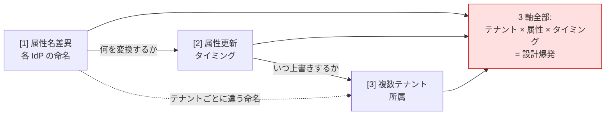

→ **3 つは「属性のライフサイクル設計」の 3 軸**。1 つだけ決めても破綻する。

#### 論点 1: 顧客 IdP ごとの属性名差異

各 IdP は同じ概念に対して別の属性名を使う:

| 概念 | Entra ID | Okta | Google Workspace | HENNGE One | SAML 標準 | ADFS |
|---|---|---|---|---|---|---|
| ユーザー一意 ID | `oid` (objectId) | `sub` | `sub` | 独自 | `NameID` | `objectsid` |
| テナント ID | `tid` (tenant GUID) | `org_id` | `hd` | 独自 | （なし）| （なし） |
| メール | `email` / `preferred_username` | `email` | `email` | 独自 | `emailaddress` | `emailaddress` |
| グループ | `groups`（GUID） | `groups`（文字列） | （カスタム）| 独自 | AttributeStatement | `Group` |

**よくある罠**:
- Entra `tid` をそのまま `tenant_id` に → Entra のテナント GUID と本基盤の `tenant_id` 体系が齟齬
- Okta `groups` がデフォルト含まれない → カスタムスコープ要求が必要
- HENNGE / 国産 IdP の独自命名 → ドキュメント英語化なし、実物確認必須

**設計判断**:
- **A 案 顧客 IdP 個別に Broker 側でマッピング**（業界標準、本基盤推奨）
- B 案 顧客側に標準スキーマ準拠を契約条項で要求（大手のみ可）
- C 案 IdP-specific クレームを RP に露出（❌ Broker パターン崩壊）

#### 論点 2: 属性更新タイミング

JIT で作成後、IdP 側で属性が変わったらどうするか:

| Sync Mode | 異動反映 | 退職反映 | 基盤側カスタム温存 |
|:---:|:---:|:---:|:---:|
| **Force**（強制上書き、業界デフォルト）| ✅ 即時 | ✅ 即時 | ❌ 消える |
| **Import**（初回 JIT のみ）| ❌ 遅延 | ❌ **退職後も認可通る（重大）** | ✅ 温存 |
| **ハイブリッド**（属性ごと）| 属性次第 | 属性次第 | ✅ 一部温存 |
| **SCIM 駆動 + JIT 補完** | ✅ SCIM 即時 | ✅ SCIM 即時 | SCIM 経由のみ |

→ **トレードオフ**: 即時反映性（Force） vs 基盤側カスタマイズ温存（Import）。

**よくある罠**:
- 「Force」前提で基盤側にロール手動追加 → 次回ログインで消える
- 「Import」前提で退職者の groups が反映されない → **退職後も認可通る重大インシデント**
- SCIM + JIT 併用時の属性ソース競合（race condition）

**プラットフォーム差**:
- Cognito: デフォルト JIT 時のみ、Pre Token Lambda V2 で都度上書き実装
- Keycloak: **IdP 単位 + Mapper 単位で Sync Mode 指定可**（圧倒的に楽）

#### 論点 3: 1 ユーザー複数テナント所属

1 人が複数顧客企業に所属するケース:

| 実例 | 状況 |
|---|---|
| 業界横断コンサルタント | Acme と Globex 両社の IdP に登録 |
| MSP（マネージドサービスプロバイダ）| MSP 社員が顧客 A/B/C それぞれの IdP に所属 |
| 業務委託・フリーランス | 取引先 3 社にログイン |
| 親会社 + 子会社 | Acme Holdings + Acme Japan + Acme USA |
| M&A 後 / 兼務 | 旧 A 社員 + 新 B 社所属、営業 + 開発兼務 |

**「あり / なし」で設計の根本が変わる**:

| 要素 | あり前提 | なし前提 |
|---|---|---|
| `tenant_id` クレーム形式 | アクティブのみ JWT に注入 or 配列 | スカラー |
| ログイン UX | テナント選択 UI 必要 | HRD で直接 |
| プロファイル表現 | `memberships: [{tenant, groups, dept}, ...]` | フラット |
| 切替時 MFA | 再要求? | 1 回 |
| 監査ログ | テナント別分離 | 単純 |

**業界実例**:

| サービス | 設計 |
|---|---|
| **Slack** | Workspace ごとに切替（独立セッション） |
| **Notion** | Workspace ごとに切替 |
| **GitHub Organizations** | 1 ユーザー = 複数 Org、横断アクセス |
| **Box Enterprise** | 1 ユーザー = 1 Enterprise（基本）|
| **Auth0 Organizations** | 1 ユーザー = 複数 Organization 標準サポート |

→ **業界主流は「複数所属あり前提 + テナント切替 UI」**（Slack / Notion / Auth0 / Entra B2B）。

#### 3 論点の絡み合い：見落とすと破綻するシナリオ

| シナリオ | 起きること |
|---|---|
| **田中さんが Acme と Globex 両方に所属、両 IdP で groups の命名が違う** | テナント A の groups は `[営業]`、テナント B は `["Sales"]` → どちらをロールマッピングに使う?（1 × 3） |
| **田中さんが Acme で異動、Globex には反映なし** | Force で Acme ログイン → Globex ロールが消える?（2 × 3）|
| **Acme は SCIM 同期、Globex は JIT のみ** | 同一ユーザーで属性ソースが違う → どちらを優先?（2 × 3）|
| **Acme 退職、Globex は継続** | プロファイル削除? それともテナント別 deprovision?（3 × [§FR-5](05-logout-session.md)）|

#### 我々のスタンス（基本方針に基づく）

| 基本方針の柱 | 属性ライフサイクル設計での実現 |
|---|---|
| **絶対安全** | 退職反映は SLA 明示（即時推奨）。属性源は IdP / 基盤で明示分離 |
| **どんなアプリでも** | 統一クレーム形式は IdP 差異吸収後、変わらない |
| **効率よく** | Keycloak は Mapper 単位 Sync Mode、Cognito は Pre Token Lambda で対応 |
| **運用負荷・コスト最小** | 顧客 IdP 追加時、属性命名表をテンプレ化 |

#### 推奨ベースライン

| 軸 | ベースライン |
|---|---|
| **属性命名差異** | A 案: Broker 側マッピング（Cognito `attribute_mapping` / Keycloak IdP Mapper）|
| **属性更新** | **属性ごとに Source of Truth を分離**: `groups`/`department` は IdP 側 Force、`roles`（基盤管理ロール）は Import、表示名は Force |
| **退職反映 SLA** | 即時（< 数分）を目標。SCIM 推奨、JIT のみ運用時は明示警告 |
| **複数テナント所属** | **あり前提で設計**: `memberships: [{tenant, groups, dept}, ...]` + アクティブテナントのみ JWT 注入 + テナント切替 UI |
| **複数テナント時の MFA** | テナント切替時は再要求しない（同一セッション、ステップアップ MFA は別軸で）|
| **複数テナント時の属性ソース** | テナント所属コンテキスト単位で管理（テナント A 属性 ≠ テナント B 属性）|

#### TBD / 要確認（[hearing-checklist.md](../../hearing-checklist.md) と連動）

| 確認項目 | ヒアリング ID | 回答例 |
|---|---|---|
| 各顧客 IdP の実属性名サンプル取得手順 | **B-604-2** | メタデータ URL / Discovery URL / ID Token サンプル |
| 属性ごとの真実の源（Source of Truth） | **B-605-2** | groups は IdP、roles は基盤、表示名は IdP 等 |
| 退職反映 SLA | **B-605-3** | 即時 / 数時間 / 翌日 / SCIM 同期依存 |
| 複数テナント所属時の権限モデル | **B-606-2** | 横断（GitHub 型）/ 切替（Slack 型）/ 別ユーザー（独立）|
| テナント切替時の MFA 再要求 | **B-606-3** | 再要求する / しない / ロール別 |
| 複数所属時の属性ソース | **B-606-4** | テナント別管理 / 統合 |

---

### 参考資料（§FR-2.2 全体）

- [JIT Provisioning Best Practices - Security Boulevard](https://securityboulevard.com/2026/03/how-to-implement-just-in-time-jit-user-provisioning-with-sso-and-scim/)
- [OIDC and SAML Integration for Multi-Tenant - SSOJet](https://ssojet.com/enterprise-ready/oidc-and-saml-integration-multi-tenant-architectures)
- [SAML attributes to OIDC claims mapping - REFEDS](https://wiki.refeds.org/display/GROUPS/Mapping+SAML+attributes+to+OIDC+Claims)
- [Microsoft - Federated MFA assertion handling](https://learn.microsoft.com/en-us/entra/identity/authentication/how-to-mfa-expected-inbound-assertions)
- [Cognito attribute mapping 公式](https://docs.aws.amazon.com/cognito/latest/developerguide/cognito-user-pools-specifying-attribute-mapping.html)
- [Cognito Pre Token Lambda 公式](https://docs.aws.amazon.com/cognito/latest/developerguide/user-pool-lambda-pre-token-generation.html)
- [Keycloak Protocol Mapper 解説](https://blog.elest.io/mapping-claims-and-assertions-in-keycloak/)

---

## §FR-2.3 マルチテナント運用（→ FR-FED §2.3）

> 本サブセクションは「**N 社の顧客 IdP を並行運用する全体運用設計**」を示すためのもの。§FR-2.1 / §FR-2.2 が "できる" の話なら、§FR-2.3 は "どう運用するか" の話。

### §FR-2.3.0 マルチテナント運用とは何か（前提と背景）

#### 用語整理

| 用語 | 本基盤での意味 |
|---|---|
| **テナント** | 共通認証基盤を利用する顧客企業（例：Acme 社、Globex 社）。それぞれ独自の社員・IdP・データを持つ |
| **マルチテナント運用** | 1 つの認証基盤で**複数のテナントを並行ホスト**する運用形態 |
| **テナント境界** | データ / 権限 / セッション の分離線。基盤が必ず守る不変条件 |

#### なぜここ（§FR-2.3）で決めるか

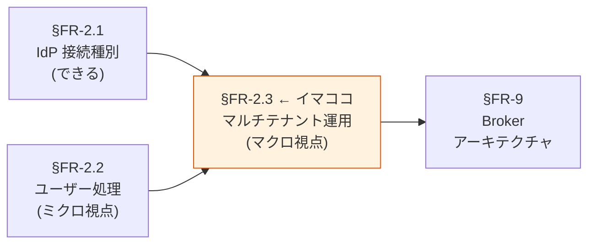

§FR-2.1 / §FR-2.2 は「**できる**」の話。§FR-2.3 は「**どう運用するか**」の話。スケール・運用フロー・UX を確定させる。

---

### §FR-2.3.A アーキテクチャ判断：単一 Pool/Realm + 複数 IdP を採用

#### 3 つの選択肢のトレードオフ

| アプローチ | テナント分離 | スケール上限 | 運用負荷 | Broker パターン整合 | 採用 |
|---|:---:|:---:|:---:|:---:|:---:|
| **A. 1 Pool/Realm + 複数 IdP** | 中（`tenant_id` クレームで分離）| 高（実用上 1000+ 顧客）| **低** | ✅ 完全整合 | **✅ 推奨** |
| B. Pool/Realm per テナント | 高（完全分離） | 中（Cognito Quota 1000 / Keycloak 100s で性能劣化） | 高（管理対象 N 倍）| ⚠ issuer が N 個に分散 | 例外時のみ |
| C. AWS Account per テナント | 最高（コスト分離も）| 低（運用工数爆発） | 最高 | ❌ Broker 崩壊 | ❌ |

#### A 案（採用）の根拠

**Broker パターンの本質は「集約点が 1 つ」**:
- 各バックエンドシステムが検証する issuer は 1 つだけ
- テナントごとに Pool/Realm を分けると issuer が分散 → 各システムが N 個の issuer を検証する羽目に
- B 案・C 案は **Broker パターンの恩恵を捨てる**ことになる（[§1](../common/01-architecture.md) と整合しない）

**スケールも十分**:
- Keycloak: 10K IdPs まで性能劣化なしの実証あり
- Cognito: 数百 IdP までは問題なし（千超は外部 Broker 検討）
- 通常の B2B SaaS（顧客 100〜1000 社）なら A 案で完全カバー

**テナント分離は別レイヤーで担保**:
- 認可層（[§FR-6](06-authz.md)）で `tenant_id` クレームベースのスコープ検証
- バックエンドが「JWT.tenant_id != path.tenantId なら 403」を必ず実行
- これで A 案でも完全分離を実現

#### B 案を例外的に採用するケース

| ケース | 理由 |
|---|---|
| 顧客契約で「データを物理的に分離」と明記 | データ所在地・暗号化キー分離が要件 |
| 規制上の理由（金融とそれ以外の混在禁止等）| コンプライアンス |
| 1 顧客が極めて大規模（10 万 MAU 超）| 性能・コスト個別最適化 |

→ いずれもレアケース。**デフォルトは A 案**。

---

### §FR-2.3.A.1 何が分離・共有されているか — 論理分離の実態（顧客が必ず聞く論点）

A 案（単一 Pool/Realm + 複数 IdP）を採用すると、**JIT で作成されるユーザーレコードが同一 Pool/Realm 内に同居**することになる。「**それでセキュリティは大丈夫なのか?**」という顧客からの懸念に答える。

#### 同居の様子（実態）

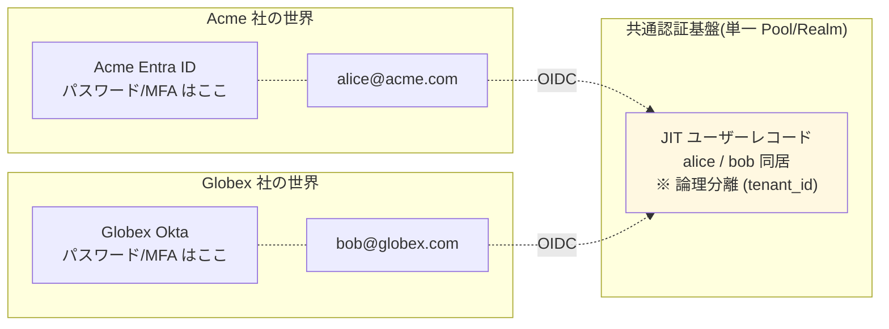

#### 何が分離・共有されているか（詳細マトリクス）

| 要素 | 物理場所 | 分離方式 | テナント間で同居? |
|---|---|---|:---:|
| **パスワードハッシュ** | 各顧客 IdP（Entra/Okta）| 顧客 IdP 完全分離 | ❌ **同居しない（本基盤に来ない）**|
| **MFA 設定**（TOTP/Passkey 秘密）| 各顧客 IdP | 顧客 IdP 完全分離 | ❌ 同居しない |
| **認証アクション**（PW 検証 / MFA チャレンジ）| 各顧客 IdP で実行 | 顧客 IdP 完全分離 | ❌ 同居しない |
| **JIT ユーザーレコード** | 本基盤 Pool/Realm | 論理分離（`custom:tenant_id` 属性 / `identities` クレーム）| ⚠ **同居（論理分離）**|
| **メールアドレス / 表示名** | 本基盤側 | 論理分離 | ⚠ 同居 |
| **Group / Role 割り当て** | 本基盤側 | テナント別ロール | ⚠ 同居 |
| **発行する JWT** | 基盤発行 | `tenant_id` クレームで識別 | ✅ リクエストごとに分離 |
| **SSO セッション Cookie** | 本基盤 | Pool 内共有、ただし JWT は別 | ⚠ Cookie 同居、JWT 分離 |
| **業務データ** | 各アプリ DB | 共有 DB+`tenant_id` / DB 分離 / アカウント分離（[B-306](../../hearing-checklist.md)）| 設計次第 |
| **IdP 接続設定** | 本基盤の Identity Provider 設定 | テナント別エントリ | ⚠ 同居（管理上分離）|

#### 同居しているのは「公開可能な属性 + 論理分離タグ」のみ

| 同居しているもの | 機密度 |
|---|---|
| email（公開情報、JWT で配布）| 低 |
| 表示名 / 部署 / ロール | 低-中 |
| ユーザー内部 ID（`sub` / UUID）| 公開 |
| `tenant_id` / IdP リンク情報 | 低（識別タグ）|

→ **認証クレデンシャル（パスワード・秘密鍵）は本基盤に存在しない**。これが業界標準で**論理分離が安全とされる最大の根拠**。

#### 業界根拠（A 案論理分離の正当性）

| 出典 | 主張 |
|---|---|
| **OWASP Multi-Tenant Security Cheat Sheet** | 「テナント境界は **`tenant_id` を全リクエストで強制**することで論理的に実現可。物理分離は規制要件時のみ」 |
| **Microsoft Azure Architecture Center**（"Architectural Considerations for Identity in a Multitenant Solution"）| 「フェデレーション IdP 構成では、**ユーザーレコードの同居は標準。テナント境界は claim ベースで分離**」 |
| **WorkOS B2B SaaS Multi-tenant Guide** | 「Slack / Notion / Linear など主要 B2B SaaS が単一 Pool + 論理分離で運用」 |
| **Auth0 / Microsoft Entra External ID** | 単一 Tenant + Organization 機能で論理分離を標準採用 |
| **Gartner 予測** | 2026 年までに新規デジタル製品の 75% 以上がマルチテナント論理分離をデフォルト採用 |

#### A 案で残る攻撃面と対策

論理分離は**正しく実装されていれば**物理分離と同等のセキュリティを実現可能。OWASP 観点での対策：

| 攻撃ベクター | 対策 |
|---|---|
| **`tenant_id` クレーム改ざん** | 基盤側で**必ず注入**（Pre Token Lambda / Protocol Mapper、ユーザー自己申告 NG）+ JWT 署名検証 |
| **JIT ユーザー作成時の混同**（Acme IdP が間違って Globex の email でユーザー作成）| First Broker Login Flow で既存ユーザーとの突合せ拒否、Identity Provider 単位の namespace 分離 |
| **email 重複**（Acme と Globex で同じ email）| `tenant_id` + `email` 複合キーで識別、`Trust Email` 設定を慎重に |
| **Cross-tenant IDOR** | リソース ID → tenant_id 解決 + JWT.tenant_id 一致確認（アプリ側責務、[§FR-6.1](06-authz.md) / [§FR-6.3](06-authz.md)）|
| **Admin API での全ユーザー漏洩**（ListUsers）| Realm Admin / IAM Role でテナント別管理権限を分離 |
| **キャッシュ汚染** | キャッシュキーに `tenant_id` プレフィックス必須 |

詳細な実装方式は内部技術メモ [`identity-broker-multi-idp.md §10`](../../../common/identity-broker-multi-idp.md) 参照。

#### 顧客への説明（推奨フレーズ）

> 「**認証情報（パスワード・MFA）はお客様の IdP 側にあり、本基盤には決して送られません**。本基盤に保存されるのは、SSO 連携のために最小限必要な情報（メールアドレスとテナント所属タグ）のみで、これらは JWT に組み込んで各アプリに渡す前提の公開情報です。
>
> テナント間のアクセス分離は、JWT に必ず付与される `tenant_id` クレームを各アプリが検証することで実現します。これは Slack や Notion など主要 B2B SaaS で標準採用される設計で、OWASP・Microsoft Azure Architecture Center も推奨しています。
>
> 物理的にユーザーデータを完全分離したい場合（金融・医療など規制要件）は、お客様専用の Pool / Realm を別途用意することも可能です（B 案）。」

#### TBD / 要確認

| 確認項目 | 回答例 |
|---|---|
| 「ユーザーレコードが同居する」設計でセキュリティ要件を満たすか | はい（標準）/ いいえ（物理分離 = B 案）|
| 物理分離が必要な特殊顧客の有無 | あり（業種名）/ なし |
| Cross-tenant 攻撃対策の責務分担 | 基盤側で tenant_id 注入 / アプリ側で検証強制 |

---

### §FR-2.3.A.2 IdP なし顧客のローカルユーザー管理 — パスワードハッシュの同居問題

> **詳細は [ADR-028 IdP なし顧客のローカルユーザー管理 — 4 選択肢の比較](../../../adr/028-idpless-customer-local-user-management.md) を参照**

> **このサブ・サブセクションで定めること**: IdP を持たない顧客（DeltaCo 等）のローカルユーザー管理で、**パスワードハッシュが本基盤側に同居する問題**への 4 つの選択肢比較と、規制顧客対応を考慮した推奨方針。
> **主な判断軸**: 規制顧客（金融 / 医療 / 政府）の有無、運用工数、Broker パターン整合性、契約上の物理分離要求
> **§FR-2.3.A 内の位置付け**: §FR-2.3.A.1 ではフェデユーザーの同居を扱った。本サブセクションは **「IdP を持たない顧客」のユーザー管理**を扱う
> **⚠ 所有権モデル**: 本サブセクションで扱う E 案 IdP-KC 2-tier 採用時、移行ユーザーは **「顧客所有・弊社ホスト」の Shared Responsibility Model** で運用される（[ADR-037](../../../adr/037-shared-responsibility-and-lightweight-iga.md) / [§FR-7.0.B](07-user.md#fr-70b-shared-responsibility-model顧客所有弊社ホスト) で確定）。物理保管場所は弊社 IdP-KC に移るが、**ユーザーの所有権・運用責務は顧客のまま**であることに留意

#### 結論サマリ

| 項目 | 採用方針 |
|---|---|
| **採用アプローチ** | **D 案 ハイブリッド**（一般 A + 規制 B / C）|
| 一般顧客（IdP なし） | 共通 Pool でローカル管理（論理分離 + PBKDF2/Argon2 ハッシュ）|
| 規制顧客（金融 / 医療 / 政府）| 専用 Pool/Realm（物理分離 + 別 KMS キー）|
| 同居許容の前提 | 侵害クレデンシャル検出 / MFA Must / Pool DB 暗号化 等の必須セキュリティ実装 |

#### 5 選択肢の概要（詳細は ADR-028 / ADR-033）

| 案 | 設計 | パスワード分離 | 運用工数 | コスト（10M MAU 時）| 推奨度 |
|:---:|---|:---:|:---:|:---:|:---:|
| A. 共通 Pool に集約 | ローカル管理、論理分離 | ❌ 同居 | ◎ 1 つ | ◎ | 一般顧客のみ |
| B. 顧客別 Pool/Realm | 物理分離 | ✅ 完全 | ❌ N 倍 | △ | × 過剰 |
| C. 顧客専用 Mini IdP | 別 Realm + フェデ | ✅ 完全 | ❌ N 倍 + 階層 | △ | △ 例外的 |
| **D. ハイブリッド** | 一般 A + 規制 B/C | ⚠ 部分 | ○ 数個 | ○ | **✅ 中規模時の推奨**（〜中規模、IdP なし顧客が少ない場合）|
| **E. 2-tier 別インスタンス**（NEW）| **Broker KC + IdP KC を物理分離**（[ADR-033](../../../adr/033-keycloak-2tier-broker-idp-architecture.md)）| ✅ 完全 | ⚠ 2 倍 | ◎ Keycloak OSS、Entra 比 350-600 倍削減 | **✅ 大規模時の推奨**（10M MAU、IdP なし顧客が一定数含まれる場合）|

#### 採用判断基準

| 状況 | 推奨案 |
|---|---|
| MAU < 1M、IdP あり顧客 100%（IdP なし顧客なし）| **D 案**で十分（ローカル PW 同居が発生しない）|
| MAU < 1M、IdP なし顧客が含まれる | **D 案**（一般は共通 Pool、規制顧客のみ専用）|
| MAU 1M-10M、IdP なし顧客が含まれる | **E 案検討開始**（[ADR-033](../../../adr/033-keycloak-2tier-broker-idp-architecture.md)）|
| MAU 10M+、IdP なし顧客が含まれる | **E 案採用**（[ADR-033](../../../adr/033-keycloak-2tier-broker-idp-architecture.md) / [ADR-032 コスト裏どり](../../../adr/032-ciam-platform-cost-comparison-10m-mau.md)）|
| 規制顧客（金融・医療）を多数獲得予定 | **E 案 + 規制顧客向け追加 IdP-KC インスタンス**（別 VPC / Region）|

#### E 案（2-tier）の構造サマリ

- **Tier 1 Broker Keycloak**: 認証集約・JWT 発行・Organizations + IdP リンク管理（フェデユーザーのみ、PW なし）
- **Tier 2 IdP Keycloak**: ローカル PW・MFA・サインアップ UI（IdP なし顧客のユーザー + ハッシュ）
- **両 Tier とも Single Realm + Organizations**（Keycloak v26+ 標準機能、[ADR-017](../../../adr/017-multitenant-l2-single-realm.md) と整合）
- Broker → IdP-KC は OIDC Federation 標準パターン（業界実装多数）
- 段階的導入: Phase 1（Broker 単独・D 案）→ Phase 2（IdP-KC 追加）→ Phase 3（既存ユーザー段階移行）→ Phase 4（規制顧客向け追加 IdP-KC）

#### 推奨配置

| 顧客タイプ | 配置（中規模 D 案）| 配置（大規模 E 案）|
|---|---|---|
| **IdP あり顧客**（Acme, Globex 等）| Broker 共通 Pool | Broker 共通 Pool（変わらず）|
| **IdP なし 一般顧客**（標準セキュリティ）| Broker 共通 Pool でローカル管理 | **IdP Keycloak（Tier 2）**（Broker からは OIDC フェデ）|
| **規制顧客**（金融 / 医療 / 政府）| 専用 Pool/Realm | **追加の専用 IdP-KC インスタンス**（別 VPC / Region）|

#### A 採用時の必須セキュリティ要件

- 強いハッシュ（PBKDF2-SHA512 / Argon2id）
- 侵害クレデンシャル検出（Cognito Plus / Keycloak + HIBP）
- 強いパスワードポリシー（NIST SP 800-63B Rev 4 準拠）
- アカウントロック / ブルートフォース対策
- MFA Must（IdP なしユーザー、Passkey 推奨 + TOTP）
- Pool DB 暗号化（Cognito 自動 / Keycloak: Aurora + KMS CMK）
- 管理 API 制限（`tenant_id` フィルター必須）
- 全認証イベントの監査ログ

#### 顧客への説明テンプレート

> 「IdP をお持ちでない顧客のユーザーは、本基盤側で**ローカル管理**します。パスワードは PBKDF2-SHA512 でハッシュ化して保存され、salt 付きで元パスワード復元は困難です。ハッシュ自体は他の一般顧客のものと**同じデータベースに格納**されますが、これは Slack / Notion / Linear など主要 B2B SaaS の標準構成です（OWASP 推奨）。
>
> 金融・医療・政府系など、**規制・契約で物理分離が必須**な場合は、お客様専用の User Pool を別途用意することも可能です（B 案 = 物理分離、コスト・運用工数増）。」

#### TBD / 要確認

| 確認項目 | 回答例 |
|---|---|
| IdP なし顧客のユーザー管理方針 | A 共通 Pool / B 専用 Pool / C 専用 Mini IdP / **D ハイブリッド**（中規模）/ **E 2-tier 別インスタンス**（大規模、[ADR-033](../../../adr/033-keycloak-2tier-broker-idp-architecture.md)）|
| **想定 MAU 規模**（E 案採否の決定要因）| 〜1M（D 案）/ 1M-10M（D or E 検討）/ **10M+（E 案推奨）** |
| **IdP なし顧客の割合**（E 案 IdP-KC 規模見積もり）| ほぼ 0%（D 案で十分）/ 〜30%（E 案で IdP-KC = MAU の 30%）/ 50%+（E 案推奨）|
| 規制顧客（金融 / 医療等）の有無 | あり（業種・顧客数）/ なし |
| パスワードハッシュ同居を許容するか | はい（一般顧客で OK）/ いいえ（全顧客分離要）|
| 専用 Pool/Realm を用意する顧客の判断基準 | 契約金額 / 規制要件 / セキュリティレベル |

→ 実装方式の詳細（Cognito 別 Pool vs Keycloak 別 Realm の比較、運用工数）は内部技術メモ [`identity-broker-multi-idp.md §10`](../../../common/identity-broker-multi-idp.md) 参照。

### §FR-2.3.A.3 A 案採用の運用コスト根拠（マルチ Realm の実例 / Broker 効果の業界実証）

> **詳細は [ADR-017 マルチテナント L2 採用根拠](../../../adr/017-multitenant-l2-single-realm.md) を参照**

> **このサブサブセクションで定めること**: §FR-2.3.A で A 案（単一 Pool/Realm + 複数 IdP）を推奨と判断した根拠を、**運用コストと業界実証データの 2 軸**で裏付ける。顧客や経営層から「なぜ物理分離しないのか」「Broker 化の効果は定量的にどれくらいか」の問いに定量根拠で応答できるようにする。   
> **主な判断軸**: 想定顧客数、マルチ Realm の運用ボトルネック、Broker パターン採用の効果（統合点削減率）   
> **§FR-2.3 内の位置付け**: §FR-2.3.A の Decision を補強する Evidence セクション。打ち合わせ準備の「定量根拠」資料

#### 結論サマリ

| 観点 | A 案（採用）| B 案（例外時のみ）|
|---|---|---|
| 性能 | Cognito / Keycloak 共に 1,000+ 顧客で問題なし | Keycloak 26.4 でようやく 1,000 Realm 実用化 |
| 運用負荷 | **顧客数に対して緩やかに増加**（IdP エントリのみ）| **顧客数に比例して爆発**（設定変更 × N、監視 × N、キャッシュ × N）|
| Broker 効果 | **約 67% の統合点削減を享受**（WJAETS-2025-0919）| Realm 分割で issuer が分散 → Broker 効果を捨てる |
| バージョン依存リスク | なし | Keycloak バージョンアップに引きずられる |

#### 主要な裏どり（詳細は ADR-017）

- **マルチ Realm の技術的限界**: Keycloak 25.x は 100〜200 Realm 実用上限、26.4+ で 1,000+ 実用化（最大 2,600 本番事例）
- **顧客数比例で増えるコスト 5 観点**: 設定変更伝播 / 監視カーディナリティ / キャッシュ管理 / Realm 作成削除 / Admin Console UX
- **Broker 効果実証**: 18 → 6 直接統合点（約 67% 削減）、Azure AD 採用 62%（WJAETS-2025-0919 論文）

#### TBD / 要確認

| 確認項目 | 回答例 |
|---|---|
| 顧客数の想定上限 | 〜100 社 / 〜1,000 社 / 1,000+ 社 |
| マルチ Realm/Pool 構成を採る特殊顧客の有無 | あり（業種・顧客数）/ なし |
| 監視粒度の方針 | テナント別必須 / 全体合算で十分 |

---

### §FR-2.3.B 我々のスタンス（基本方針に基づく）

| 基本方針の柱 | マルチテナント運用での実現 |
|---|---|
| **絶対安全** | テナント境界の厳格分離（`tenant_id` クレーム必須、cross-tenant データアクセス遮断） |
| **どんなアプリでも** | 顧客が何 IdP を持っていても並行運用可能。100〜1000 社規模を想定 |
| **効率よく認証**（中核）| **顧客追加で各システム変更不要**。基盤側で IdP 追加 → 統一 JWT 発行が完結（Broker パターンの本質） |
| **運用負荷・コスト最小** | IaC（Terraform）で自動化。手動 Console 設定は最小限 |

---

### §FR-2.3.C マルチテナント環境での SSO 挙動

「**SSO がテナントを跨ぐとどうなるか**」は顧客が必ず気にする論点。本セクションでは Cognito / Keycloak 共通の SSO **挙動シナリオ**を整理する。
（SSO 機能の Cognito vs Keycloak 比較は [§FR-4 SSO](04-sso.md) / [§FR-5 ログアウト・セッション管理](05-logout-session.md) で詳述。本表は **multi-tenant 文脈に絞った挙動の整理**。）

#### シナリオ A：同一テナント内 SSO（最も一般的）

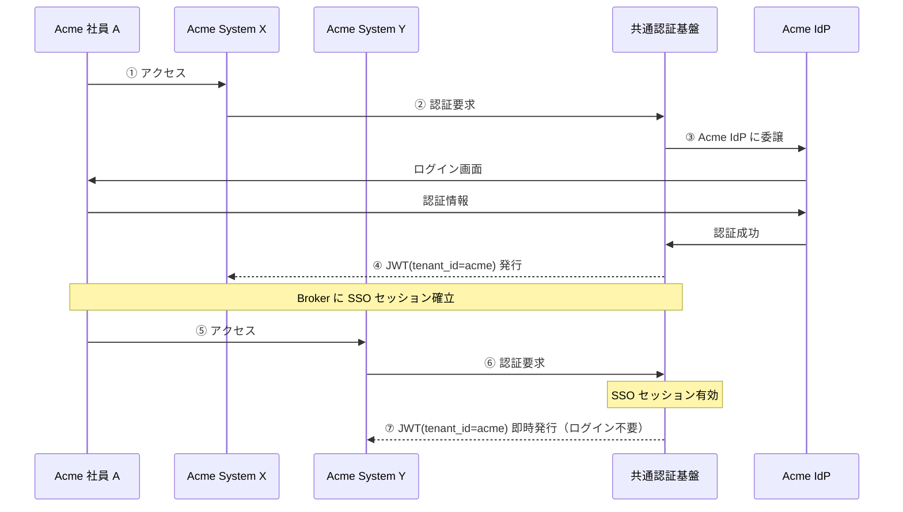

→ **Broker（Cognito Pool / Keycloak Realm）内の SSO セッションが共有**されるため、同一顧客内のシステム間はシームレス。A 案を採用する大きなメリット。

#### シナリオ B：クロステナント所属ユーザー

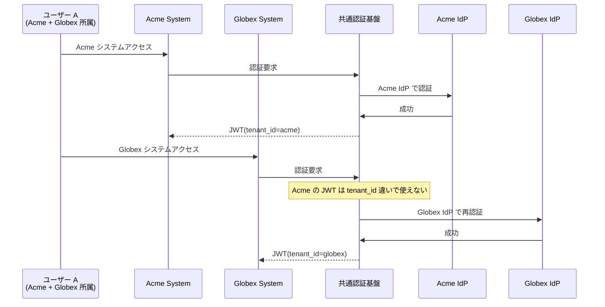

→ **同一人物でもテナントが違えば別 JWT**。これは**仕様**であり、テナント境界を守るために必要な挙動。

#### シナリオ C：テナント切替 UI

複数テナント所属ユーザー向け：
- ログイン後に「どのテナントとして動くか」を選択する UI
- AWS Console の "Switch Role" と同様

**実装責務分担**（業界標準）:

| 責務 | 担当 |
|---|---|
| `memberships` クレーム発行（全所属配列）| **共通基盤**（[B-606-4](../../hearing-checklist.md)）|
| 切替時の新 JWT 発行（active_tenant 差替）| **共通基盤**（Refresh Token + クレーム差替 / Token Exchange） |
| **テナント選択 UI 描画**（ドロップダウン / 画面）| **アプリ側 SPA / BFF**（業界標準、[B-611](../../hearing-checklist.md)）|
| active_tenant のセッション保持 | アプリ側 BFF or SPA |

→ **基盤側で UI を持つのは業界実例なし**（Slack / Notion / GitHub / Atlassian Cloud / Linear すべてアプリ側実装）。本基盤の責務は **`memberships` クレーム + 切替時の JWT 再発行 API**、UI はアプリ層で構築。

→ 要件次第。多くの B2B SaaS では「1 アカウント = 1 テナント」で十分（[B-606](../../hearing-checklist.md) で確認）。

#### SSO 挙動の比較（multi-tenant 文脈）

「multi-tenant 運用に直接関わる SSO 挙動」だけに絞った Cognito vs Keycloak 比較。網羅的な機能比較は [§FR-4 SSO](04-sso.md) / [§FR-5 ログアウト・セッション管理](05-logout-session.md) を参照。

| SSO 挙動 | Cognito | Keycloak (OSS / RHBK) | 備考 |
|---|:---:|:---:|---|
| 同一 Pool/Realm 内 SSO セッション共有（同一テナント内）| ✅ User Pool 内 | ✅ Realm 内 | A 案採用時の標準挙動 |
| クロステナントで別 JWT 発行 | ✅ `tenant_id` クレームで識別 | ✅ `tenant_id` クレームで識別 | 設計で担保 |
| テナント切替 UI | ⚠ 自前 SPA 実装 | ⚠ 自前 SPA 実装 | プラットフォーム標準機能なし、SPA 側で実装 |
| 同一 Broker への複数 IdP 並行 SSO | ✅ Pool に複数 IdP | ✅ Realm に複数 IdP | A 案の前提 |
| Broker ログアウトで全テナントセッション破棄 | ✅ Global Sign-Out | ✅ Realm-level Logout | テナント境界で限定する場合は設計工夫が必要 |

詳細な SSO / ログアウト機能比較（Back-Channel Logout / Front-Channel Logout 等）は [§FR-5 ログアウト・セッション管理](05-logout-session.md) を参照。

---

### §FR-2.3.1 複数 IdP 並行運用（→ FR-FED-010）

> **このサブ・サブセクションで定めること**: 1 つの認証基盤に N 社の外部 IdP を同時登録して並行運用する技術構成（単一 Pool/Realm + 複数 IdP）と、テナント分離の方式。   
> **主な判断軸**: 想定顧客企業数、テナント分離の粒度（クレームベース vs 物理分離）、1 ユーザー複数テナント所属の可能性   
> **§FR-2.3 内の位置付け**: §FR-2.3.A アーキテクチャ判断（採用方針）を**具体実装**として確定。§FR-2.3.2 オンボーディング・§FR-2.3.3 UX と組合せて全体運用が完成

#### ベースライン

- **単一 Cognito User Pool / 単一 Keycloak Realm** に複数の外部 IdP を並行登録（A 案、3.3.A で根拠提示）
- 各ユーザーは `tenant_id` クレームで所属顧客企業を識別
- JWT には `tenant_id` / `roles` / `email` を統一形式で注入（[§FR-2.2.2](#322-属性マッピング--クレーム変換--fr-fed-009) と連動）
- バックエンド API は `tenant_id` でテナントスコープ検証（cross-tenant アクセス遮断）

#### 対応能力

| 項目 | Cognito | Keycloak |
|---|:---:|:---:|
| 単一 Pool/Realm への IdP 接続数 | 数十〜数百（実用上）| **10K** 実証済 |
| テナント分離 | `custom:tenant_id` クレーム | `tenant_id` クレーム |
| PoC 検証 | ✅ Phase 4, 5 | ✅ Phase 9 |

#### TBD / 要確認

| 確認項目 | 回答例 |
|---|---|
| 想定顧客企業数（1 年後 / 3 年後）| N 社 / M 社 |
| テナント分離の粒度 | データ完全分離 / 一部共有 |
| 1 ユーザーが複数テナントに所属する可能性 | あり / なし |
| 物理分離が必要な特殊顧客 | あり（B 案）/ なし |

---

### §FR-2.3.2 顧客追加オンボーディング（→ FR-FED-011）

> **このサブ・サブセクションで定めること**: 新規顧客企業の IdP を本基盤に接続する**運用フロー**（誰が・どんな手順で・どのくらいの時間で）と自動化方針。   
> **主な判断軸**: オンボーディング主体（弊社運用 / 顧客企業セルフサービス）、目標リードタイム、SCIM 連携の必要性、**顧客 IdP 側の作業 / エンドユーザー影響**   
> **§FR-2.3 内の位置付け**: §FR-2.3.1 の並行運用を**「持続的に拡張」**する運用面。IaC 自動化により [§FR-8.1 基盤設定管理](08-admin.md#91-基盤設定管理--fr-admin-71) と整合

#### §FR-2.3.2.A 全体像: 3 レイヤービュー（顧客 IdP 追加は 3 つの並行ワークストリーム）

> **論点**: 「IdP 追加」は単に基盤側で IdP 接続を 1 行足す話ではなく、**顧客 IdP 側の RP 登録 + エンドユーザーへの影響周知** が同時進行する複合プロセス。本基盤運用チームが見落としやすい Layer 1 / Layer 3 を明示する。

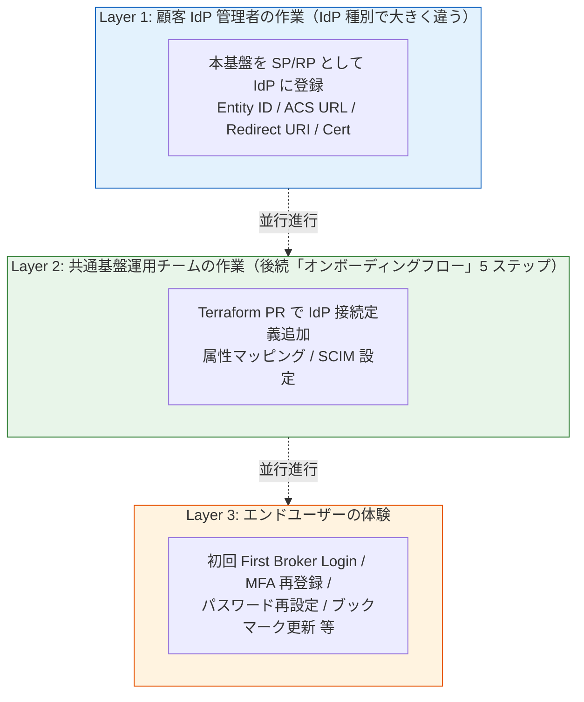

##### Layer 1: 顧客 IdP 管理者の作業（IdP 別差異マトリクス）

顧客 IdP 管理者が本基盤を **新しい SP/RP として登録する作業**。IdP ごとに UI・工数が大きく異なる:

| IdP | プロトコル | 主要登録項目 | 作業 UI | 想定工数 | エンドユーザー個人側設定 |
|---|---|---|---|:---:|:---:|
| **Entra ID**（Premium P1+）| SAML / OIDC | Reply URL / Identifier (EntityID) / App roles / Token 署名 cert | Entra Admin Center（GUI） | 1〜2h | **不要** |
| **Okta** | SAML / OIDC | ACS URL / Single Logout URL / Attribute statements | Okta Admin Console（GUI） | 1〜2h | **不要** |
| **Google Workspace** | SAML（OIDC は限定的） | ACS URL / Entity ID / Name ID Format | Google Admin Console（GUI） | 30 分〜1h | **不要** |
| **HENNGE One** | SAML | SP-initiated SSO 設定（Entity ID / ACS URL） | HENNGE 管理画面（GUI） | 1〜2h | **不要**（HENNGE 経由は透過） |
| **AD FS**（オンプレ Microsoft） | SAML / WS-Fed | Relying Party Trust + Claim Rules | AD FS Management Console + PowerShell | **半日〜1 日** | **不要**（社内 AD 環境からのみアクセス可、VPN 経由等の制約は別軸） |
| **オンプレ AD（LDAP 直結、Keycloak のみ）** | LDAP/Kerberos | Keycloak 側で User Federation 設定（顧客 AD 側は通常変更不要） | Keycloak Admin Console + LDAP bind 設定 | 半日（接続テスト含む） | **不要** |

→ **共通点**: 顧客 IdP 側に基盤の **Entity ID / ACS URL / Redirect URI** を 1 セット登録するだけで、**エンドユーザー個人の IdP 設定変更は基本不要**（顧客はそのまま既存 IdP を使い続けるため）。

→ **AD FS のみ突出して工数大**。PowerShell 操作 + 証明書管理 + 社内ネット制約。Keycloak の LDAP 直結ならその工数自体が消える（[マスター表 B 列 Z](../../hearing-script/02-idp-federation.md) で確認）。

##### Layer 3: エンドユーザー体験（新規顧客追加 = Greenfield 想定）

新規顧客の従業員が初めて本基盤経由のアプリにアクセスした時の体験:

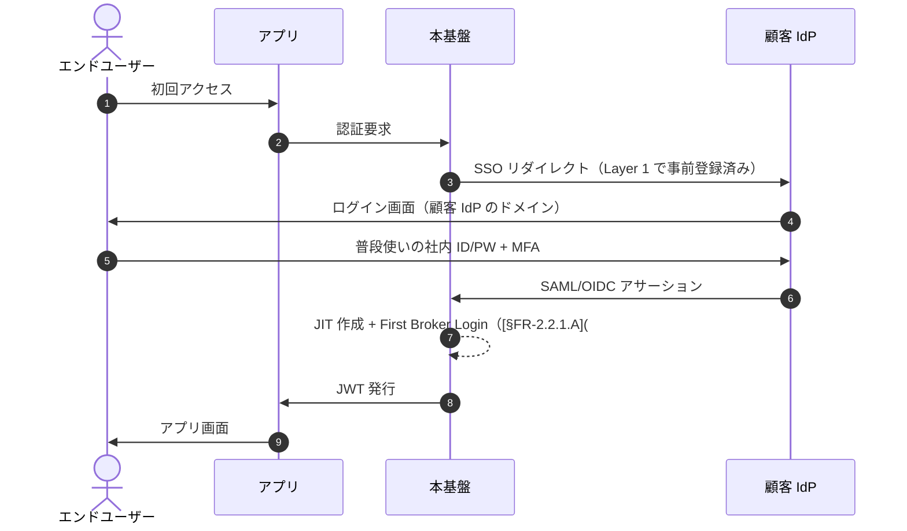

→ **新規顧客のエンドユーザーに必要なアナウンス**: 「このサービスは社内 ID でログインできます」程度。慎重なアナウンス不要。**移行ケース（既存認証システムからの切替）は §FR-2.3.2.B 参照**。

---

#### §FR-2.3.2.B 既存システムからの移行時のエンドユーザー影響と周知チェックリスト

> **論点**: 新規顧客追加（Greenfield、§FR-2.3.2.A シナリオ S1）と異なり、**既存認証システムから本基盤への移行**（シナリオ S2）はエンドユーザー影響が大きい。事前周知・サポート体制の設計が必要。詳細な移行データ層は [§NFR-9 移行性](../nfr/09-migration.md) で扱い、本節ではエンドユーザー UX 観点で整理。

##### 「ドメインが変わらない」が指す対象は最低 3 つあり、影響範囲が異なる

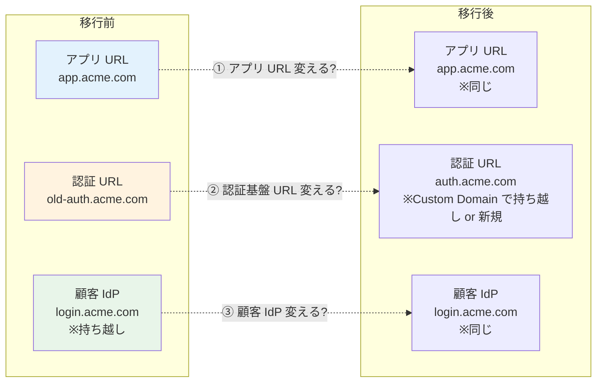

> **重要な前提**: ドメインが変わるか変わらないかに関わらず、**新基盤導入そのもの** が顧客 IdP 側で SP/RP 識別情報の更新を必ず発生させます。これは「URL 文字列」と「SP/RP 識別子（Entity ID / 証明書 / 署名鍵）」が独立した項目だからです。
>
> | 項目 | 新基盤導入で変わるか | 顧客 IdP 側作業 |
> |---|:---:|---|
> | **Reply URL / ACS URL / Redirect URI** | Custom Domain 持ち越し時は変わらない | 流用可、変更不要 |
> | **Entity ID / Audience / Client ID** | **必ず新規発行** | **更新必須**（既存 RP の Entity ID 書き換え or 新規 RP 登録）|
> | **SAML 署名証明書 / OIDC JWKS** | **必ず新規発行** | **証明書差し替え必須**（Cognito は基盤管理で再ローテ不可、Keycloak は BYO 可だが現実的には新規発行）|
> | **属性マッピング** | 要件次第 | 新基盤が要求属性を追加した場合のみ更新 |
> | **エンドユーザー個人の IdP 設定** | 変わらない | **不要**（IdP は同じものを使い続けるため）|
>
> → 「顧客 IdP の設定不要」が成立するのは **エンドユーザー個人レベル** のみ。**顧客 IdP の管理者は新基盤導入の度に必ず作業発生**。ドメイン変更の有無は「その作業範囲」を左右するだけ。

ドメイン変更の影響範囲は次の通り:

| どのドメインが変わるか | 顧客 IdP 側 RP 設定変更の範囲 | エンドユーザー影響 | 慎重アナウンス必要度 |
|---|---|---|:---:|
| **アプリ URL** が変わる | Entity ID / 証明書差し替え（前提）+ Reply URL 更新は通常**不要**（IdP 直接のリダイレクト先はアプリでなく認証基盤のため）| ブックマーク変更、保存パスワード無効、社内 Wiki/メール URL 更新 | 🔥 **高** |
| **認証基盤 URL**（Custom Domain）が変わる | Entity ID / 証明書差し替え（前提）+ **Reply URL / ACS URL の更新も必要** | 通常見えない（リダイレクト先が変わるだけ）、ただし保存ブックマークがあれば無効 | 🟡 中 |
| **顧客 IdP** 自体を切替 | 別問題（[§FR-2.2.1.A シナリオ 2](#fr-221a-同一テナント内ユーザー重複の扱い)）| 通常変わらない（IdP の URL は基盤の外） | 🟡 中 |
| 何も変わらない（既存ドメイン全て持ち越し）| **Entity ID / 証明書差し替えは依然必要**、URL 項目は流用可 | 初回 First Broker Login の確認画面のみ | 🟢 低 |

##### エンドユーザー周知チェックリスト（移行時の 6 つの変化）

「ドメインが変わらなくても、以下が変わるとエンドユーザーへの周知が必要」。1 つでも該当すれば **事前 2〜4 週間の周知 + 当日サポート体制** が業界標準:

| # | 変化項目 | エンドユーザーに何が起きるか | 周知タイミング | 関連章 |
|:---:|---|---|---|---|
| 1 | **パスワードハッシュ持ち越し不可** | 全員パスワード再設定（メール送信 → 再設定リンク） | 切替 2-4 週間前 + 当日 | [§NFR-9.2](../nfr/09-migration.md) |
| 2 | **MFA 登録の持ち越し不可** | 全員 MFA 再登録（TOTP の QR コード再スキャン / Passkey 再登録） | 切替 2-4 週間前 + 当日 + サポート窓口拡充 | [§FR-3](03-mfa.md) |
| 3 | **First Broker Login 確認画面** | 初回 SSO 時に「同一 email の既存アカウントとリンクしますか?」画面が出る | 切替 1 週間前 | [§FR-2.2.1.A](#fr-221a-同一テナント内ユーザー重複の扱い) |
| 4 | **SSO セッション切れ** | 切替直後は再ログイン必須（既存セッションは旧基盤側で持っているため新基盤に引き継がれない） | 切替日時の事前共有 | [§FR-5](05-logout-session.md) |
| 5 | **ログイン画面のブランディング変更** | ログイン画面のロゴ / 色 / ボタン配置が変わる | 切替 1-2 週間前（フィッシング誤認回避） | [§FR-2.3.3](#fr-233-ログイン画面で-idp-選択-ux--home-realm-discovery--fr-fed-013) |
| 6 | **アプリ URL / 認証基盤 URL の変更** | ブックマーク無効、保存パスワード無効、社内 Wiki / メールの URL 更新 | 切替 4 週間前 + リダイレクトプロキシ運用（推奨） | §FR-2.3.2.B（本節）|

##### 周知体制のベースライン

| 周知チャネル | 推奨 | 適用シナリオ |
|---|---|---|
| **顧客 IT 担当者経由メール** | 必須 | 全 6 変化で共通 |
| **社内ポータル / 社内 Wiki 更新** | 推奨 | 変化 1, 2, 6 |
| **アプリ内バナー / モーダル**（切替 1-2 週間前）| 推奨 | 変化 5, 6 |
| **当日サポート窓口拡充**（ヘルプデスク 24h 対応）| 必須 | 変化 1, 2 |
| **SOC への事前共有** | 必須 | 変化 5（フィッシング誤認・誤通報の急増防止）|

---

#### ベースライン

**Terraform / IaC で自動化**を標準とする。

#### オンボーディングフロー（Layer 2 = 共通基盤運用チームの作業）

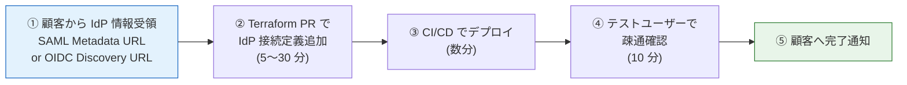

**目標リードタイム**：**< 1 営業日**（複雑な顧客でも 2〜3 営業日）

> **注**: 本フローは Layer 2（基盤側作業）のみ。Layer 1（顧客 IdP 側 RP 登録）は §FR-2.3.2.A の IdP 別工数表、Layer 3（エンドユーザー体験 / 移行時の周知）は §FR-2.3.2.B チェックリストを参照。

#### 対応能力

| 機能 | Cognito | Keycloak | 備考 |
|---|:---:|:---:|---|
| Terraform / IaC | ✅ `aws_cognito_identity_provider` | ✅ `keycloak_*_identity_provider` | 両方標準 |
| SAML Metadata 自動取り込み | ✅ URL / XML 指定 | ✅ URL Import | 両方 |
| OIDC Discovery 自動取り込み | ✅ `.well-known` URL | ✅ Discovery URL | 両方 |
| セルフサービスポータル | ❌ 自前 | ⚠ プラグイン（Phase Two 等）| 将来検討 |

#### TBD / 要確認

| 確認項目 | 回答例 |
|---|---|
| オンボーディング主体 | 弊社運用チーム / 顧客企業の管理者（セルフサービス）|
| 目標リードタイム | < 1 営業日 / N 日 |
| IdP 情報の受領形式 | SAML Metadata URL / XML / OIDC Discovery URL / 手動 |
| SCIM プロビジョニング | 必要 / 不要（JIT で OK）|
| **新基盤導入時のドメイン変更計画**（[B-612](../../hearing-checklist.md)）| アプリ URL 維持 / 認証基盤 URL Custom Domain 持ち越し / 全 URL 新規 |
| **エンドユーザー周知のリードタイム期待値**（[B-613](../../hearing-checklist.md)）| 切替 2-4 週間前 / それ以下 / 顧客判断委ね |
| **顧客 IdP 管理者向けオンボーディング手順書テンプレ提供**（[B-614](../../hearing-checklist.md)）| 必須提供 / IdP 別個別作成 / 不要（顧客知見あり）|

---

### §FR-2.3.3 ログイン画面で IdP 選択 UX / Home Realm Discovery（→ FR-FED-013）

> **このサブ・サブセクションで定めること**: ユーザーがログイン画面に来た時、**どの IdP に振り分けるか**の UX 設計（メールドメイン HRD / IdP セレクター / 組織固有 URL / 識別子先行 / kc_idp_hint）。   
> **主な判断軸**: 推奨 UX パターン、メールドメイン → IdP 解決ルール、複数テナント所属時の選択 UI、ブランディング要件、**ヒントキーの選択（email vs 顧客独自 ID vs テナントコード）**   
> **§FR-2.3 内の位置付け**: §FR-2.3.1 並行運用・§FR-2.3.2 オンボーディングを**エンドユーザー体験**として完成させる UX 層   
> **⚠ 前提依存**: A 案（メールドメイン HRD）は**ユーザーが email を持つことを前提**とする。[§FR-1.2.0.D](01-auth.md#fr-120d-ユーザー識別子戦略--メール非保有顧客独自-id-への対応) で確定したように email 非保有ユーザー（フィールドワーカー / 工場 / 病院 / 小売 / 教育）を収容する場合、A 案単独では破綻する。**email 非保有時の HRD ヒントキー拡張は [§FR-2.3.3.E](#fr-233e-email-非保有時の-hrd-パターン拡張--ヒントキーの選択) を参照**

#### 5 案併記（要件次第で選定、ハイブリッド併用も可）

| 案 | ヒントキー | UX | 実装 | 採用例 | email 非保有時 |
|---|---|:---:|---|---|:---:|
| **A. メールドメインベース HRD**（email あり時の推奨）| email の @domain | ◎ ユーザーは email だけ入れれば OK | 基盤側にドメイン → IdP マッピングテーブル | Auth0、Entra ID、Notion | ❌ **破綻** |
| B. IdP セレクター（ボタン選択）| ユーザーが選択 | ○ ボタン選択 | Keycloak 標準 / Cognito Hosted UI カスタム | Google、多くの SaaS | ✅ 動作可 |
| C. 組織固有ログイン URL（サブドメイン / パス）| URL 自体 | ◎ ブランディング両立 | Custom Domain（[§FR-2.1](#31-idp-接続種別-fr-fed-21)）+ ルーティング | Slack（`workspace.slack.com`）、Figma、Atlassian Cloud | ✅ 動作可（**email 非保有時の第一推奨**）|
| **D. 識別子先行（Identifier-First）**| 顧客独自 ID パターン | ○ ユーザー ID 入力 | 基盤側に「ID パターン → IdP」マッピング（例：`ACME-*` → Acme IdP）| Microsoft 365 sign-in name、Auth0 Identifier-First | ✅ 動作可 |
| **E. `kc_idp_hint` URL パラメータ**（ポータル / SPA から hint 注入）| URL クエリパラメータ | ◎ Keycloak ログイン画面スキップ | Keycloak 標準 `?kc_idp_hint=acme` | 自社ポータル経由のディープリンク | ✅ 動作可 |
| **A + C ハイブリッド**（複数顧客 × 複数サービス時の業界実用解）| email + URL | 基本 A、大口顧客のみ C | Single Realm + Front Proxy で URL → `kc_idp_hint` 自動付与 | Microsoft 365 + Enterprise オプション、Atlassian Cloud | C 部分のみ ✅ |
| **A + C + D ハイブリッド**（email-mix 顧客対応版）| email or 独自 ID | email 顧客は A、email 非保有顧客は D / C | Identifier-First + ドメイン判定 fallback + 組織固有 URL | LinkedIn / Workday の混在モデル | ✅ 完全対応 |

→ 上記は**相互排他ではない**。**顧客に email 非保有ユーザーが含まれる場合、A 案単独は不採用**。複数顧客 × 複数サービスのシナリオでは **A 基本 + email 非保有顧客は D or C 併用** が実用解（[§FR-2.3.3.E](#fr-233e-email-非保有時の-hrd-パターン拡張--ヒントキーの選択)）。Keycloak での具体構成は [§FR-2.3.3.C](#fr-233c-keycloak-でのハイブリッド構成リファレンス基本-a--大口顧客のみ-c)、採用方針確認は [B-618](../../hearing-checklist.md) / [B-IDM-2](../../hearing-checklist.md) を参照。

#### A 案（メールドメイン HRD）のフロー

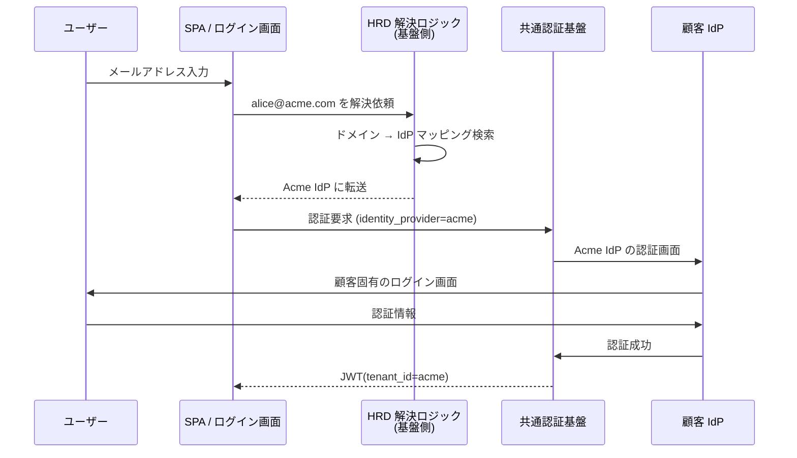

#### 対応能力

| パターン | Cognito | Keycloak |
|---|:---:|:---:|
| IdP セレクター（ボタン）| ⚠ Hosted UI カスタム | ✅ **自動表示** |
| メールドメイン HRD | ⚠ 自前実装（Lambda + Custom UI） | ⚠ プラグイン or カスタム |
| 組織固有 URL | ✅ Custom Domain | ✅ Hostname / Realm 別 |
| SPA 変更要否（顧客追加時）| ⚠ IdP ボタン追加要 | ✅ **不要** |

#### §FR-2.3.3.A 画面所在マトリクスとカスタマイズ 4 パターン

> **詳細は [ADR-024 ログイン画面アーキテクチャとブランディング 4 パターン](../../../adr/024-login-screen-architecture-branding.md) を参照**

> **このサブ・サブセクションで定めること**: 「画面が認証基盤上 vs アプリ側のどちらに存在するか」で**カスタマイズ可能範囲と実装手段が決定的に変わる**ことを明示し、ブランディング設計を 2 軸（アプリ別 / 顧客別）から 4 パターンに分類して推奨を確定する。あわせて「2 回ログイン問題」（顧客誤解への対応）も扱う。   
> **主な判断軸**: アプリ別ブランディング有無（A-11）、顧客別ブランディング有無（A-11-α）、URL 肥大化制約（Cognito Branding Style 20 上限）、L4-L8 カスタマイズ要否   
> **§FR-2.3.3 内の位置付け**: UX パターン（HRD / セレクター / 組織固有 URL）とは**別軸の「ブランディング層の責務分担」**

##### 結論サマリ：2 軸 × Yes/No で 4 パターン自動判定

| 軸 1（アプリ別）| 軸 2（顧客別）| 結果パターン | 採用シーン |
|:---:|:---:|:---:|---|
| ❌ No | ❌ No | **パターン A** | アプリ画面のみ（Slack/Notion 型）|
| ✅ Yes | ❌ No | **パターン A'** | アプリ間差別化（**業界主流**、Auth0/Entra/Okta 型）|
| ❌ No | ✅ Yes 部分 | **パターン B** | 顧客別（Cognito 20 上限、規制業種）|
| - | ✅ Yes 完全分離 | **パターン C** | Pool/Realm 分離、Enterprise プラン |

##### 4 パターン比較（決定版）

| 軸 | A | A' | B | C |
|---|:---:|:---:|:---:|:---:|
| 認証基盤側カスタマイズ単位 | ❌ 共通 | **✅ アプリ単位**（client_id）| ✅ テナント単位 | ✅ テナント単位（物理分離）|
| Cognito 制約 | なし | 20 Branding Style 上限 | 20 顧客上限 | Pool 分離（10,000 Pool）|
| Keycloak 制約 | なし | なし | Realm 分離 or Theme | Realm 分離（数千）|
| 必要ティア（Cognito）| Lite OK | **Essentials+** | Essentials+ | Lite OK |
| 業界実例 | Slack / Notion | **Auth0 / Entra / Okta / Cognito Managed Login** | 規制業種 | 金融 |

##### 主要な裏どり（詳細は ADR-024）

- **画面の物理的所在**：ID/PW・MFA・パスワードリセット・同意画面は**必ず認証基盤側**。Same-Origin Policy 制約でアプリ JS から触れない
- **❷ 顧客 IdP の画面は本基盤管轄外**（Entra ID なら Company Branding 機能で顧客 IT 部門が管理）
- **「2 回ログイン」と見える操作の多くは認証 1 回のみ**（業界標準）。MFA 重複は別問題で [§FR-2.2.3](#fr-223-mfa-重複回避--fr-fed-012) で対応
- **L4-L8（HTML 構造変更）が必要なら Keycloak 必須**（Cognito Managed Login は L1-L3 のみ）
- **パターン A' の動作原理**：OAuth `client_id` クエリパラメータで Client 識別 → Branding/Theme 解決

##### ベースライン

| 項目 | 推奨 |
|---|---|
| **デフォルト** | **パターン A**（認証基盤は最小、アプリ側で完全カスタマイズ）|
| **アプリ間差別化が必要** | **パターン A'**（業界主流、Cognito Branding Style / Keycloak Login Theme Override）|
| 顧客から「ログイン画面に自社ロゴ」要望 | パターン B（Cognito 20 上限 / Keycloak カスタム Theme）|
| 大口顧客の「完全専用」要望 | パターン C（Enterprise プラン化）|
| 認証前識別子 | **`client_id`**（OAuth 標準、A' で利用）|
| 認証後識別子 | **JWT `tenant_id` クレーム**（A / A' でアプリ側が利用）|

##### 顧客との対話：要望の翻訳表

| 顧客要望 | 真意の確認 | 対応 |
|---|---|---|
| 「テナントごとにブランディング」 | ログイン画面? アプリ内? | アプリ内のみ = **A** / ログイン画面まで = **B** |
| 「経費精算と決済で違うブランド体験にしたい」 | アプリ単位差別化 | **パターン A'** |
| 「完全に自社専用にしたい」 | 全画面なら | **C**（Enterprise）|
| 「迷わないようにしたい」 | UX 問題 | **A** + HRD で十分 |

##### 顧客対話用テンプレート（「2 回ログイン」誤解への回答）

```
顧客「フェデなのに 2 回ログインさせるのか?」

回答:
「実は『2 段階操作』に見えますが、認証（パスワード入力）自体は 1 回だけです。
  ❶ 本基盤の画面でメール入力 → 『どの会社の IdP に振り分けるか』を決める識別子入力
  ❷ 御社の Entra ID で ID/PW + MFA → 本物の認証
Microsoft 365 / Slack / Notion / Salesforce 等の業界標準 SaaS で全て採用。
SSO の本当の効果は『2 回目以降の操作不要』。」
```

##### ヒアリング推奨順序

1. **[A-11](../../hearing-checklist.md)**（軸 1: アプリ別）を Yes/No で確認
2. **[A-11-α](../../hearing-checklist.md)**（軸 2: 顧客別）を No / Yes 部分 / Yes 完全分離 で確認
3. 上表で自動判定されたパターン（A / A' / B / C）を顧客に提示・合意取得
4. **[A-11-2](../../hearing-checklist.md)**（アプリ側実装責務）+ **[A-11-3](../../hearing-checklist.md)**（カスタマイズ L1-L8）で詳細確定

→ 2 軸の合意取得により、**[B-612](../../hearing-checklist.md) / [B-703-3](../../hearing-checklist.md) / [B-208](../../hearing-checklist.md) / [B-703-1](../../hearing-checklist.md) の 4 項目が自動的に決まる**。


#### §FR-2.3.3.B フローのカスタマイズ責務（3 領域の整理）

> **このサブ・サブセクションで定めること**: 「ログイン**フロー**を変えたい」要望に対する責務分担。§FR-2.3.3.A が**画面の所在**で整理したのに対し、本節は**フローの構成要素ごとの設定場所**で整理する。   
> **主な判断軸**: 変えたいフロー要素が「基盤の事前」「IdP 内部」「基盤の事後」のどこに属するか   
> **§FR-2.3.3 内の位置付け**: §FR-2.3.3.A 画面責務分担 と並列の「フロー責務分担」軸

##### フローは 3 領域に分かれる

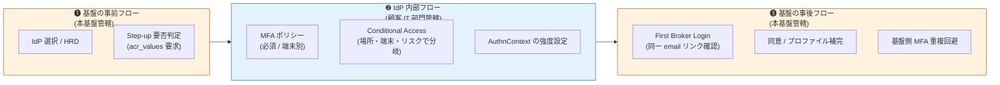

##### 変えたいフロー要素 → 設定場所マッピング

| 変えたい項目 | 設定場所 | 具体的手段 | 関連章 |
|---|---|---|---|
| 「どの IdP に振り分けるか」のロジック | **❶ 本基盤** | HRD マッピング / IdP セレクター UI | [§FR-2.3.3](#fr-233-ログイン画面で-idp-選択-ux--home-realm-discoveryfr-fed-013) |
| 「MFA を必須化 / 端末ごとに分岐」 | **❷ 顧客 IdP** | Entra Conditional Access / Okta Sign-on Policy | 顧客 IdP 管理画面 |
| 「特定リスクで MFA を強化（Step-up）」 | **❶ + ❷ 連携** | 基盤側で `acr_values` 要求 → IdP 側で AuthnContext 対応 | [§FR-2.2.3 MFA 重複回避](#fr-223-mfa-重複回避--fr-fed-012) |
| 「初回ログイン時に同一 email 既存ユーザーへリンク確認」 | **❸ 本基盤** | Keycloak First Broker Login Flow / Cognito Pre Sign-up Lambda | [§FR-2.2.1.A](#fr-221a-同一テナント内ユーザー重複の扱い) |
| 「初回ログイン時に追加属性を入力させる」 | **❸ 本基盤** | Keycloak Required Actions / Cognito 自前画面 | [§FR-7.3 セルフサービス](07-user.md) |
| 「同意画面を出す」 | **❸ 本基盤** | Keycloak Consent / Cognito Hosted UI 設定 | [§FR-4.0 SSO 基本](04-sso.md) |
| 「IdP 認証成功後にカスタムロジック実行」 | **❸ 本基盤** | Cognito Post Authentication Lambda / Keycloak Event Listener | [§FR-9.3 Webhook](09-integration.md) |
| 「IdP 側の認証強度を上げる」 | **❷ 顧客 IdP** | 顧客 IdP のセキュリティポリシー（パスワード強度 / リスクベース等）| 顧客 IdP 管理画面 |

##### よくある顧客要望 → 対応場所の翻訳表

「ログインフローをこうしたい」と言われた時、責務領域を即時判別するための対応表:

| 顧客要望 | 真の領域 | 対応場所 | 顧客への説明ポイント |
|---|:---:|---|---|
| 「MFA を SMS で統一」 | ❷ | **顧客 IdP 側で MFA ポリシー設定** | フェデユーザーの MFA は顧客 IdP 管轄。基盤側で強制はできない（[§FR-2.2.3](#fr-223-mfa-重複回避--fr-fed-012)）|
| 「初回ログインで部署を入力」 | ❸ | **本基盤の Required Actions / 自前画面** | 基盤側で追加画面を挿入する設計。顧客 IdP では実現不可 |
| 「特定アプリだけ強い MFA」 | ❶ + ❷ | **基盤で `acr_values` を要求 + 顧客 IdP で AuthnContext 対応** | 基盤と IdP の双方で実装連携が必要 |
| 「ログイン後の同意画面を消す」 | ❸ | **本基盤の Consent 設定** | Keycloak は client-level 設定で off、Cognito は Hosted UI 設定 |
| 「IdP セレクター画面を出したくない」 | ❶ | **本基盤の HRD / 組織固有 URL 採用** | パターン C（[§FR-2.3.3.A 画面数を 1 つに減らす設計選択肢](#fr-233a-画面所在マトリクスとカスタマイズ-3-パターン)）|
| 「顧客 IdP のパスワード強度を強化」 | ❷ | **顧客 IT 部門に依頼** | 本基盤管轄外、SOW で明示 |
| 「初回 SSO で email 確認モーダルを出す」 | ❸ | **本基盤の First Broker Login Flow** | Keycloak は標準フロー、Cognito は Pre Sign-up Lambda で実装（[§FR-2.2.1.A](#fr-221a-同一テナント内ユーザー重複の扱い)）|

→ **要望ヒアリング時は「変えたいのは ❶❷❸ のどこか」を即座に判別**し、❷ なら顧客 IT 部門依頼、❶❸ なら本基盤で対応可、と明確化する。**画面責務分担（§FR-2.3.3.A）と並列で意識**することが重要。

#### §FR-2.3.3.C Keycloak でのハイブリッド構成リファレンス（基本 A + 大口顧客のみ C）

> **詳細実装は [common/hrd-implementation-keycloak.md](../../../common/hrd-implementation-keycloak.md) を参照**（realm.json サンプル、CloudFront Function 実装、Stage B 検証推奨項目）

> **このサブ・サブセクションで定めること**: A + C ハイブリッド構成（基本 HRD + 大口顧客のみ組織固有 URL）の Keycloak 実装パターン。[B-618 採用方針](../../hearing-checklist.md) で「採用」と回答された場合の参照リファレンス。
> **主な判断軸**: 想定 C 経由顧客数、CloudFront Function 採用可否、DNS / ACM 管理体制
> **§FR-2.3.3 内の位置付け**: §FR-2.3.3 の 3 案併記（A/B/C）が相互排他ではないことを明示し、業界実用解としてのハイブリッド構成を具体化

#### なぜハイブリッドが必要か

**「全顧客 A 一律」では大口エンタープライズ顧客の「専用感」要求に応えられず、「全顧客 C 一律」では Cognito 4 顧客 Hard Limit / 運用負荷爆発の問題**。実用解は「基本 A、契約で大口のみ C」のハイブリッド:

| 顧客分類 | UX | 採用理由 |
|---|---|---|
| 一般顧客（中小規模 / 標準契約）| **A. HRD** | 1 URL 統一、運用負荷最小、マルチ所属対応容易 |
| 大口エンタープライズ顧客（契約で個別合意）| **C. 組織固有 URL** | フィッシング耐性 + 顧客別ブランディング + 「専用感」訴求 |

業界実例：Microsoft 365 / Notion / Atlassian Cloud（複数サービス系）は基本 A、Slack / Figma（単一サービス系）は基本 C。**本基盤と同型（複数サービス × 複数顧客）は A 基本 + 大口 C ハイブリッド** が現実的。

#### 推奨構成サマリ

- **Single Realm + Front Proxy**（CloudFront Function or Lambda@Edge）で **URL → `kc_idp_hint` 自動付与**
- Keycloak Hostname Provider で multi-hostname 許可
- First Browser Flow に **Identity Provider Redirector + HRD authenticator** を組み込み
- 全顧客 IdP を 1 Realm に集約（[ADR-017](../../../adr/017-multitenant-l2-single-realm.md) と整合）

詳細な realm.json / CloudFront Function 実装 / Stage B 検証推奨項目（HRD-B1〜B7）は [common/hrd-implementation-keycloak.md](../../../common/hrd-implementation-keycloak.md) を参照。

#### Cognito 採用時の制約

| 制約 | 内容 |
|---|---|
| Custom Domain | **4 / Region (Hard limit)** → C 経由は最大 4 顧客 |
| Branding Style 上限 | **20 / Pool** |
| **Cognito では A + C ハイブリッドは大口 4 顧客が限界** | Keycloak は理論的に無制限 |

→ **C 経由顧客が 5 社以上見込まれる場合、Keycloak 必須化のキーファクター**。

#### TBD / 要確認

[B-618 IdP 選択 UX のハイブリッド構成採用方針](../../hearing-checklist.md) で確認。

#### §FR-2.3.3.D Keycloak HRD 実装方式選定（Universal Login + 4 オプション + 単一テナント複数 IdP 対応）

> **このサブ・サブセクションで定めること**: HRD（A 案）を採用する場合の **実装層の選定**。具体的には (1) アーキテクチャモデル（Universal Login vs アプリ主導）、(2) Keycloak での HRD 実装 4 オプションの選定、(3) 単一テナントが複数 IdP を持つ場合の対応パターン を要件として確定する。
> **主な判断軸**: RHBK 採用予定の有無、Elastic License v2 受容可否、v26 Organizations の採用方針、想定される単一テナント複数 IdP シナリオ
> **§FR-2.3.3 内の位置付け**: §FR-2.3.3 で「A 案 HRD 推奨」が決まった後の **実装層の設計判断**。§FR-2.3.3.C ハイブリッド構成の HRD 部分の実装方法。
> **詳細実装リファレンス**: [common/hrd-implementation-keycloak.md](../../../common/hrd-implementation-keycloak.md)（realm.json サンプル + Browser Flow 設定 + Stage B 検証推奨項目）

##### ベースライン: Universal Login（アプリ主導 HRD は採らない）

| 観点 | アプリ主導 HRD | **Universal Login（ベースライン）** | Identity-First Login（**UX 最適化として推奨**）|
|---|---|---|---|
| メアド入力フィールドの場所 | 各アプリの画面 | 認証基盤の `/auth` ページ | アプリ側 + 認証基盤両方 |
| マッピング知識の所在 | アプリに分散 | **認証基盤に集約** | 認証基盤に集約 |
| 顧客追加時の変更箇所 | 各アプリ | **認証基盤 1 箇所** | 認証基盤 1 箇所 |

→ **Identity Broker パターン採用以上、Universal Login が論理的帰結**。アプリ主導 HRD は「顧客追加で各システム変更不要」要件（§FR-2.3）と矛盾するため非採用。

**アプリ UX 最適化を求める場合**: Identity-First Login を選択。アプリのランディング画面にメアド入力フィールドだけ置き、OIDC `login_hint` パラメータで認証基盤にメアドを渡す。マッピング知識は基盤集約のまま、UX 体験はアプリ側で完結。

##### Keycloak での HRD 実装 4 オプション

| # | オプション | 工数 | ライセンス | RHBK サポート | 単一テナント複数 IdP | 本基盤推奨度 |
|---|---|---|---|:---:|:---:|:---:|
| ① | **Keycloak v26 Organizations（ネイティブ）** | ◎ 設定のみ | ✅ 公式 | ✅ 対象 | ✅ ネイティブ | ★★★★★ |
| ② | コミュニティプラグイン `keycloak-home-idp-discovery` | ◎ JAR 配置 | ⚠ Elastic License v2 | ❌ 対象外 | ⚠ 別途設定 | ★★★★ |
| ③ | 自前 Authenticator SPI（Java 実装）| ❌ 1-2 週間 | ✅ 自社所有 | ❌ 対象外 | ⚠ 実装次第 | ★★ |
| ④ | アプリ主導 + `kc_idp_hint` URL パラメータ | ◎ ゼロ | ✅ 標準 | ✅ 対象 | ❌ アプリで処理 | ★（ハイブリッド C 経路の裏で使用のみ）|

**ベースライン**: **① Keycloak v26 Organizations**。RHBK 採用予定の有無に関わらず第一推奨。理由:
- v25 Preview / v26 GA で Red Hat 公式ロードマップに乗る本命機能
- プラグイン不要、ライセンス問題なし、Red Hat サポート対象（RHBK 採用時）
- **単一テナント複数 IdP のケースでデフォルトで 2 段階セレクターに分岐するネイティブ動作**

**例外的に ② プラグインを採る場合**: Elastic License v2 が受容可能で、v25 以前への互換性が必要なケース。  
**例外的に ③ 自前 SPI を採る場合**: ヘルスケア・政府機関等で OSS plugin の採用が政策上不可なケース。

##### 単一テナントが複数 IdP を持つ場合（4 パターン）

| パターン | シナリオ | Keycloak Organizations での対応 |
|---|---|---|
| **A. ドメインサブ分割** | `@hq.acme.com` → Entra ID / `@sub.acme.com` → Okta | Organization の `domains` ↔ `identityProviders` マッピングで自動振り分け |
| **B. テナント確定後セレクター**（**本命**）| `@acme.com` の中に Entra ID 派 + Okta 派が混在（移行期 / 子会社統合等）| Organizations が複数 IdP を持つ Org で **デフォルトで 2 段階フロー（メアド → そのテナントの IdP セレクター）に自動分岐** |
| C. 既存ユーザーの前回 IdP 直行 | リピーターはセレクター省略 | Browser Flow に `Detect Existing Broker User` + 強制切替パラメータを組合せ |
| D. アプリ主導の明示指定 | 特権ユース（普段 Entra、特権操作で Okta）| アプリのリンク URL に `?kc_idp_hint=...` を埋め込み |

**ベースライン**: **A + B を主、C + D を補助** とする運用。Organizations 採用なら A も B も自動で動作する。

##### 既存設計との整合性

| 既存設計 | 本選定との整合 |
|---|---|
| [§FR-2.3.3 A 案 HRD 推奨](#fr-233-ログイン画面で-idp-選択-ux--home-realm-discoveryfr-fed-013)（メールドメインベース）| ✅ 本選定は A 案実装の選択肢を定義 |
| [§FR-2.3.3.C A+C ハイブリッド](#fr-233c-keycloak-でのハイブリッド構成リファレンス基本-a--大口顧客のみ-c) | ✅ A 経路の実装方式として Organizations を採用、C 経路は CloudFront Function で `kc_idp_hint` 付与 |
| [§FR-2.3.A 単一 Pool/Realm + 複数 IdP](#fr-23a-アーキテクチャ判断単一-poolrealm--複数-idp-を採用) | ✅ Single Realm 維持、Organizations は Realm 内のサブ単位として共存 |
| [§FR-2.3.A.1 論理分離（`tenant_id`）](#fr-23a1-何が分離共有されているか--論理分離の実態顧客が必ず聞く論点) | ✅ Organization 属性 → user attribute の Mapper で `tenant_id` クレームを自動注入可能 |
| [§FR-2.2.1.A 同一テナント内ユーザー重複](#fr-221a-同一テナント内ユーザー重複の扱い) | ✅ First Broker Login Flow と整合、パターン C（前回 IdP 記憶）と連動可 |
| [B-618 A+C ハイブリッド採用方針](../../hearing-checklist.md) | 本選定（実装方式）はその裏付け |

##### 推奨初期ロールアウト（[§FR-2.3.3.C](#fr-233c-keycloak-でのハイブリッド構成リファレンス基本-a--大口顧客のみ-c) と連動）

| フェーズ | 内容 | 時期 |
|---|---|---|
| **Phase 1** | Keycloak v26 + Organizations feature flag 有効化 + 1 Organization で fresh import 検証 | Stage B 期間 |
| **Phase 2** | 実顧客の Organization 追加（ドメインサブ分割 = パターン A） | リリース時 |
| **Phase 3** | 単一ドメイン内に複数 IdP のテナント（移行期顧客等）が発生 = パターン B | 顧客発生時 |
| **Phase 4** | 大口顧客向け組織固有 URL（[§FR-2.3.3.C](#fr-233c-keycloak-でのハイブリッド構成リファレンス基本-a--大口顧客のみ-c)）= A+C ハイブリッド完成 | 大口受注後 |

→ 詳細な Stage B 検証推奨項目（HRD-B1〜B7）は [hrd-implementation-keycloak.md §6](../../../common/hrd-implementation-keycloak.md) 参照。

---

#### §FR-2.3.3.E email 非保有時の HRD パターン拡張 — ヒントキーの選択

> **詳細は [ADR-020 HRD ヒントキー戦略 + 混在 Identifier-First](../../../adr/020-hrd-hint-keys-mixed-login.md) を参照**

> **このサブ・サブセクションで定めること**: [§FR-1.2.0.D](01-auth.md#fr-120d-ユーザー識別子戦略--メール非保有顧客独自-id-への対応) で email 非保有ユーザーを受け入れる前提を確定したことに伴い、HRD パターン A（メールドメイン HRD）が破綻するシナリオの代替を確定。**HRD の本質は「ヒントキー → IdP マッピング」であり、ヒントキーは email ドメインに限らない**ことを明示する。   
> **主な判断軸**: 顧客側 email 保有率（B-IDM-1 / B-IDM-10）、顧客独自 ID 体系、テナント数規模、ユーザーの認知負荷許容度   
> **§FR-2.3.3 内の位置付け**: §FR-2.3.3 メイン 5 案併記表で **A 案が email 非保有時に破綻**するシナリオの代替パターンを確定

#### HRD ヒントキーは「email ドメイン」とは限らない

業界一般定義（Auth0 / Microsoft / Scalekit）:
> **HRD = ユーザーがどの IdP / realm に属するかを認証情報の入力前に判定する仕組み**

5 案 + 補助 2 案: A email / B セレクター / **C URL（組織固有）** / **D 識別子先行** / **E `kc_idp_hint`** / ⑥ Cookie / ⑦ IP。

#### 顧客状況別の推奨パターン

| 顧客状況 | 推奨 HRD パターン |
|---|---|
| 全員 email 保有 + 1 顧客 = 1 ドメイン | A（email ドメイン HRD）|
| email 一部のみ保有（混在）| **D + A ハイブリッド** |
| 全員 email 非保有 + 単一顧客 | **C（組織固有 URL）** |
| 全員 email 非保有 + 複数顧客 | **C + E（kc_idp_hint）** |
| ポータル経由ディープリンクが主 | **E（kc_idp_hint）+ C フォールバック** |

→ **すべての案で「最終的に B（IdP セレクター）にフォールバック」が業界標準**。

#### 我々のスタンス

打ち合わせ前のデフォルト = **D（識別子先行）+ C（組織固有 URL）+ B（フォールバック）**。A は email 保有顧客のみオプション扱い。

---

#### §FR-2.3.3.F フェデユーザー + ローカルユーザー混在時の Identifier-First 設計（Keycloak v26 Organizations 標準動作）

> **詳細は [ADR-020 HRD ヒントキー戦略 + 混在 Identifier-First](../../../adr/020-hrd-hint-keys-mixed-login.md) を参照**

> **このサブ・サブセクションで定めること**: 1 つの認証基盤に**フェデユーザー（顧客 IdP 経由）とローカルユーザー（共通基盤 DB 直接登録）が同居する**シナリオで、共通ログイン画面が両方を**同じ画面で安全に振り分ける**仕組み。Keycloak v26 Organizations の標準動作で何ができるかを確定する。   
> **主な判断軸**: ローカルユーザーの存在範囲（[§FR-1.2.0.0](01-auth.md#fr-1200-ローカルユーザーとは何か--利用者カテゴリ別の分析) シナリオ γ / β）、混在時の同一画面振り分け要件、Keycloak v26 Organizations 採用方針、ヒントキー戦略（[§FR-2.3.3.E](#fr-233e-email-非保有時の-hrd-パターン拡張--ヒントキーの選択)）   
> **§FR-2.3.3 内の位置付け**: §FR-2.3.3.E でヒントキーを決めた後の「ヒントキー判定後の分岐ロジック」を確定

#### 重要発見：Keycloak v26 Organizations が混在を最初から想定

Keycloak 公式ブログ（2024-06）からの引用:
> "The main change to the browser flow is that it **defaults to an identity-first login** so that users are identified before prompting for their credentials."
> "A user will act as an existing realm user that has an email that matches one of the domains set to an organization but is not yet a member of the organization."

→ v26 Organizations の標準 Browser Flow が「Identifier-First → Organization マッチング → IdP / Local 振り分け」を自動でやる。

#### 4 実装パスと顧客状況別推奨

| 実装パス | 推奨度 |
|---|:---:|
| **① v26 Organizations 標準** | ★★★★★（email あり時）|
| ② Conditional Authenticator（公式）| ★★★★ |
| **③ Custom Conditional Authenticator SPI** | ★★（email 非保有時に必要）|
| ④ コミュニティ `keycloak-home-idp-discovery` | ★★ |

| 顧客状況 | 推奨実装 |
|---|---|
| 全員 email 保有 | ① のみ |
| email 一部のみ保有 | ① + ③ |
| 全員 email 非保有 | ③ + C 案 URL |

#### 業界実例（混在ハンドリング UI）

| サービス | UI パターン |
|---|---|
| Notion | email / password 分離フィールド、Identifier-First |
| Dropbox | enterprise 認証検出で password フィールド隠し |
| Freshworks | テナント特定後、組織固有ログインページに redirect |

#### 「混在 realm」運用上の主な注意点

- 同一 email がフェデ / ローカルで重複 → Layer A `sub` で完全分離（ADR-018）
- Organization メンバーかつローカル PW を持つユーザー → 「フェデ強制」or「ローカル PW 残置」ポリシー選択
- 未登録 email アクセス → Generic error + 一定待機（user enumeration 対策）

---

#### TBD / 要確認

| 確認項目 | 回答例 |
|---|---|
| 推奨 UX パターン | メールドメイン HRD / IdP セレクター / 組織固有 URL / 識別子先行 |
| メールドメインから IdP への解決ルール | 1 ドメイン = 1 IdP / 1 顧客に複数ドメイン |
| 複数テナント所属時の選択 UI | ログイン後にテナント選択 / 別途 |
| ログイン画面のブランディング | 共通 UI / 顧客企業ごとカスタマイズ |
| **カスタマイズの所在**（§FR-2.3.3.A）| **認証基盤側のみ（A 推奨）/ 一部認証基盤（B）/ 全面（C）** |
| **A + C ハイブリッド構成採用方針**（[B-618](../../hearing-checklist.md) / §FR-2.3.3.C）| 採用（大口顧客のみ C） / 採用しない（全顧客 A 一律） / 検討中 |
| **HRD 実装方式**（§FR-2.3.3.D）| ① v26 Organizations（推奨） / ② sventorben プラグイン / ③ 自前 SPI / ④ kc_idp_hint（基盤 HRD 無し）|
| **単一テナント複数 IdP の想定**（§FR-2.3.3.D）| 想定あり（ドメイン分割可） / 想定あり（同一ドメイン内多 IdP）/ 想定なし |
| **ヒントキー戦略**（§FR-2.3.3.E、[B-IDM-1](../../hearing-checklist.md) 連動）| email ドメインのみ / 顧客独自 ID 併用 / 組織固有 URL 主 / kc_idp_hint 主 / 混在対応 |
| **email 非保有顧客の HRD パターン**（§FR-2.3.3.E）| D（識別子先行）/ C（組織固有 URL）/ E（kc_idp_hint）/ B（フォールバック）|
| **C 案 URL 命名**（§FR-2.3.3.E）| サブドメイン（`acme.basis.example.com`）/ パスベース（`/t/acme`）/ 採用しない |
| **フェデ + ローカル混在ハンドリングのポリシー**（§FR-2.3.3.F）| ① v26 Organizations 標準（推奨）/ ② Conditional Authenticator / ③ Custom SPI / ④ コミュニティプラグイン |
| **Organization メンバーかつローカル PW を持つユーザーの扱い**（§FR-2.3.3.F）| フェデ強制（ローカル PW 廃止）/ ローカル PW 残置（Break Glass）/ 顧客選択 |
| **未登録 email アクセス時のエラー文言**（§FR-2.3.3.F）| Generic error（user enumeration 対策）/ 詳細メッセージ（UX 優先）|

---

### 参考資料（§FR-2.3 全体）

- [Keycloak Multi-Tenancy Options - Phase Two](https://phasetwo.io/blog/multi-tenancy-options-keycloak/)
- [Keycloak Scalability of IdPs - GitHub Issue](https://github.com/keycloak/keycloak/issues/30084)
- [Microsoft - Home Realm Discovery Policy](https://learn.microsoft.com/en-us/entra/identity/enterprise-apps/home-realm-discovery-policy)
- [Auth0 B2B Authentication](https://auth0.com/docs/get-started/architecture-scenarios/business-to-business/authentication)
- [Scalekit - B2B Universal vs Org-Specific Logins](https://www.scalekit.com/blog/designing-b2b-authentication-experiences-universal-vs-organization-specific-login)
- [WorkOS - Model B2B SaaS with Organizations](https://workos.com/blog/model-your-b2b-saas-with-organizations)

---

## §FR-2.4 外部 SP（SaaS）連携 — ServiceNow ケース（→ FR-FED §2.4）

> **このサブセクションで定めること**: 本基盤を **IdP**、外部 SaaS（ServiceNow / Salesforce 等）を **SP** とする発行側連携のうち、特に ServiceNow ケースの設計方針。**SSO + プロビジョニング + ユーザーマスタ所在**の 3 軸の選択を確定する。   
> **主な判断軸**: 既存 ServiceNow ユーザー数 / 業務オーナーシップ、プロビジョニング自動化要求、ユーザーマスタを ServiceNow に残すかどうか   
> **§FR-2 全体との関係**: §FR-2.1〜§FR-2.3 は本基盤が受信側（顧客 IdP → 基盤）のフェデレーション。本サブセクションは**本基盤が発行側**（基盤 → SaaS SP）のシナリオ
>
> **詳細は [ADR-023 ServiceNow SP 連携設計](../../../adr/023-servicenow-sp-integration.md) を参照**

### §FR-2.4.0 背景

打ち合わせインプット 3 点目で「**現行は ServiceNow と連携あり、ServiceNow ユーザーは ServiceNow 側で管理、これも SSO 対象としたい**」が確定。本基盤は ServiceNow に対して **IdP として SAML 発行**する必要がある。ServiceNow は自身のユーザー DB（`sys_user`）を持つため、**認証 ↔ ユーザーマスタの所在 ↔ プロビジョニング方向**の 3 軸が独立した設計論点になる。

### §FR-2.4.A 結論サマリ

| 項目 | 採用方針 |
|---|---|
| **SSO プロトコル** | **SAML 2.0**（ServiceNow Multi-Provider SSO Plugin、業界標準）|
| **Provisioning** | **SAML JIT Provisioning**（ServiceNow が初回 SSO 時に自動作成）|
| **ユーザーマスタ** | **ServiceNow に残す**（業界標準、業務データ・履歴を壊さない）|
| **既存 ServiceNow ユーザー** | `user_name` を Layer B `external_id` として突合（[ADR-018](../../../adr/018-user-identifier-3layer-emailless.md) と整合）|

### §FR-2.4.B 主要な裏どり（詳細は ADR-023）

- ServiceNow **Multi-Provider SSO Plugin** が SAML / OIDC 両対応、複数 IdP 並列接続可
- **SAML JIT Provisioning** は ServiceNow 側で `User Provisioning Enabled = Yes` だけで動作（最少工数）
- ⚠ **2025-11 KB2599716**: Microsoft Entra 経由の SCIM プロビは ServiceNow が非サポート公表 → SCIM Push（パターン C）は自前実装・SI 保証外
- 4 パターン比較：A SSO のみ / **B SSO + SAML JIT（推奨）** / C SSO + SCIM Push / D 双方向同期（推奨せず）

#### 既存 SN ローカルユーザーの SSO 化（追加論点、[ADR-023 §J](../../../adr/023-servicenow-sp-integration.md#j-既存-servicenow-ローカルユーザーの-sso-化フローservicenow-のみに存在するユーザーの取扱い)）

「現状 ServiceNow にしか居ないローカルユーザー」の取扱いには **4 つの選択肢**:

| # | 案 | 認証ソース | 他アプリ SSO | 採用シーン |
|:---:|---|---|:---:|---|
| ① | IdP Keycloak（Tier 2）に移行 | IdP-KC | ✅ | 10M MAU + SSO 利用者 |
| ② | Broker 共通 Pool に移行 | Broker | ✅ | 中規模 + SSO 利用者 |
| ③ | 顧客 IdP（Entra/Okta）にリンク | 顧客 IdP | ✅ | 他 IdP アカウントあり |
| **④** | **ServiceNow ローカル残置**（NEW）| SN | ❌ | **SN-only ユーザー多数時**（業務委託 / 外部ベンダー等）|

#### ④ SN ローカル残置（移行しない選択肢）

ServiceNow は **per-user `sso_source` フィールド**で SSO 経路を制御可能（公式機能）。SN-only ユーザーは `sso_source` 空欄 → ローカル PW 認証へフォールバック。

| 観点 | 採用方針 |
|---|---|
| **認証** | per-user `sso_source` で SSO 経路制御、SN-only は SN ローカル PW |
| **前提** | **他アプリ SSO は利用不可**（Keycloak には存在しないため）|
| **適合シナリオ** | SN-only ユーザー（業務委託 / 外部ベンダー / 限定アクセス）が多い場合 |
| **トレードオフ** | 監査二元化（KC + SN）、規制業種では非推奨 |
| **使い分け** | ① + ④ ハイブリッド：SSO 利用者は ① 移行、SN-only は ④ で残置 |

#### ①〜③（移行する場合）の方針

| 観点 | 採用方針 |
|---|---|
| **認証ソース配置** | **10M MAU 規模 → IdP-KC（[ADR-033](../../../adr/033-keycloak-2tier-broker-idp-architecture.md) E 案）** / 中規模 → Broker 共通 Pool（[ADR-028](../../../adr/028-idpless-customer-local-user-management.md) A 案）|
| **PW 移行手段** | **User Storage SPI** で ServiceNow REST API 経由のキャッシュ移行（[ADR-019](../../../adr/019-existing-system-migration.md) ② と整合）|
| **SSO 開始後の SN ローカル PW** | **一般ユーザー無効化 + 管理者 1-2 名 Break Glass 残置**（業界標準）|
| **移行期間** | 3〜6 ヶ月（並走 → 切替 → 廃止の Phase 1-4）|
| **混在対応** | 社員（Entra ID 経由）+ SN のみのユーザー（IdP-KC 経由）を同一テナント内で並列 |

### §FR-2.4.C 我々のスタンス（基本方針に基づく）

| 基本方針の柱 | ServiceNow 連携での実現 |
|---|---|
| **絶対安全** | SAML 署名検証、`user_name` 一意キーの突合厳格化、退職時の即時無効化 |
| **どんなアプリでも** | ServiceNow / Salesforce / Workday 等の SaaS SP に汎用適用可（Multi-Provider SSO 標準）|
| **効率よく認証** | SAML JIT で自動プロビ、SCIM Push は大規模顧客のみオプション |
| **運用負荷・コスト最小** | パターン B は ServiceNow 設定のみで完結、追加実装ゼロ |

### §FR-2.4 TBD / 要確認（B-SN 系ヒアリング項目）

| 確認項目 | ヒアリング ID | 回答例 |
|---|---|---|
| ServiceNow 連携の対象範囲 | **B-SN-1** | SSO のみ / SSO + Provisioning / その他 SaaS（Salesforce / Workday）も含む |
| 既存 ServiceNow ユーザー数 / 規模 | **B-SN-2** | 全体合計 / 顧客あたり最大 |
| プロビジョニング方向 | **B-SN-3** | A SSO のみ / **B SSO + JIT（推奨）** / C SSO + SCIM Push / D 双方向 |
| SSO プロトコル | **B-SN-4** | **SAML 2.0（推奨・業界標準）** / OIDC（Tokyo+ 新規のみ）|
| 既存 `user_name` 体系 | **B-SN-5** | 顧客独自 ID と同じ（B-IDM-8 連動）/ 別 mapping 必要 / 不明 |
| 退職時の ServiceNow 側レコード扱い | **B-SN-6** | 残す（推奨・履歴保持）/ active=false 同期 / 物理削除 |
| Multi-Provider SSO Plugin 有効化状況 | **B-SN-7** | 既に有効 / 未有効（要設定）/ 不明 |
| 他 SaaS SP 連携の予定 | **B-SN-8** | Salesforce / Workday / その他 / なし |
