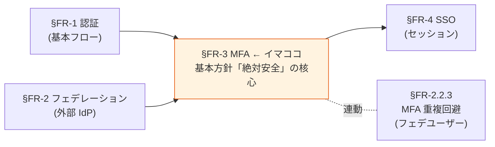
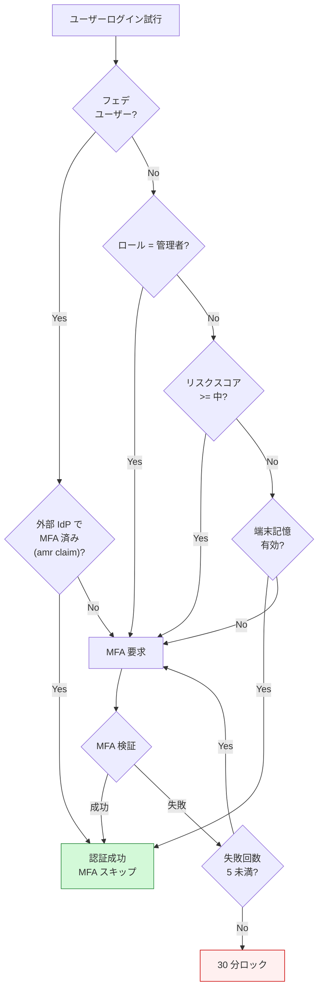

# §FR-3 MFA（多要素認証）

> 上位 SSOT: [00-index.md](00-index.md)   
> 詳細: [../../functional-requirements.md §3 FR-MFA](../../functional-requirements.md)、[../../../adr/009-mfa-responsibility-by-idp.md](../../../adr/009-mfa-responsibility-by-idp.md)   
> カバー範囲: FR-MFA §3.1 要素 / §3.2 適用ポリシー

---

## §FR-3.0 前提と背景

### 用語整理

| 用語 | 本基盤での意味 |
|---|---|
| **MFA（Multi-Factor Authentication）** | パスワード（知識）に加え、別の認証要素（所持 / 生体）を要求する仕組み |
| **AAL（Authentication Assurance Level）** | NIST が定義する認証の保証レベル。AAL1（パスワードのみ）/ AAL2（MFA 必須）/ AAL3（phishing-resistant MFA 必須） |
| **Phishing-resistant MFA** | フィッシング攻撃に耐えられる MFA。WebAuthn / FIDO2 / Passkey が代表 |
| **適用ポリシー** | MFA を「誰に・いつ・どんな条件で」要求するかのルール |
| **アダプティブ MFA** | ユーザーの行動・コンテキスト（IP / 地理 / デバイス）からリスクを動的判定し、必要な時だけ MFA を要求 |

### なぜここ（§FR-3）で決めるか



**MFA は基本方針 4 軸の「絶対安全」を実現する最重要要素**。理由：
- パスワード単独突破が依然として攻撃ベクター 1 位
- NIST SP 800-63B Rev 4 で AAL2 以上では MFA 必須化
- B2B SaaS では侵害被害が顧客全社に波及するため、MFA を疎かにできない

### 共通認証基盤として「MFA」を検討する意義

| 観点 | 個別アプリで実装した場合 | 共通認証基盤で実装した場合 |
|---|---|---|
| MFA 要素の一貫性 | アプリごとに別実装 → UX バラバラ | **基盤側で統一**、全システムで同じ MFA |
| 顧客企業のポリシー対応 | 各アプリで個別対応必要 | **基盤側のポリシー設定で一元化** |
| Passkey / WebAuthn 対応 | アプリごとに WebAuthn 実装 → 重い | **基盤側で標準提供**、アプリは JWT を信じるだけ |
| フェデユーザーの MFA 重複回避 | 各アプリで個別判定 | **基盤側で `amr` クレームを検査して一元判定**（[§FR-2.2.3](02-federation.md#323-mfa-重複回避--fr-fed-012)）|
| MFA 適用ポリシー変更 | 全アプリ改修が必要 | **基盤側設定のみで反映** |

→ 共通認証基盤で MFA を中央集約することが、基本方針「**絶対安全・どんなアプリでも・効率よく・運用負荷低**」を全て満たす唯一の道。

### §FR-3.0.A 本基盤の MFA スタンス

> **NIST SP 800-63B Rev 4 の AAL2（MFA 必須）以上に準拠する。Phishing-resistant な Passkey / WebAuthn を第一選択とし、TOTP / SMS / Email / ハードウェアキーも要件次第で対応。フェデユーザーは外部 IdP の `amr` クレームを検査して MFA 重複回避（[§FR-2.2.3](02-federation.md)）。**

### MFA 対象範囲は利用者カテゴリ・採用シナリオで変動

[§FR-1.2.0.0](01-auth.md#fr-1200-ローカルユーザーとは何か--利用者カテゴリ別の分析) で議論したローカルユーザー範囲シナリオによって、**本基盤側で MFA を提供する対象範囲が変わる**:

| カテゴリ | フェデユーザーか | 本基盤側 MFA の責任 | 採用シナリオでの含み方 |
|---|:---:|---|---|
| **P-1 基盤運用管理者** | フェデ（弊社内 IdP）+ Break Glass ローカル | フェデ側が一次責任（`amr` で検査） / Break Glass は本基盤 MFA 必須 | 全シナリオで対象 |
| **P-2 テナント管理者**（顧客 IdP あり）| フェデ | フェデ側 | β / γ |
| **P-2 テナント管理者**（IdP なし）| ローカル | **本基盤 MFA Must** | α / β |
| **P-3 IdP あり顧客従業員** | フェデ | フェデ側 | 全シナリオで対象（最大ボリューム）|
| **P-4 IdP なし顧客従業員** | ローカル | **本基盤 MFA 強推奨** | α / β |
| **P-5 ゲスト**, **P-6 B2C** | ローカル中心 | **本基盤 MFA Must（特に P-6）**| 要件次第 |

→ **γ シナリオ採用時は本基盤側で直接 MFA する対象が P-1 Break Glass + P-2 一部のみ**（数十名規模）に圧縮される。Cognito Plus ティアの侵害クレデンシャル検出（+$0.02/MAU）のコストインパクトもこの規模で評価する（[§NFR-8](../nfr/08-cost.md)）。

### 本章で扱うサブセクション

| サブセクション | 内容 | 関連 FR |
|---|---|---|
| §FR-3.1 MFA 要素 | どんな MFA 手段（TOTP / Passkey / SMS / Email / ハードウェアキー）を提供できるか | FR-MFA-001〜005 |
| §FR-3.2 MFA 適用ポリシー | いつ・誰に・どんな条件で MFA を要求するか | FR-MFA-006〜009 |
| §FR-3.3 ステップアップ認証（RFC 9470） | 操作の重要度に応じて動的に AAL を引き上げる仕組み | FR-MFA 全般 / FR-AUTHZ |
| §FR-3.3.A AAL 不整合の具体例とフロー | 顧客 IdP の AAL 実装差異と本基盤側ステップアップによる補完（4 シナリオ + mermaid フロー）| FR-MFA / FR-FED-012 |
| **§FR-3.4 全顧客 MFA 必須化と基盤側保持データの最小化** ★NEW | 顧客 IdP MFA 状態バラツキ環境で**全件 MFA 必須化**しつつ**保持データ最小化**する方針（信頼レベル評価方式 + WebAuthn 主体）| FR-MFA / FR-FED-012 |
| **§FR-3.5 amr クレーム評価の信頼性根拠** ★NEW | §FR-3.4 案 3 で採用する amr 評価が業界標準的に安全である根拠（署名検証 + ホワイトリスト + RFC 8176）+ **§FR-3.5.6 SAML 経由 IdP の MFA 評価**（amr では不可、AuthnContextClassRef + authnmethodsreferences が必要）+ **§FR-3.5.7 OIDC/SAML 統合評価実装方針**（統一 `mfa_indicator` 属性への正規化）| FR-MFA / FR-FED-012 |

---

## §FR-3.1 MFA 要素（→ FR-MFA §3.1）

> **このサブセクションで定めること**: 本基盤がサポートする MFA 認証手段（TOTP / WebAuthn・Passkeys / SMS OTP / Email OTP / バックアップコード / ハードウェアキー）の範囲と推奨度。   
> **主な判断軸**: 目標 NIST AAL レベル、Passkeys を Must とするか、SMS / Email OTP の必要性、ハードウェアキー対応   
> **§FR-3 全体との関係**: §FR-3.1 = 「**何で MFA するか**」、§FR-3.2 = 「**いつ・誰に MFA を要求するか**」

### 業界の現在地（2026 年時点の調査結果）

**1. NIST SP 800-63B Rev 4 の MFA 保証レベル**

| AAL | 要件 | 該当する認証手段 |
|---|---|---|
| **AAL3**（最高）| **Phishing-resistant 必須**、デバイスバインド秘密鍵 | デバイスバインド Passkey、FIDO2 ハードウェアキー（YubiKey 等） |
| **AAL2** | Phishing-resistant **推奨** | 同期 Passkey（Apple iCloud / Google Password Manager）、TOTP（条件付き） |
| AAL1 | 単要素 OK | パスワード単独 |

→ **Passkeys（FIDO2 / WebAuthn）が NIST 公式に phishing-resistant 認定**

**2. Passkeys の普及（2026）**

- **エンタープライズの 87% が deploy or pilot 中**（HID/FIDO Alliance 2025 調査、2 年前 53% から急伸）
- Apple / Google / Microsoft が cross-platform passkey portability を実装済（ベンダーロックイン解消）
- **業務効果**: パスワードリセット 60-80% 減、サイバー保険料 15-30% 割引（FIDO2 deploy 証明で）
- **コスト**: 1 パスワードリセット = $70（Forrester ベンチマーク）→ Passkey で大幅削減

**3. SMS OTP の世界的非推奨化**

| リスク | 説明 |
|---|---|
| SIM swap 攻撃 | 攻撃者がキャリアに電話番号移管を依頼 → SMS 全傍受 |
| SS7 脆弱性 | テレコム網への不正アクセスで SMS リダイレクト |
| Reverse-proxy phishing | リアルタイムで OTP を中継・悪用 |
| データ漏洩 | T-Mobile 2021/2023 漏洩で本人確認情報が流出 → SIM swap 補助 |

→ NIST も「downgrade（弱体扱い）」、CISA も「phishing-resistant に非該当」と分類。**今後の新規実装では非推奨**。レガシー互換目的のみ。

### 我々のスタンス（基本方針に基づく）

| 基本方針の柱 | MFA 要素での実現 |
|---|---|
| **絶対安全** | **Passkeys（phishing-resistant）を強く推奨**。NIST AAL2/AAL3 整合、業界 87% 採用 |
| **どんなアプリでも** | TOTP / WebAuthn / SMS / Email / バックアップ すべてサポート可能、顧客選択 |
| **効率よく** | 1 ユーザー複数 MFA 要素登録可、UI フローを自動最適化 |
| **運用負荷・コスト最小** | Cognito Essentials+ で WebAuthn ネイティブ（追加コスト極小）、SMS は AWS SNS で従量課金 |

### 対応能力マトリクス

| MFA 要素 | Cognito Lite | Cognito Essentials+ | Cognito Plus | Keycloak (OSS/RHBK) | NIST AAL |
|---|:---:|:---:|:---:|:---:|:---:|
| **TOTP** | ✅ | ✅ | ✅ | ✅ | AAL2（条件付き）|
| **WebAuthn / FIDO2（Passkeys）** | ⚠ | ✅ **ネイティブ**（2024-11〜）| ✅ | ✅ | **AAL2 同期 / AAL3 デバイスバインド** |
| **ハードウェアキー（YubiKey 等）** | ⚠ | ✅（WebAuthn 経由）| ✅ | ✅ | **AAL3** |
| **SMS OTP** | ✅（追加課金、SNS） | ✅ | ✅ | ⚠ プラグイン | downgrade（非推奨）|
| **Email OTP** | ✅（Essentials+）| ✅ | ✅ | ✅ | NIST 削除（非推奨）|
| **バックアップコード** | ❌ | ❌ | ❌ | ✅ | — |
| **Push 通知（Authenticator アプリ）** | ⚠ | ⚠ | ⚠ | ⚠ プラグイン | AAL2（条件付き）|

### ベースライン

| MFA 要素 | 優先度 | 推奨理由 |
|---|:---:|---|
| **TOTP**（Google Authenticator 等）| **Must** | 全プラットフォーム対応、コスト最小、AAL2 整合 |
| **WebAuthn / Passkeys** | **Must（推奨）** | NIST 公認 phishing-resistant、業界 87% 採用、UX 良好。**Cognito Essentials+ でネイティブ、追加コスト極小** |
| ハードウェアキー（YubiKey 等）| Should | AAL3 必須時。WebAuthn 経由で対応 |
| バックアップコード | Should | 端末紛失時の救済手段（Keycloak は標準、Cognito は要設計）|
| SMS OTP | **Could**（非推奨）| レガシー互換のみ。新規実装では Passkey を推奨 |
| Email OTP | **Could**（非推奨）| NIST 削除。本人確認の補助のみ |
| Push 通知 | TBD | 顧客 IdP（Entra ID 等）側で実現する場合が多い |

→ **業界の方向性は Passkeys へのシフト**。本基盤は Passkeys を中心に据え、TOTP を最低保証、SMS/Email は明示的に非推奨と位置付ける。

### TBD / 要確認

| 確認項目 | 回答例 |
|---|---|
| 目標とする NIST AAL レベル | AAL2（推奨）/ AAL3（高セキュリティ）/ AAL1（パスワードのみ）|
| Passkeys を Must とするか | はい（推奨、業界標準）/ Should / Could |
| SMS / Email OTP の必要性 | レガシー顧客向け / 一切不要 |
| ハードウェアキー対応の必要性 | はい（管理者向け等）/ いいえ |
| MFA 要素の登録個数制限 | 1 / 複数許可（推奨） |

---

## §FR-3.2 MFA 適用ポリシー（→ FR-MFA §3.2）

> **このサブセクションで定めること**: MFA を**いつ・誰に・どんな条件で要求するか**（ロール単位 / リスクベース / 端末記憶 / 管理者強制 / フェデユーザー重複回避）。   
> **主な判断軸**: MFA 強制の粒度、条件付き MFA（リスクベース）の要否、端末記憶の有効期間、ロール別ポリシー   
> **§FR-3 全体との関係**: §FR-3.1 で「何で MFA するか」を決め、§FR-3.2 で「**いつ要求するか**」を決める。フェデユーザー MFA 重複回避は [§FR-2.2.3](02-federation.md#323-mfa-重複回避--fr-fed-012) と連動

### 業界の現在地

**アダプティブ / リスクベース MFA がトレンド**:
- Cognito Plus: **Adaptive Authentication**（risk score 自動算出、デバイス・地理・行動分析）
- Keycloak: **Conditional Flow**（カスタムロジックで条件分岐）
- 2026 トレンド：AI 駆動、行動バイオメトリクス、継続的認証
- 市場規模：$2.98B by 2030（CAGR 15.5%）

### 我々のスタンス（基本方針に基づく）

| 基本方針の柱 | MFA ポリシーでの実現 |
|---|---|
| **絶対安全** | ロール単位での MFA 強制、条件付き MFA でリスク評価 |
| **どんなアプリでも** | フェデユーザーは外部 IdP の MFA を尊重（[§FR-2.2.3](02-federation.md#323-mfa-重複回避--fr-fed-012)）|
| **効率よく** | リスクスコアが低ければ MFA スキップ、UX 良好 |
| **運用負荷・コスト最小** | Cognito Plus は AI ベース自動判定、Keycloak は宣言的フロー |

### 対応能力マトリクス

| ポリシー | Cognito Lite/Essentials | Cognito Plus | Keycloak (OSS/RHBK) | 備考 |
|---|:---:|:---:|:---:|---|
| **MFA 強制 / 任意切替**（User 単位）| ✅ | ✅ | ✅ | 両方標準 |
| **MFA 強制 / 任意切替**（ロール単位）| ⚠ Pre Token Lambda で自前 | ⚠ Pre Token Lambda で自前 | ✅ Authentication Flow（標準）| **Keycloak が楽** |
| **条件付き MFA（リスクベース、IP / 地理 / デバイス）**| ❌ | ✅ **Adaptive Authentication**（risk score）| ✅ Conditional Flow（カスタムロジック）| Cognito Plus は AI 駆動、Keycloak は宣言的 |
| **端末記憶（Trusted Device、N 日 MFA スキップ）**| ✅ Remember Device | ✅ Remember Device | ⚠ 設定要 | Cognito が標準 |
| **管理者 MFA 強制** | ✅ | ✅ | ✅ | 両方標準 |
| **フェデユーザー MFA 重複回避** | ⚠ Pre Token Lambda 個別実装 | ⚠ 同上 | ✅ Conditional OTP（標準）| **[§FR-2.2.3](02-federation.md#323-mfa-重複回避--fr-fed-012) 参照** |
| **MFA 失敗時の動作**（一定回数でロック）| ✅ Lockout 設定 | ✅ | ✅ Brute Force Detection | 両方標準 |
| **AI / 行動バイオメトリクス** | ❌ | ⚠ ContextData 経由で外部連携 | ❌ | 将来トレンド |

### ベースライン

| ポリシー | 推奨デフォルト | 設定可能範囲 |
|---|---|---|
| MFA 必須 / 任意 | **ロール単位で制御**（管理者 Must、一般 Should）| ユーザー単位 / ロール単位 / 全員 |
| 条件付き MFA | **有効**（リスクスコア >= 中で MFA 要求）| Cognito Plus or Keycloak Conditional Flow |
| 端末記憶 | 有効、**30 日**スキップ | 0〜90 日 |
| 管理者 MFA | **強制**（Must）| 設定不可（常時 ON）|
| フェデユーザー MFA | **外部 IdP に委譲**（重複回避、[§FR-2.2.3](02-federation.md#323-mfa-重複回避--fr-fed-012)）| 信頼するか個別判断 |
| MFA 失敗時ロック | 5 回失敗で 30 分（[§FR-1.2 アカウントロック](01-auth.md#22-パスワードローカルユーザー管理-fr-auth-12)と統一）| 任意 |

### 適用フロー例



### TBD / 要確認

| 確認項目 | 回答例 |
|---|---|
| MFA 強制の粒度 | 全員 / ロール別（管理者 Must、一般 Should）/ 任意 |
| 条件付き MFA の要否 | はい（リスクベース）/ いいえ |
| 条件付き MFA の判定軸 | IP / 地理 / デバイス / 時間帯 / 行動パターン |
| 端末記憶の有効期間 | 0 / 7 / 30 / 90 日 |
| プラットフォーム選定への影響 | 条件付き MFA Must → Cognito Plus or Keycloak |

---

## §FR-3.3 ステップアップ認証（RFC 9470）

> **このサブセクションで定めること**: 業務操作の機密度に応じて**動的に認証強度を引き上げる**仕組み（OAuth 2.0 Step Up Authentication Challenge Protocol、RFC 9470）の採用方針と実装方式。
> **主な判断軸**: 高セキュ操作（決済 / 管理画面 / 大量データダウンロード等）で「現在の AAL では不足」と判定して追加 MFA を要求する設計が必要か
> **§FR-3 全体との関係**: §FR-3.1 = 「どの MFA 手段を備えるか」、§FR-3.2 = 「いつ MFA を要求するか（適用ポリシー）」、§FR-3.3 = 「**操作ごとに段階的に認証強度を引き上げるか**」

### 業界の現在地

**RFC 9470（2023 公開）**：OAuth 2.0 Step Up Authentication Challenge Protocol

| 仕様 | 内容 |
|---|---|
| エラーコード | `insufficient_user_authentication`（HTTP 401）|
| `acr_values` パラメータ | リソースサーバーが「要求する最低 ACR 値」を返す（例: `aal3`）|
| `max_age` パラメータ | 「最終認証からの最大経過秒数」を返す（例: `300` = 5 分以内に再認証必須）|
| クライアントの動作 | チャレンジ受領後、`authorize` リクエストで `acr_values` / `max_age` を指定して再認証 |

**典型シナリオ**:
- 通常画面: パスワード + TOTP（AAL2）でログイン
- 決済画面アクセス → API が `acr_values=aal3` を要求
- → 認可サーバーが追加で Passkey を要求
- → 完了後、AAL3 セッションで決済処理続行

**業界実装状況（2026）**:
- **Keycloak**: Step-up Authentication 標準対応（Authentication Flow + LoA Condition で宣言的実装）
- **Duende IdentityServer**: 標準サポート
- **Auth0**: ACR Step-up が標準機能
- **Cognito**: ネイティブ非対応（Custom Auth Challenge Lambda で自前実装が必要）

### 我々のスタンス（基本方針に基づく）

| 基本方針の柱 | ステップアップ認証での実現 |
|---|---|
| **絶対安全** | 重要操作時に動的に AAL を引き上げ、漏洩セッション利用攻撃を遮断 |
| **どんなアプリでも** | RFC 9470 標準準拠で、各アプリは `WWW-Authenticate` ヘッダーを返すだけ |
| **効率よく** | 通常時は AAL2 で UX 維持、重要操作時のみ追加 MFA |
| **運用負荷・コスト最小** | Keycloak は宣言的フロー、Cognito は Lambda 実装 |

### 対応能力マトリクス

| 機能 | Cognito | Keycloak (OSS/RHBK) |
|---|:---:|:---:|
| `acr_values` 標準対応 | ⚠ User Pool で公式サポート限定的 | ✅ ネイティブ対応 |
| RFC 9470 サポート | ⚠ Custom Auth Challenge Lambda で自前実装 | ✅ **Authentication Flow + LoA Condition** で宣言的 |
| `max_age` パラメータ | ✅ | ✅ |
| `acr` クレーム発行 | ⚠ Pre Token Lambda で注入 | ✅ 標準 |
| `amr` クレーム発行 | ✅ | ✅ |

### ベースライン

| 項目 | ベースライン |
|---|---|
| ステップアップ採用判断 | 高セキュ操作（決済 / 管理画面 / 個人情報大量出力 等）が業務にあれば **Should** |
| 標準 AAL | AAL2（TOTP）|
| ステップアップ後 AAL | AAL3（Passkey / WebAuthn）|
| max_age（重要操作の再認証猶予）| 5 分（300 秒）|
| 実現方式 | Keycloak: Authentication Flow + LoA Condition / Cognito: Custom Auth Challenge Lambda |

### ハイブリッド運用との関係

[`bff-implementation-notes.md §11.2.6`](../../../common/bff-implementation-notes.md) で扱う **BFF ハイブリッド運用（一部システムのみ BFF）における ACR step-up MFA** は、本サブセクション (§FR-3.3) の RFC 9470 実装と**同一の仕組み**。

- 通常アプリ（PKCE / AAL2）でログイン
- 高セキュ システム（BFF / AAL3 要求）に遷移時、RFC 9470 で追加 MFA を要求
- SSO セッションを AAL3 に**昇格**

### §FR-3.3.A AAL 不整合の具体例とフロー（[§FR-4.2 リスク 4](04-sso.md#リスク-4-aal-不整合) と連動）

> **詳細は [ADR-026 AAL 不整合の具体例とステップアップ MFA 設計](../../../adr/026-aal-mismatch-stepup-mfa.md) を参照**

> **このサブ・サブセクションで定めること**: 「外部 IdP の AAL レベルが本基盤の要求と一致しない」場合の典型 4 シナリオと、ステップアップ MFA による解決フロー。
> **主な判断軸**: 顧客 IdP の AAL 実装差異、業務操作の重要度に応じた段階的引き上げ、本基盤側の補完 MFA 提供
> **§FR-3.3 内の位置付け**: ステップアップ認証の**適用ユースケース集**

#### 結論サマリ

| 項目 | 採用方針 |
|---|---|
| **AAL 不整合への対応** | **A 案 = 本基盤側でステップアップ MFA**（不足分を補う）|
| **デフォルト要求 AAL** | AAL 1（業務系標準）|
| 重要操作 | AAL 2、規制業種は AAL 3 |
| AAL 不足時の挙動 | 拒否ではなく**補完 MFA を要求** |

#### AAL レベル定義（参考）

| レベル | 認証要素 |
|:---:|---|
| AAL 1 | 単一要素（パスワードのみ）|
| AAL 2 | 多要素（PW + OTP / Push / SMS）|
| AAL 3 | Phishing-resistant 多要素（Hardware Key / Passkey）|

#### OIDC で AAL を表現するクレーム

| クレーム | 役割 | 例 |
|---|---|---|
| **`acr`** | 認証の保証レベル | `"1"` / `"2"` / `"3"` |
| **`amr`** | 認証方法のリスト | `["pwd"]` / `["pwd", "mfa"]` |
| **`auth_time`** | 認証時刻 | `1730000000` |

#### 4 つの典型シナリオ（詳細は ADR-026）

| # | シナリオ | 対応 |
|---|---|---|
| 1 | 本基盤 AAL 2 要求 + IdP は AAL 1 のみ | **A 本基盤でステップアップ MFA**（推奨）|
| 2 | IdP MFA 済 + 古すぎる `auth_time` | `max_age` 15 分制約 + `prompt=login` 強制再認証 |
| 3 | 複数 IdP で AAL 表現が違う（標準化問題）| **ACR-to-LoA Mapping で正規化** |
| 4 | 段階的なステップアップ（最も実用的）| 操作の重要度に応じた acr_values 引き上げ |

#### プラットフォーム別実装の差

| 実装観点 | Cognito | Keycloak |
|---|---|---|
| ACR to LoA Mapping | ⚠ Pre Token Lambda V2 + アプリ側 Custom Auth Challenge（2 段階）| ✅ Realm Settings 宣言的 |
| `max_age` 強制 | ❌ なし | ✅ あり |
| ステップアップフロー | ⚠ 自前実装 | ✅ Authentication Flow Overrides 標準 |

→ 詳細は [§C-2.2 A-12 クロス IdP SSO 信頼レベル制御](../common/02-platform.md) 参照。

### TBD / 要確認

| 確認項目 | 回答例 |
|---|---|
| 高セキュ操作の有無 | 決済 / 管理画面 / 大量データダウンロード / なし |
| ステップアップ採用の要否 | Must / Should / Could / 不要 |
| ステップアップで要求する MFA 手段 | Passkey / TOTP / SMS OTP |
| プラットフォーム選定への影響 | RFC 9470 Must / 宣言的実装を希望 → **Keycloak** |

## §FR-3.4 全顧客 MFA 必須化と基盤側保持データの最小化

> **本サブセクションで定めること**: 顧客 IdP の MFA 設定状況がバラバラ（MFA 設定済 / 未設定 / 強制困難）な多数の顧客環境において、**全ユーザーに MFA を強制**しつつ、**基盤側で保持する MFA データを最小化**する設計方針。
> **主な判断軸**: PCI DSS 8.3 適合 / APPI 安全管理措置 / 顧客への設定要求 / 二重 MFA 回避 / データ最小化（セキュリティリスク削減）
> **§FR-3 全体との関係**: §FR-3.1 / §FR-3.2 のスタンス（「MFA は顧客 IdP に委ねる + 例外は基盤側」）を、**顧客 IdP MFA 未対応ケースで具体化**したサブセクション。データ持たない設計を §FR-3.0.A スタンスとして補強

### §FR-3.4.0 全顧客 MFA 必須化の 5 つの方法

| 案 | 内容 | 顧客への要求 | UX | 基盤側データ |
|:-:|---|---|:-:|---|
| **案 1** | 顧客 IdP 側で MFA 強制（契約条件化）| ⚠ 大（IdP 上位ライセンス + 設定）| ✅ | なし |
| **案 2** | 基盤側で全件 MFA 強制（amr 無視）| ✅ なし | ❌ 二重 MFA | 全ユーザー分 |
| **案 3** | **信頼レベル評価方式（amr 評価 + 必要時のみ基盤側 MFA）** ★推奨 | ✅ 最小 | ✅ 維持 | **MFA 補完対象のみ** |
| **案 4** | リスクベース MFA（ITDR 連動、§7.4） | ✅ なし | ✅ 最良 | リスク該当のみ |
| **案 5** | ステップアップ MFA のみ（§FR-3.3） | ✅ なし | ✅ | 高権限ロール対象のみ |

→ **顧客数が多い場合は案 3（信頼レベル評価方式）が業界主流**、案 4 / 案 5 を補助として組合せ。

### §FR-3.4.0.A 本基盤の MFA 強制スタンス

> **本基盤は「**全顧客に MFA 必須化を確保**しつつ、**基盤側で保持する MFA データを最小化**する」ハイブリッド方針を採る。**

**実装**:
1. **顧客 IdP の `amr` クレームを評価**（信頼する amr 値: `mfa` / `otp` / `hwk` / `mca` / `fpt` / `iris` / `face`）
2. `amr` に上記値あり → **基盤側 MFA スキップ**（MFA データ持たない）
3. `amr` に上記値なし or `amr` 不送出 → **基盤側で WebAuthn / Passkey 主体の MFA 実施**（公開鍵のみ保持）
4. WebAuthn 不可ユーザー（古いデバイス等、約 5%）は TOTP オプション（**Realm Key + AWS KMS で 2 重暗号化**）

### §FR-3.4.0.B 全利用者カテゴリ × MFA 強制方式 × 保持データの完全整理（4 ケース）

> **本サブセクションの位置付け**: §FR-3.4.0.A の方針を **利用者カテゴリ（P-1〜P-6、[§FR-1.2.0.0](01-auth.md#fr-1200-ローカルユーザーとは何か--利用者カテゴリ別の分析)）別** に具体化。フェデユーザー（A/B/C）+ ローカルユーザー（D）の **4 ケース完全整理** により、ユーザータイプごとの「持つ / 持たない」を明示する。

#### ケース別の動作と保持データ

| ケース | ユーザー類型 | 顧客 IdP 経由 | MFA 実施場所 | 基盤側で持つパスワード | 基盤側で持つ MFA 情報 | データ最小化評価 |
|:-:|---|:-:|---|---|---|:-:|
| **A** | **P-3 顧客 IdP MFA 済**（amr 評価で済と判定）| ✅ | 顧客 IdP 側 | ❌ なし | ❌ **なし** | ✅✅ **完全ゼロ** |
| **B** | **P-3 顧客 IdP MFA 未済 + WebAuthn 利用** | ✅ | 基盤側 WebAuthn / Passkey | ❌ なし | ✅ **WebAuthn 公開鍵のみ**（漏洩しても無効）| ✅ **実質ゼロ** |
| **C** | **P-3 顧客 IdP MFA 未済 + WebAuthn 不可**（古いデバイス、約 5%）| ✅ | 基盤側 TOTP | ❌ なし | ⚠ **TOTP Secret**（Realm Key + KMS で 2 重暗号化）| ◯ **低リスク** |
| **D** | **ローカルユーザー**（P-1/P-2/P-4/P-5/P-6）| ❌ | 基盤側 MFA 必須（§3.2 例外パターン①）| ⚠ **bcrypt / Argon2id ハッシュ** | ✅ WebAuthn 公開鍵 / ⚠ TOTP Secret | ◯ **必須要件、限定的** |

#### 各ケースの想定割合（1500 顧客 × 100 ユーザー = 15 万ユーザー想定）

| ケース | 想定割合 | 想定人数 | 保持データ評価 |
|:-:|:-:|---|---|
| **A** SCIM 対応 IdP + MFA 設定済 | **70%** | 10.5 万人 | ゼロ |
| **B** WebAuthn 利用可（フェデユーザー）| **25%** | 3.75 万人 | 公開鍵のみ（ゼロ価値）|
| **C** WebAuthn 不可（フェデユーザー）| **3%** | 4,500 人 | TOTP Secret（KMS 暗号化）|
| **D** ローカルユーザー（P-1/P-2/P-4/P-5/P-6）| **2%** | 3,000 人 | パスワードハッシュ + MFA |

→ **センシティブな MFA Secret は実質 4,500 + 3,000 = 7,500 件以下**（全体の 5% 以下）、データ最小化の目標達成。

#### 「全顧客 MFA 必須化」の確実性

| ケース | MFA 強制方法 | 漏れの可能性 |
|:-:|---|:-:|
| A | 顧客 IdP 側で MFA 実施を信頼（amr 評価）| ❌ なし（amr 検証で確認）|
| B | 基盤側 WebAuthn で必須化 | ❌ なし（Authentication Flow で強制）|
| C | 基盤側 TOTP で必須化 | ❌ なし（同上）|
| D | 基盤側 MFA で必須化（§3.2 例外パターン①）| ❌ なし（同上）|

→ **4 ケースすべてで MFA 実施が確実**、PCI DSS 8.3 / APPI 安全管理措置適合。

#### 重要な認識整理（よくある誤解）

| ❌ 誤解 | ✅ 正しい整理 |
|---|---|
| 「**1 と 2 で全て網羅できる**」 | フェデユーザー（P-3）のみ網羅。**ローカルユーザー（P-1/P-2/P-4/P-5/P-6）はケース D として別軸でカバー**（§3.2 例外パターン① + §3.3 ローカル認証ポリシー）|
| 「**WebAuthn 採用なら危険な情報は全く持たない**」 | フェデユーザー B は実質ゼロだが、**WebAuthn 不可ユーザー（C、約 5%）は TOTP Secret を保持**（KMS 暗号化で実質低リスク、絶対安全ではない）|
| 「**amr 評価で全部スキップできる**」 | 顧客 IdP が amr を送出する場合のみ。**amr 不送出 / 単要素のみの amr 送出 IdP は自動的にケース B/C へ流れる** |
| 「**ローカルユーザーには MFA 不要**」 | ローカルユーザーこそ **基盤側で MFA 必須**（§3.2 例外パターン①、攻撃の主要標的のため）|

#### 4 ケースのフロー図

```mermaid
flowchart TD
    Login[ユーザーログイン要求]
    Q1{顧客 IdP 経由?}

    Login --> Q1
    Q1 -->|Yes フェデユーザー P-3| Q2{顧客 IdP が<br/>amr に "mfa" 等送出?}
    Q1 -->|No ローカルユーザー<br/>P-1/P-2/P-4/P-5/P-6| D[ケース D<br/>基盤側 MFA 必須<br/>パスワード + MFA 保持]

    Q2 -->|Yes| A[ケース A<br/>基盤側 MFA スキップ<br/>★データ完全ゼロ★]
    Q2 -->|No or 送出なし| Q3{ユーザーの<br/>WebAuthn 利用可?}

    Q3 -->|Yes| B[ケース B<br/>基盤側 WebAuthn<br/>★公開鍵のみ★]
    Q3 -->|No 古いデバイス等| C[ケース C<br/>基盤側 TOTP<br/>★KMS 暗号化★]

    style A fill:#e8f5e9
    style B fill:#e8f5e9
    style C fill:#fff8e1
    style D fill:#fff3e0
```

#### 「全て網羅」と言える範囲の正確な表現

| 観点 | 網羅性 |
|---|---|
| **フェデユーザー（P-3）の MFA 強制 + データ最小化** | ✅ **ケース A + B + C で完全網羅** |
| **ローカルユーザー（P-1/P-2/P-4/P-5/P-6）の MFA + パスワード保持** | ✅ **ケース D で別軸カバー**（§3.2 例外パターン①と整合）|
| **WebAuthn 不可ユーザーの TOTP フォールバック** | ✅ **ケース C で明示** |
| **amr 不送出 IdP の扱い** | ✅ **ケース B / C へ自動流入** |
| **全顧客 MFA 必須化（PCI DSS 8.3 / APPI 安全管理）** | ✅ **4 ケース全てで強制** |

→ **ケース A + B + C + D の 4 つで全利用者カテゴリ × MFA 強制 × データ最小化を完全網羅**。

### §FR-3.4.1 基盤側で保持する MFA データの整理

#### ✅ 持つもの（最小限）

| データ | 保存形式 | 漏洩リスク |
|---|---|---|
| **WebAuthn 公開鍵**（Passkey 主体）| 平文（公開鍵のため漏洩しても無効）| ✅ **ゼロ** |
| **TOTP Secret**（WebAuthn 不可ユーザーのみ）| Realm Key で暗号化 + **AWS KMS CMK で 2 重保護** | ⚠ 限定（KMS で緩和）|
| **MFA 種別 / 登録日時** | 平文（メタデータのみ）| ✅ ゼロ |
| **リカバリーコード** | bcrypt ハッシュ化 | ✅ 低 |
| **MFA 試行履歴** | 監査ログ（業務情報、PII ではない）| ✅ 低 |

#### ❌ 持たないもの

| データ | 所在 |
|---|---|
| **顧客 IdP 側のパスワード** | 顧客 IdP（マスター、本基盤無関係）|
| **顧客 IdP 側の MFA 情報** | 顧客 IdP（自己管理）|
| **生体情報**（指紋 / 顔画像） | デバイス内 Secure Enclave のみ（WebAuthn 設計）|
| **電話番号**（SMS OTP 不採用のため）| 持たない |
| **顧客 IdP MFA 済ユーザーの MFA データ** | **何も持たない**（amr 評価でスキップ）|

### §FR-3.4.2 WebAuthn / Passkey 主体採用の根拠

| 観点 | WebAuthn / Passkey | TOTP | SMS OTP |
|---|---|---|---|
| 基盤側保持データ | **公開鍵のみ** | TOTP Secret | 電話番号（PII）|
| 漏洩時のリスク | ✅ ゼロ（公開鍵）| ⚠ MFA 突破可能 | ❌ PII 漏洩 + SS7 攻撃 |
| Phishing 耐性 | ✅ **最高**（ドメイン束縛）| △ | ❌ |
| UX（ログイン時）| ✅ ~3 秒（生体認証）| ~10 秒（6 桁入力）| ~30 秒（受信待ち）|
| NIST 推奨度 | ✅ AAL3 適合 | ✅ AAL2 | ❌ NIST SP 800-63B で非推奨 |
| 業界トレンド | ⭐⭐⭐ Microsoft/Google/Apple 推進 | ◯ 標準 | ❌ 世界的禁止動向 |

→ **WebAuthn / Passkey 主体採用により、基盤側で持つデータは実質「ゼロ価値の公開鍵のみ」** に最小化可能。

### §FR-3.4.3 想定データ量（参考、1500 顧客 × 100 ユーザー = 15 万ユーザー想定）

| カテゴリ | 想定割合 | 基盤側 MFA 情報保有 |
|---|---|---|
| SCIM 採用 IdP（MFA 設定済）顧客のユーザー | 70%（10.5 万人）| **何も持たない**（amr 評価でスキップ）|
| SCIM 非対応 IdP（MFA 未設定）顧客のユーザー | 30%（4.5 万人）| **WebAuthn 公開鍵のみ**（ゼロ価値）|
| WebAuthn 不可ユーザー（古いデバイス）| 5%（7,500 人）| **TOTP Secret**（KMS 暗号化）|

→ **実質的にセンシティブな MFA Secret は 7,500 件以下**、データ最小化目標達成。

### §FR-3.4.4 段階展開戦略（顧客数多い場合）

| Phase | 期間 | 内容 | 対象顧客 |
|---|---|---|---|
| **Phase 0**（現状）| - | MFA は顧客 IdP 任せ、基盤側 MFA なし | 全顧客 |
| **Phase 1**（初期）| Day 1 | **新規顧客のみ案 3 を適用** | 新規 |
| **Phase 2**（移行）| Day 30-180 | 既存顧客に通知 + 移行期間 + WebAuthn 登録キャンペーン | 既存 |
| **Phase 3**（完了）| Day 180+ | **全顧客で案 3 適用**、MFA 必須化完了 | 全顧客 |
| **Phase 4**（改善）| 継続 | リスクベース MFA（案 4）+ Passkey 普及推進 | 全顧客 |

### §FR-3.4.5 顧客への営業メッセージ

#### 基本メッセージ（フェデユーザー向け、ケース A/B/C）

| メッセージ | 顧客の反応 |
|---|---|
| ✅ 「**MFA は基本的に顧客 IdP に委ねます**」（§FR-3.0.A 既存方針）| 顧客の自由度尊重 |
| ✅ 「**ただし顧客 IdP が MFA 未対応 / 未設定の場合、基盤側で WebAuthn / Passkey で補完します**」 | 「自分達で MFA 必須化しなくても基盤側で守ってくれる」と歓迎 |
| ✅ 「**顧客 IdP 側で MFA を有効化していただけると、基盤側 MFA を回避でき UX が改善します**」 | UX 改善動機を提示、強制ではなく推奨 |
| ✅ 「**基盤側が持つ MFA データはほとんどが WebAuthn 公開鍵（漏洩しても無効）、TOTP Secret も AWS KMS で多重暗号化**」 | データ最小化への安心感、正確な表現 |

#### 過剰約束を避けるための正確な表現

⚠ **以下の表現は使わない**（誤解を招く / 不正確）:

| ❌ 不正確な表現 | ✅ 正確な表現 |
|---|---|
| 「**基盤側に MFA データは一切持ちません**」 | 「**ほぼ全ての MFA データは公開鍵のみで、漏洩しても無効。一部 TOTP は KMS で多重暗号化**」|
| 「**WebAuthn だけ採用しているので危険な情報はゼロです**」 | 「**WebAuthn 主体採用で 95% のユーザーは公開鍵のみ、5% の WebAuthn 不可ユーザーは TOTP Secret（KMS 暗号化）**」|
| 「**1 と 2 で全ユーザーの MFA を網羅できます**」 | 「**フェデユーザー（顧客 IdP 経由）の 1+2 + ローカルユーザー（管理者/Break Glass 等）の §3.2 例外パターン① の 2 軸でカバー**」|
| 「**ローカルユーザーは存在しません**」 | 「**少数（〜2%）のローカルユーザー（弊社運用者 / 顧客テナント管理者 / Break Glass / IdP なし顧客 / B2C）には基盤側でパスワード + MFA を保持**」|

#### ローカルユーザー向けの補足メッセージ（ケース D 説明時）

ローカルユーザーが議論に上がった場合（顧客内システム管理者 / Break Glass 用途等）:

| メッセージ |
|---|
| ✅ 「**ローカル管理者用アカウントには、パスワードハッシュ + 強制 MFA を基盤側で保持します**（攻撃の主要標的のため、最高セキュリティ設計）」 |
| ✅ 「**パスワードは bcrypt / Argon2id でハッシュ化、MFA は WebAuthn / Passkey で公開鍵のみ保持**」|
| ✅ 「**ローカル管理者は最小限化が推奨**（ほとんどの管理操作は顧客 IdP 経由のテナント管理者で実施可能）」|

#### コンプラ要件説明時のメッセージ

| 顧客の要件 | メッセージ |
|---|---|
| PCI DSS 8.3 適合 | ✅ 「**全顧客に MFA 必須化を確保**、4 ケース全てで MFA 強制が成立しています（[§FR-3.4.6](#fr-346-ベースライン)）」 |
| APPI 安全管理措置 | ✅ 「**MFA 必須化 + データ最小化 + KMS 暗号化 + 監査ログ完全保持**で安全管理措置を達成」 |
| データ漏洩リスクへの懸念 | ✅ 「**仮に DB が漏洩しても、WebAuthn 公開鍵は無効化済 / TOTP は Realm Key + KMS で多重暗号化 / パスワードは bcrypt + Argon2id 不可逆ハッシュ**」 |

### §FR-3.4.6 ベースライン（§FR-3.4 全体）

| 項目 | ベースライン |
|---|---|
| **全顧客 MFA 必須化** | **Must**（PCI DSS 8.3 / APPI 安全管理措置適合）|
| **信頼レベル評価方式（amr 評価）の採用** | **Must**（顧客数多い前提）|
| **基盤側 MFA 補完時の手段** | **WebAuthn / Passkey 主体**（Should: 全顧客向け）+ **TOTP 補助**（Should: WebAuthn 不可ユーザー向け）|
| **SMS OTP** | **不採用**（NIST 非推奨、PII リスク）|
| **MFA Secret の保護** | **AWS KMS Customer Managed Key**（§7.3 セキュリティ NFR と整合）|
| **Trust Device 機能**（30 日 MFA スキップ）| **Should**（業務 PC 用途、UX 改善）|

## §FR-3.5 amr クレーム評価の信頼性根拠

> **詳細は [ADR-031 amr / SAML AuthnContext MFA 評価の統合方針](../../../adr/031-amr-saml-mfa-evaluation.md) を参照**

> **本サブセクションで定めること**: §FR-3.4 案 3 で採用する「**amr クレーム評価**」が、なぜ盲信ではなく**業界標準的に安全か**の根拠整理、および **SAML 経由の MFA 評価**（amr 不在）の統合方針。
> **§FR-3 全体との関係**: §FR-3.4 の信頼レベル評価方式（案 3）の**安全性の説明責任**

### 結論サマリ

| 項目 | 採用方針 |
|---|---|
| **amr 評価の業界標準性** | Microsoft Entra B2B / Auth0 / Okta / Curity / Salesforce が採用、本基盤も標準パターン |
| **amr 不送出時の扱い** | **安全側「未済」扱い** → 基盤側 MFA 補完（**fail-safe 設計**）|
| **SAML 経由の評価** | **AuthnContextClassRef + authnmethodsreferences**（Microsoft 拡張）の両方を確認 |
| **統合実装方針** | **統一 User Attribute (`mfa_indicator`) への正規化** + Conditional Authenticator で単一属性評価 |
| **信頼する amr 値** | RFC 8176 標準値の MFA 系（`mfa` / `otp` / `hwk` 等）のホワイトリスト方式、SMS / pwd は除外 |

### amr クレームとは（RFC 8176）

OIDC Core 1.0 §2 で定義される標準クレーム。`amr` (Authentication Methods References) = 認証時に使用した方法の配列。

| 値 | 意味 | MFA 該当 | 信頼 |
|---|---|:-:|:-:|
| `mfa` / `otp` / `hwk` / `fpt` / `face` / `iris` / `mca` / `swk` | 強い MFA | ✅ | ✅ |
| `pwd` / `pin` / `kba` | 単要素 | ❌ | ❌ |
| `sms` | SMS OTP（NIST 非推奨）| ⚠ | ❌（本基盤不採用）|

### amr の有無による判定（4 パターン）

| パターン | 例 | 本基盤の判定 | 動作 |
|---|---|:-:|---|
| A. amr 送出なし | `amr` 属性自体なし | ⚠ 判定不可 | **安全側「未済」→ 基盤 MFA 補完** |
| B. amr が空配列 | `"amr": []` | ⚠ 判定不可 | 同上 |
| C. MFA 系値なし | `"amr": ["pwd"]` | ❌ 未済 | 基盤 MFA 補完 |
| D. MFA 系値あり | `"amr": ["pwd", "mfa"]` | ✅ 済 | 基盤 MFA スキップ |

### 顧客 IdP 別の amr 送出実態

| IdP | amr 送出 | 設定要否 |
|---|:-:|---|
| Microsoft Entra ID | ✅ デフォルト | 設定不要 |
| Okta / Google Workspace | ✅ デフォルト | 設定不要 |
| **ADFS** | ⚠ デフォルト送出しない | Claim Rule 設定 or 基盤側 MFA 補完 |
| HENNGE One / 独自 IdP | △ 個別確認 | 確認次第 |

### SAML 経由の MFA 評価（重要：amr 不在）

SAML 経由では `amr` クレームがない。3 種類の評価対象が必要:

| # | 検出対象 | 採用 IdP |
|:-:|---|---|
| A | `AuthnContextClassRef`（SAML 標準）| Okta / Google Workspace / Shibboleth |
| **B** | **`authnmethodsreferences`（Microsoft 拡張）** | **Microsoft Entra ID SAML** / ADFS |
| C | `multipleauthn`（Microsoft 拡張特殊値）| Microsoft Entra ID 専用 |

#### ⚠ Microsoft Entra ID SAML の特殊仕様

**AuthnContextClassRef は MFA 用に変更されない**（`Password` 等のまま）。MFA は `authnmethodsreferences` 属性で送出される。**Entra ID の SAML 接続では `authnmethodsreferences` を必ず評価**する必要あり。

業界事例：**Salesforce は OIDC / SAML を別評価し**、2026-02-17 から Entra ID の `multipleauthn` 値も対応（authnmethodsreferences 属性内）。

### 統合実装方針：統一 User Attribute (`mfa_indicator`)

複数クレーム / 属性を Identity Provider Mapper で**統一 User Attribute (`mfa_indicator`)** に正規化し、Conditional Authenticator は単一属性のみ評価:

```
OIDC IdP (amr)                        ─┐
SAML IdP (AuthnContextClassRef)        ├─→ IdP Mapper → mfa_indicator
SAML IdP (authnmethodsreferences)     ─┘                    ↓
                                              Conditional Authenticator
```

| IdP | Mapper の `claim_name` | コピー先 |
|---|---|---|
| OIDC IdP | `amr` | `mfa_indicator` |
| SAML IdP（標準）| `Saml.AuthnContextClassRef` | `mfa_indicator` |
| SAML IdP（Microsoft Entra）| `http://schemas.microsoft.com/claims/authnmethodsreferences` | `mfa_indicator` |

→ **新規 IdP 追加時の影響は IdP Mapper のみ、Conditional Authenticator は変更不要**。

詳細な Terraform 実装例は [common/jit-scim-coexistence-keycloak.md §10.8.5.C](../../../common/jit-scim-coexistence-keycloak.md) を参照。

### 業界事例

- **Microsoft Entra B2B Cross-Tenant**: Home IdP の amr を Resource Tenant 側で信頼
- **Auth0 Rules / Actions**: amr 評価で条件付き MFA 実装
- **Okta**: amr ベースの Authentication Policy
- **Curity Identity Server**: amr 評価が標準機能
- **Salesforce**: OIDC / SAML 別評価、Entra `multipleauthn` 対応（2026-02）

---

## §FR-3.6 Adaptive Authentication（Risk-based 認証）

> **詳細は [ADR-034 Adaptive Authentication](../../../adr/034-adaptive-authentication.md) を参照**

> **このサブセクションで定めること**: 認証時の**コンテキスト**（IP / デバイス / 地理 / 履歴）に基づき**リスクスコアを動的算出**し、認証強度（通常 / ステップアップ / Block）を自動調整する Adaptive Authentication の方針。§FR-3.3 静的ステップアップ MFA との補完関係を確定。
> **主な判断軸**: ATO 攻撃対策の必要性、UX 維持 vs セキュリティのバランス、規制業種要件、プラットフォーム選択（Cognito Plus / Keycloak Custom SPI）
> **§FR-3 全体との関係**: §FR-3.3 = 静的（操作の重要度ベース）+ §FR-3.6 = **動的（コンテキストベース）**。両者は補完関係で、二重防御を実現

### 結論サマリ

| 項目 | 採用方針 |
|---|---|
| **基本方針** | **コンテキストベース Risk Scoring** + Score 閾値で MFA / Block / 通常認証を動的決定 |
| **評価軸** | 7 軸（IP レピュテーション / 地理 / Impossible Travel / デバイス指紋 / 失敗履歴 / 異常時刻 / Compromised Credentials）|
| **アクション** | Low Score（0-30）→ 通常認証 / Medium（31-70）→ ステップアップ MFA / High（71-100）→ Block + 管理者通知 |
| **ITDR 連携** | Risk Score 算出は [ADR-035 ITDR](../../../adr/035-identity-threat-detection-response.md) と統合 |

### 静的 vs 動的の補完関係

| 観点 | §FR-3.3 静的ステップアップ | §FR-3.6 Adaptive（動的）|
|---|---|---|
| 判定タイミング | アプリが `acr_values` で要求した時 | **すべてのログイン試行で自動評価** |
| 判定根拠 | 操作の重要度 | **コンテキスト**（IP / 地理 / 履歴）|
| UX | 重要操作時のみ MFA | **通常時は維持、異常時のみ MFA** |
| 業界位置 | RFC 9470 | Gartner CARTA / NIST 800-63-4 |

### プラットフォーム実装

| 機能 | Cognito Plus | Keycloak |
|---|:---:|:---:|
| Brute Force Detection | ✅ 標準 | ✅ 標準 |
| **Adaptive Authentication** | ✅ **Plus ティアで完成形**（$0.05/MAU 追加）| ⚠ **Custom Authenticator SPI 実装**（初期工数）|
| Compromised Credentials | ✅ 内蔵 | ⚠ HIBP API 自前連携 |
| Risk Score 算出 | ✅ Low/Med/High 自動 | ⚠ Custom 実装 |
| Threat Intel 連携 | ✅ 内蔵 | ⚠ 自前 |

→ **Keycloak 採用方針なら Custom Authenticator SPI 実装が前提**。Phase 1-4 で段階導入。

### 段階的導入

- **Phase 1**（初期）: Brute Force + Compromised Credentials
- **Phase 2**（半年）: IP レピュテーション + 地理
- **Phase 3**（1 年）: デバイス指紋 + Impossible Travel
- **Phase 4**（必要時）: UEBA / AI-ML

### TBD / 要確認

| 確認項目 | ヒアリング ID | 回答例 |
|---|---|---|
| Adaptive Authentication 採用方針 | **B-AA-1** | 採用（Phase 1 から）/ 段階導入 / 不採用（静的のみ）|
| リスクスコア閾値 | **B-AA-2** | デフォルト（0-30/31-70/71-100）/ 規制業種厳格 / B2C 緩和 |
| Threat Intel 連携の要否 | **B-AA-3** | 商用 Threat Intel 採用（年額数百 USD〜）/ 無料 OSS のみ / 不要 |
| 異常時の管理者通知方法 | **B-AA-4** | Slack / メール / PagerDuty / SIEM 経由 |

---

### 参考資料（§FR-3 全体）

- [NIST SP 800-63B Rev 4 公式](https://pages.nist.gov/800-63-4/sp800-63b.html)
- [NIST SP 800-63B-4 (PDF)](https://nvlpubs.nist.gov/nistpubs/SpecialPublications/NIST.SP.800-63B-4.pdf)
- [87% of Enterprises Deploying Passkeys 2026](https://securityboulevard.com/2026/04/8-reasons-87-of-enterprises-are-deploying-passkeys-in-2026/)
- [CISA - Implementing Phishing-Resistant MFA](https://www.cisa.gov/sites/default/files/publications/fact-sheet-implementing-phishing-resistant-mfa-508c.pdf)
- [SMS OTP 世界的禁止動向](https://mojoauth.com/blog/6-reasons-sms-otp-is-being-banned-worldwide-and-what-to-deploy-instead)
- [Cognito Adaptive Authentication 公式](https://docs.aws.amazon.com/cognito/latest/developerguide/cognito-user-pool-settings-adaptive-authentication.html)
- [Microsoft Entra Passkeys 2026 Update](https://en.ittrip.xyz/microsoft-365/entra-passkeys-fido2-2026)

#### ステップアップ認証

- [RFC 9470 - OAuth 2.0 Step Up Authentication Challenge Protocol](https://datatracker.ietf.org/doc/html/rfc9470)
- [RFC 9470 解説 - Authlete](https://www.authlete.com/developers/stepup_authn/)
- [Step-up Authentication with Keycloak](https://medium.com/@ahmedmohamedelahmar/step-up-authentication-with-keycloak-9906ba819964)
- [Cognito Custom Auth Challenge Lambda Triggers](https://docs.aws.amazon.com/cognito/latest/developerguide/user-pool-lambda-challenge.html)
