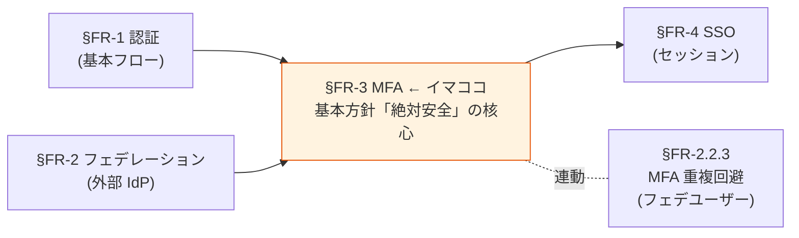
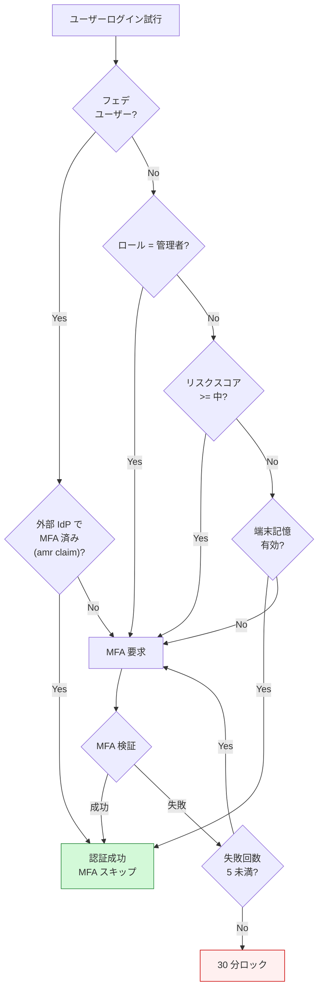
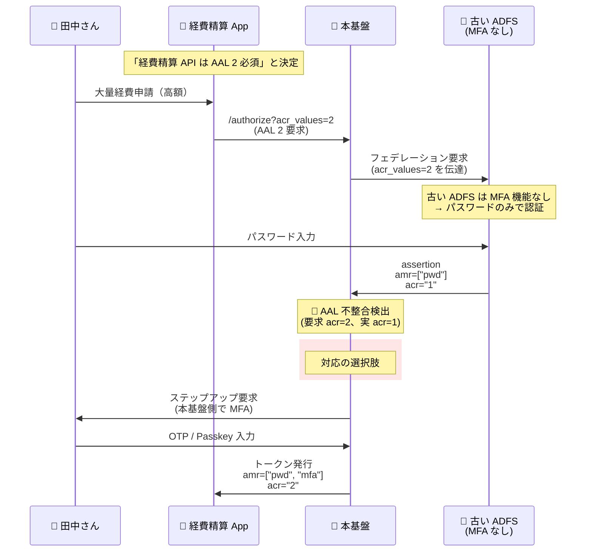
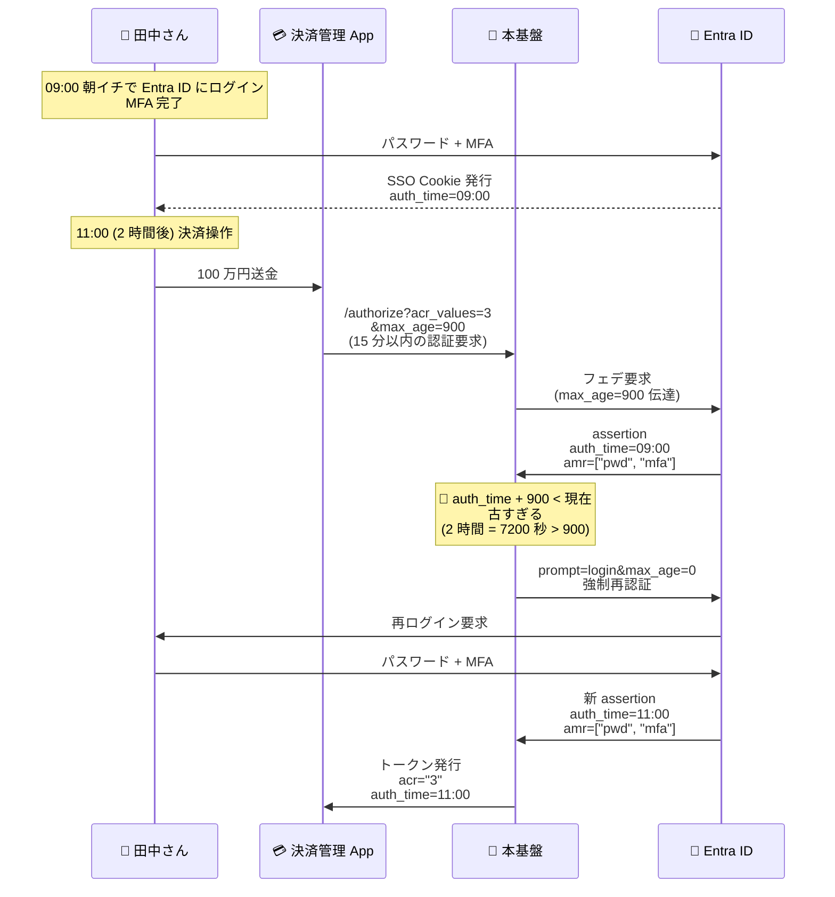
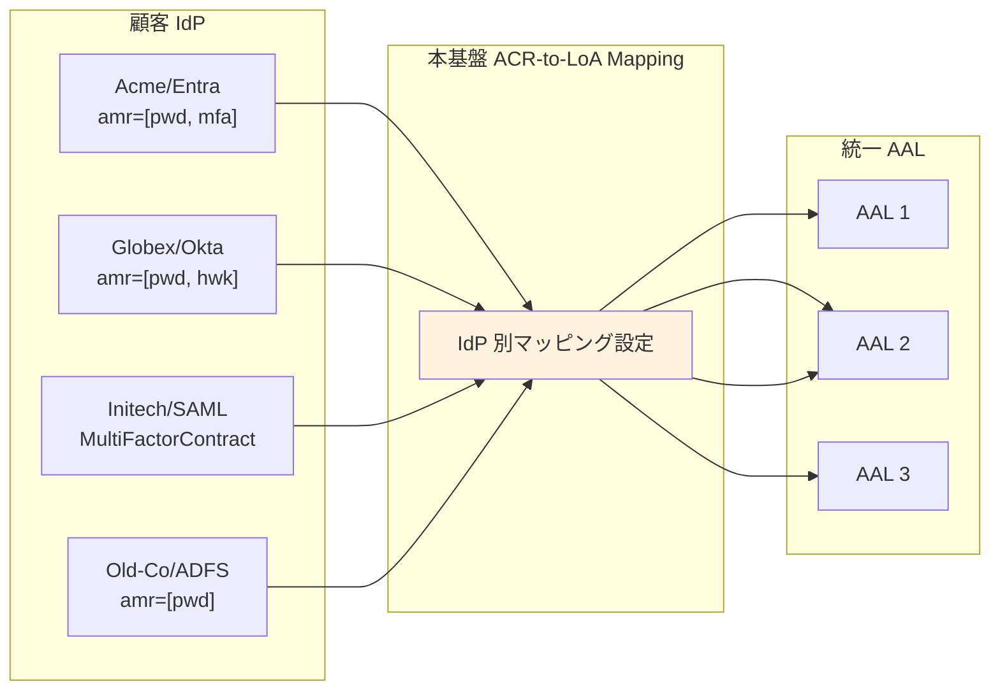
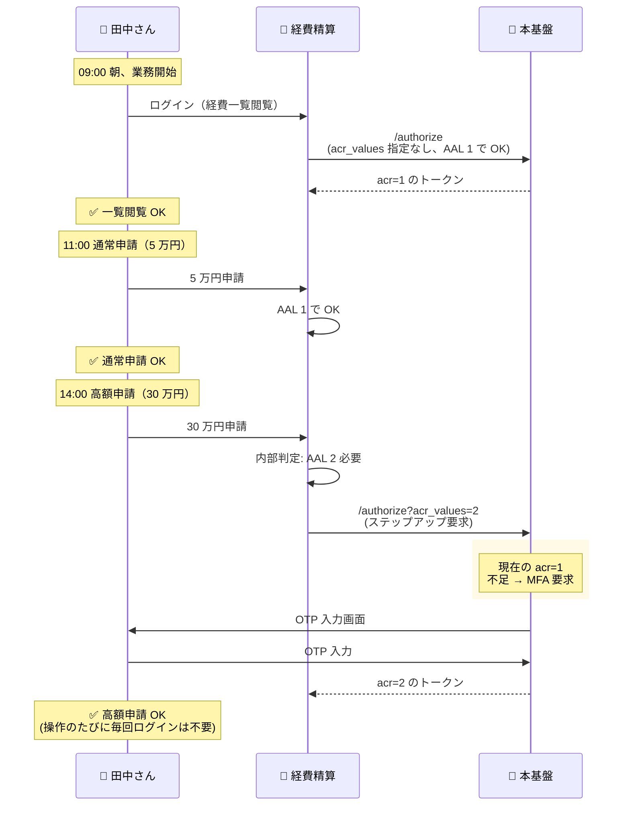

# §FR-3 MFA（多要素認証）

> 上位 SSOT: [00-index.md](00-index.md)   
> 詳細: [../../functional-requirements.md §3 FR-MFA](../../functional-requirements.md)、[../../../adr/009-mfa-responsibility-by-idp.md](../../../adr/009-mfa-responsibility-by-idp.md)   
> カバー範囲: FR-MFA §3.1 要素 / §3.2 適用ポリシー

---

## §FR-3.0 前提と背景

### 用語整理

| 用語 | 本基盤での意味 |
|---|---|
| **MFA（Multi-Factor Authentication）** | パスワード（知識）に加え、別の認証要素（所持 / 生体）を要求する仕組み |
| **AAL（Authentication Assurance Level）** | NIST が定義する認証の保証レベル。AAL1（パスワードのみ）/ AAL2（MFA 必須）/ AAL3（phishing-resistant MFA 必須） |
| **Phishing-resistant MFA** | フィッシング攻撃に耐えられる MFA。WebAuthn / FIDO2 / Passkey が代表 |
| **適用ポリシー** | MFA を「誰に・いつ・どんな条件で」要求するかのルール |
| **アダプティブ MFA** | ユーザーの行動・コンテキスト（IP / 地理 / デバイス）からリスクを動的判定し、必要な時だけ MFA を要求 |

### なぜここ（§FR-3）で決めるか



**MFA は基本方針 4 軸の「絶対安全」を実現する最重要要素**。理由：
- パスワード単独突破が依然として攻撃ベクター 1 位
- NIST SP 800-63B Rev 4 で AAL2 以上では MFA 必須化
- B2B SaaS では侵害被害が顧客全社に波及するため、MFA を疎かにできない

### 共通認証基盤として「MFA」を検討する意義

| 観点 | 個別アプリで実装した場合 | 共通認証基盤で実装した場合 |
|---|---|---|
| MFA 要素の一貫性 | アプリごとに別実装 → UX バラバラ | **基盤側で統一**、全システムで同じ MFA |
| 顧客企業のポリシー対応 | 各アプリで個別対応必要 | **基盤側のポリシー設定で一元化** |
| Passkey / WebAuthn 対応 | アプリごとに WebAuthn 実装 → 重い | **基盤側で標準提供**、アプリは JWT を信じるだけ |
| フェデユーザーの MFA 重複回避 | 各アプリで個別判定 | **基盤側で `amr` クレームを検査して一元判定**（[§FR-2.2.3](02-federation.md#323-mfa-重複回避--fr-fed-012)）|
| MFA 適用ポリシー変更 | 全アプリ改修が必要 | **基盤側設定のみで反映** |

→ 共通認証基盤で MFA を中央集約することが、基本方針「**絶対安全・どんなアプリでも・効率よく・運用負荷低**」を全て満たす唯一の道。

### §FR-3.0.A 本基盤の MFA スタンス

> **NIST SP 800-63B Rev 4 の AAL2（MFA 必須）以上に準拠する。Phishing-resistant な Passkey / WebAuthn を第一選択とし、TOTP / SMS / Email / ハードウェアキーも要件次第で対応。フェデユーザーは外部 IdP の `amr` クレームを検査して MFA 重複回避（[§FR-2.2.3](02-federation.md)）。**

### MFA 対象範囲は利用者カテゴリ・採用シナリオで変動

[§FR-1.2.0.0](01-auth.md#fr-1200-ローカルユーザーとは何か--利用者カテゴリ別の分析) で議論したローカルユーザー範囲シナリオによって、**本基盤側で MFA を提供する対象範囲が変わる**:

| カテゴリ | フェデユーザーか | 本基盤側 MFA の責任 | 採用シナリオでの含み方 |
|---|:---:|---|---|
| **P-1 基盤運用管理者** | フェデ（弊社内 IdP）+ Break Glass ローカル | フェデ側が一次責任（`amr` で検査） / Break Glass は本基盤 MFA 必須 | 全シナリオで対象 |
| **P-2 テナント管理者**（顧客 IdP あり）| フェデ | フェデ側 | β / γ |
| **P-2 テナント管理者**（IdP なし）| ローカル | **本基盤 MFA Must** | α / β |
| **P-3 IdP あり顧客従業員** | フェデ | フェデ側 | 全シナリオで対象（最大ボリューム）|
| **P-4 IdP なし顧客従業員** | ローカル | **本基盤 MFA 強推奨** | α / β |
| **P-5 ゲスト**, **P-6 B2C** | ローカル中心 | **本基盤 MFA Must（特に P-6）**| 要件次第 |

→ **γ シナリオ採用時は本基盤側で直接 MFA する対象が P-1 Break Glass + P-2 一部のみ**（数十名規模）に圧縮される。Cognito Plus ティアの侵害クレデンシャル検出（+$0.02/MAU）のコストインパクトもこの規模で評価する（[§NFR-8](../nfr/08-cost.md)）。

### 本章で扱うサブセクション

| サブセクション | 内容 | 関連 FR |
|---|---|---|
| §FR-3.1 MFA 要素 | どんな MFA 手段（TOTP / Passkey / SMS / Email / ハードウェアキー）を提供できるか | FR-MFA-001〜005 |
| §FR-3.2 MFA 適用ポリシー | いつ・誰に・どんな条件で MFA を要求するか | FR-MFA-006〜009 |
| §FR-3.3 ステップアップ認証（RFC 9470） | 操作の重要度に応じて動的に AAL を引き上げる仕組み | FR-MFA 全般 / FR-AUTHZ |
| §FR-3.3.A AAL 不整合の具体例とフロー | 顧客 IdP の AAL 実装差異と本基盤側ステップアップによる補完（4 シナリオ + mermaid フロー）| FR-MFA / FR-FED-012 |

---

## §FR-3.1 MFA 要素（→ FR-MFA §3.1）

> **このサブセクションで定めること**: 本基盤がサポートする MFA 認証手段（TOTP / WebAuthn・Passkeys / SMS OTP / Email OTP / バックアップコード / ハードウェアキー）の範囲と推奨度。   
> **主な判断軸**: 目標 NIST AAL レベル、Passkeys を Must とするか、SMS / Email OTP の必要性、ハードウェアキー対応   
> **§FR-3 全体との関係**: §FR-3.1 = 「**何で MFA するか**」、§FR-3.2 = 「**いつ・誰に MFA を要求するか**」

### 業界の現在地（2026 年時点の調査結果）

**1. NIST SP 800-63B Rev 4 の MFA 保証レベル**

| AAL | 要件 | 該当する認証手段 |
|---|---|---|
| **AAL3**（最高）| **Phishing-resistant 必須**、デバイスバインド秘密鍵 | デバイスバインド Passkey、FIDO2 ハードウェアキー（YubiKey 等） |
| **AAL2** | Phishing-resistant **推奨** | 同期 Passkey（Apple iCloud / Google Password Manager）、TOTP（条件付き） |
| AAL1 | 単要素 OK | パスワード単独 |

→ **Passkeys（FIDO2 / WebAuthn）が NIST 公式に phishing-resistant 認定**

**2. Passkeys の普及（2026）**

- **エンタープライズの 87% が deploy or pilot 中**（HID/FIDO Alliance 2025 調査、2 年前 53% から急伸）
- Apple / Google / Microsoft が cross-platform passkey portability を実装済（ベンダーロックイン解消）
- **業務効果**: パスワードリセット 60-80% 減、サイバー保険料 15-30% 割引（FIDO2 deploy 証明で）
- **コスト**: 1 パスワードリセット = $70（Forrester ベンチマーク）→ Passkey で大幅削減

**3. SMS OTP の世界的非推奨化**

| リスク | 説明 |
|---|---|
| SIM swap 攻撃 | 攻撃者がキャリアに電話番号移管を依頼 → SMS 全傍受 |
| SS7 脆弱性 | テレコム網への不正アクセスで SMS リダイレクト |
| Reverse-proxy phishing | リアルタイムで OTP を中継・悪用 |
| データ漏洩 | T-Mobile 2021/2023 漏洩で本人確認情報が流出 → SIM swap 補助 |

→ NIST も「downgrade（弱体扱い）」、CISA も「phishing-resistant に非該当」と分類。**今後の新規実装では非推奨**。レガシー互換目的のみ。

### 我々のスタンス（基本方針に基づく）

| 基本方針の柱 | MFA 要素での実現 |
|---|---|
| **絶対安全** | **Passkeys（phishing-resistant）を強く推奨**。NIST AAL2/AAL3 整合、業界 87% 採用 |
| **どんなアプリでも** | TOTP / WebAuthn / SMS / Email / バックアップ すべてサポート可能、顧客選択 |
| **効率よく** | 1 ユーザー複数 MFA 要素登録可、UI フローを自動最適化 |
| **運用負荷・コスト最小** | Cognito Essentials+ で WebAuthn ネイティブ（追加コスト極小）、SMS は AWS SNS で従量課金 |

### 対応能力マトリクス

| MFA 要素 | Cognito Lite | Cognito Essentials+ | Cognito Plus | Keycloak (OSS/RHBK) | NIST AAL |
|---|:---:|:---:|:---:|:---:|:---:|
| **TOTP** | ✅ | ✅ | ✅ | ✅ | AAL2（条件付き）|
| **WebAuthn / FIDO2（Passkeys）** | ⚠ | ✅ **ネイティブ**（2024-11〜）| ✅ | ✅ | **AAL2 同期 / AAL3 デバイスバインド** |
| **ハードウェアキー（YubiKey 等）** | ⚠ | ✅（WebAuthn 経由）| ✅ | ✅ | **AAL3** |
| **SMS OTP** | ✅（追加課金、SNS） | ✅ | ✅ | ⚠ プラグイン | downgrade（非推奨）|
| **Email OTP** | ✅（Essentials+）| ✅ | ✅ | ✅ | NIST 削除（非推奨）|
| **バックアップコード** | ❌ | ❌ | ❌ | ✅ | — |
| **Push 通知（Authenticator アプリ）** | ⚠ | ⚠ | ⚠ | ⚠ プラグイン | AAL2（条件付き）|

### ベースライン

| MFA 要素 | 優先度 | 推奨理由 |
|---|:---:|---|
| **TOTP**（Google Authenticator 等）| **Must** | 全プラットフォーム対応、コスト最小、AAL2 整合 |
| **WebAuthn / Passkeys** | **Must（推奨）** | NIST 公認 phishing-resistant、業界 87% 採用、UX 良好。**Cognito Essentials+ でネイティブ、追加コスト極小** |
| ハードウェアキー（YubiKey 等）| Should | AAL3 必須時。WebAuthn 経由で対応 |
| バックアップコード | Should | 端末紛失時の救済手段（Keycloak は標準、Cognito は要設計）|
| SMS OTP | **Could**（非推奨）| レガシー互換のみ。新規実装では Passkey を推奨 |
| Email OTP | **Could**（非推奨）| NIST 削除。本人確認の補助のみ |
| Push 通知 | TBD | 顧客 IdP（Entra ID 等）側で実現する場合が多い |

→ **業界の方向性は Passkeys へのシフト**。本基盤は Passkeys を中心に据え、TOTP を最低保証、SMS/Email は明示的に非推奨と位置付ける。

### TBD / 要確認

| 確認項目 | 回答例 |
|---|---|
| 目標とする NIST AAL レベル | AAL2（推奨）/ AAL3（高セキュリティ）/ AAL1（パスワードのみ）|
| Passkeys を Must とするか | はい（推奨、業界標準）/ Should / Could |
| SMS / Email OTP の必要性 | レガシー顧客向け / 一切不要 |
| ハードウェアキー対応の必要性 | はい（管理者向け等）/ いいえ |
| MFA 要素の登録個数制限 | 1 / 複数許可（推奨） |

---

## §FR-3.2 MFA 適用ポリシー（→ FR-MFA §3.2）

> **このサブセクションで定めること**: MFA を**いつ・誰に・どんな条件で要求するか**（ロール単位 / リスクベース / 端末記憶 / 管理者強制 / フェデユーザー重複回避）。   
> **主な判断軸**: MFA 強制の粒度、条件付き MFA（リスクベース）の要否、端末記憶の有効期間、ロール別ポリシー   
> **§FR-3 全体との関係**: §FR-3.1 で「何で MFA するか」を決め、§FR-3.2 で「**いつ要求するか**」を決める。フェデユーザー MFA 重複回避は [§FR-2.2.3](02-federation.md#323-mfa-重複回避--fr-fed-012) と連動

### 業界の現在地

**アダプティブ / リスクベース MFA がトレンド**:
- Cognito Plus: **Adaptive Authentication**（risk score 自動算出、デバイス・地理・行動分析）
- Keycloak: **Conditional Flow**（カスタムロジックで条件分岐）
- 2026 トレンド：AI 駆動、行動バイオメトリクス、継続的認証
- 市場規模：$2.98B by 2030（CAGR 15.5%）

### 我々のスタンス（基本方針に基づく）

| 基本方針の柱 | MFA ポリシーでの実現 |
|---|---|
| **絶対安全** | ロール単位での MFA 強制、条件付き MFA でリスク評価 |
| **どんなアプリでも** | フェデユーザーは外部 IdP の MFA を尊重（[§FR-2.2.3](02-federation.md#323-mfa-重複回避--fr-fed-012)）|
| **効率よく** | リスクスコアが低ければ MFA スキップ、UX 良好 |
| **運用負荷・コスト最小** | Cognito Plus は AI ベース自動判定、Keycloak は宣言的フロー |

### 対応能力マトリクス

| ポリシー | Cognito Lite/Essentials | Cognito Plus | Keycloak (OSS/RHBK) | 備考 |
|---|:---:|:---:|:---:|---|
| **MFA 強制 / 任意切替**（User 単位）| ✅ | ✅ | ✅ | 両方標準 |
| **MFA 強制 / 任意切替**（ロール単位）| ⚠ Pre Token Lambda で自前 | ⚠ Pre Token Lambda で自前 | ✅ Authentication Flow（標準）| **Keycloak が楽** |
| **条件付き MFA（リスクベース、IP / 地理 / デバイス）**| ❌ | ✅ **Adaptive Authentication**（risk score）| ✅ Conditional Flow（カスタムロジック）| Cognito Plus は AI 駆動、Keycloak は宣言的 |
| **端末記憶（Trusted Device、N 日 MFA スキップ）**| ✅ Remember Device | ✅ Remember Device | ⚠ 設定要 | Cognito が標準 |
| **管理者 MFA 強制** | ✅ | ✅ | ✅ | 両方標準 |
| **フェデユーザー MFA 重複回避** | ⚠ Pre Token Lambda 個別実装 | ⚠ 同上 | ✅ Conditional OTP（標準）| **[§FR-2.2.3](02-federation.md#323-mfa-重複回避--fr-fed-012) 参照** |
| **MFA 失敗時の動作**（一定回数でロック）| ✅ Lockout 設定 | ✅ | ✅ Brute Force Detection | 両方標準 |
| **AI / 行動バイオメトリクス** | ❌ | ⚠ ContextData 経由で外部連携 | ❌ | 将来トレンド |

### ベースライン

| ポリシー | 推奨デフォルト | 設定可能範囲 |
|---|---|---|
| MFA 必須 / 任意 | **ロール単位で制御**（管理者 Must、一般 Should）| ユーザー単位 / ロール単位 / 全員 |
| 条件付き MFA | **有効**（リスクスコア >= 中で MFA 要求）| Cognito Plus or Keycloak Conditional Flow |
| 端末記憶 | 有効、**30 日**スキップ | 0〜90 日 |
| 管理者 MFA | **強制**（Must）| 設定不可（常時 ON）|
| フェデユーザー MFA | **外部 IdP に委譲**（重複回避、[§FR-2.2.3](02-federation.md#323-mfa-重複回避--fr-fed-012)）| 信頼するか個別判断 |
| MFA 失敗時ロック | 5 回失敗で 30 分（[§FR-1.2 アカウントロック](01-auth.md#22-パスワードローカルユーザー管理-fr-auth-12)と統一）| 任意 |

### 適用フロー例



### TBD / 要確認

| 確認項目 | 回答例 |
|---|---|
| MFA 強制の粒度 | 全員 / ロール別（管理者 Must、一般 Should）/ 任意 |
| 条件付き MFA の要否 | はい（リスクベース）/ いいえ |
| 条件付き MFA の判定軸 | IP / 地理 / デバイス / 時間帯 / 行動パターン |
| 端末記憶の有効期間 | 0 / 7 / 30 / 90 日 |
| プラットフォーム選定への影響 | 条件付き MFA Must → Cognito Plus or Keycloak |

---

## §FR-3.3 ステップアップ認証（RFC 9470）

> **このサブセクションで定めること**: 業務操作の機密度に応じて**動的に認証強度を引き上げる**仕組み（OAuth 2.0 Step Up Authentication Challenge Protocol、RFC 9470）の採用方針と実装方式。
> **主な判断軸**: 高セキュ操作（決済 / 管理画面 / 大量データダウンロード等）で「現在の AAL では不足」と判定して追加 MFA を要求する設計が必要か
> **§FR-3 全体との関係**: §FR-3.1 = 「どの MFA 手段を備えるか」、§FR-3.2 = 「いつ MFA を要求するか（適用ポリシー）」、§FR-3.3 = 「**操作ごとに段階的に認証強度を引き上げるか**」

### 業界の現在地

**RFC 9470（2023 公開）**：OAuth 2.0 Step Up Authentication Challenge Protocol

| 仕様 | 内容 |
|---|---|
| エラーコード | `insufficient_user_authentication`（HTTP 401）|
| `acr_values` パラメータ | リソースサーバーが「要求する最低 ACR 値」を返す（例: `aal3`）|
| `max_age` パラメータ | 「最終認証からの最大経過秒数」を返す（例: `300` = 5 分以内に再認証必須）|
| クライアントの動作 | チャレンジ受領後、`authorize` リクエストで `acr_values` / `max_age` を指定して再認証 |

**典型シナリオ**:
- 通常画面: パスワード + TOTP（AAL2）でログイン
- 決済画面アクセス → API が `acr_values=aal3` を要求
- → 認可サーバーが追加で Passkey を要求
- → 完了後、AAL3 セッションで決済処理続行

**業界実装状況（2026）**:
- **Keycloak**: Step-up Authentication 標準対応（Authentication Flow + LoA Condition で宣言的実装）
- **Duende IdentityServer**: 標準サポート
- **Auth0**: ACR Step-up が標準機能
- **Cognito**: ネイティブ非対応（Custom Auth Challenge Lambda で自前実装が必要）

### 我々のスタンス（基本方針に基づく）

| 基本方針の柱 | ステップアップ認証での実現 |
|---|---|
| **絶対安全** | 重要操作時に動的に AAL を引き上げ、漏洩セッション利用攻撃を遮断 |
| **どんなアプリでも** | RFC 9470 標準準拠で、各アプリは `WWW-Authenticate` ヘッダーを返すだけ |
| **効率よく** | 通常時は AAL2 で UX 維持、重要操作時のみ追加 MFA |
| **運用負荷・コスト最小** | Keycloak は宣言的フロー、Cognito は Lambda 実装 |

### 対応能力マトリクス

| 機能 | Cognito | Keycloak (OSS/RHBK) |
|---|:---:|:---:|
| `acr_values` 標準対応 | ⚠ User Pool で公式サポート限定的 | ✅ ネイティブ対応 |
| RFC 9470 サポート | ⚠ Custom Auth Challenge Lambda で自前実装 | ✅ **Authentication Flow + LoA Condition** で宣言的 |
| `max_age` パラメータ | ✅ | ✅ |
| `acr` クレーム発行 | ⚠ Pre Token Lambda で注入 | ✅ 標準 |
| `amr` クレーム発行 | ✅ | ✅ |

### ベースライン

| 項目 | ベースライン |
|---|---|
| ステップアップ採用判断 | 高セキュ操作（決済 / 管理画面 / 個人情報大量出力 等）が業務にあれば **Should** |
| 標準 AAL | AAL2（TOTP）|
| ステップアップ後 AAL | AAL3（Passkey / WebAuthn）|
| max_age（重要操作の再認証猶予）| 5 分（300 秒）|
| 実現方式 | Keycloak: Authentication Flow + LoA Condition / Cognito: Custom Auth Challenge Lambda |

### ハイブリッド運用との関係

[`bff-implementation-notes.md §11.2.6`](../../../common/bff-implementation-notes.md) で扱う **BFF ハイブリッド運用（一部システムのみ BFF）における ACR step-up MFA** は、本サブセクション (§FR-3.3) の RFC 9470 実装と**同一の仕組み**。

- 通常アプリ（PKCE / AAL2）でログイン
- 高セキュ システム（BFF / AAL3 要求）に遷移時、RFC 9470 で追加 MFA を要求
- SSO セッションを AAL3 に**昇格**

### §FR-3.3.A AAL 不整合の具体例とフロー（[§FR-4.2 リスク 4](04-sso.md#リスク-4-aal-不整合) と連動）

> **このサブ・サブセクションで定めること**: 「外部 IdP の AAL レベルが本基盤の要求と一致しない」場合の典型 4 シナリオと、ステップアップ MFA による解決フロー。   
> **主な判断軸**: 顧客 IdP の AAL 実装差異、業務操作の重要度に応じた段階的引き上げ、本基盤側の補完 MFA 提供   
> **§FR-3.3 内の位置付け**: ステップアップ認証の **適用ユースケース集**。理論は本サブセクション上部、実例はここで。

#### AAL レベルの定義（NIST SP 800-63B Rev 4）

| レベル | 必要な認証要素 | 例 |
|:---:|---|---|
| **AAL 1** | 単一要素（パスワードのみ）| ID + パスワード |
| **AAL 2** | 多要素（パスワード + 何か）| パスワード + OTP / Push / SMS |
| **AAL 3** | Phishing-resistant 多要素（暗号鍵ベース）| パスワード + Hardware Key / Passkey |

#### OIDC で AAL を表現するクレーム

| クレーム | 役割 | 値の例 |
|---|---|---|
| **`acr`**（Authentication Context Class Reference） | 認証の保証レベル | `"0"` / `"1"` / `"2"` / `"3"` |
| **`amr`**（Authentication Methods References） | 認証方法のリスト | `["pwd"]` / `["pwd", "mfa"]` / `["hwk"]` |
| **`auth_time`** | 認証時刻 | `1730000000` |

#### シナリオ 1: 本基盤は AAL 2 要求、顧客 IdP は AAL 1 のみ（不整合の典型）



**対応の 3 つの選択肢**:

| 選択肢 | 内容 | 推奨度 | リスク / コスト |
|:---:|---|:---:|---|
| **A 本基盤側でステップアップ MFA** | Hub が追加で OTP / Passkey 要求 → 不足分を補う | ✅ **推奨** | UX 1 ステップ追加 |
| **B AAL 無視して通す** | acr 検査せずトークン発行 | ❌ | **🚨 高セキュ操作に弱い認証で通る、コンプラ違反** |
| **C エラー返却** | 「顧客 IdP に MFA を設定してください」 | △ | UX 悪化、顧客クレーム |

→ **A が現実解**。本基盤側で **「不足分を補う」MFA を提供**することで、顧客 IdP の AAL 実装差異を吸収できる。

#### シナリオ 2: IdP は MFA 済みだが古すぎる auth_time



→ **「2 時間前の MFA 認証で 100 万円送金は危ない」を防ぐ仕組み**。`max_age` がない（Cognito）と、IdP セッション TTL（8 時間）までは古い認証で通る。

#### シナリオ 3: 複数 IdP で AAL 表現が違う（標準化問題）

各 IdP は `amr` / `AuthnContext` を独自命名で返す:

| 顧客 | IdP | 認証方法 | `amr` の値 | 本基盤側のマッピング |
|---|---|---|---|---|
| Acme | Entra ID | パスワード + MFA | `["pwd", "mfa"]` | → AAL 2 |
| Globex | Okta | パスワード + WebAuthn | `["pwd", "hwk"]`（hwk = Hardware Key） | → AAL 3 |
| Initech | 自社 SAML | パスワード + OTP | `urn:oasis:names:tc:SAML:2.0:ac:classes:MultiFactorContract` | → AAL 2 |
| Old-Co | レガシー ADFS | パスワードのみ | `["pwd"]` | → AAL 1 |

→ **本基盤の ACR-to-LoA Mapping でこの差異を正規化**:



→ 各アプリは「`acr=2` 必須」とだけ宣言すれば、本基盤が裏で全 IdP の方言を AAL に変換。

#### シナリオ 4: 段階的なステップアップ（最も実用的）



→ **「操作の重要度に応じて段階的に認証を強化」**。NIST SP 800-63B Rev 4 が推奨する標準パターン。

#### プラットフォーム別の実装イメージ

**Keycloak（宣言的・標準対応）**:

```
[1] Admin Console > Realm Settings > Authentication
    → ACR to LoA Mapping を設定
    例: acr "2" → loa 1（AAL 2 相当）
        acr "3" → loa 2（AAL 3 相当）

[2] IdP 接続設定で「この IdP の amr=mfa → AAL 2」をマッピング

[3] Client Settings > Advanced > Authentication Flow Overrides
    → Step-up Flow を選択

[4] アプリから acr_values=2 で要求 → Keycloak が自動判定 + ステップアップ
```

**Cognito（Lambda 自前実装）**:

```python
# Pre Token Generation Lambda V2
def lambda_handler(event, context):
    requested_acr = parse_acr_from_state(event)  # 自前パース
    idp_amr = event['request']['userAttributes'].get('cognito:idp_amr', [])

    # AAL 判定（自前）
    current_aal = 1
    if 'mfa' in idp_amr:
        current_aal = 2
    if 'hwk' in idp_amr or 'webauthn' in idp_amr:
        current_aal = 3

    # 不足検出
    if requested_acr and current_aal < int(requested_acr):
        # Cognito ではここでフロー開始不可
        # 代替: クレーム注入 + アプリ側で別 Custom Auth Challenge 起動
        event['response']['claimsOverrideDetails'] = {
            'claimsToAddOrOverride': {
                'needs_stepup': 'true',
                'current_aal': str(current_aal)
            }
        }

    return event
```

→ **Cognito は Pre Token Lambda V2 でクレーム注入 → アプリ側で別 Custom Auth Challenge 起動**という 2 段階実装が必要。Keycloak なら Realm Settings の宣言的設定で完結。

#### 不整合を放置すると何が起きるか（脅威モデル）

| 放置時のリスク | 具体例 |
|---|---|
| **弱い IdP の経路で高セキュリティ操作** | Old-Co（パスワードのみ）の従業員が、本来 AAL 2 必須の機能にアクセス可 |
| **フィッシング被害の伝播** | IdP セッションが奪取されても、本基盤側で AAL 検証していれば高セキュ操作は防げる |
| **コンプライアンス違反** | PCI DSS / NIST 準拠を謳いながら実態は AAL 1 で運用 |
| **MFA バイパス** | `amr` 値の偽装（[§FR-4.2 リスク 3](04-sso.md#リスク-3-amr-偽装)）と組み合わさると致命的 |
| **規制業種顧客の獲得不能** | 金融・医療顧客が AAL 整合性を契約条件にする場合、対応不可 |

#### 本基盤での推奨設計

| 項目 | 推奨 |
|---|---|
| **デフォルト要求 AAL** | AAL 1（業務系標準）|
| **重要操作（決済 / 管理画面 / 大量データ出力）** | AAL 2 要求、ステップアップで対応 |
| **金融・規制業種顧客** | AAL 3 要求、Phishing-resistant 必須 |
| **IdP 接続時の AAL 評価** | 接続承認時に「この IdP は何の AAL まで出せるか」を契約に明記 |
| **AAL 不足時の挙動** | **本基盤側でステップアップ MFA**（拒否でなく補完）|
| **`auth_time` 制約** | 高セキュ操作は `max_age` 15 分 / AAL 3 は 5 分推奨 |

→ 詳細なプラットフォーム選定への影響は [§C-2.2 A-12 クロス IdP SSO 信頼レベル制御](../common/02-platform.md) 参照。

### TBD / 要確認

| 確認項目 | 回答例 |
|---|---|
| 高セキュ操作の有無 | 決済 / 管理画面 / 大量データダウンロード / なし |
| ステップアップ採用の要否 | Must / Should / Could / 不要 |
| ステップアップで要求する MFA 手段 | Passkey / TOTP / SMS OTP |
| プラットフォーム選定への影響 | RFC 9470 Must / 宣言的実装を希望 → **Keycloak** |

---

### 参考資料（§FR-3 全体）

- [NIST SP 800-63B Rev 4 公式](https://pages.nist.gov/800-63-4/sp800-63b.html)
- [NIST SP 800-63B-4 (PDF)](https://nvlpubs.nist.gov/nistpubs/SpecialPublications/NIST.SP.800-63B-4.pdf)
- [87% of Enterprises Deploying Passkeys 2026](https://securityboulevard.com/2026/04/8-reasons-87-of-enterprises-are-deploying-passkeys-in-2026/)
- [CISA - Implementing Phishing-Resistant MFA](https://www.cisa.gov/sites/default/files/publications/fact-sheet-implementing-phishing-resistant-mfa-508c.pdf)
- [SMS OTP 世界的禁止動向](https://mojoauth.com/blog/6-reasons-sms-otp-is-being-banned-worldwide-and-what-to-deploy-instead)
- [Cognito Adaptive Authentication 公式](https://docs.aws.amazon.com/cognito/latest/developerguide/cognito-user-pool-settings-adaptive-authentication.html)
- [Microsoft Entra Passkeys 2026 Update](https://en.ittrip.xyz/microsoft-365/entra-passkeys-fido2-2026)

#### ステップアップ認証

- [RFC 9470 - OAuth 2.0 Step Up Authentication Challenge Protocol](https://datatracker.ietf.org/doc/html/rfc9470)
- [RFC 9470 解説 - Authlete](https://www.authlete.com/developers/stepup_authn/)
- [Step-up Authentication with Keycloak](https://medium.com/@ahmedmohamedelahmar/step-up-authentication-with-keycloak-9906ba819964)
- [Cognito Custom Auth Challenge Lambda Triggers](https://docs.aws.amazon.com/cognito/latest/developerguide/user-pool-lambda-challenge.html)
