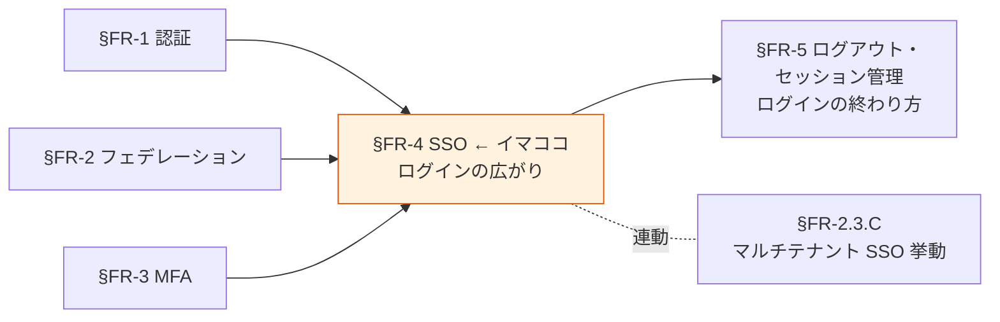

# §FR-4 SSO（シングルサインオン）

> 上位 SSOT: [00-index.md](00-index.md)
> 詳細: [../../functional-requirements.md §4 FR-SSO/LOGOUT](../../functional-requirements.md)
> カバー範囲: FR-SSO §4.1 SSO（SSO はここ、ログアウト・セッション管理は [§FR-5](05-logout-session.md)）

---

## §FR-4.0 前提と背景

### 用語整理

| 用語 | 本基盤での意味 |
|---|---|
| **SSO（Single Sign-On）** | 一度のログインで複数システムを利用可能にする仕組み |
| **同一 IdP 内 SSO** | 同じ Cognito User Pool / Keycloak Realm 内のアプリ間 SSO |
| **クロス IdP SSO** | 異なる IdP 間（Auth0 → Entra ID → Cognito 等）で SSO セッションが伝播 |
| **クロステナント SSO** | テナント境界で意図的に切断（[§FR-2.3.C](02-federation.md#33c-マルチテナント環境での-sso-挙動) 参照）|

### なぜここ（§FR-4）で決めるか

SSO は「**一度のログインで複数システムを利用できる**」UX を提供する核機能。Broker パターン（[§FR-9/§1 アーキテクチャ](../common/01-architecture.md)）の前提でもある。ログアウト・セッション管理は **§FR-5 で対** として扱う（性質が逆向き：SSO は広がり、ログアウトは終わり）。

### 共通認証基盤として「SSO」を検討する意義

| 観点 | 個別アプリで実装した場合 | 共通認証基盤で実装した場合 |
|---|---|---|
| SSO 実現 | アプリ間でセッション共有不可（別 Cookie）| **同一 IdP の全アプリで自動 SSO** |
| UX | アプリごとにログイン必須 | **1 回ログインで全システム利用可** |
| 顧客追加時の動作 | 各アプリで SSO 設定追加 | **基盤側 IdP 登録のみで全アプリ波及** |
| クロス IdP SSO | 各アプリで個別フェデ設定 | **基盤で吸収、アプリは透過** |

→ SSO の中央集約は、北極星「**効率よく認証**」を実現する最大の手段。

### 本章で扱うサブセクション

| サブセクション | 内容 | 関連 FR |
|---|---|---|
| §FR-4.1 同一 IdP 内 SSO | 同じ Pool/Realm 内のアプリ間 SSO | FR-SSO-001 |
| §FR-4.2 クロス IdP SSO | フェデレーション IdP 経由の SSO 伝播 | FR-SSO-002 |

---

## §FR-4.1 同一 IdP 内 SSO（→ FR-SSO-001）

> **このサブセクションで定めること**: 同じ顧客テナント内の複数アプリ間で SSO セッションを共有する範囲とテナント境界の遮断ルール。
> **主な判断軸**: SSO で繋ぐシステム範囲、同一テナント内でも切り離したいシステムの有無
> **§FR-4 全体との関係**: §FR-4.1 = テナント内 SSO、§FR-4.2 = テナント跨ぎ SSO（フェデ）。マルチテナント挙動の詳細は [§FR-2.3.C](02-federation.md#33c-マルチテナント環境での-sso-挙動)

### 業界の現在地

OIDC / SAML で標準化済み。論点は「**何のシステム間で SSO を効かせるか**」のスコープ設計。

- 共通基盤内の Cognito User Pool / Keycloak Realm の SSO セッション Cookie をブラウザが保持
- 同じ Pool/Realm に紐づく App Client / Client を訪れた際、ログイン済みなら即座にトークン発行
- ブラウザを閉じてもセッションが残る場合と消える場合がある（Cookie 設定次第）

### 我々のスタンス（北極星に基づく）

| 北極星の柱 | 同一 IdP 内 SSO での実現 |
|---|---|
| **絶対安全** | テナント境界は越えない（`tenant_id` クレームで検証）|
| **どんなアプリでも** | SPA / SSR / Mobile / M2M 問わず同一 SSO セッションを共有 |
| **効率よく** | 顧客企業内システム間はログイン 1 回で全システム利用可能 |
| **運用負荷・コスト最小** | プラットフォーム標準機能、追加実装不要 |

### 対応能力マトリクス

| 機能 | Cognito | Keycloak (OSS/RHBK) | PoC 検証 |
|---|:---:|:---:|:---:|
| 同一 IdP 内 Client 間 SSO | ✅ User Pool 内 | ✅ Realm 内 | ✅ Phase 1, 7 |
| クロステナント切断 | ✅ tenant_id クレームで判定 | ✅ 同上 | — |
| SSO セッション TTL 設定 | ✅ App Client 設定 | ✅ Realm 設定 | [§FR-5.3 セッション管理](05-logout-session.md#63-セッション管理) で詳述 |

### ベースライン

| 項目 | ベースライン |
|---|---|
| 同一テナント内 SSO | **Must**（標準提供）|
| クロステナント | **遮断**（tenant_id クレームベース、[§FR-2.3.C](02-federation.md#33c-マルチテナント環境での-sso-挙動) 参照）|
| SSO セッション保持期間 | [§FR-5.3 セッション管理](05-logout-session.md#63-セッション管理) 参照 |

### TBD / 要確認

| 確認項目 | 回答例 |
|---|---|
| SSO で繋ぐシステム範囲 | 全システム / 認証スコープ別 / 機微情報システムのみ別 |
| 同一テナント内でも SSO を切りたいシステム | あり（高権限管理画面等）/ なし |

---

## §FR-4.2 クロス IdP SSO（→ FR-SSO-002）

> **このサブセクションで定めること**: 外部 IdP（Entra ID / Auth0 等）の SSO セッションを本基盤でも信頼してログイン省略する仕組み。
> **主な判断軸**: クロス IdP SSO を全顧客有効にするか、外部 IdP の SSO セッション TTL に従うか
> **§FR-4 全体との関係**: §FR-4.1 がテナント内 SSO、§FR-4.2 が**外部 IdP との SSO セッション伝播**。MFA 重複回避は [§FR-2.2.3](02-federation.md#323-mfa-重複回避--fr-fed-012) と整合

### 業界の現在地

外部 IdP（Auth0 / Entra ID 等）に SSO セッションがある場合、それを共通基盤側でも信頼して利用する。

例：
- ユーザーが Acme システムにアクセス → 共通基盤 → Acme の Entra ID にリダイレクト
- Entra ID で SSO セッション有効 → **ログイン画面を表示せず即時認証成功**
- 共通基盤に JWT を発行 → Acme システムへ

→ ユーザー視点：**Entra ID でログイン済みなら、Acme システムは完全シームレス**

### 我々のスタンス（北極星に基づく）

| 北極星の柱 | クロス IdP SSO での実現 |
|---|---|
| **絶対安全** | 外部 IdP の認証 assertion を検証（[§FR-2.2.3 MFA 重複回避](02-federation.md#323-mfa-重複回避--fr-fed-012) と整合）|
| **どんなアプリでも** | 顧客 IdP の種別に依存せず、OIDC / SAML 標準準拠なら SSO 伝播可能 |
| **効率よく** | Entra ID 利用中の社員は本基盤に意識なく入れる |
| **運用負荷・コスト最小** | プラットフォーム標準機能 |

### 対応能力マトリクス

| 機能 | Cognito | Keycloak (OSS/RHBK) | PoC 検証 |
|---|:---:|:---:|:---:|
| Auth0/Entra/Okta 経由のクロス IdP SSO | ✅ | ✅ | ✅ Phase 2, 7 |
| 外部 IdP の MFA 主張尊重（amr / AuthnContext） | ⚠ Pre Token Lambda 個別実装 | ✅ Conditional OTP 標準 | [§FR-2.2.3](02-federation.md#323-mfa-重複回避--fr-fed-012) |
| 外部 IdP セッション切れ時のフォールバック | ✅ ログイン画面表示 | ✅ ログイン画面表示 | — |

### ベースライン

| 項目 | ベースライン |
|---|---|
| クロス IdP SSO | **Must**（フェデレーション運用の前提）|
| 外部 IdP の MFA 主張 | **信頼**（[§FR-2.2.3](02-federation.md#323-mfa-重複回避--fr-fed-012)）|
| 信頼境界 | 接続承認された IdP のみ信頼。未承認 IdP は接続不可 |

### TBD / 要確認

| 確認項目 | 回答例 |
|---|---|
| クロス IdP SSO の方針 | 全顧客有効 / 限定 / 無効 |
| 外部 IdP の SSO セッション TTL に従うか | はい（推奨）/ 本基盤側で上書き |

---

### 参考資料（§FR-4 全体）

- [OpenID Connect Core 1.0 公式](https://openid.net/specs/openid-connect-core-1_0.html)
- [Cognito User Pool SSO 公式](https://docs.aws.amazon.com/cognito/latest/developerguide/cognito-user-pools-app-integration.html)
- [Keycloak SSO 公式](https://www.keycloak.org/docs/latest/server_admin/index.html)
