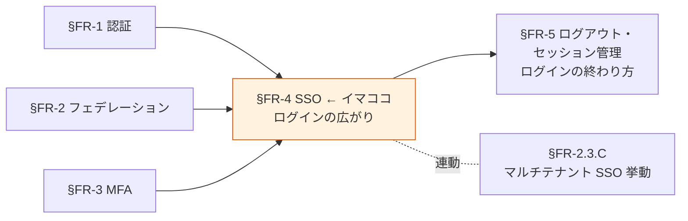
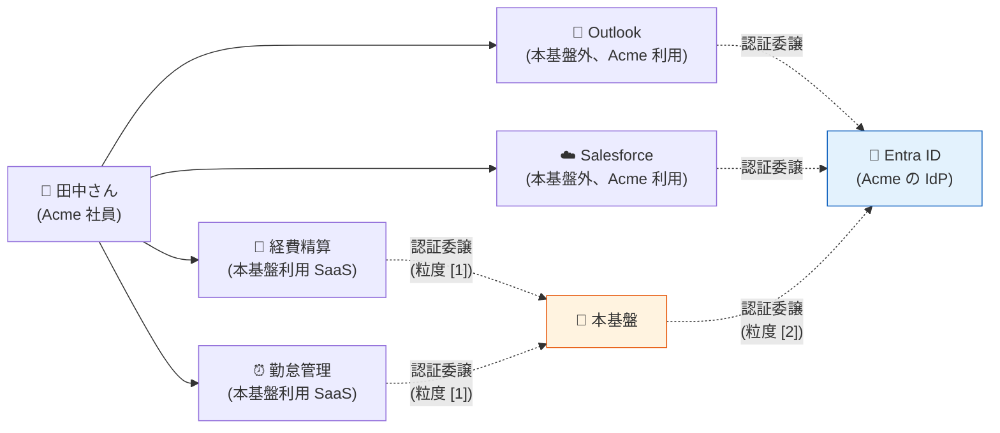
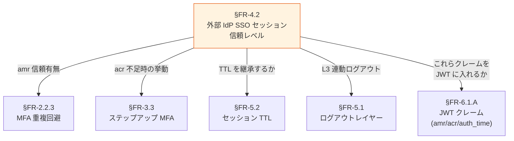
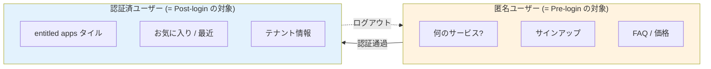
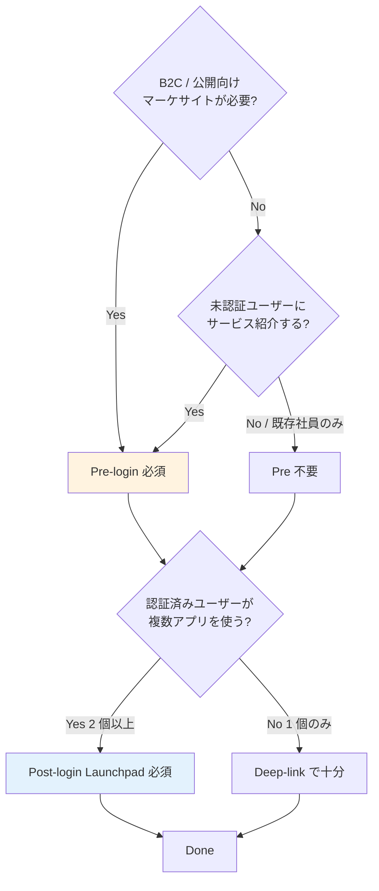
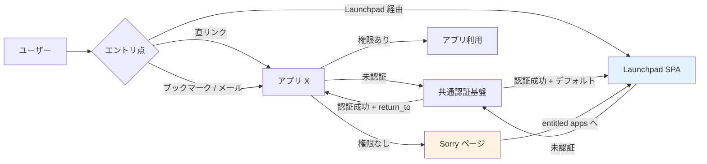
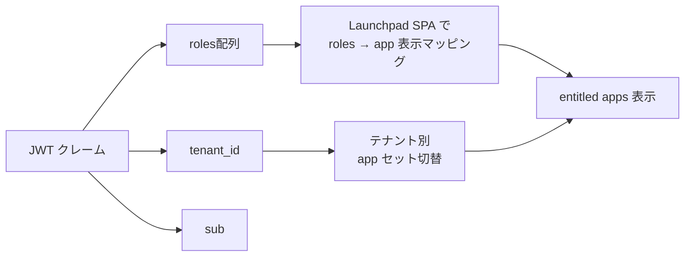
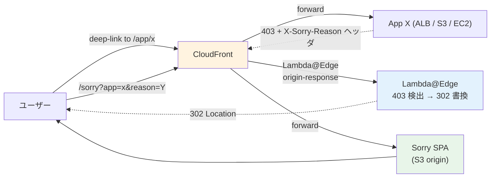
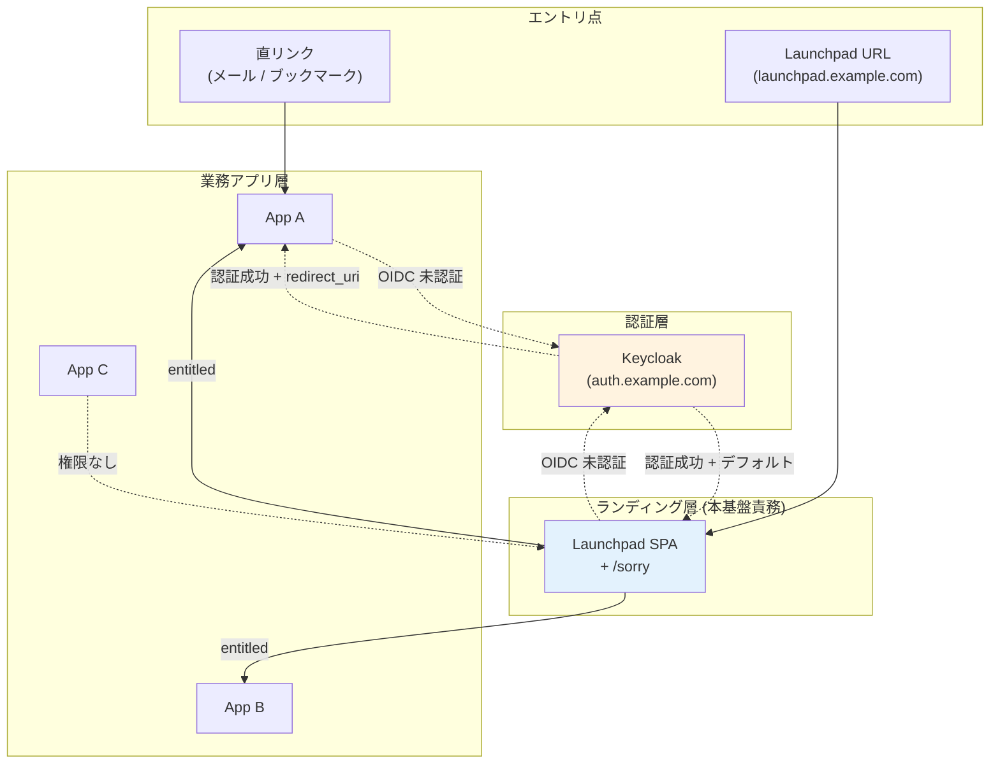

# §FR-4 SSO（シングルサインオン）

> 上位 SSOT: [00-index.md](00-index.md)   
> 詳細: [../../functional-requirements.md §4 FR-SSO/LOGOUT](../../functional-requirements.md)   
> カバー範囲: FR-SSO §4.1 SSO（SSO はここ、ログアウト・セッション管理は [§FR-5](05-logout-session.md)）

---

## §FR-4.0 前提と背景

### 用語整理

| 用語 | 本基盤での意味 |
|---|---|
| **SSO（Single Sign-On）** | 一度のログインで複数システムを利用可能にする仕組み |
| **同一 IdP 内 SSO** | 同じ Cognito User Pool / Keycloak Realm 内のアプリ間 SSO |
| **クロス IdP SSO** | 異なる IdP 間（Auth0 → Entra ID → Cognito 等）で SSO セッションが伝播 |
| **クロステナント SSO** | テナント境界で意図的に切断（[§FR-2.3.C](02-federation.md#33c-マルチテナント環境での-sso-挙動) 参照）|

### なぜここ（§FR-4）で決めるか



SSO は「**一度のログインで複数システムを利用できる**」UX を提供する核機能。Broker パターン（[§FR-9/§1 アーキテクチャ](../common/01-architecture.md)）の前提でもある。ログアウト・セッション管理は **§FR-5 で対** として扱う（性質が逆向き：SSO は広がり、ログアウトは終わり）。

### 共通認証基盤として「SSO」を検討する意義

| 観点 | 個別アプリで実装した場合 | 共通認証基盤で実装した場合 |
|---|---|---|
| SSO 実現 | アプリ間でセッション共有不可（別 Cookie）| **同一 IdP の全アプリで自動 SSO** |
| UX | アプリごとにログイン必須 | **1 回ログインで全システム利用可** |
| 顧客追加時の動作 | 各アプリで SSO 設定追加 | **基盤側 IdP 登録のみで全アプリ波及** |
| クロス IdP SSO | 各アプリで個別フェデ設定 | **基盤で吸収、アプリは透過** |

→ SSO の中央集約は、基本方針「**効率よく認証**」を実現する最大の手段。

### §FR-4.0.A 本基盤の SSO スタンス

> **同一 IdP（同 Cognito User Pool / Keycloak Realm）内のアプリ間 SSO は標準で有効。クロス IdP SSO は Broker パターンで吸収。テナント間 SSO は意図的に切断する（[§FR-2.3.C](02-federation.md) マルチテナント SSO 挙動）。ログアウト・セッション管理は対として [§FR-5](05-logout-session.md) で扱う。**

### §FR-4.0.B SSO の 3 つの粒度（混同しやすい論点の整理）

> **このサブ・サブセクションで定めること**: SSO の議論で混同されやすい「**3 つの異なる粒度**」を整理し、各論点がどの粒度を扱っているかを明示する。   
> **主な判断軸**: 顧客 IdP 配下のエコシステム（Outlook / Salesforce 等）との連携をどう設計するか   
> **§FR-4 全体との関係**: §FR-4.1 が粒度 [1]、§FR-4.2 が粒度 [2]、粒度 [3] は [2] の結果として成立する

#### 3 つの粒度



| 粒度 | 名称 | 範囲 | 主管章 |
|:---:|---|---|---|
| **[1]** | **テナント内 SSO** | 本基盤内アプリ間（経費精算 ↔ 勤怠管理） | [§FR-4.1](#fr-41-同一-idp-内-sso--fr-sso-001) |
| **[2]** | **クロス IdP SSO** | 本基盤 ↔ 顧客 IdP（Entra ID）のセッション伝播 | [§FR-4.2](#fr-42-クロス-idp-sso--fr-sso-002) |
| **[3]** | **クロスサービス SSO** | 顧客 IdP 配下の他社アプリ（Outlook / Salesforce 等）との結果的 SSO | [§FR-4.2](#fr-42-クロス-idp-sso--fr-sso-002) の効果として成立 |

#### よくある混同：「[3] は前提か?」

「**朝 Outlook を開いた時の Entra ID 認証で、本基盤の経費精算にも自動ログインできる**」 — これが粒度 [3]。
ユーザー側からは「**SSO の前提**」に見えるが、実装上は **粒度 [2] の信頼レベル設定の結果**として成立する。

| 観点 | 答え |
|---|---|
| 「SSO する」のは前提か | **Yes**（Broker パターン採用の時点で当然）|
| 「顧客 IdP のセッションを信頼する」のは前提か | **業界標準は Yes、ただし例外あり** |
| 「[3] が成立する」のは前提か | **粒度 [2] で L1 完全信頼を選んだ場合のみ** |

→ つまり **粒度 [3] は粒度 [2] の選択次第**。金融・規制業種で粒度 [2] を「L4 不信任」にすれば、[3] も成立しなくなる。詳細は [§FR-4.2](#fr-42-クロス-idp-sso--fr-sso-002)。

### 本章で扱うサブセクション

| サブセクション | 内容 | 関連 FR |
|---|---|---|
| §FR-4.1 同一 IdP 内 SSO | 同じ Pool/Realm 内のアプリ間 SSO（粒度 [1]） | FR-SSO-001 |
| §FR-4.2 クロス IdP SSO | フェデレーション IdP 経由の SSO 伝播（粒度 [2] + [3]） | FR-SSO-002 |
| §FR-4.3 ログイン後のランディング UX | Launchpad（entitled apps 一覧）/ Sorry ページ / Deep-Link return_to 制御 | FR-SSO-008 |

---

## §FR-4.1 同一 IdP 内 SSO（→ FR-SSO-001）

> **このサブセクションで定めること**: 同じ顧客テナント内の複数アプリ間で SSO セッションを共有する範囲とテナント境界の遮断ルール。   
> **主な判断軸**: SSO で繋ぐシステム範囲、同一テナント内でも切り離したいシステムの有無   
> **§FR-4 全体との関係**: §FR-4.1 = テナント内 SSO、§FR-4.2 = テナント跨ぎ SSO（フェデ）。マルチテナント挙動の詳細は [§FR-2.3.C](02-federation.md#33c-マルチテナント環境での-sso-挙動)

### 業界の現在地

OIDC / SAML で標準化済み。論点は「**何のシステム間で SSO を効かせるか**」のスコープ設計。

- 共通基盤内の Cognito User Pool / Keycloak Realm の SSO セッション Cookie をブラウザが保持
- 同じ Pool/Realm に紐づく App Client / Client を訪れた際、ログイン済みなら即座にトークン発行
- ブラウザを閉じてもセッションが残る場合と消える場合がある（Cookie 設定次第）

### 我々のスタンス（基本方針に基づく）

| 基本方針の柱 | 同一 IdP 内 SSO での実現 |
|---|---|
| **絶対安全** | テナント境界は越えない（`tenant_id` クレームで検証）|
| **どんなアプリでも** | SPA / SSR / Mobile / M2M 問わず同一 SSO セッションを共有 |
| **効率よく** | 顧客企業内システム間はログイン 1 回で全システム利用可能 |
| **運用負荷・コスト最小** | プラットフォーム標準機能、追加実装不要 |

### 対応能力マトリクス

| 機能 | Cognito | Keycloak (OSS/RHBK) | PoC 検証 |
|---|:---:|:---:|:---:|
| 同一 IdP 内 Client 間 SSO | ✅ User Pool 内 | ✅ Realm 内 | ✅ Phase 1, 7 |
| クロステナント切断 | ✅ tenant_id クレームで判定 | ✅ 同上 | — |
| SSO セッション TTL 設定 | ✅ App Client 設定 | ✅ Realm 設定 | [§FR-5.3 セッション管理](05-logout-session.md#63-セッション管理) で詳述 |

### ベースライン

| 項目 | ベースライン |
|---|---|
| 同一テナント内 SSO | **Must**（標準提供）|
| クロステナント | **遮断**（tenant_id クレームベース、[§FR-2.3.C](02-federation.md#33c-マルチテナント環境での-sso-挙動) 参照）|
| SSO セッション保持期間 | [§FR-5.3 セッション管理](05-logout-session.md#63-セッション管理) 参照 |

### TBD / 要確認

| 確認項目 | 回答例 |
|---|---|
| SSO で繋ぐシステム範囲 | 全システム / 認証スコープ別 / 機微情報システムのみ別 |
| 同一テナント内でも SSO を切りたいシステム | あり（高権限管理画面等）/ なし |

---

## §FR-4.2 クロス IdP SSO（→ FR-SSO-002）

> **このサブセクションで定めること**: 外部 IdP（Entra ID / Auth0 等）の SSO セッションを本基盤でも信頼してログイン省略する仕組み。   
> **主な判断軸**: クロス IdP SSO を全顧客有効にするか、外部 IdP の SSO セッション TTL に従うか   
> **§FR-4 全体との関係**: §FR-4.1 がテナント内 SSO、§FR-4.2 が**外部 IdP との SSO セッション伝播**。MFA 重複回避は [§FR-2.2.3](02-federation.md#323-mfa-重複回避--fr-fed-012) と整合

### 業界の現在地

外部 IdP（Auth0 / Entra ID 等）に SSO セッションがある場合、それを共通基盤側でも信頼して利用する。

例：
- ユーザーが Acme システムにアクセス → 共通基盤 → Acme の Entra ID にリダイレクト
- Entra ID で SSO セッション有効 → **ログイン画面を表示せず即時認証成功**
- 共通基盤に JWT を発行 → Acme システムへ

→ ユーザー視点：**Entra ID でログイン済みなら、Acme システムは完全シームレス**

### 我々のスタンス（基本方針に基づく）

| 基本方針の柱 | クロス IdP SSO での実現 |
|---|---|
| **絶対安全** | 外部 IdP の認証 assertion を検証（[§FR-2.2.3 MFA 重複回避](02-federation.md#323-mfa-重複回避--fr-fed-012) と整合）|
| **どんなアプリでも** | 顧客 IdP の種別に依存せず、OIDC / SAML 標準準拠なら SSO 伝播可能 |
| **効率よく** | Entra ID 利用中の社員は本基盤に意識なく入れる |
| **運用負荷・コスト最小** | プラットフォーム標準機能 |

### 対応能力マトリクス

| 機能 | Cognito | Keycloak (OSS/RHBK) | PoC 検証 |
|---|:---:|:---:|:---:|
| Auth0/Entra/Okta 経由のクロス IdP SSO | ✅ | ✅ | ✅ Phase 2, 7 |
| 外部 IdP の MFA 主張尊重（amr / AuthnContext） | ⚠ Pre Token Lambda 個別実装 | ✅ Conditional OTP 標準 | [§FR-2.2.3](02-federation.md#323-mfa-重複回避--fr-fed-012) |
| 外部 IdP セッション切れ時のフォールバック | ✅ ログイン画面表示 | ✅ ログイン画面表示 | — |

### 信頼の 4 段階レベル

「外部 IdP セッションを信頼するか」は **二者択一ではなく 4 段階のグラデーション**:

| レベル | 内容 | UX | セキュリティ | 主な採用例 |
|:---:|---|:---:|:---:|---|
| **L1 完全信頼**（業界標準デフォルト） | IdP セッションあれば即トークン発行、TTL も IdP に追従、`amr`/`acr` も継承 | ◎ 最高 | △ 中 | **Slack / Notion / Box / Auth0 / 一般 B2B SaaS** |
| **L2 部分信頼** | IdP セッション信頼するが、本基盤側 TTL を別に持つ（短く） | ○ 良 | ○ 高 | 中セキュリティ業務系 |
| **L3 検証ありき信頼** | IdP セッション信頼するが、`acr`/`amr` を毎回検査、足りなければステップアップ | △ 中 | ◎ 高 | 規制業種、決済システム |
| **L4 不信任（再認証強制）** | IdP セッションがあっても本基盤側で `prompt=login` で再認証 | × 悪 | ◎ 最高 | 金融・防衛など極めて厳格な業務系 |

→ **既存の TBD「全顧客有効 / 限定 / 無効」は概ね L1 / L3 / L4 に対応**。L2 は中間オプション。

### 「信頼する」とは技術的に何を意味するか

OIDC の世界では、信頼度を以下のパラメータで制御:

| 本基盤からの送信 | 効果 |
|---|---|
| `prompt=none` | サイレント認証要求（既存セッションのみ使い、なければエラー）|
| `prompt=login` | 強制再認証（既存セッション無視、ログイン画面表示）|
| `max_age=N` | N 秒以上経過した認証は無効、再認証要求 |
| `acr_values=2` | AAL2 要求（不足なら追加認証 = ステップアップ）|

IdP から受け取る ID Token のクレーム:

| クレーム | 意味 | 信頼する場合の挙動 |
|---|---|---|
| `auth_time` | いつ認証したか | 本基盤の JWT に継承 |
| `amr` | どんな方法で認証したか（pwd / mfa / hwk）| 本基盤の JWT に継承（[§FR-2.2.3](02-federation.md#323-mfa-重複回避--fr-fed-012) MFA 重複回避と連動）|
| `acr` | 認証保証レベル（AAL1/2/3）| 本基盤の JWT に継承（[§FR-3.3](03-mfa.md) ステップアップと連動）|

### 信頼を下げる動機（L3 / L4 採用シナリオ）

| シナリオ | 信頼度を下げる理由 |
|---|---|
| **金融機関の業務系** | コンプラ要件で「重要操作前は必ず本基盤で再認証」 |
| **PCI DSS 対象システム** | カード情報操作前にステップアップ MFA |
| **規制業種（医療・防衛）** | IdP 漏洩リスクを基盤側でも防御 |
| **多テナント混在** | 顧客 A は L1 信頼、顧客 B（金融）は L3 検証 |
| **アプリ別差別化** | 経費精算は L1、決済管理は L3 |

### リスクと対策可否マトリクス（事実調査ベース、2026-05 時点）

| # | リスク | Cognito 対策 | Keycloak 対策 | 顧客 IdP 側必須 | 完全防止可否 |
|:---:|---|:---:|:---:|:---:|:---:|
| 1 | IdP セッション乗っ取り | △ 軽減のみ | △ 軽減のみ | ✅ Conditional Access | ❌ 不可（軽減のみ）|
| 2 | 退職処理遅延 | △ 自前実装 | △ 標準 Introspection | △ SCIM で大幅改善 | △ 短 TTL + 追加実装で実現可 |
| 3 | `amr` 偽装 | ✅ 可能 | ✅ 可能 | — | ✅ ほぼ完全防止 |
| 4 | AAL 不整合 | ⚠ Lambda 自前 | ✅ 標準 | △ IdP の AAL 実装次第 | ○ Keycloak なら可 |
| 5 | 古い `auth_time` | ❌ 未対応 | ⚠ 標準対応だが 26.x バグ | — | ○ Keycloak で限定的に可 |

#### リスク 1: IdP セッション乗っ取り

| 軸 | 評価 | 詳細 |
|---|:---:|---|
| 本基盤側で直接対策 | ❌ | IdP の Cookie 管理は管轄外 |
| 本基盤側で間接対策 | ○ | Access Token 短 TTL（5-15 分）、Keycloak は `max_age` 制約 |
| 顧客 IdP 側で対策 | ✅ 必須 | Conditional Access / リスクベース認証 |

**残余リスク**: IdP Cookie 漏洩は本基盤に直接届く。検知不能（assertion は正規）。

##### BFF パターン採用との関係（よくある誤解）

> 「BFF を採用していればセッションハイジャックは起こらないのでは?」 — **No、本リスクは BFF と無関係**。

セッションハイジャックには **2 つの異なるレイヤー**がある:

| レイヤー | Cookie / Token の置き場所 | ハイジャックの手口 | BFF の効果 |
|---|---|---|---|
| **❶ 本基盤側セッション**（アプリ ↔ Hub） | アプリドメインの Cookie / SPA メモリ | XSS / LocalStorage 盗難 / ブラウザ拡張 | **✅ BFF で大幅軽減** |
| **❸ IdP 側 SSO セッション**（ユーザー ↔ IdP）| **IdP ドメイン**（`login.microsoftonline.com` 等）の Cookie | フィッシング / マルウェア / IdP 側 XSS | **❌ BFF と無関係** |

**理由**: Cookie はドメインで分離される。IdP の Cookie（`login.microsoftonline.com` 等）は本基盤も BFF も触れない（IdP のドメイン）。攻撃者が IdP の Cookie を奪えば、本基盤 / BFF が介在しても防ぎようがない（assertion は正規のため）。

```
[攻撃] 田中さんが脆弱な拡張 / フィッシングサイト経由で
       login.microsoftonline.com の Cookie を漏洩
       ↓
[攻撃者] 同じ Cookie をブラウザに注入 → Entra ID から見ると田中さん
       ↓
[本基盤] /authorize → Entra ID にリダイレクト → 「セッションあり」と応答
       ↓
[Hub] L1 完全信頼で即トークン発行 ← BFF があっても止まらない
       ↓
[BFF] 「本基盤からトークンが来た」としか分からない → 防ぎようがない
```

→ **BFF（[§FR-1.1](01-auth.md)）は ❶ レイヤー（XSS による Token 盗難）には強力だが、❸ レイヤー（IdP セッション乗っ取り）には別軸の対策が必要**。リスク 1 の対策は依然として「顧客 IdP 側の Conditional Access + 本基盤の短 TTL + Keycloak の `max_age` 制約」が本丸。

#### リスク 2: 退職処理遅延（**事実調査により前回回答を修正**）

**両プラットフォームとも Access Token 個別 revocation は不可能**（OAuth/OIDC 仕様準拠の制約）。`/revoke` エンドポイントは Refresh Token を無効化することで「次の Refresh 試行を失敗させる」設計:

| 機能 | Cognito | Keycloak |
|---|:---:|:---:|
| `/revoke` エンドポイント | ✅ RevokeToken API + /oauth2/revoke | ✅ /protocol/openid-connect/revoke（**RFC 7009 準拠、10.0.0+**）|
| Refresh Token revoke | ✅ | ✅ |
| **Access Token 個別 revoke** | **❌ 不可**（公式: "User pool JWTs are self-contained"） | **❌ 不可**（公式: "Keycloak chose not to support invalidating individual access tokens"） |
| Refresh 経由の Access 無効化 | ✅ 同じ Refresh Token のチェーン | ✅ 同じセッション |
| **外部リソースサーバーで revoke 反映** | ⚠ **`origin_jti` クレームを使って自前チェック必要** | ✅ **Token Introspection (`/introspect`) 標準提供** |
| 全 Token 強制無効化 | ✅ `AdminUserGlobalSignOut` | ✅ `Logout` API |

**重要な事実（公式記述）**:
> Cognito: "Revoked tokens can't be used with any Amazon Cognito API calls that require a token. **However, revoked tokens will still be valid if they are verified using any JWT library that verifies the signature and expiration of the token.**"

→ つまり Cognito Access Token は **Cognito API 経由では revoke 反映、外部リソースサーバー（Lambda Authorizer / API Gateway / 自前検証）では TTL 切れまで有効**。

**実装パターン**:
- **Cognito**: `origin_jti` を取得して revoke リストを Lambda Authorizer で照合 → **自前実装が必要**
- **Keycloak**: 外部リソースサーバーが `/introspect` に都度問い合わせ → **標準対応だがパフォーマンスコスト**

**残余リスク**:
- 短 TTL（5-15 分）期間中の遮断ラグ（両プラットフォーム共通）
- IdP 側 SCIM 連携がない場合、退職検知が JIT 時まで遅延

→ **両者の根本構造は同じ。Keycloak は Introspection 標準提供で実装が楽、ただし完全防止は不可（TTL ラグは残る）**。前回「Keycloak は Access Token も revoke 可能」と記述したが、**正確には「Refresh Token 経由で関連 Access Token を無効化」**（Cognito と同じ構造）。

#### リスク 3: `amr` 偽装

| 軸 | 評価 |
|---|:---:|
| 接続承認制（allowlist） | ✅ 完全可能 |
| IdP メタデータの信頼経路 | ✅ 可能 |
| `amr` 値の差別的信頼 | ✅ 可能（IdP 単位設定）|
| **完全防止** | ✅ **可能**（既存ベースラインで対処済）|

**実装**: IdP 接続は Terraform PR + レビュー、未承認 IdP は登録不可。「**信頼境界 = 接続承認された IdP のみ**」が[§FR-4.2 ベースライン](#ベースライン)に既明記。

**残余リスク**: 承認済 IdP の秘密鍵漏洩（→ 証明書ローテーション）、顧客 IdP 管理者の意図的偽装（→ 該当 IdP は `amr` 信頼せず再 MFA）。

#### リスク 4: AAL 不整合

| 機能 | Cognito | Keycloak |
|---|:---:|:---:|
| `acr_values` 要求のサポート | ❌ 未サポート | ✅ 標準 |
| **ACR to LoA Mapping** | ❌ 不在 | ✅ **Realm/Client レベルで標準設定**（26.x）|
| ステップアップ MFA フロー | ⚠ Custom Auth Challenge Lambda 自前 | ✅ Step-up Authentication 標準フロー |
| IdP 別の AAL マッピング | ⚠ Pre Token Lambda V2 で実装 | ✅ IdP Mapper |

**Keycloak 公式（26.6.1）**:
> "you can define which Authentication Context Class Reference (ACR) value is mapped to which Level of Authentication (LoA). The setting is recommended at realm level. The exception is when a specific client needs to have specific differences from the realm settings."

**残余リスク**: 顧客 IdP が AAL 概念を実装していない場合は全フェデユーザーを AAL 1 扱いで処理 + 本基盤側で AAL 2 強制（[§FR-3.3](03-mfa.md) と連動）。

#### リスク 5: 古い `auth_time` の悪用

| 機能 | Cognito | Keycloak |
|---|:---:|:---:|
| `max_age` パラメータ | **❌ 未サポート**（[authorize endpoint 公式仕様に記述なし](https://docs.aws.amazon.com/cognito/latest/developerguide/authorization-endpoint.html))| ✅ OIDC 標準対応 |
| `prompt=login`（毎回再認証） | ✅ 2025-05〜（**Essentials+ + Managed Login のみ**） | ✅ 標準 |
| `auth_time` クレーム参照 | ✅ Pre Token Lambda V2 で取得可 | ✅ Protocol Mapper で出力 |
| **Keycloak 26.x の既知の問題** | — | ⚠ **`max_age=0` の JS Adapter バグ（Issue #32764）、IdP brokering 時の伝播バグ（Issue #33641, #46078）、Organizations 機能との競合（Issue #36249）** |
| IdP Brokering 時の追加設定 | — | ⚠ **「Pass max_age」設定を IdP プロバイダ設定で有効化必須** |

**Cognito での代替策**:
| 方法 | 効果 | UX |
|---|---|---|
| 短い Refresh Token TTL | 粗い粒度 | △ |
| Pre Token Lambda で `auth_time` 検査 → エラー返却 | 条件付き再認証 | △ 手動再ログイン要 |
| `prompt=login` を常時 | 毎回ログイン画面 | × 最悪 |

**結論**: **Cognito では「N 秒経過したセッションのみ再認証」の柔軟性は持てない**。Keycloak は標準対応だが 26.x の複数バグに注意（バージョン固定戦略推奨）。

#### 補足: CAEP（Continuous Access Evaluation Profile）の対応状況

CAEP（OpenID 仕様）は「リアルタイムでの継続的アクセス評価」を実現する将来発展形:

| プラットフォーム | CAEP 対応 |
|---|:---:|
| **Cognito** | ❌ **公式言及なし、未対応**（2026-05 調査時点）|
| **Keycloak / RHBK** | ❌ **公式言及なし、未対応** |
| Microsoft Entra | ✅ 実装済（Conditional Access と統合） |
| Google / Apple / Okta / IBM | ✅ 採用宣言済 |

→ CAEP は両プラットフォームの将来発展課題。詳細は [§FR-5.4](05-logout-session.md) 参照。

### プラットフォーム選定への含意

| リスク | Cognito で対処可能 | Keycloak で対処可能 |
|---|:---:|:---:|
| 1. IdP セッション乗っ取り | △ 軽減 | △ 軽減 |
| 2. 退職処理遅延 | △ 自前実装で限定的 | △ Introspection で限定的（両者同等）|
| 3. amr 偽装 | ✅ | ✅ |
| 4. AAL 不整合 | ⚠ Lambda 自前 | ✅ 標準 |
| 5. 古い auth_time | ❌ | ⚠ 標準だが 26.x バグ |
| **合計（完全/標準対処）** | **1/5** | **2.5/5** |

→ **規制業種顧客（金融・医療・PCI DSS）で 4・5 が必須なら Keycloak が事実上必須**。一般 B2B SaaS（1〜3 のみで充足）なら Cognito でも対応可能。詳細は[§C-2 プラットフォーム選定](../common/02-platform.md)。


### 関連設計判断との連動（重要）

「信頼レベル」は **5 つの章と直結**:



### プラットフォーム実装の差

| 機能 | Cognito | Keycloak |
|---|:---:|:---:|
| 外部 IdP セッション信頼（L1）| ✅ 標準動作 | ✅ Identity Brokering 標準動作 |
| `prompt=none`（サイレント認証）| **✅ 2025-05 サポート開始（Essentials+）** | ✅ 標準 |
| `prompt=login`（強制再認証）| **✅ 2025-05 サポート開始（Essentials+）** | ✅ 標準 |
| `max_age` 制約 | **❌ 未サポート** | ✅ 標準 |
| `acr_values` ステップアップ（L3）| ❌ Custom Auth Challenge で自前実装 | ✅ Authentication Flow + LoA Mapping 標準 |
| `amr` クレーム検査・継承 | ⚠ Pre Token Lambda V2 で実装 | ✅ Conditional OTP 等で標準対応 |

→ **L3「検証ありき信頼」を実現するなら Keycloak が圧倒的に楽**。Cognito では Lambda 自前実装が多い。

### 業界実例

| サービス | 信頼レベル |
|---|---|
| **Slack / Notion / Box** | L1 完全信頼（業界標準）|
| **Microsoft 365 B2B** | L1（同一 Entra テナント内）|
| **Auth0 Enterprise Connections** | L1 デフォルト、L3 にカスタマイズ可 |
| **金融機関の B2B 業務系** | L3 / L4 が多い |
| **PCI-DSS 対象システム** | L3（カード情報操作前に再認証）|

### ベースライン

| 項目 | ベースライン |
|---|---|
| クロス IdP SSO | **Must**（フェデレーション運用の前提）|
| **デフォルト信頼レベル** | **L1 完全信頼**（業界主流）|
| 接続承認した IdP のみ信頼 | 未承認 IdP は接続不可 |
| **金融・規制業種向けオプション** | **L3 検証ありき信頼**（`acr_values` 検査 + ステップアップ）|
| **TTL の扱い** | **IdP TTL に従う**（業界標準）+ 本基盤 Access Token は短 TTL（5-15 分）|
| 外部 IdP の MFA 主張 | **信頼**（[§FR-2.2.3](02-federation.md#323-mfa-重複回避--fr-fed-012)）|

### TBD / 要確認（[hearing-checklist.md](../../hearing-checklist.md) B-801〜B-802 系と連動）

| 確認項目 | ヒアリング ID | 回答例 |
|---|---|---|
| デフォルト信頼レベル | **B-801-1** | L1 完全信頼 / L2 部分信頼 / L3 検証ありき / L4 不信任 |
| 顧客 / IdP / アプリ別の差別化要否 | **B-801-2** | 全顧客 L1 / 顧客別 / アプリ別 |
| 規制業種向け L3 オプションの要否 | **B-801-3** | 必須（金融顧客あり）/ 不要 |
| 外部 IdP の SSO セッション TTL に従うか | B-802 | はい（推奨）/ 本基盤側で上書き |
| `max_age` 制約の適用 | **B-802-2** | 適用する（時間）/ 適用しない |

---

## §FR-4.3 ログイン後のランディング UX（Launchpad / Sorry / Deep-Link）（→ FR-SSO-008）

> **このセクションで定めること**: 認証が完了した後、ユーザーが **「どのアプリ・どの画面に着地するか」** の UX 設計。具体的には (1) 直リンク（deep-link）後の自動遷移、(2) Post-login Launchpad（entitled apps 一覧 SPA）、(3) 権限がないアプリへのアクセス時の Sorry ページ、の 3 つの責務分担を確定する。   
> **主な判断軸**: アプリの数と入口の多様性（社内 / 顧客 / 外部）、ユーザーが「自分が何にアクセス権限を持つか」を知る必要性、ブランディング要件、運用工数   
> **§FR-4 全体との関係**: §FR-4.1 同一 IdP 内 SSO・§FR-4.2 クロス IdP SSO は**セッション共有の仕組み**を扱う。本サブセクションは**「認証完了後の着地点 UX」**を扱う独立論点。HRD（[§FR-2.3.3](02-federation.md#fr-2.3.3-ログイン画面で-idp-選択-ux--home-realm-discovery--fr-fed-013)）とは別軸

### §FR-4.3.0 前提と背景

#### Pre-login vs Post-login は「二択」ではなく「役割の違う 2 軸」

「ユーザーがどのシステムを使うか」を**ログイン前**に選ばせるか、**ログイン後**に選ばせるか — これは UX 設計上の大きな分岐点だが、**二択ではない**。両者は対象ユーザーが違うため**共存可能**で、むしろ大手 B2B SaaS は両方持つのが標準。

##### 4 つの組合せパターン

| パターン | Pre-login | Post-login Launchpad | 業界実例 |
|---|:---:|:---:|---|
| ① Pre のみ | ✅ | ❌ | 社内イントラ単体 |
| ② Post のみ | ❌ | ✅ | Okta End-User Dashboard 単独運用 |
| **③ Pre + Post**（**B2B SaaS で多い**）| ✅ | ✅ | Atlassian（`atlassian.com` + `start.atlassian.com`）/ Microsoft（`microsoft.com` + `office.com`）|
| ④ いずれもなし | ❌ | ❌ | Deep-link 専用（メール / ブックマーク主体）|

##### 役割別の住み分け



→ **Pre = マーケティング / 発見 / サインアップ**（匿名訪問者向け）、**Post = 生産性 / 権限ベース / 個人化**（認証済ユーザー向け）。**両者は競合せず、対象ユーザーが違う**。

##### 詳細比較（20 観点）

| # | 観点 | Pre-login | Post-login Launchpad |
|---|---|---|---|
| 1 | **誰に何を見せるか** | 匿名訪問者にサービス群を見せる | 認証済ユーザーに **entitled apps だけ**見せる |
| 2 | **権限ベースのフィルタ** | ❌ 不可（未認証）| ✅ JWT roles / tenant_id でフィルタ |
| 3 | **「使えないシステム」誤選択** | 発生（クリック後 Sorry へ）| 発生しない（最初から非表示）|
| 4 | **マーケティング / 値訴求** | ✅ 主目的（"何ができるか" 訴求可）| ❌ 認証済ユーザー対象 |
| 5 | **新規サインアップ導線** | ✅ 自然に組込可 | ❌ 認証済前提 |
| 6 | **公開情報**（FAQ / プライシング / 営業窓口）| ✅ 自然 | ❌ 認証越しは不自然 |
| 7 | **個人化**（最近使った / お気に入り）| ❌ 不可 | ✅ ユーザー固有 |
| 8 | **ブランディング** | コーポレートブランド前面 | プロダクトブランド前面 |
| 9 | **既知ユーザーの操作工数** | Pre 経由は 1 クリック増 | Deep-link なら最短 |
| 10 | **エンタープライズ顧客の "自社専用入口" 期待** | 中（パブリック Web 寄り）| 高（Launchpad は社内ツール感）|
| 11 | **テナント別カスタマイズ** | 弱（共通 Pre 1 枚 or テナント別 URL）| 強（テナント認識済、自由）|
| 12 | **セキュリティ面の攻撃面** | 公開エンドポイント → 一般 Web セキュリティで十分 | 認証越し → 内部情報（ロール / アプリ名）漏出対策が必要 |
| 13 | **アプリ追加時の更新場所** | Pre ページ（手動）| Launchpad（ロール定義 + 自動表示）|
| 14 | **アプリ削除時の更新場所** | Pre ページの手動更新 | Launchpad は自動（ロール失効でフェードアウト）|
| 15 | **多言語対応** | 必須（B2C / 海外顧客向け）| アプリ側に揃える程度 |
| 16 | **B2B エンタープライズのホワイトラベル要望** | 顧客ロゴ程度（共通 Pre は弱い）| 強い対応可（Theme / config）|
| 17 | **「初めて使うが何ができる?」の発見性** | ✅ 良好 | ❌ 認証後でしかわからない |
| 18 | **オフライン / 障害時のフォールバック** | 静的 HTML で生存可 | 認証基盤依存（落ちると見えない）|
| 19 | **Cookie / セッション削除後の挙動** | 何も困らない | 再ログイン後 Launchpad へ |
| 20 | **既存システムからの移行容易性** | 既存ポータルをそのまま流用しやすい | 新規構築が必要 |

##### 採用判断の決定木



##### 顧客像別の推奨パターン

| 顧客像 | 推奨パターン | 理由 |
|---|---|---|
| 社内専用、既存社員のみ、複数アプリ | **② Post のみ** | マーケ不要、entitled apps 提示で十分 |
| B2C / B2B 両方、複数アプリ | **③ Pre + Post** | 業界標準（Atlassian / Microsoft 型）|
| 完全社内、アプリ 1 つだけ | **④ いずれもなし**（Deep-link） | Launchpad もなしで OK |
| マーケサイト中心、アプリは付随 | **① Pre のみ** | 業務アプリが弱いケース |

##### よくある誤解と落とし穴

| 誤解 | 実際 |
|---|---|
| 「Pre があれば Sorry 不要」| ❌ Sorry は別軸。Pre 経由でも権限ない場合は Sorry 必要 |
| 「Post があれば Pre は不要」| ⚠ 公開向けマーケサイトが必要なら Pre も必要 |
| 「Launchpad = ホームページ」| ❌ Launchpad は entitled apps の起動台、ホームページ（マーケサイト）と役割違い |
| 「Pre-login で entitled apps を見せる」| ❌ 未認証では権限不明、原理的に不可 |
| 「Pre と Launchpad は同じ画面でいい」| ⚠ 認証前後で見せる情報が違うため、画面を分けるのが業界標準 |

##### Sorry ページとの関係（別軸、ただし連動）

Sorry は「**認証は成功したが、アクセスしようとしたアプリの権限を持たない**」場合の処理で、Pre/Post とは**独立した軸**。ただし設計上は連動する:

| Pre / Post の組合せ | Sorry の自然な振る舞い |
|---|---|
| Post-login Launchpad あり | Sorry → Launchpad にリダイレクト（entitled apps へ誘導）|
| Post なし、Pre のみ | Sorry → Pre ページに戻す（ただし匿名と同じ景色で UX 弱い）|
| 両方なし（Deep-link 主体）| Sorry 専用ページが必須（アプリ別のフォールバック先がない）|
| 両方あり | Sorry → Post Launchpad へ |

##### 本基盤のデフォルトスタンス

| 観点 | デフォルト |
|---|---|
| Pre-login | **B-626 ヒアリングで判定**。マーケサイト要否次第で採用 / 不採用を決める |
| Post-login Launchpad | **採用**（業界標準、複数アプリの効率な起動）|
| Sorry | **採用**（権限なしクリック時の必須挙動）|
| デフォルト構成 | **② Post + Sorry**（または **③ Pre + Post + Sorry**）|

### §FR-4.3.A 本基盤のランディングスタンス

本基盤は次の **3 つのエントリ点パターン**を統合した着地 UX を提供:



### §FR-4.3.1 Post-login Launchpad（→ FR-SSO-008-1）

> **このサブ・サブセクションで定めること**: 認証完了後にユーザーが着地する**ランチパッド SPA** の責務、entitled apps の判定根拠、Keycloak Account Console との関係。

#### 業界の現在地

| サービス | Launchpad 形態 |
|---|---|
| **Microsoft 365 portal** | `office.com` ハブ。entitled apps をタイル表示、お気に入り / 検索 / 履歴 |
| **Okta End-User Dashboard** | `*.okta.com/app/UserHome` でアプリタイル、SSO はクリック 1 回 |
| **Atlassian Cloud start** | `start.atlassian.com` で全 Atlassian アプリ + サードパーティ tile |
| **Salesforce App Launcher** | アプリ内（Lightning Experience）で App 切替 |
| **AWS IAM Identity Center** | SSO portal でロール選択 |

→ いずれも **独立した SPA** で構築。**Keycloak の Account Console とは別物**。

#### Launchpad の責務と Keycloak の限界

| 機能 | Keycloak Account Console "Applications" タブ | 独立 Launchpad SPA |
|---|:---:|:---:|
| entitled clients のリスト表示 | ✅ 標準 | ✅ |
| "Always Display in Console" 制御 | ✅ クライアント単位設定 | ✅ |
| **業界標準 UX**（タイル / 検索 / お気に入り / 履歴）| ❌ | ✅ |
| カスタムブランディング | ⚠ Theme 微調整のみ | ✅ 自由設計 |
| **Authz ロールベースの可視性制御**（ロールで非表示）| ⚠ 制限あり | ✅ JWT クレームで完全制御 |
| アプリへの SSO 遷移 | ✅ deep-link 可 | ✅ |
| 管理外アプリのリンク（社内 Wiki / Slack ワークスペース等）| ❌ | ✅ |
| **本基盤の採用方針** | ⚠ 補助的（ユーザー自身のアカウント設定が主目的）| ✅ **業界標準として別 SPA 構築** |

→ **Account Console は「ユーザーが自分のアカウント設定を管理する場所」**であり、**Launchpad の業界標準 UX は別 SPA で構築**するのが現実的。

#### entitled apps の判定根拠



- Launchpad SPA は **JWT を検証して `roles` / `tenant_id` から表示アプリを決定**
- マッピング表は Launchpad SPA 内（or 設定 DB）に保持
- 「ロール = アプリ」の対応は [§FR-6 認可](06-authz.md) と整合

#### Keycloak で実装する場合の最小構成

```
Common Auth Platform (Keycloak)
   ↓ OIDC
Launchpad SPA (auth.example.com/launchpad)
   ↓ JWT 検証 + roles 解析
[App A tile] [App B tile] [App C tile]
   ↓ deep-link with active session
App A / B / C (各システム)
```

| コンポーネント | 実装 |
|---|---|
| Launchpad SPA | React / Vue 等で OIDC RP として実装、Keycloak client として登録 |
| 表示アプリリスト | Keycloak Client ロール / JWT `roles` クレームから動的生成 |
| 各アプリへの SSO 遷移 | アプリの URL に redirect、SSO セッションで認証フローはスキップ |
| ブランディング | テナント別 theme / config 切替可能 |

### §FR-4.3.2 Sorry ページ（権限なしアクセス時）（→ FR-SSO-008-2）

> **このサブ・サブセクションで定めること**: ユーザーが直リンクでアプリ X にアクセスしたが、認証は成功したものの**そのアプリの権限を持たない**場合の挙動とページ設計。

#### 3 つの実装パターン

| パターン | 責務分担 | UX | 採用例 |
|---|---|---|---|
| **A. アプリ側 Sorry + Launchpad リンク** | アプリ X が `403` → 自前 Sorry ページ → Launchpad リンク | アプリのブランディング維持 | Atlassian Cloud |
| **B. 認証基盤の Sorry テーマ** | Keycloak の `access_denied` ページを Theme カスタマイズ | 認証基盤側で統一 | 小規模システム |
| **C. 共通 Sorry SPA** | アプリ X が `403` → `auth.example.com/sorry?app=x` にリダイレクト → 共通 SPA がガイダンス表示 + entitled apps リスト | **業界標準** | LinkedIn / Microsoft 365 |

→ **本基盤の推奨は C**。Launchpad SPA 内に `/sorry` パスを設けて統合運用。アプリは `403` 時に **`/sorry?app=x` にリダイレクトするだけ**で良い。

#### Sorry ページの最低限の情報

| 表示項目 | 理由 |
|---|---|
| **「このアプリにはアクセス権がありません」**（明確なメッセージ）| 認証失敗ではないことを伝える |
| ユーザー自身の情報（名前 / テナント）| 「別人としてログイン中?」の不安解消 |
| **entitled apps の一覧 or Launchpad リンク** | 行き先を提供 |
| アクセス申請の連絡先 | 「使いたい場合は管理者に連絡」|
| ログアウトリンク | 別人としてログインし直す場合 |

#### Sorry ページの設計アンチパターン

| アンチパターン | 問題 |
|---|---|
| 「認証エラー」と表示する | 認証は成功している。ユーザーが PW 再入力を試みる無駄が発生 |
| **アプリの存在自体を隠す**（"Not Found" 表示）| 一部の規制業種では透明性要件と矛盾。本基盤としては推奨しない |
| **詳細な権限内訳を表示**（"あなたは admin ロールが必要だが viewer のみ"）| 内部ロール構造を漏らす攻撃面 |
| ホーム画面に強制リダイレクト（何も表示せず）| 「なぜ?」がわからずユーザーが混乱 |

#### §FR-4.3.2.A AWS edge での Sorry 制御パターン（ALB / CloudFront 統合）

> **このサブ・サブセクションで定めること**: 上記 §FR-4.3.2 3 つの実装パターン（A アプリ側 / B 認証基盤 Theme / C 共通 Sorry SPA）を **AWS インフラ層でどう実装するか**。アプリ個別実装を避け、ALB / CloudFront に集約する 5 つのパターンを比較し、推奨を確定する。   
> **主な判断軸**: アプリ数 / マルチオリジン構成の有無、JWT 検証をどこで行うか、ブランディング要件、遅延要件、運用負荷、コスト   
> **§FR-4.3.2 内の位置付け**: 実装パターン C「共通 Sorry SPA」を AWS で具体的にどう実現するかの**インフラ層設計**

##### なぜ edge 集約を検討するか

- 業務アプリが N 個ある場合、**各アプリが 403 → Sorry リダイレクトを個別実装するのは非経済的**
- 403 ハンドリングを **ALB / CloudFront に寄せれば、アプリは単に 403 を返すだけ**で良い
- 認証連動の判定（JWT クレーム検証）も edge でできる
- Sorry SPA は **1 つだけ S3 に置けば全アプリで共有**できる

##### 5 つの AWS 実装パターン

| # | パターン | edge 層 | JWT 検証 | 動的コンテキスト | 工数 | 遅延 | コスト | 推奨度 |
|---|---|---|---|:---:|:---:|:---:|:---:|:---:|
| **i** | **CloudFront Custom Error Response**（静的）| CloudFront | アプリ任せ | ❌（静的 HTML のみ）| ◎ 設定のみ | 0 | ◎ ほぼ 0 | ★★★（アプリ少時）|
| **ii** | **CloudFront + Lambda@Edge（origin-response 403 → 302 redirect）**（**業界標準・推奨**）| CloudFront | アプリ任せ | ✅ クエリ動的化 | △ Lambda 実装 | 〜10ms | ⚠ Lambda@Edge 実行料 | ★★★★★ |
| **iii** | **CloudFront + Lambda@Edge（viewer-request JWT 検証）**（先回り判定）| CloudFront | ✅ edge で実行 | ✅ | ❌ Lambda + KMS 鍵検証 | 〜20ms | ⚠ 全リクエストに乗る | ★★★（高度な要件のみ）|
| **iv** | **ALB authenticate-oidc + 403 ターゲット**（OIDC 認証付き ALB）| ALB | ALB が OIDC 認証、JWT を `x-amzn-oidc-data` ヘッダで target に渡す | △ 限定的 | △ ALB 設定 | 0 | ◎ ALB のみ | ★★★（単一 ALB 構成時）|
| **v** | **ALB Native JWT Validation**（2025 新機能）| ALB | ✅ ALB がネイティブ検証 | △ ヘッダで判定可 | ◎ 設定のみ | 0 | ◎ ALB のみ | ★★★★（最新構成、適用範囲確定後）|

##### 推奨アーキテクチャ：パターン ii（CloudFront + Lambda@Edge）



##### パターン ii の実装ポイント

```javascript
// Lambda@Edge: origin-response トリガー
exports.handler = async (event) => {
  const response = event.Records[0].cf.response;
  const request = event.Records[0].cf.request;

  if (response.status === '403') {
    const appName = request.uri.match(/^\/app\/([^/]+)/)?.[1] || 'unknown';
    const reason = response.headers['x-sorry-reason']?.[0]?.value || 'not_entitled';

    return {
      status: '302',
      statusDescription: 'Found',
      headers: {
        location: [{
          key: 'Location',
          value: `/sorry?app=${encodeURIComponent(appName)}&reason=${encodeURIComponent(reason)}`,
        }],
      },
    };
  }
  return response;
};
```

##### パターン v（ALB Native JWT Validation、2025 新機能）の使い所

ALB が OIDC IdP（Keycloak）の JWT を**ネイティブで署名検証**できるようになり、特定の claim 有無で Listener Rule を分岐できる。

- **適合**: 単一 ALB に複数アプリがぶら下がる構成、JWT クレームベース粗粒度ルーティング
- **制限**: 11K byte claim 制約あり（超過時 HTTP 500）、ALB が JWT を含むリクエストを受け取る必要がある（典型: Authorization ヘッダ）
- **本基盤適用**: Identity Broker 配下のアプリが ALB 経由ならパターン v は最少工数で導入可。**ただし業界での適用実績がまだ少ない**ため、パターン ii を主にしてパターン v はオプション位置付け

##### パターン別比較（推奨判断の整理）

| 観点 | i 静的 | **ii Lambda@Edge** | iii viewer-request | iv ALB OIDC | v ALB JWT |
|---|:---:|:---:|:---:|:---:|:---:|
| **マルチオリジン対応** | ✅ | ✅ | ✅ | ⚠ ALB 配下のみ | ⚠ ALB 配下のみ |
| **アプリ無変更で導入** | ✅ | ⚠ 403 + ヘッダ返却が必要 | ✅ | ✅ | ⚠ JWT 送信が必要 |
| **動的コンテキスト**（app 名 / 理由）| ❌ | ✅ | ✅ | ⚠ 限定的 | ⚠ 限定的 |
| **JWT 検証を edge で完結** | ❌ | ❌ | ✅ | ✅ | ✅ |
| **遅延ペナルティ** | 0 | 〜10ms（403 時のみ）| 〜20ms（全リクエスト）| 0 | 0 |
| **ブランディング細かな反映** | ⚠ 静的 HTML | ✅ Sorry SPA で自由 | ✅ | ⚠ ALB は HTML 表示弱い | ⚠ 同左 |
| **Sorry SPA との統合**（B-622 連動）| ⚠ 別 SPA で運用は弱い | ✅ クエリ受渡で完全統合 | ✅ | ⚠ 受渡が手間 | ⚠ 同左 |
| **運用変更頻度** | 低（静的）| 中（Lambda 改修）| 高（JWT ロジック改修）| 中 | 中 |
| **コスト**（月間 1M リクエスト想定）| 〜数 USD | 〜20 USD | 〜100 USD（全リクエスト）| ALB のみ | ALB のみ |
| **障害時の挙動** | CloudFront 健全なら継続 | Lambda@Edge 障害で 5xx 露出 | 同左、影響範囲広い | ALB 障害でアプリ全停止 | 同左 |

##### 顧客状況別の推奨

| 顧客状況 | 推奨パターン | 理由 |
|---|---|---|
| **業務アプリ 3 個以上、CloudFront 前段あり**（本基盤の標準想定）| **ii Lambda@Edge** | 動的コンテキスト + Sorry SPA 統合 + アプリ無変更（403 ヘッダ返却のみ）|
| アプリ 1 個のみ、簡素な要件 | **i Custom Error Response** | コストゼロ、運用最小 |
| 全アプリが ALB 配下、JWT 認証統一 | **v ALB Native JWT Validation** | 最少工数、edge 完結 |
| 多層認証 + 高度なクレーム判定 | **ii + iii の組合せ** | 認証は viewer-request、Sorry は origin-response |

##### 我々のスタンス

| 基本方針の柱 | AWS edge Sorry 制御での実現 |
|---|---|
| **絶対安全** | edge での JWT 署名検証（v）、Sorry での内部情報非露出 |
| **どんなアプリでも** | アプリは「403 + ヘッダ返却」だけで OK、Sorry 集約 |
| **効率よく認証** | edge 集約で個別アプリ実装不要、変更は 1 箇所 |
| **運用負荷・コスト最小** | パターン ii は Lambda@Edge 1 本 + Sorry SPA 1 つ + S3 で完結 |

##### 参考資料

- [AWS Blog: Customize 403 error pages from CloudFront Origin with Lambda@Edge](https://aws.amazon.com/blogs/networking-and-content-delivery/customize-403-error-pages-from-amazon-cloudfront-origin-with-lambdaedge/)
- [AWS Blog: Generating dynamic error responses in CloudFront with Lambda@Edge](https://aws.amazon.com/blogs/networking-and-content-delivery/generating-dynamic-error-responses-in-amazon-cloudfront-with-lambdaedge/)
- [AWS Docs: Authenticate users using an Application Load Balancer](https://docs.aws.amazon.com/elasticloadbalancing/latest/application/listener-authenticate-users.html) — `authenticate-oidc` で Keycloak 連携可
- [AWS Docs: Verify JWTs using an Application Load Balancer](https://docs.aws.amazon.com/elasticloadbalancing/latest/application/listener-verify-jwt.html) — 2025 新機能 ALB Native JWT Validation
- [AWS Blog: Security best practices when using ALB authentication](https://aws.amazon.com/blogs/networking-and-content-delivery/security-best-practices-when-using-alb-authentication/) — `x-amzn-oidc-data` ヘッダ署名検証要件

### §FR-4.3.3 Deep-Link 後の return_to 制御（→ FR-SSO-008-3）

> **このサブ・サブセクションで定めること**: ユーザーがアプリ X に直リンク → 認証基盤に redirect → 認証完了 後、**元のアプリ X に戻る** 制御。`return_to` / `redirect_uri` の検証ルール。

#### 標準 OIDC フローでの return_to

- OIDC `redirect_uri` パラメータがアプリ X の URL
- Keycloak は **Client の登録済 Valid Redirect URIs** と完全一致でない限り拒否
- 認証成功後、`code` を持って `redirect_uri` にリダイレクト
- 業界標準（Keycloak / Cognito 共通）

#### return_to が機能しないケースと対策

| ケース | 対策 |
|---|---|
| `redirect_uri` が未登録 / 不正 | Keycloak が `Invalid redirect_uri` エラー表示 → アプリ側で Valid Redirect URIs 設定を確認 |
| セッションタイムアウト中の deep-link | 認証フロー後に `redirect_uri` でアプリに戻る（標準動作）|
| Launchpad 経由ログインでアプリに飛ばしたい | Launchpad が **App tile クリック時にアプリの URL に redirect**（アプリ側 OIDC フローが起動、SSO セッションで即返る）|
| 認証後に Launchpad に必ず着地させたい | `redirect_uri` を Launchpad SPA に固定（業界標準は **アプリ側 redirect_uri 優先**、Launchpad はデフォルト着地点のみ）|

### §FR-4.3.4 推奨デフォルトアーキテクチャ



### §FR-4.3.B 我々のスタンス

| 基本方針の柱 | Launchpad / Sorry / Deep-Link 設計での実現 |
|---|---|
| **絶対安全** | redirect_uri の厳格検証、user enumeration 対策、Sorry での内部ロール非表示 |
| **どんなアプリでも** | 直リンク / Launchpad / メール / ブックマーク 全パターン対応、業界標準パターン C |
| **効率よく認証** | アプリは entitled なら直アクセス、そうでなければ Sorry → Launchpad |
| **運用負荷・コスト最小** | Keycloak は OIDC 標準動作のみ、Launchpad / Sorry は独立 SPA（変更頻度に応じて独立リリース可能）|

### §FR-4.3.C プラットフォーム実装の差

| 機能 | Cognito | Keycloak |
|---|:---:|:---:|
| OIDC redirect_uri 検証 | ✅ 標準 | ✅ 標準 |
| Account Console（簡易 Launchpad）| ❌ なし | ✅ あり（補助用途）|
| Custom Sorry テーマ | ⚠ Hosted UI で限定的 | ✅ Theme で完全カスタマイズ |
| クライアント別 default redirect | ✅ App Client 単位 | ✅ Client 単位 |
| Launchpad SPA との統合 | ✅ OIDC RP として実装可 | ✅ 同左 |

→ **どちらでも Launchpad SPA を別構築する設計は同等に可能**。Keycloak は Account Console を補助的に使える分やや優位。

### §FR-4.3 TBD / 要確認

| 確認項目 | ヒアリング ID | 回答例 |
|---|---|---|
| Launchpad SPA の構築方針 | **B-622** | 別 SPA 構築（推奨）/ Keycloak Account Console 流用 / 不要（直リンクのみ）|
| Sorry ページの実装パターン | **B-623** | A アプリ側 / B 認証基盤テーマ / C 共通 Sorry SPA（推奨）|
| Launchpad のテナント別ブランディング要否 | **B-624** | あり（テナント別 theme）/ なし（共通 UI）|
| 認証後のデフォルト着地点 | **B-625** | `redirect_uri` 優先（直リンク尊重）/ Launchpad 強制 |
| Pre-login システム選択 UI の採否 | **B-626** | 不採用（業界標準）/ 採用（社内イントラ要件）|
| Launchpad の表示アプリ判定根拠 | **B-627** | JWT `roles` / Keycloak Client ロール / 顧客別マッピング表 / 全部組合せ |
| **AWS edge での Sorry 制御パターン**（§FR-4.3.2.A）| **B-628** | i Custom Error Response / **ii Lambda@Edge（推奨）** / iii viewer-request JWT / iv ALB OIDC / v ALB Native JWT |
| **edge 集約 vs アプリ個別 Sorry 実装**（§FR-4.3.2.A）| **B-629** | edge 集約（推奨、変更 1 箇所）/ アプリ個別（既存変更最小） |
| **CloudFront / ALB のどちらを主インフラに置くか**（§FR-4.3.2.A）| **B-630** | CloudFront 前段 + ALB 配下（標準）/ ALB のみ / CloudFront のみ（S3 単独）|

### 参考資料（§FR-4.3 関連）

- [Keycloak Account Console — Applications tab](https://access.redhat.com/documentation/en-us/red_hat_build_of_keycloak/22.0/html/server_administration_guide/account-service)
- [Keycloak issue #23885: Display only accessible clients in Account Console](https://github.com/keycloak/keycloak/issues/23885)
- [Microsoft 365 portal architecture](https://learn.microsoft.com/en-us/microsoft-365/admin/admin-overview/admin-center-overview)
- [Atlassian Cloud start page](https://support.atlassian.com/atlassian-account/docs/launch-products-from-your-start-page/)
- [Salesforce App Launcher](https://help.salesforce.com/s/articleView?id=sf.app_launcher.htm) — Lightning App Launcher

---

### 参考資料（§FR-4 全体）

- [OpenID Connect Core 1.0 公式](https://openid.net/specs/openid-connect-core-1_0.html)
- [Cognito User Pool SSO 公式](https://docs.aws.amazon.com/cognito/latest/developerguide/cognito-user-pools-app-integration.html)
- [Keycloak SSO 公式](https://www.keycloak.org/docs/latest/server_admin/index.html)
