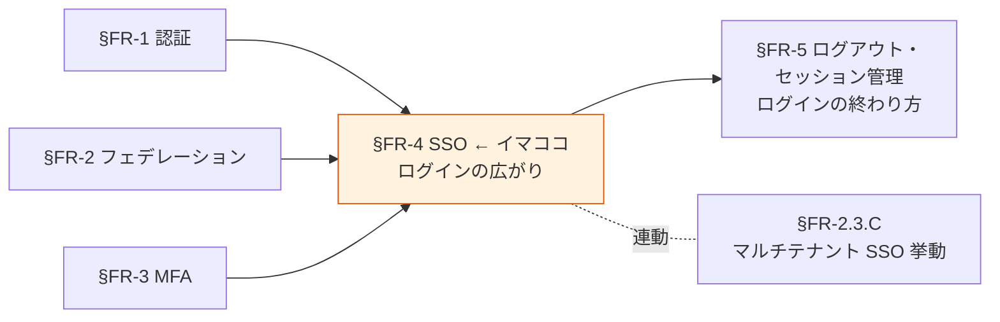
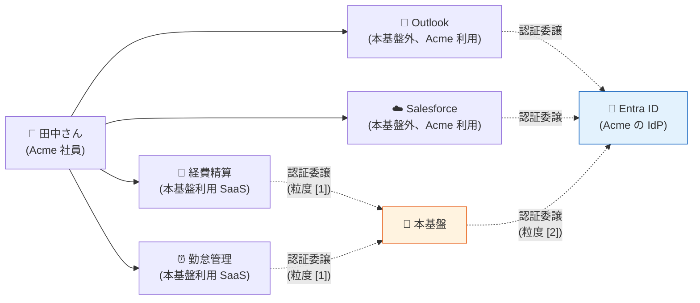
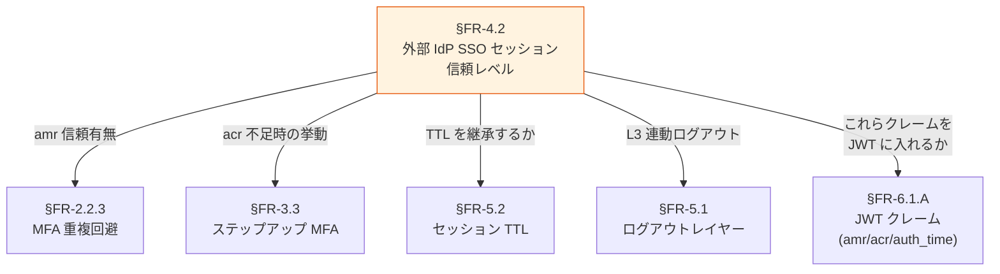

# §FR-4 SSO（シングルサインオン）

> 上位 SSOT: [00-index.md](00-index.md)   
> 詳細: [../../functional-requirements.md §4 FR-SSO/LOGOUT](../../functional-requirements.md)   
> カバー範囲: FR-SSO §4.1 SSO（SSO はここ、ログアウト・セッション管理は [§FR-5](05-logout-session.md)）

---

## §FR-4.0 前提と背景

### 用語整理

| 用語 | 本基盤での意味 |
|---|---|
| **SSO（Single Sign-On）** | 一度のログインで複数システムを利用可能にする仕組み |
| **同一 IdP 内 SSO** | 同じ Cognito User Pool / Keycloak Realm 内のアプリ間 SSO |
| **クロス IdP SSO** | 異なる IdP 間（Auth0 → Entra ID → Cognito 等）で SSO セッションが伝播 |
| **クロステナント SSO** | テナント境界で意図的に切断（[§FR-2.3.C](02-federation.md#33c-マルチテナント環境での-sso-挙動) 参照）|

### なぜここ（§FR-4）で決めるか



SSO は「**一度のログインで複数システムを利用できる**」UX を提供する核機能。Broker パターン（[§FR-9/§1 アーキテクチャ](../common/01-architecture.md)）の前提でもある。ログアウト・セッション管理は **§FR-5 で対** として扱う（性質が逆向き：SSO は広がり、ログアウトは終わり）。

### 共通認証基盤として「SSO」を検討する意義

| 観点 | 個別アプリで実装した場合 | 共通認証基盤で実装した場合 |
|---|---|---|
| SSO 実現 | アプリ間でセッション共有不可（別 Cookie）| **同一 IdP の全アプリで自動 SSO** |
| UX | アプリごとにログイン必須 | **1 回ログインで全システム利用可** |
| 顧客追加時の動作 | 各アプリで SSO 設定追加 | **基盤側 IdP 登録のみで全アプリ波及** |
| クロス IdP SSO | 各アプリで個別フェデ設定 | **基盤で吸収、アプリは透過** |

→ SSO の中央集約は、基本方針「**効率よく認証**」を実現する最大の手段。

### §FR-4.0.A 本基盤の SSO スタンス

> **同一 IdP（同 Cognito User Pool / Keycloak Realm）内のアプリ間 SSO は標準で有効。クロス IdP SSO は Broker パターンで吸収。テナント間 SSO は意図的に切断する（[§FR-2.3.C](02-federation.md) マルチテナント SSO 挙動）。ログアウト・セッション管理は対として [§FR-5](05-logout-session.md) で扱う。**

### §FR-4.0.B SSO の 3 つの粒度（混同しやすい論点の整理）

> **このサブ・サブセクションで定めること**: SSO の議論で混同されやすい「**3 つの異なる粒度**」を整理し、各論点がどの粒度を扱っているかを明示する。   
> **主な判断軸**: 顧客 IdP 配下のエコシステム（Outlook / Salesforce 等）との連携をどう設計するか   
> **§FR-4 全体との関係**: §FR-4.1 が粒度 [1]、§FR-4.2 が粒度 [2]、粒度 [3] は [2] の結果として成立する

#### 3 つの粒度



| 粒度 | 名称 | 範囲 | 主管章 |
|:---:|---|---|---|
| **[1]** | **テナント内 SSO** | 本基盤内アプリ間（経費精算 ↔ 勤怠管理） | [§FR-4.1](#fr-41-同一-idp-内-sso--fr-sso-001) |
| **[2]** | **クロス IdP SSO** | 本基盤 ↔ 顧客 IdP（Entra ID）のセッション伝播 | [§FR-4.2](#fr-42-クロス-idp-sso--fr-sso-002) |
| **[3]** | **クロスサービス SSO** | 顧客 IdP 配下の他社アプリ（Outlook / Salesforce 等）との結果的 SSO | [§FR-4.2](#fr-42-クロス-idp-sso--fr-sso-002) の効果として成立 |

#### よくある混同：「[3] は前提か?」

「**朝 Outlook を開いた時の Entra ID 認証で、本基盤の経費精算にも自動ログインできる**」 — これが粒度 [3]。
ユーザー側からは「**SSO の前提**」に見えるが、実装上は **粒度 [2] の信頼レベル設定の結果**として成立する。

| 観点 | 答え |
|---|---|
| 「SSO する」のは前提か | **Yes**（Broker パターン採用の時点で当然）|
| 「顧客 IdP のセッションを信頼する」のは前提か | **業界標準は Yes、ただし例外あり** |
| 「[3] が成立する」のは前提か | **粒度 [2] で L1 完全信頼を選んだ場合のみ** |

→ つまり **粒度 [3] は粒度 [2] の選択次第**。金融・規制業種で粒度 [2] を「L4 不信任」にすれば、[3] も成立しなくなる。詳細は [§FR-4.2](#fr-42-クロス-idp-sso--fr-sso-002)。

### 本章で扱うサブセクション

| サブセクション | 内容 | 関連 FR |
|---|---|---|
| §FR-4.1 同一 IdP 内 SSO | 同じ Pool/Realm 内のアプリ間 SSO（粒度 [1]） | FR-SSO-001 |
| §FR-4.2 クロス IdP SSO | フェデレーション IdP 経由の SSO 伝播（粒度 [2] + [3]） | FR-SSO-002 |
| §FR-4.3 ログイン後のランディング UX | サービス選択画面（entitled apps 一覧）/ Sorry ページ / Deep-Link return_to 制御 | FR-SSO-008 |

---

## §FR-4.1 同一 IdP 内 SSO（→ FR-SSO-001）

> **このサブセクションで定めること**: 同じ顧客テナント内の複数アプリ間で SSO セッションを共有する範囲とテナント境界の遮断ルール。   
> **主な判断軸**: SSO で繋ぐシステム範囲、同一テナント内でも切り離したいシステムの有無   
> **§FR-4 全体との関係**: §FR-4.1 = テナント内 SSO、§FR-4.2 = テナント跨ぎ SSO（フェデ）。マルチテナント挙動の詳細は [§FR-2.3.C](02-federation.md#33c-マルチテナント環境での-sso-挙動)

### 業界の現在地

OIDC / SAML で標準化済み。論点は「**何のシステム間で SSO を効かせるか**」のスコープ設計。

- 共通基盤内の Cognito User Pool / Keycloak Realm の SSO セッション Cookie をブラウザが保持
- 同じ Pool/Realm に紐づく App Client / Client を訪れた際、ログイン済みなら即座にトークン発行
- ブラウザを閉じてもセッションが残る場合と消える場合がある（Cookie 設定次第）

### 我々のスタンス（基本方針に基づく）

| 基本方針の柱 | 同一 IdP 内 SSO での実現 |
|---|---|
| **絶対安全** | テナント境界は越えない（`tenant_id` クレームで検証）|
| **どんなアプリでも** | SPA / SSR / Mobile / M2M 問わず同一 SSO セッションを共有 |
| **効率よく** | 顧客企業内システム間はログイン 1 回で全システム利用可能 |
| **運用負荷・コスト最小** | プラットフォーム標準機能、追加実装不要 |

### 対応能力マトリクス

| 機能 | Cognito | Keycloak (OSS/RHBK) | PoC 検証 |
|---|:---:|:---:|:---:|
| 同一 IdP 内 Client 間 SSO | ✅ User Pool 内 | ✅ Realm 内 | ✅ Phase 1, 7 |
| クロステナント切断 | ✅ tenant_id クレームで判定 | ✅ 同上 | — |
| SSO セッション TTL 設定 | ✅ App Client 設定 | ✅ Realm 設定 | [§FR-5.3 セッション管理](05-logout-session.md#63-セッション管理) で詳述 |

### ベースライン

| 項目 | ベースライン |
|---|---|
| 同一テナント内 SSO | **Must**（標準提供）|
| クロステナント | **遮断**（tenant_id クレームベース、[§FR-2.3.C](02-federation.md#33c-マルチテナント環境での-sso-挙動) 参照）|
| SSO セッション保持期間 | [§FR-5.3 セッション管理](05-logout-session.md#63-セッション管理) 参照 |

### TBD / 要確認

| 確認項目 | 回答例 |
|---|---|
| SSO で繋ぐシステム範囲 | 全システム / 認証スコープ別 / 機微情報システムのみ別 |
| 同一テナント内でも SSO を切りたいシステム | あり（高権限管理画面等）/ なし |

---

## §FR-4.2 クロス IdP SSO（→ FR-SSO-002）

> **このサブセクションで定めること**: 外部 IdP（Entra ID / Auth0 等）の SSO セッションを本基盤でも信頼してログイン省略する仕組み。   
> **主な判断軸**: クロス IdP SSO を全顧客有効にするか、外部 IdP の SSO セッション TTL に従うか   
> **§FR-4 全体との関係**: §FR-4.1 がテナント内 SSO、§FR-4.2 が**外部 IdP との SSO セッション伝播**。MFA 重複回避は [§FR-2.2.3](02-federation.md#323-mfa-重複回避--fr-fed-012) と整合

### 業界の現在地

外部 IdP（Auth0 / Entra ID 等）に SSO セッションがある場合、それを共通基盤側でも信頼して利用する。

例：
- ユーザーが Acme システムにアクセス → 共通基盤 → Acme の Entra ID にリダイレクト
- Entra ID で SSO セッション有効 → **ログイン画面を表示せず即時認証成功**
- 共通基盤に JWT を発行 → Acme システムへ

→ ユーザー視点：**Entra ID でログイン済みなら、Acme システムは完全シームレス**

### 我々のスタンス（基本方針に基づく）

| 基本方針の柱 | クロス IdP SSO での実現 |
|---|---|
| **絶対安全** | 外部 IdP の認証 assertion を検証（[§FR-2.2.3 MFA 重複回避](02-federation.md#323-mfa-重複回避--fr-fed-012) と整合）|
| **どんなアプリでも** | 顧客 IdP の種別に依存せず、OIDC / SAML 標準準拠なら SSO 伝播可能 |
| **効率よく** | Entra ID 利用中の社員は本基盤に意識なく入れる |
| **運用負荷・コスト最小** | プラットフォーム標準機能 |

### 対応能力マトリクス

| 機能 | Cognito | Keycloak (OSS/RHBK) | PoC 検証 |
|---|:---:|:---:|:---:|
| Auth0/Entra/Okta 経由のクロス IdP SSO | ✅ | ✅ | ✅ Phase 2, 7 |
| 外部 IdP の MFA 主張尊重（amr / AuthnContext） | ⚠ Pre Token Lambda 個別実装 | ✅ Conditional OTP 標準 | [§FR-2.2.3](02-federation.md#323-mfa-重複回避--fr-fed-012) |
| 外部 IdP セッション切れ時のフォールバック | ✅ ログイン画面表示 | ✅ ログイン画面表示 | — |

### 信頼の 4 段階レベル

「外部 IdP セッションを信頼するか」は **二者択一ではなく 4 段階のグラデーション**:

| レベル | 内容 | UX | セキュリティ | 主な採用例 |
|:---:|---|:---:|:---:|---|
| **L1 完全信頼**（業界標準デフォルト） | IdP セッションあれば即トークン発行、TTL も IdP に追従、`amr`/`acr` も継承 | ◎ 最高 | △ 中 | **Slack / Notion / Box / Auth0 / 一般 B2B SaaS** |
| **L2 部分信頼** | IdP セッション信頼するが、本基盤側 TTL を別に持つ（短く） | ○ 良 | ○ 高 | 中セキュリティ業務系 |
| **L3 検証ありき信頼** | IdP セッション信頼するが、`acr`/`amr` を毎回検査、足りなければステップアップ | △ 中 | ◎ 高 | 規制業種、決済システム |
| **L4 不信任（再認証強制）** | IdP セッションがあっても本基盤側で `prompt=login` で再認証 | × 悪 | ◎ 最高 | 金融・防衛など極めて厳格な業務系 |

→ **既存の TBD「全顧客有効 / 限定 / 無効」は概ね L1 / L3 / L4 に対応**。L2 は中間オプション。

### 「信頼する」とは技術的に何を意味するか

OIDC の世界では、信頼度を以下のパラメータで制御:

| 本基盤からの送信 | 効果 |
|---|---|
| `prompt=none` | サイレント認証要求（既存セッションのみ使い、なければエラー）|
| `prompt=login` | 強制再認証（既存セッション無視、ログイン画面表示）|
| `max_age=N` | N 秒以上経過した認証は無効、再認証要求 |
| `acr_values=2` | AAL2 要求（不足なら追加認証 = ステップアップ）|

IdP から受け取る ID Token のクレーム:

| クレーム | 意味 | 信頼する場合の挙動 |
|---|---|---|
| `auth_time` | いつ認証したか | 本基盤の JWT に継承 |
| `amr` | どんな方法で認証したか（pwd / mfa / hwk）| 本基盤の JWT に継承（[§FR-2.2.3](02-federation.md#323-mfa-重複回避--fr-fed-012) MFA 重複回避と連動）|
| `acr` | 認証保証レベル（AAL1/2/3）| 本基盤の JWT に継承（[§FR-3.3](03-mfa.md) ステップアップと連動）|

### 信頼を下げる動機（L3 / L4 採用シナリオ）

| シナリオ | 信頼度を下げる理由 |
|---|---|
| **金融機関の業務系** | コンプラ要件で「重要操作前は必ず本基盤で再認証」 |
| **PCI DSS 対象システム** | カード情報操作前にステップアップ MFA |
| **規制業種（医療・防衛）** | IdP 漏洩リスクを基盤側でも防御 |
| **多テナント混在** | 顧客 A は L1 信頼、顧客 B（金融）は L3 検証 |
| **アプリ別差別化** | 経費精算は L1、決済管理は L3 |

### リスクと対策可否マトリクス（事実調査ベース、2026-05 時点）

| # | リスク | Cognito 対策 | Keycloak 対策 | 顧客 IdP 側必須 | 完全防止可否 |
|:---:|---|:---:|:---:|:---:|:---:|
| 1 | IdP セッション乗っ取り | △ 軽減のみ | △ 軽減のみ | ✅ Conditional Access | ❌ 不可（軽減のみ）|
| 2 | 退職処理遅延 | △ 自前実装 | △ 標準 Introspection | △ SCIM で大幅改善 | △ 短 TTL + 追加実装で実現可 |
| 3 | `amr` 偽装 | ✅ 可能 | ✅ 可能 | — | ✅ ほぼ完全防止 |
| 4 | AAL 不整合 | ⚠ Lambda 自前 | ✅ 標準 | △ IdP の AAL 実装次第 | ○ Keycloak なら可 |
| 5 | 古い `auth_time` | ❌ 未対応 | ⚠ 標準対応だが 26.x バグ | — | ○ Keycloak で限定的に可 |

→ **本基盤側の能動検知・対応**は [ADR-035 ITDR](../../../adr/035-identity-threat-detection-response.md) に集約。リスク 1 IdP セッション乗っ取り / リスク 2 退職処理遅延 / リスク 3 amr 偽装 はいずれも **ITDR の 6 検知領域**（Compromised Credentials / Anomaly Login / Token Theft / Session Hijacking / Privileged Account Abuse / MFA Bypass Attempt）で能動検知される。リスク 4 AAL 不整合 への動的対応は [ADR-034 Adaptive Authentication](../../../adr/034-adaptive-authentication.md) でリスクスコア算出 → 自動引上げ。

#### リスク 1: IdP セッション乗っ取り

| 軸 | 評価 | 詳細 |
|---|:---:|---|
| 本基盤側で直接対策 | ❌ | IdP の Cookie 管理は管轄外 |
| 本基盤側で間接対策 | ○ | Access Token 短 TTL（5-15 分）、Keycloak は `max_age` 制約 |
| 顧客 IdP 側で対策 | ✅ 必須 | Conditional Access / リスクベース認証 |

**残余リスク**: IdP Cookie 漏洩は本基盤に直接届く。検知不能（assertion は正規）。

##### BFF パターン採用との関係（よくある誤解）

> 「BFF を採用していればセッションハイジャックは起こらないのでは?」 — **No、本リスクは BFF と無関係**。

セッションハイジャックには **2 つの異なるレイヤー**がある:

| レイヤー | Cookie / Token の置き場所 | ハイジャックの手口 | BFF の効果 |
|---|---|---|---|
| **❶ 本基盤側セッション**（アプリ ↔ Hub） | アプリドメインの Cookie / SPA メモリ | XSS / LocalStorage 盗難 / ブラウザ拡張 | **✅ BFF で大幅軽減** |
| **❸ IdP 側 SSO セッション**（ユーザー ↔ IdP）| **IdP ドメイン**（`login.microsoftonline.com` 等）の Cookie | フィッシング / マルウェア / IdP 側 XSS | **❌ BFF と無関係** |

**理由**: Cookie はドメインで分離される。IdP の Cookie（`login.microsoftonline.com` 等）は本基盤も BFF も触れない（IdP のドメイン）。攻撃者が IdP の Cookie を奪えば、本基盤 / BFF が介在しても防ぎようがない（assertion は正規のため）。

```
[攻撃] 田中さんが脆弱な拡張 / フィッシングサイト経由で
       login.microsoftonline.com の Cookie を漏洩
       ↓
[攻撃者] 同じ Cookie をブラウザに注入 → Entra ID から見ると田中さん
       ↓
[本基盤] /authorize → Entra ID にリダイレクト → 「セッションあり」と応答
       ↓
[Hub] L1 完全信頼で即トークン発行 ← BFF があっても止まらない
       ↓
[BFF] 「本基盤からトークンが来た」としか分からない → 防ぎようがない
```

→ **BFF（[§FR-1.1](01-auth.md)）は ❶ レイヤー（XSS による Token 盗難）には強力だが、❸ レイヤー（IdP セッション乗っ取り）には別軸の対策が必要**。リスク 1 の対策は依然として「顧客 IdP 側の Conditional Access + 本基盤の短 TTL + Keycloak の `max_age` 制約」が本丸。

#### リスク 2: 退職処理遅延（**事実調査により前回回答を修正**）

**両プラットフォームとも Access Token 個別 revocation は不可能**（OAuth/OIDC 仕様準拠の制約）。`/revoke` エンドポイントは Refresh Token を無効化することで「次の Refresh 試行を失敗させる」設計:

| 機能 | Cognito | Keycloak |
|---|:---:|:---:|
| `/revoke` エンドポイント | ✅ RevokeToken API + /oauth2/revoke | ✅ /protocol/openid-connect/revoke（**RFC 7009 準拠、10.0.0+**）|
| Refresh Token revoke | ✅ | ✅ |
| **Access Token 個別 revoke** | **❌ 不可**（公式: "User pool JWTs are self-contained"） | **❌ 不可**（公式: "Keycloak chose not to support invalidating individual access tokens"） |
| Refresh 経由の Access 無効化 | ✅ 同じ Refresh Token のチェーン | ✅ 同じセッション |
| **外部リソースサーバーで revoke 反映** | ⚠ **`origin_jti` クレームを使って自前チェック必要** | ✅ **Token Introspection (`/introspect`) 標準提供** |
| 全 Token 強制無効化 | ✅ `AdminUserGlobalSignOut` | ✅ `Logout` API |

**重要な事実（公式記述）**:
> Cognito: "Revoked tokens can't be used with any Amazon Cognito API calls that require a token. **However, revoked tokens will still be valid if they are verified using any JWT library that verifies the signature and expiration of the token.**"

→ つまり Cognito Access Token は **Cognito API 経由では revoke 反映、外部リソースサーバー（Lambda Authorizer / API Gateway / 自前検証）では TTL 切れまで有効**。

**実装パターン**:
- **Cognito**: `origin_jti` を取得して revoke リストを Lambda Authorizer で照合 → **自前実装が必要**
- **Keycloak**: 外部リソースサーバーが `/introspect` に都度問い合わせ → **標準対応だがパフォーマンスコスト**

**残余リスク**:
- 短 TTL（5-15 分）期間中の遮断ラグ（両プラットフォーム共通）
- IdP 側 SCIM 連携がない場合、退職検知が JIT 時まで遅延

→ **両者の根本構造は同じ。Keycloak は Introspection 標準提供で実装が楽、ただし完全防止は不可（TTL ラグは残る）**。前回「Keycloak は Access Token も revoke 可能」と記述したが、**正確には「Refresh Token 経由で関連 Access Token を無効化」**（Cognito と同じ構造）。

#### リスク 3: `amr` 偽装

| 軸 | 評価 |
|---|:---:|
| 接続承認制（allowlist） | ✅ 完全可能 |
| IdP メタデータの信頼経路 | ✅ 可能 |
| `amr` 値の差別的信頼 | ✅ 可能（IdP 単位設定）|
| **完全防止** | ✅ **可能**（既存ベースラインで対処済）|

**実装**: IdP 接続は Terraform PR + レビュー、未承認 IdP は登録不可。「**信頼境界 = 接続承認された IdP のみ**」が[§FR-4.2 ベースライン](#ベースライン)に既明記。

**残余リスク**: 承認済 IdP の秘密鍵漏洩（→ 証明書ローテーション）、顧客 IdP 管理者の意図的偽装（→ 該当 IdP は `amr` 信頼せず再 MFA）。

#### リスク 4: AAL 不整合

| 機能 | Cognito | Keycloak |
|---|:---:|:---:|
| `acr_values` 要求のサポート | ❌ 未サポート | ✅ 標準 |
| **ACR to LoA Mapping** | ❌ 不在 | ✅ **Realm/Client レベルで標準設定**（26.x）|
| ステップアップ MFA フロー | ⚠ Custom Auth Challenge Lambda 自前 | ✅ Step-up Authentication 標準フロー |
| IdP 別の AAL マッピング | ⚠ Pre Token Lambda V2 で実装 | ✅ IdP Mapper |

**Keycloak 公式（26.6.1）**:
> "you can define which Authentication Context Class Reference (ACR) value is mapped to which Level of Authentication (LoA). The setting is recommended at realm level. The exception is when a specific client needs to have specific differences from the realm settings."

**残余リスク**: 顧客 IdP が AAL 概念を実装していない場合は全フェデユーザーを AAL 1 扱いで処理 + 本基盤側で AAL 2 強制（[§FR-3.3](03-mfa.md) と連動）。

#### リスク 5: 古い `auth_time` の悪用

| 機能 | Cognito | Keycloak |
|---|:---:|:---:|
| `max_age` パラメータ | **❌ 未サポート**（[authorize endpoint 公式仕様に記述なし](https://docs.aws.amazon.com/cognito/latest/developerguide/authorization-endpoint.html))| ✅ OIDC 標準対応 |
| `prompt=login`（毎回再認証） | ✅ 2025-05〜（**Essentials+ + Managed Login のみ**） | ✅ 標準 |
| `auth_time` クレーム参照 | ✅ Pre Token Lambda V2 で取得可 | ✅ Protocol Mapper で出力 |
| **Keycloak 26.x の既知の問題** | — | ⚠ **`max_age=0` の JS Adapter バグ（Issue #32764）、IdP brokering 時の伝播バグ（Issue #33641, #46078）、Organizations 機能との競合（Issue #36249）** |
| IdP Brokering 時の追加設定 | — | ⚠ **「Pass max_age」設定を IdP プロバイダ設定で有効化必須** |

**Cognito での代替策**:
| 方法 | 効果 | UX |
|---|---|---|
| 短い Refresh Token TTL | 粗い粒度 | △ |
| Pre Token Lambda で `auth_time` 検査 → エラー返却 | 条件付き再認証 | △ 手動再ログイン要 |
| `prompt=login` を常時 | 毎回ログイン画面 | × 最悪 |

**結論**: **Cognito では「N 秒経過したセッションのみ再認証」の柔軟性は持てない**。Keycloak は標準対応だが 26.x の複数バグに注意（バージョン固定戦略推奨）。

#### 補足: CAEP（Continuous Access Evaluation Profile）の対応状況

CAEP（OpenID 仕様）は「リアルタイムでの継続的アクセス評価」を実現する将来発展形:

| プラットフォーム | CAEP 対応 |
|---|:---:|
| **Cognito** | ❌ **公式言及なし、未対応**（2026-05 調査時点）|
| **Keycloak / RHBK** | ❌ **公式言及なし、未対応** |
| Microsoft Entra | ✅ 実装済（Conditional Access と統合） |
| Google / Apple / Okta / IBM | ✅ 採用宣言済 |

→ CAEP は両プラットフォームの将来発展課題。詳細は [§FR-5.4](05-logout-session.md) 参照。

### プラットフォーム選定への含意

| リスク | Cognito で対処可能 | Keycloak で対処可能 |
|---|:---:|:---:|
| 1. IdP セッション乗っ取り | △ 軽減 | △ 軽減 |
| 2. 退職処理遅延 | △ 自前実装で限定的 | △ Introspection で限定的（両者同等）|
| 3. amr 偽装 | ✅ | ✅ |
| 4. AAL 不整合 | ⚠ Lambda 自前 | ✅ 標準 |
| 5. 古い auth_time | ❌ | ⚠ 標準だが 26.x バグ |
| **合計（完全/標準対処）** | **1/5** | **2.5/5** |

→ **規制業種顧客（金融・医療・PCI DSS）で 4・5 が必須なら Keycloak が事実上必須**。一般 B2B SaaS（1〜3 のみで充足）なら Cognito でも対応可能。詳細は[§C-2 プラットフォーム選定](../common/02-platform.md)。


### 関連設計判断との連動（重要）

「信頼レベル」は **5 つの章と直結**:



### プラットフォーム実装の差

| 機能 | Cognito | Keycloak |
|---|:---:|:---:|
| 外部 IdP セッション信頼（L1）| ✅ 標準動作 | ✅ Identity Brokering 標準動作 |
| `prompt=none`（サイレント認証）| **✅ 2025-05 サポート開始（Essentials+）** | ✅ 標準 |
| `prompt=login`（強制再認証）| **✅ 2025-05 サポート開始（Essentials+）** | ✅ 標準 |
| `max_age` 制約 | **❌ 未サポート** | ✅ 標準 |
| `acr_values` ステップアップ（L3）| ❌ Custom Auth Challenge で自前実装 | ✅ Authentication Flow + LoA Mapping 標準 |
| `amr` クレーム検査・継承 | ⚠ Pre Token Lambda V2 で実装 | ✅ Conditional OTP 等で標準対応 |

→ **L3「検証ありき信頼」を実現するなら Keycloak が圧倒的に楽**。Cognito では Lambda 自前実装が多い。

### 業界実例

| サービス | 信頼レベル |
|---|---|
| **Slack / Notion / Box** | L1 完全信頼（業界標準）|
| **Microsoft 365 B2B** | L1（同一 Entra テナント内）|
| **Auth0 Enterprise Connections** | L1 デフォルト、L3 にカスタマイズ可 |
| **金融機関の B2B 業務系** | L3 / L4 が多い |
| **PCI-DSS 対象システム** | L3（カード情報操作前に再認証）|

### ベースライン

| 項目 | ベースライン |
|---|---|
| クロス IdP SSO | **Must**（フェデレーション運用の前提）|
| **デフォルト信頼レベル** | **L1 完全信頼**（業界主流）|
| 接続承認した IdP のみ信頼 | 未承認 IdP は接続不可 |
| **金融・規制業種向けオプション** | **L3 検証ありき信頼**（`acr_values` 検査 + ステップアップ）|
| **TTL の扱い** | **IdP TTL に従う**（業界標準）+ 本基盤 Access Token は短 TTL（5-15 分）|
| 外部 IdP の MFA 主張 | **信頼**（[§FR-2.2.3](02-federation.md#323-mfa-重複回避--fr-fed-012)）|

### TBD / 要確認（[hearing-checklist.md](../../hearing-checklist.md) B-801〜B-802 系と連動）

| 確認項目 | ヒアリング ID | 回答例 |
|---|---|---|
| デフォルト信頼レベル | **B-801-1** | L1 完全信頼 / L2 部分信頼 / L3 検証ありき / L4 不信任 |
| 顧客 / IdP / アプリ別の差別化要否 | **B-801-2** | 全顧客 L1 / 顧客別 / アプリ別 |
| 規制業種向け L3 オプションの要否 | **B-801-3** | 必須（金融顧客あり）/ 不要 |
| 外部 IdP の SSO セッション TTL に従うか | B-802 | はい（推奨）/ 本基盤側で上書き |
| `max_age` 制約の適用 | **B-802-2** | 適用する（時間）/ 適用しない |

---

## §FR-4.3 ログイン後のランディング UX（サービス選択画面 / Sorry / Deep-Link）（→ FR-SSO-008）

> **詳細は以下の ADR を参照**:
> - [ADR-021 Post-login Landing UX](../../../adr/021-post-login-landing-ux.md)（Pre vs Post 設計判断 + サービス選択画面 + Sorry の業界比較）
> - [ADR-022 AWS edge Sorry 制御パターン](../../../adr/022-aws-edge-sorry-control.md)（ALB / CloudFront 統合）

> **このセクションで定めること**: 認証完了後にユーザーが**どのアプリ・どの画面に着地するか**の UX 設計。具体的には (1) 直リンク（deep-link）後の自動遷移、(2) Post-login サービス選択画面（entitled apps 一覧 SPA）、(3) 権限なしアクセス時の Sorry ページ、の 3 つの責務分担。
> **主な判断軸**: アプリ数と入口の多様性、ユーザーが「自分が何にアクセス権限を持つか」を知る必要性、ブランディング要件、運用工数
> **§FR-4 全体との関係**: §FR-4.1 同一 IdP 内 SSO・§FR-4.2 クロス IdP SSO がセッション共有の仕組みを扱うのに対し、本サブセクションは**認証完了後の着地点 UX**を扱う独立論点

### §FR-4.3.A 重要な前提：Pre / Post は「二択」ではなく「役割の違う 2 軸」

| パターン | Pre-login | Post-login サービス選択画面 | 業界実例 |
|---|:---:|:---:|---|
| ① Pre のみ | ✅ | ❌ | 社内イントラ単体 |
| ② Post のみ | ❌ | ✅ | Okta End-User Dashboard |
| **③ Pre + Post**（**B2B SaaS で多い**）| ✅ | ✅ | Atlassian / Microsoft 型 |
| ④ いずれもなし | ❌ | ❌ | Deep-link 専用 |

- **Pre = マーケティング / 発見 / サインアップ**（匿名訪問者向け）
- **Post = 生産性 / 権限ベース / 個人化**（認証済ユーザー向け）
- Sorry は**完全に別軸**（Pre/Post の組合せに関わらず必要、ただし Post サービス選択画面 ありだと遷移先が自然）

### §FR-4.3.B 本基盤のデフォルトスタンス

| 観点 | デフォルト |
|---|---|
| Pre-login | **B-626 ヒアリングで判定**（マーケサイト要否次第）|
| Post-login サービス選択画面 | **採用**（業界標準、別 SPA 構築）|
| Sorry | **採用**（**AWS edge で集約 → ADR-022**、推奨パターン ii Lambda@Edge）|
| デフォルト構成 | **② Post + Sorry** または **③ Pre + Post + Sorry** |

### §FR-4.3.C 主要な裏どり（詳細は ADR-021 / ADR-022）

#### サービス選択画面 は別 SPA 構築が業界標準
- Microsoft 365 portal / Okta End-User Dashboard / Atlassian Cloud start / Salesforce App Launcher すべて独立 SPA
- Keycloak アカウント設定画面 は補助的、本格運用は別 SPA 推奨

#### Sorry の業界標準実装パターン
- **C. 共通 エラー / 案内画面 SPA**（推奨、LinkedIn / Microsoft 365 採用）
- アプリは「403 + `X-Sorry-Reason` ヘッダ返却」だけで OK、Sorry リダイレクトを edge で集約

#### AWS edge での Sorry 制御（5 パターン）
| # | パターン | 推奨度 |
|---|---|:---:|
| i | CloudFront Custom Error Response | ★★★ |
| **ii** | **CloudFront + Lambda@Edge（origin-response 403 → 302）** | **★★★★★** |
| iii | CloudFront + Lambda@Edge（viewer-request JWT 検証）| ★★★ |
| iv | ALB authenticate-oidc + 403 ターゲット | ★★★ |
| **v** | **ALB Native JWT Validation（2025 新機能）** | ★★★★ |

### §FR-4.3 TBD / 要確認

[hearing-checklist.md B-622〜B-630](../../hearing-checklist.md) を参照。主要項目:

| 確認項目 | ヒアリング ID | 回答例 |
|---|---|---|
| サービス選択画面 SPA 構築方針 | **B-622** 🔴 | A 別 SPA 構築（推奨）/ B アカウント設定画面 流用 / C 不要 |
| Sorry ページ実装パターン | **B-623** 🔴 | A アプリ側 / B 認証基盤テーマ / **C 共通 エラー / 案内画面 SPA（推奨）** |
| サービス選択画面 テナント別ブランディング | **B-624** | あり / なし |
| 認証後のデフォルト着地点 | **B-625** | redirect_uri 優先（推奨）/ サービス選択画面 強制 |
| Pre-login システム選択 UI 採否 | **B-626** | 不採用（業界標準）/ 採用 |
| サービス選択画面 表示アプリ判定根拠 | **B-627** | JWT roles / Keycloak Client ロール / マッピング表 |
| **AWS edge での Sorry 制御パターン** | **B-628** 🔴 | i / **ii Lambda@Edge（推奨）** / iii / iv / v ALB JWT |
| edge 集約 vs アプリ個別 Sorry | **B-629** | 集約 / 個別 |
| CloudFront / ALB の構成 | **B-630** | CloudFront 前段 + ALB 配下（標準）/ 他 |

---

### 参考資料（§FR-4 全体）

- [OpenID Connect Core 1.0 公式](https://openid.net/specs/openid-connect-core-1_0.html)
- [Cognito User Pool SSO 公式](https://docs.aws.amazon.com/cognito/latest/developerguide/cognito-user-pools-app-integration.html)
- [Keycloak SSO 公式](https://www.keycloak.org/docs/latest/server_admin/index.html)
