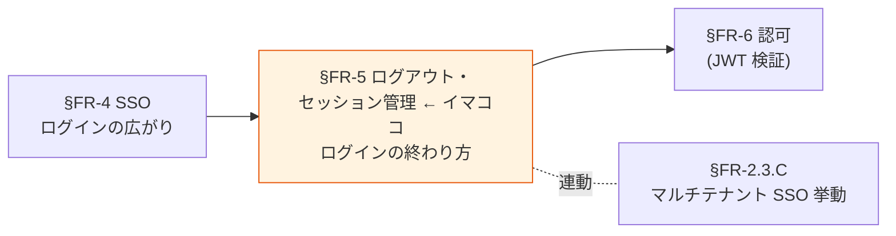
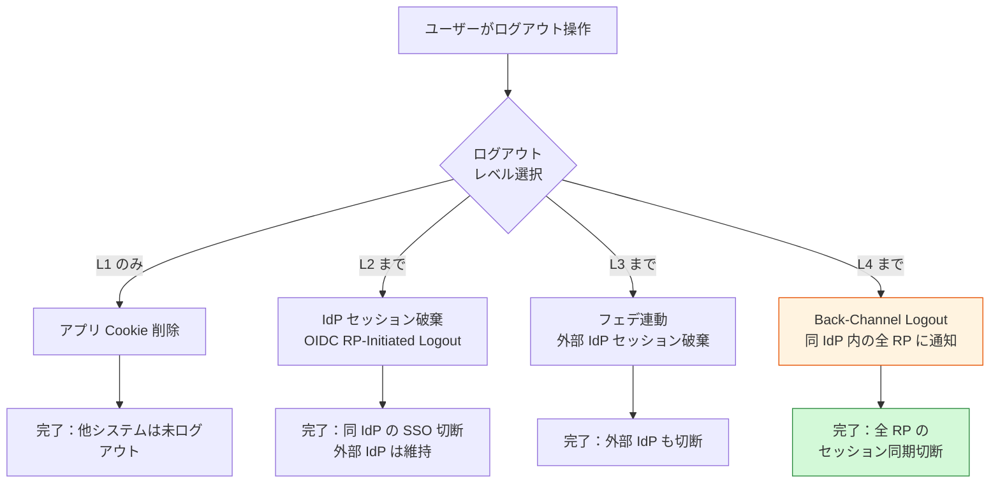
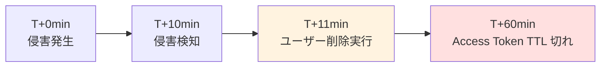

# §FR-5 ログアウト・セッション管理

> 上位 SSOT: [00-index.md](00-index.md)   
> 詳細: [../../functional-requirements.md §4 FR-SSO/LOGOUT](../../functional-requirements.md)   
> カバー範囲: FR-SSO §4.2 ログアウト / §4.3 セッション管理（SSO 本体は [§FR-4](04-sso.md)）

---

## §FR-5.0 前提と背景

### 用語整理

| 用語 | 本基盤での意味 |
|---|---|
| **ローカルログアウト** | アプリ側 Cookie / SPA トークンストアの削除のみ |
| **RP-Initiated Logout** | RP（アプリ）から OP（基盤）にログアウト要求を送る方式（OIDC 標準）|
| **Back-Channel Logout** | OP → RP に**サーバー間直接通信**でログアウト通知（OIDC 標準、最も信頼性高い）|
| **Front-Channel Logout** | ブラウザ iframe 経由でログアウト通知（古典的、ブラウザセッション依存）|
| **SLO（Single Logout）** | 一度のログアウト操作で複数システムのセッションを破棄する仕組み |
| **セッションタイムアウト** | アイドル / 絶対経過時間で自動失効 |
| **Token Revocation** | アクティブなトークンを強制無効化（盗難対応等）|
| **Refresh Token Rotation** | 各 refresh token を単回使用とし、再利用検知でトークンファミリー全停止 |

### なぜここ（§FR-5）で決めるか

SSO は便利な反面、**ログアウトとセッション管理を疎かにすると "認証残骸" がセキュリティリスクになる**。Back-Channel Logout / Refresh Token Rotation / Token Revocation は **基本方針「絶対安全」の最終防衛線**。

### 共通認証基盤として「ログアウト・セッション管理」を検討する意義

| 観点 | 個別アプリで実装した場合 | 共通認証基盤で実装した場合 |
|---|---|---|
| ログアウト伝播 | 各アプリで個別実行 → 漏れ発生 | **基盤側で一元ログアウト**、漏れ防止 |
| Back-Channel Logout | アプリごとに実装 → 重い | **基盤側で標準提供**、アプリは callback だけ実装 |
| セッションタイムアウト | アプリごとに別ポリシー → UX バラバラ | **基盤側で統一**、全システムで同じ挙動 |
| トークン Revocation | 不可能（JWT はステートレス）| **基盤側で revocation list 管理** |
| Refresh Token 不正検知 | アプリでは検知困難 | **基盤側で Token Rotation + Reuse Detection** |

→ ログアウト・セッション管理を中央集約することで、**個別アプリでは絶対に実現できないセキュリティレベル**を提供。

### §FR-5.0.A 本基盤のログアウト・セッション管理スタンス

> **ログアウトは 4 レイヤー（ローカル / IdP / フェデ連動 / Back-Channel）で漏れなく伝播させる。セッション TTL は NIST SP 800-63B Rev 4 AAL2 相当（絶対 24h / アイドル 1h）を標準とし、Refresh Token Rotation + Reuse Detection を有効化。Access Token Revocation は Keycloak で対応可（Cognito は Refresh のみ）。**

### 本章で扱うサブセクション

| サブセクション | 内容 | 関連 FR |
|---|---|---|
| §FR-5.1 ログアウト | 4 レイヤー（ローカル / IdP / フェデ連動 / Channel Logout）| FR-SSO-003〜007 |
| §FR-5.2 セッションライフサイクル | セッション TTL / アイドルタイムアウト | FR-SSO-008、NFR-SEC-004〜007 |
| §FR-5.3 トークン Revocation | Access Token / Refresh Token の強制無効化 | FR-SSO-009、NFR-SEC-008 |

---

## §FR-5.1 ログアウト（→ FR-SSO §4.2）

> **このサブセクションで定めること**: ログアウト時に**どのレイヤーまでセッションを破棄するか**（L1 ローカル / L2 IdP / L3 フェデ連動 / L4 Back-Channel Logout）。   
> **主な判断軸**: デフォルトログアウトレイヤー、Back-Channel Logout の要否（Cognito 非対応 → Keycloak 必須化に直結）   
> **§FR-5 全体との関係**: §FR-5.1 = 「ログアウト範囲」、§FR-5.2 = 「セッション寿命」、§FR-5.3 = 「強制無効化」。3 つで認証セッションの**終わり方**を完全に規定

### 業界の現在地

**ログアウトには 4 つの「レイヤー」がある**。どこまで破棄するかを設計判断する。

| レイヤー | 対象 | 仕様 |
|---|---|---|
| **L1 ローカルログアウト** | アプリ Cookie / SPA トークンストア | アプリ独自 |
| **L2 IdP セッション破棄** | 共通基盤側の SSO セッション | OIDC RP-Initiated Logout（OpenID Connect Core 1.0）|
| **L3 フェデ連動ログアウト** | 外部 IdP（Auth0 / Entra 等）のセッション | 連鎖呼び出し |
| **L4 Channel Logout** | 同一 IdP 内の他 RP（システム） | OIDC Front-Channel / **Back-Channel Logout** |

**Back-Channel Logout の優位性**:
- サーバー間直接通信 → ブラウザ依存なし、確実に伝播
- 同期 / 非同期通知可能
- Auth0 / PingOne / ZITADEL 等の主要 IdP が標準実装
- Cognito は**非対応**、Keycloak は**標準対応**（PoC Phase 7 で実証済）

**SLO（Single Logout）の業界課題**:
- IdP/SP の SLO サポート未整備でフェデ連鎖が壊れやすい
- 1 つの SP が無反応 = チェーン全体崩壊
- 解決策：iframe 並列ログアウト、Back-Channel 採用

### 我々のスタンス（基本方針に基づく）

| 基本方針の柱 | ログアウトでの実現 |
|---|---|
| **絶対安全** | Back-Channel Logout で確実な伝播（ブラウザ閉じても確実）。トークン残骸を残さない |
| **どんなアプリでも** | L1〜L4 のレイヤー別ログアウトを基盤側で API 化 |
| **効率よく** | ワンクリックで指定レイヤーまでログアウト |
| **運用負荷・コスト最小** | Keycloak は標準、Cognito は L4 を要設計（[§2 プラットフォーム選定](../common/02-platform.md)）|

### 対応能力マトリクス

| ログアウト機能 | Cognito | Keycloak (OSS/RHBK) | PoC 検証 |
|---|:---:|:---:|:---:|
| L1 ローカルログアウト | ✅ | ✅ | ✅ |
| L2 IdP セッション破棄（OIDC RP-Initiated） | ✅ `/logout` | ✅ `/logout?id_token_hint=...` | ✅ |
| L3 フェデ連動（外部 IdP セッション破棄） | ⚠ URL エンコード制約あり | ✅ | ✅ Phase 2, 5 |
| **L4 Back-Channel Logout（OIDC 標準）** | ❌ **非対応** | ✅ **ネイティブ対応** | ✅ Phase 7（Keycloak のみ）|
| L4 Front-Channel Logout | ✅ | ✅ | ❌ |

### ログアウトレイヤー図

### ベースライン

| ログアウトレイヤー | 推奨 | 理由 |
|---|:---:|---|
| L1 ローカル | **Must** | 基本動作 |
| L2 OIDC RP-Initiated | **Must** | 基盤の SSO セッション破棄に必須 |
| L3 フェデ連動 | **Should** | 完全ログアウトの実現に必要。Cognito は URL エンコード制約あり |
| **L4 Back-Channel Logout** | **Should**（強く推奨）| 確実なセッション伝播。**Keycloak のみ対応**、Cognito は実現不可 |
| L4 Front-Channel Logout | Could | ブラウザ依存、信頼性低い |

→ **L4 Back-Channel Logout を Must とする場合、Keycloak（OSS or RHBK）必須**。

### TBD / 要確認

> **本 TBD の意図**: ログアウトは **「ユーザーが『ログアウト』を押した時にどこまでセッションを破壊するか」** を決める設計。破壊レイヤーが浅いと **認証残骸（残ったセッションを介した侵害）** リスク、深すぎると **再ログイン UX 負担** になる。顧客の業務シナリオ（シェア端末 / コンプラ要件 / 退職時遮断要求）から適切なレイヤーを引き出す。**L4 Must は Cognito を候補から外す**ためプラットフォーム選定にも直結。

**A. ログアウトレイヤー（核心質問）**

| 確認項目 | 何を聞いているか | 回答例 |
|---|---|---|
| **デフォルトのログアウトレイヤー** | 「ログアウト」ボタンが標準で破壊すべき範囲。**シェア PC / 厳格コンプラなら L4、社内ツール中心なら L2** で足りる | L1 ローカルのみ / L2 IdP まで / L3 フェデ連動 / **L4 全 RP 同期切断** |
| **Back-Channel Logout の要否（= L4 要否）** | **プラットフォーム選定への直接影響**。Yes なら Cognito 候補から外れる | はい（強推奨）→ **Keycloak 必須** / いいえ（Cognito でも OK）|
| **フェデ連動ログアウト（L3）の要否** | 外部 IdP（Entra / Okta）のセッションも切るか。コンプラ要件次第 | 必須 / 不要 |

**B. 業務シナリオの確認（レイヤー選定の根拠）**

> 顧客の業務シナリオから L1 / L2 / L4 のどれが妥当か判定するための質問。回答次第でログアウトレイヤーが自動的に決まる。

| 確認項目 | 想定回答例 | レイヤー判定への影響 |
|---|---|---|
| **シェア端末利用の有無**（コールセンター / 受付端末 / ネットカフェ等）| あり（強い）/ あり（一部）/ なし（BYOD のみ）| あり → **L4 Must**（次の利用者が他アプリにそのまま入れる事故防止）|
| **業務系のコンプラ要件**（SOX / PCI DSS / HIPAA 等）| 該当あり / なし | 該当 → **L4 推奨**（「完全ログアウト」が監査要件）|
| **退職時の即時アクセス遮断要求** | 強い / 標準 / 弱い | 強い → **L4 + Token Revocation** で即時全アプリ遮断 |
| **ユーザーが複数アプリを並行利用するか** | 並行多い / 単独利用中心 | 並行多い → **L1 ボタンと L4 ボタンを分けた UX 設計** を検討 |

**C. UX / 運用関連**

| 確認項目 | 回答例 |
|---|---|
| ログアウト後のリダイレクト先 | 顧客指定 URL / 統一画面 / IdP のログインページ |
| 「全アプリ一括ログアウト」UI 提供の要否 | 必須（基盤側で API 提供）/ 不要（アプリ独自実装）|
| Token Revocation（[§FR-5.3](#fr-53-トークン-revocation--fr-sso-009-010nfr-sec-008)）との連携 | 緊急時に管理者が強制ログアウト + Token Revocation を組合せて使う想定か |

→ A の **デフォルトレイヤー + Back-Channel Logout 要否** が 2 大論点。B でその根拠を引き出し、C で運用詳細を詰める構造。

---

## §FR-5.2 セッションライフサイクル（→ FR-SSO-008、NFR-SEC-004〜007）

> **このサブセクションで定めること**: トークン（Access / ID / Refresh）の有効期限、セッションの絶対経過 / アイドルタイムアウト、Refresh Token Rotation の方針。   
> **主な判断軸**: 目標 NIST AAL レベル、Access Token TTL、アイドルタイムアウト   
> **§FR-5 全体との関係**: §FR-5.1 が「能動的なログアウト」、§FR-5.2 が「**自動失効**」、§FR-5.3 が「強制無効化」

### 業界の現在地

**1. NIST SP 800-63B Rev 4 セッションタイムアウト推奨値（2024）**

| AAL | 絶対経過タイムアウト | アイドルタイムアウト |
|---|---|---|
| AAL1 | 30 日 | 任意 |
| **AAL2** | **24 時間** | **1 時間** |
| AAL3 | 12 時間 | 15 分 |

**2. JWT トークン TTL 2026 ベストプラクティス**

| トークン種別 | 推奨 TTL | 理由 |
|---|---|---|
| Access Token | **15〜60 分**（短期） | 漏洩時の被害最小化 |
| ID Token | **15 分** | アクセス制御に使わない、認証情報のみ |
| Refresh Token | **30 日**（rotation 前提） | UX 確保 + 盗難検知 |

**3. Refresh Token Rotation（必須）**:
- 各 refresh token は単回使用
- 同じ refresh token の再利用 → トークンファミリー全体を即時無効化
- Cognito: ⚠ デフォルト OFF（要明示設定）／ Keycloak: ✅ デフォルト ON

### 我々のスタンス（基本方針に基づく）

| 基本方針の柱 | セッションライフサイクルでの実現 |
|---|---|
| **絶対安全** | NIST AAL2 整合（24h / 1h）、Refresh Token Rotation 必須 |
| **どんなアプリでも** | SPA / SSR / Mobile で同じセッション挙動 |
| **効率よく** | UX を損なわない TTL（15-30 分 access + 30 日 refresh rotation）|
| **運用負荷・コスト最小** | プラットフォーム標準機能で実現 |

### 対応能力マトリクス

| 機能 | Cognito | Keycloak (OSS/RHBK) | 備考 |
|---|:---:|:---:|---|
| セッションタイムアウト設定 | ✅ App Client 設定 | ✅ Realm 設定 | 両方標準 |
| Access Token TTL（15〜60 分）| ✅ | ✅ | 両方標準 |
| ID Token TTL | ✅ | ✅ | 両方標準 |
| Refresh Token TTL | ✅ | ✅ | 両方標準 |
| **Refresh Token Rotation** | ⚠ **デフォルト OFF**（要明示設定）| ✅ **デフォルト ON** | Cognito 側で要注意 |
| アイドルタイムアウト | ⚠ アプリ側実装 | ✅ Realm 設定 | Keycloak が楽 |

### ベースライン

| 項目 | 推奨デフォルト | 設定可能範囲 | NIST AAL 整合 |
|---|---|---|:---:|
| Access Token TTL | **30 分** | 15〜60 分 | AAL2 ✅ |
| ID Token TTL | **15 分** | 15〜30 分 | AAL2 ✅ |
| Refresh Token TTL | **30 日** | 1〜90 日 | — |
| 絶対経過タイムアウト | **24 時間**で再認証 | 12〜30 日 | AAL2 ✅ |
| アイドルタイムアウト | **1 時間** | 15 分〜2 時間 | AAL2 ✅ |
| Refresh Token Rotation | **有効**（必須） | ON/OFF | — |
| Reuse Detection | **有効**（不正検知でトークンファミリー全停止）| — | — |

### TBD / 要確認

| 確認項目 | 回答例 |
|---|---|
| 目標 NIST AAL レベル | AAL2（推奨）/ AAL3（より厳格）|
| Access Token TTL | 15 / 30 / 60 分 |
| アイドルタイムアウト | 15 / 30 / 60 分 |
| 絶対経過タイムアウト | 24 時間 / 7 日 / 30 日 |

---

## §FR-5.3 トークン Revocation（→ FR-SSO-009, 010、NFR-SEC-008）

> **このサブセクションで定めること**: TTL を待たずにトークンを**強制無効化**する仕組み（盗難対応・退職時即時遮断・管理者強制ログアウト）。   
> **主な判断軸**: Access Token Revocation の要否（Cognito 非対応 → Keycloak 必須化に直結）、管理者強制ログアウトの粒度、ユーザー自身のセッション管理 UI   
> **§FR-5 全体との関係**: §FR-5.1 ログアウト・§FR-5.2 ライフサイクルでカバーできない「**緊急時の即時無効化**」を担保

### 業界の現在地

**Token Revocation（JWT のジレンマ）**:
- JWT はステートレスなので発行後の Revocation が困難
- 解決策：
  - (a) 短い TTL（自然失効を待つ）
  - (b) jti / session ID ベースの revocation list
  - (c) Refresh Token のみ revoke（Access Token は短 TTL で吸収）
- Cognito: **Refresh Token のみ revoke 可、Access Token は不可**
- Keycloak: **Token Revocation 標準対応**（RFC 7009）

**2026 レイヤード防御**:
1. 短い Access Token TTL（5-15 分）
2. Token Binding（mTLS / DPoP for 高リスク API）
3. Refresh Token Rotation + Reuse Detection
4. jti / session ID ベースの revocation list

### 我々のスタンス（基本方針に基づく）

| 基本方針の柱 | Token Revocation での実現 |
|---|---|
| **絶対安全** | 盗難時に即時無効化、Reuse Detection で家族トークン全停止 |
| **どんなアプリでも** | 標準 API で Revocation 実行可能 |
| **効率よく** | 管理者操作 1 つで全セッション破棄 |
| **運用負荷・コスト最小** | Keycloak は標準、Cognito は Lambda + DynamoDB で blacklist 自前実装 |

### 対応能力マトリクス

| 機能 | Cognito | Keycloak (OSS/RHBK) | 備考 |
|---|:---:|:---:|---|
| **Token Revocation（Access Token）** | ❌ **非対応** | ✅ Token Revocation（RFC 7009）| **Keycloak 優位** |
| Token Revocation（Refresh Token）| ✅ | ✅ | 両方 |
| jti / session ID ベース blacklist | ⚠ Lambda + DynamoDB 自前 | ✅ Token Revocation 経由 | Keycloak が楽 |
| 強制全セッション破棄（管理者操作） | ✅ AdminUserGlobalSignOut | ✅ Admin Console | 両方標準 |
| ユーザー自身でのセッション一覧・破棄 | ⚠ アプリ側実装 | ✅ アカウント設定画面 | Keycloak が楽 |

### ベースライン

| 項目 | 推奨デフォルト | 備考 |
|---|---|---|
| Access Token Revocation | **対応**（Keycloak ネイティブ、Cognito は Refresh のみで代替） | プラットフォーム選定論点 |
| Refresh Token Revocation | **必須** | 両プラットフォーム標準 |
| 管理者強制ログアウト | **有効** | 両プラットフォーム標準 |
| 異常検知時の自動 Revocation | **有効**（Reuse Detection と連動）| Refresh Rotation 設定で自動 |

### TBD / 要確認

> **本 TBD の意図**: JWT Access Token は設計上ステートレスで、**一度発行されたら `exp` 切れまで止められない**。ユーザー削除しても、パスワードリセットしても、侵害検知しても、**手元のトークンは TTL 切れるまで使える**（"侵害ウィンドウ"）。この性質を顧客に理解してもらい、**侵害ウィンドウの許容時間** を業務・規制から逆算してもらう質問。**Access Token Revocation Must の回答は Cognito を候補から外す**（[K-07 Back-Channel Logout](../../../reference/cognito-knockout-conditions.md) と並ぶ Knockout 級要因）。

#### 侵害ウィンドウのイメージ

→ T+11 でユーザー削除しても、**T+11 〜 T+60 の 49 分間** は攻撃者が手元のトークンで API にアクセスし続けられる。**「これを許容できるか?」が QA の核心**。

**A. Access Token Revocation 関連（核心質問）**

| 確認項目 | 何を聞いているか | 回答例 |
|---|---|---|
| **Access Token Revocation の要否** | **侵害ウィンドウの許容時間**を引き出す。数秒〜数分 / 数十分 / 1 時間以上のどれが業務 / 規制で許容されるか | 必須（侵害時 1 分以内に遮断）→ **Keycloak 必須** / 短 TTL で吸収可（5-15 分の侵害ウィンドウ許容）→ Cognito でも OK |
| **TTL 短縮では不十分か** | TTL 短縮（Cognito で 5-15 分に設定）と Revocation の必要性のトレードオフ理解 | Refresh 頻度増による負荷・UX 劣化を許容できるか、それとも Revocation で対処したいか |
| **プラットフォーム選定への影響** | Access Token Revocation Must の回答 = Cognito 不可 = Keycloak 必須 | 確定すれば §C-2 選定が大きく前進 |

**B. 業務シナリオの確認（要件の根拠）**

> シナリオで顧客に「自社の業務でどれが該当するか」を選んでもらう。回答次第で Revocation の必要性が自動判定される。

| シナリオ | 該当業務例 | Revocation 必要性 |
|---|---|:---:|
| **退職者の即時アクセス遮断** | 人事連動、退職処理直後の API アクセス遮断要求 | 1 時間 NG → Must / 1 時間 OK → 短 TTL で吸収可 |
| **クレデンシャル侵害対応** | SOC 検知後の即時遮断、金融 / 医療等の規制業界 | 数分以内必須 → Must |
| **規制要件**（SOX / PCI DSS / HIPAA 等）| "Without undue delay" / "Promptly" 解釈 | "Promptly" を厳格解釈する業界 → Must |
| **社内ツール中心 / 低リスク** | 業務影響限定的、性善説運用可 | 短 TTL（60 分）で十分 |

**C. 管理者・ユーザーのセッション管理 UI**

| 確認項目 | 何を聞いているか | 回答例 |
|---|---|---|
| **管理者強制ログアウトの粒度** | どの粒度で強制ログアウト操作を提供するか。委譲管理者の権限スコープ設計に影響 | 個別ユーザー（Must）/ + テナント単位（顧客 offboarding 用）/ + 全体（緊急時 platform-wide）|
| **ユーザー自身のセッション管理 UI** | 「他端末ログアウト」「セッション一覧」「全セッション無効化」を提供するか | 必要 → **Keycloak アカウント設定画面** が圧倒的に楽 / 不要 → アプリ側実装で Cognito でも OK |
| **パスワード変更時の全セッション無効化** | パスワード変更後に他デバイスのセッションも切るか（業界標準動作） | 自動切断（推奨）/ 切らない（UX 優先）/ ユーザー選択 |

**D. 緊急対応との連携**

| 確認項目 | 回答例 |
|---|---|
| 侵害検知時の自動 Revocation 連動 | 侵害検知 → 自動 Token Revocation 実行（推奨）/ 手動承認後に実行 |
| Token Revocation 実行権限の保有者 | 共通基盤 on-call のみ / セキュリティチーム / アプリ運用も可 |
| 監査ログの記録範囲 | 全 Revocation 操作（個別 / 一括）を記録、不可逆 |

→ **A の Access Token Revocation 要否が最大論点**。B のシナリオでその根拠を引き出し、C で UX 要件、D で緊急対応運用と連携。

#### 関連する他の機構との切り分け

| 機構 | 起動者 | 範囲 | 関連 |
|---|---|---|---|
| **ログアウト（§FR-5.1）** | ユーザー本人 | 自セッション、L1-L4 で範囲選択 | [§FR-5.1](#fr-51-ログアウト--fr-sso-42) |
| **セッション TTL（§FR-5.2）** | 基盤の時計（自動） | 個別セッション | [§FR-5.2](#fr-52-セッションライフサイクル--fr-sso-008nfr-sec-004007) |
| **Token Revocation（§FR-5.3 本節）**| 管理者 / 侵害対応 / 自動検知 | 特定ユーザー / テナント / 全体 | **本節** |
| **CAEP（§FR-5.4 将来）** | IdP がリアルタイム push | 全 RP に即時伝播 | [§FR-5.4](#fr-54-業界動向-継続的アクセス評価caep--shared-signals-framework) |

→ Token Revocation は **「現行 OIDC 標準で実現できる即時遮断」**。将来は CAEP がミリ秒級でこれを置き換えるが、現時点では Token Revocation が中核。

---

## §FR-5.4 業界動向: 継続的アクセス評価（CAEP / Shared Signals Framework）

> **このサブセクションで定めること**: 業界で急速に標準化が進む **CAEP（Continuous Access Evaluation Profile）/ Shared Signals Framework** の現状と、本基盤の将来発展形としての位置付け。
> **主な判断軸**: 将来的にリアルタイムなアクセス制限・即時 deprovision・リスクシグナル伝播が必要か
> **§FR-5 全体との関係**: §FR-5.1〜5.3 は「**現在の OIDC 標準（RP-Initiated Logout / Token TTL / Revocation）**」、本サブセクションは「**次世代の継続的アクセス制御**」の業界動向。即時採用は推奨しないが、将来発展経路として認識しておく

### 業界の現在地

**CAEP（Continuous Access Evaluation Profile）** — OpenID Foundation Final 仕様（2024）

| 仕様 | 内容 |
|---|---|
| 親フレームワーク | Shared Signals Framework（SSF）の一部 |
| 親仕様 | OpenID Shared Signals Framework / OpenID RISC / OpenID CAEP（3 つとも Final 化）|
| 目的 | IdP 側で発生したセキュリティイベント（ユーザー無効化、デバイス侵害、IP 変化、リスクスコア上昇等）を、リレーパーティ（アプリ）にリアルタイム通知 |
| 効果 | セッション TTL（24h 等）を待たずに **即座にアクセス制限**できる |
| 標準イベント | `session-revoked` / `token-claims-change` / `credential-change` / `device-compliance-change` / `assurance-level-change` 等 |

**典型シナリオ**:
- 通常: ユーザー A がアプリ X に AAL2 セッションでログイン中（24h 有効）
- 異常検知: IdP が「A のデバイスが侵害された」と判定
- → IdP から各アプリに `device-compliance-change` イベントを Webhook 送信
- → アプリ X が即座にセッション無効化、再認証要求
- → セッション TTL の有効期限を待たずに防御完了

**業界実装状況（2026）**:
- **Microsoft Entra**: 本番実装済（最大規模）
- **Google**: 実装コミット
- **Okta**: 実装コミット
- **Cisco / FIDO Alliance**: Interop デモ実施（Authenticate 2025）
- **OpenID Foundation**: Interoperability Profile 公開済

### 我々のスタンス（基本方針に基づく）

| 基本方針の柱 | CAEP での実現 |
|---|---|
| **絶対安全** | 退職時の即時 deprovision、デバイス侵害時の即時遮断、リスク変化への即応 |
| **どんなアプリでも** | Shared Signals Framework 標準準拠で各アプリは Receiver を実装するだけ |
| **効率よく** | セッション TTL を短く設定する代わりに、CAEP で必要時のみ無効化 → UX 維持 |
| **運用負荷・コスト最小** | プラットフォームが対応していれば追加実装最小 |

### 採用判断（現時点）

| 観点 | 判断 |
|---|---|
| **本リリースでの採用** | **見送り**（Cognito / Keycloak とも未対応）|
| **将来発展経路としての位置付け** | ✅ **採用ロードマップに含める** |
| **代替策（現行リリース）** | (a) 短い Access Token TTL（15-60 分）+ Refresh Token Rotation で疑似実現、(b) 管理者による強制ログアウト（[§FR-5.3](#fr-53-トークン-revocationfr-sso-009-010nfr-sec-008)）|

### Cognito / Keycloak の対応状況

| 機能 | Cognito | Keycloak (OSS/RHBK) | 備考 |
|---|:---:|:---:|---|
| CAEP Transmitter（イベント発信側）| ❌ 未対応 | ❌ 未対応（プラグイン提案あり）| 両者ともに将来課題 |
| CAEP Receiver（イベント受信側）| ❌ アプリ側実装 | ❌ アプリ側実装 | 標準ライブラリ未整備 |
| RISC（関連仕様、リスクイベント受信）| ⚠ 限定的 | ❌ | Microsoft Entra のみ充実 |

→ **現時点では Cognito / Keycloak とも未対応**。Microsoft Entra との Identity Brokering 経由なら一部利用可能だが、構成が複雑化。

### TBD / 要確認

| 確認項目 | 回答例 |
|---|---|
| 即時 deprovision の必要性 | あり（退職時即時無効化必須）/ なし（短 TTL で吸収可）|
| デバイス侵害時の即時遮断要件 | 必須 / 推奨 / 不要 |
| 将来的に CAEP 採用を検討するか | ロードマップに含める / 当面不要 |
| 現行リリースでの代替策 | 短 Access Token TTL + Refresh Rotation / 管理者強制ログアウト |

---

### 参考資料（§FR-5 全体）

- [OpenID Connect Back-Channel Logout 1.0 公式](https://openid.net/specs/openid-connect-backchannel-1_0.html)
- [OpenID Connect RP-Initiated Logout 1.0 公式](https://openid.net/specs/openid-connect-rpinitiated-1_0.html)
- [OpenID Connect Front-Channel Logout 1.0 公式](https://openid.net/specs/openid-connect-frontchannel-1_0.html)
- [NIST SP 800-63B Session Management](https://pages.nist.gov/800-63-3-Implementation-Resources/63B/Session/)
- [SAML SLO Challenges - Duende](https://www.identityserver.com/articles/the-challenge-of-building-saml-single-logout)
- [JWT Security Best Practices 2026](https://www.devtoolkit.cloud/blog/jwt-security-best-practices-2026)
- [JWT Token Lifecycle Management](https://skycloak.io/blog/jwt-token-lifecycle-management-expiration-refresh-revocation-strategies/)
- [RFC 7009 OAuth 2.0 Token Revocation](https://www.rfc-editor.org/rfc/rfc7009)

#### CAEP / Shared Signals Framework

- [OpenID Continuous Access Evaluation Profile 1.0 - Final](https://openid.net/specs/openid-caep-1_0-final.html)
- [OpenID Shared Signals Framework](https://openid.net/wg/sharedsignals/)
- [The Future of Continuous Access Control - Security Boulevard](https://securityboulevard.com/2025/08/the-future-of-continuous-access-control-openid-caep/)
- [CAEP Glossary - Strata](https://www.strata.io/glossary/caep-continuous-access-evaluation-protocol/)
- [Microsoft Entra Continuous Access Evaluation](https://learn.microsoft.com/en-us/entra/identity/conditional-access/concept-continuous-access-evaluation)
