# §FR-6 認可

> 上位 SSOT: [00-index.md](00-index.md)   
> 詳細: [../../functional-requirements.md §5 FR-AUTHZ](../../functional-requirements.md)、[../../../common/authz-architecture-design.md](../../../common/authz-architecture-design.md)   
> カバー範囲: FR-AUTHZ §5.1 基本 / §5.2 細粒度

---

## §FR-6.0 前提と背景

### 用語整理

| 用語 | 本基盤での意味 |
|---|---|
| **認証（Authentication）** | 「誰か」を確定する仕組み（**本基盤の責務**）|
| **認可（Authorization）** | 「何ができるか」を決める仕組み（**各アプリの責務**）|
| **クレーム（Claim）** | JWT に含まれるユーザー属性（`sub`, `tenant_id`, `email` 等）|
| **RP（Relying Party）** | JWT を受け取って認可判定するアプリケーション |
| **PEP / PDP**（Policy Enforcement / Decision Point）| 認可判定の実行点 / 判定点。本基盤外の概念 |
| **責務分界点** | 認証基盤と各アプリの境界線。本章で明示 |
| **EAM / DAM** | Gartner / KuppingerCole が定義する "Externalized / Dynamic Authorization Management" カテゴリ |

### なぜここ（§FR-6）で決めるか

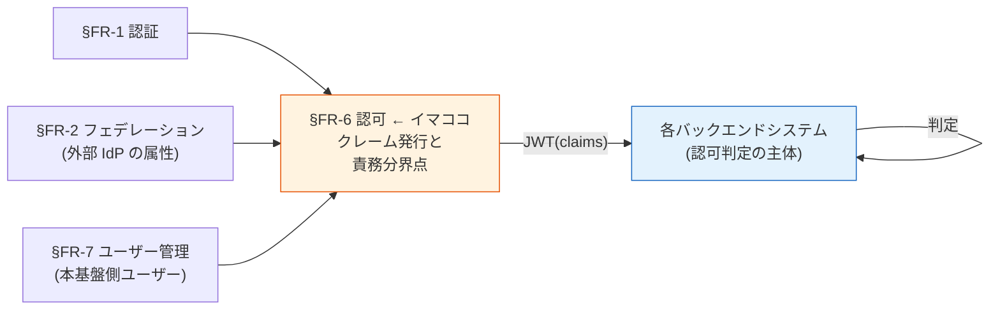

認証は「誰か」を確定する仕事。**認可は "それでもって何ができるか" を決める**。本基盤は **JWT クレーム発行までを担当**、最終的な認可判定は各バックエンドシステムが JWT を検証して実施（責務分離）。

---

### §FR-6.0.A 本基盤の認可スタンス（最重要・要合意）

> **本基盤は「認証 + 最小限のクレーム発行」までを担当。認可判定は各アプリ側の責務とする。**

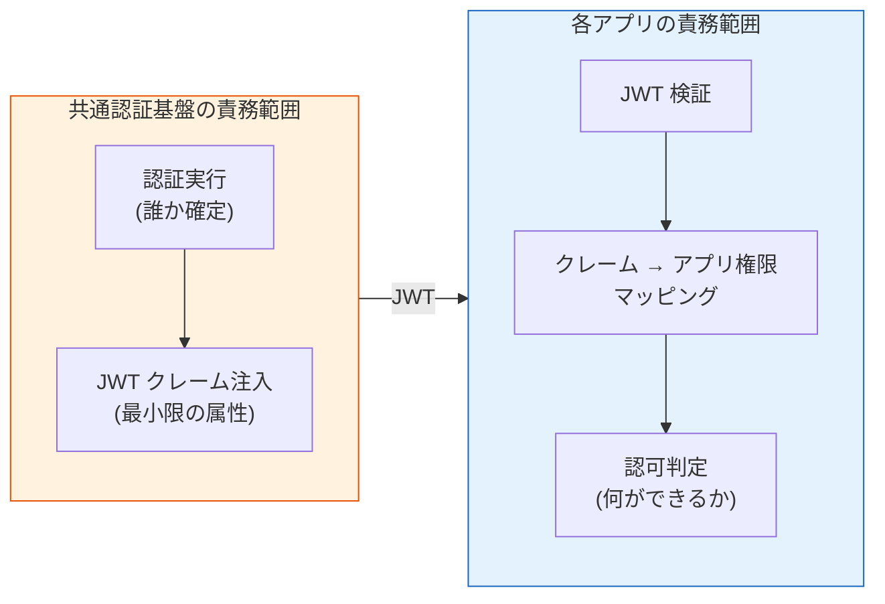

#### このスタンスの業界根拠（2026 年時点）

「認証 ≠ 認可、認可は外部化せよ」は **業界のメインストリーム推奨**。一次資料：

| 出典 | 主張の要旨 |
|---|---|
| **OAuth.net 公式** | "OAuth 2.0 is **a delegation protocol** for conveying authorization decisions... **OAuth 2.0 is not an authentication protocol**." → 認証と認可は別レイヤー |
| **NIST SP 800-63C**（連邦政府 Identity Federation 公式） | "**The RP（各アプリ）** uses information in the assertion to identify the subscriber and **make authorization decisions** about their access to resources controlled by the RP." → 認可は RP の責務と明記 |
| **2026 JWT Best Practices**（Curity / Auth0 / Permit.io 等） | "JWTs should be **minimal pointers, not data stores**" ／ "JWTs are best at communicating **identity, not permissions**" |
| **Gartner**（業界アナリスト） | "**Externalize authorization logic**; if it's hardcoded, it's technical debt." カテゴリを "**Externalized Authorization Management (EAM)**" として正式定義 |
| **KuppingerCole** | 同カテゴリを "**Dynamic Authorization Management (DAM)**" として推奨。"Externalizing authorization decisions outside of applications" を新世代 IAM の核と位置付け |
| **OpenID AuthZEN 1.0**（2026 年 1 月 Final） | この分離思想を実現するため、認可 API を標準化（認可エンジンの交換可能性を確保）|

#### アンチパターン警告

> "A common anti-pattern is using JWT as a substitute for per-request authorization checks." — 業界共通の警告

→ JWT に過剰な認可情報を詰める / IdP に認可ロジックを集中させるのは **アンチパターン**。

#### このスタンスを採る理由（業界根拠 × 本プロジェクト固有理由）

| 理由 | 説明 | 根拠 |
|---|---|---|
| **不特定多数のシステムが繋ぎ込まれる前提** | 各アプリの業務ロジック・権限モデルは事前に分からない。基盤が認可まで踏み込むと、各アプリの自由度を縛る | 本プロジェクト固有 |
| **責務分離は業界標準** | 認証 = 信頼の源泉（基盤）／ 認可 = 業務判断（アプリ）。混在させると変更コストが爆発 | OAuth.net / NIST SP 800-63C |
| **拡張性の確保** | 後から ABAC / ReBAC / UMA / Cedar / OPA / OpenFGA など好きな PDP を導入できる | Gartner EAM / KuppingerCole DAM |
| **基盤側の安定性** | クレーム形式が安定 → 各アプリは何年経っても同じ JWT 検証で動く | JWT Best Practices |
| **顧客ごとの認可方針の違いに対応** | 顧客 A は roles で OK、顧客 B は ABAC 必須、顧客 C は外部 PDP 利用、を個別に対応可能 | 本プロジェクト固有 |
| **Technical debt 回避** | 認可ロジックを基盤に hardcode すると Gartner 警告通り技術的負債化 | Gartner 明示 |

→ **本スタンスは「妥当」を超えて、業界のベストプラクティスそのもの**。

#### 共通認証基盤として「認可（クレーム発行）」を検討する意義

| 観点 | 個別アプリで実装 | 共通認証基盤で実装 |
|---|---|---|
| ユーザー識別 | アプリごとに別 ID 体系 | **基盤 `sub` で全アプリ統一** |
| テナント分離 | アプリごとに `tenant_id` 抽出ロジック | **基盤が JWT に注入、アプリは検証のみ** |
| 属性正規化（[§FR-2.2.2](02-federation.md#322-属性マッピング--クレーム変換--fr-fed-009)） | アプリごとに IdP クレーム差異を吸収 | **基盤で 1 度だけ正規化** |
| JWT 発行と署名 | アプリでは不可能 | **基盤が秘密鍵で署名、各アプリは公開鍵で検証** |

→ 「最小限の正規化済みクレームを安全に発行する」までが基盤の仕事。**その先（業務ロジックに紐づく認可）は各アプリ**。

### §FR-6.0.B 「認可」という言葉の 2 つの意味（よくある誤解と Token Exchange の位置づけ）

> **誤解の典型**: 「認可はアプリ側だから、本基盤は Token 発行だけしてれば良い。Token Exchange も気にしなくて良いのでは?」
> **実は逆**: 本基盤が **「正しい Token を正しい宛先に発行する」** 責務を果たさないと、**アプリ側で正しく認可判定ができなくなる**。

#### 「認可」の 2 つの意味

OAuth/OIDC 周辺で「認可」は 2 つの意味で使われ、混同されがちです:

| 意味 | 何の話か | 担当 |
|---|---|---|
| **意味 A: 認可フレームワーク**（OAuth 2.0 そのもの）| **Token をどう発行するか**（フロー / プロトコル）| **本基盤**（Authorization Server）|
| **意味 B: 認可判定**（リソース保護）| **alice は /expense/123 を編集できるか?** という業務判定 | **アプリ**（Resource Server）|

→ **§FR-6.0.A の「認可はアプリ側」スタンスは意味 B のこと**。意味 A は本基盤がやらないと OAuth が成立しない。

#### Cognito/Keycloak は「クレームを整えるだけ」か?

**半分正しいが、もう少し正確には**:

| 本基盤がやること | 認可判定か? |
|---|---|
| ユーザー認証（本人確認） | ❌ 認可ではなく**認証** |
| クレーム発行（`sub` / `email` / `tenant_id` 等）| ❌ 認可判定ではない、**判定の材料を渡している** |
| **Access Token の発行**（`aud` / `scope` / `exp` 付き）| ⚠ **意味 A の認可**（フロー制御）|
| **どのクライアントに何の Token を出すか**（App Client 設定で制御）| ⚠ **意味 A の認可**（アクセス制御の入口）|
| alice は /expense/123 を編集できるか? | ❌ **やらない**（アプリ側）|

→ **本基盤は「アプリ側の認可判定の前提を作る」**。判定そのものはアプリだが、**正しい前提（適切な Token）がないとアプリ側で正しく判定できない**。

#### Token Exchange が必要になるシナリオ（マイクロサービス OBO）

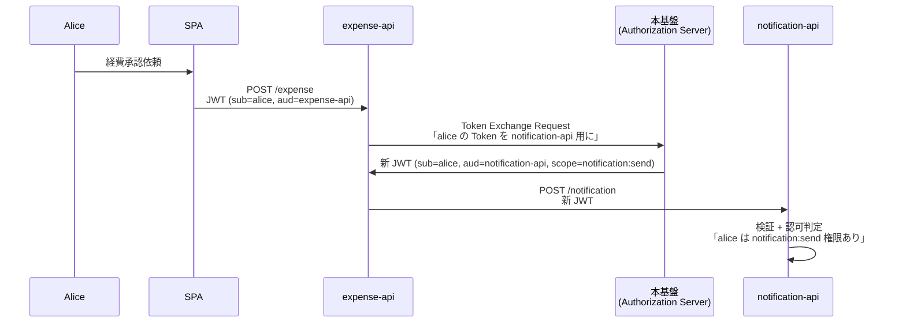

**Token Exchange なしの代替策はすべて妥協を強いる**:

| 代替策 | 問題 | アプリ側認可への影響 |
|---|---|---|
| **Token をパススルー** | `notification-api` が `aud=expense-api` の Token を受ける（本来拒否）| **`aud` チェックを甘くする必要** = アプリ側認可ルーズ化 |
| **Client Credentials** | `sub=expense-api-service` に変わる、ユーザー文脈消失 | **「誰のリクエストか」が消える** = 監査不能、ユーザー単位認可不能 |
| **アクセス禁止** | サービス間連携不能 | 業務成立せず |

→ **Token Exchange があれば、アプリは「自分宛の正しい Token」を受け取って純粋に業務認可判定だけに集中できる**。
→ これが「**認可はアプリ側だが、本基盤は『正しい Token』を渡す責務がある**」の意味。

#### 「Token Exchange を気にすべきか」の判断フロー

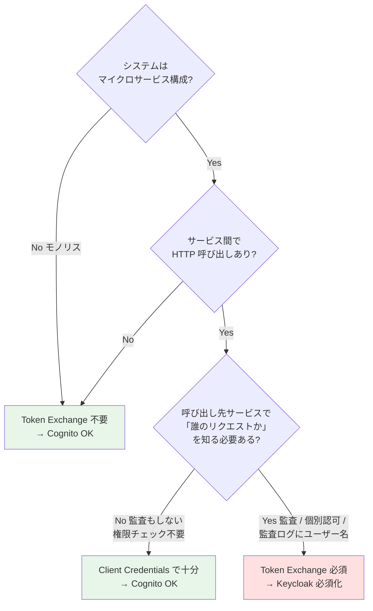

**Yes になる典型ケース**:
- 監査ログにユーザー名が必須（GDPR / SOC 2 / FFIEC 等）
- サービス別に個別認可がある（notification-api が alice の通知設定を見て判定）
- B2B SaaS でテナント別の細粒度認可（サービス間でも `tenant_id` を保持）
- OAuth Scope の最小権限原則（notification 呼び出し時に expense scope は要らない）

**No で済む典型ケース**:
- モノリス（単一バックエンド）
- マイクロサービスでも独立性が高く各サービスが直接ユーザー認証受ける
- サービス間 = 設定値同期程度、ユーザー文脈不要
- 監査がサービス単位で完結、ユーザー名は不要

→ **Yes なら Cognito 候補から落ちる**（Token Exchange = K-01 Knockout、Keycloak 必須）。

#### 本章で扱うサブセクション

| サブセクション | 内容 | 関連 FR |
|---|---|---|
| §FR-6.1 認証基盤が発行する JWT クレーム | 必須クレーム / オプション / カスタマイズ余地 | FR-AUTHZ-001〜008 |
| §FR-6.1.A 最小クレーム設計と接続元アプリ表現 | aud/azp/client_id 使い分け、Stage 1/2/3 設計、Cognito の aud 罠 | FR-AUTHZ-001〜008 |
| §FR-6.2 各アプリの認可設計パターン | 4 パターン併記、顧客が選択 | FR-AUTHZ-009, 010 |

---

## §FR-6.1 認証基盤が発行する JWT クレーム（→ FR-AUTHZ §5.1）

> **このサブセクションで定めること**: 認証基盤が JWT に**注入するクレームの範囲**（最小限：`sub`/`tenant_id`/`email` 〜 オプション：`roles`/カスタム属性）。   
> **主な判断軸**: 必要なクレーム最小構成、カスタムクレーム要望、`roles` を JWT に含めるか / アプリ DB で管理するか   
> **§FR-6 全体との関係**: §FR-6.0.A スタンス「**基盤は最小限、認可はアプリ**」を**発行クレーム**として具体化。§FR-6.2 は「アプリ側がそれをどう使うか」

### 業界の現在地

**JWT クレームの 2026 ベストプラクティス**（multi-tenant SaaS 文脈）:
- **最小限主義**: 「アプリが使う属性のみ」を JWT に含める（余計な属性は漏洩リスク）
- **改ざん防止**: `tenant_id` 等のセキュリティ属性は基盤側で必ず注入（ユーザー自己申告不可）
- **tenant-scoped**: ロール・グループはテナント別の意味で発行
- **正規化済み**: 外部 IdP の命名揺れを基盤側で吸収（[§FR-2.2.2](02-federation.md#322-属性マッピング--クレーム変換--fr-fed-009)）
- **JWT はポインタ、データストアではない**: 詳細権限は基盤外に置き、JWT は識別情報のみ

### 我々のスタンス（基本方針に基づく）

| 基本方針の柱 | クレーム発行での実現 |
|---|---|
| **絶対安全** | `tenant_id` は改ざん不可、署名検証必須、最小限のクレームで漏洩リスク最小 |
| **どんなアプリでも** | OIDC 標準 + 最小限の追加クレーム = どんなアプリでも同じ方法で検証可能 |
| **効率よく** | アプリは JWT を信じるだけ、認可判定は自分のロジックで実施可 |
| **運用負荷・コスト最小** | クレーム仕様が安定 → アプリ側変更不要、基盤の保守が容易 |

### 発行するクレームの 3 段階

| 段階 | クレーム | 採用判断 | 推奨度 |
|---|---|---|:---:|
| **A. 最小（Must）**| `sub`（ユーザー ID）、`iss`、`exp`、`aud` | OIDC 標準、全顧客 Must | ⭐⭐⭐ |
| **B. 識別拡張（Must）**| `tenant_id`（テナント識別）、`email` | マルチテナント前提で必須 | ⭐⭐⭐ |
| **C. オプション**| `roles`、`groups`、`name`、カスタム属性 | 顧客要件次第 | ⭐⭐ |

→ **A + B が本基盤のデフォルト発行クレーム**。C は顧客と相談して個別に決定。

### 対応能力マトリクス

| 機能 | Cognito | Keycloak (OSS/RHBK) | PoC 検証 |
|---|:---:|:---:|:---:|
| 標準 OIDC クレーム（`sub`/`iss`/`exp`/`aud`）| ✅ | ✅ | ✅ |
| `tenant_id` 注入 | ✅ Pre Token Lambda V2 | ✅ Protocol Mapper（宣言的）| ✅ Phase 8 / 9 |
| `roles` 注入 | ✅ Pre Token Lambda V2 | ✅ Protocol Mapper（Realm Role）| ✅ Phase 8 / 9 |
| カスタムクレーム注入 | ✅ Pre Token Lambda V2 | ✅ Protocol Mapper | ✅ |
| Access Token への注入 | ⚠ Pre Token V2 必須 | ✅ Protocol Mapper（標準）| ✅ Phase 8 / 9 |
| API Gateway / Lambda Authorizer 統合 | ✅ | ✅ | ✅ Phase 3 / 9 |
| マルチイシュア対応 | ✅ | ✅ | ✅ Phase 4, 5, 9 |
| クレーム改ざん防止 | ✅ RS256 署名 | ✅ RS256 署名 | ✅ |

### ベースライン

**1. デフォルト発行クレーム**:

```json
{
  "sub": "user-uuid",              // Must: 一意ユーザー ID
  "tenant_id": "acme-corp",        // Must: テナント識別
  "email": "alice@acme.com",       // Must: ユーザー識別補助
  "iss": "https://auth.example.com",
  "aud": "client-id",
  "exp": 1234567890,
  "iat": 1234560000
}
```

**2. オプションで追加可能（顧客選択）**:

| クレーム | 用途 | 採用例 |
|---|---|---|
| `roles` | ロール認可をしたいアプリ | 全アプリで RBAC 採用時 |
| `groups` | グループベース認可 | 部署権限を持つアプリ |
| `name` | 表示名 | UI 表示用 |
| `custom:*` | 顧客固有属性 | 部署 ID、コストセンター、契約レベル等 |

**3. 顧客に対して提示する選択肢**:

> 「**御社の各アプリで認可をどう実装するかを教えてください**。それに応じて、JWT に何を含めるか決めます。例えば：   
> - 「ユーザー ID だけあれば、あとはアプリ DB で権限管理」→ `sub` + `tenant_id` だけで OK   
> - 「会社名で簡易判定したい」→ `tenant_id` を含む   
> - 「ロールも基盤側で持ちたい」→ `roles` を追加   
> - 「個別属性で細かく判定したい」→ カスタムクレームを追加」

### TBD / 要確認

| 確認項目 | 回答例 |
|---|---|
| 必要なクレームの最小構成 | A のみ / A+B / A+B+C |
| カスタムクレーム要望 | 部署 / 役職 / コストセンター / その他 |
| `roles` を JWT に含めるか | はい（RBAC ベース）/ いいえ（アプリ DB で管理）|
| Access Token と ID Token への注入範囲 | 両方 / ID Token のみ |

---

### §FR-6.1.A 最小クレーム設計と接続元アプリ表現

> **詳細は [ADR-030 最小 JWT クレーム設計と接続元アプリ表現](../../../adr/030-minimal-jwt-claim-design.md) を参照**

> **このサブ・サブセクションで定めること**: 「最小限のクレーム」の具体的な JWT 構造、特に **`aud` / `azp` / `client_id` の使い分け（接続元アプリの表現）** と、Cognito の `aud` 罠の対処。
> **主な判断軸**: PII 漏洩リスク最小化、トークンサイズ抑制、認可機能の保持
> **§FR-6.1 内の位置付け**: §FR-6.1 の「3 段階クレーム」を実際の JWT 構造に落とし込む

#### 結論サマリ

| 項目 | 採用方針 |
|---|---|
| **デフォルト発行クレーム** | **Stage 1**: `iss` / `sub` / `aud` / `azp` / `tenant_id` / `exp` / `iat`（約 300 byte）|
| **接続元アプリ表現** | **`azp` を使う**（OIDC 標準、Validator 対応）|
| **PII の扱い** | **JWT に入れない**（email / name 等は userinfo / DB 参照）|
| **Cognito 採用時の対応** | **Pre Token Lambda V2 で `aud` / `azp` 注入**（Essentials+ ティア必須）|
| **マイクロサービス時** | Stage 2 へ昇格（scope / client_id / auth_time / jti 追加）|
| **RBAC 採用時** | Stage 3 へ昇格（roles 追加）|

#### 3 段階の最小クレーム設計

**Stage 1（推奨デフォルト）**：

```json
{
  "iss": "https://auth.example.com",
  "sub": "user-abc-123",
  "aud": "expense-api",
  "azp": "expense-spa",
  "tenant_id": "acme",
  "exp": 1730003600,
  "iat": 1730000000
}
```

**Stage 2（認可・監査強化）**: `client_id` / `scope` / `auth_time` / `jti` 追加。
**Stage 3（RBAC）**: `roles` 追加。

#### `aud` / `azp` / `client_id` の使い分け

| クレーム | 意味 | 検証側の使い方 |
|---|---|---|
| **`aud`**（audience）| JWT の宛先 = 検証する側（API）| API は「自分宛か」を必ず検証 |
| **`azp`**（authorized party）| JWT を取得した側 = 接続元アプリ（SPA / モバイル / BFF）| トレース・ログ・追加検証用 |
| **`client_id`** | OAuth 2.0 client（≒ `azp`）| RFC 9068 推奨 |

→ **「接続元アプリ」を JWT に入れたい = `azp` を入れる**（OIDC 標準クレーム）。多重 `aud` の場合は `azp` 必須化。

#### Cognito の罠：Access Token に `aud` がない

| 状態 | 対処 |
|---|---|
| Cognito ID Token | `aud = client_id` がデフォルトで入る |
| Cognito Access Token | `aud` が**デフォルトで入らない** → 検証ライブラリでエラー |
| **推奨対処** | **Pre Token Lambda V2 で `aud` 注入**（Essentials+ 必須）|

→ Keycloak は標準で `aud` を埋めるため、この罠はない（Audience Mapper で多重 `aud` も可能）。

#### 接続元アプリ表現の 3 ユースケース

- **アプリ単位の認可**: 経費精算 API は経費精算 SPA からのトークンのみ受理 → token confused deputy 攻撃を防御
- **監査・追跡**: インシデント時にどのアプリ経由かを追跡
- **レート制限・ログ集計**: アプリ別の API 呼び出し急増検知

#### 対応能力マトリクス

| 機能 | Cognito | Keycloak |
|---|:---:|:---:|
| `aud` を Access Token に注入 | ⚠ Pre Token Lambda V2 必須（Essentials+）| ✅ Audience Mapper 宣言的 |
| `azp` を Access Token に注入 | ⚠ Pre Token Lambda V2 で実装 | ✅ 標準 |
| 多重 `aud`（配列）| ⚠ Lambda 実装 | ✅ Audience Mapper |
| クレーム削除（PII 除去）| ✅ Pre Token Lambda V2 | ✅ Protocol Mapper |

#### TBD / 要確認

| 確認項目 | 回答例 |
|---|---|
| 採用 Stage | Stage 1（最小）/ Stage 2（認可・監査）/ Stage 3（RBAC）|
| 接続元アプリ表現の要否（`azp`）| 必要（複数 SPA / モバイル / BFF）/ 不要（単一 SPA）|
| PII を JWT に入れるか | **入れない（推奨）** / email のみ / 全部 |
| 多重 `aud` の要否 | 必要（API Gateway で fan-out）/ 不要 |
| トークンサイズ目標 | 〜500 byte / 〜1KB / 制約なし |
| Cognito 採用時の Pre Token Lambda V2 利用 | Yes（Essentials+ 前提）/ No（Lite で運用、aud なし許容）|

---

## §FR-6.2 各アプリの認可設計パターン（→ FR-AUTHZ §5.2、業界知見の集約）

> **このサブセクションで定めること**: 本基盤は認可判定をしない代わりに、**各アプリが認可をどう実装するかの選択肢**（A: アプリ DB / B: RBAC / C: ABAC / D: 外部 PDP）を顧客が選択できる形で提示する。   
> **主な判断軸**: 各アプリの認可パターン（A〜D、アプリごとに異なっても可）、細粒度認可の要否、採用したい外部 PDP（Cedar / OPA / OpenFGA 等）   
> **§FR-6 全体との関係**: §FR-6.0.A スタンス通り、本基盤は介入しない。本サブセクションは「**アプリ側の設計支援情報**」として提示する位置付け

本基盤は判定に介入しないが、各アプリが採れる代表的なパターンを示し、顧客が選択できるようにする。

### 業界の現在地

各アプリで採用可能な認可アプローチ:

| アプローチ | モデル | 適用範囲 |
|---|---|---|
| **アプリ DB 認可** | アプリ独自 | 認証は基盤、認可はアプリ DB で完結 |
| **RBAC**（roles クレーム）| Role-Based | 標準的、多くのアプリで採用 |
| **ABAC**（属性ベース）| Attribute-Based | 動的判定（時間・IP・部署） |
| **ReBAC**（関係ベース）| Relationship-Based | OpenFGA / SpiceDB、複雑な階層 |
| **外部 PDP**（Policy Decision Point）| Cedar / OPA | Amazon Verified Permissions / Open Policy Agent |
| **UMA 2.0** | Resource-Owner Based | Keycloak Authorization Services |

### 我々のスタンス（基本方針に基づく）

| 基本方針の柱 | 認可設計での実現 |
|---|---|
| **絶対安全** | tenant 境界は JWT クレームで保証、各アプリは tenant スコープ検証を必ず実施 |
| **どんなアプリでも** | 4 パターン併記。顧客のアプリ種別 / 規模 / 要件に応じて選択可能 |
| **効率よく** | 基盤側で追加実装なし。各アプリは独立して認可ロジックを進化可能 |
| **運用負荷・コスト最小** | RBAC で済むなら細粒度導入しない。導入時は外部 PDP（マネージド）優先 |

### 認可設計パターン 4 案

#### パターン A：アプリ DB 認可（最小構成）

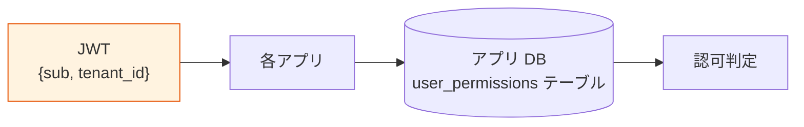

- 基盤からは `sub` と `tenant_id` のみ受け取る
- アプリ DB で `user_id → permissions` を管理
- 最大柔軟性、アプリ設計自由
- 採用例：認可ロジックが業務複雑なシステム

#### パターン B：RBAC（roles クレーム利用）

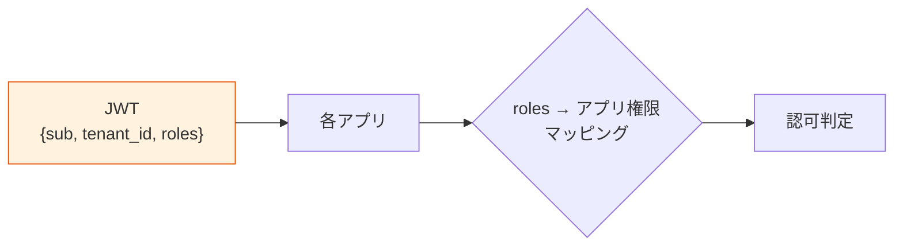

- 基盤が `roles` クレームを発行（manager / employee 等）
- アプリは roles → 自分の権限にマッピング
- 標準的、ほとんどのアプリで採用可能
- 採用例：標準的な業務システム

#### パターン C：ABAC（属性ベース、動的判定）

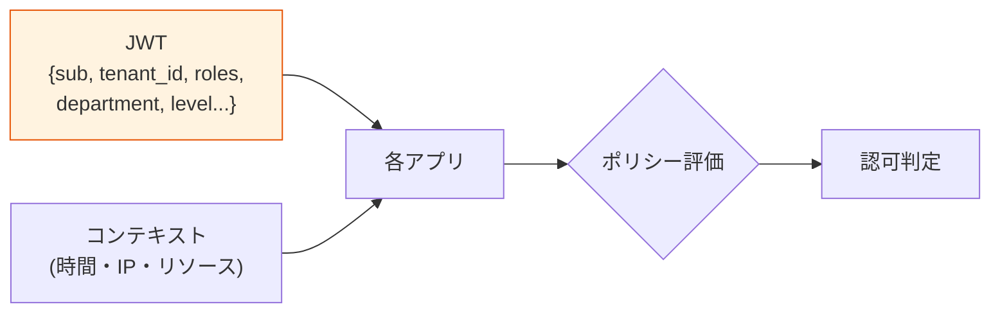

- 基盤がカスタム属性（部署 / レベル等）を JWT に注入
- アプリ側で属性 × コンテキストでポリシー評価
- 動的判定が必要な場合に採用
- 採用例：金融、医療、機密データを扱うシステム

#### パターン D：外部 PDP（Cedar / OPA / OpenFGA / UMA）

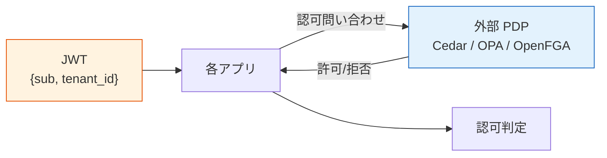

- 認可ロジックを外部 PDP に完全委譲
- アプリは PDP に問い合わせるだけ
- 大規模・複雑・複数アプリで認可ポリシー統一したい場合
- 採用例：大規模 SaaS、AI Agent 認可、UMA リソース共有

### パターン選定ガイド

| 顧客の要件 | 推奨パターン |
|---|---|
| シンプル、アプリ独立進化したい | A. アプリ DB 認可 |
| 標準的な RBAC で十分 | B. RBAC |
| 部署・属性で動的判定したい | C. ABAC |
| 細粒度認可（リソース共有等）| D. 外部 PDP（UMA / Cedar / OPA） |
| AWS native + 細粒度 | D. **Amazon Verified Permissions + Cedar** |
| Keycloak 採用 + 細粒度 | D. **Keycloak Authorization Services（UMA）** |
| マイクロサービス多数 | D. **OPA** |
| 組織階層型データ共有 | D. **OpenFGA / SpiceDB** |
| AI Agent 認可（将来）| D. **Cedar（Amazon Bedrock 採用）/ SpiceDB（LangChain 統合）** |

### ベースライン

| 項目 | ベースライン |
|---|---|
| デフォルト推奨 | **パターン B（RBAC）** または **パターン A（アプリ DB）** |
| アプリごとに異なるパターン | 許容（基盤は介入しない）|
| パターン D 採用時の選定 | 顧客要件 + プラットフォーム（Cognito / Keycloak）と整合 |
| tenant 境界の検証 | **全パターンで必須**（JWT.tenant_id 検証）|

### TBD / 要確認

| 確認項目 | 回答例 |
|---|---|
| 各アプリで採用したい認可パターン | A / B / C / D（アプリごとに別でも可）|
| 細粒度認可の要否 | 不要 / 必要（パターン D） |
| 採用したい外部 PDP | Cedar / AVP / OPA / OpenFGA / Keycloak Auth Services / なし |
| プラットフォーム選定への影響 | UMA Must → Keycloak、AVP 優先 → Cognito |

---

## §FR-6.3 マイクロサービス間トークンリレー / ユーザー文脈伝播（→ FR-AUTHZ / FR-AUTH-005）

> **このサブセクションで定めること**: マイクロサービス間呼び出しで「**誰の操作か**（エンドユーザーの認証コンテキスト）」をどう伝播するかの方式選定。
> **主な判断軸**: マイクロサービス採用予定の有無、サービス間呼び出しでユーザー文脈を保つ業務要件、最小権限（scope 縮小）の必要性
> **§FR-6 全体との関係**: §FR-6.1 = 「**基盤が発行するクレーム**」、§FR-6.2 = 「**各アプリでの判定方法**」、§FR-6.3 = 「**サービス間呼び出しでのクレーム継承**」

### §FR-6.3.0 トークンリレーとは何か

1 つのサービスが受け取ったトークン（ユーザーの認証情報）を、**そのサービスから別のサービスを呼び出す際に「引き渡す / 変換する」仕組み**。

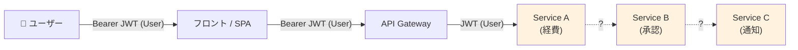

→ **Service A から B / C を呼ぶときに「誰の権限で呼ぶか」「どう認証情報を引き渡すか」**が論点。

### §FR-6.3.1 なぜ必要か（4 つの動機）

| 動機 | 内容 |
|---|---|
| **A. 監査ログでエンドユーザー特定** | B / C のログで「Alice の操作」として記録できないと、SOC 2 / ISO 27001 のユーザー監査要件を満たせない |
| **B. 各サービスで個別認可判定** | A は全社員可、B は管理者のみ等の差別化が必要。A の Service Account で B に入れると権限昇格脆弱性 |
| **C. 最小権限原則** | 元 Token の scope = `expense:write notification:read` を、Service C 呼び出し時は `notification:read` のみに絞りたい |
| **D. ユーザー代理操作（OBO）** | 顧客の Slack / Notion 等への代理投稿、`act` クレームで「A が Alice の代理」を明示 |

### §FR-6.3.2 4 つの実装パターン

| パターン | 仕組み | ユーザー文脈 | scope 縮小 | 監査 | Cognito | Keycloak |
|---|---|:---:|:---:|:---:|:---:|:---:|
| **1. 単純 Token Forward** | 受け取った JWT をそのまま転送 | ✅ | ❌ | ✅ | ✅ | ✅ |
| **2. Token Exchange (RFC 8693)** | Service A が AS で OBO トークンに変換、`act` クレーム付与 | ✅ | ✅ | ✅ | ❌ **非対応** | ✅ ネイティブ |
| **3. Service Account (M2M)** | A が自分の Client Credentials で B を呼ぶ | ❌ 消失 | ✅（別 client）| ❌ | ✅ | ✅ |
| **4. Internal Passport / Custom** | API Gateway で外部 Token → 内部独自フォーマットに変換（Netflix パターン） | ✅（独自）| 任意 | ✅ | ✅（独自実装）| ✅（独自実装）|

#### パターン 1: 単純 Token Forward

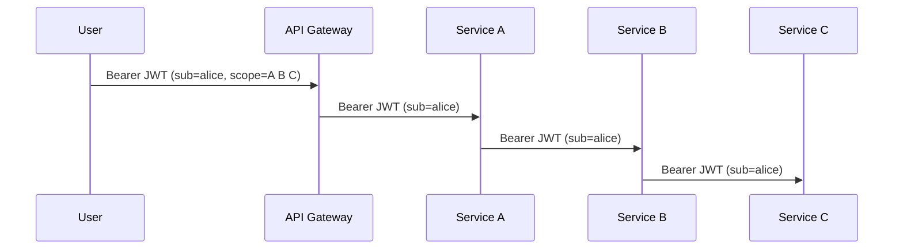

- 最もシンプル、すべてのサービスが同じ Token を見る
- 全サービスが同じ Authorization Server を信頼する必要あり
- scope を絞れない → Service C 乗っ取り時に全権限使われるリスク
- → **小〜中規模 + 信頼境界が同一**なら採用可

#### パターン 2: Token Exchange (RFC 8693)

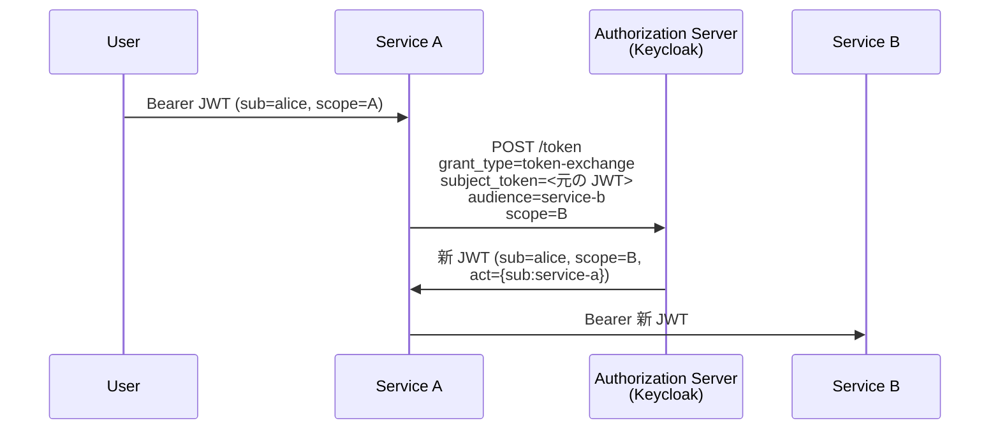

- `act` クレームで「Service A が Alice の代理で呼んでいる」が明示される
- 各サービスごとに適切な `scope` / `audience` で Token 取得可
- **業界標準**（RFC 8693）、本プロジェクトの基本方針「**絶対安全**」と整合
- **Cognito 非対応 → Keycloak 必須化要因**（[§FR-1.1 C](01-auth.md#fr-11-認証フロー--grant-type-fr-auth-11)）

#### パターン 3: Service Account（ユーザー文脈消失）

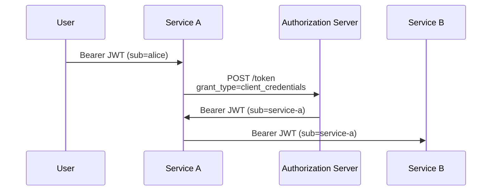

- B から見ると「Service A が呼んでいる」としか分からない
- **ユーザー文脈は失われる**（監査ログでユーザー特定不可）
- **バッチ・定期ジョブ等、ユーザー文脈不要な処理向け**
- ユーザー文脈が必要な場合は NG

#### パターン 4: Internal Passport（Netflix パターン）

- API Gateway で外部 Token → 社内独自フォーマット（Passport）に変換
- 内部サービス間は社内専用署名で連鎖
- 大規模・特殊要件向け、独自実装コスト大
- **業界標準ではない**、本基盤ではほぼ採用しない

### §FR-6.3.3 我々のスタンス（基本方針に基づく）

| 基本方針の柱 | トークンリレーでの実現 |
|---|---|
| **絶対安全** | 監査要件・最小権限を満たす Token Exchange を**マイクロサービス採用時の標準**として推奨 |
| **どんなアプリでも** | OAuth 2.0 標準準拠（パターン 1 or 2）。アプリ側は受け取った JWT を検証するだけ |
| **効率よく** | パターン 2 採用なら宣言的に scope 縮小、複雑なロジックなし |
| **運用負荷・コスト最小** | Keycloak ならネイティブ、Cognito なら単純転送 or M2M で代替 |

### §FR-6.3.4 業務シナリオから採用パターンを導く判定フロー

「トークンリレー要りますか?」と直接聞いても伝わらないため、**業務シナリオで確認する**。

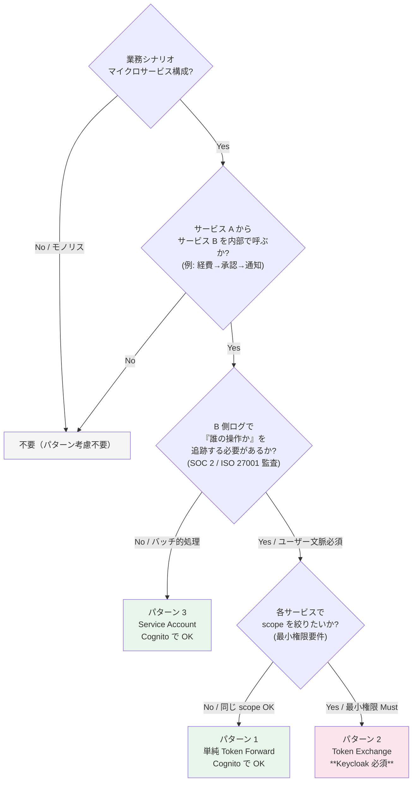

### §FR-6.3.5 ベースライン

| 項目 | ベースライン |
|---|---|
| マイクロサービス未採用 | **不要** |
| マイクロサービス採用 + 信頼境界同一 + scope 縮小不要 | **パターン 1（単純 Token Forward）**を許容、Cognito でも対応可 |
| マイクロサービス採用 + 監査要件 + 最小権限 Must | **パターン 2（Token Exchange、RFC 8693）**を推奨、**Keycloak 必須** |
| バッチ・定期ジョブのみ（ユーザー文脈不要）| **パターン 3（Service Account）**で十分 |
| 外部システム代理操作（OBO）| **パターン 2 必須**（`act` クレームで明示）|

### §FR-6.3.6 TBD / 要確認

「トークンリレー」を直接聞かず、以下の**業務質問**で判定する。

| 業務質問 | 回答例 | 影響 |
|---|---|---|
| ① マイクロサービス構成を採用していますか / する予定ですか? | はい / いいえ / 段階移行中 | 全パターン議論の前提 |
| ② サービス A が他のサービス B を内部で呼び出すパターンがありますか? | はい / いいえ + ユースケース | パターン検討必須化 |
| ③ B 側のログで「**誰（エンドユーザー）の操作か**」を追跡する必要がありますか? | 必須（SOC 2 等）/ あれば嬉しい / 不要 | パターン 3 NG → 1 or 2 |
| ④ 各サービスで個別に権限チェックしたいですか?（例: A は全員可、B は管理者のみ）| はい / いいえ | パターン 2 推奨 |
| ⑤ サービス間呼び出しで**最小権限**にしたい要件はありますか?（scope 縮小）| Must / Should / 不要 | パターン 2 必須化 |
| ⑥ **外部システム連携**（顧客の Slack / Notion 等）で「自社 SaaS が代理操作」しますか? | はい / いいえ | パターン 2（OBO）必須 |
| ⑦ コンプライアンス要件で OAuth 2.0 標準準拠（RFC 8693）が要求されますか? | はい / いいえ | パターン 2 必須 |

→ **③ ④ ⑤ ⑥ ⑦ のいずれかが Yes なら、Token Exchange が必要 → Keycloak 必須**（[ADR-014](../../../adr/014-auth-patterns-scope.md)）。

### §FR-6.3.7 ヒアリング・要件定義での位置付け

[hearing-checklist.md](../../hearing-checklist.md) の **B-104（Token Exchange）と B-304（トークンリレー）は表裏一体**：

- **B-304** = 業務シナリオでの確認（本サブセクションの判定フロー）
- **B-104** = 技術的結論（Token Exchange の要否、プラットフォーム選定への影響）

ヒアリング順序: **B-304（業務質問） → B-104（技術判定） → プラットフォーム判定**。

---

### 参考資料（§FR-6 全体）

#### スタンスの業界根拠（§FR-6.0.A）

- [OAuth.net - End User Authentication with OAuth 2.0](https://oauth.net/articles/authentication/)（OAuth は認可委譲プロトコル、認証ではない）
- [NIST SP 800-63C - Federation Guide](https://pages.nist.gov/800-63-3/sp800-63c.html)（認可は RP の責務）
- [JWT Best Practices 2026 - Permit.io](https://www.permit.io/blog/how-to-use-jwts-for-authorization-best-practices-and-common-mistakes)
- [JWT Best Practices - Curity](https://curity.io/resources/learn/jwt-best-practices/)
- [Gartner - Externalized Authorization Management 概要](https://www.gartner.com/en/documents/2358815)
- [KuppingerCole - Dynamic Authorization Management](https://www.kuppingercole.com/watch/authorization-before-we-externalise-it-eic24)
- [OpenID AuthZEN 1.0 Final 2026](https://openid.net/wg/authzen/)

#### 認可モデル・PDP

- [Authorization models 解説 - Medium 2026](https://medium.com/@iamprovidence/authorization-models-ibac-rbac-pbac-abac-rebac-acl-dac-mac-b274aa5bdf08)
- [RBAC vs ABAC vs PBAC - Oso](https://www.osohq.com/learn/rbac-vs-abac-vs-pbac)
- [RBAC vs ReBAC - Security Boulevard 2026](https://securityboulevard.com/2026/01/rbac-vs-rebac-comparing-role-based-relationship-based-access-control/)
- [Cedar Policy Language Guide - StrongDM 2026](https://www.strongdm.com/cedar-policy-language)
- [Amazon Verified Permissions 公式](https://aws.amazon.com/verified-permissions/)
- [Keycloak Authorization Services 公式](https://www.keycloak.org/docs/latest/authorization_services/)
- [Multi-tenant SaaS Access Control with AVP - AWS Blog](https://aws.amazon.com/blogs/security/saas-access-control-using-amazon-verified-permissions-with-a-per-tenant-policy-store/)

#### マイクロサービス間トークンリレー（§FR-6.3）

- [RFC 8693 - OAuth 2.0 Token Exchange](https://datatracker.ietf.org/doc/html/rfc8693)
- [Token Exchange in OAuth: Why and How - Curity](https://curity.medium.com/token-exchange-in-oauth-why-and-how-to-implement-it-a7407367cb55)
- [Delegation Patterns for OAuth 2.0 - Scott Brady](https://www.scottbrady.io/oauth/delegation-patterns-for-oauth-20)
- [OAuth 2.0 Token Exchange: Impersonation & Delegation - ZITADEL](https://zitadel.com/docs/guides/integrate/token-exchange)
- [RFC 8693 OAuth 2.0 Token Exchange - Authlete](https://www.authlete.com/developers/token_exchange/)
- [Authentication in Microservices: Approaches and Techniques - Frontegg](https://frontegg.com/blog/authentication-in-microservices)
- [Microservices Security - OWASP Cheat Sheet](https://cheatsheetseries.owasp.org/cheatsheets/Microservices_Security_Cheat_Sheet.html)
- [Best Practices for Authorization in Microservices - Oso](https://www.osohq.com/post/microservices-authorization-patterns)
- [Netflix Edge Authentication Service - Netflix Tech Blog](https://netflixtechblog.com/edge-authentication-and-token-agnostic-identity-propagation-514e47e0b602)
- [Keycloak Token Exchange 公式](https://www.keycloak.org/securing-apps/token-exchange)
