# §FR-7 ユーザー管理

> 上位 SSOT: [00-index.md](00-index.md)   
> 詳細: [../../functional-requirements.md §6 FR-USER](../../functional-requirements.md)   
> カバー範囲: FR-USER §6.1 CRUD / §6.2 属性ロール / §6.3 セルフサービス / §6.4 プロビジョニング

---

## §FR-7.0 前提と背景

### 用語整理

| 用語 | 本基盤での意味 |
|---|---|
| **ローカルユーザー** | 本基盤の User DB に直接登録されたユーザー（パスワード認証 or 招待ベース）|
| **フェデユーザー** | 外部 IdP（Entra ID / Okta 等）から JIT で本基盤に作成されたユーザー（[§FR-2.2.1 JIT](02-federation.md#321-jit-プロビジョニング--fr-fed-008)）|
| **CRUD** | Create / Read / Update / Delete の基本ユーザー操作 |
| **SCIM 2.0**（System for Cross-domain Identity Management）| ユーザーライフサイクル自動化の業界標準プロトコル |
| **JIT プロビジョニング** | SSO 初回ログイン時の自動ユーザー作成（[§FR-2.2.1](02-federation.md#321-jit-プロビジョニング--fr-fed-008)）|
| **データ最小化（Data Minimization）** | GDPR / 個人情報保護法の基本原則。必要最小限の属性のみ保持 |
| **Right to Erasure（忘れられる権利）** | GDPR Article 17。30 日以内の削除応答義務 |

### なぜここ（§FR-7）で決めるか

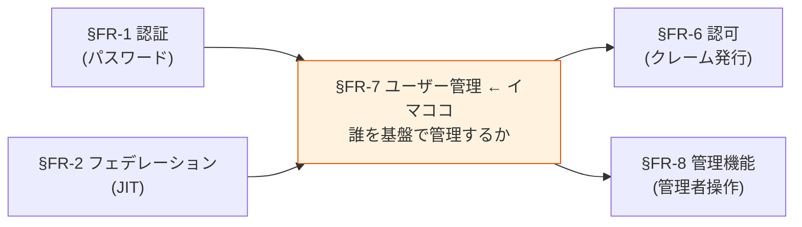

**[§FR-6](06-authz.md) で「認証基盤は最小限」のスタンスを採用**した。それは認可だけでなく、**ユーザー管理の範囲（=基盤で何を保持するか）にも同じ原則が適用される**。本章で「基盤が持つユーザー情報の範囲」と「各アプリが持つユーザー情報の範囲」の責務分界を明確化する。

### §FR-7.0.A 本基盤のユーザー管理スタンス（§FR-6 と整合）

> **本基盤は「認証に必要な最小限のユーザー情報」のみを保持。業務固有のユーザー情報（プロフィール詳細・取引履歴・部署移動履歴等）は各アプリ側で管理する。**

### 管理対象ユーザーのカテゴリ（[§FR-1.2.0.0](01-auth.md#fr-1200-ローカルユーザーとは何か--利用者カテゴリ別の分析) と連動）

本章で扱う「ユーザー」は **利用者カテゴリ P-1〜P-6 すべてを含む**が、CRUD 規模や運用主体はカテゴリ・採用シナリオ次第で大きく変わる:

| カテゴリ | 保管場所 | CRUD 主体 | 規模目安（シナリオ γ）|
|---|---|---|---|
| **P-1 基盤運用管理者** | 共通基盤（弊社内 IdP フェデ + Break Glass 用最小ローカル）| 弊社運用 | 数〜数十名 |
| **P-2 テナント管理者** | 共通基盤（顧客 IdP フェデ or ローカル）| 弊社運用 or 顧客（委譲管理者）| 顧客数 × 数名 |
| **P-3 IdP あり顧客従業員** | 共通基盤（フェデユーザーレコード）| **顧客 IdP 側が真実**、本基盤は影**像のみ** | 顧客数 × 数百〜数千 |
| **P-4 IdP なし顧客従業員** | 共通基盤（ローカルユーザー）| 顧客（委譲管理者）| シナリオ次第（γ では原則ゼロ）|
| **P-5 ゲスト**, **P-6 B2C** | 共通基盤 | 招待者 or セルフ | 不定 |

→ **本章 §FR-7.1〜7.4 のベースライン値は「対象カテゴリ × 採用シナリオ」で変動**することに留意。特に **CRUD 頻度** と **セルフサービス対象** はカテゴリで分けて運用設計する（[§NFR-6.5](../nfr/06-operations.md) のユースケースに反映済）。

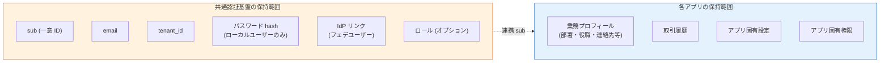

#### このスタンスの業界根拠

| 原則 | 出典 |
|---|---|
| **データ最小化（Data Minimization）** | GDPR Article 5(1)(c) / 個人情報保護法第 17 条 |
| **目的限定（Purpose Limitation）** | 同上、認証目的を超えた情報を基盤で持たない |
| **Privacy-by-Design** | GDPR Article 25、Login.gov 等の連邦政府ガイドラインも採用 |
| **2026 トレンド** | "Data minimization will evolve from purely legal obligation to scalability strategy" — 漏洩リスク低減 + 開発速度向上 |

### 共通認証基盤として「ユーザー管理」を検討する意義

| 観点 | 個別アプリで実装 | 共通認証基盤で実装 |
|---|---|---|
| ユーザー一意性 | アプリごとに別 ID 体系 | **基盤 `sub` で全アプリ統一** |
| パスワード管理 | アプリごとに別実装 | **基盤側で一元化、bcrypt/PBKDF2 統一** |
| ライフサイクル | アプリごとに退職処理 | **基盤側で 1 度無効化 → 全アプリ波及** |
| GDPR 削除権 | 各アプリで個別対応必要 | **基盤側で削除 → 全アプリの認可遮断** |
| SCIM 連携 | アプリごとに実装 | **基盤側で標準対応、各アプリ恩恵** |

→ ユーザー管理を基盤に集約することで、**認証情報の一元管理 + ライフサイクル統一 + コンプライアンス対応**を一気に解決。

### 本章で扱うサブセクション

| サブセクション | 内容 | 関連 FR |
|---|---|---|
| §FR-7.1 ユーザー CRUD | 基本操作・検索・有効化/無効化・削除 | FR-USER-001, 005, 006, 011 |
| §FR-7.2 属性・ロール | 基盤が持つ属性の範囲 / ロール定義 | FR-USER-002, 007, 008 |
| §FR-7.3 セルフサービス | ユーザー自身による操作（招待・プロフィール編集） | FR-USER-004, 012 |
| §FR-7.4 プロビジョニング | SCIM / バルクインポート / 管理者操作 | FR-USER-003, 009, 010 |

---

## §FR-7.1 ユーザー CRUD（→ FR-USER §6.1）

> **このサブセクションで定めること**: 本基盤のユーザーレコードに対する**基本操作**（作成・更新・削除・検索・有効化/無効化）と、GDPR Right to Erasure 対応の削除フロー。   
> **主な判断軸**: 削除 vs 無効化のデフォルト、削除 SLA、バックアップからの削除方針、退職時処理フロー   
> **§FR-7 全体との関係**: §FR-7.1 = 「**操作**」、§FR-7.2 = 「持つ属性」、§FR-7.3 = 「ユーザー自身の操作」、§FR-7.4 = 「外部からの自動投入」

### 業界の現在地

- **ローカルユーザー CRUD**: 認証基盤の基本機能。Cognito / Keycloak 両方標準
- **削除時のデータ処理**: GDPR Right to Erasure は 30 日以内応答必須。**EDPB 2026 enforcement framework が backup systems も対象化**
- **ライフサイクル**: 退職時の即時無効化が SOC 2 / ISO 27001 で求められる

### 我々のスタンス（基本方針に基づく）

| 基本方針の柱 | CRUD での実現 |
|---|---|
| **絶対安全** | 退職時即時無効化、削除時の関連データ削除（GDPR/個人情報保護法）|
| **どんなアプリでも** | 標準 Admin API / REST API でどんなアプリからも操作可能 |
| **効率よく** | バルク操作対応、検索 API |
| **運用負荷・コスト最小** | プラットフォーム標準機能、追加実装不要 |

### 対応能力マトリクス

| 機能 | Cognito | Keycloak (OSS/RHBK) | PoC 検証 |
|---|:---:|:---:|:---:|
| 作成 / 更新 / 削除 | ✅ Admin API | ✅ Admin REST API | ✅ |
| ユーザー検索（属性ベース） | ✅ ListUsers + filter | ✅ Search API | ✅ |
| 有効化 / 無効化 | ✅ AdminDisableUser | ✅ Enable/Disable | ✅ |
| 削除時の関連データ Cascade | ✅ AdminDeleteUser（基盤内）| ✅ Cascade Delete（Realm 内）| ❌ 未検証 |
| GDPR 削除証跡 | ✅ CloudTrail | ⚠ Event Listener 自前 | — |
| バックアップからの削除 | ⚠ 設計要 | ⚠ 設計要 | — |

### ベースライン

| 項目 | ベースライン |
|---|---|
| CRUD 操作 | **Must**（標準提供）|
| ユーザー検索 | **Must**（属性ベース・ID ベース）|
| 有効化 / 無効化 | **Must**（退職時即時対応）|
| 削除時の関連データ | **基盤内データ Cascade**（[§FR-2 フェデユーザーリンク](02-federation.md) / [§FR-6 ロール](06-authz.md) 含む）|
| GDPR 削除応答 SLA | **30 日以内**（法定）|
| バックアップ削除 | "delete-on-restore" マーカー方式（EDPB 推奨）|
| 監査ログ | 削除イベントを CloudWatch / Event Listener に永続記録 |

### TBD / 要確認

| 確認項目 | 回答例 |
|---|---|
| 削除 vs 無効化のデフォルト | 削除（GDPR 厳格）/ 無効化（履歴保持） |
| 削除 SLA | 即時 / 24 時間 / 7 日 / 30 日 |
| バックアップからの削除方針 | "delete-on-restore" / 即時 / 法定保管期間後 |
| 退職時の処理フロー | 即時無効化 → N 日後削除 / 即時削除 |

---

## §FR-7.2 属性・ロール（→ FR-USER §6.2）

> **このサブセクションで定めること**: 本基盤がユーザーレコードに**保持する属性の範囲**（最小 = `sub`/`email`/`tenant_id`/`password_hash`、オプション = ロール/グループ/カスタム属性）。   
> **主な判断軸**: 必要なカスタム属性、基盤 vs アプリ側の保持責務分担、ロール体系（フラット / 階層）、グループ管理の必要性   
> **§FR-7 全体との関係**: §FR-7.0.A「**基盤は最小限保持**」スタンスの具体化。[§FR-6.1 JWT クレーム発行](06-authz.md#71-認証基盤が発行する-jwt-クレーム--fr-authz-51) と保持属性が連動

### 業界の現在地

**データ最小化原則（2026）**:
- "lower numbers generally being better" — 属性数は少ないほど良い
- Progressive Profiling：必要になったときに取得（一括取得しない）
- Login.gov 連邦標準：「partner agency が必要と identify した最小セットのみ」

**業界トレンド**:
- 認証目的を超えた属性は基盤に置かない（漏洩リスク + コンプライアンス）
- ロール / グループは tenant-scoped
- Zero Knowledge Proof による属性検証（プライバシー強化）

### 我々のスタンス（基本方針に基づく）

| 基本方針の柱 | 属性・ロールでの実現 |
|---|---|
| **絶対安全** | データ最小化 = 漏洩時被害最小。GDPR/個人情報保護法準拠 |
| **どんなアプリでも** | 必要最小限のクレームを発行（[§FR-6.1](06-authz.md#71-認証基盤が発行する-jwt-クレーム--fr-authz-51)）、業務属性はアプリで保持 |
| **効率よく** | Progressive Profiling、必要時に取得 |
| **運用負荷・コスト最小** | カスタム属性は要件次第。デフォルトは最小 |

### 基盤が保持する属性の 3 段階（[§FR-6.1](06-authz.md#71-認証基盤が発行する-jwt-クレーム--fr-authz-51) と整合）

| 段階 | 属性 | 採用判断 |
|---|---|---|
| **A. 最小（Must）**| `sub`、`email`、`tenant_id`、`password_hash`（ローカルユーザーのみ） | 全顧客 Must |
| **B. 認証拡張（Should）**| `roles`（[§FR-6.1](06-authz.md#71-認証基盤が発行する-jwt-クレーム--fr-authz-51) パターン B 選択時）、`name`（UI 表示用）| 採用パターン次第 |
| **C. オプション**| 部署、コストセンター、カスタム属性 | 顧客個別要件 |

→ **C はできるだけアプリ側に置く**（基盤は認証に必要なものだけ）。

### 対応能力マトリクス

| 機能 | Cognito | Keycloak (OSS/RHBK) |
|---|:---:|:---:|
| カスタム属性 | ✅ Custom Attributes（最大 50） | ✅ User Attributes（**無制限**） |
| グループ管理 | ✅ Cognito Groups | ✅ Realm Groups |
| ロール割り当て | ⚠ Custom Attr or Group で代用 | ✅ Realm Role Assignment（標準）|
| ロール階層（継承）| ⚠ アプリ側実装 | ✅ Composite Role |
| 属性検索 | ✅ filter | ✅ Search API |
| 属性のスキーマ強制 | ✅ Schema 定義 | ✅ User Profile 設定 |

### ベースライン

| 項目 | ベースライン |
|---|---|
| 基盤が持つ属性の原則 | **データ最小化**（GDPR / 個人情報保護法準拠）|
| デフォルト保持属性 | `sub` / `email` / `tenant_id` / `password_hash`（ローカルのみ） |
| ロール採用判断 | [§FR-6 認可](06-authz.md) で顧客選択パターンに依存 |
| カスタム属性 | **必要最小限**、業務属性はアプリ側に置く方針 |
| グループ管理 | Should（顧客要件次第）|

### TBD / 要確認

| 確認項目 | 回答例 |
|---|---|
| 必要なカスタム属性 | 部署 / 役職 / コストセンター / その他 |
| 属性は基盤 vs アプリ側どちらに置くか | 基盤（クレームに含める）/ アプリ DB（基盤に置かない）|
| ロール体系 | フラット / 階層（Composite Role 必要 → Keycloak）|
| グループ管理の必要性 | あり / なし |

---

## §FR-7.3 セルフサービス（→ FR-USER §6.3）

> **このサブセクションで定めること**: ユーザー自身が**管理者を介さずに行える操作**の範囲（プロフィール編集・招待ベース登録・MFA セルフ登録・パスワードリセット）。   
> **主な判断軸**: セルフサービス UI 提供方針（基盤標準 UI / アプリ側実装）、招待 vs 自由登録、プロフィール編集の可能項目   
> **§FR-7 全体との関係**: §FR-7.1 が管理者操作中心、§FR-7.3 が**ユーザー自身による操作**。管理者負荷削減の核

### 業界の現在地

**2026 ベストプラクティス**:
- 招待ベースの登録（管理者がメール送信 → ユーザーが登録）
- セルフサービスプロフィール編集（管理者負荷削減）
- アクセスパッケージ（時限付き）：プロジェクト・契約者向け
- "zero-touch onboarding and instant, secure offboarding"

### 我々のスタンス（基本方針に基づく）

| 基本方針の柱 | セルフサービスでの実現 |
|---|---|
| **絶対安全** | プロフィール編集の範囲を制限（重要属性は管理者承認制）|
| **どんなアプリでも** | 基盤側で標準 UI 提供、アプリ側でも独自実装可 |
| **効率よく** | ユーザー自身でできることは自身で、管理者負荷削減 |
| **運用負荷・コスト最小** | Keycloak は Account Console 標準、Cognito はアプリ側で UI 実装 |

### 対応能力マトリクス

| 機能 | Cognito | Keycloak (OSS/RHBK) |
|---|:---:|:---:|
| セルフサービスプロフィール編集 | ⚠ アプリ側 UI 実装必要 | ✅ **Account Console**（標準）|
| 招待メール（Invite-based registration）| ✅ AdminCreateUser invitation | ✅ Email Verification + Required Action |
| パスワードリセット | ✅ Forgot Password | ✅ Forgot Password |
| MFA セルフ登録 | ✅ | ✅ Account Console |
| アクセスパッケージ / 時限権限 | ❌ | ⚠ プラグイン |

### ベースライン

| 項目 | ベースライン |
|---|---|
| プロフィール編集（基本属性） | **Must**（email / name）|
| プロフィール編集(重要属性) | 管理者承認制 |
| 招待ベース登録 | **Should**（招待メール送信機能）|
| MFA セルフ登録 | **Must**（[§FR-3.1 MFA 要素](03-mfa.md#41-mfa-要素--fr-mfa-31) で詳述）|
| パスワードリセット | **Must**（[§FR-1.2 ローカル PW](01-auth.md#22-パスワードローカルユーザー管理-fr-auth-12) で詳述）|

### TBD / 要確認

| 確認項目 | 回答例 |
|---|---|
| セルフサービス UI 提供方針 | 基盤標準 UI（Keycloak Account Console）/ アプリ側実装 |
| 招待 vs 自由登録 | 招待のみ（管理者制御）/ 自由登録（ドメイン制限）|
| プロフィール編集可能項目 | 全項目 / 一部のみ / 管理者承認制 |

---

## §FR-7.4 プロビジョニング（→ FR-USER §6.4）

> **このサブセクションで定めること**: 外部（IdP / バッチ / 管理者）からの**自動・大量投入**の方式（JIT / SCIM 2.0 / バルクインポート / 強制リセット）。   
> **主な判断軸**: SCIM 2.0 の必要性（**Cognito ネイティブ非対応 → Keycloak 必須化に直結**）、バルクインポート規模、退職時 deprovision SLA   
> **§FR-7 全体との関係**: §FR-7.1 が個別操作、§FR-7.4 は**自動化・大量処理**。JIT は [§FR-2.2.1](02-federation.md#321-jit-プロビジョニング--fr-fed-008) と整合

### §FR-7.4.0 SCIM の位置づけと本基盤のスタンス

> **論点**: SCIM は **「ユーザー情報を別システムに自動同期する標準 API」** で、OIDC / SAML の**認証層とは別レイヤー**にあるプロビジョニング層のプロトコル。退職者 deprovisioning / 属性同期 / GDPR 削除権応答を自動化する用途で、エンタープライズ B2B SaaS の標準。

#### SCIM とは（基本）

| 観点 | 内容 |
|---|---|
| **正式名称** | System for Cross-domain Identity Management 2.0（RFC 7643 + RFC 7644） |
| **役割** | ユーザー情報の CRUD を行う REST API 標準（POST/GET/PUT/PATCH/DELETE）|
| **送受信関係** | クライアント（送信元: HR / IdP）→ サーバー（受信先: 本基盤）|
| **典型データ** | userName / email / active / name / groups 等の標準スキーマ + 拡張 |

#### OIDC / SAML との関係（直交する 2 層）

| 層 | プロトコル | やること |
|---|---|---|
| **認証層** | OIDC / SAML | **いまログインしようとしているのは誰か** を確認 |
| **プロビジョニング層** | **SCIM** | **そもそも誰がユーザーとして存在するか** を管理 |

→ **OIDC + SCIM** は標準的な組み合わせ。「SCIM = SAML 専用」は誤解（Entra / Okta / Google はいずれも OIDC + SCIM をセット提供）。

#### JIT との比較（プロビジョニング方式）

| 方式 | やり方 | 強み | 弱み |
|---|---|---|---|
| **JIT** | OIDC/SAML 初回ログイン時に自動作成 | 事前準備不要 | **退職者の deprovisioning が困難** |
| **SCIM** | HR/IdP が REST API で push 同期 | 事前作成・自動 deprovisioning・属性同期 | ソース側に SCIM 機能必要 |
| **手動 / バルクインポート** | 管理者が UI / CSV で投入 | 簡単 | スケールしない |

#### JIT と SCIM の起動タイミング・方向（混同しやすい点）

> **重要**: 「JIT は SAML 専用」「SCIM があれば JIT は不要」という誤解が多いので、本基盤では以下の整理に従う。

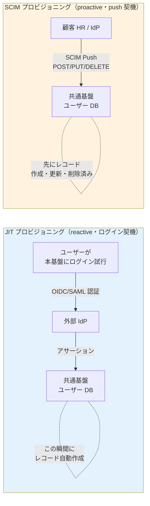

| 観点 | JIT | SCIM |
|---|---|---|
| **起動タイミング** | **ユーザーがログインした瞬間** | **HR/IdP でユーザー作成・更新・削除が起きた瞬間** |
| **方向** | 外部 IdP → 基盤（**ログインのついで**）| 外部 HR/IdP → 基盤（**独立 REST API 呼び出し**）|
| **動作タイプ** | **reactive**（受け身、ログイン待ち）| **proactive**（能動、push）|
| **対象操作** | **作成のみ**（更新も可だがログイン時のみ）| **作成 / 更新 / 削除すべて** |
| **退職者 deprovisioning** | ❌ **不可能**（基盤は退職を知り得ない）| ✅ **可能**（HR が削除すれば SCIM 経由で基盤も削除）|
| **プロトコル依存** | OIDC / SAML / LDAP / 等のフェデ何でも可。**SAML 専用ではない** | RFC 7644（独立した REST API）|
| **デフォルト権限の付与タイミング** | **JIT 作成時に IdP アサーションの groups/roles 属性を読んで決定** | SCIM ペイロードの `groups` を読んで決定 |
| **イベント通知（Webhook）の起動契機** | **JIT 作成イベント `user.created` を発火** | **SCIM 作成 / 更新 / 削除のたびに `user.*` イベント発火** |

→ **JIT と SCIM は方向は同じ（外部 → 基盤）だが、起動契機・動作タイプが真逆**（JIT = reactive・ログイン契機 / SCIM = proactive・push 契機）であり、**両方併用が標準**。SCIM が無くても JIT は動く（ログイン時自動作成）。逆に SCIM があっても JIT は無効化しない（IdP 側の SCIM 未対応ユーザーをカバー）。なお **Webhook は方向自体が SCIM と真逆**（基盤 → 外部アプリ、[§FR-9.3.0](09-integration.md#fr-930-webhook-の役割と-scimjit-との違い)）であり、JIT/SCIM の代替ではなく補完関係にある。

#### 本基盤での JIT / SCIM の使い分け（利用者カテゴリ別、[§FR-1.2.0.0](01-auth.md#fr-1200-ローカルユーザーとは何か--利用者カテゴリ別の分析) と連動）

| カテゴリ | JIT 使用 | SCIM 使用 | 補足 |
|---|---|---|---|
| **P-1 基盤運用管理者** | フェデログイン時（弊社内 IdP）| 弊社 HR から push（任意）| 数十名規模、手動 + JIT で実用上十分 |
| **P-2 テナント管理者**（顧客 IdP あり）| フェデログイン時 | 顧客 IdP から push（任意）| 数名規模、JIT で十分なケース多い |
| **P-3 IdP あり顧客従業員** ★主役 | **フェデログイン時（主用途）** | **退職者 deprovisioning に強く推奨** | 数千〜数万規模、退職者問題が顕在化 |
| **P-4 IdP なし顧客従業員** | 該当なし（フェデ経由しない）| 該当なし（ソース無し）| 手動 + セルフサービス |
| **P-5 ゲスト** | 招待リンク経由のフェデ時 | 該当なし | 招待ベース |
| **P-6 B2C** | ソーシャルログイン時（Google/Apple 等）| 該当なし | セルフサインアップ |

#### 「JIT プロビジョニング」と「JIT 管理者」の区別（紛らわしい類似用語）

| 用語 | 何の話 | 関連章 |
|---|---|---|
| **JIT プロビジョニング**（本節） | フェデログイン時の**ユーザーレコード自動作成** | [§FR-2.2.1](02-federation.md), §FR-7.4 |
| **JIT 管理者**（別物）| 必要な時間だけ**管理者権限を付与**する仕組み（Microsoft Entra PIM 等）| [§FR-8.3](08-admin.md) |

→ 「Just-in-Time」が共通する別概念。前者は **ユーザー** の話、後者は **権限** の話。

#### カテゴリ別の SCIM 成立性（[§FR-1.2.0.0](01-auth.md#fr-1200-ローカルユーザーとは何か--利用者カテゴリ別の分析) と連動）

SCIM が機能するには **送信元（source of truth）** が必要:

| カテゴリ | 想定される送信元 | SCIM 成立性 |
|---|---|:---:|
| **P-1 基盤運用管理者** | 弊社の HR / 弊社内 IdP | ✅ 成立 |
| **P-2 テナント管理者** | 顧客 HR / 顧客 IdP | ✅ 成立 |
| **P-3 IdP あり顧客従業員** | 顧客 HR / 顧客 IdP | ✅ **最も成立しやすい** |
| **P-4 IdP なし顧客従業員** | 顧客の HR システムが SCIM 対応か? | ⚠ 顧客 IT 体制次第 |
| **P-5 ゲスト** | 招待ベース、SCIM の概念外 | ❌ 不向き |
| **P-6 B2C** | セルフサインアップ、SCIM の概念外 | ❌ 不向き |

#### §FR-7.4.0.A 本基盤の SCIM スタンス

> **本基盤は SCIM 2.0 受信機能（SCIM サーバー）を実装する**ことを基本方針とする（Must）。一方で **顧客側に SCIM クライアント機能の保有・採用を必須化しない**（Should）。顧客 IdP の SCIM 対応状況と採用意思に応じて、SCIM 連携 / JIT のみ / ハイブリッドを柔軟に選択できる構成を採る。

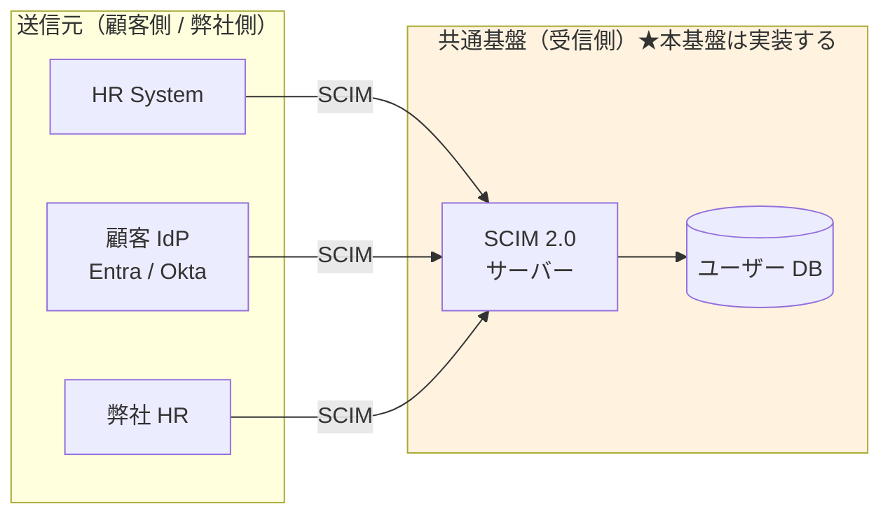

#### 「全部 SCIM 強制」ではなく「全部 SCIM 可能」アプローチ

| アプローチ | 共通基盤側 | 顧客側 | 採用判断 |
|---|---|---|:---:|
| **A. 全顧客 SCIM 強制** | SCIM 実装必須 | 全顧客に SCIM 対応 IdP / 上位ライセンス強制 | ❌ 顧客取得幅が狭まる |
| **B. SCIM 不採用、JIT のみ** | 実装不要 | なし | ⚠ GDPR / 退職 deprovisioning リスク |
| **C. SCIM 受信実装 + 顧客選択**（**採用**） | **実装する** | 利用可否は顧客選択 | ✅ **柔軟性最大** |

→ C 案採用により、**SCIM 対応顧客には自動化メリットを提供しつつ、SCIM 未対応顧客も取り込める**バランスを実現。

#### 顧客への QA 4 段階フロー

顧客の SCIM 採用可否を判定する標準質問:

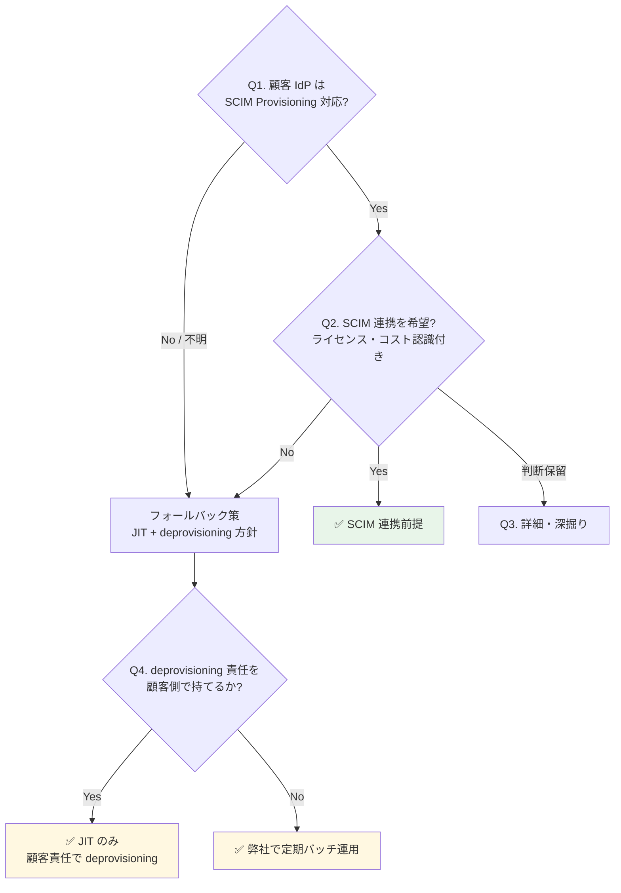

| Q# | 質問 | 期待回答 |
|:---:|---|---|
| **Q1（基本）** | 顧客 IdP は SCIM 2.0 Provisioning に対応していますか?（Entra Premium P1+ / Okta 全プラン / Google Cloud Identity Premium 等は標準対応）| Yes / No / 不明 |
| **Q2（採用意思）** | SCIM 連携を採用希望されますか?（顧客側で SCIM 設定 + IdP 上位ライセンスが必要）| 採用 / 採用しない / 保留 |
| **Q3（詳細）** | 利用中の IdP 製品とライセンス / HR システムと IdP の連携状況 / 入退社フローの現状 | 製品名 + 詳細 |
| **Q4（Fallback）** | SCIM 不採用の場合、退職者の deprovisioning 責任を顧客側で持てますか? | 顧客責任 / 弊社サポート希望 |

#### 顧客の回答による運用パターン

| 回答パターン | 共通基盤側の運用 | リスク |
|---|---|---|
| **Q1 Yes + Q2 採用** | SCIM 自動同期（推奨パターン）| 最小 |
| **Q1 Yes + Q2 採用しない** | JIT のみ + **契約で deprovisioning 責任を顧客に明示** | 中（契約条件次第）|
| **Q1 No（IdP 未対応）** | JIT のみ + **弊社による定期バッチ deprovisioning** を提案 | 中（弊社運用コスト微増）|
| **Q1 No（IdP なし、ローカル）** | ローカル + 手動 + セルフサービス（[§FR-1.2.0.0](01-auth.md) β/α シナリオ）| 状況次第 |

### 業界の現在地

**SCIM 2.0 が業界標準化（2026）**:
- Microsoft Entra が SCIM 2.0 API を GA 化（2026 年）
- **コスト効果**: 手動 $28/user → 自動 $3.50/user（87% 削減）
- **ユーザー価値**: SCIM 採用組織は 90 日でアクティブユーザー数が SAML-only より多い
- **限界**: IT チームの 75-85% の SaaS で依然手動運用

**プロビジョニング方式の使い分け**:
- **JIT**: 初回 SSO 時の自動作成（[§FR-2.2.1](02-federation.md#321-jit-プロビジョニング--fr-fed-008)）
- **SCIM 2.0**: ライフサイクル全体（退職時の即時 deprovision 含む）
- **バルクインポート**: 初期移行・大量投入
- **管理者強制操作**: パスワードリセット、即時無効化

### 我々のスタンス（基本方針に基づく）

| 基本方針の柱 | プロビジョニングでの実現 |
|---|---|
| **絶対安全** | 退職時の SCIM deprovision で即時アクセス遮断 |
| **どんなアプリでも** | SCIM 2.0 標準準拠で IdP 側からの自動連携可 |
| **効率よく** | JIT + SCIM ハイブリッド（日常 JIT、大量変更時 SCIM）|
| **運用負荷・コスト最小** | 自動化で手動 $28/user → $3.50/user |

### 対応能力マトリクス

| 機能 | Cognito | Keycloak (OSS/RHBK) | 備考 |
|---|:---:|:---:|---|
| JIT プロビジョニング | ✅ | ✅ | [§FR-2.2.1](02-federation.md#321-jit-プロビジョニング--fr-fed-008) |
| **SCIM 2.0**（IdP からの自動連携）| ⚠ **ネイティブ非対応**（自前 Lambda 実装要）| ✅ **プラグイン対応**（標準的） | 大きな差 |
| バルクインポート（CSV / JSON）| ✅ ImportUsers | ✅ Realm Import | 両方 |
| 管理者によるパスワード強制リセット | ✅ AdminSetUserPassword | ✅ Admin Console | 両方標準 |
| 退職時の Deprovision | ⚠ 個別実装（SCIM ない）| ✅ SCIM 経由 | エンタープライズ要件で大差 |
| 監査ログ（プロビ・デプロビ）| ✅ CloudTrail | ⚠ Event Listener | Cognito が楽 |

→ **SCIM 2.0 受信機能は本基盤で実装（§FR-7.4.0.A スタンス）**。Cognito 採用時は Lambda 自前実装、Keycloak 採用時はプラグイン採用で対応。

### ベースライン

| 項目 | ベースライン |
|---|---|
| JIT プロビジョニング | **Must**（[§FR-2.2.1](02-federation.md#321-jit-プロビジョニング--fr-fed-008)）|
| **SCIM 2.0 受信機能（共通基盤側実装）** | **Must**（§FR-7.4.0.A スタンス、Cognito 採用時は Lambda 実装、Keycloak は plugin） |
| SCIM 2.0 連携（顧客側）| **Should**（顧客の IdP 対応 / 採用意思次第）|
| バルクインポート | **Should**（初期移行用 / SCIM 未対応顧客のフォールバック）|
| 管理者強制操作 | **Must** |
| 退職時 deprovision SLA | 即時〜24 時間（SCIM 採用顧客）/ 24 時間〜7 日（JIT のみ顧客、定期バッチ前提） |
| ハイブリッド方式 | **JIT（日常） + SCIM（大量変更 + deprovisioning）** が推奨 |

### TBD / 要確認

**A. 共通基盤側の方針（弊社で決定する）**

| 確認項目 | 回答例 |
|---|---|
| SCIM 受信機能の実装スコープ | **全カテゴリ受け入れ可能な汎用 SCIM サーバー**（推奨）/ 限定スコープ |
| 認証方式（SCIM Token）| OAuth Bearer Token（顧客テナント別に発行）|
| 監査ログ範囲 | 全 SCIM 操作（CRUD）を CloudWatch / Audit Log |
| エラーハンドリング | 失敗時のリトライ / Dead Letter Queue / 顧客通知 |

**B. 顧客個別の確認事項（[§FR-7.4.0](#fr-740-scim-の位置づけと本基盤のスタンス) Q1〜Q4）**

| 確認項目 | 回答例 |
|---|---|
| **Q1: 顧客 IdP の SCIM Provisioning 対応** | Entra ID P1+ / Okta / Google Cloud Identity Premium / HENNGE One / 自社製 / なし / 不明 |
| **Q2: SCIM 連携採用意思**（顧客側のライセンス・設定コストを認識した上で）| 採用希望 / 採用しない / 判断保留 |
| **Q3（詳細）**: 顧客 HR と IdP の連携状況、入退社フロー | 顧客内部の現状 |
| **Q4（Fallback）**: SCIM 不採用時の退職者 deprovisioning 責任所在 | 顧客責任 / 弊社で定期バッチ運用 |

**C. 規模 / SLA 関連**

| 確認項目 | 回答例 |
|---|---|
| バルクインポート規模 | 初期 N 件 / 月次 M 件 / 不要 |
| 退職時 deprovision SLA | 即時 / 24 時間以内 / 7 日以内 |
| 顧客全体での SCIM 採用見込み比率 | 90%+ / 50-90% / <50% |
| プラットフォーム選定への影響 | **SCIM 受信実装 Must 化により Cognito でも Lambda 実装で対応可、ただし Keycloak がやや有利**（[§C-2.2](../common/02-platform.md)）|

### §FR-7.4.5 混在環境の認証/プロビジョニング フロー（顧客 IdP 別の SCIM 対応差）

> **本サブセクションで定めること**: §FR-7.4.0.A の「**全部 SCIM 可能**」スタンスの結果、**同一基盤に SCIM 採用顧客と非採用顧客が同居**することになる。両者が同一基盤内でどう振る舞うか、認証/プロビジョニング のシーケンスを **5 パターン** で図解する。
> **主な判断軸**: 顧客 IdP の SCIM 対応 / 顧客側の SCIM 採用意思 / 既存ユーザーの存在 / 退職反映 SLA
> **§FR-7.4 全体との関係**: §FR-7.4.0 が「**いつ・誰が・どう使うか**」のスタンス、本サブセクションは「**実際の動作シーケンス**」を補完

#### 混在パターンの 3 分類

| 顧客タイプ | 想定 IdP | SCIM 連携 | JIT 動作 | 主用途 |
|---|---|:-:|:-:|---|
| **タイプ A: SCIM 採用** | Entra ID P1+ / Okta / HENNGE / Google Workspace Premium | ✅ Push 受信 | ✅ 補完（SCIM 非対象ユーザーをカバー）| 大口顧客 / 規制業種 / 退職 SLA 厳格 |
| **タイプ B: JIT のみ** | ADFS / 独自 IdP / Google Workspace Free | ❌ なし | ✅ メイン | 中小規模 / レガシー IdP / コスト重視 |
| **タイプ C: 移行期混在** | 同一テナント内で SCIM 採用前後 | △ 段階的 | ✅ 常時 | 移行中（→ §FR-7.4.7）|

→ **共通基盤は 3 タイプを同時に収容**（テナント別設定で実現）。

#### シーケンス 1: タイプ A SCIM 採用顧客 — 事前作成 → 初回ログイン

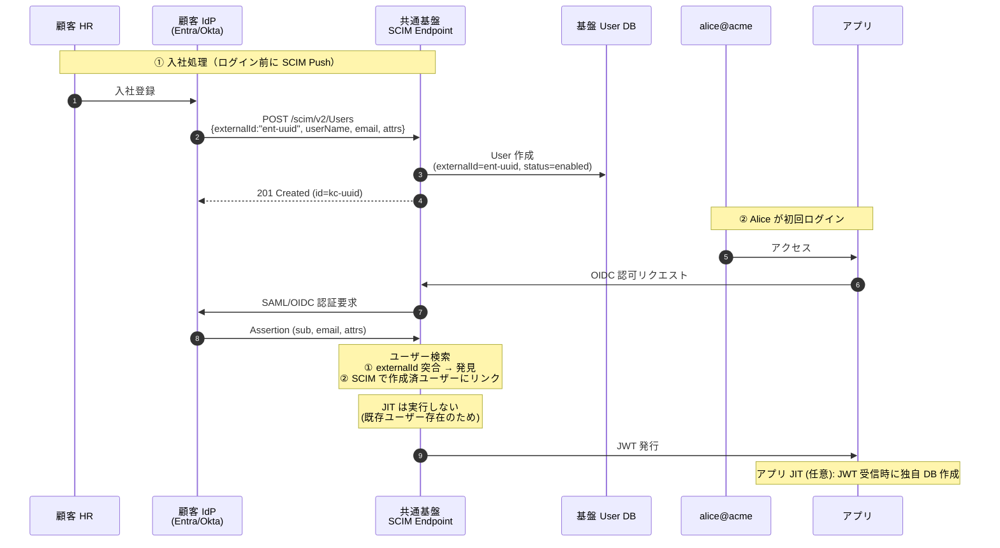

→ **SCIM 採用顧客では「JIT による新規作成」は走らない**、既存ユーザーへの**リンクのみ**実行。

#### シーケンス 2: タイプ B JIT のみ顧客 — 初回ログイン時に新規作成

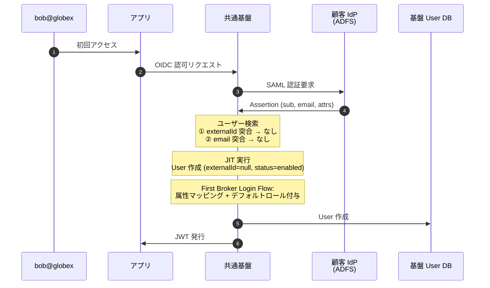

→ SCIM 非対応顧客では **JIT が主用途**、`externalId` は **null** のまま保持。

#### シーケンス 3: タイプ A の Mover（異動） — SCIM PATCH で属性更新

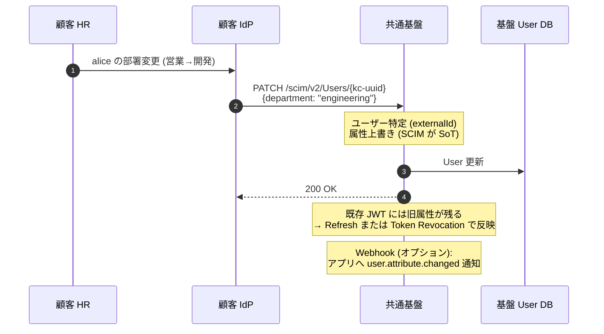

→ **SCIM が Source of Truth**、基盤側で属性手動編集は**上書きされる**設計（[§FR-7.4.6](#fr-746-同期競合の解決ルール) 参照）。

#### シーケンス 4: タイプ A の Leaver（退職） — SCIM DELETE で即時遮断

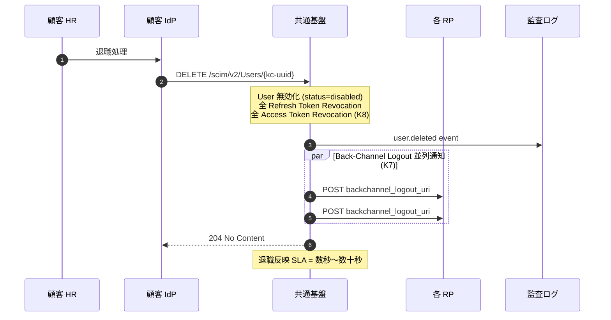

→ **タイプ A の最大価値**: 退職時の即時アクセス遮断（[§5.3 / §6.8](../powerpoint-outline-and-references.md) 連動）。

#### シーケンス 5: タイプ B の Leaver — JIT のみでの deprovisioning（限界あり）

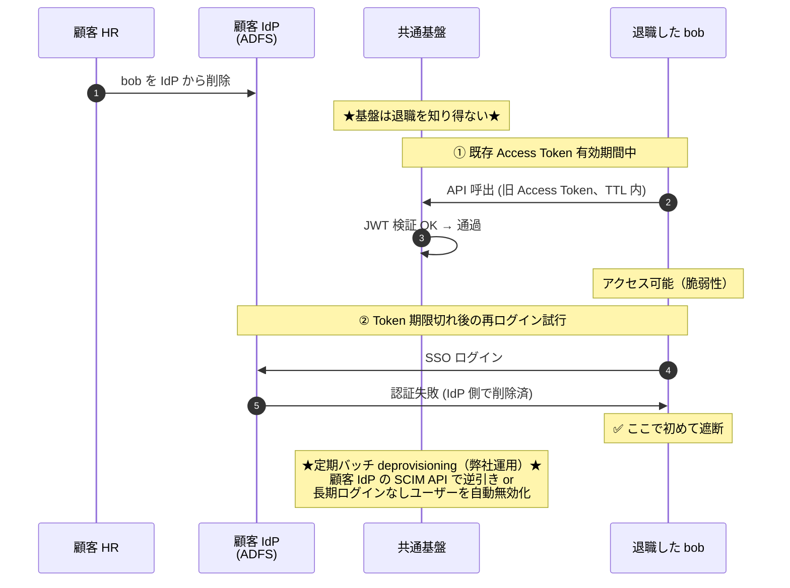

→ **タイプ B の弱点**: 退職反映が「**次回ログイン拒否**」までかかる。SLA 厳格な場合は**契約で deprovisioning 責任を顧客に明示**するか、**弊社による定期バッチ運用** で補完（[§FR-7.4.0 Q4](#顧客への-qa-4-段階フロー) 参照）。

> **⚠ 重要な含意（2026-06-08 追加）**: シーケンス 4（SCIM DELETE）の「**User 無効化**」と シーケンス 5（JIT 顧客 IdP 削除）の「**Keycloak 関知せず**」は、ともに **Keycloak DB のレコード自体は残る** ことを意味する。物理削除と論理削除（無効化）の使い分けは [§FR-7.4.6 末尾の保持・削除マトリクス](#fr-746-同期競合の解決ルールscim-vs-jitsource-of-truth-ポリシー) 参照。JIT のみ顧客のゴーストユーザー問題は [§FR-7.4.7 末尾の定期バッチ deprovisioning](#fr-747-段階移行運用jit--scim-追加既存ユーザーマージ) で対応。

#### 全体図: 混在テナントの収容

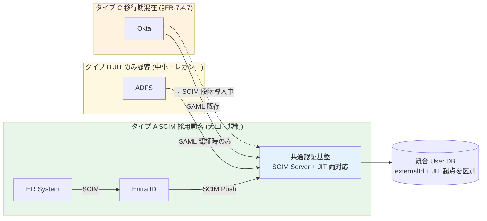

### §FR-7.4.6 同期競合の解決ルール（SCIM vs JIT、Source of Truth ポリシー）

> **本サブセクションで定めること**: 混在環境で **同一ユーザーが SCIM と JIT 両方で接触される** ケースの動作と、属性食い違いの解決優先順位。
> **主な判断軸**: Source of Truth 設計（IdP vs 基盤 vs アプリ）、Keycloak Sync Mode 選択
> **§FR-7.4 全体との関係**: §FR-7.4.5 のシーケンスで「Alice が SCIM 事前作成済 + JIT ログイン」「Bob が JIT 作成済 + 後から SCIM Push」が発生 → 本節で解決ルール定義

#### ユーザー突合のキー優先順位

ログイン時 / SCIM 受信時の **ユーザー検索キー優先順位**:

```
1. externalId (SCIM 由来) ★最優先
2. email (検証済み email_verified=true のみ)
3. username (Realm 固有のローカル識別子)
   ↓ いずれも該当なし
4. JIT 新規作成 or SCIM POST
```

| 検索キー | 使用場面 | 優先度 | 注意点 |
|---|---|:-:|---|
| **externalId** | SCIM 採用顧客の SCIM Push 時 / SCIM 後の JIT ログイン時 | ⭐ 最優先 | IdP 側の不変 ID（Entra `objectId` / Okta `id`）必須 |
| **email** | JIT のみ顧客の SAML/OIDC ログイン時 | ◯ | **email_verified=true** が前提（OWASP 推奨）|
| **username** | ローカル管理者 / Break Glass | △ | 顧客企業横断で衝突しない命名（`<tenant>:<user>`）|

#### 競合パターンと解決

##### パターン 1: SCIM 事前作成 → JIT 初回ログイン
```
SCIM POST: {externalId: "ent-uuid-001", email: alice@acme}
↓ ユーザー作成 (status=enabled, externalId=ent-uuid-001)

Alice が SAML ログイン (Assertion sub = ent-uuid-001)
↓ externalId 突合 → 既存ユーザー発見
↓ JIT 新規作成は実行しない
↓ 属性のみ Sync Mode に従って更新 / リンクのみ
```
→ **競合なし**、SCIM が先導し JIT は確認のみ。

##### パターン 2: JIT 既存 → 後から SCIM Push（タイプ C 移行期）

```
Bob が JIT で作成済 (externalId=null, email=bob@globex)
↓ 半年後、顧客が SCIM 導入

SCIM POST: {externalId: "ent-uuid-002", email: bob@globex}
↓ externalId 突合 → なし
↓ email 突合 → 発見 (email_verified=true 確認)
↓ 既存ユーザーに externalId 追加付与 (リンクのみ、データ保持)
```
→ **既存データは保持**、`externalId` 後付け付与のみ。`email_verified=false` なら衝突エラー → 管理者解決。

##### パターン 3: 属性食い違い（SCIM と JIT で値が違う）

例: SCIM Push で `department=engineering`、その後 IdP 側で SAML Assertion `department=sales`

| Keycloak Sync Mode | 動作 | Source of Truth | 推奨用途 |
|---|---|---|:-:|
| **IMPORT**（初回のみ）| JIT 初回作成時のみ反映、以降は基盤側で管理 | 基盤側 | △ セルフサービス重視 |
| **LEGACY**（都度上書き）| 都度 IdP 値で上書き、基盤側編集不可 | IdP 側 | △ |
| **FORCE**（毎回強制）| 毎回 IdP 値で強制上書き、基盤側編集も上書き | IdP 側 | **★ 本基盤推奨**（SCIM 採用顧客向け）|

**本基盤のデフォルト方針**:
- **タイプ A（SCIM 採用）= FORCE モード**（SCIM/IdP が SoT）
- **タイプ B（JIT のみ）= IMPORT モード**（初回のみ、以降は基盤側でセルフサービス）
- **属性別の細粒度設定も可能**（email = FORCE、display_name = IMPORT 等）

#### 重複検出時の挙動（OWASP 推奨パターン）

| 状況 | 挙動 |
|---|---|
| externalId 一致 + email 不一致 | externalId 優先、email は新値で上書き or 警告 |
| externalId なし + email 一致 + email_verified=true | 既存ユーザーリンク（externalId 後付け）|
| externalId なし + email 一致 + email_verified=false | **エラー**、管理者手動解決 |
| 全キー不一致 | 新規 JIT 作成 / SCIM POST |
| 同一 email が複数ユーザーで存在 | **設計エラー**、Realm 設定見直し |

詳細は [§FR-2.2.1.A 同一テナント内ユーザー重複](02-federation.md#fr-2-2-1-a-同一テナント内ユーザー重複) と整合。

#### Keycloak User DB 保持・削除マトリクス（JIT/SCIM × 論理/物理）

> **重要**: 「ユーザーを削除する」には **論理削除（`enabled=false`）** と **物理削除（レコード INSERT 取消）** の 2 種類があり、業界標準は **論理削除**。Keycloak User DB のレコードは多くのケースで残る。

| ケース | `user_entity` レコード | `enabled` | Token Revocation | DB クリーンアップ責務 |
|---|:-:|:-:|:-:|---|
| **JIT 顧客 IdP 削除（基盤に通知なし）** | ✅ 残る | **true のまま** | ❌ なし | **基盤側の定期バッチで対応必須**（→ §FR-7.4.7 末尾）|
| **JIT 定期バッチ削除**（弊社運用、推奨）| ⚠ 設定次第 | false → 物理削除 | 連動 | バッチで実施 |
| **SCIM DELETE 受信**（デフォルト動作）| ✅ 残る | **false に変更（論理削除）** | ✅ 自動連動 | 不要（無効化で十分）|
| **SCIM DELETE + Hard Delete 設定** | ❌ 物理削除 | - | ✅ | 不要 |
| **管理者の手動 Hard Delete** | ❌ 物理削除 | - | ⚠ 手動連動必要 | 不要 |
| **GDPR Article 17 Erasure 要求** | ❌ 物理削除 or **匿名化** | - | ✅ | 法的義務 |
| **テナント解約（Realm 削除）** | ❌ 全消失 | - | - | - |
| **N 年経過後の保管期間終了** | ❌ 物理削除（バッチ）| - | - | 法的保持期間（PCI DSS 1年 / 金融 7年 等）後 |

#### 論理削除 vs 物理削除の判断基準

| 観点 | **論理削除推奨** | **物理削除推奨** |
|---|---|---|
| **典型タイミング** | 退職・無効化（即時遮断目的）| 法的保持期間経過後 / GDPR Erasure |
| **監査ログとの紐付け** | ✅ 維持される | ⚠ 匿名化が必要 |
| **復職時の復旧** | ✅ 簡単（`enabled=true` 戻すだけ）| ❌ 再作成必要 |
| **業務データへの参照**（アプリ DB の `kc_sub` FK）| ✅ 維持 | ⚠ 切れる、別途処理必要 |
| **SOC2 / ISO27001 / PCI DSS / FISC 監査** | ✅ 「アクセス取消の検証可能性」を満たす | ⚠ 監査ログ匿名化必須 |
| **GDPR Article 17 適合**（権利請求時のみ）| ⚠ 不適合 | ✅ 適合 |
| **GDPR Article 17.3 例外**（法的義務）| ✅ 適合 | - |
| **DB 性能**（蓄積長期化）| ⚠ 数年で肥大化 | ✅ 軽量 |

**本基盤の推奨ポリシー**:
- **第 1 段階（即時）**: 論理削除（`enabled=false` + Token Revocation）→ 業務遮断完了
- **第 2 段階（法的保持期間経過後）**: 定期バッチで物理削除 or 匿名化（PCI DSS = 1 年 / 一般 = 7 年）
- **GDPR Erasure 要求時のみ**: 即時物理削除 + 監査ログ匿名化（§7.4 Privacy 連動）

### §FR-7.4.7 段階移行運用（JIT → SCIM 追加、既存ユーザーマージ）

> **本サブセクションで定めること**: 顧客が「**最初 JIT のみ → 半年後 SCIM 導入**」する移行期の運用手順と既存ユーザーマージ方法。
> **主な判断軸**: 既存 JIT ユーザーの突合キー、移行期の重複防止、ロールバック容易性
> **§FR-7.4 全体との関係**: §FR-7.4.5 タイプ C（移行期混在）の具体的運用手順を定義

#### 移行シナリオの典型

```
時系列:
├─ Day 0 (顧客契約): JIT のみで運用開始
│   └─ Bob / Carol / Dave が JIT で作成（externalId=null）
├─ Month 6 (顧客側 SCIM 導入決定): 移行計画開始
└─ Month 7 (SCIM 連携開始): 既存ユーザーのマージ + 新規は SCIM 主導
```

#### 推奨移行手順（3 ステップ）

##### Step 1: 事前準備（顧客側 IdP の SCIM 設定）

| 作業 | 担当 | 内容 |
|---|---|---|
| 顧客 IdP の SCIM 機能有効化 | 顧客情シス | Entra: Enterprise App 追加 / Okta: SCIM Provisioning 設定 |
| 共通基盤の SCIM Token 発行 | 弊社 | テナント別 Bearer Token、Vault 保管 |
| Attribute Mapping 設計 | 双方 | IdP 属性 → 基盤属性 / `externalId` ソース確定（Entra `objectId` 等）|
| **テスト用ダミー Push** | 双方 | 1 ユーザーで動作確認、突合・競合ルール検証 |

##### Step 2: 既存ユーザーマージ（最重要）

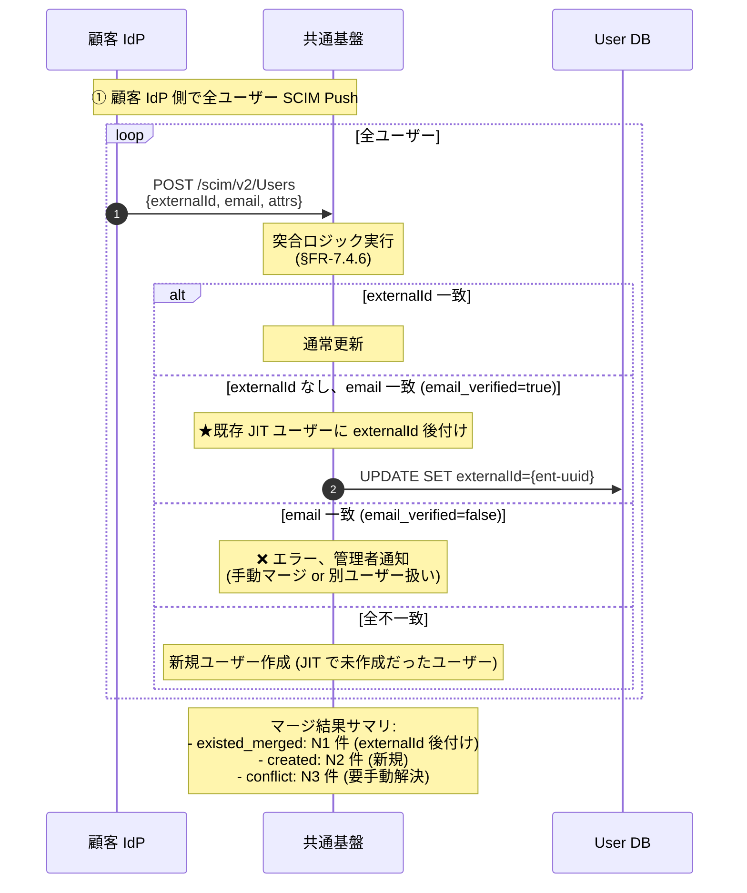

**移行前後の状態**:

| 状態 | externalId | email_verified | 同期方向 | Sync Mode |
|---|:-:|:-:|---|---|
| **移行前**（JIT のみ）| null | true / false 混在 | IdP → 基盤（ログイン時のみ）| IMPORT |
| **移行後**（SCIM 採用）| ent-uuid 付与済 | **true 必須** | IdP → 基盤（SCIM Push + ログイン）| FORCE |

##### Step 3: 切替後の運用切り替え

| 設定 | 移行前 | 移行後 |
|---|---|---|
| 顧客 IdP の SCIM Provisioning | OFF | **ON** |
| Sync Mode | IMPORT | **FORCE** |
| 退職反映 | 次回ログイン時拒否 | **数秒〜数十秒（SCIM DELETE）**|
| Deprovisioning 責任 | 顧客側 / 定期バッチ | **SCIM Push 経由で自動**|
| 監査ログ | ログインイベントのみ | **SCIM 全操作 + ログインイベント**|

#### 移行期の重複防止策

| リスク | 対策 |
|---|---|
| **email_verified=false な既存 JIT ユーザー多数** | 移行前にメール検証キャンペーン実施（リマインドメール送信、未検証ユーザーに promptly 警告）|
| **顧客 IdP 側のメール変更で突合不能** | externalId 後付け前に IdP 側で email 整合性確認、Excel 突合表で事前検証 |
| **マージ中の新規ログインで重複ユーザー作成** | Step 2 実行中は新規 JIT を一時無効化（Realm 設定 or Maintenance Mode）|
| **マージ失敗の手動解決負担** | 移行ツール（kcadm.sh + SCIM API ラッパー）でバッチ実行、サマリレポート生成 |

#### ロールバック可能性

| 問題 | ロールバック |
|---|---|
| SCIM Push 障害 | 顧客 IdP 側で SCIM Provisioning OFF → JIT のみ運用に戻る |
| マージ失敗 | externalId 後付けを `UPDATE SET externalId=null` で削除（JIT のみ状態に戻る、データ保持）|
| 完全失敗 | 全 externalId 削除 + Sync Mode を IMPORT に戻す（5 分作業）|

→ **段階移行は逆方向にも戻せる**設計、リスクは限定的。

#### JIT のみ顧客向け定期バッチ deprovisioning 設計（Should、§FR-7.4.0 Q4 Fallback 実装）

> **本セクションの位置付け**: §FR-7.4.5 シーケンス 5 で示した「JIT のみでは退職を基盤が知り得ない」問題と、§FR-7.4.6 で示した「Keycloak DB レコードが残り続ける」問題への運用解決策。

**目的**:
- ゴーストユーザー（Keycloak DB に残った退職者）の蓄積防止
- 過去 Token の再利用防止（既に Refresh 失効していても監査上の懸念）
- PCI DSS 8.2.6（90 日未使用無効化）等のコンプラ対応（→ §FR-7.4.8）

**バッチ方式の選択肢**:

| 方式 | 動作 | コスト | 精度 |
|---|---|---|:-:|
| **A. 最終ログイン基準**（推奨）| N 日（例 90 日）以上ログインしないユーザーを `enabled=false` | ◯ 軽量 | ◯ |
| **B. 顧客 IdP 逆引き**（高精度）| 顧客 IdP API でユーザー一覧取得 → 突合 → 不在ユーザーを無効化 | ⚠ 顧客 IdP 側 API 必要 | ✅ 最高 |
| **C. 契約終了通知ベース** | 顧客側からの通知 + 弊社サポートで手動 | ◯ | △ 顧客次第 |

**推奨運用シナリオ**:

```
Day 0: 顧客 IdP で退職処理（基盤は関知せず）
↓
Day 30-90: 退職者の Token が全 TTL 期限切れ（Refresh Token 90 日想定）
       → 次回ログイン試行 = 顧客 IdP 側で認証失敗
↓
Day 90: 弊社定期バッチ実行（毎週 or 毎月）
       → 90 日未ログインユーザーを抽出
       → 自動 `enabled=false`（論理削除）
       → 監査ログ送出（user.batch.disabled）
↓
Year N+: 法的保持期間経過後、物理削除 or 匿名化（§FR-7.4.6 ポリシー）
```

**バッチ実装ガイドライン**:

| 項目 | 推奨設定 |
|---|---|
| **未ログイン閾値** | 90 日（PCI DSS 8.2.6 と整合）/ 30 日（より厳格な場合）|
| **実行頻度** | 週次 or 月次（リソース消費とのトレードオフ）|
| **対象除外** | サービスアカウント / 管理者ロール / B2C ユーザー（別ポリシー）|
| **通知** | 無効化 7 日前にユーザー or 管理者へ通知（誤無効化防止）|
| **監査ログ** | 全無効化操作を CloudWatch Logs / SIEM 連携 |
| **ロールバック** | 無効化後 30 日は `enabled=true` 戻しで復活可能（論理削除のため）|

**Keycloak 実装の詳細**は [common/jit-scim-coexistence-keycloak.md §10](../../../common/jit-scim-coexistence-keycloak.md) 参照（kcadm.sh + バッチスクリプト例）。

### §FR-7.4.8 PCI DSS / APPI 適合性整理（コンプライアンス要件と JIT/SCIM 選定）

> **本サブセクションで定めること**: 認証基盤の代表的コンプライアンス要件である **PCI DSS v4.0**（カード会員データ保護）と **APPI**（日本個人情報保護法）に対し、JIT のみ / SCIM 併用の各方式がどの程度適合するか、必要な追加対策は何かを整理。
> **主な判断軸**: PCI DSS Requirement 8（識別・認証）/ APPI 法 23 条（安全管理措置）/ 法 22 条（不要保持禁止）
> **§FR-7.4 全体との関係**: §FR-7.4.0 のスタンス（全部 SCIM 可能）と §FR-7.4.7 の定期バッチを実装上の前提として、コンプライアンス観点から再評価

#### PCI DSS v4.0 (v4.0.1, 2025) の認証基盤関連要件

**適用範囲**: 認証基盤が **カード会員データ環境（CDE）への認証経路** となる場合、Requirement 8 が直接適用。CDE 外なら間接的な参考要件。

| Requirement | 内容 | JIT のみ | SCIM 併用 |
|---|---|:-:|:-:|
| **8.2.1** | ユーザー識別子の一意性 | ✅ `sub` で保証 | ✅ |
| **8.2.2** | 共有 ID 禁止 | ✅ | ✅ |
| **8.2.5** | **退職ユーザーのアクセス即時取消** | ❌ **困難**（基盤は退職を知り得ない）| ✅ **数秒〜数十秒** |
| **8.2.6** | **90 日未使用アカウント無効化** | ⚠ 定期バッチ必須（→ §FR-7.4.7 末尾）| ✅ 自動化容易 |
| **8.3** | MFA 必須（v4.0.1 で拡大）| ✅ §3.2 で対応、JIT/SCIM 独立 | ✅ |
| **8.5** | アクセスレビュー実施 | ⚠ ユーザー一覧が JIT 起点のみ、不完全 | ✅ SCIM 起点の完全な一覧で実施可 |
| **10.2** | 監査ログ | ✅ Event Listener SPI で対応 | ✅ |

**判定**:
- **CDE 内認証経路 = SCIM 併用が事実上必須**（8.2.5 即時取消、8.2.6 90 日無効化が JIT のみでは精度不足）
- **CDE 外 = JIT のみ + 定期バッチ deprovisioning（§FR-7.4.7）で許容範囲**

#### APPI（個人情報保護法、令和 4 年改正 + 2025 三年見直し）の関連要件

**適用範囲**: 本基盤は **個人データを取り扱う委託先**（事業者の従業員等の認証）として APPI の安全管理措置義務が及ぶ。

| 法/ガイドライン | 内容 | JIT のみ | SCIM 併用 |
|---|---|:-:|:-:|
| **法 23 条 / GL 通則編 10**（安全管理措置）| 適切なアクセス制御・識別・認証 | ⚠ 退職時即時遮断が困難 | ✅ |
| **法 22 条**（個人データの正確性確保・遅滞ない消去）| 利用する必要がなくなったときの遅滞ない消去（努力義務）| ⚠ Keycloak DB にゴースト残存（→ §FR-7.4.7 末尾の定期バッチで対応）| ✅ |
| **法 26 条**（漏えい等の報告）| 個人情報保護委員会への報告（速報 3〜5 日 / 確報 30 日、不正アクセス起因は確報 60 日）| ✅ 監査ログで対応 | ✅ |
| **法 25 条**（委託先の監督）| 委託元による本基盤の監督義務（規則第 7 条相当の安全管理措置）| ✅ SLA + 監査ログで対応 | ✅ |
| **法 33〜35 条**（開示・訂正等・利用停止等の請求）| 法定上限内対応 | ⚠ ユーザー一覧が不完全な可能性 | ✅ SCIM 起点で完全な一覧 |
| **2025 三年見直し動向** | 安全管理措置・委託先監督の重大事案多数指摘 | ⚠ リスク | ✅ |

> **条文番号の根拠（令和 4 年改正版 = 現行版）**:
> - 法第 22 条 = 個人データの正確性確保・遅滞ない消去（努力義務）
> - 法第 23 条 = 安全管理措置（PPC ガイドライン 通則編 §3-4-2）
> - 法第 24 条 = 従業者の監督（同 §3-4-3）
> - 法第 25 条 = 委託先の監督（同 §3-4-4）
> - 法第 26 条 = 漏えい等の報告（同 §3-5）。**速報 3〜5 日以内 / 確報 30 日以内**、規則第 7 条第 3 号（不正の目的をもって行われた行為起因）は **確報 60 日以内**
> - 法第 33 条 = 保有個人データの開示 / 法第 34 条 = 訂正等 / 法第 35 条 = 利用停止等（同 §3-8）

**判定**:
- **APPI 全般 = SCIM 推奨、JIT のみは「定期バッチ deprovisioning + 契約での deprovision 責任明示」で対応可**
- **権利請求対応（法 33〜35 条）= SCIM 採用顧客の方が応答速度が確実**

#### PCI DSS + APPI 両方準拠時の本基盤の方針

| 顧客タイプ | PCI DSS 適合 | APPI 適合 | 本基盤の対応 |
|---|:-:|:-:|---|
| **タイプ A**（SCIM 採用）| ✅ 直接適合 | ✅ 直接適合 | デフォルト構成で対応可、Phase Two SCIM + 全 Token Revocation 連動 |
| **タイプ B**（JIT のみ）| ⚠ 8.2.5/8.2.6 で条件付き | ⚠ 法 22 条で条件付き | **弊社による 90 日定期バッチ deprovisioning 必須**（§FR-7.4.7）+ 契約で deprovision 責任所在明示 |
| **タイプ C**（移行期）| ⚠ 移行完了まで条件付き | ⚠ 同左 | **移行を最短で完了**、移行期は契約上のリスク受容を顧客と合意 |

#### 顧客への提案アプローチ

**PCI DSS / APPI 適用範囲がある顧客への質問追加**（[§FR-7.4.0 顧客 QA 4 段階フロー](#顧客への-qa-4-段階フロー) に追加質問）:

| Q# | 質問 | 影響 |
|:-:|---|---|
| **Q5（コンプラ）**| **PCI DSS の CDE 範囲に本基盤を含むか?** | Yes → SCIM 強く推奨（8.2.5 適合）|
| **Q6（コンプラ）**| **APPI で個人情報保護委員会への定期報告対象か?** | Yes → SCIM 推奨（権利請求対応の確実性）|
| **Q7（責任）**| **JIT のみ採用時、退職者 deprovisioning 責任を顧客側で持てるか?** | No → SCIM 必須化 or 弊社定期バッチ前提 |
| **Q8（SLA）**| **退職時アクセス取消 SLA を契約で何分以内に設定したいか?** | 1 分以内 = SCIM 必須、24 時間以内 = JIT + 定期バッチ可 |

#### 業界実例（参考）

| ベンダー | PCI DSS / APPI 対応の認証基盤運用 |
|---|---|
| **Microsoft Entra**（PCI DSS Level 1）| SCIM 標準対応 + Conditional Access + CAE で即時遮断 |
| **Okta**（PCI DSS Level 1）| Lifecycle Management + Universal Logout で即時遮断 |
| **Auth0**（PCI DSS Level 1）| Automated Provisioning + Custom Token Exchange |
| **AWS IAM Identity Center** | SCIM + Force Logout API |

→ **業界主流の認証基盤は PCI DSS 準拠のため SCIM をネイティブ採用**。本基盤も同じ方向（[hook-architecture-keycloak.md §3.6 Phase Two SCIM](../../../common/hook-architecture-keycloak.md) 採用で対応）。

#### ベースライン（PCI DSS / APPI 両方準拠時）

| 項目 | ベースライン |
|---|---|
| **SCIM 2.0 受信機能（共通基盤側実装）** | **Must**（§FR-7.4.0.A スタンスと整合）|
| **退職時 deprovision SLA**（SCIM 採用顧客）| **即時〜数十秒**（PCI DSS 8.2.5、SCIM DELETE + Token Revocation 連動）|
| **退職時 deprovision SLA**（JIT のみ顧客）| **24 時間以内 + 弊社定期バッチ 90 日無効化**（PCI DSS 8.2.6）|
| **90 日未使用無効化** | **Must**（PCI DSS 8.2.6、§FR-7.4.7 末尾の定期バッチで実装）|
| **アクセスレビュー** | **Should**（PCI DSS 8.5、SCIM 採用顧客は完全な User 一覧取得可）|
| **MFA 全アクセス** | **Must**（§3.2 + PCI DSS 8.3.1）|
| **監査ログ完全保持** | **Must**（APPI 法 23 条 + PCI DSS 10.2、Event Listener SPI + Phase Two `keycloak-events`）|
| **権利請求対応 SLA**（APPI 法 33〜35 条 開示・訂正等・利用停止等）| **遅滞なく対応**（法定基準、ユーザー一覧取得が前提）|
| **物理削除 vs 論理削除のポリシー** | **§FR-7.4.6 末尾のポリシー**（即時 = 論理削除、法的保持期間後 = 物理削除）|

### §FR-7.4.9 SCIM 非対応 IdP 顧客への適合アプローチ（回避・受容パターン）

> **本サブセクションで定めること**: §FR-7.4.8 で示した PCI DSS 8.2.5（即時取消）への厳密適合は **SCIM 採用が前提**だが、**顧客 IdP が SCIM 非対応**（古い ADFS / 独自 IdP 等）の場合の回避・受容パターン 6 種と、それぞれの UX 影響・コスト・適合度を整理。
> **主な判断軸**: PCI DSS CDE 範囲含む / APPI のみ / UX 許容度 / 顧客 IdP API 可用性 / 営業上の制約
> **§FR-7.4 全体との関係**: §FR-7.4.8 のベースラインに対する **例外パターンの体系化**。本基盤の営業・設計判断の重要な選択肢を提供

#### 結論: 厳密適合は困難、Compensating Controls + 短命 Token で適合可能性あり

| 規格 | SCIM 非対応 IdP 顧客の適合性 |
|---|---|
| **PCI DSS 8.2.5（即時取消）** | ❌ 厳密適合は困難、**Compensating Controls（PCI DSS Appendix B）+ 短命 Token + 認証ログ逆引き** の組合せで QSA 承認下で適合可能 |
| **PCI DSS 8.2.6（90 日未使用無効化）** | ✅ §FR-7.4.7 定期バッチで適合可 |
| **APPI 法 22 条（遅滞ない消去）** | ✅ 「遅滞ない」= 24-72 時間〜数日（実務的解釈）、§FR-7.4.7 定期バッチで適合可 |
| **APPI 法 23 条（安全管理措置）** | ✅ 短命 Token + 監査ログ + 契約条項で適合可 |

#### 回避・受容パターン 6 種

| 案 | 内容 | 退職反映 SLA | UX 影響 | 適合度（PCI DSS）|
|:-:|---|---|:-:|:-:|
| **A. 短命 Token + Refresh Rotation** | Access TTL 5-15 分 + Refresh Rotation。Keycloak DB の `enabled` チェックを毎 Refresh で実行 | **TTL 分（5-15 分）** | ◯ Silent Refresh で軽微 | ⚠ Compensating 候補 |
| **B. 顧客 IdP からの Back-Channel Logout (BCL) 受信** | OIDC BCL (RFC 8417) で退職通知受信。SCIM 不要 | **数秒〜数十秒** | ✅ 影響ゼロ | ✅ 適合 |
| **C. 顧客 IdP 認証ログ逆引きバッチ** | 顧客 IdP の認証ログ API を定期取得、未認証ユーザーを推定 deprovisioning | **N 日（例 7 日）** | ✅ 影響ゼロ | ⚠ Compensating 候補 |
| **D. PCI DSS Compensating Controls 申請** | 案 A+C+ITDR を組合せて QSA に代替統制として申請 | 案 A+C による | 案 A による | ✅ **正式適合パス** |
| **E. CDE 範囲外運用（PCI 適用回避）** | 該当アプリを CDE 範囲外に出す（PSP 経由で決済委譲等）| - | ✅ | ✅ PCI 適用回避 |
| **F. 顧客 IdP アップグレード要求** | SCIM 対応 IdP（Entra P1+ / Okta 等）への変更を契約条件化 | SCIM 同等 | ✅ | ✅ 適合 |

#### 案 A: 短命 Token の UX 影響詳細（最重要、本基盤での主要選択肢）

> **業界トレンド**: RFC 9700 (2025) と Auth0 / Okta が「**短命 Access Token + Refresh Token Rotation**」を OAuth 2.0 Best Current Practice として確立。機密 API は 5-15 分、一般 API は 30-60 分が業界推奨。

##### UX 影響の段階別評価

| Access Token TTL | Silent Refresh 実装あり | Silent Refresh なし | 業界推奨対象 |
|---|---|---|---|
| **5 分** | ◯ わずかな遅延（~100ms） | ✕ 5 分ごと再ログイン（実質使用不能）| 金融 / 医療 / 政府（規制業種）|
| **15 分** | ✅ 影響ゼロ | ⚠ 15 分ごと再ログイン（大幅悪化）| **B2B SaaS 機密データ（PCI CDE 含む）**|
| **30 分** | ✅ 影響ゼロ | ◯ 30 分ごと（許容範囲）| B2B SaaS 一般 |
| **1 時間**（デフォルト）| ✅ 影響ゼロ | ✅ 1 時間ごと（許容）| **B2B SaaS デフォルト**（Cognito / Keycloak 既定）|
| **24 時間** | ✅ | ✅ | B2C / 低機密 |

##### UX 影響を決定する 7 つの要因

| # | 要因 | 影響内容 |
|:-:|---|---|
| 1 | **Silent Refresh の実装品質** | 適切な実装で UX 影響ゼロ、不適切だと突然の API 失敗 |
| 2 | **Refresh 時に IdP 再認証を強制するか** | ❌ `prompt=login` / `max_age=0` 強制 = 毎 TTL ごと再ログイン（致命的）<br/>✅ Keycloak DB の `enabled` チェックのみ = 影響ゼロ |
| 3 | **Refresh Token の TTL** | Refresh TTL が短い（8h 等）= 毎日朝一で再ログイン |
| 4 | **長時間タスク**（ファイル UP / レポート生成）| 5 分以上のタスクは Token 期限切れで失敗 → Web Worker / Background Job 化 |
| 5 | **Multi-Tab UX** | 全タブで Token 共有（BroadcastChannel / LocalStorage Sync）|
| 6 | **オフライン UX** | ネットワーク断中 Refresh 失敗 → Service Worker でリトライ |
| 7 | **MFA 再要求** | Refresh ごとに MFA = 大幅悪化（**通常は MFA 再要求しない**）|

##### 業界実装事例（Token TTL × UX）

| サービス | Access TTL | Refresh TTL | UX 戦略 |
|---|---|---|---|
| **Slack Enterprise Grid** | 30 分（アクティブ時延長）| 90 日 | Silent Refresh + アクティビティ検知 |
| **Notion** | 7 日 | 永続 | 長命 Token、機密度低 |
| **GitHub** | 8 時間 | 永続 | Sudo Mode で機微操作のみ再認証 |
| **Auth0**（IDaaS 製品）| 24 時間（デフォルト推奨 2 時間以下）| Rotation 推奨 | 業界標準を提示 |
| **Okta**（IDaaS 製品）| 1 時間（5 分〜24 時間）| Inactivity ベース | 最短 5 分まで設定可 |
| **Banking apps**（一般銀行アプリ）| 5-15 分 | 0 日（毎回再ログイン）| 安全性優先、UX 犠牲 |
| **Microsoft Entra**（デフォルト）| 1 時間 | 90 日 | CAE で即時取消、UX 維持 |

→ **B2B SaaS の業界中央値 = Access 30 分〜1 時間 + Refresh 30〜90 日 + Silent Refresh**。短命 5-15 分は **金融 / 医療 / PCI DSS CDE 範囲のみ** が業界実態。

##### 短命 Token と「即時取消」の関係（重要）

短命 Token = 「即時取消の近似手段」だが、**それだけでは退職時の遮断にならない**。以下の連動が必要:

```
[必要な連動チェーン]
1. 短命 Access Token (5-15 分)
   ↓ Token 期限切れ
2. クライアント → Refresh エンドポイントへ Refresh Token 提示
   ↓
3. ★Keycloak が User.enabled = true を確認★
   ↓ enabled なら
4. 新 Access Token 発行（5-15 分の遅延で取消可）

→ Keycloak DB の User.enabled が顧客 IdP の削除を反映する仕組みが必要
   = SCIM 受信 / BCL 受信 / 認証ログ逆引きバッチ（§FR-7.4.7）の **いずれか必須**
```

→ **「短命 Token だけで適合」は不可**、案 A は **案 B / C と組合せて初めて効果**。

##### 本基盤の推奨デフォルト設定

| 顧客タイプ | Access Token TTL | Refresh Token TTL | Silent Refresh | UX 評価 |
|---|---|---|:-:|:-:|
| **SCIM 対応**（業界標準）| 1 時間 | 30 日 + Rotation | ✅ | ✅ |
| **SCIM 非対応 + PCI DSS CDE 含む** | **15 分**（短命）| 24 時間 + Rotation | ✅ 必須 | ◯ |
| **SCIM 非対応 + APPI のみ** | 30 分〜1 時間 | 8-30 日 + Rotation | ✅ | ✅ |
| **業務系（社内ツール）** | 8 時間 | 30 日 | ✅ | ✅ |

#### 採用判断フロー（顧客ヒアリング時）

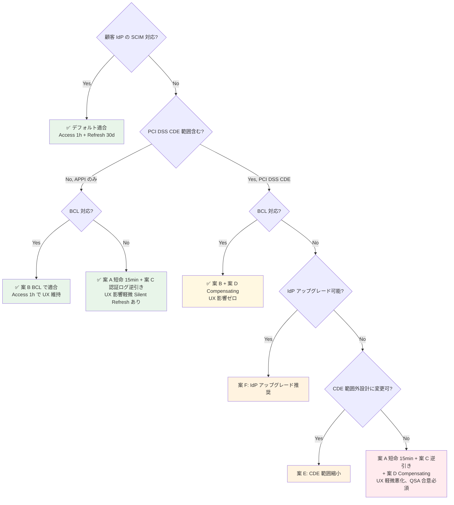

#### 顧客への QA 追加質問（§FR-7.4.0 の Q1-Q4 + §FR-7.4.8 の Q5-Q8 に続く Q9-Q12）

| Q# | 質問 | 影響 |
|:-:|---|---|
| **Q9** | 顧客 IdP は **Back-Channel Logout (RFC 8417)** に対応していますか? | Yes → 案 B 採用、SCIM なしで即時取消可 |
| **Q10** | 顧客 IdP の **認証ログ API** に弊社がアクセスする許可をいただけますか?（Microsoft Graph / Okta System Log / ADFS Event Log 等）| Yes → 案 C 採用、定期バッチで推定 deprovisioning |
| **Q11** | **Access Token TTL を 15 分に短縮**することで「即時取消」要件を近似する代替手段に同意いただけますか?（UX 影響: Silent Refresh で軽微）| Yes → 案 A 採用 |
| **Q12** | PCI DSS CDE 範囲含む場合、**Compensating Controls の QSA 申請**に協力いただけますか? | Yes → 案 D 採用、案 A+C+D の組合せで正式適合 |

#### 業界事例（SCIM 非対応 IdP への対応）

| サービス | SCIM 非対応 IdP 顧客への対応 |
|---|---|
| **Slack Enterprise Grid** | 案 A 短命 + 案 C 認証ログ逆引き + 案 F（Enterprise 契約時 IdP アップグレード推奨）|
| **Microsoft 365** | 案 B BCL + 案 F（顧客 IdP を Entra に統合誘導）|
| **Salesforce** | 案 A 短命 + 案 D Compensating Controls 申請 |
| **Auth0**（IDaaS）| 案 A 短命 TTL デフォルト + Anomaly Detection（ITDR 相当で異常検知）|
| **HENNGE One**（日本市場）| 案 A + SAML Single Logout 連携（BCL 類似）|

→ **業界主流は「案 A + 案 C + 案 D の組合せ」**、本基盤も同方向。

### §FR-7.4.10 発信プロビジョニング（基盤 → ServiceNow 等）

> **このサブセクションで定めること**: 顧客が **ServiceNow / Salesforce / Workday 等の SaaS** を業務利用しており、これらに**本基盤からユーザー情報を Push する**シナリオの方針。本サブセクションは特に ServiceNow ケースに焦点を当てる。   
> **§FR-7.4 内の位置付け**: §FR-7.4.1〜§FR-7.4.9 は **受信側 SCIM**（顧客 IdP → 本基盤）。本サブセクションは **発信側 SCIM / JIT**（本基盤 → SaaS SP）  
>
> **詳細は [ADR-023 ServiceNow SP 連携設計](../../../adr/023-servicenow-sp-integration.md) を参照**

#### ベースライン

| 項目 | デフォルト |
|---|---|
| **第一推奨パターン** | **SAML JIT Provisioning**（ServiceNow が初回 SSO 時に自動作成）|
| 代替: SCIM Push | 大規模 / 運用統合志向のみ。ServiceNow の SCIM v2 Plugin 経由、**KB2599716 リスク承知の自前実装** |
| 識別子 | ServiceNow `user_name` = Layer B `external_id`（[ADR-018](../../../adr/018-user-identifier-3layer-emailless.md) と整合）|
| 退職時 | 本基盤で無効化 → SAML 認証拒否 → SN ログイン不能。SN レコードは残置が業界標準（履歴保持）|

#### TBD / 要確認

[B-SN-1〜8](../../hearing-checklist.md) を参照。詳細パターン比較は [ADR-023](../../../adr/023-servicenow-sp-integration.md)。

---

### 参考: Keycloak 実装目線の詳細

本サブセクション §FR-7.4.5 / §FR-7.4.6 / §FR-7.4.7 の **Keycloak 実装観点での詳細**（Identity Provider Mapper / First Broker Login Flow / Sync Mode 設定 / externalId 突合実装 / テナント別 SCIM 有効化）は **[doc/common/jit-scim-coexistence-keycloak.md](../../../common/jit-scim-coexistence-keycloak.md)** に集約。

---

### 参考資料（§FR-7 全体）

#### スタンス・データ最小化

- [GDPR Article 5 - Data Minimization](https://gdpr.eu/article-5-how-to-process-personal-data/)
- [GDPR Article 17 - Right to Erasure](https://gdpr.eu/article-17-right-to-be-forgotten/)
- [EDPB CEF 2025-2026 Erasure Enforcement](https://www.mccannfitzgerald.com/knowledge/data-privacy-and-cyber-risk/delete-and-disclose-edpb-cef-2025-2026)
- [Login.gov Privacy Impact Assessment 2026](https://www.gsa.gov/system/files/Login_PIA_(March_2026).pdf)
- [Privacy-By-Design in CIAM - SSOJet](https://ssojet.com/ciam-qna/privacy-by-design-in-ciam-architectures)

#### SCIM / プロビジョニング

- [Microsoft Entra SCIM 2.0 GA 発表 2026](https://techcommunity.microsoft.com/blog/microsoft-entra-blog/microsoft-entra-expands-scim-support-with-new-scim-2-0-apis-for-identity-lifecyc/4507465)
- [SCIM Provisioning Guide 2026 - WorkOS](https://workos.com/blog/best-scim-providers-for-automated-user-provisioning-in-2026)
- [SCIM Provisioning Explained - Security Boulevard 2026](https://securityboulevard.com/2026/01/scim-provisioning-explained-automating-user-lifecycle-management-with-sso/)
- [Right to Erasure Best Practices - Authgear](https://www.authgear.com/post/the-right-to-erasure-and-how-you-can-follow-it-for-your-apps)
