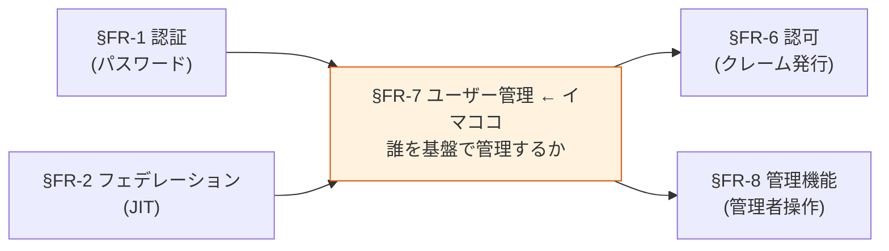
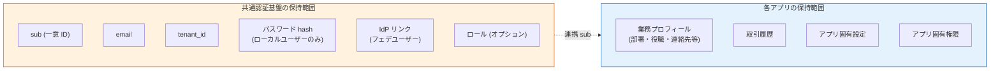
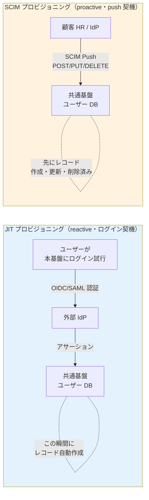
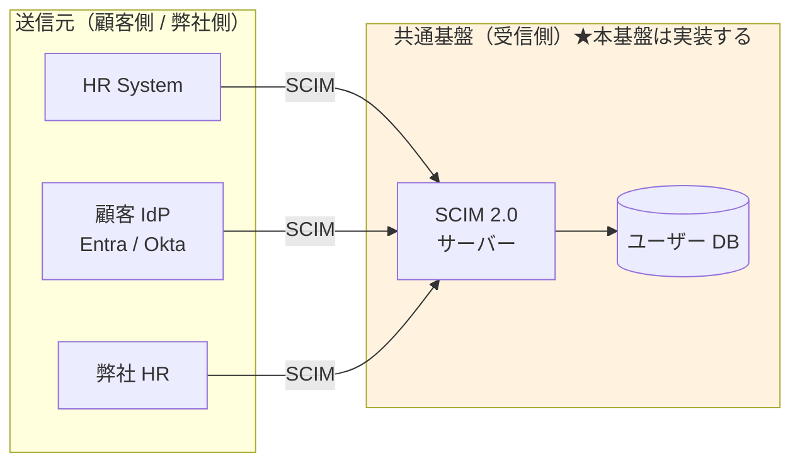
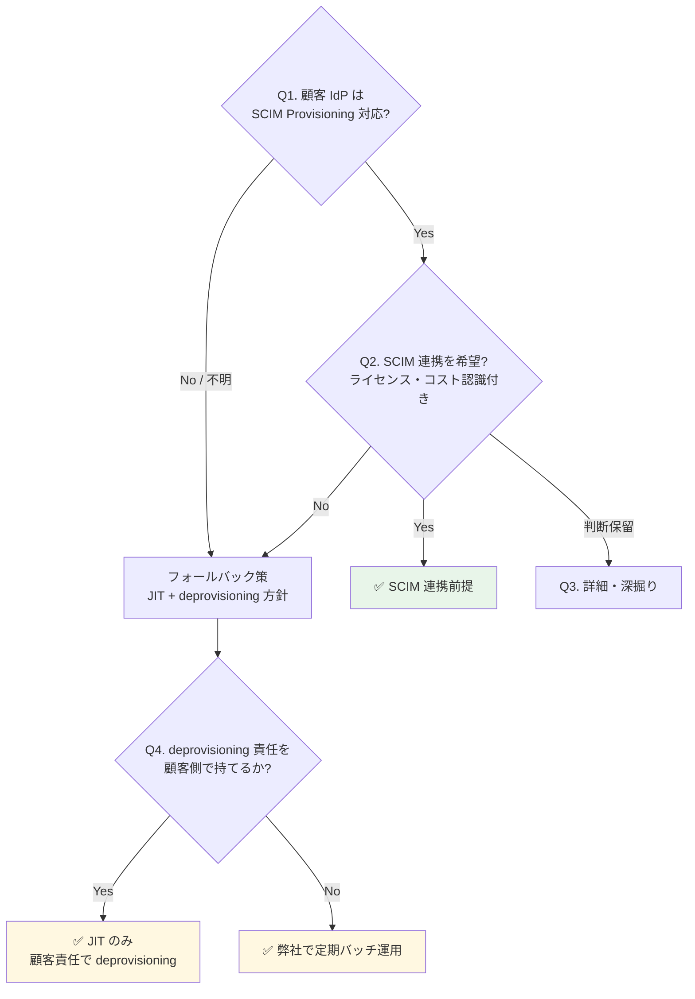

# §FR-7 ユーザー管理

> 上位 SSOT: [00-index.md](00-index.md)   
> 詳細: [../../functional-requirements.md §6 FR-USER](../../functional-requirements.md)   
> カバー範囲: FR-USER §6.1 CRUD / §6.2 属性ロール / §6.3 セルフサービス / §6.4 プロビジョニング

---

## §FR-7.0 前提と背景

### 用語整理

| 用語 | 本基盤での意味 |
|---|---|
| **ローカルユーザー** | 本基盤の User DB に直接登録されたユーザー（パスワード認証 or 招待ベース）|
| **フェデユーザー** | 外部 IdP（Entra ID / Okta 等）から JIT で本基盤に作成されたユーザー（[§FR-2.2.1 JIT](02-federation.md#321-jit-プロビジョニング--fr-fed-008)）|
| **CRUD** | Create / Read / Update / Delete の基本ユーザー操作 |
| **SCIM 2.0**（System for Cross-domain Identity Management）| ユーザーライフサイクル自動化の業界標準プロトコル |
| **JIT プロビジョニング** | SSO 初回ログイン時の自動ユーザー作成（[§FR-2.2.1](02-federation.md#321-jit-プロビジョニング--fr-fed-008)）|
| **データ最小化（Data Minimization）** | GDPR / 個人情報保護法の基本原則。必要最小限の属性のみ保持 |
| **Right to Erasure（忘れられる権利）** | GDPR Article 17。30 日以内の削除応答義務 |

### なぜここ（§FR-7）で決めるか

**[§FR-6](06-authz.md) で「認証基盤は最小限」のスタンスを採用**した。それは認可だけでなく、**ユーザー管理の範囲（=基盤で何を保持するか）にも同じ原則が適用される**。本章で「基盤が持つユーザー情報の範囲」と「各アプリが持つユーザー情報の範囲」の責務分界を明確化する。

### §FR-7.0.A 本基盤のユーザー管理スタンス（§FR-6 と整合）

> **本基盤は「認証に必要な最小限のユーザー情報」のみを保持。業務固有のユーザー情報（プロフィール詳細・取引履歴・部署移動履歴等）は各アプリ側で管理する。**

### 管理対象ユーザーのカテゴリ（[§FR-1.2.0.0](01-auth.md#fr-1200-ローカルユーザーとは何か--利用者カテゴリ別の分析) と連動）

本章で扱う「ユーザー」は **利用者カテゴリ P-1〜P-6 すべてを含む**が、CRUD 規模や運用主体はカテゴリ・採用シナリオ次第で大きく変わる:

| カテゴリ | 保管場所 | CRUD 主体 | 規模目安（シナリオ γ）|
|---|---|---|---|
| **P-1 基盤運用管理者** | 共通基盤（弊社内 IdP フェデ + Break Glass 用最小ローカル）| 弊社運用 | 数〜数十名 |
| **P-2 テナント管理者** | 共通基盤（顧客 IdP フェデ or ローカル）| 弊社運用 or 顧客（委譲管理者）| 顧客数 × 数名 |
| **P-3 IdP あり顧客従業員** | 共通基盤（フェデユーザーレコード）| **顧客 IdP 側が真実**、本基盤は影**像のみ** | 顧客数 × 数百〜数千 |
| **P-4 IdP なし顧客従業員** | 共通基盤（ローカルユーザー）| 顧客（委譲管理者）| シナリオ次第（γ では原則ゼロ）|
| **P-5 ゲスト**, **P-6 B2C** | 共通基盤 | 招待者 or セルフ | 不定 |

→ **本章 §FR-7.1〜7.4 のベースライン値は「対象カテゴリ × 採用シナリオ」で変動**することに留意。特に **CRUD 頻度** と **セルフサービス対象** はカテゴリで分けて運用設計する（[§NFR-6.5](../nfr/06-operations.md) のユースケースに反映済）。

#### このスタンスの業界根拠

| 原則 | 出典 |
|---|---|
| **データ最小化（Data Minimization）** | GDPR Article 5(1)(c) / 個人情報保護法第 17 条 |
| **目的限定（Purpose Limitation）** | 同上、認証目的を超えた情報を基盤で持たない |
| **Privacy-by-Design** | GDPR Article 25、Login.gov 等の連邦政府ガイドラインも採用 |
| **2026 トレンド** | "Data minimization will evolve from purely legal obligation to scalability strategy" — 漏洩リスク低減 + 開発速度向上 |

### 共通認証基盤として「ユーザー管理」を検討する意義

| 観点 | 個別アプリで実装 | 共通認証基盤で実装 |
|---|---|---|
| ユーザー一意性 | アプリごとに別 ID 体系 | **基盤 `sub` で全アプリ統一** |
| パスワード管理 | アプリごとに別実装 | **基盤側で一元化、bcrypt/PBKDF2 統一** |
| ライフサイクル | アプリごとに退職処理 | **基盤側で 1 度無効化 → 全アプリ波及** |
| GDPR 削除権 | 各アプリで個別対応必要 | **基盤側で削除 → 全アプリの認可遮断** |
| SCIM 連携 | アプリごとに実装 | **基盤側で標準対応、各アプリ恩恵** |

→ ユーザー管理を基盤に集約することで、**認証情報の一元管理 + ライフサイクル統一 + コンプライアンス対応**を一気に解決。

### 本章で扱うサブセクション

| サブセクション | 内容 | 関連 FR |
|---|---|---|
| §FR-7.1 ユーザー CRUD | 基本操作・検索・有効化/無効化・削除 | FR-USER-001, 005, 006, 011 |
| §FR-7.2 属性・ロール | 基盤が持つ属性の範囲 / ロール定義 | FR-USER-002, 007, 008 |
| §FR-7.3 セルフサービス | ユーザー自身による操作（招待・プロフィール編集） | FR-USER-004, 012 |
| §FR-7.4 プロビジョニング | SCIM / バルクインポート / 管理者操作 | FR-USER-003, 009, 010 |

---

## §FR-7.1 ユーザー CRUD（→ FR-USER §6.1）

> **このサブセクションで定めること**: 本基盤のユーザーレコードに対する**基本操作**（作成・更新・削除・検索・有効化/無効化）と、GDPR Right to Erasure 対応の削除フロー。   
> **主な判断軸**: 削除 vs 無効化のデフォルト、削除 SLA、バックアップからの削除方針、退職時処理フロー   
> **§FR-7 全体との関係**: §FR-7.1 = 「**操作**」、§FR-7.2 = 「持つ属性」、§FR-7.3 = 「ユーザー自身の操作」、§FR-7.4 = 「外部からの自動投入」

### 業界の現在地

- **ローカルユーザー CRUD**: 認証基盤の基本機能。Cognito / Keycloak 両方標準
- **削除時のデータ処理**: GDPR Right to Erasure は 30 日以内応答必須。**EDPB 2026 enforcement framework が backup systems も対象化**
- **ライフサイクル**: 退職時の即時無効化が SOC 2 / ISO 27001 で求められる

### 我々のスタンス（基本方針に基づく）

| 基本方針の柱 | CRUD での実現 |
|---|---|
| **絶対安全** | 退職時即時無効化、削除時の関連データ削除（GDPR/個人情報保護法）|
| **どんなアプリでも** | 標準 Admin API / REST API でどんなアプリからも操作可能 |
| **効率よく** | バルク操作対応、検索 API |
| **運用負荷・コスト最小** | プラットフォーム標準機能、追加実装不要 |

### 対応能力マトリクス

| 機能 | Cognito | Keycloak (OSS/RHBK) | PoC 検証 |
|---|:---:|:---:|:---:|
| 作成 / 更新 / 削除 | ✅ Admin API | ✅ Admin REST API | ✅ |
| ユーザー検索（属性ベース） | ✅ ListUsers + filter | ✅ Search API | ✅ |
| 有効化 / 無効化 | ✅ AdminDisableUser | ✅ Enable/Disable | ✅ |
| 削除時の関連データ Cascade | ✅ AdminDeleteUser（基盤内）| ✅ Cascade Delete（Realm 内）| ❌ 未検証 |
| GDPR 削除証跡 | ✅ CloudTrail | ⚠ Event Listener 自前 | — |
| バックアップからの削除 | ⚠ 設計要 | ⚠ 設計要 | — |

### ベースライン

| 項目 | ベースライン |
|---|---|
| CRUD 操作 | **Must**（標準提供）|
| ユーザー検索 | **Must**（属性ベース・ID ベース）|
| 有効化 / 無効化 | **Must**（退職時即時対応）|
| 削除時の関連データ | **基盤内データ Cascade**（[§FR-2 フェデユーザーリンク](02-federation.md) / [§FR-6 ロール](06-authz.md) 含む）|
| GDPR 削除応答 SLA | **30 日以内**（法定）|
| バックアップ削除 | "delete-on-restore" マーカー方式（EDPB 推奨）|
| 監査ログ | 削除イベントを CloudWatch / Event Listener に永続記録 |

### TBD / 要確認

| 確認項目 | 回答例 |
|---|---|
| 削除 vs 無効化のデフォルト | 削除（GDPR 厳格）/ 無効化（履歴保持） |
| 削除 SLA | 即時 / 24 時間 / 7 日 / 30 日 |
| バックアップからの削除方針 | "delete-on-restore" / 即時 / 法定保管期間後 |
| 退職時の処理フロー | 即時無効化 → N 日後削除 / 即時削除 |

---

## §FR-7.2 属性・ロール（→ FR-USER §6.2）

> **このサブセクションで定めること**: 本基盤がユーザーレコードに**保持する属性の範囲**（最小 = `sub`/`email`/`tenant_id`/`password_hash`、オプション = ロール/グループ/カスタム属性）。   
> **主な判断軸**: 必要なカスタム属性、基盤 vs アプリ側の保持責務分担、ロール体系（フラット / 階層）、グループ管理の必要性   
> **§FR-7 全体との関係**: §FR-7.0.A「**基盤は最小限保持**」スタンスの具体化。[§FR-6.1 JWT クレーム発行](06-authz.md#71-認証基盤が発行する-jwt-クレーム--fr-authz-51) と保持属性が連動

### 業界の現在地

**データ最小化原則（2026）**:
- "lower numbers generally being better" — 属性数は少ないほど良い
- Progressive Profiling：必要になったときに取得（一括取得しない）
- Login.gov 連邦標準：「partner agency が必要と identify した最小セットのみ」

**業界トレンド**:
- 認証目的を超えた属性は基盤に置かない（漏洩リスク + コンプライアンス）
- ロール / グループは tenant-scoped
- Zero Knowledge Proof による属性検証（プライバシー強化）

### 我々のスタンス（基本方針に基づく）

| 基本方針の柱 | 属性・ロールでの実現 |
|---|---|
| **絶対安全** | データ最小化 = 漏洩時被害最小。GDPR/個人情報保護法準拠 |
| **どんなアプリでも** | 必要最小限のクレームを発行（[§FR-6.1](06-authz.md#71-認証基盤が発行する-jwt-クレーム--fr-authz-51)）、業務属性はアプリで保持 |
| **効率よく** | Progressive Profiling、必要時に取得 |
| **運用負荷・コスト最小** | カスタム属性は要件次第。デフォルトは最小 |

### 基盤が保持する属性の 3 段階（[§FR-6.1](06-authz.md#71-認証基盤が発行する-jwt-クレーム--fr-authz-51) と整合）

| 段階 | 属性 | 採用判断 |
|---|---|---|
| **A. 最小（Must）**| `sub`、`email`、`tenant_id`、`password_hash`（ローカルユーザーのみ） | 全顧客 Must |
| **B. 認証拡張（Should）**| `roles`（[§FR-6.1](06-authz.md#71-認証基盤が発行する-jwt-クレーム--fr-authz-51) パターン B 選択時）、`name`（UI 表示用）| 採用パターン次第 |
| **C. オプション**| 部署、コストセンター、カスタム属性 | 顧客個別要件 |

→ **C はできるだけアプリ側に置く**（基盤は認証に必要なものだけ）。

### 対応能力マトリクス

| 機能 | Cognito | Keycloak (OSS/RHBK) |
|---|:---:|:---:|
| カスタム属性 | ✅ Custom Attributes（最大 50） | ✅ User Attributes（**無制限**） |
| グループ管理 | ✅ Cognito Groups | ✅ Realm Groups |
| ロール割り当て | ⚠ Custom Attr or Group で代用 | ✅ Realm Role Assignment（標準）|
| ロール階層（継承）| ⚠ アプリ側実装 | ✅ Composite Role |
| 属性検索 | ✅ filter | ✅ Search API |
| 属性のスキーマ強制 | ✅ Schema 定義 | ✅ User Profile 設定 |

### ベースライン

| 項目 | ベースライン |
|---|---|
| 基盤が持つ属性の原則 | **データ最小化**（GDPR / 個人情報保護法準拠）|
| デフォルト保持属性 | `sub` / `email` / `tenant_id` / `password_hash`（ローカルのみ） |
| ロール採用判断 | [§FR-6 認可](06-authz.md) で顧客選択パターンに依存 |
| カスタム属性 | **必要最小限**、業務属性はアプリ側に置く方針 |
| グループ管理 | Should（顧客要件次第）|

### TBD / 要確認

| 確認項目 | 回答例 |
|---|---|
| 必要なカスタム属性 | 部署 / 役職 / コストセンター / その他 |
| 属性は基盤 vs アプリ側どちらに置くか | 基盤（クレームに含める）/ アプリ DB（基盤に置かない）|
| ロール体系 | フラット / 階層（Composite Role 必要 → Keycloak）|
| グループ管理の必要性 | あり / なし |

---

## §FR-7.3 セルフサービス（→ FR-USER §6.3）

> **このサブセクションで定めること**: ユーザー自身が**管理者を介さずに行える操作**の範囲（プロフィール編集・招待ベース登録・MFA セルフ登録・パスワードリセット）。   
> **主な判断軸**: セルフサービス UI 提供方針（基盤標準 UI / アプリ側実装）、招待 vs 自由登録、プロフィール編集の可能項目   
> **§FR-7 全体との関係**: §FR-7.1 が管理者操作中心、§FR-7.3 が**ユーザー自身による操作**。管理者負荷削減の核

### 業界の現在地

**2026 ベストプラクティス**:
- 招待ベースの登録（管理者がメール送信 → ユーザーが登録）
- セルフサービスプロフィール編集（管理者負荷削減）
- アクセスパッケージ（時限付き）：プロジェクト・契約者向け
- "zero-touch onboarding and instant, secure offboarding"

### 我々のスタンス（基本方針に基づく）

| 基本方針の柱 | セルフサービスでの実現 |
|---|---|
| **絶対安全** | プロフィール編集の範囲を制限（重要属性は管理者承認制）|
| **どんなアプリでも** | 基盤側で標準 UI 提供、アプリ側でも独自実装可 |
| **効率よく** | ユーザー自身でできることは自身で、管理者負荷削減 |
| **運用負荷・コスト最小** | Keycloak は Account Console 標準、Cognito はアプリ側で UI 実装 |

### 対応能力マトリクス

| 機能 | Cognito | Keycloak (OSS/RHBK) |
|---|:---:|:---:|
| セルフサービスプロフィール編集 | ⚠ アプリ側 UI 実装必要 | ✅ **Account Console**（標準）|
| 招待メール（Invite-based registration）| ✅ AdminCreateUser invitation | ✅ Email Verification + Required Action |
| パスワードリセット | ✅ Forgot Password | ✅ Forgot Password |
| MFA セルフ登録 | ✅ | ✅ Account Console |
| アクセスパッケージ / 時限権限 | ❌ | ⚠ プラグイン |

### ベースライン

| 項目 | ベースライン |
|---|---|
| プロフィール編集（基本属性） | **Must**（email / name）|
| プロフィール編集(重要属性) | 管理者承認制 |
| 招待ベース登録 | **Should**（招待メール送信機能）|
| MFA セルフ登録 | **Must**（[§FR-3.1 MFA 要素](03-mfa.md#41-mfa-要素--fr-mfa-31) で詳述）|
| パスワードリセット | **Must**（[§FR-1.2 ローカル PW](01-auth.md#22-パスワードローカルユーザー管理-fr-auth-12) で詳述）|

### TBD / 要確認

| 確認項目 | 回答例 |
|---|---|
| セルフサービス UI 提供方針 | 基盤標準 UI（Keycloak Account Console）/ アプリ側実装 |
| 招待 vs 自由登録 | 招待のみ（管理者制御）/ 自由登録（ドメイン制限）|
| プロフィール編集可能項目 | 全項目 / 一部のみ / 管理者承認制 |

---

## §FR-7.4 プロビジョニング（→ FR-USER §6.4）

> **このサブセクションで定めること**: 外部（IdP / バッチ / 管理者）からの**自動・大量投入**の方式（JIT / SCIM 2.0 / バルクインポート / 強制リセット）。   
> **主な判断軸**: SCIM 2.0 の必要性（**Cognito ネイティブ非対応 → Keycloak 必須化に直結**）、バルクインポート規模、退職時 deprovision SLA   
> **§FR-7 全体との関係**: §FR-7.1 が個別操作、§FR-7.4 は**自動化・大量処理**。JIT は [§FR-2.2.1](02-federation.md#321-jit-プロビジョニング--fr-fed-008) と整合

### §FR-7.4.0 SCIM の位置づけと本基盤のスタンス

> **論点**: SCIM は **「ユーザー情報を別システムに自動同期する標準 API」** で、OIDC / SAML の**認証層とは別レイヤー**にあるプロビジョニング層のプロトコル。退職者 deprovisioning / 属性同期 / GDPR 削除権応答を自動化する用途で、エンタープライズ B2B SaaS の標準。

#### SCIM とは（基本）

| 観点 | 内容 |
|---|---|
| **正式名称** | System for Cross-domain Identity Management 2.0（RFC 7643 + RFC 7644） |
| **役割** | ユーザー情報の CRUD を行う REST API 標準（POST/GET/PUT/PATCH/DELETE）|
| **送受信関係** | クライアント（送信元: HR / IdP）→ サーバー（受信先: 本基盤）|
| **典型データ** | userName / email / active / name / groups 等の標準スキーマ + 拡張 |

#### OIDC / SAML との関係（直交する 2 層）

| 層 | プロトコル | やること |
|---|---|---|
| **認証層** | OIDC / SAML | **いまログインしようとしているのは誰か** を確認 |
| **プロビジョニング層** | **SCIM** | **そもそも誰がユーザーとして存在するか** を管理 |

→ **OIDC + SCIM** は標準的な組み合わせ。「SCIM = SAML 専用」は誤解（Entra / Okta / Google はいずれも OIDC + SCIM をセット提供）。

#### JIT との比較（プロビジョニング方式）

| 方式 | やり方 | 強み | 弱み |
|---|---|---|---|
| **JIT** | OIDC/SAML 初回ログイン時に自動作成 | 事前準備不要 | **退職者の deprovisioning が困難** |
| **SCIM** | HR/IdP が REST API で push 同期 | 事前作成・自動 deprovisioning・属性同期 | ソース側に SCIM 機能必要 |
| **手動 / バルクインポート** | 管理者が UI / CSV で投入 | 簡単 | スケールしない |

#### JIT と SCIM の起動タイミング・方向（混同しやすい点）

> **重要**: 「JIT は SAML 専用」「SCIM があれば JIT は不要」という誤解が多いので、本基盤では以下の整理に従う。

| 観点 | JIT | SCIM |
|---|---|---|
| **起動タイミング** | **ユーザーがログインした瞬間** | **HR/IdP でユーザー作成・更新・削除が起きた瞬間** |
| **方向** | 外部 IdP → 基盤（**ログインのついで**）| 外部 HR/IdP → 基盤（**独立 REST API 呼び出し**）|
| **動作タイプ** | **reactive**（受け身、ログイン待ち）| **proactive**（能動、push）|
| **対象操作** | **作成のみ**（更新も可だがログイン時のみ）| **作成 / 更新 / 削除すべて** |
| **退職者 deprovisioning** | ❌ **不可能**（基盤は退職を知り得ない）| ✅ **可能**（HR が削除すれば SCIM 経由で基盤も削除）|
| **プロトコル依存** | OIDC / SAML / LDAP / 等のフェデ何でも可。**SAML 専用ではない** | RFC 7644（独立した REST API）|
| **デフォルト権限の付与タイミング** | **JIT 作成時に IdP アサーションの groups/roles 属性を読んで決定** | SCIM ペイロードの `groups` を読んで決定 |
| **イベント通知（Webhook）の起動契機** | **JIT 作成イベント `user.created` を発火** | **SCIM 作成 / 更新 / 削除のたびに `user.*` イベント発火** |

→ **JIT と SCIM は方向が真逆で、両方併用が標準**。SCIM が無くても JIT は動く（ログイン時自動作成）。逆に SCIM があっても JIT は無効化しない（IdP 側の SCIM 未対応ユーザーをカバー）。

#### 本基盤での JIT / SCIM の使い分け（利用者カテゴリ別、[§FR-1.2.0.0](01-auth.md#fr-1200-ローカルユーザーとは何か--利用者カテゴリ別の分析) と連動）

| カテゴリ | JIT 使用 | SCIM 使用 | 補足 |
|---|---|---|---|
| **P-1 基盤運用管理者** | フェデログイン時（弊社内 IdP）| 弊社 HR から push（任意）| 数十名規模、手動 + JIT で実用上十分 |
| **P-2 テナント管理者**（顧客 IdP あり）| フェデログイン時 | 顧客 IdP から push（任意）| 数名規模、JIT で十分なケース多い |
| **P-3 IdP あり顧客従業員** ★主役 | **フェデログイン時（主用途）** | **退職者 deprovisioning に強く推奨** | 数千〜数万規模、退職者問題が顕在化 |
| **P-4 IdP なし顧客従業員** | 該当なし（フェデ経由しない）| 該当なし（ソース無し）| 手動 + セルフサービス |
| **P-5 ゲスト** | 招待リンク経由のフェデ時 | 該当なし | 招待ベース |
| **P-6 B2C** | ソーシャルログイン時（Google/Apple 等）| 該当なし | セルフサインアップ |

#### 「JIT プロビジョニング」と「JIT 管理者」の区別（紛らわしい類似用語）

| 用語 | 何の話 | 関連章 |
|---|---|---|
| **JIT プロビジョニング**（本節） | フェデログイン時の**ユーザーレコード自動作成** | [§FR-2.2.1](02-federation.md), §FR-7.4 |
| **JIT 管理者**（別物）| 必要な時間だけ**管理者権限を付与**する仕組み（Microsoft Entra PIM 等）| [§FR-8.3](08-admin.md) |

→ 「Just-in-Time」が共通する別概念。前者は **ユーザー** の話、後者は **権限** の話。

#### カテゴリ別の SCIM 成立性（[§FR-1.2.0.0](01-auth.md#fr-1200-ローカルユーザーとは何か--利用者カテゴリ別の分析) と連動）

SCIM が機能するには **送信元（source of truth）** が必要:

| カテゴリ | 想定される送信元 | SCIM 成立性 |
|---|---|:---:|
| **P-1 基盤運用管理者** | 弊社の HR / 弊社内 IdP | ✅ 成立 |
| **P-2 テナント管理者** | 顧客 HR / 顧客 IdP | ✅ 成立 |
| **P-3 IdP あり顧客従業員** | 顧客 HR / 顧客 IdP | ✅ **最も成立しやすい** |
| **P-4 IdP なし顧客従業員** | 顧客の HR システムが SCIM 対応か? | ⚠ 顧客 IT 体制次第 |
| **P-5 ゲスト** | 招待ベース、SCIM の概念外 | ❌ 不向き |
| **P-6 B2C** | セルフサインアップ、SCIM の概念外 | ❌ 不向き |

#### §FR-7.4.0.A 本基盤の SCIM スタンス

> **本基盤は SCIM 2.0 受信機能（SCIM サーバー）を実装する**ことを基本方針とする（Must）。一方で **顧客側に SCIM クライアント機能の保有・採用を必須化しない**（Should）。顧客 IdP の SCIM 対応状況と採用意思に応じて、SCIM 連携 / JIT のみ / ハイブリッドを柔軟に選択できる構成を採る。

#### 「全部 SCIM 強制」ではなく「全部 SCIM 可能」アプローチ

| アプローチ | 共通基盤側 | 顧客側 | 採用判断 |
|---|---|---|:---:|
| **A. 全顧客 SCIM 強制** | SCIM 実装必須 | 全顧客に SCIM 対応 IdP / 上位ライセンス強制 | ❌ 顧客取得幅が狭まる |
| **B. SCIM 不採用、JIT のみ** | 実装不要 | なし | ⚠ GDPR / 退職 deprovisioning リスク |
| **C. SCIM 受信実装 + 顧客選択**（**採用**） | **実装する** | 利用可否は顧客選択 | ✅ **柔軟性最大** |

→ C 案採用により、**SCIM 対応顧客には自動化メリットを提供しつつ、SCIM 未対応顧客も取り込める**バランスを実現。

#### 顧客への QA 4 段階フロー

顧客の SCIM 採用可否を判定する標準質問:

| Q# | 質問 | 期待回答 |
|:---:|---|---|
| **Q1（基本）** | 顧客 IdP は SCIM 2.0 Provisioning に対応していますか?（Entra Premium P1+ / Okta 全プラン / Google Cloud Identity Premium 等は標準対応）| Yes / No / 不明 |
| **Q2（採用意思）** | SCIM 連携を採用希望されますか?（顧客側で SCIM 設定 + IdP 上位ライセンスが必要）| 採用 / 採用しない / 保留 |
| **Q3（詳細）** | 利用中の IdP 製品とライセンス / HR システムと IdP の連携状況 / 入退社フローの現状 | 製品名 + 詳細 |
| **Q4（Fallback）** | SCIM 不採用の場合、退職者の deprovisioning 責任を顧客側で持てますか? | 顧客責任 / 弊社サポート希望 |

#### 顧客の回答による運用パターン

| 回答パターン | 共通基盤側の運用 | リスク |
|---|---|---|
| **Q1 Yes + Q2 採用** | SCIM 自動同期（推奨パターン）| 最小 |
| **Q1 Yes + Q2 採用しない** | JIT のみ + **契約で deprovisioning 責任を顧客に明示** | 中（契約条件次第）|
| **Q1 No（IdP 未対応）** | JIT のみ + **弊社による定期バッチ deprovisioning** を提案 | 中（弊社運用コスト微増）|
| **Q1 No（IdP なし、ローカル）** | ローカル + 手動 + セルフサービス（[§FR-1.2.0.0](01-auth.md) β/α シナリオ）| 状況次第 |

### 業界の現在地

**SCIM 2.0 が業界標準化（2026）**:
- Microsoft Entra が SCIM 2.0 API を GA 化（2026 年）
- **コスト効果**: 手動 $28/user → 自動 $3.50/user（87% 削減）
- **ユーザー価値**: SCIM 採用組織は 90 日でアクティブユーザー数が SAML-only より多い
- **限界**: IT チームの 75-85% の SaaS で依然手動運用

**プロビジョニング方式の使い分け**:
- **JIT**: 初回 SSO 時の自動作成（[§FR-2.2.1](02-federation.md#321-jit-プロビジョニング--fr-fed-008)）
- **SCIM 2.0**: ライフサイクル全体（退職時の即時 deprovision 含む）
- **バルクインポート**: 初期移行・大量投入
- **管理者強制操作**: パスワードリセット、即時無効化

### 我々のスタンス（基本方針に基づく）

| 基本方針の柱 | プロビジョニングでの実現 |
|---|---|
| **絶対安全** | 退職時の SCIM deprovision で即時アクセス遮断 |
| **どんなアプリでも** | SCIM 2.0 標準準拠で IdP 側からの自動連携可 |
| **効率よく** | JIT + SCIM ハイブリッド（日常 JIT、大量変更時 SCIM）|
| **運用負荷・コスト最小** | 自動化で手動 $28/user → $3.50/user |

### 対応能力マトリクス

| 機能 | Cognito | Keycloak (OSS/RHBK) | 備考 |
|---|:---:|:---:|---|
| JIT プロビジョニング | ✅ | ✅ | [§FR-2.2.1](02-federation.md#321-jit-プロビジョニング--fr-fed-008) |
| **SCIM 2.0**（IdP からの自動連携）| ⚠ **ネイティブ非対応**（自前 Lambda 実装要）| ✅ **プラグイン対応**（標準的） | 大きな差 |
| バルクインポート（CSV / JSON）| ✅ ImportUsers | ✅ Realm Import | 両方 |
| 管理者によるパスワード強制リセット | ✅ AdminSetUserPassword | ✅ Admin Console | 両方標準 |
| 退職時の Deprovision | ⚠ 個別実装（SCIM ない）| ✅ SCIM 経由 | エンタープライズ要件で大差 |
| 監査ログ（プロビ・デプロビ）| ✅ CloudTrail | ⚠ Event Listener | Cognito が楽 |

→ **SCIM 2.0 受信機能は本基盤で実装（§FR-7.4.0.A スタンス）**。Cognito 採用時は Lambda 自前実装、Keycloak 採用時はプラグイン採用で対応。

### ベースライン

| 項目 | ベースライン |
|---|---|
| JIT プロビジョニング | **Must**（[§FR-2.2.1](02-federation.md#321-jit-プロビジョニング--fr-fed-008)）|
| **SCIM 2.0 受信機能（共通基盤側実装）** | **Must**（§FR-7.4.0.A スタンス、Cognito 採用時は Lambda 実装、Keycloak は plugin） |
| SCIM 2.0 連携（顧客側）| **Should**（顧客の IdP 対応 / 採用意思次第）|
| バルクインポート | **Should**（初期移行用 / SCIM 未対応顧客のフォールバック）|
| 管理者強制操作 | **Must** |
| 退職時 deprovision SLA | 即時〜24 時間（SCIM 採用顧客）/ 24 時間〜7 日（JIT のみ顧客、定期バッチ前提） |
| ハイブリッド方式 | **JIT（日常） + SCIM（大量変更 + deprovisioning）** が推奨 |

### TBD / 要確認

**A. 共通基盤側の方針（弊社で決定する）**

| 確認項目 | 回答例 |
|---|---|
| SCIM 受信機能の実装スコープ | **全カテゴリ受け入れ可能な汎用 SCIM サーバー**（推奨）/ 限定スコープ |
| 認証方式（SCIM Token）| OAuth Bearer Token（顧客テナント別に発行）|
| 監査ログ範囲 | 全 SCIM 操作（CRUD）を CloudWatch / Audit Log |
| エラーハンドリング | 失敗時のリトライ / Dead Letter Queue / 顧客通知 |

**B. 顧客個別の確認事項（[§FR-7.4.0](#fr-740-scim-の位置づけと本基盤のスタンス) Q1〜Q4）**

| 確認項目 | 回答例 |
|---|---|
| **Q1: 顧客 IdP の SCIM Provisioning 対応** | Entra ID P1+ / Okta / Google Cloud Identity Premium / HENNGE One / 自社製 / なし / 不明 |
| **Q2: SCIM 連携採用意思**（顧客側のライセンス・設定コストを認識した上で）| 採用希望 / 採用しない / 判断保留 |
| **Q3（詳細）**: 顧客 HR と IdP の連携状況、入退社フロー | 顧客内部の現状 |
| **Q4（Fallback）**: SCIM 不採用時の退職者 deprovisioning 責任所在 | 顧客責任 / 弊社で定期バッチ運用 |

**C. 規模 / SLA 関連**

| 確認項目 | 回答例 |
|---|---|
| バルクインポート規模 | 初期 N 件 / 月次 M 件 / 不要 |
| 退職時 deprovision SLA | 即時 / 24 時間以内 / 7 日以内 |
| 顧客全体での SCIM 採用見込み比率 | 90%+ / 50-90% / <50% |
| プラットフォーム選定への影響 | **SCIM 受信実装 Must 化により Cognito でも Lambda 実装で対応可、ただし Keycloak がやや有利**（[§C-2.2](../common/02-platform.md)）|

---

### 参考資料（§FR-7 全体）

#### スタンス・データ最小化

- [GDPR Article 5 - Data Minimization](https://gdpr.eu/article-5-how-to-process-personal-data/)
- [GDPR Article 17 - Right to Erasure](https://gdpr.eu/article-17-right-to-be-forgotten/)
- [EDPB CEF 2025-2026 Erasure Enforcement](https://www.mccannfitzgerald.com/knowledge/data-privacy-and-cyber-risk/delete-and-disclose-edpb-cef-2025-2026)
- [Login.gov Privacy Impact Assessment 2026](https://www.gsa.gov/system/files/Login_PIA_(March_2026).pdf)
- [Privacy-By-Design in CIAM - SSOJet](https://ssojet.com/ciam-qna/privacy-by-design-in-ciam-architectures)

#### SCIM / プロビジョニング

- [Microsoft Entra SCIM 2.0 GA 発表 2026](https://techcommunity.microsoft.com/blog/microsoft-entra-blog/microsoft-entra-expands-scim-support-with-new-scim-2-0-apis-for-identity-lifecyc/4507465)
- [SCIM Provisioning Guide 2026 - WorkOS](https://workos.com/blog/best-scim-providers-for-automated-user-provisioning-in-2026)
- [SCIM Provisioning Explained - Security Boulevard 2026](https://securityboulevard.com/2026/01/scim-provisioning-explained-automating-user-lifecycle-management-with-sso/)
- [Right to Erasure Best Practices - Authgear](https://www.authgear.com/post/the-right-to-erasure-and-how-you-can-follow-it-for-your-apps)
