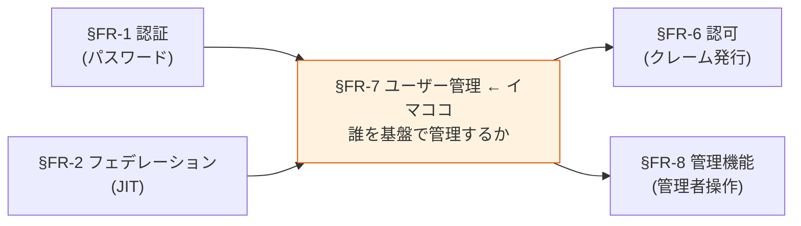
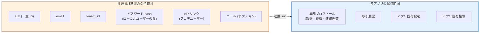

# §FR-7 ユーザー管理

> 上位 SSOT: [00-index.md](00-index.md)   
> 詳細: [../../functional-requirements.md §6 FR-USER](../../functional-requirements.md)   
> カバー範囲: FR-USER §6.1 CRUD / §6.2 属性ロール / §6.3 セルフサービス / §6.4 プロビジョニング

---

## §FR-7.0 前提と背景

### 用語整理

| 用語 | 本基盤での意味 |
|---|---|
| **ローカルユーザー** | 本基盤の User DB に直接登録されたユーザー（パスワード認証 or 招待ベース）|
| **フェデユーザー** | 外部 IdP（Entra ID / Okta 等）から JIT で本基盤に作成されたユーザー（[§FR-2.2.1 JIT](02-federation.md#321-jit-プロビジョニング--fr-fed-008)）|
| **CRUD** | Create / Read / Update / Delete の基本ユーザー操作 |
| **SCIM 2.0**（System for Cross-domain Identity Management）| ユーザーライフサイクル自動化の業界標準プロトコル |
| **JIT プロビジョニング** | SSO 初回ログイン時の自動ユーザー作成（[§FR-2.2.1](02-federation.md#321-jit-プロビジョニング--fr-fed-008)）|
| **データ最小化（Data Minimization）** | GDPR / 個人情報保護法の基本原則。必要最小限の属性のみ保持 |
| **Right to Erasure（忘れられる権利）** | GDPR Article 17。30 日以内の削除応答義務 |

### なぜここ（§FR-7）で決めるか

**[§FR-6](06-authz.md) で「認証基盤は最小限」のスタンスを採用**した。それは認可だけでなく、**ユーザー管理の範囲（=基盤で何を保持するか）にも同じ原則が適用される**。本章で「基盤が持つユーザー情報の範囲」と「各アプリが持つユーザー情報の範囲」の責務分界を明確化する。

### §FR-7.0.A 本基盤のユーザー管理スタンス（§FR-6 と整合）

> **本基盤は「認証に必要な最小限のユーザー情報」のみを保持。業務固有のユーザー情報（プロフィール詳細・取引履歴・部署移動履歴等）は各アプリ側で管理する。**

### §FR-7.0.B Shared Responsibility Model（顧客所有・弊社ホスト）

> **詳細は [ADR-037 Shared Responsibility Model + 軽量 IGA](../../../adr/037-shared-responsibility-and-lightweight-iga.md) / [§FR-8.4](08-admin.md#fr-84-shared-responsibility-model-と軽量-iga) 参照**

[ADR-033](../../../adr/033-keycloak-2tier-broker-idp-architecture.md) 2-tier アーキテクチャの IdP-KC 移行ユーザーは **「顧客所有・弊社ホスト」の Shared Responsibility Model** で運用する（Auth0 Premium / Microsoft Entra External ID / Okta Workforce 同パターン）:

| 観点 | フェデ顧客 | IdP-KC 移行顧客 |
|---|---|---|
| **ユーザー所有権** | 顧客 | **顧客**（変わらず）|
| **物理保管場所** | 顧客 IdP | **弊社 IdP-KC** |
| **インフラ運用** | 顧客 IT | **弊社** |
| **CRUD 実施** | 顧客 IdP で | **弊社が提供する Tenant Admin Portal（[ADR-038](../../../adr/038-tenant-admin-portal.md)）で顧客が実施** |
| **責任モデル** | 顧客責任のみ | **Shared Responsibility（顧客 + 弊社）**|

→ **両ケースともユーザーは顧客所有**、本章 §FR-7.1〜7.4 の CRUD 規律は IdP-KC 移行ユーザーに**弊社が提供するツール経由で顧客が実施**する形になる。

### 管理対象ユーザーのカテゴリ（[§FR-1.2.0.0](01-auth.md#fr-1200-ローカルユーザーとは何か--利用者カテゴリ別の分析) と連動）

本章で扱う「ユーザー」は **利用者カテゴリ P-1〜P-6 すべてを含む**が、CRUD 規模や運用主体はカテゴリ・採用シナリオ次第で大きく変わる:

| カテゴリ | 保管場所 | CRUD 主体 | 規模目安（シナリオ γ）|
|---|---|---|---|
| **P-1 基盤運用管理者** | 共通基盤（弊社内 IdP フェデ + Break Glass 用最小ローカル）| 弊社運用 | 数〜数十名 |
| **P-2 テナント管理者** | 共通基盤（顧客 IdP フェデ or ローカル）| 弊社運用 or 顧客（委譲管理者）| 顧客数 × 数名 |
| **P-3 IdP あり顧客従業員** | 共通基盤（フェデユーザーレコード）| **顧客 IdP 側が真実**、本基盤は影**像のみ** | 顧客数 × 数百〜数千 |
| **P-4 IdP なし顧客従業員** | 共通基盤（ローカルユーザー）| 顧客（委譲管理者）| シナリオ次第（γ では原則ゼロ）|
| **P-5 ゲスト**, **P-6 B2C** | 共通基盤 | 招待者 or セルフ | 不定 |

→ **本章 §FR-7.1〜7.4 のベースライン値は「対象カテゴリ × 採用シナリオ」で変動**することに留意。特に **CRUD 頻度** と **セルフサービス対象** はカテゴリで分けて運用設計する（[§NFR-6.5](../nfr/06-operations.md) のユースケースに反映済）。

#### このスタンスの業界根拠

| 原則 | 出典 |
|---|---|
| **データ最小化（Data Minimization）** | GDPR Article 5(1)(c) / 個人情報保護法第 17 条 |
| **目的限定（Purpose Limitation）** | 同上、認証目的を超えた情報を基盤で持たない |
| **Privacy-by-Design** | GDPR Article 25、Login.gov 等の連邦政府ガイドラインも採用 |
| **2026 トレンド** | "Data minimization will evolve from purely legal obligation to scalability strategy" — 漏洩リスク低減 + 開発速度向上 |

### 共通認証基盤として「ユーザー管理」を検討する意義

| 観点 | 個別アプリで実装 | 共通認証基盤で実装 |
|---|---|---|
| ユーザー一意性 | アプリごとに別 ID 体系 | **基盤 `sub` で全アプリ統一** |
| パスワード管理 | アプリごとに別実装 | **基盤側で一元化、bcrypt/PBKDF2 統一** |
| ライフサイクル | アプリごとに退職処理 | **基盤側で 1 度無効化 → 全アプリ波及** |
| GDPR 削除権 | 各アプリで個別対応必要 | **基盤側で削除 → 全アプリの認可遮断** |
| SCIM 連携 | アプリごとに実装 | **基盤側で標準対応、各アプリ恩恵** |

→ ユーザー管理を基盤に集約することで、**認証情報の一元管理 + ライフサイクル統一 + コンプライアンス対応**を一気に解決。

### 本章で扱うサブセクション

| サブセクション | 内容 | 関連 FR |
|---|---|---|
| §FR-7.1 ユーザー CRUD | 基本操作・検索・有効化/無効化・削除 | FR-USER-001, 005, 006, 011 |
| §FR-7.2 属性・ロール | 基盤が持つ属性の範囲 / ロール定義 | FR-USER-002, 007, 008 |
| §FR-7.3 セルフサービス | ユーザー自身による操作（招待・プロフィール編集） | FR-USER-004, 012 |
| §FR-7.4 プロビジョニング | SCIM / バルクインポート / 管理者操作 | FR-USER-003, 009, 010 |

---

## §FR-7.1 ユーザー CRUD（→ FR-USER §6.1）

> **このサブセクションで定めること**: 本基盤のユーザーレコードに対する**基本操作**（作成・更新・削除・検索・有効化/無効化）と、GDPR Right to Erasure 対応の削除フロー。   
> **主な判断軸**: 削除 vs 無効化のデフォルト、削除 SLA、バックアップからの削除方針、退職時処理フロー   
> **§FR-7 全体との関係**: §FR-7.1 = 「**操作**」、§FR-7.2 = 「持つ属性」、§FR-7.3 = 「ユーザー自身の操作」、§FR-7.4 = 「外部からの自動投入」

### 業界の現在地

- **ローカルユーザー CRUD**: 認証基盤の基本機能。Cognito / Keycloak 両方標準
- **削除時のデータ処理**: GDPR Right to Erasure は 30 日以内応答必須。**EDPB 2026 enforcement framework が backup systems も対象化**
- **ライフサイクル**: 退職時の即時無効化が SOC 2 / ISO 27001 で求められる

### 我々のスタンス（基本方針に基づく）

| 基本方針の柱 | CRUD での実現 |
|---|---|
| **絶対安全** | 退職時即時無効化、削除時の関連データ削除（GDPR/個人情報保護法）|
| **どんなアプリでも** | 標準 Admin API / REST API でどんなアプリからも操作可能 |
| **効率よく** | バルク操作対応、検索 API |
| **運用負荷・コスト最小** | プラットフォーム標準機能、追加実装不要 |

### 対応能力マトリクス

| 機能 | Cognito | Keycloak (OSS/RHBK) | PoC 検証 |
|---|:---:|:---:|:---:|
| 作成 / 更新 / 削除 | ✅ Admin API | ✅ Admin REST API | ✅ |
| ユーザー検索（属性ベース） | ✅ ListUsers + filter | ✅ Search API | ✅ |
| 有効化 / 無効化 | ✅ AdminDisableUser | ✅ Enable/Disable | ✅ |
| 削除時の関連データ Cascade | ✅ AdminDeleteUser（基盤内）| ✅ Cascade Delete（Realm 内）| ❌ 未検証 |
| GDPR 削除証跡 | ✅ CloudTrail | ⚠ Event Listener 自前 | — |
| バックアップからの削除 | ⚠ 設計要 | ⚠ 設計要 | — |

### ベースライン

| 項目 | ベースライン |
|---|---|
| CRUD 操作 | **Must**（標準提供）|
| ユーザー検索 | **Must**（属性ベース・ID ベース）|
| 有効化 / 無効化 | **Must**（退職時即時対応）|
| 削除時の関連データ | **基盤内データ Cascade**（[§FR-2 フェデユーザーリンク](02-federation.md) / [§FR-6 ロール](06-authz.md) 含む）|
| GDPR 削除応答 SLA | **30 日以内**（法定）|
| バックアップ削除 | "delete-on-restore" マーカー方式（EDPB 推奨）|
| 監査ログ | 削除イベントを CloudWatch / Event Listener に永続記録 |

### TBD / 要確認

| 確認項目 | 回答例 |
|---|---|
| 削除 vs 無効化のデフォルト | 削除（GDPR 厳格）/ 無効化（履歴保持） |
| 削除 SLA | 即時 / 24 時間 / 7 日 / 30 日 |
| バックアップからの削除方針 | "delete-on-restore" / 即時 / 法定保管期間後 |
| 退職時の処理フロー | 即時無効化 → N 日後削除 / 即時削除 |

---

## §FR-7.2 属性・ロール（→ FR-USER §6.2）

> **このサブセクションで定めること**: 本基盤がユーザーレコードに**保持する属性の範囲**（最小 = `sub`/`email`/`tenant_id`/`password_hash`、オプション = ロール/グループ/カスタム属性）。   
> **主な判断軸**: 必要なカスタム属性、基盤 vs アプリ側の保持責務分担、ロール体系（フラット / 階層）、グループ管理の必要性   
> **§FR-7 全体との関係**: §FR-7.0.A「**基盤は最小限保持**」スタンスの具体化。[§FR-6.1 JWT クレーム発行](06-authz.md#71-認証基盤が発行する-jwt-クレーム--fr-authz-51) と保持属性が連動

### 業界の現在地

**データ最小化原則（2026）**:
- "lower numbers generally being better" — 属性数は少ないほど良い
- Progressive Profiling：必要になったときに取得（一括取得しない）
- Login.gov 連邦標準：「partner agency が必要と identify した最小セットのみ」

**業界トレンド**:
- 認証目的を超えた属性は基盤に置かない（漏洩リスク + コンプライアンス）
- ロール / グループは tenant-scoped
- Zero Knowledge Proof による属性検証（プライバシー強化）

### 我々のスタンス（基本方針に基づく）

| 基本方針の柱 | 属性・ロールでの実現 |
|---|---|
| **絶対安全** | データ最小化 = 漏洩時被害最小。GDPR/個人情報保護法準拠 |
| **どんなアプリでも** | 必要最小限のクレームを発行（[§FR-6.1](06-authz.md#71-認証基盤が発行する-jwt-クレーム--fr-authz-51)）、業務属性はアプリで保持 |
| **効率よく** | Progressive Profiling、必要時に取得 |
| **運用負荷・コスト最小** | カスタム属性は要件次第。デフォルトは最小 |

### 基盤が保持する属性の 3 段階（[§FR-6.1](06-authz.md#71-認証基盤が発行する-jwt-クレーム--fr-authz-51) と整合）

| 段階 | 属性 | 採用判断 |
|---|---|---|
| **A. 最小（Must）**| `sub`、`email`、`tenant_id`、`password_hash`（ローカルユーザーのみ） | 全顧客 Must |
| **B. 認証拡張（Should）**| `roles`（[§FR-6.1](06-authz.md#71-認証基盤が発行する-jwt-クレーム--fr-authz-51) パターン B 選択時）、`name`（UI 表示用）| 採用パターン次第 |
| **C. オプション**| 部署、コストセンター、カスタム属性 | 顧客個別要件 |

→ **C はできるだけアプリ側に置く**（基盤は認証に必要なものだけ）。

### 対応能力マトリクス

| 機能 | Cognito | Keycloak (OSS/RHBK) |
|---|:---:|:---:|
| カスタム属性 | ✅ Custom Attributes（最大 50） | ✅ User Attributes（**無制限**） |
| グループ管理 | ✅ Cognito Groups | ✅ Realm Groups |
| ロール割り当て | ⚠ Custom Attr or Group で代用 | ✅ Realm Role Assignment（標準）|
| ロール階層（継承）| ⚠ アプリ側実装 | ✅ Composite Role |
| 属性検索 | ✅ filter | ✅ Search API |
| 属性のスキーマ強制 | ✅ Schema 定義 | ✅ User Profile 設定 |

### ベースライン

| 項目 | ベースライン |
|---|---|
| 基盤が持つ属性の原則 | **データ最小化**（GDPR / 個人情報保護法準拠）|
| デフォルト保持属性 | `sub` / `email` / `tenant_id` / `password_hash`（ローカルのみ） |
| ロール採用判断 | [§FR-6 認可](06-authz.md) で顧客選択パターンに依存 |
| カスタム属性 | **必要最小限**、業務属性はアプリ側に置く方針 |
| グループ管理 | Should（顧客要件次第）|

### TBD / 要確認

| 確認項目 | 回答例 |
|---|---|
| 必要なカスタム属性 | 部署 / 役職 / コストセンター / その他 |
| 属性は基盤 vs アプリ側どちらに置くか | 基盤（クレームに含める）/ アプリ DB（基盤に置かない）|
| ロール体系 | フラット / 階層（Composite Role 必要 → Keycloak）|
| グループ管理の必要性 | あり / なし |

---

## §FR-7.3 セルフサービス（→ FR-USER §6.3）

> **このサブセクションで定めること**: ユーザー自身が**管理者を介さずに行える操作**の範囲（プロフィール編集・招待ベース登録・MFA セルフ登録・パスワードリセット）。   
> **主な判断軸**: セルフサービス UI 提供方針（基盤標準 UI / アプリ側実装）、招待 vs 自由登録、プロフィール編集の可能項目   
> **§FR-7 全体との関係**: §FR-7.1 が管理者操作中心、§FR-7.3 が**ユーザー自身による操作**。管理者負荷削減の核

### 業界の現在地

**2026 ベストプラクティス**:
- 招待ベースの登録（管理者がメール送信 → ユーザーが登録）
- セルフサービスプロフィール編集（管理者負荷削減）
- アクセスパッケージ（時限付き）：プロジェクト・契約者向け
- "zero-touch onboarding and instant, secure offboarding"

### 我々のスタンス（基本方針に基づく）

| 基本方針の柱 | セルフサービスでの実現 |
|---|---|
| **絶対安全** | プロフィール編集の範囲を制限（重要属性は管理者承認制）|
| **どんなアプリでも** | 基盤側で標準 UI 提供、アプリ側でも独自実装可 |
| **効率よく** | ユーザー自身でできることは自身で、管理者負荷削減 |
| **運用負荷・コスト最小** | Keycloak は Account Console 標準、Cognito はアプリ側で UI 実装 |

### 対応能力マトリクス

| 機能 | Cognito | Keycloak (OSS/RHBK) |
|---|:---:|:---:|
| セルフサービスプロフィール編集 | ⚠ アプリ側 UI 実装必要 | ✅ **Account Console**（標準）|
| 招待メール（Invite-based registration）| ✅ AdminCreateUser invitation | ✅ Email Verification + Required Action |
| パスワードリセット | ✅ Forgot Password | ✅ Forgot Password |
| MFA セルフ登録 | ✅ | ✅ Account Console |
| アクセスパッケージ / 時限権限 | ❌ | ⚠ プラグイン |

### ベースライン

| 項目 | ベースライン |
|---|---|
| プロフィール編集（基本属性） | **Must**（email / name）|
| プロフィール編集(重要属性) | 管理者承認制 |
| 招待ベース登録 | **Should**（招待メール送信機能）|
| MFA セルフ登録 | **Must**（[§FR-3.1 MFA 要素](03-mfa.md#41-mfa-要素--fr-mfa-31) で詳述）|
| パスワードリセット | **Must**（[§FR-1.2 ローカル PW](01-auth.md#22-パスワードローカルユーザー管理-fr-auth-12) で詳述）|

### TBD / 要確認

| 確認項目 | 回答例 |
|---|---|
| セルフサービス UI 提供方針 | 基盤標準 UI（Keycloak Account Console）/ アプリ側実装 |
| 招待 vs 自由登録 | 招待のみ（管理者制御）/ 自由登録（ドメイン制限）|
| プロフィール編集可能項目 | 全項目 / 一部のみ / 管理者承認制 |

---

## §FR-7.4 プロビジョニング（→ FR-USER §6.4）

> **このサブセクションで定めること**: 外部（IdP / バッチ / 管理者）からの**自動・大量投入**の方式（JIT / SCIM 2.0 / バルクインポート / 強制リセット）。   
> **主な判断軸**: SCIM 2.0 の必要性（**Cognito ネイティブ非対応 → Keycloak 必須化に直結**）、バルクインポート規模、退職時 deprovision SLA   
> **§FR-7 全体との関係**: §FR-7.1 が個別操作、§FR-7.4 は**自動化・大量処理**。JIT は [§FR-2.2.1](02-federation.md#321-jit-プロビジョニング--fr-fed-008) と整合

### §FR-7.4.0 SCIM の位置づけと本基盤のスタンス

> **詳細は [ADR-025 SCIM 2.0 の位置づけと本基盤の受信スタンス](../../../adr/025-scim-positioning-and-receive-stance.md) を参照**

> **このサブセクションで定めること**: SCIM 2.0（プロビジョニング層プロトコル）の位置づけと、本基盤での受信機能実装方針。JIT との使い分け、顧客採用判断のフロー。
> **主な判断軸**: 顧客 IdP の SCIM 対応状況、退職者 deprovisioning 要件、ライセンス・コスト、ソース（送信元）の有無
> **§FR-7.4 内の位置付け**: §FR-7.4 全体の前提となる「SCIM とは何か / 本基盤がどう関わるか」を確定。§FR-7.4.5 以降の混在運用・段階移行はこの上に立つ

#### 結論サマリ

| 項目 | 採用方針 |
|---|---|
| **SCIM 受信機能（共通基盤側）** | **実装する（Must）** |
| **顧客側の SCIM クライアント保有** | 必須化しない（Should、顧客選択）|
| **JIT との関係** | **両方併用が標準**（JIT = 日常 / SCIM = 退職者 deprovisioning + 大量変更）|
| **アプローチ** | **C 案 = SCIM 受信実装 + 顧客選択**（柔軟性最大）|

#### 主要な裏どり（詳細は ADR-025）

- **OIDC + SCIM が業界標準パターン**（「SCIM = SAML 専用」は誤解、Entra / Okta / Google はいずれも OIDC + SCIM をセット提供）
- **JIT と SCIM は補完関係**：起動契機が真逆（reactive vs proactive）、両方併用で**退職者 deprovisioning を実現**しつつ**ログイン時のユーザー作成も自動化**
- **業界実証**：手動 $28/user → SCIM 自動 $3.50/user（**87% コスト削減**）、SCIM 採用組織は 90 日でアクティブユーザー数が SAML-only より多い（Microsoft Entra 2026 調査）
- **プラットフォーム差**：Cognito は SCIM ネイティブ非対応（Lambda 自前実装）/ Keycloak はプラグイン対応

#### §FR-7.4.0.A 本基盤の SCIM スタンス

> **本基盤は SCIM 2.0 受信機能（SCIM サーバー）を実装する**ことを基本方針とする（Must）。一方で**顧客側に SCIM クライアント機能の保有・採用を必須化しない**（Should）。顧客 IdP の SCIM 対応状況と採用意思に応じて、SCIM 連携 / JIT のみ / ハイブリッドを柔軟に選択できる構成を採る。

#### 顧客への QA 4 段階フロー（要点）

| Q# | 質問 | 期待回答 |
|:---:|---|---|
| **Q1** | 顧客 IdP は SCIM 2.0 Provisioning 対応?（Entra Premium P1+ / Okta 全プラン / Google Cloud Identity Premium 等は標準）| Yes / No / 不明 |
| **Q2** | SCIM 連携を採用希望?（顧客側で SCIM 設定 + IdP 上位ライセンス必要）| 採用 / 採用しない / 保留 |
| **Q3** | 利用中の IdP 製品・ライセンス、HR と IdP 連携、入退社フロー | 製品名 + 詳細 |
| **Q4** | SCIM 不採用時、退職者 deprovisioning 責任を顧客側で持てるか? | 顧客責任 / 弊社サポート |

#### 顧客の回答による運用パターン

| 回答 | 共通基盤側の運用 | リスク |
|---|---|---|
| Q1 Yes + Q2 採用 | SCIM 自動同期（推奨）| 最小 |
| Q1 Yes + Q2 不採用 | JIT のみ + 契約で deprovisioning 責任を顧客明示 | 中 |
| Q1 No（IdP 未対応）| JIT のみ + **弊社による定期バッチ deprovisioning** | 中 |
| Q1 No（IdP なし、ローカル）| ローカル + 手動 + セルフサービス（β/α）| 状況次第 |

#### 対応能力マトリクス

| 機能 | Cognito | Keycloak (OSS/RHBK) | 備考 |
|---|:---:|:---:|---|
| JIT プロビジョニング | ✅ | ✅ | [§FR-2.2.1](02-federation.md#321-jit-プロビジョニング--fr-fed-008) |
| **SCIM 2.0**（IdP からの自動連携）| ⚠ ネイティブ非対応（自前 Lambda）| ✅ プラグイン対応 | **大きな差** |
| バルクインポート | ✅ ImportUsers | ✅ Realm Import | 両方 |
| 管理者強制 PW リセット | ✅ AdminSetUserPassword | ✅ Admin Console | 両方 |
| 退職時 Deprovision | ⚠ 個別実装 | ✅ SCIM 経由 | エンタープライズ要件で大差 |
| 監査ログ | ✅ CloudTrail | ⚠ Event Listener | Cognito が楽 |

→ Cognito 採用時は Lambda 自前実装、Keycloak 採用時はプラグイン採用で対応。

### 業界の現在地

詳細は [ADR-025 §F](../../../adr/025-scim-positioning-and-receive-stance.md)。要点：

- Microsoft Entra が SCIM 2.0 API を GA 化（2026）
- 手動 $28/user → 自動 $3.50/user（**87% 削減**）
- SCIM 採用組織は 90 日でアクティブユーザー数優位
- IT チームの 75-85% の SaaS で依然手動運用

### 我々のスタンス（基本方針に基づく）

| 基本方針の柱 | プロビジョニングでの実現 |
|---|---|
| **絶対安全** | 退職時の SCIM deprovision で即時アクセス遮断 |
| **どんなアプリでも** | SCIM 2.0 標準準拠で IdP 側からの自動連携可 |
| **効率よく** | JIT + SCIM ハイブリッド（日常 JIT、大量変更時 SCIM）|
| **運用負荷・コスト最小** | 自動化で手動 $28/user → $3.50/user |

### ベースライン

| 項目 | ベースライン |
|---|---|
| JIT プロビジョニング | **Must**（[§FR-2.2.1](02-federation.md#321-jit-プロビジョニング--fr-fed-008)）|
| **SCIM 2.0 受信機能（共通基盤側実装）** | **Must**（§FR-7.4.0.A、Cognito 採用時は Lambda、Keycloak は plugin）|
| SCIM 2.0 連携（顧客側）| **Should**（顧客の IdP 対応 / 採用意思次第）|
| バルクインポート | **Should**（初期移行 / SCIM 未対応のフォールバック）|
| 管理者強制操作 | **Must** |
| 退職時 deprovision SLA | 即時〜24h（SCIM 採用顧客）/ 24h〜7d（JIT のみ、定期バッチ前提）|
| ハイブリッド方式 | **JIT（日常）+ SCIM（大量変更 + deprovisioning）** が推奨 |

### TBD / 要確認

**A. 共通基盤側の方針（弊社で決定する）**

| 確認項目 | 回答例 |
|---|---|
| SCIM 受信機能の実装スコープ | 全カテゴリ受け入れ可能な汎用 SCIM サーバー（推奨）/ 限定 |
| 認証方式（SCIM Token）| OAuth Bearer Token（顧客テナント別に発行）|
| 監査ログ範囲 | 全 SCIM 操作（CRUD）を CloudWatch / Audit Log |
| エラーハンドリング | 失敗時のリトライ / Dead Letter Queue / 顧客通知 |

**B. 顧客個別の確認事項（Q1〜Q4）**

| 確認項目 | 回答例 |
|---|---|
| **Q1**: 顧客 IdP の SCIM Provisioning 対応 | Entra ID P1+ / Okta / Google CI Premium / HENNGE One / 自社製 / なし / 不明 |
| **Q2**: SCIM 連携採用意思 | 採用希望 / 採用しない / 判断保留 |
| **Q3**: 顧客 HR と IdP の連携、入退社フロー | 顧客内部の現状 |
| **Q4**: SCIM 不採用時の deprovisioning 責任所在 | 顧客責任 / 弊社で定期バッチ運用 |

**C. 規模 / SLA 関連**

| 確認項目 | 回答例 |
|---|---|
| バルクインポート規模 | 初期 N 件 / 月次 M 件 / 不要 |
| 退職時 deprovision SLA | 即時 / 24h / 7d |
| 顧客全体での SCIM 採用見込み比率 | 90%+ / 50-90% / <50% |
| プラットフォーム選定への影響 | **SCIM 受信実装 Must 化により Cognito でも Lambda 実装で対応可、ただし Keycloak がやや有利** |

### §FR-7.4.5 混在環境の認証/プロビジョニング フロー（顧客 IdP 別の SCIM 対応差）

> **詳細は [common/scim-operations.md §1](../../../common/scim-operations.md#1-混在環境の認証プロビジョニング-フロー顧客-idp-別の-scim-対応差) を参照**

> **このサブセクションで定めること**: 顧客 IdP の SCIM 対応状況の混在を本基盤側でどう吸収するか（タイプ A SCIM only / B JIT only / C 移行期混在）の運用フロー。
> **§FR-7.4 内の位置付け**: §FR-7.4.0 で確定した「C アプローチ（受信実装 + 顧客選択）」の具体運用パターン

#### 結論サマリ

3 つの顧客タイプを並列受け入れ可能な設計を採用:

| タイプ | プロビ方式 | JIT 補完 | 採用判断 |
|---|---|---|---|
| **タイプ A: SCIM 採用顧客** | SCIM Push（事前作成）| ✅ 不要 | 推奨 |
| **タイプ B: JIT のみ顧客** | JIT（ログイン時自動作成）| ✅ 常時 | 顧客 IdP が SCIM 未対応時 |
| **タイプ C: 移行期混在** | 段階的 SCIM 導入 | ✅ 常時 | 移行中（→ §FR-7.4.7）|

詳細な顧客 IdP 別マトリクス、シーケンス図、ゴーストユーザー問題対応は [common/scim-operations.md §1](../../../common/scim-operations.md#1-混在環境の認証プロビジョニング-フロー顧客-idp-別の-scim-対応差) 参照。

### §FR-7.4.6 同期競合の解決ルール（SCIM vs JIT、Source of Truth ポリシー）

> **詳細は [common/scim-operations.md §2](../../../common/scim-operations.md#2-同期競合の解決ルールscim-vs-jitsource-of-truth-ポリシー) を参照**

> **このサブセクションで定めること**: SCIM Push と JIT が同じユーザーを更新する競合時の Source of Truth ルールと、物理削除 vs 論理削除の使い分け。

#### 結論サマリ

| 項目 | ルール |
|---|---|
| **Source of Truth** | SCIM 採用テナント = SCIM Push が SoT、JIT は属性上書きしない |
| **JIT のみテナント** | JIT 時の IdP 属性が SoT |
| **削除運用** | 第 1 段階：論理削除（enabled=false + Token Revocation、即時）/ 第 2 段階：物理削除 or 匿名化（PCI DSS 1 年 / 一般 7 年）|

詳細な同期競合シーケンス・保持・削除マトリクス・タイムライン例は [common/scim-operations.md §2](../../../common/scim-operations.md#2-同期競合の解決ルールscim-vs-jitsource-of-truth-ポリシー) 参照。

### §FR-7.4.7 段階移行運用（JIT → SCIM 追加、既存ユーザーマージ）

> **詳細は [common/scim-operations.md §3](../../../common/scim-operations.md#3-段階移行運用jit--scim-追加既存ユーザーマージ) を参照**

> **このサブセクションで定めること**: 顧客が「最初 JIT のみ → 半年後 SCIM 導入」する移行期の運用手順と既存ユーザーマージ方法。

#### 結論サマリ

| 項目 | 採用方針 |
|---|---|
| **移行手順** | 3 ステップ：(1) 顧客 IdP 設定 / (2) 一括バルク同期 / (3) Sync Mode FORCE 切替 |
| **突合キー** | externalId 優先、なければ email + email_verified=true |
| **重複防止** | 移行前にメール検証キャンペーン / Conflict Resolution ポリシー設定 / 移行ツールでバッチ実行 |
| **ロールバック容易性** | Sync Mode を IMPORT に戻すだけで JIT 状態に戻せる |

詳細な移行シナリオ・推奨手順・重複防止策・定期バッチ deprovisioning は [common/scim-operations.md §3](../../../common/scim-operations.md#3-段階移行運用jit--scim-追加既存ユーザーマージ) 参照。

### §FR-7.4.8 PCI DSS / APPI 適合性整理（コンプライアンス要件と JIT/SCIM 選定）

> **詳細は [common/scim-operations.md §4](../../../common/scim-operations.md#4-pci-dss--appi-適合性整理コンプライアンス要件と-jitscim-選定) を参照**

> **このサブセクションで定めること**: 規制顧客（PCI DSS / APPI 適用業種）のプロビ選定基準と、JIT のみで適合可能なケース vs SCIM 必須ケースの判別。

#### 結論サマリ

| 規制 | JIT のみで OK? | SCIM 必須条件 | 本基盤の方針 |
|---|---|---|---|
| **PCI DSS v4.0**（8.2.5 / 8.2.6 / 8.3）| ⚠ 条件付き | 90 日アクセス見直し + Compensating Controls | カード処理顧客に **SCIM 強推奨** |
| **APPI**（22/23/25/26/28-30 条）| ✅ 適合可 | 第三者提供 / 国外移転時のみ追加 | JIT で十分、属性最小化が肝 |

詳細な要件マッピング・Compensating Controls 実装・適合性チェックリストは [common/scim-operations.md §4](../../../common/scim-operations.md#4-pci-dss--appi-適合性整理コンプライアンス要件と-jitscim-選定) 参照。

### §FR-7.4.9 SCIM 非対応 IdP 顧客への適合アプローチ（回避・受容パターン）

> **詳細は [common/scim-operations.md §5](../../../common/scim-operations.md#5-scim-非対応-idp-顧客への適合アプローチ回避受容パターン) を参照**

> **このサブセクションで定めること**: 顧客 IdP が SCIM 未対応 / 顧客が SCIM 不採用の場合の 6 つの回避・受容アプローチ。

#### 結論サマリ

6 パターン併用で全顧客カバー可能:

| アプローチ | 概要 | 採用 |
|:---:|---|:---:|
| **案 A**: 短命 Access Token + 検証時 IdP 問合せ | TTL 5-15 分、UserInfo Endpoint で生死確認 | **第一推奨** |
| 案 B: ITDR 投資（脅威検知） | Behavioral Analytics で異常検知 | 補助 |
| **案 C**: 定期バッチ deprovisioning | 弊社で日次 LDAP/Graph API ポーリング | 採用（B 案補完）|
| **案 D**: PCI DSS Compensating Controls | 同等補完策を契約に明記 | 規制顧客のみ |
| 案 E: 完全ローカル移行 | 顧客に IdP 廃止依頼 | ❌ 業界実例なし |
| 案 F: 顧客拒否 | 営業断り | 最終手段 |

→ **業界主流は A + C + D の組合せ**、本基盤も同方向。

詳細なパターン別実装・短命 Token UX・業界事例は [common/scim-operations.md §5](../../../common/scim-operations.md#5-scim-非対応-idp-顧客への適合アプローチ回避受容パターン) 参照。

### §FR-7.4.10 発信プロビジョニング（基盤 → ServiceNow 等）

> **このサブセクションで定めること**: 顧客が **ServiceNow / Salesforce / Workday 等の SaaS** を業務利用しており、これらに**本基盤からユーザー情報を Push する**シナリオの方針。本サブセクションは特に ServiceNow ケースに焦点を当てる。   
> **§FR-7.4 内の位置付け**: §FR-7.4.1〜§FR-7.4.9 は **受信側 SCIM**（顧客 IdP → 本基盤）。本サブセクションは **発信側 SCIM / JIT**（本基盤 → SaaS SP）  
>
> **詳細は [ADR-023 ServiceNow SP 連携設計](../../../adr/023-servicenow-sp-integration.md) を参照**

#### ベースライン

| 項目 | デフォルト |
|---|---|
| **第一推奨パターン** | **SAML JIT Provisioning**（ServiceNow が初回 SSO 時に自動作成）|
| 代替: SCIM Push | 大規模 / 運用統合志向のみ。ServiceNow の SCIM v2 Plugin 経由、**KB2599716 リスク承知の自前実装** |
| 識別子 | ServiceNow `user_name` = Layer B `external_id`（[ADR-018](../../../adr/018-user-identifier-3layer-emailless.md) と整合）|
| 退職時 | 本基盤で無効化 → SAML 認証拒否 → SN ログイン不能。SN レコードは残置が業界標準（履歴保持）|

#### TBD / 要確認

[B-SN-1〜8](../../hearing-checklist.md) を参照。詳細パターン比較は [ADR-023](../../../adr/023-servicenow-sp-integration.md)。

---

### 参考: Keycloak 実装目線の詳細

本サブセクション §FR-7.4.5 / §FR-7.4.6 / §FR-7.4.7 の **Keycloak 実装観点での詳細**（Identity Provider Mapper / First Broker Login Flow / Sync Mode 設定 / externalId 突合実装 / テナント別 SCIM 有効化）は **[doc/common/jit-scim-coexistence-keycloak.md](../../../common/jit-scim-coexistence-keycloak.md)** に集約。

---

## §FR-7.5 データポータビリティ + データ主体権利対応

> **詳細は [ADR-048 データポータビリティ + データ主体権利対応](../../../adr/048-data-portability-subject-rights.md) を参照**

> **このサブセクションで定めること**: GDPR Art.15-21 + APPI 第 33-36 条への技術的対応。**§FR-7.0.B Shared Responsibility Model** で「顧客所有・弊社ホスト」のスタンスを確定した IdP-KC 移行ユーザーに対し、データ主体権利行使のフレームワークを提供。
> **主な判断軸**: GDPR 30 日 SLA + APPI「遅滞なく」+ 機械可読形式（Portability 真の実現）+ Cryptographic Erasure
> **§FR-7 全体との関係**: §FR-7.1 CRUD / §FR-7.0.B Shared Responsibility の**規制対応層**

### 結論サマリ — 4 経路 × 6 権利

| 経路 | 用途 |
|---|---|
| **メイン: Tenant Admin Portal 経由**（[ADR-038](../../../adr/038-tenant-admin-portal.md)）| 顧客 DPO が主導、Shared Responsibility 整合 |
| Subject Rights Portal（Phase 2）| `account.basis.example.com/rights`、エンドユーザー直接 |
| 法定書面（紙）| Tenant Admin Portal で手動登録 |
| DPO 直接連絡 | テナント DPO 経由 |

| 権利 | GDPR | APPI | 実装 |
|---|---|---|---|
| Right of Access | Art.15 | 第 33 条 | 全データ JSON エクスポート |
| Right to Rectification | Art.16 | 第 34 条 | プロフィール編集 + 訂正履歴 |
| Right to Erasure | Art.17 | 第 35 条 | 論理削除 30 日 → 物理削除 + Cryptographic Erasure |
| Right to Restriction | Art.18 | 第 35 条 | アカウント Suspend |
| **Right to Portability** | **Art.20** | 第 33 条（電磁的記録）| **機械可読 5 形式**（JSON / SCIM / CSV / XLSX / OIDC UserInfo） |
| Right to Object | Art.21 | 第 36 条 | 処理拒否 + Opt-Out |

### 採用方針の核

- **応答 SLA**：GDPR 30 日（最大 +60 日延長可）、APPI「遅滞なく」（実運用 14 日目標）
- **削除モデル**：論理削除 30 日 Pending → 物理削除 + 監査ログのみ匿名化保持（13 年）
- **大規模顧客（L3 CMK 採用）**：**テナント全削除 = L3 CMK 削除で Cryptographic Erasure 即時実行**（[ADR-045 §A.4](../../../adr/045-cryptographic-key-management-strategy.md)）
- **エクスポート形式**：JSON プライマリ + SCIM 2.0（IdP 移転用）+ CSV / XLSX / OIDC UserInfo
- **証跡保管**：全 DSAR ログを Audit Acct OpenSearch 7 年
- **DSAR Backend**：Step Functions State Machine で自動化、SLA 監視 + 通知
- **コスト**：年 〜$4.5K（商用 DSAR プラットフォーム年 $40-50K 比 10 倍削減）

### TBD / 要確認

| 確認項目 | ヒアリング ID | 回答例 |
|---|---|---|
| Subject Rights Portal の必要性 | **B-DSAR-1** | Phase 1 から / Phase 2 / 不要 |
| エクスポート形式の優先 | **B-DSAR-2** | JSON 必須 / SCIM 2.0 必須 / XLSX 必須 |
| 削除の Pending Window | **B-DSAR-3** | 30 日（推奨）/ 90 日 / 即時 |
| 多言語対応 | **B-DSAR-4** | 日本語のみ / 日英 / 中国語 / 韓国語追加 |
| Litigation Hold プロセス | **B-DSAR-5** | 法務承認必須 / Tenant 管理者承認 |
| Cryptographic Erasure 利用条件 | **B-DSAR-6** | L3 CMK 採用顧客のみ / 全顧客 / 不要 |

---

### 参考資料（§FR-7 全体）

#### スタンス・データ最小化

- [GDPR Article 5 - Data Minimization](https://gdpr.eu/article-5-how-to-process-personal-data/)
- [GDPR Article 17 - Right to Erasure](https://gdpr.eu/article-17-right-to-be-forgotten/)
- [EDPB CEF 2025-2026 Erasure Enforcement](https://www.mccannfitzgerald.com/knowledge/data-privacy-and-cyber-risk/delete-and-disclose-edpb-cef-2025-2026)
- [Login.gov Privacy Impact Assessment 2026](https://www.gsa.gov/system/files/Login_PIA_(March_2026).pdf)
- [Privacy-By-Design in CIAM - SSOJet](https://ssojet.com/ciam-qna/privacy-by-design-in-ciam-architectures)

#### SCIM / プロビジョニング

- [Microsoft Entra SCIM 2.0 GA 発表 2026](https://techcommunity.microsoft.com/blog/microsoft-entra-blog/microsoft-entra-expands-scim-support-with-new-scim-2-0-apis-for-identity-lifecyc/4507465)
- [SCIM Provisioning Guide 2026 - WorkOS](https://workos.com/blog/best-scim-providers-for-automated-user-provisioning-in-2026)
- [SCIM Provisioning Explained - Security Boulevard 2026](https://securityboulevard.com/2026/01/scim-provisioning-explained-automating-user-lifecycle-management-with-sso/)
- [Right to Erasure Best Practices - Authgear](https://www.authgear.com/post/the-right-to-erasure-and-how-you-can-follow-it-for-your-apps)
