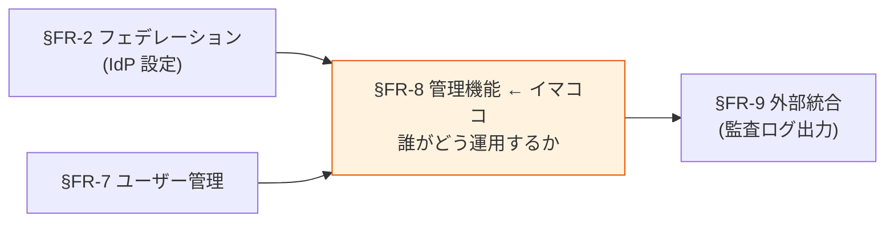
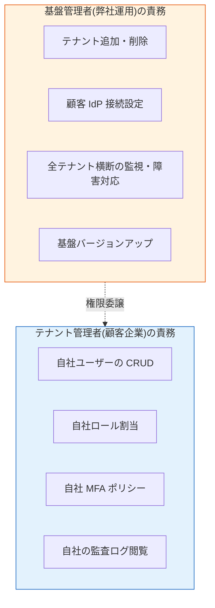

# §FR-8 管理機能

> 上位 SSOT: [00-index.md](00-index.md)   
> 詳細: [../../functional-requirements.md §7 FR-ADMIN](../../functional-requirements.md)   
> カバー範囲: FR-ADMIN §7.1 設定 / §7.2 監査 / §7.3 委譲・カスタマイズ

---

## §FR-8.0 前提と背景

### 用語整理

| 用語 | 本基盤での意味 |
|---|---|
| **管理コンソール** | 基盤設定を行う Web UI（Cognito = AWS Console / Keycloak = Admin Console）|
| **テナント** | 顧客企業 1 社の単位（[§FR-2.3](02-federation.md#33-マルチテナント運用--fr-fed-23) 参照）|
| **基盤管理者** | 弊社運用チームの管理者（**全テナント横断**で操作可能）|
| **テナント管理者** | 顧客企業側の管理者（**自社テナント内のみ**操作可能、委譲管理）|
| **監査ログ** | 「誰が、いつ、何を、なぜ」を記録した改ざん不能ログ |
| **SoD（Separation of Duties）** | 職務分離。1 人で完結できない承認制 |
| **JIT 管理者**（Just-in-Time Admin）| 必要な時間だけ管理者権限を付与 |

### なぜここ（§FR-8）で決めるか

§FR-1-§FR-7 までは「**基盤が何を提供するか**」だった。§FR-8 は「**それを誰がどう運用するか**」の話。
特に **B2B SaaS では「顧客企業の管理者に自社の運用を委譲する」**ことが運用効率を決定的に左右する。

### §FR-8.0.A 本基盤の管理機能スタンス

> **「基盤管理者（弊社）」と「テナント管理者（顧客企業）」の 2 層構造で運用する。顧客企業が自社テナント内のユーザー管理を自律的に行えるようにし、弊社運用負荷を最小化する。**

#### このスタンスの業界根拠

| 原則 | 出典 |
|---|---|
| **Delegated Administration** | "A mature IAM solution should support delegated administration, allowing each partner organization to manage its own users, groups, and policies within the limits you define" — 2026 業界標準 |
| **Least Privilege + JIT Admin** | NIST SP 800-53 / Microsoft Entra PIM、"Minimize persistent administrator access by enabling Privileged Identity Management" |
| **Separation of Duties** | 「ユーザー作成者 ≠ 承認者」の業務制約。RBAC の Static/Dynamic SoD |
| **継続的監査**（2026 トレンド）| "Move from reactive annual audits to continuous assurance" |

### 共通認証基盤として「管理機能」を検討する意義

| 観点 | 個別アプリで実装 | 共通認証基盤で実装 |
|---|---|---|
| 管理 UI | アプリごとに別 UI | **基盤側で統一 UI**（Console 標準）|
| 委譲管理 | アプリごとに実装 | **基盤側でテナント管理者ロール標準提供** |
| 監査ログ | アプリごとに記録 | **基盤側で一元記録、SIEM 連携可能** |
| 設定変更履歴 | アプリで個別 | **基盤側で全変更を記録** |

→ 認証関連の管理操作を基盤に集約することで、**SoD 維持・コンプライアンス対応・顧客自律運用**を同時実現。

### 本章で扱うサブセクション

| サブセクション | 内容 | 関連 FR |
|---|---|---|
| §FR-8.1 基盤設定管理 | 管理コンソール / テナント・IdP・Client・ロール管理 / テナント分離 | FR-ADMIN-001〜005, 009 |
| §FR-8.2 監査・可視性 | 監査ログ閲覧 / 設定変更履歴 | FR-ADMIN-007, 008 |
| §FR-8.3 権限委譲・カスタマイズ | 管理者 RBAC / テナント管理者委譲 / ログイン UI ブランディング | FR-ADMIN-006, 010〜012 |

---

## §FR-8.1 基盤設定管理(→ FR-ADMIN §7.1)

> **このサブセクションで定めること**: 基盤管理者(弊社運用)が基盤そのものを設定する仕組み(管理 Web UI / テナント・IdP・Client・ロールの管理 / IaC)。   
> **主な判断軸**: カスタム管理 UI の必要性、IaC ツール選定、管理者のアクセス経路(VPN / Bastion / IP 制限)   
> **§FR-8 全体との関係**: §FR-8.0.A 2 層構造のうち「**基盤管理者の操作**」を扱う。§FR-8.2 が監査、§FR-8.3 がテナント管理者委譲とカスタマイズ

### 業界の現在地

- 主要な管理コンソール（AWS Console、Microsoft Entra ID Admin Center、Okta Admin、Keycloak Admin Console）はすべて Web UI + REST API のセット
- IaC（Terraform）併用が業界標準（手動 Console 設定は監査困難）
- "joiner-mover-leaver" フローを自動化する SCIM 連携が前提

### 我々のスタンス（基本方針に基づく）

| 基本方針の柱 | 基盤設定管理での実現 |
|---|---|
| **絶対安全** | 設定変更は全て監査ログ記録、Terraform IaC で変更履歴も残る |
| **どんなアプリでも** | 標準 REST API でどんなツールからも操作可能 |
| **効率よく** | テナント追加・IdP 接続を IaC で自動化 |
| **運用負荷・コスト最小** | Cognito = AWS Console 標準で運用ゼロ、Keycloak = Admin Console + Realm Import |

### 対応能力マトリクス

| 機能 | Cognito | Keycloak (OSS/RHBK) | PoC 検証 |
|---|:---:|:---:|:---:|
| 管理 Web UI | ✅ AWS Console | ✅ Keycloak Admin Console | ✅ Phase 6 |
| テナント追加・削除 | ✅ User Pool 単位 / Cognito Groups | ✅ Realm 単位 / IdP 単位 | ⚠ 設計のみ |
| IdP 追加・削除・更新 | ✅ Console / Terraform | ✅ Console / Terraform | ✅ Phase 2,5,7 |
| クライアント（App）管理 | ✅ App Client | ✅ Client | ✅ |
| ロール定義管理 | ⚠ Custom Attr / Group | ✅ Realm Role / Client Role | ✅ Phase 8 |
| テナント別設定の分離 | ✅ User Pool 分離 | ✅ Realm 分離 | ✅ Phase 4,5 |
| Terraform IaC | ✅ | ⚠ Realm 部分は別管理（[§FR-9 外部統合](09-integration.md) 参照）| ✅ |

### ベースライン

| 項目 | ベースライン |
|---|---|
| 管理 UI | **基盤標準コンソール**を採用（カスタム UI は将来検討）|
| IaC 管理 | **Terraform を Must**（設定変更履歴の追跡）|
| テナント追加方式 | IaC 自動化（[§FR-2.3.2 オンボーディング](02-federation.md#332-顧客追加オンボーディング--fr-fed-011)）|
| IdP / Client / ロール管理 | Admin Console + Terraform 両方提供 |
| テナント別設定分離 | **Must**（[§FR-2.3.1](02-federation.md#331-複数-idp-並行運用--fr-fed-010) のテナント分離と整合）|

### TBD / 要確認

| 確認項目 | 回答例 |
|---|---|
| カスタム管理 UI の必要性 | 不要（基盤標準で OK）/ 必要（独自 UI 開発）|
| IaC ツール | Terraform / CDK / 手動 Console |
| 管理者のアクセス経路 | VPN / Bastion / IP 制限 |

---

## §FR-8.2 監査・可視性（→ FR-ADMIN §7.2）

> **このサブセクションで定めること**: 基盤側で生成される**監査ログの記録範囲・改ざん防止・閲覧 UI**（認証イベント / 管理操作 / 設定変更履歴）。   
> **主な判断軸**: 適用コンプライアンス枠組み（SOC 2 / ISO 27001 / PCI DSS / HIPAA）、ログ保存期間、閲覧者   
> **§FR-8 全体との関係**: §FR-8.1 で設定変更を行う → §FR-8.2 でその履歴を記録 → [§FR-9.2](09-integration.md#102-ログ監視--fr-int-82) で外部 SIEM に流す
> **⚠ 関連 ADR**: 顧客向け監査ログ提供（Customer Audit Support）は [ADR-036](../../../adr/036-customer-audit-support.md) / [§NFR-7.5](../nfr/07-compliance.md) で扱う。テナント管理者が UI で監査ログを閲覧する実装は [ADR-038 Tenant Admin Portal](../../../adr/038-tenant-admin-portal.md) / [§FR-8.5](#fr-85-tenant-admin-portal顧客テナント管理者向け-admin-ui) Phase 1 機能セット。本サブセクションは「**何をログとして記録するか・保存するか**」、ADR-036/038 は「**それを顧客にどう見せるか**」を扱う

### 業界の現在地

**主要コンプライアンス枠組みの監査ログ要件（2026）**:

| 枠組み | 監査要件の核 |
|---|---|
| **SOC 2** | 全認証イベント記録、改ざん防止、保存期間（通常 1 年以上）|
| **ISO 27001** | アクセスログ + 設定変更履歴、定期レビュー |
| **PCI DSS v4.0** | 1 年保管（うち 3 ヶ月は即時アクセス可能）|
| **GDPR** | データアクセスの追跡可能性、削除証跡 |
| **HIPAA** | 6 年保管（医療情報）|

**2026 トレンド**:
- "Continuous assurance through automated compliance platforms"（継続的監査）
- AI 駆動の異常検知（unusual access patterns）

### 我々のスタンス（基本方針に基づく）

| 基本方針の柱 | 監査での実現 |
|---|---|
| **絶対安全** | 改ざん不能な監査ログ、全認証・管理イベント記録 |
| **どんなアプリでも** | 標準フォーマット（CloudWatch / S3 / SIEM）で出力 |
| **効率よく** | 自動収集、SIEM 連携で異常検知も自動 |
| **運用負荷・コスト最小** | Cognito = CloudTrail 標準、Keycloak = Event Listener 設定 |

### 対応能力マトリクス

| 機能 | Cognito | Keycloak (OSS/RHBK) | 備考 |
|---|:---:|:---:|---|
| 認証イベントログ | ✅ CloudTrail | ✅ Event Listener | 両方 |
| 管理操作ログ | ✅ CloudTrail（API 呼び出し全記録）| ✅ Admin Events | 両方 |
| 設定変更履歴 | ✅ CloudTrail | ✅ Admin Events | 両方 |
| ログの改ざん防止 | ✅ CloudTrail（**immutable**）| ⚠ Event Listener 出力先次第 | Cognito 優位 |
| SIEM 連携 | ✅ CloudWatch → Splunk/Datadog 等 | ⚠ Event Listener カスタム実装 | Cognito が楽 |
| Web UI でのログ閲覧 | ⚠ CloudWatch Insights | ✅ Admin Events タブ | Keycloak が UX 良い |
| 長期保存 | ✅ S3 ライフサイクル | ✅ S3 ライフサイクル | 両方 |

→ **Cognito は CloudTrail のおかげで監査・改ざん防止が強い**。Keycloak は UI で見やすいが SIEM 連携は自前。

### ベースライン

| 項目 | ベースライン |
|---|---|
| 認証イベント記録 | **Must**（全成功・失敗）|
| 管理操作記録 | **Must** |
| 設定変更履歴 | **Must** |
| 改ざん防止 | **Must**（CloudTrail / S3 immutable / WORM）|
| 保存期間 | **法定要件に従う**（通常 1 年、医療は 6 年、業種次第 → [§NFR-7 コンプラ](../nfr/00-index.md) と連動）|
| SIEM 連携 | **Should**（顧客の既存 SIEM があれば）|
| ログ閲覧の権限 | テナント管理者は自社分のみ閲覧可（cross-tenant 遮断）|

### TBD / 要確認

| 確認項目 | 回答例 |
|---|---|
| 適用コンプライアンス枠組み | SOC 2 / ISO 27001 / PCI DSS / HIPAA / 業界独自 |
| ログ保存期間 | 1 年 / 3 年 / 6 年 / 10 年 |
| SIEM 連携先 | Splunk / Datadog / Sumo Logic / CloudWatch のみ / なし |
| 監査ログ閲覧者 | 弊社運用 / 顧客企業管理者 / 監査人 |

---

## §FR-8.3 権限委譲・カスタマイズ（→ FR-ADMIN §7.3）

> **このサブセクションで定めること**: 顧客企業の管理者に**自社テナント運用を委譲**する仕組み（テナント管理者ロール / JIT 管理者 / SoD）と、UI / メールの**ブランディング・カスタマイズ**範囲。   
> **主な判断軸**: テナント管理者委譲の要否（**Keycloak 必須化に直結**）、ログイン画面ブランディング深度、自前 UI の意思、管理画面カスタマイズ要否   
> **§FR-8 全体との関係**: §FR-8.0.A 2 層構造のうち「**テナント管理者への委譲**」を扱う。基盤管理者の操作は §FR-8.1。**ここで扱う「テナント管理者」は [§FR-1.2.0.0](01-auth.md#fr-1200-ローカルユーザーとは何か--利用者カテゴリ別の分析) の P-2 カテゴリ、[§FR-1.2.0.B](01-auth.md#fr-120b-aws-アカウント境界による運用摩擦への対応) Layer 3 委譲管理者** の具体機能
> **⚠ UI 実装**: テナント管理者が実際に使う UI は **[§FR-8.5 Tenant Admin Portal](#fr-85-tenant-admin-portal顧客テナント管理者向け-admin-ui)（[ADR-038](../../../adr/038-tenant-admin-portal.md)）**。Keycloak Admin Console の直接開放は不可（業界実例なし）。本サブセクションは「**何を委譲するか**」、§FR-8.5 は「**どうやって UI を提供するか**」を扱う
> **⚠ 責務分担**: 委譲管理者が管理する **IdP-KC ユーザーは「顧客所有・弊社ホスト」の Shared Responsibility Model**（[§FR-8.4](#fr-84-shared-responsibility-model-と軽量-iga) / [ADR-037](../../../adr/037-shared-responsibility-and-lightweight-iga.md)）

### 業界の現在地

#### 1. Delegated Administration（委譲管理）

B2B SaaS の運用効率の鍵：顧客企業が自社ユーザーを自律管理できる仕組み。
- 顧客企業管理者（**[§FR-1.2.0.0](01-auth.md#fr-1200-ローカルユーザーとは何か--利用者カテゴリ別の分析) P-2 カテゴリ**）は **自社テナント内のみ操作可能**
- 顧客企業のオフボーディング（退職処理）も自社で実行
- 弊社運用負荷を最小化（**[§FR-1.2.0.B](01-auth.md#fr-120b-aws-アカウント境界による運用摩擦への対応) Layer 3** の中核実装、[§NFR-6.5 C-1〜C-4](../nfr/06-operations.md) の routine 操作を実現）
- テナント管理者自身の認証は、**顧客 IdP 経由（推奨）** または **ローカル（IdP なし顧客の場合）**

#### 2. Separation of Duties（職務分離）と JIT 管理者

- Constrained RBAC で「ユーザー作成者 ≠ 承認者」を強制
- Just-in-Time 管理者：必要な時間だけ権限付与（Microsoft Entra PIM 等）
- "Administrative accounts represent the highest-risk category"

#### 3. ブランディング・カスタマイズ

ログイン画面の顧客企業ブランド適用は B2B SaaS の標準要件。**両プラットフォームとも完全カスタム UI は実現可能**だが、実装負荷とカバー範囲に差がある。

**Cognito の 3 つの UI 提供方法（2026 年時点）**:

| アプローチ | 必要ティア | カスタマイズ範囲 | 実装負荷 |
|---|:---:|---|:---:|
| **1. Classic Hosted UI** | Lite OK | CSS + ロゴのみ | なし |
| **2. Managed Login**（2024-11 新機能）| **Essentials+ 必須** | ノーコードビジュアルエディタ：背景・ロゴ・カラー・ライト/ダークモード・ヘッダー/フッター・個別 UI 要素 | なし |
| **3. Custom UI（SDK 経由）** | 全ティア OK | **完全自由** | 高（ホスティング・スケール・脅威保護も自前）|

**Keycloak の UI 提供方法**:
- **Default Theme**: 標準 UI
- **Quick Theme**（2026 新機能）: ノーコードでロゴ・色変更
- **Custom Theme**（FreeMarker テンプレート）: Login / Account / Email / Admin 全画面のフルカスタマイズ
- **REST API 経由の完全自前 UI**: 全アプリ実装

**Cognito のメールカスタマイズ 3 段階**（重要、UI と同様に 3 段階存在）:

| レベル | 方法 | カスタマイズ範囲 | 必要ティア | 実装負荷 |
|:---:|---|---|:---:|:---:|
| **1. Console 基本** | User Pool 設定で件名・本文編集 | 件名・本文・**HTML フォーマット**・テンプレート変数（`{username}`, `{####}`）、最大 20,000 文字 | 全ティア | なし |
| **2. Custom Message Lambda** | Lambda Trigger で動的生成 | **動的内容**（言語別・属性別）、HTML 完全自由 | 全ティア | 中（Lambda）|
| **3. Custom Email Sender Lambda** | メール送信そのものを Lambda で実装 | **完全自由 + 第三者 ESP**（SendGrid / Mailgun 等）使用可 | 全ティア | 高（Lambda + **KMS 暗号化必須**）|

**Keycloak のメールカスタマイズ**:
- **Email Theme**（HTML/Text の FreeMarker テンプレ）+ **messages.properties**（多言語対応）でファイル配置のみで実現
- 各メール種別（password-reset / email-verification / execute-actions 等）ごとに分離テンプレート
- SMTP 設定で任意のメールサーバー使用可

→ **UI ・メールとも自由度に絶対的な差はない**。差は「**ノーコード・基盤標準提供で実現できる範囲**」と「**実装負荷**」。Keycloak の Theme はファイル配置だけで完了、Cognito の完全カスタムは Lambda + KMS が必要。

### 我々のスタンス（基本方針に基づく）

| 基本方針の柱 | 権限委譲・カスタマイズでの実現 |
|---|---|
| **絶対安全** | SoD 強制、JIT 管理者、最小権限原則 |
| **どんなアプリでも** | 標準的な RBAC ベースの管理者ロール、API 公開 |
| **効率よく** | テナント管理者委譲で弊社運用工数を半減以上 |
| **運用負荷・コスト最小** | 顧客企業が自社運用 = 弊社は障害対応のみに専念可能 |

### 対応能力マトリクス

| 機能 | Cognito | Keycloak (OSS/RHBK) | 備考 |
|---|:---:|:---:|---|
| 管理者ロール（RBAC for Admin）| ✅ AWS IAM 経由 | ✅ Realm Admin Roles（標準）| 両方 |
| **テナント管理者の委譲**（顧客企業の自社運用）| ⚠ AWS IAM 設計要、複雑 | ✅ **Realm-level Admin**（標準機能）| **Keycloak 大幅優位** |
| 細粒度パーミッション管理 | ⚠ アプリ側 | ✅ Authorization Services | [§FR-6.2 細粒度認可](06-authz.md#72-各アプリの認可設計パターン--fr-authz-52) 参照 |
| **JIT 管理者**（時限権限）| ⚠ IAM Identity Center 連携 | ⚠ プラグイン or 自前 | 両方カスタム |
| Separation of Duties | ⚠ アプリ側設計 | ⚠ アプリ側設計 | 両方カスタム |
| **ログイン UI 基盤標準提供のカスタム範囲** | ⚠ Hosted UI（CSS+ロゴ）/ ✅ Managed Login（Essentials+、ビジュアルエディタ）| ✅ **Theme**（Login/Account/Email/Admin 全画面）| Keycloak がやや広範 |
| ログイン UI テキスト文言の変更 | ⚠ Managed Login 不可（ローカライズのみ）／ Custom UI なら可 | ✅ messages.properties で自由 | Keycloak が楽 |
| メール 基本カスタマイズ（件名・本文 HTML） | ✅ Console で直接編集 | ✅ Email Theme + messages.properties | **両方 OK** |
| メール 動的内容（言語別・属性別）| ⚠ Custom Message Lambda 要 | ✅ FreeMarker テンプレで標準 | Keycloak が楽 |
| メール 完全カスタム HTML | ✅ Custom Email Sender Lambda（+KMS） | ✅ Email Theme（ファイル配置のみ）| **両方 OK**、実装負荷は Keycloak が低い |
| メール 第三者 ESP 連携（SendGrid 等）| ✅ Custom Email Sender Lambda | ✅ SMTP 設定で任意 | 両方 |
| メール 配信経路の自由度（カスタムロジック・retry 等）| ✅ Lambda で完全制御 | ⚠ SMTP 経由のみ | **Cognito が優位** |
| 管理画面（Admin Console）テーマ | ❌ AWS Console 固定 | ✅ Admin Theme | Keycloak のみ |
| **完全自前 UI**（SDK / REST 経由）| ✅ **可能**（SDK で完全自由） | ✅ 可能（REST 経由）| **両方 OK** |
| 管理者の MFA 強制 | ✅ IAM MFA | ✅ Realm Admin MFA | 両方 |

→ **テナント管理者委譲 Must なら Keycloak**。UI / メールの自由度については「**自前実装（Lambda・SDK）を許容するなら Cognito でも完全可**」「**ファイル配置だけで広範カスタマイズしたいなら Keycloak**」。配信経路の自由度では Cognito Custom Email Sender Lambda が実は強い。

#### §FR-8.3.A 画面別の責務分担（アプリ側 vs 認証基盤側）

> **このサブ・サブセクションで定めること**: ブランディング / カスタマイズの **責務がアプリ側か認証基盤側か**を画面ごとに明示。設計詳細は [§FR-2.3.3.A 画面所在マトリクスとカスタマイズ 3 パターン](02-federation.md#fr-233a-画面所在マトリクスとカスタマイズ-3-パターン) を参照。

##### 画面別の責務マッピング

| 画面 | 物理的所在 | カスタマイズの担当 | アプリで `tenant_id` 動的差替可能? | 顧客への提示先 |
|---|---|---|:---:|---|
| **ログイン画面** | 認証基盤 | **認証基盤側必須** | ❌ | 認証基盤チーム |
| **IdP 選択 / HRD** | 認証基盤 | 認証基盤側必須 | ❌ | 認証基盤チーム |
| **MFA 入力** | 認証基盤 | 認証基盤側必須 | ❌ | 認証基盤チーム |
| **パスワードリセット** | 認証基盤 | 認証基盤側必須 | ❌ | 認証基盤チーム |
| **同意 / Consent** | 認証基盤 | 認証基盤側必須 | ❌ | 認証基盤チーム |
| **送信メール** | 認証基盤（送信主体）| **認証基盤側必須** | ❌ | 認証基盤チーム |
| **ログイン前ランディング** | アプリ | **アプリ側完全可能** | ✅ | アプリチーム |
| **ログイン後ダッシュボード** | アプリ | アプリ側完全可能 | ✅ | アプリチーム |
| **ログアウト後ランディング** | アプリ | アプリ側完全可能 | ✅ | アプリチーム |
| **セッションタイムアウト通知** | 認証基盤 → アプリ | **協調**（基盤がリダイレクト、アプリが表示）| ✅（アプリ側で表示）| 両者 |
| **強制ログアウト後**（退職等）| 認証基盤 → アプリ | 協調 | ✅ | 両者 |

→ **「認証基盤側必須」の画面に対する顧客要望は、Cognito の 20 Branding Style Hard limit や Keycloak Theme 開発コストに直結**するため、ヒアリングで「アプリ側で完結できる要望か?」を最初に切り分けるべき。

##### 推奨される責務分担方針

| 顧客要望 | 推奨パターン | 担当 |
|---|:---:|---|
| **アプリ画面のテナント別ブランディング**（最多） | パターン A | アプリチーム単独 |
| 認証画面にも自社ロゴ | パターン B | 認証基盤チーム（Branding Style 設定）+ アプリチーム |
| 完全専用デザイン（Enterprise） | パターン C | 認証基盤チーム（Realm 分離 / Theme 開発）+ アプリチーム |

→ **多くの顧客要望は「アプリ画面のブランディング」で、認証基盤側設定なしで対応可能**。事前のヒアリングで分離することで実装工数の見積精度が上がる。

##### 連動章

- 設計詳細: [§FR-2.3.3.A 画面所在マトリクスとカスタマイズ 3 パターン](02-federation.md#fr-233a-画面所在マトリクスとカスタマイズ-3-パターン)
- URL 設計（共通 URL + 動的差替）: [§FR-5.1 ログアウト後リダイレクト](05-logout-session.md)
- UX パターン（HRD / セレクター）: [§FR-2.3.3](02-federation.md#fr-233-ログイン画面で-idp-選択-ux--home-realm-discoveryfr-fed-013)
- 物理分離レベル（パターン C 採用時）: [§C-1.4](../common/01-architecture.md#c-14-物理分離レベルと-broker-パターンの関係)

### ベースライン

| 項目 | ベースライン |
|---|---|
| 基盤管理者（弊社）vs テナント管理者（顧客）| **2 層構造で運用**（§FR-8.0.A）|
| テナント管理者の委譲 | **Should**（顧客自律運用、Keycloak で標準）|
| 管理者 RBAC | **Must**（最小権限原則）|
| 管理者 MFA | **Must**（[§FR-3.2 MFA 適用](03-mfa.md#42-mfa-適用ポリシー--fr-mfa-32)）|
| JIT 管理者 | **Could**（プロビレッジドアクセス管理を強化したい場合）|
| Separation of Duties | **Could**（コンプラ要件次第）|
| ログイン UI ブランディング | **Should**。実現方法は **(a) 基盤標準テーマ**（Cognito Managed Login or Keycloak Theme） or **(b) アプリ側で完全自前 UI**（SDK / REST 経由、両プラットフォーム OK）|

### TBD / 要確認

| 確認項目 | 回答例 |
|---|---|
| テナント管理者委譲の要否 | 必須（顧客企業が自社運用）→ Keycloak / 弊社一元運用 OK |
| ログイン画面のブランディング要件 | 色・ロゴのみ / フル UI / 基盤標準テーマで完結 / アプリ側で自前 UI |
| 自前 UI を作る意思があるか | はい（SDK / REST 経由、両プラットフォーム OK）/ いいえ（基盤標準テーマで完結したい）|
| 管理画面（Admin Console）のカスタマイズ要否 | 必要 → Keycloak / 不要（AWS Console 固定で OK）|
| メールカスタマイズの深さ | ノーコード Console で完結 / Lambda 実装許容（Cognito も完全可） / 基盤標準テーマで完結したい（Keycloak）|
| JIT 管理者の必要性 | 必要（PIM ベース）/ 永続権限で OK |
| Separation of Duties の要件 | あり（金融・医療等）/ なし |
| プラットフォーム選定への影響 | **テナント管理者委譲 Must → Keycloak 必須**。UI 自由度については自前 UI を許容するなら両プラットフォーム OK |

---

## §FR-8.4 Shared Responsibility Model と軽量 IGA

> **詳細は [ADR-037 IdP Keycloak の Shared Responsibility Model と軽量 IGA 設計](../../../adr/037-shared-responsibility-and-lightweight-iga.md) を参照**

> **このサブセクションで定めること**: IdP-KC に移行した顧客ユーザーの**所有権・責務分担**を Shared Responsibility Model として明示化、あわせて顧客テナント管理者が自社ユーザーの権限を管理するための**軽量 IGA**（Access Certification / Access Request Workflow / 基本 SoD）機能の本基盤提供範囲を確定する。
> **主な判断軸**: 顧客 IT ガバナンス成熟度、規制業種要件、重量 IGA（SailPoint 等）連携の要否
> **§FR-8 全体との関係**: §FR-8.3 権限委譲を発展、Layer 3 委譲管理者の責務を明示化

### 結論サマリ

| 項目 | 採用方針 |
|---|---|
| **IdP-KC ユーザー所有モデル** | **「顧客所有・弊社ホスト」**（Auth0 Premium / Microsoft Entra External ID / Okta Workforce と同パターン）|
| **責務分担** | **Shared Responsibility Model**（弊社: インフラ・データ保護 / 顧客: ユーザーマスタ運用）|
| **IGA スコープ** | **軽量 IGA 内包**（Access Certification / Access Request Workflow / 基本 SoD）|
| **重量 IGA** | 別システム（SailPoint / Saviynt 等）、本基盤からの SCIM 連携で対応 |
| **AWS インフラガバナンス** | **本サブセクション スコープ外**（[§NFR-4.5 クロスアカウント IAM](../nfr/04-security.md) で扱う）|

### フェデ顧客 vs IdP-KC 移行顧客の比較（要点）

| 観点 | フェデ顧客 | IdP-KC 移行顧客 |
|---|---|---|
| ユーザーマスタの**所有権** | 顧客 | **顧客**（変わらず）|
| ユーザーマスタの**物理保存場所** | 顧客 IdP | **弊社 IdP-KC** |
| インフラ運用 | 顧客 IT | 弊社 |
| データ保護 | 顧客 IT | 弊社 |
| 責任モデル | 顧客責任のみ | **Shared Responsibility** |

→ **両者とも「ユーザーは顧客所有」は同じ**、違いは物理保管とインフラ運用のみ。

### 軽量 IGA 機能セット（本基盤提供）

| 機能 | 内容 | Phase |
|---|---|---|
| **Access Certification（軽量版）**| 顧客テナント管理者が 3-6 ヶ月ごとに自社ユーザー権限を確認・承認 | Phase 2（MVP 6 ヶ月後）|
| **Access Request Workflow**| ユーザーが追加権限申請 → 承認者レビュー → 自動付与 | Phase 3（MVP 1 年後）|
| **基本 SoD**| 「ロール X とロール Y を同一ユーザーが持てない」の単純ルール定義 | Phase 4（必要時）|
| **権限分布レポート**| ロール別ユーザー数 / 非アクティブユーザー検出 | Phase 4 |

### 提供しない機能

| 機能 | 理由 |
|---|---|
| Role Mining / Identity Analytics 高度版 | 重量 IGA 製品で対応（SailPoint / Saviynt）|
| 高度な SoD（条件式組合せ）| 同上 |
| **PAM**（Privileged Access Management）| **別 ADR（F 案、次フェーズ）**で扱う |
| AWS IAM / CloudTrail（インフラ運用）| カテゴリ違い、[§NFR-4.5](../nfr/04-security.md) で扱う |

### 業界実例

| サービス | モデル |
|---|---|
| **Auth0 Premium Tenant** | Auth0 ホスト、顧客所有 |
| **Microsoft Entra External ID** | Microsoft ホスト、顧客所有 |
| **Okta Workforce Identity Cloud** | Okta ホスト、顧客所有 |
| **本基盤 IdP-KC**（**同じパターン**）| **弊社ホスト、顧客所有** |

### TBD / 要確認

| 確認項目 | ヒアリング ID | 回答例 |
|---|---|---|
| Shared Responsibility 認識 | **B-IGA-1** | 採用（業界標準）/ 弊社側責務拡大希望 / 顧客側責務拡大希望 |
| Access Certification の必要性 | **B-IGA-2** | 必要（規制業種、年次/半年次）/ 不要 |
| Access Request Workflow の必要性 | **B-IGA-3** | 必要 / 不要（管理者直接付与）|
| SoD の必要性 | **B-IGA-4** | 必要（業界/規制要件）/ 不要 |
| 重量 IGA 連携の予定 | **B-IGA-5** | あり（製品名）/ なし / 検討中 |
| 顧客テナント管理者数 | **B-IGA-6** | 顧客あたり 1 名 / 2-3 名 / 5+ 名 |
| 顧客 IT ガバナンス成熟度 | **B-IGA-7** | 高（IGA 製品保有）/ 中（手動運用）/ 低（基盤側で支援必要）|

---

## §FR-8.5 Tenant Admin Portal（顧客テナント管理者向け Admin UI）

> **詳細は [ADR-038 Tenant Admin Portal](../../../adr/038-tenant-admin-portal.md) を参照**

> **このサブセクションで定めること**: §FR-8.4 Shared Responsibility Model で確定した「顧客がユーザーマスタを運用する責務」を実現するための **Admin UI** の設計。Keycloak Admin Console 直接開放は不可、業界標準のカスタム SPA を採用。
> **主な判断軸**: テナント管理者数、必要機能セット、Build vs Buy、配置 URL 戦略
> **§FR-8 全体との関係**: §FR-8.3 権限委譲 / §FR-8.4 Shared Responsibility の**実装層 UI**。Layer 3 委譲管理者が実際に使う

### 結論サマリ

| 項目 | 採用方針 |
|---|---|
| **必要性** | ✅ **必須**（Keycloak Admin Console を顧客に開放するのは業界実例なし、不可）|
| **構築方式** | **自作 SPA**（Auth0 / Okta / Microsoft Entra 全社採用パターン）|
| **配置 URL** | **`admin.basis.example.com`**（独立サブドメイン、CloudFront + S3 配信）|
| **テナント識別** | JWT `tenant_id` クレーム（URL パスでなく）|
| **テナントスコープ** | 3 層検証（API GW + Lambda + Keycloak Organizations）|
| **アクセス導線** | [Launchpad（ADR-021）](../../../adr/021-post-login-landing-ux.md) に「管理画面」タイル、admin ロール保有時のみ表示 |

### なぜ Keycloak Admin Console 直接開放が不可か（要点）

- マルチテナント未対応（同一 Realm 内 Organization スコープ UI が成熟していない）
- 顧客向け UI として複雑度高すぎ（Realm / Client / Protocol Mapper 等の内部概念露出）
- ブランディング不可、業界実例なし（Auth0 / Okta / Microsoft 全社が独自 SPA 提供）

### 業界標準パターン

| サービス | 顧客向け Admin UI |
|---|---|
| Auth0 | Auth0 Dashboard（カスタム SPA、`manage.auth0.com`）|
| Okta | Okta Admin Console（テナント別サブドメイン）|
| Microsoft Entra External ID | Entra Admin Center（Azure Portal 内）|
| WorkOS / Frontegg | Admin Portal（商用、MAU 課金）|
| **AWS Cognito** | **❌ なし**（自前構築前提、Cognito の弱点）|

### 機能セット 3 階層（Phase 別）

| Phase | 機能 | 工数目安 |
|---|---|---|
| **Phase 1 必須**（MVP）| ユーザー CRUD / 検索 / 招待 / PW リセット / ロール管理 / 監査ログ | 3 ヶ月 |
| **Phase 2 推奨** | Bulk Import / グループ管理 / Access Certification UI / Access Request Workflow | 2 ヶ月 |
| **Phase 3 オプション** | IdP 接続管理 / ブランディング設定 / API キー / Webhook 設定 | 2-4 ヶ月 |

### Build vs Buy 比較（10M MAU、5 年累計）

| 選択肢 | 5 年累計コスト |
|---|---|
| **A. 自作 SPA**（推奨）| **〜$700K**（初期 $200K + 年 $100K メンテ）|
| WorkOS / Frontegg 等商用 | **〜$10M+**（MAU 課金で 10M MAU 規模で破綻）|

→ **5 年累計で 14 倍以上のコスト削減**。

### テナントスコープ実装（3 層検証）

1. **L1 JWT 検証**: API Gateway で署名・有効期限検証
2. **L2 tenant_id + role 抽出**: Lambda で JWT クレーム取得、`tenant-admin` ロール検証
3. **L3 Keycloak API スコープ**: Admin API 呼出時に `tenant_id` を Organization フィルタとして付与

→ 「テナント管理者が他テナントのユーザーを見ない」ことを保証。

### TBD / 要確認

| 確認項目 | ヒアリング ID | 回答例 |
|---|---|---|
| Tenant Admin Portal の必要性 | **B-TAP-1** | 必須 / 不要（弊社運用代行）|
| Build vs Buy | **B-TAP-2** | **自作（推奨）** / Phase Two OSS / WorkOS / Frontegg / Retool |
| MVP 機能セットの範囲 | **B-TAP-3** | Phase 1 のみ / Phase 1-2 / Phase 1-3 / 全部 |
| 配置 URL | **B-TAP-4** | **単一サブドメイン（推奨）** / テナント別サブドメイン |
| Launchpad 統合 | **B-TAP-5** | 統合（タイル配置）/ 独立 URL のみ |
| テナント管理者数（顧客あたり）| **B-TAP-6** | 1 名 / 2-3 名 / 大規模 5+ 名 |
| Bulk Import 必要性 | **B-TAP-7** | 初期移行で必須 / 不要 |
| API キー / Webhook 管理 UI | **B-TAP-8** | Phase 1 から / Phase 4+ / 不要 |
| ブランディング設定セルフサービス | **B-TAP-9** | 顧客自身 / 弊社運用 / 不要 |
| 監査ログ保持期間 | **B-TAP-10** | 1 年 / 3 年 / 7 年（規制業種）|

---

### 参考資料（§FR-8 全体）

#### 委譲管理・SoD

- [SaaS Identity and Access Management Best Practices - LoginRadius](https://www.loginradius.com/blog/engineering/saas-identity-access-management)
- [Multi-tenant User Management - Microsoft Entra](https://learn.microsoft.com/en-us/entra/architecture/multi-tenant-common-considerations)
- [Separation of Duties in RBAC](https://devsecopsschool.com/blog/rbac/)
- [Microsoft Entra PIM（Privileged Identity Management）公式](https://learn.microsoft.com/en-us/entra/id-governance/privileged-identity-management/pim-configure)

#### 監査・コンプライアンス

- [11 SSO Compliance Requirements Compared - Security Boulevard 2026](https://securityboulevard.com/2026/04/11-sso-compliance-requirements-compared-soc-2-iso-27001-hipaa-pci-dss-and-gdpr/)
- [AWS SOC 2 Requirements 2026 - Blackbox Auditor](https://blackboxauditor.com/blog/aws-soc2-requirements-2026.html)
- [SOC 2 Type 2 Audit Guide 2026 - dsalta](https://www.dsalta.com/resources/ai-compliance/soc-2-type-2-audit-guide-2026-10-ai-powered-controls-every-saas-team-needs)

#### カスタマイズ・ブランディング

- [Keycloak Themes 公式](https://www.keycloak.org/ui-customization/themes)
- [Keycloak Quick Theme（2026 新機能）](https://www.keycloak.org/ui-customization/quick-theme)
- [Phase Two - New Keycloak Theme Experience](https://phasetwo.io/blog/new-keycloak-themes/)
