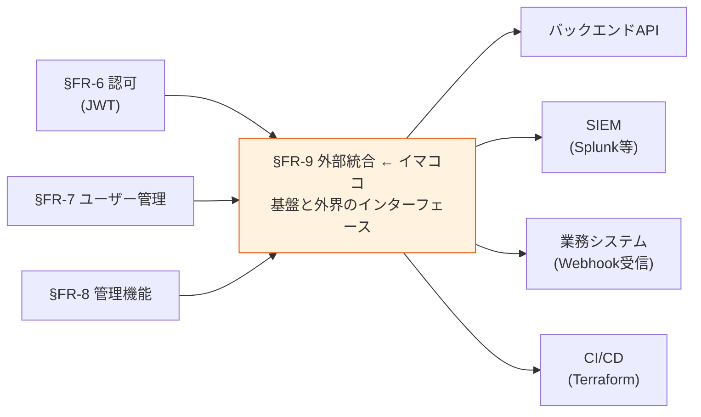
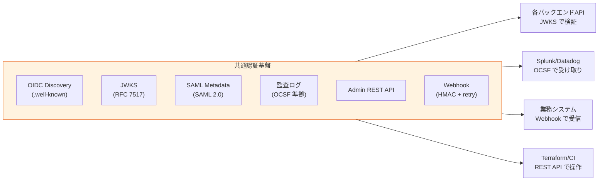

# §FR-9 外部統合

> 上位 SSOT: [00-index.md](00-index.md)
> 詳細: [../../functional-requirements.md §8 FR-INT](../../functional-requirements.md)
> カバー範囲: FR-INT §8.1 プロトコル / §8.2 ログ・監視 / §8.3 API・IaC・Webhook

---

## §FR-9.0 前提と背景

### 用語整理

| 用語 | 本基盤での意味 |
|---|---|
| **OIDC Discovery** | `.well-known/openid-configuration` で IdP の構成情報を公開する標準仕組み |
| **JWKS（JSON Web Key Set）** | 公開鍵を配布するエンドポイント（RFC 7517）。JWT 検証の中核 |
| **SAML Metadata** | SAML 2.0 で SP/IdP 設定を XML で公開する標準 |
| **OCSF**（Open Cybersecurity Schema Framework）| 監査ログ・セキュリティイベントの**ベンダーニュートラル標準スキーマ**。2022 年発表、2026 業界標準化 |
| **SIEM**（Security Information & Event Management）| Splunk / Datadog / Microsoft Sentinel 等のセキュリティ監視基盤 |
| **Webhook** | イベント発生時に基盤側から外部 URL へ HTTP POST する通知方式 |
| **IaC**（Infrastructure as Code）| Terraform 等で基盤設定をコード化、バージョン管理 |

### なぜここ（§FR-9）で決めるか

§FR-1-§FR-8 までは「**基盤の内部機能**」だった。§FR-9 は「**基盤と外界のインターフェース**」。
標準プロトコル準拠 + ログ出力 + API/Webhook が、基盤を **本当に "繋ぎ込める" もの**にする。

### §FR-9.0.A 本基盤の外部統合スタンス

> **業界標準プロトコル / 標準データスキーマに徹底準拠する。独自プロトコル・独自スキーマは作らない。これにより、不特定多数のシステム・SIEM・ツールと "繋ぎ込み" が容易になる。**

#### このスタンスの業界根拠

| 原則 | 出典 |
|---|---|
| **OIDC Discovery / JWKS は de-facto 標準** | "Multi-vendor support reduces integration friction, dozens of applications can trust same issuer" — RFC 7517/7519 |
| **OCSF が監査ログの新標準**（2026）| AWS / Splunk / IBM / Palo Alto / CrowdStrike が backing。Datadog Observability Pipelines が OCSF 変換を標準提供 |
| **Webhook 設計** | Stripe / GitHub / Shopify モデル：HMAC 署名 + idempotency + 指数バックオフリトライ |
| **IaC ベストプラクティス** | "Separate setup vs configuration codebase to prevent drift"、Terraform 公式プロバイダー利用 |

### 共通認証基盤として「外部統合」を検討する意義

| 観点 | 個別アプリで実装 | 共通認証基盤で実装 |
|---|---|---|
| プロトコル準拠 | アプリで OIDC/JWKS 実装 | **基盤側で標準準拠、アプリは検証だけ** |
| 監査ログ集約 | アプリごとに別フォーマット | **基盤側で OCSF 等標準化** |
| SIEM 連携 | アプリで個別実装 | **基盤側で 1 度連携、全認証イベントが流れる** |
| Webhook | アプリ間で個別実装 | **基盤側でイベント発火、複数アプリへ配信** |
| IaC | アプリで Cognito/Keycloak 操作 | **基盤側で IaC 一元管理、テナント追加も自動** |

→ 外部統合を基盤に集約することで、**プロトコル準拠 + 監視・運用効率 + 自動化**を一気に解決。

### 本章で扱うサブセクション

| サブセクション | 内容 | 関連 FR |
|---|---|---|
| §FR-9.1 プロトコル準拠 | OIDC / OAuth / SAML / JWKS / API Gateway 統合 | FR-INT-001〜004, 007 |
| §FR-9.2 ログ・監視 | 監査ログ外部出力 / SIEM 連携 / OCSF | FR-INT-008, 009 |
| §FR-9.3 API・IaC・Webhook | Admin REST API / Terraform / イベント通知 | FR-INT-005, 006, 010 |

---

## §FR-9.1 プロトコル準拠（→ FR-INT §8.1）

> **このサブセクションで定めること**: 本基盤が標準サポートする認証・認可プロトコル（OIDC / OAuth 2.0 / SAML 2.0 / JWKS）の範囲、および外部アプリ・API Gateway が本基盤と "繋ぎ込み" する際の技術的接点。
> **主な判断軸**: 業界標準への準拠度、VPC 内完結の要否、SAML サポートの要否
> **§FR-9.0 との関係**: §FR-9.0.A で示した「**業界標準に徹底準拠**」スタンスを、具体プロトコル単位で確定する

### 業界の現在地

**OIDC Discovery / JWKS は de-facto 標準（2026）**:
- 全主要 IdP（Microsoft Entra / Okta / Auth0 / Cognito / Keycloak）が `.well-known/openid-configuration` をサポート
- JWKS endpoint（RFC 7517）で公開鍵自動取得 → **鍵ローテーション透過**
- RFC 7517 / 7519 準拠で、SDK / Gateway が自動処理

**標準準拠の利点**:
- 「**Multiple vendors and cloud providers support OIDC, reducing integration friction**」
- 「**When multiple applications trust a shared identity provider, each relying party validates tokens independently using the JWKS, eliminating need to distribute shared secrets**」

### 我々のスタンス（北極星に基づく）

| 北極星の柱 | プロトコル準拠での実現 |
|---|---|
| **絶対安全** | JWT 署名検証 + 鍵自動ローテーション（JWKS）、TLS 通信必須 |
| **どんなアプリでも** | OIDC / SAML 準拠アプリ・SDK・Gateway なら全て接続可能 |
| **効率よく** | Discovery で自動構成、SDK が標準処理してくれる |
| **運用負荷・コスト最小** | 標準ライブラリで対応、自前検証ロジック不要 |

### 対応能力マトリクス

| 機能 | Cognito | Keycloak (OSS/RHBK) | PoC 検証 |
|---|:---:|:---:|:---:|
| OIDC 1.0 / OAuth 2.0 標準準拠 | ✅ | ✅ | ✅ |
| OIDC Discovery（`.well-known/openid-configuration`） | ✅ | ✅ | ✅ |
| JWKS 公開エンドポイント | ✅ AWS パブリック | ✅ ALB 経由 / VPC Endpoint | ✅ Phase 3, 9 |
| **VPC 内 JWKS**（プライベート化）| ✅ Cognito VPCE 経由 | ✅ Internal ALB（[ADR-012](../../../adr/012-vpc-lambda-authorizer-internal-jwks.md)）| ✅ Phase 9 |
| 鍵自動ローテーション | ✅ AWS 透過 | ✅ Realm Key Rotation 設定 | — |
| SAML 2.0 メタデータ | ✅ | ✅ | ❌ 未検証 |
| API Gateway / Lambda Authorizer 統合 | ✅ | ✅ | ✅ Phase 3 / VPC 版 Phase 9 |

### ベースライン

| 項目 | ベースライン |
|---|---|
| OIDC 1.0 標準準拠 | **Must** |
| JWKS 公開エンドポイント | **Must**（API Gateway 等のバックエンドが検証に使う）|
| OIDC Discovery | **Must**（クライアント自動構成）|
| VPC 内 JWKS 経路 | **Should**（[Phase 9 で検証済](../../../adr/012-vpc-lambda-authorizer-internal-jwks.md)、本番では推奨）|
| 鍵ローテーション | **自動**（Cognito 透過、Keycloak は設定）|
| SAML 2.0 メタデータ | Should（SAML 顧客向け、[§FR-2.1](02-federation.md#31-idp-接続種別--fr-fed-21) と連動）|
| TLS 通信 | **Must**（TLS 1.2+、[§NFR-4 セキュリティ](../nfr/00-index.md)）|

### TBD / 要確認

| 確認項目 | 回答例 |
|---|---|
| JWKS 経路の要件 | パブリック / VPC 内完結 / 両方 |
| SAML 2.0 メタデータ提供の必要性 | あり（SAML IdP 受け入れ）/ なし |
| 鍵ローテーション頻度 | 年 1 回 / 半年 / その他 |

---

## §FR-9.2 ログ・監視（→ FR-INT §8.2）

> **このサブセクションで定めること**: 認証・管理イベントを外部のログ基盤（CloudWatch / S3 / SIEM）にどう流すか、どのスキーマで標準化するか。
> **主な判断軸**: SIEM 採用有無、OCSF 準拠の要否、ログ保存先・形式
> **§FR-9.0 との関係**: 「**標準データスキーマ**」を OCSF として具体化。[§FR-8.2 監査・可視性](08-admin.md#92-監査可視性--fr-admin-72) で扱う「基盤側のログ生成」を、ここで「外部への流し方」として接続

### 業界の現在地

**OCSF（Open Cybersecurity Schema Framework）が監査ログの新標準（2026）**:
- 2022 年発表、AWS / Splunk / IBM / Palo Alto / CrowdStrike が backing
- **ベンダーニュートラル**な統一スキーマ → SIEM 切替時の移行コスト最小化
- Datadog Observability Pipelines が OCSF 変換を標準提供
- "Write detection rules once, apply across sources"（[§FR-8.2 監査](08-admin.md#92-監査可視性--fr-admin-72) と連動）

**主要 SIEM の対応状況**:

| SIEM | OCSF 対応 | 備考 |
|---|:---:|---|
| Splunk Enterprise Security | ✅ ネイティブ | 最も普及 |
| Datadog Cloud SIEM | ✅ Observability Pipelines 経由 | OCSF 変換も提供 |
| Microsoft Sentinel | ✅ | Azure ネイティブ |
| Amazon Security Lake | ✅ ネイティブ | AWS マネージド |
| CrowdStrike Falcon | ✅ | EDR 統合 |

### 我々のスタンス（北極星に基づく）

| 北極星の柱 | ログ・監視での実現 |
|---|---|
| **絶対安全** | 全認証イベント記録、改ざん防止（CloudTrail / S3 immutable）|
| **どんなアプリでも** | OCSF 準拠で SIEM 選定の自由度確保 |
| **効率よく** | 標準スキーマで検知ルール共通化、運用効率化 |
| **運用負荷・コスト最小** | Cognito = CloudTrail 標準、Keycloak = Event Listener + Datadog Pipelines |

### 対応能力マトリクス

| 機能 | Cognito | Keycloak (OSS/RHBK) | 備考 |
|---|:---:|:---:|---|
| 監査ログ外部出力（CloudWatch）| ✅ CloudTrail | ✅ Event Listener → CloudWatch | 両方 |
| S3 / Kinesis 出力 | ✅ CloudTrail → S3 | ⚠ Event Listener + Lambda カスタム | Cognito が楽 |
| **OCSF 形式出力** | ⚠ Datadog Pipelines 経由 | ⚠ Datadog Pipelines 経由 | 両方とも Pipelines 経由で OK |
| SIEM 連携(Splunk / Datadog) | ✅ CloudWatch → 標準コネクタ | ⚠ Event Listener + 自前転送 | Cognito が楽 |
| Amazon Security Lake 連携 | ✅ CloudTrail → Security Lake | ⚠ Event Listener + Security Lake | Cognito が楽 |
| ログ改ざん防止 | ✅ CloudTrail(**immutable**) | ⚠ 出力先次第 | Cognito 優位 |

### ベースライン

| 項目 | ベースライン |
|---|---|
| 認証イベントログ | **Must**（[§FR-8.2 監査](08-admin.md#92-監査可視性--fr-admin-72) と統一）|
| 外部出力先 | **CloudWatch を必ず**、追加で S3 / Kinesis / SIEM 任意 |
| ログ形式 | プラットフォーム標準（CloudTrail JSON / Event Listener JSON）+ **OCSF 変換オプション**（Datadog Pipelines / Security Lake）|
| 保存期間 | [§NFR-7 コンプラ](../nfr/00-index.md) に従う |
| SIEM 連携 | Should（顧客既存 SIEM 次第）|
| OCSF 採用 | **Should**（将来の SIEM 切替自由度確保）|

### TBD / 要確認

| 確認項目 | 回答例 |
|---|---|
| 既存 SIEM | Splunk / Datadog / Sentinel / Security Lake / なし |
| OCSF 採用方針 | 採用（推奨）/ ベンダー固有スキーマで OK / 不要 |
| ログ保存先 | CloudWatch のみ / S3 / 顧客 SIEM 直送 |
| 検知ルールの所有者 | 弊社運用 / 顧客企業 / 共同運用 |

---

## §FR-9.3 API・IaC・Webhook（→ FR-INT §8.3）

> **このサブセクションで定めること**: 本基盤を外部から **プログラマブルに操作・自動化**するためのインターフェース（管理 REST API・Terraform IaC・Webhook イベント通知）。
> **主な判断軸**: 自動化したい範囲（オンボーディング・連鎖処理）、Webhook 受信側システムの有無、IaC ツール選定
> **§FR-9.0 との関係**: 「**繋ぎ込み**」の運用自動化レイヤー。[§FR-8.1 基盤設定管理](08-admin.md#91-基盤設定管理--fr-admin-71) の IaC 方針と整合

### 業界の現在地

**1. Admin REST API**:
- Cognito = AWS SDK（全 SDK 言語）
- Keycloak = Admin REST API（OpenAPI 仕様）
- どちらも CRUD + 構成変更を網羅

**2. IaC（Terraform）**:
- AWS Cognito：AWS Provider が公式、成熟
- Keycloak：`keycloak/keycloak` Provider（公式、よくメンテナンスされている）
- **ベストプラクティス**：「**setup と configuration を分離**」（インフラ初期構築と Realm 設定を別 state で管理、drift 防止）

**3. Webhook（2026 ベストプラクティス）**:
- **HMAC 署名**（または短期 JWKS ベース署名）で改ざん防止
- **Idempotency**：stable event ID + transactional 処理
- **指数バックオフ + jitter** リトライ
- **同期 ACK + 非同期処理**（DLQ パターン）
- 参考モデル：Stripe / GitHub / Shopify

### 我々のスタンス（北極星に基づく）

| 北極星の柱 | API・IaC・Webhook での実現 |
|---|---|
| **絶対安全** | Webhook HMAC 署名必須、API は IAM/RBAC で保護 |
| **どんなアプリでも** | 標準 REST API、Terraform、HTTP Webhook で任意連携 |
| **効率よく** | IaC でテナント追加自動化、Webhook で連鎖処理自動化 |
| **運用負荷・コスト最小** | Cognito = AWS SDK 公式、Keycloak = OSS Provider 成熟 |

### 対応能力マトリクス

| 機能 | Cognito | Keycloak (OSS/RHBK) | 備考 |
|---|:---:|:---:|---|
| 管理 REST API | ✅ AWS SDK（全言語）| ✅ Admin REST API（OpenAPI 仕様）| 両方 |
| Terraform IaC | ✅ AWS Provider（成熟） | ✅ `keycloak/keycloak` Provider（公式）| 両方 |
| Terraform：Realm/User Pool 設定 | ✅ | ✅ | 両方 |
| **Webhook イベント通知** | ⚠ Pre/Post Lambda Trigger 経由 | ✅ **Event Listener**（標準）| Keycloak が楽 |
| HMAC 署名 Webhook | ⚠ Lambda 内で実装 | ⚠ Event Listener カスタム | 両方カスタム |
| Webhook リトライ・DLQ | ⚠ Lambda + SQS DLQ | ⚠ Event Listener + 自前 | 両方カスタム |
| OpenAPI / Swagger 仕様公開 | ⚠ AWS SDK 内部 | ✅ 公式 OpenAPI 仕様 | Keycloak 優位 |

### ベースライン

| 項目 | ベースライン |
|---|---|
| Admin REST API | **Must**（プラットフォーム標準提供）|
| Terraform IaC | **Must**（[§FR-8.1 基盤設定管理](08-admin.md#91-基盤設定管理--fr-admin-71) と統一）|
| Webhook イベント通知 | **Should**（顧客アプリ要件次第）|
| Webhook 設計 | **HMAC 署名 + idempotency + 指数バックオフ + DLQ**（業界標準パターン）|
| 通知イベント例 | `user.created` / `user.deleted` / `user.disabled` / `mfa.enrolled` / `session.revoked` |
| API 認可 | IAM（Cognito）/ Realm Admin Role（Keycloak）|

### TBD / 要確認

| 確認項目 | 回答例 |
|---|---|
| Webhook 通知の要否 | 必須（連鎖処理あり）/ 不要 |
| 通知したいイベント種別 | user.* / mfa.* / session.* / all |
| Webhook 受信側 | 内製アプリ / 外部 SaaS（Slack 等） |
| IaC ツール | Terraform / AWS CDK / Pulumi |
| API 利用者 | 弊社運用 / 顧客テナント管理者 / 自動化スクリプト |

---

### 参考資料（§FR-9 全体）

#### プロトコル

- [OpenID Connect Discovery 1.0 公式](https://openid.net/specs/openid-connect-discovery-1_0-21.html)
- [RFC 7517 JSON Web Key (JWK)](https://www.rfc-editor.org/rfc/rfc7517)
- [JWKS Endpoint 解説 - Descope](https://www.descope.com/learn/post/jwks)
- [OIDC for Enterprises 2026 - Security Boulevard](https://securityboulevard.com/2026/02/guide-to-setting-up-openid-connect-for-enterprises/)

#### ログ・SIEM・OCSF

- [OCSF 公式](https://schema.ocsf.io/)
- [What is OCSF - Datadog](https://www.datadoghq.com/knowledge-center/ocsf/)
- [Datadog Observability Pipelines OCSF Stream](https://www.datadoghq.com/blog/observability-pipelines-stream-logs-in-ocsf-format/)
- [Top 10 SIEM Tools 2026 - SentinelOne](https://www.sentinelone.com/cybersecurity-101/data-and-ai/siem-tools/)

#### Webhook / IaC

- [Webhook Reliability Best Practices 2026 - DocsForDevs](https://www.docsfordevs.com/blog/webhook-reliability-best-practices)
- [Building Reliable Webhook Delivery 2026 - DEV](https://dev.to/young_gao/building-reliable-webhook-delivery-retries-signatures-and-failure-handling-40ff)
- [Stripe Webhook Best Practices 2026](https://hookray.com/blog/stripe-webhook-best-practices-2026)
- [Terraform Keycloak Provider 公式](https://github.com/keycloak/terraform-provider-keycloak)
- [Terraform IdP Automation Platform - Medium](https://sourabh-virdi.medium.com/building-a-comprehensive-terraform-identity-provider-automation-platform-d706f76dae5e)
