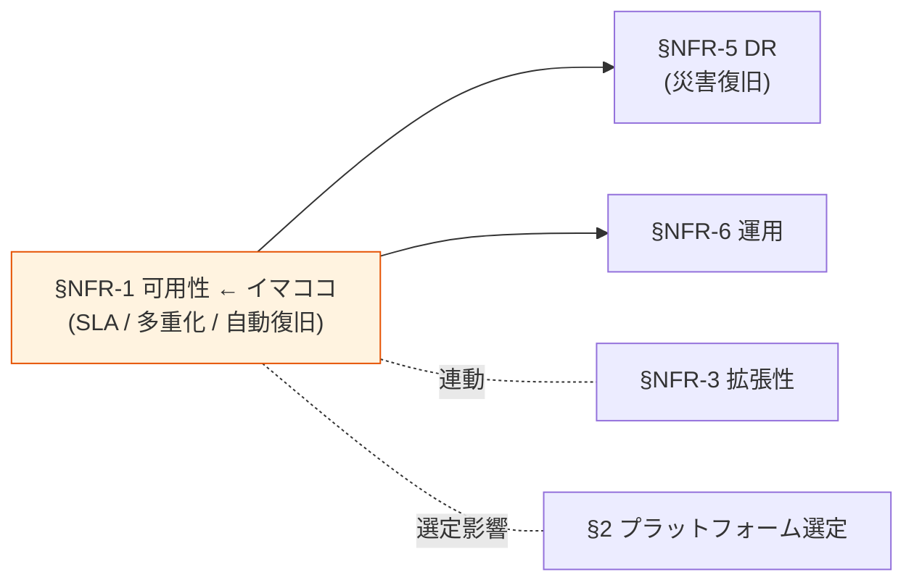

# §NFR-1 可用性

> 上位 SSOT: [../00-index.md](../00-index.md) / [00-index.md](00-index.md)
> 詳細: [../../non-functional-requirements.md §1 NFR-AVL](../../non-functional-requirements.md)
> **IPA 非機能要求グレード対応**: **A. 可用性** — 継続性 / 耐障害性 / 災害対策（一部）

---

## §NFR-1.0 前提と背景

### 用語整理

| 用語 | 本基盤での意味 |
|---|---|
| **SLA**（Service Level Agreement） | 稼働率の契約値（99.9% / 99.95% / 99.99%） |
| **SLO / SLI** | サービスレベル目標 / 指標 |
| **Multi-AZ** | AWS の複数アベイラビリティゾーンに冗長配置 |
| **計画メンテナンス窓** | 予定停止時間（深夜帯等） |
| **自動復旧** | 障害検知 → 自動でのフェイルオーバー / コンテナ再起動 |
| **ゼロダウンデプロイ** | サービス停止なしのリリース（Blue/Green / Rolling）|

### なぜここ（§NFR-1）で決めるか

可用性は **「サービスが止まらない」** ことを保証する根本要件。SLA 目標値が決まると、Multi-AZ 設計・自動復旧戦略・運用体制が連動して定まる。**Cognito は AWS 99.9% SLA を透過提供**するのに対し、**Keycloak は自前 HA 設計が必要**で、ここがプラットフォーム選定の重要論点。

### §NFR-1.0.A 本基盤の可用性スタンス

> **顧客の業務継続性に直結するため、SLA は 99.9% を最低ライン、要件次第で 99.95% / 99.99% を選択。Cognito は AWS 透過、Keycloak は Multi-AZ HA 設計を採用する。**

### IPA グレード A. 可用性 とのマッピング

| IPA 中項目 | 本基盤 §NFR-1 該当 | 補足 |
|---|---|---|
| A.1 継続性 | §NFR-1.1 サービス稼働率 / §NFR-1.2 業務停止時間 | SLA 99.9〜99.99% |
| A.2 耐障害性 | §NFR-1.3 Multi-AZ / §NFR-1.4 自動復旧 | コンテナ / DB / ALB 冗長化 |
| A.3 災害対策 | → [§NFR-5 DR](05-dr.md) で詳述 | 関連章 |
| A.4 復旧可能性 | → [§NFR-5 DR](05-dr.md) で詳述 | RTO/RPO |

### 共通認証基盤として「可用性」を検討する意義

| 観点 | 個別アプリで実装 | 共通認証基盤で実装 |
|---|---|---|
| 認証停止の影響 | 1 アプリだけ停止 | **全アプリが利用不可**（影響範囲大）|
| HA 設計負荷 | アプリごとに対応 | **基盤側で集約** |
| SLA 一元保証 | アプリごとに別 SLA | **基盤 SLA = 全アプリの認証 SLA** |

→ 認証は SPOF になりがちな機能。基盤側で**99.9% 以上**を保証することで、各アプリの可用性も底上げされる。

### 本章で扱うサブセクション

| サブセクション | 内容 |
|---|---|
| §NFR-1.1 サービス稼働率 SLA | 99.9 / 99.95 / 99.99% の選択軸 |
| §NFR-1.2 計画メンテナンス窓 | 月 N 時間 / 深夜帯 |
| §NFR-1.3 Multi-AZ 配置 | 冗長性の標準 |
| §NFR-1.4 自動復旧 | 障害検知 + 復旧の自動化 |
| §NFR-1.5 ゼロダウンデプロイ | Blue/Green or Rolling |

---

## §NFR-1.1 サービス稼働率 SLA

> **このサブセクションで定めること**: 本基盤の **稼働率目標値**（年間ダウンタイム許容範囲）と、その達成にあたっての設計方針。
> **主な判断軸**: 顧客業務継続性の要求、99.9% / 99.95% / 99.99% のいずれを目指すか
> **§NFR-1 全体との関係**: §NFR-1 の中核となる KPI。他の §NFR-1.2〜§NFR-1.5 はこの SLA 達成のための手段

### 業界の現在地

| SLA | 年間ダウンタイム | 月間 | 週間 | 主要 IdP の標準 |
|---|---|---|---|---|
| 99.9% | 約 8.76 時間 | 43.8 分 | 10.1 分 | **AWS Cognito（標準 SLA）** |
| 99.95% | 約 4.38 時間 | 21.9 分 | 5.0 分 | Microsoft Entra ID（Premium）|
| 99.99% | 約 52.6 分 | 4.4 分 | 1.0 分 | エンタープライズ最高水準 |

### 我々のスタンス（北極星に基づく）

| 北極星の柱 | 可用性での実現 |
|---|---|
| **絶対安全** | 認証停止は全アプリ影響の重大インシデント。Multi-AZ + 自動復旧 + SLA 担保 |
| **どんなアプリでも** | 標準 SLA で全顧客にサービス提供、要件次第で上位 SLA |
| **効率よく** | マネージドで透過対応（Cognito）|
| **運用負荷・コスト最小** | 99.9% は標準提供で人手不要、99.99% は追加設計が必要 |

### 対応能力マトリクス

| 項目 | Cognito | Keycloak (OSS/RHBK) |
|---|:---:|:---:|
| 99.9% SLA | ✅ **AWS 標準 SLA**（透過） | ⚠ 自前 Multi-AZ + Auto Scaling 設計 |
| 99.95% SLA | ⚠ AWS Compute SLA 要確認 | ⚠ HA 設計強化 + 監視強化 |
| 99.99% SLA | ⚠ Multi-Region active-active 要 | ⚠ Aurora Global DB + Multi-Region |

### ベースライン

| 項目 | 推奨デフォルト | 設定可能範囲 |
|---|---|---|
| サービス稼働率 | **99.9%**（最低ライン）| 99.9% / 99.95% / 99.99% |
| 計測対象 | 認証エンドポイント（OIDC / SAML） | — |
| 除外条件 | 計画メンテナンス窓 / 顧客起因 | — |

### TBD / 要確認

| 確認項目 | 回答例 |
|---|---|
| 目標 SLA | 99.9% / 99.95% / 99.99% |
| 計測の責任分界点 | 認証エンドポイントまで / バックエンドまで |
| SLA 違反時のペナルティ | あり（クレジット）/ なし |

---

## §NFR-1.2 計画メンテナンス窓

> **このサブセクションで定めること**: 計画停止可能な時間帯と頻度。
> **主な判断軸**: 24/7 サービスかどうか、グローバル運用の有無
> **§NFR-1 全体との関係**: SLA 計算から除外される時間。窓を確保することでパッチ・バージョンアップが容易になる

### ベースライン

| 項目 | 推奨デフォルト |
|---|---|
| 計画メンテナンス | 月 1 回、深夜 2-4 時 |
| 事前通知 | 7 日前 |
| Cognito 側 | ✅ AWS 透過（顧客には影響なし） |
| Keycloak 側 | Blue/Green デプロイで実質ゼロダウン化 |

### TBD / 要確認

| 確認項目 | 回答例 |
|---|---|
| メンテ窓の許容時間帯 | 深夜 / 早朝 / 週末 / なし |
| 通知リードタイム | 即日 / 1 週間 / 1 か月 |

---

## §NFR-1.3 Multi-AZ 配置

> **このサブセクションで定めること**: AWS の複数 AZ への冗長配置の要否。
> **主な判断軸**: SLA 目標（99.9% 以上なら Must）
> **§NFR-1 全体との関係**: SLA 達成の物理的基盤。Keycloak 採用時は ECS Multi-AZ + Aurora Multi-AZ が必須

### ベースライン

| 項目 | Cognito | Keycloak |
|---|---|---|
| AZ 配置 | ✅ **AWS 自動**（透過） | ⚠ **明示的に設計必要**（ECS / Aurora / ALB すべて Multi-AZ）|
| 推奨 AZ 数 | — | 2-3 AZ |

### TBD / 要確認

| 確認項目 | 回答例 |
|---|---|
| Multi-AZ Must | はい / SLA 99.9% なら自然に Must |

---

## §NFR-1.4 自動復旧

> **このサブセクションで定めること**: 障害検知 → 自動でのフェイルオーバー / コンテナ再起動の仕組み。
> **主な判断軸**: コンテナ単位 / インスタンス単位 / DB の自動切替
> **§NFR-1 全体との関係**: SLA 達成と運用負荷削減の核

### ベースライン

| 機能 | Cognito | Keycloak |
|---|:---:|:---:|
| コンテナ自動再起動 | ✅ AWS 透過 | ✅ ECS Service Auto Heal（PoC 検証済）|
| DB 自動フェイルオーバー | ✅ AWS 透過 | ✅ Aurora / RDS Multi-AZ |
| ALB ヘルスチェック | ✅ | ✅ |
| 単一障害点（SPOF）排除 | ✅ | ⚠ RDS / ALB 冗長化設計が必要 |

---

## §NFR-1.5 ゼロダウンデプロイ

> **このサブセクションで定めること**: 新バージョンリリース時のサービス停止有無。
> **主な判断軸**: Blue/Green or Rolling Update
> **§NFR-1 全体との関係**: 計画メンテ窓を実質ゼロ化する手段

### ベースライン

| 機能 | Cognito | Keycloak |
|---|:---:|:---:|
| ゼロダウンデプロイ | ✅ **AWS 透過**（ユーザー意識不要）| ⚠ Rolling Update 設計が必要 |

---

## 参考資料

- [AWS Cognito SLA](https://aws.amazon.com/cognito/sla/)
- [IPA 非機能要求グレード 2018 - A. 可用性](https://www.ipa.go.jp/archive/digital/iot-en-ci/jyouryuu/hikinou/index.html)
- [Keycloak HA Production Setup](https://www.keycloak.org/server/configuration-production)
