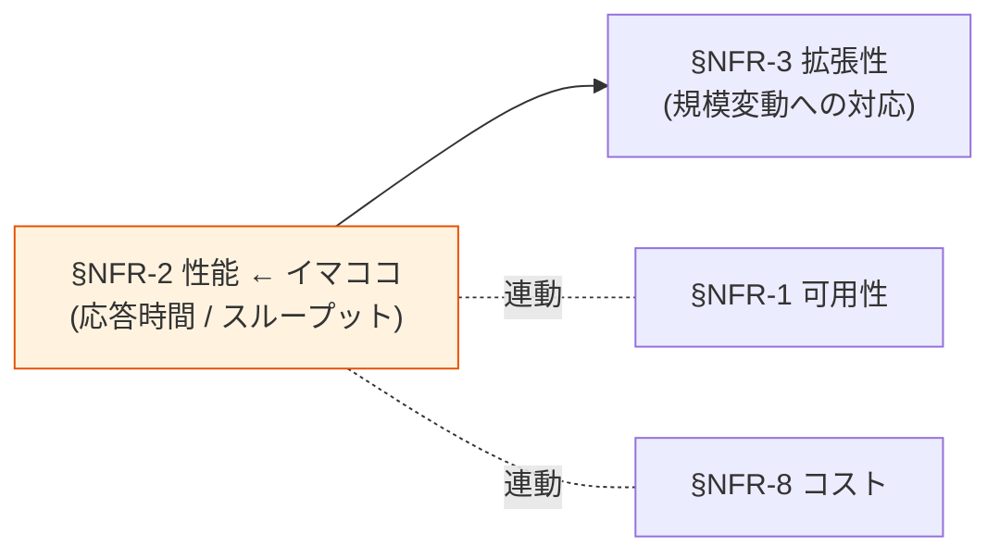

# §NFR-2 性能

> 上位 SSOT: [../00-index.md](../00-index.md) / [00-index.md](00-index.md)
> 詳細: [../../non-functional-requirements.md §2 NFR-PERF](../../non-functional-requirements.md)
> **IPA 非機能要求グレード対応**: **B. 性能・拡張性** — 業務処理量 / 性能目標値

---

## §NFR-2.0 前提と背景

### 用語整理

| 用語 | 本基盤での意味 |
|---|---|
| **応答時間（Latency）** | 1 リクエストの処理時間。P50 / P95 / P99 で評価 |
| **スループット（Throughput）** | 単位時間あたりの処理リクエスト数（req/sec） |
| **ピーク倍率** | 通常時に対する最大負荷比率（始業時 N 倍） |
| **JWKS キャッシュ** | 公開鍵キャッシュの TTL。検証性能に直結 |
| **Rate Limit** | API レベルの流量制限 |

### なぜここ（§NFR-2）で決めるか

性能要件は **顧客の UX に直結**。応答が遅いと業務に支障が出る。Cognito は AWS 透過で標準的にスケール、Keycloak は ECS スペック設計とチューニング次第。**[§NFR-3 拡張性](03-scalability.md)** とセットで議論。

### §NFR-2.0.A 本基盤の性能スタンス

> **認証応答時間は P95 < 1 秒、P99 < 2 秒を最低ライン。ピーク時（始業時等）の N 倍負荷にも自動スケールで対応する。**

### IPA グレード B. 性能・拡張性 とのマッピング

| IPA 中項目 | 本基盤 §NFR-2 該当 | 補足 |
|---|---|---|
| B.1 業務処理量 | §NFR-2.2 スループット | 同時認証リクエスト数 |
| B.2 性能目標値 | §NFR-2.1 応答時間 | P50 / P95 / P99 |
| B.3 リソース拡張性 | → [§NFR-3 拡張性](03-scalability.md) | 関連章 |
| B.4 性能品質保証 | §NFR-2.3 性能監視 | SLI / SLO |

### 本章で扱うサブセクション

| サブセクション | 内容 |
|---|---|
| §NFR-2.1 応答時間 / レイテンシ | P50 / P95 / P99 目標値 |
| §NFR-2.2 スループット | 同時認証 req/sec |
| §NFR-2.3 ピーク耐性 | 始業時等の N 倍負荷対応 |

---

## §NFR-2.1 応答時間 / レイテンシ

> **このサブセクションで定めること**: 認証・トークン発行・JWT 検証の各リクエストの**応答時間目標値**。
> **主な判断軸**: ユーザー体感（UX）、業務影響、SLI/SLO 設定
> **§NFR-2 全体との関係**: 性能目標の中核。ベンチマーク値で Cognito vs Keycloak 比較も可能

### 業界の現在地

**10,000 concurrent users ベンチマーク（業界調査、johal.in 2026）**:

| プラットフォーム | P99 レイテンシ | スループット |
|---|---|---|
| **AWS Cognito 2026** | 194ms | 5,700 auth/sec |
| **Keycloak 22** | **112ms**（42% 低い）| **8,200 auth/sec**（44% 多い）|

→ **大規模・高負荷では Keycloak が性能優位**、ただし運用工数は 3.2 倍

### 我々のスタンス（北極星に基づく）

| 北極星の柱 | 性能での実現 |
|---|---|
| **絶対安全** | 性能劣化が認証停止に直結しないよう監視 + 自動スケール |
| **どんなアプリでも** | SPA / SSR / Mobile / M2M すべて同じ性能水準 |
| **効率よく** | JWKS キャッシュで JWT 検証高速化（< 10ms HIT）|
| **運用負荷・コスト最小** | マネージドで透過対応（Cognito）or 自動スケーリング設計（Keycloak）|

### 対応能力マトリクス

| 項目 | Cognito | Keycloak (OSS/RHBK) | PoC 検証 |
|---|:---:|:---:|:---:|
| 認証応答時間 P95 | < 1s（AWS 内） | 数百 ms（PoC 観測） | ✅ |
| 認証応答時間 P99 | ~194ms（10k 同時）| **~112ms**（10k 同時） | — |
| Lambda Authorizer 応答 | ✅ 15-60ms（PoC）| ✅ 同 Lambda（同性能） | ✅ Phase 3 |
| JWT 検証スループット | > 1,000 req/s | > 1,000 req/s | ✅ |
| JWKS キャッシュ TTL | デフォルト | 1 時間（Lambda 内） | ✅ |

### ベースライン

| 項目 | 推奨デフォルト | 設定可能範囲 |
|---|---|---|
| 認証応答時間 P95 | **< 1 秒** | < 0.5 秒 〜 < 2 秒 |
| 認証応答時間 P99 | **< 2 秒** | < 1 秒 〜 < 3 秒 |
| Lambda Authorizer | キャッシュ HIT < 10ms / MISS < 100ms | — |
| JWT 検証 | > 1,000 req/s | — |
| JWKS キャッシュ TTL | **1 時間** | 5 分〜24 時間 |

### TBD / 要確認

| 確認項目 | 回答例 |
|---|---|
| 目標 P95 / P99 | < 1s / < 2s が妥当か |
| 計測対象エンドポイント | /authorize / /token / /jwks 全部 / 主要のみ |

---

## §NFR-2.2 スループット

> **このサブセクションで定めること**: 同時認証リクエスト処理能力。
> **主な判断軸**: 想定 MAU、ピーク時間帯倍率
> **§NFR-2 全体との関係**: MAU 規模から逆算する。[§NFR-3 拡張性](03-scalability.md) と直結

### 業界の現在地

- Cognito: **AWS スケーラブル**（ただし `InitiateAuth` / `AdminInitiateAuth` 等に Account-level rate limit あり、Service Quotas で要事前確認）
- Keycloak: **ECS Auto Scaling 設計が必要**（事前計算）

### 対応能力マトリクス

| 項目 | Cognito | Keycloak |
|---|:---:|:---:|
| 同時認証処理 | ⚠ スケーラブル（一部 API に rate limit）| ⚠ ECS Auto Scaling 設計要 |
| API Gateway スロットリング | ✅ Cognito API Rate Limit 別途 | — |

### TBD / 要確認

| 確認項目 | 回答例 |
|---|---|
| 想定スループット | N req/s |
| MAU 規模 | N 万 |

---

## §NFR-2.3 ピーク耐性

> **このサブセクションで定めること**: 始業時等の **N 倍負荷**への対応能力。
> **主な判断軸**: 通常時 vs ピーク倍率、自動スケール速度
> **§NFR-2 全体との関係**: スループット要件と連動

### ベースライン

| 項目 | Cognito | Keycloak |
|---|:---:|:---:|
| ピーク自動スケール | ✅ **AWS 自動**（透過） | ⚠ **ECS 事前スケールアウト設計**（時間帯指定スケール） |
| 推奨ピーク倍率 | — | **始業時 N 倍**を想定して事前計算 |

### TBD / 要確認

| 確認項目 | 回答例 |
|---|---|
| ピーク時間帯 | 始業時 / 月初 / 特定イベント |
| ピーク倍率 | 通常時の 2-10 倍 |

---

## 参考資料

- [Keycloak vs Cognito 10k concurrent benchmark - johal.in 2026](https://johal.in/benchmark-keycloak-220-vs-aws-cognito-2026-10k/)
- [AWS Cognito Service Quotas](https://docs.aws.amazon.com/cognito/latest/developerguide/limits.html)
- [IPA 非機能要求グレード 2018 - B. 性能・拡張性](https://www.ipa.go.jp/archive/digital/iot-en-ci/jyouryuu/hikinou/index.html)
