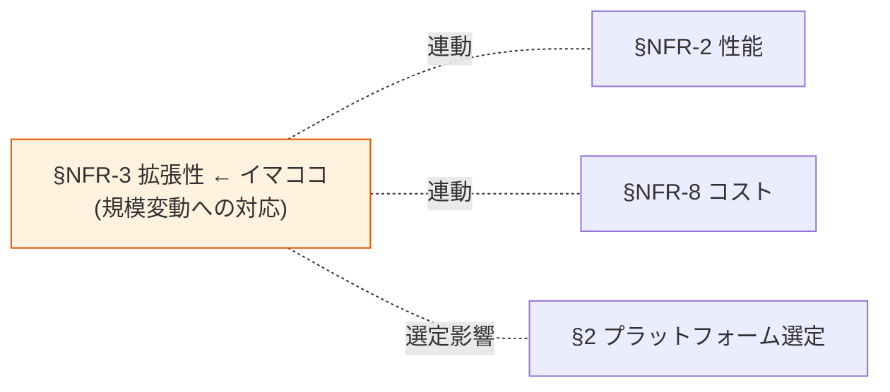

# §NFR-3 拡張性

> 上位 SSOT: [../00-index.md](../00-index.md) / [00-index.md](00-index.md)
> 詳細: [../../non-functional-requirements.md §3 NFR-SCL](../../non-functional-requirements.md)
> **IPA 非機能要求グレード対応**: **B. 性能・拡張性** — 拡張性 / 性能品質保証

---

## §NFR-3.0 前提と背景

### 用語整理

| 用語 | 本基盤での意味 |
|---|---|
| **MAU**（Monthly Active User）| 月間アクティブユーザー数。Cognito の課金単位 |
| **IdP 接続数** | 受け入れる外部 IdP 数 |
| **マルチリージョン** | 複数 AWS リージョンへの展開 |
| **自動スケーリング** | 負荷に応じたインスタンス自動増減 |

### なぜここ（§NFR-3）で決めるか

拡張性は **「規模が変動しても性能を維持」** する能力。MAU 規模次第で**Cognito vs Keycloak の損益分岐**が決まるため、本基盤のプラットフォーム選定に直結する（[§2 プラットフォーム選定](../common/02-platform.md)）。

### §NFR-3.0.A 本基盤の拡張性スタンス

> **顧客企業数 100〜1000 社、MAU 1 万〜100 万を想定。AWS マルチアカウント前提で水平スケール可能な設計を採る。**

### IPA グレード B. 性能・拡張性 とのマッピング

| IPA 中項目 | 本基盤 §NFR-3 該当 | 補足 |
|---|---|---|
| B.3 リソース拡張性 | §NFR-3.1 MAU スケール / §NFR-3.2 IdP 拡張 | スケールアウト方式 |
| B.4 性能品質保証 | §NFR-3.3 自動スケーリング | 監視 + Auto Scaling |
| B.5 ロケーション拡張 | §NFR-3.4 マルチリージョン | グローバル展開時 |

### 本章で扱うサブセクション

| サブセクション | 内容 |
|---|---|
| §NFR-3.1 MAU スケール | 1 年後 / 3 年後の規模、損益分岐 |
| §NFR-3.2 IdP 拡張 | 顧客 IdP 追加リードタイム |
| §NFR-3.3 自動スケーリング | 負荷追従性 |
| §NFR-3.4 マルチリージョン | グローバル展開対応 |

---

## §NFR-3.1 MAU スケール

> **このサブセクションで定めること**: 想定 MAU 規模と、その規模に基づくプラットフォーム選定。
> **主な判断軸**: 1 年後 / 3 年後 MAU、コスト損益分岐
> **§NFR-3 全体との関係**: 規模が決まると性能・コストが決まる中核 KPI

### 業界の現在地

- Cognito: 数千万 MAU 実績、**10K MAU 無料枠**
- Keycloak: **10K IdPs（顧客企業）** 性能劣化なし実証あり、MAU 規模はインフラ次第

### 対応能力マトリクス

| 規模 | Cognito | Keycloak | 推奨 |
|---|:---:|:---:|---|
| 〜10K MAU | ✅ 無料枠 | ⚠ インフラ最小 ~$987/月 | **Cognito Lite/Essentials** |
| 10K〜17.5 万 MAU | ✅ 標準提供 | ⚠ 運用負荷増 | **Cognito** |
| 17.5 万 MAU〜 | ⚠ コスト増 | ✅ コスト優位 | **Keycloak**（要 DevOps）|
| 100 万 MAU+ | ⚠ 大コスト | ✅ 圧倒的優位 | **Keycloak OSS** |

→ **損益分岐：約 17.5 万 MAU**（[ADR-006](../../../adr/006-cognito-vs-keycloak-cost-breakeven.md)、Plus ティア利用時は約 7.5 万 MAU）

### ベースライン

| 項目 | 推奨デフォルト |
|---|---|
| 1 年後 MAU | 顧客と確認（[§NFR-8 コスト](08-cost.md) と連動） |
| 3 年後 MAU | 顧客と確認 |
| スケール戦略 | 規模次第で Cognito ティア昇格 → Keycloak への昇格パスを残す |

### TBD / 要確認

| 確認項目 | 回答例 |
|---|---|
| 1 年後 MAU | N 万 |
| 3 年後 MAU | M 万 |
| 急成長見込み | あり（5x 以上）/ なし |

---

## §NFR-3.2 IdP 拡張

> **このサブセクションで定めること**: 顧客 IdP 追加のリードタイムと、登録可能な上限。
> **主な判断軸**: 顧客企業数の成長見込み、オンボーディング自動化
> **§NFR-3 全体との関係**: [§FR-2.3 マルチテナント運用](../fr/02-federation.md#fr-23-マルチテナント運用--fr-fed-23) と連動

### 業界の現在地

- Cognito: User Pool に複数 IdP 登録可、数百規模実用上 OK
- Keycloak: **10K IdPs 性能劣化なし**実証あり

### ベースライン

| 項目 | 推奨デフォルト |
|---|---|
| IdP 接続上限 | Cognito 数百 / Keycloak 1000+ |
| IdP 追加リードタイム | **< 1 営業日**（[§FR-2.3.2](../fr/02-federation.md#fr-232-顧客追加オンボーディング--fr-fed-011) 連動）|
| 自動化 | Terraform IaC |

---

## §NFR-3.3 自動スケーリング

> **このサブセクションで定めること**: 負荷に応じた自動スケールの方針と監視。
> **主な判断軸**: スケール速度、しきい値、コスト最適化
> **§NFR-3 全体との関係**: [§NFR-2.3 ピーク耐性](02-performance.md) の実現手段

### ベースライン

| 機能 | Cognito | Keycloak |
|---|:---:|:---:|
| 自動スケール | ✅ **AWS 透過** | ⚠ **ECS Auto Scaling 設計要**（CPU / メモリ / RPS しきい値）|
| 推奨設定 | — | CPU 70% / メモリ 70% / 最小 2 タスク |

---

## §NFR-3.4 マルチリージョン

> **このサブセクションで定めること**: 複数 AWS リージョンへの展開要件。
> **主な判断軸**: グローバル展開計画、レイテンシ要件、DR
> **§NFR-3 全体との関係**: [§NFR-5 DR](05-dr.md) と密接。グローバル active-active は本格的なインフラ投資

### ベースライン

| 機能 | Cognito | Keycloak |
|---|:---:|:---:|
| マルチリージョン | ✅ User Pool 別リージョン作成（手動） | ⚠ Aurora Global DB + ECS Multi-Region 設計要 |
| DR との関係 | [§NFR-5 DR](05-dr.md) で詳述 | 同左 |

### TBD / 要確認

| 確認項目 | 回答例 |
|---|---|
| マルチリージョン要否 | あり（グローバル）/ なし（国内のみ）|
| 主要リージョン | 東京 + 大阪 / + 海外 |

---

## 参考資料

- [ADR-006 Cognito vs Keycloak Cost Breakeven](../../../adr/006-cognito-vs-keycloak-cost-breakeven.md)
- [Keycloak Scalability of IdPs - GitHub Issue](https://github.com/keycloak/keycloak/issues/30084)
- [IPA 非機能要求グレード 2018 - B. 性能・拡張性](https://www.ipa.go.jp/archive/digital/iot-en-ci/jyouryuu/hikinou/index.html)
