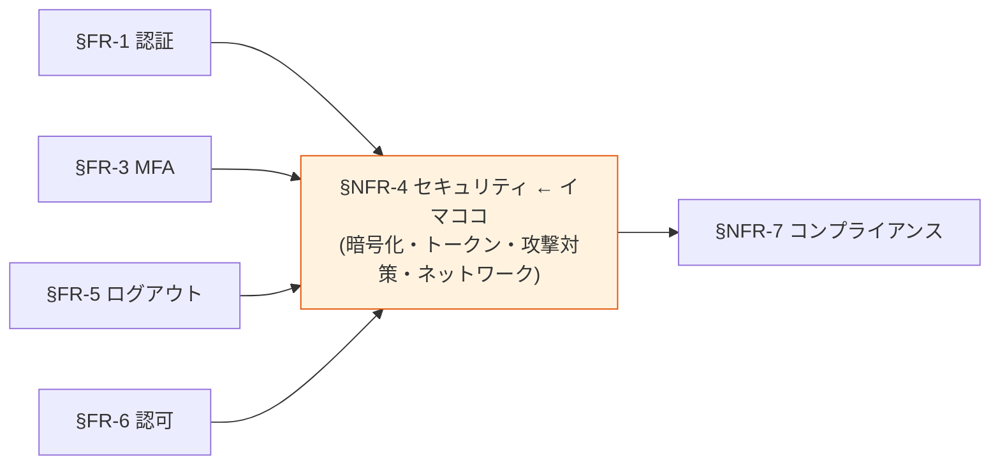
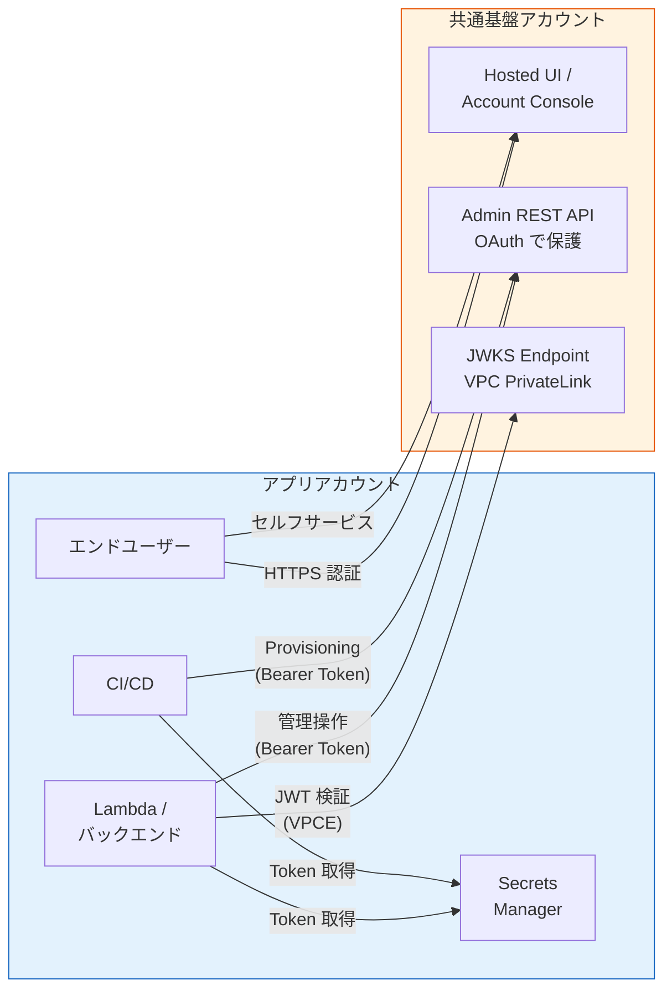

# §NFR-4 セキュリティ

> 上位 SSOT: [../00-index.md](../00-index.md) / [00-index.md](00-index.md)   
> 詳細: [../../non-functional-requirements.md §4 NFR-SEC](../../non-functional-requirements.md)   
> **IPA 非機能要求グレード対応**: **E. セキュリティ** — 認証 / アクセス制限 / データ秘匿 / 不正追跡・監査 / マルウェア対策 / Web 対策

---

## §NFR-4.0 前提と背景

### 用語整理

| 用語 | 本基盤での意味 |
|---|---|
| **TLS** | 通信暗号化（HTTPS）|
| **KMS** | AWS Key Management Service（鍵管理）|
| **PBKDF2 / bcrypt / Argon2** | パスワードハッシュアルゴリズム |
| **JWT 署名アルゴリズム** | RS256 / ES256 等 |
| **Refresh Token Rotation** | 単回使用、再利用検知でファミリー無効化 |
| **HIBP**（Have I Been Pwned）| 侵害クレデンシャル検出サービス |
| **WAF** | Web Application Firewall |
| **VPC Endpoint** | プライベートな AWS サービスアクセス |

### なぜここ（§NFR-4）で決めるか

セキュリティは **基本方針「絶対安全」の最大の柱**。認証基盤のセキュリティ侵害は全顧客に影響するため、業界標準を超える水準を目指す。本章は最大ボリュームで詳述。

### §NFR-4.0.A 本基盤のセキュリティスタンス

> **NIST SP 800-63B Rev 4 / OAuth 2.1 / OWASP Top 10 等の業界標準ベストプラクティスに準拠。暗号化・トークン管理・攻撃対策・ネットワーク境界の 4 領域で多層防御。**

### IPA グレード E. セキュリティ とのマッピング

| IPA 中項目 | 本基盤 §NFR-4 該当 | 補足 |
|---|---|---|
| E.1 前提条件・制約条件 | §NFR-4.0 | 規制 / 業界標準 |
| E.2 セキュリティリスク分析 | §NFR-4.0 / §NFR-4.3 | 脅威モデル |
| E.3 セキュリティ診断 | [§NFR-6.3](06-operations.md) | ペネトレーションテスト |
| E.4 セキュリティリスク管理 | [§NFR-7.2](07-compliance.md) | 業界認定 |
| E.5 アクセス・利用制限 | §NFR-4.4 ネットワーク・境界制御 | IP 制限 / VPN |
| E.6 データの秘匿 | §NFR-4.1 暗号化・鍵管理 | TLS / KMS / hash |
| E.7 不正追跡・監査 | [§FR-8 管理機能 §FR-8.2 監査](../fr/08-admin.md) + [§NFR-6 運用](06-operations.md) | CloudTrail |
| E.8 ネットワーク対策 | §NFR-4.4 | WAF / Private Subnet |
| E.9 マルウェア対策 | §NFR-4.3 攻撃対策 | 一部、認証基盤としては限定的 |
| E.10 Web 対策 | §NFR-4.3 / §NFR-4.4 | WAF / XSS / CSRF |
| E.11 セキュリティインシデント対応 | [§NFR-6.3 体制](06-operations.md) | SOC / 24/7 |

### 共通認証基盤として「セキュリティ」を検討する意義

| 観点 | 個別アプリで実装 | 共通認証基盤で実装 |
|---|---|---|
| 暗号化方式の統一 | アプリごとに別実装 | **基盤で一元、TLS/KMS/hash アルゴリズム統一** |
| トークン管理 | アプリごとに別ロジック | **基盤で TTL / Rotation / Revocation 統一** |
| 攻撃対策 | 各アプリで個別実装 | **基盤側でブルートフォース対策・WAF を集約** |
| 侵害検出 | アプリごとに無理 | **基盤側で HIBP 等を全顧客に提供** |

→ セキュリティを基盤に集約することで、**個別アプリでは到達不可能な水準**を全アプリに提供。

### 本章で扱うサブセクション

| サブセクション | 内容 |
|---|---|
| §NFR-4.1 暗号化・鍵管理 | TLS / KMS / hash / 署名アルゴリズム |
| §NFR-4.2 トークン・セッション | TTL / Rotation / Revocation |
| §NFR-4.3 攻撃対策 | BF / HIBP / DDoS / 脆弱性スキャン |
| §NFR-4.4 ネットワーク・境界制御 | WAF / Private Subnet / 管理画面アクセス / VPC Endpoint |

---

## §NFR-4.1 暗号化・鍵管理

> **このサブセクションで定めること**: 通信・データ・パスワード・シークレットの暗号化方式と鍵管理。   
> **主な判断軸**: TLS バージョン、ハッシュアルゴリズム、KMS 鍵ローテーション   
> **§NFR-4 全体との関係**: 多層防御の最下層（情報保護の物理的基盤）

### 業界の現在地

- **TLS**: 1.2+ が業界標準、1.3 が推奨（2026）
- **データ at-rest**: AES-256 (KMS) が標準
- **JWT 署名**: RS256 が広く使われる、ES256 が新世代
- **パスワードハッシュ**: PBKDF2 / bcrypt / Argon2（NIST SP 800-63B 推奨）

### 対応能力マトリクス

| 項目 | Cognito | Keycloak (OSS/RHBK) |
|---|:---:|:---:|
| TLS 1.2+ 強制 | ✅ AWS 強制 | ⚠ ACM + ALB 設定要 |
| データ暗号化（at-rest）| ✅ KMS 自動 | ✅ RDS storage_encrypted |
| JWT 署名アルゴリズム | ✅ RS256 | ✅ RS256 / ES256 選択可 |
| パスワードハッシュ | ✅ AWS 内部（透過）| ✅ PBKDF2-SHA512（デフォルト）|
| シークレット管理 | ✅ AWS Secrets Manager | ✅ Secrets Manager 連携 |
| KMS 鍵ローテーション | ✅ KMS 自動 | ⚠ Realm Key Rotation 設定 |

### ベースライン

| 項目 | 推奨デフォルト |
|---|---|
| 通信暗号化 | **TLS 1.2+** |
| データ at-rest | **AES-256（KMS）** |
| JWT 署名 | **RS256** |
| パスワードハッシュ | PBKDF2 / bcrypt / Argon2 |
| 暗号鍵ローテーション | 年 1 回以上（KMS 自動）|

---

## §NFR-4.2 トークン・セッション

> **このサブセクションで定めること**: アクセストークン / リフレッシュトークン / ID トークンの TTL、Refresh Token Rotation の方針。   
> **主な判断軸**: NIST AAL 整合（24h / 1h）、漏洩時被害最小化   
> **§NFR-4 全体との関係**: [§FR-5 ログアウト・セッション管理](../fr/05-logout-session.md) と整合

### 業界の現在地

**NIST SP 800-63B Rev 4 セッションタイムアウト推奨値（2024）**:

| AAL | 絶対経過 | アイドル |
|---|---|---|
| AAL2（推奨）| **24 時間** | **1 時間** |
| AAL3 | 12 時間 | 15 分 |

**JWT トークン TTL 2026 ベストプラクティス**: Access Token 15-60 分 / Refresh Token 30 日（rotation 前提）

### 対応能力マトリクス

| 機能 | Cognito | Keycloak |
|---|:---:|:---:|
| セッションタイムアウト設定 | ✅ App Client | ✅ Realm 設定 |
| Access Token TTL | ✅ | ✅ |
| **Refresh Token Rotation** | ⚠ **デフォルト OFF** | ✅ **デフォルト ON** |
| アイドルタイムアウト | ⚠ アプリ側 | ✅ Realm 設定 |
| **Access Token Revocation** | ❌ Refresh のみ | ✅ Token Revocation |

### ベースライン

| 項目 | 推奨デフォルト | NIST AAL 整合 |
|---|---|:---:|
| Access Token TTL | **30 分** | AAL2 ✅ |
| ID Token TTL | 15 分 | AAL2 ✅ |
| Refresh Token TTL | 30 日（rotation 前提）| — |
| 絶対経過 | 24 時間 | AAL2 ✅ |
| アイドル | 1 時間 | AAL2 ✅ |
| Refresh Token Rotation | **有効** | — |
| Reuse Detection | **有効** | — |

---

## §NFR-4.3 攻撃対策

> **このサブセクションで定めること**: ブルートフォース / 侵害クレデンシャル / DDoS / 脆弱性に対する防御策。   
> **主な判断軸**: NIST Rev 4 必須要件（侵害クレデンシャル検出）、業界規制   
> **§NFR-4 全体との関係**: 認証基盤に対する直接攻撃を防ぐ

### 業界の現在地

- **NIST SP 800-63B Rev 4**: 侵害クレデンシャル検出を**必須化**（2024）
- **HIBP**（Have I Been Pwned）: 業界標準のデータベース
- **DDoS**: AWS Shield Standard が無料で提供
- **脆弱性スキャン**: ECR Image Scan + Inspector

### 対応能力マトリクス

| 機能 | Cognito Lite/Essentials | Cognito Plus | Keycloak |
|---|:---:|:---:|:---:|
| ブルートフォース対策 | ⚠ 標準（パラメータ不可）| ✅ **Plus ティア**で詳細設定 | ✅ Realm Settings |
| **侵害クレデンシャル検出** | ❌ | ✅ **ネイティブ**（+$0.02/MAU）| ⚠ HIBP プラグイン（RHBK サポート対象外）|
| DDoS（Shield Standard）| ✅ AWS 標準 | ✅ | ✅ |
| 脆弱性スキャン | — | — | ✅ ECR Image Scan |
| ペネトレーションテスト | 顧客責任 | 顧客責任 | 顧客責任 |

### ベースライン

| 項目 | 推奨デフォルト |
|---|---|
| ブルートフォース | 連続失敗で一時ロック（5 回 / 30 分）|
| 侵害クレデンシャル検出 | **有効**（Cognito Plus or Keycloak+HIBP）|
| **Bot Detection / CAPTCHA** | **3 層防御**（WAF Bot Control + ATP + Turnstile Invisible）→ 詳細 [ADR-042](../../../adr/042-bot-detection-captcha.md) |
| DDoS 対策 | Shield Standard（AWS 標準）|
| ペネトレーションテスト | 年 1 回（顧客要件次第）|
| 脆弱性スキャン | ECR Image Scan + Inspector |

### TBD / 要確認

| 確認項目 | 回答例 |
|---|---|
| 侵害クレデンシャル検出 Must | はい（Cognito Plus / Keycloak+HIBP）/ いいえ |
| ペネトレーションテスト頻度 | 年 N 回 / なし |
| **Bot Detection 製品** | **AWS WAF Bot Control + Turnstile（推奨）**/ Akamai Bot Manager / DataDome |
| **WAF ATP（ログイン Credential Stuffing 検知）** | 採用（推奨）/ 不採用 |
| **CAPTCHA 製品** | Cloudflare Turnstile（推奨、プライバシー配慮）/ reCAPTCHA v3 / hCaptcha / AWS WAF Captcha |

---

## §NFR-4.9 Bot Detection / Credential Stuffing 対策

> **詳細は [ADR-042 Bot Detection / CAPTCHA 設計](../../../adr/042-bot-detection-captcha.md) を参照**

> **このサブセクションで定めること**: 認証エンドポイントへの自動化攻撃（Credential Stuffing / Brute Force / Scraping / Account Enumeration）防御の体系。**§NFR-4.3** の延長で、ボット自体の判定層を補完。
> **主な判断軸**: PCI DSS v4.0 §6.4.2（2025/3 強制）、商用 Bot Manager の要否、CAPTCHA UX 摩擦
> **§NFR-4 全体との関係**: §NFR-4.3 攻撃対策の延長、§NFR-4.6 ITDR と統合スコアリング

### 結論サマリ

| 層 | 採用方式 | 配置 |
|---|---|---|
| **L1 Network 層** | AWS WAF Bot Control（Common + Targeted）+ ATP | 🟣 Network Acct |
| **L2 アプリ層** | Cloudflare Turnstile（Invisible）+ Keycloak Authenticator SPI | 🟠 Auth Acct |
| **L3 アカウント層** | ITDR Anomaly Login + Adaptive Auth（既存 ADR-034 / 035）| 🟠 Auth Acct |

### 採用方針の核

- **3 層多層防御**で阻止率 99%+
- **リスクベース動作**（Adaptive Auth Score 連動）で平時 UX 影響ゼロ
- **Turnstile プライマリ + WAF Captcha フォールバック**（プライバシー配慮 + 障害耐性）
- **商用 Bot Manager 不要**（Akamai 等比 8-12 倍コスト削減、年 $5K で実現）
- **Account Enumeration 対策**：Keycloak 汎用エラー + Constant-time response

### 規制対応

| 規制 | 条項 | 充足方法 |
|---|---|---|
| PCI DSS v4.0 §6.4.2 | パブリック向け Web アプリの自動攻撃防御 | WAF Bot Control + ATP |
| PCI DSS v4.0 §8.3.6 | パスワード試行制限 | Keycloak `bruteForceProtected` |
| NIST SP 800-63B Rev 4 §5.2.2 | Rate-limit + Throttling | WAF Rate Limit + Keycloak `failureFactor` |
| OWASP ASVS L2 V2.2.1 | Anti-automation | Bot Control + Turnstile |

---

## §NFR-4.4 ネットワーク・境界制御

> **このサブセクションで定めること**: ネットワークレベルでの保護（WAF / Private Subnet / 管理画面アクセス / 内部通信）。   
> **主な判断軸**: ネットワーク分離の深さ、管理画面の保護   
> **§NFR-4 全体との関係**: 多層防御の最外層

### 業界の現在地

- **WAF**: AWS WAF（CloudFront 経由）が標準
- **Private Subnet**: VPC 内完結で外部攻撃面を最小化
- **VPC Endpoint**: AWS サービスアクセスを VPC 内に閉じ込め（PoC Phase 9 で実証）
- **管理画面**: IP 制限 + VPN/Bastion 経由が標準

### 対応能力マトリクス

| 機能 | Cognito | Keycloak |
|---|:---:|:---:|
| WAF（CloudFront）| ✅ | ⚠ ADR-013 で計画 |
| ネットワーク分離（Private Subnet）| ✅ AWS 透過 | ✅ Phase Option B（PoC 移行済） |
| 管理画面アクセス制御 | ✅ IAM | ⚠ ADR-011 で計画 |
| JWKS エンドポイント保護 | ✅ 公開 + WAF | ✅ Phase ADR-012 |
| 内部通信の VPC 完結 | ✅ Cognito VPCE | ✅ Internal ALB（ADR-012）|
| セッション固定攻撃対策 | ✅ | ✅ |

### ベースライン

| 項目 | 推奨デフォルト |
|---|---|
| WAF | **AWS WAF（CloudFront）**必須 |
| Private Subnet | **必須**（AWS 透過 or 明示配置） |
| 管理画面アクセス | **IP 制限 + VPN/Bastion** |
| JWKS エンドポイント | **公開 + WAF レート制限** |
| 内部通信 | **VPC 内完結**（VPC Endpoint / Internal ALB）|

### TBD / 要確認

| 確認項目 | 回答例 |
|---|---|
| 管理者アクセス経路 | VPN / Bastion / IP 制限 |
| JWKS 公開要否 | 公開（推奨）/ VPC 内完結（厳格セキュリティ）|

---

## §NFR-4.6 Identity Threat Detection and Response (ITDR)

> **詳細は [ADR-035 ITDR](../../../adr/035-identity-threat-detection-response.md) を参照**

> **このサブセクションで定めること**: アイデンティティ層への攻撃（Compromised Credentials / MFA Bypass / Token Theft / Session Hijacking / Privileged Account Abuse / Anomaly Login）を**能動検知 + 自動対応**する ITDR 機能の方針。
> **主な判断軸**: ATO 攻撃対策の必要性、SIEM 連携要否、規制業種要件
> **§NFR-4 全体との関係**: §NFR-4.3 攻撃対策（受動防御）の能動版。[ADR-034 Adaptive Authentication](../../../adr/034-adaptive-authentication.md) と統合動作

### 結論サマリ

| 項目 | 採用方針 |
|---|---|
| **採用** | ITDR 機能を本基盤に組込（Gartner 2022+ 標準カテゴリ）|
| **検知 6 領域** | Compromised Credentials / Anomaly Login / Token Theft / Session Hijacking / Privileged Account Abuse / MFA Bypass Attempt |
| **対応 4 レベル** | L1 Log / L2 Re-auth / L3 Block + 通知 / L4 Critical（全 Token Revoke + Realm 凍結）|
| **アーキテクチャ** | Keycloak Event Listener SPI → EventBridge → Lambda（Risk Engine）→ DynamoDB + SNS（Slack / SIEM）|
| **SIEM 連携** | **OCSF**（第一推奨）/ CEF / LEEF / Syslog で顧客 SIEM へ出力 |

### なぜ ITDR が必要か（業界トレンド）

- アイデンティティ攻撃が侵入経路の **80%+**（Verizon DBIR 2024）
- **MFA バイパス攻撃急増**（AiTM / MFA Fatigue / Pass-the-Cookie）
- Compromised Credentials が侵害起点 60%
- 既存 EDR / SIEM では Identity 層検知困難（Gartner 2024）

### 段階的導入

| Phase | 検知領域 |
|---|---|
| Phase 1 | Compromised Credentials（HIBP）+ Brute Force |
| Phase 2 | Anomaly Login + Impossible Travel |
| Phase 3 | Token Theft / Session Hijacking |
| Phase 4 | MFA Bypass / Privileged Account Abuse + AI/ML |
| Phase 5 | SIEM 連携（OCSF 出力）|

### コスト試算（10M MAU、1 ログイン/MAU/日）

| 項目 | 月額 |
|---|---|
| Lambda（月 3 億イベント）| 〜$1,500 |
| DynamoDB | 〜$500 |
| EventBridge / SNS | 〜$350 |
| **合計** | **〜$2,500/月（〜$30K/年）**|

→ Entra ID Protection 比 **約 100 倍コスト削減**。

### TBD / 要確認

| 確認項目 | ヒアリング ID | 回答例 |
|---|---|---|
| ITDR 採用方針 | **B-ITDR-1** | Phase 1 から / 段階導入 / 不採用 |
| 検知対象優先順位 | **B-ITDR-2** | Compromised Cred 最優先 / Anomaly Login 最優先 / MFA Bypass 最優先 |
| SIEM 連携の要否・形式 | **B-ITDR-3** | OCSF（推奨）/ CEF / LEEF / 不要 |
| 顧客 SIEM 製品 | **B-ITDR-4** | Splunk / QRadar / Sentinel / Datadog / その他 / なし |
| 通知先 | **B-ITDR-5** | Slack / PagerDuty / メール / SIEM のみ |
| False Positive 許容範囲 | **B-ITDR-6** | 厳格（FP 多くても可）/ 通常 / UX 優先（FP 最小化）|

---

## §NFR-4.7 PAM / JIT 管理者権限管理（APPI / PCI DSS 準拠）

> **詳細は [ADR-040 PAM / JIT 管理者権限管理](../../../adr/040-pam-jit-admin-privilege-management.md) を参照**

> **このサブセクションで定めること**: 特権アカウントのライフサイクル管理（保管 / 払い出し / セッション記録 / 監査）。**§FR-8.6** で機能側を、本節でセキュリティ要件側を定める。
> **主な判断軸**: PCI DSS v4.0 §7 / §8 / §10 + APPI 第 23 条 安全管理措置の同時充足
> **§NFR-4 全体との関係**: §NFR-4.5 クロスアカウント IAM の**運用側統制**

### 結論サマリ

- 特権**常時付与禁止**、JIT 昇格モデル（`<role>-eligible` / `<role>-active`）
- **AWS IAM Identity Center + Session Manager + Keycloak Composite Role** で構成、CyberArk 不要
- セッション記録は **Audit Acct S3 Object Lock（WORM）**で 7 年保管（PCI DSS 10.3）
- **Break-Glass** は物理金庫 + FIDO2 + 2 名同時 + 役員承認 + 24h 期限

### 規制対応マトリクス

| 規制 | 条項 | 充足方法 |
|---|---|---|
| PCI DSS 7.2.4 / 7.2.5 | 特権アカウント定期レビュー | 半年ごと Access Certification |
| PCI DSS 8.2.2 | 共有アカウント禁止 | 個人 ID + JIT 昇格 |
| PCI DSS 10.2.1 | 全特権操作の監査ログ | Session Manager / Keycloak Admin Events |
| PCI DSS 10.3 | 監査ログの改ざん不能保管 | S3 Object Lock + Audit Acct 分離 |
| APPI 第 23 条 | 安全管理措置（組織 / 人的 / 技術的）| アクセス権限ライフサイクル + 監査 + 教育 + 訓練 |

---

## §NFR-4.8 Workload Identity（サービス間認証）

> **詳細は [ADR-041 Workload Identity 設計](../../../adr/041-workload-identity-spiffe.md) を参照**

> **このサブセクションで定めること**: マイクロサービス間 M2M 認証、AWS リソースアクセス、Cross-Acct 通信の認証方式。
> **主な判断軸**: PCI DSS §8.6.1 / §8.6.2（hardcode 禁止）、Secret 管理ゼロ化
> **§NFR-4 全体との関係**: §NFR-4.5 クロスアカウント IAM の**Workload 側 Zero Trust 補完**、§NFR-4.7 PAM のヒト側と対をなすマシン側

### 結論サマリ

- **Pod Identity**（EKS、2024 GA、IRSA 後継）採用、agentless
- **Keycloak Federated Identity Credentials** 採用、client_secret 廃止
- K8s SA Token（1h 自動更新）→ Keycloak Token Exchange で Secret ゼロ
- **SPIFFE/SPIRE は Phase 2 候補**（マイクロサービス 50+ / マルチクラウド時に再評価）

### 規制対応マトリクス

| 規制 | 条項 | 充足方法 |
|---|---|---|
| PCI DSS 8.6.1 | システム / アプリアカウントの対話的利用不可 | Pod Identity / FedID は対話的ログイン不可 |
| PCI DSS 8.6.2 | 認証情報の hardcode 禁止 | client_secret 廃止、K8s SA Token 自動配布 |
| PCI DSS 8.6.3 | 認証情報の定期ローテーション | 自動ローテーション（1h）|
| NIST SP 800-207 | Zero Trust Architecture | サービス間も短命 Token + 監査 |

---

## §NFR-4.5 クロスアカウント IAM 設計（共通基盤 ↔ アプリ）

> **このサブセクションで定めること**: 共通基盤専用 AWS アカウントとアプリ AWS アカウント間の **IAM 信頼関係 / アクセス権限分離 / Service Credentials の保管方針**。   
> **主な判断軸**: 最小権限原則、人の操作と機械の操作の分離、Service Credential の保護   
> **§NFR-4 全体との関係**: §NFR-4.4 ネットワーク境界制御 と対をなす **論理境界制御**。[§FR-1.2.0.B](../fr/01-auth.md) Layer 1-4 と [§NFR-6.4 構成変更プロセス](06-operations.md) の前提

### 業界の現在地

- **AWS Multi-Account Strategy 公式ガイド** (2020-2026): Identity を **専用アカウント** に集約、各ワークロードは別アカウント、cross-account IAM Role で必要最小限の信頼関係
- **AWS IAM Identity Center** (旧 SSO): 全アカウントへの人間アクセスを一元化、ABAC（属性ベース）で権限制御
- **NIST SP 800-204 Microservices Security**: 「Service identities should be distinct from human identities」（人と機械を分離）
- **OAuth 2.0 Client Credentials Grant**: 機械間認証の業界標準。AWS IAM とは独立した認証チャネル

### 共通基盤アカウント側の IAM 設計

| アクセス主体 | 認証手段 | 権限スコープ | 用途 |
|---|---|---|---|
| **共通基盤運用チーム（人）** | AWS IAM Identity Center → 管理者 Role | 共通基盤アカウント全体 | 構成変更、緊急対応 |
| **共通基盤運用チーム CI/CD** | AWS IAM Role（OIDC Federation from GitHub Actions） | Terraform Apply に必要な範囲 | [§NFR-6.4](06-operations.md) の構成変更適用 |
| **アプリ運用チーム（人）** | **AWS IAM 権限なし** | — | 操作は OAuth 経由（下記） |
| **アプリ運用チーム（OAuth）** | 共通基盤発行の OAuth Client（Layer 3 委譲管理者）| 自テナント内 Admin REST API のみ | [§NFR-6.5](06-operations.md) C-1〜C-4 |
| **アプリ CI/CD（機械）** | 共通基盤発行の OAuth Client（Layer 4 Service Credentials）| Admin REST API 限定スコープ | SCIM / 自動 provisioning |
| **アプリのバックエンド（機械）** | JWKS 検証のみ（認証不要、公開鍵で検証）| JWT 検証 | JWT 受取・検証 |
| **エンドユーザー（人）** | 共通基盤の Hosted UI / Account Console | セルフサービス範囲 | パスワードリセット / MFA 設定 |
| **監査人 / 外部監査** | AWS IAM Identity Center → Read-Only Role | 監査ログのみ | コンプライアンス監査 |

### アプリアカウント側の Service Credential 管理

| 項目 | 推奨デフォルト |
|---|---|
| Service Credentials 保管 | **AWS Secrets Manager**（自動ローテーション設定）|
| Token 取得経路 | アプリ → Secrets Manager → Client Credentials Grant → 共通基盤 |
| Token キャッシュ | Lambda Layer / ECS サイドカーで取得 + キャッシュ（TTL 内）|
| Rotation 頻度 | **3 ヶ月**（Secrets Manager 自動）|
| Audit 可視性 | アプリアカウント側で CloudTrail（Secrets Manager 使用ログ）|

### クロスアカウント通信の経路設計

### ベースライン

| 項目 | 推奨デフォルト |
|---|---|
| アプリ運用チームへの AWS IAM 権限 | **付与しない**（OAuth で運用）|
| Service Credentials | 共通基盤発行、アプリ側 Secrets Manager 保管、3 ヶ月で自動 Rotation |
| 構成変更時のクロスアカウント IAM | Terraform 実行 Role に必要最小限の Trust Relationship |
| 監査ログのクロスアカウント参照 | Security Lake / 集約 S3 経由、Read-Only Role |
| VPC 間通信 | **VPC PrivateLink**（JWKS / Admin API いずれもインターネット経由しない選択肢を提供）|

### TBD / 要確認

| 確認項目 | 回答例 |
|---|---|
| アプリ運用チームへの AWS IAM 付与方針 | 付与しない（推奨）/ 緊急時のみ Break Glass Role |
| Service Credentials の Rotation 頻度 | 1 ヶ月 / 3 ヶ月 / 半年 |
| JWKS / Admin API の経路 | パブリック / VPC PrivateLink 必須 |
| 監査人の権限スコープ | 全ログ / 自社分のみ |

---

## 参考資料

- [NIST SP 800-63B Rev 4 公式](https://pages.nist.gov/800-63-4/sp800-63b.html)
- [OWASP Top 10 2021](https://owasp.org/Top10/)
- [AWS Cognito Threat Protection](https://docs.aws.amazon.com/cognito/latest/developerguide/cognito-user-pool-settings-threat-protection.html)
- [Cognito Adaptive Authentication](https://docs.aws.amazon.com/cognito/latest/developerguide/cognito-user-pool-settings-adaptive-authentication.html)
- [IPA 非機能要求グレード 2018 - E. セキュリティ](https://www.ipa.go.jp/archive/digital/iot-en-ci/jyouryuu/hikinou/index.html)
- [keycloak-network-architecture.md](../../../common/keycloak-network-architecture.md)
- [jwks-public-exposure.md](../../../common/jwks-public-exposure.md)
