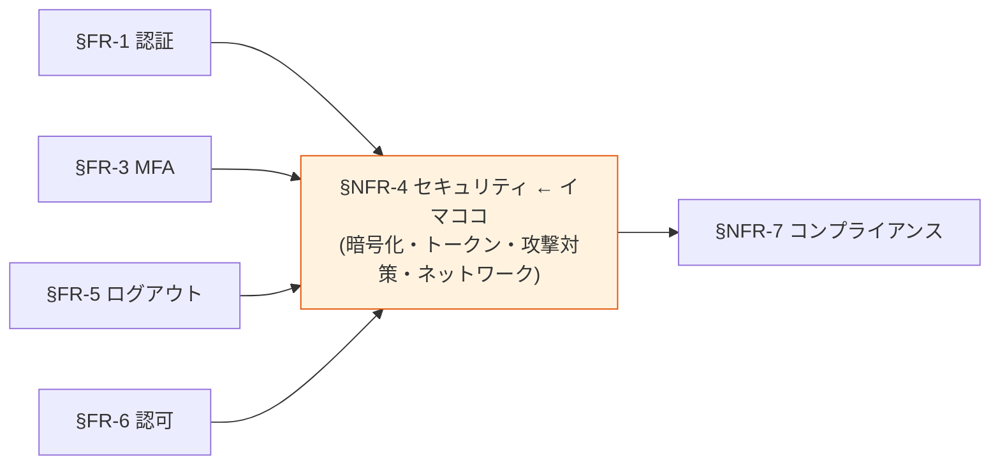

# §NFR-4 セキュリティ

> 上位 SSOT: [../00-index.md](../00-index.md) / [00-index.md](00-index.md)
> 詳細: [../../non-functional-requirements.md §4 NFR-SEC](../../non-functional-requirements.md)
> **IPA 非機能要求グレード対応**: **E. セキュリティ** — 認証 / アクセス制限 / データ秘匿 / 不正追跡・監査 / マルウェア対策 / Web 対策

---

## §NFR-4.0 前提と背景

### 用語整理

| 用語 | 本基盤での意味 |
|---|---|
| **TLS** | 通信暗号化（HTTPS）|
| **KMS** | AWS Key Management Service（鍵管理）|
| **PBKDF2 / bcrypt / Argon2** | パスワードハッシュアルゴリズム |
| **JWT 署名アルゴリズム** | RS256 / ES256 等 |
| **Refresh Token Rotation** | 単回使用、再利用検知でファミリー無効化 |
| **HIBP**（Have I Been Pwned）| 侵害クレデンシャル検出サービス |
| **WAF** | Web Application Firewall |
| **VPC Endpoint** | プライベートな AWS サービスアクセス |

### なぜここ（§NFR-4）で決めるか

セキュリティは **北極星「絶対安全」の最大の柱**。認証基盤のセキュリティ侵害は全顧客に影響するため、業界標準を超える水準を目指す。本章は最大ボリュームで詳述。

### §NFR-4.0.A 本基盤のセキュリティスタンス

> **NIST SP 800-63B Rev 4 / OAuth 2.1 / OWASP Top 10 等の業界標準ベストプラクティスに準拠。暗号化・トークン管理・攻撃対策・ネットワーク境界の 4 領域で多層防御。**

### IPA グレード E. セキュリティ とのマッピング

| IPA 中項目 | 本基盤 §NFR-4 該当 | 補足 |
|---|---|---|
| E.1 前提条件・制約条件 | §NFR-4.0 | 規制 / 業界標準 |
| E.2 セキュリティリスク分析 | §NFR-4.0 / §NFR-4.3 | 脅威モデル |
| E.3 セキュリティ診断 | [§NFR-6.3](06-operations.md) | ペネトレーションテスト |
| E.4 セキュリティリスク管理 | [§NFR-7.2](07-compliance.md) | 業界認定 |
| E.5 アクセス・利用制限 | §NFR-4.4 ネットワーク・境界制御 | IP 制限 / VPN |
| E.6 データの秘匿 | §NFR-4.1 暗号化・鍵管理 | TLS / KMS / hash |
| E.7 不正追跡・監査 | [§FR-8 管理機能 §FR-8.2 監査](../fr/08-admin.md) + [§NFR-6 運用](06-operations.md) | CloudTrail |
| E.8 ネットワーク対策 | §NFR-4.4 | WAF / Private Subnet |
| E.9 マルウェア対策 | §NFR-4.3 攻撃対策 | 一部、認証基盤としては限定的 |
| E.10 Web 対策 | §NFR-4.3 / §NFR-4.4 | WAF / XSS / CSRF |
| E.11 セキュリティインシデント対応 | [§NFR-6.3 体制](06-operations.md) | SOC / 24/7 |

### 共通認証基盤として「セキュリティ」を検討する意義

| 観点 | 個別アプリで実装 | 共通認証基盤で実装 |
|---|---|---|
| 暗号化方式の統一 | アプリごとに別実装 | **基盤で一元、TLS/KMS/hash アルゴリズム統一** |
| トークン管理 | アプリごとに別ロジック | **基盤で TTL / Rotation / Revocation 統一** |
| 攻撃対策 | 各アプリで個別実装 | **基盤側でブルートフォース対策・WAF を集約** |
| 侵害検出 | アプリごとに無理 | **基盤側で HIBP 等を全顧客に提供** |

→ セキュリティを基盤に集約することで、**個別アプリでは到達不可能な水準**を全アプリに提供。

### 本章で扱うサブセクション

| サブセクション | 内容 |
|---|---|
| §NFR-4.1 暗号化・鍵管理 | TLS / KMS / hash / 署名アルゴリズム |
| §NFR-4.2 トークン・セッション | TTL / Rotation / Revocation |
| §NFR-4.3 攻撃対策 | BF / HIBP / DDoS / 脆弱性スキャン |
| §NFR-4.4 ネットワーク・境界制御 | WAF / Private Subnet / 管理画面アクセス / VPC Endpoint |

---

## §NFR-4.1 暗号化・鍵管理

> **このサブセクションで定めること**: 通信・データ・パスワード・シークレットの暗号化方式と鍵管理。
> **主な判断軸**: TLS バージョン、ハッシュアルゴリズム、KMS 鍵ローテーション
> **§NFR-4 全体との関係**: 多層防御の最下層（情報保護の物理的基盤）

### 業界の現在地

- **TLS**: 1.2+ が業界標準、1.3 が推奨（2026）
- **データ at-rest**: AES-256 (KMS) が標準
- **JWT 署名**: RS256 が広く使われる、ES256 が新世代
- **パスワードハッシュ**: PBKDF2 / bcrypt / Argon2（NIST SP 800-63B 推奨）

### 対応能力マトリクス

| 項目 | Cognito | Keycloak (OSS/RHBK) |
|---|:---:|:---:|
| TLS 1.2+ 強制 | ✅ AWS 強制 | ⚠ ACM + ALB 設定要 |
| データ暗号化（at-rest）| ✅ KMS 自動 | ✅ RDS storage_encrypted |
| JWT 署名アルゴリズム | ✅ RS256 | ✅ RS256 / ES256 選択可 |
| パスワードハッシュ | ✅ AWS 内部（透過）| ✅ PBKDF2-SHA512（デフォルト）|
| シークレット管理 | ✅ AWS Secrets Manager | ✅ Secrets Manager 連携 |
| KMS 鍵ローテーション | ✅ KMS 自動 | ⚠ Realm Key Rotation 設定 |

### ベースライン

| 項目 | 推奨デフォルト |
|---|---|
| 通信暗号化 | **TLS 1.2+** |
| データ at-rest | **AES-256（KMS）** |
| JWT 署名 | **RS256** |
| パスワードハッシュ | PBKDF2 / bcrypt / Argon2 |
| 暗号鍵ローテーション | 年 1 回以上（KMS 自動）|

---

## §NFR-4.2 トークン・セッション

> **このサブセクションで定めること**: アクセストークン / リフレッシュトークン / ID トークンの TTL、Refresh Token Rotation の方針。
> **主な判断軸**: NIST AAL 整合（24h / 1h）、漏洩時被害最小化
> **§NFR-4 全体との関係**: [§FR-5 ログアウト・セッション管理](../fr/05-logout-session.md) と整合

### 業界の現在地

**NIST SP 800-63B Rev 4 セッションタイムアウト推奨値（2024）**:

| AAL | 絶対経過 | アイドル |
|---|---|---|
| AAL2（推奨）| **24 時間** | **1 時間** |
| AAL3 | 12 時間 | 15 分 |

**JWT トークン TTL 2026 ベストプラクティス**: Access Token 15-60 分 / Refresh Token 30 日（rotation 前提）

### 対応能力マトリクス

| 機能 | Cognito | Keycloak |
|---|:---:|:---:|
| セッションタイムアウト設定 | ✅ App Client | ✅ Realm 設定 |
| Access Token TTL | ✅ | ✅ |
| **Refresh Token Rotation** | ⚠ **デフォルト OFF** | ✅ **デフォルト ON** |
| アイドルタイムアウト | ⚠ アプリ側 | ✅ Realm 設定 |
| **Access Token Revocation** | ❌ Refresh のみ | ✅ Token Revocation |

### ベースライン

| 項目 | 推奨デフォルト | NIST AAL 整合 |
|---|---|:---:|
| Access Token TTL | **30 分** | AAL2 ✅ |
| ID Token TTL | 15 分 | AAL2 ✅ |
| Refresh Token TTL | 30 日（rotation 前提）| — |
| 絶対経過 | 24 時間 | AAL2 ✅ |
| アイドル | 1 時間 | AAL2 ✅ |
| Refresh Token Rotation | **有効** | — |
| Reuse Detection | **有効** | — |

---

## §NFR-4.3 攻撃対策

> **このサブセクションで定めること**: ブルートフォース / 侵害クレデンシャル / DDoS / 脆弱性に対する防御策。
> **主な判断軸**: NIST Rev 4 必須要件（侵害クレデンシャル検出）、業界規制
> **§NFR-4 全体との関係**: 認証基盤に対する直接攻撃を防ぐ

### 業界の現在地

- **NIST SP 800-63B Rev 4**: 侵害クレデンシャル検出を**必須化**（2024）
- **HIBP**（Have I Been Pwned）: 業界標準のデータベース
- **DDoS**: AWS Shield Standard が無料で提供
- **脆弱性スキャン**: ECR Image Scan + Inspector

### 対応能力マトリクス

| 機能 | Cognito Lite/Essentials | Cognito Plus | Keycloak |
|---|:---:|:---:|:---:|
| ブルートフォース対策 | ⚠ 標準（パラメータ不可）| ✅ **Plus ティア**で詳細設定 | ✅ Realm Settings |
| **侵害クレデンシャル検出** | ❌ | ✅ **ネイティブ**（+$0.02/MAU）| ⚠ HIBP プラグイン（RHBK サポート対象外）|
| DDoS（Shield Standard）| ✅ AWS 標準 | ✅ | ✅ |
| 脆弱性スキャン | — | — | ✅ ECR Image Scan |
| ペネトレーションテスト | 顧客責任 | 顧客責任 | 顧客責任 |

### ベースライン

| 項目 | 推奨デフォルト |
|---|---|
| ブルートフォース | 連続失敗で一時ロック（5 回 / 30 分）|
| 侵害クレデンシャル検出 | **有効**（Cognito Plus or Keycloak+HIBP）|
| DDoS 対策 | Shield Standard（AWS 標準）|
| ペネトレーションテスト | 年 1 回（顧客要件次第）|
| 脆弱性スキャン | ECR Image Scan + Inspector |

### TBD / 要確認

| 確認項目 | 回答例 |
|---|---|
| 侵害クレデンシャル検出 Must | はい（Cognito Plus / Keycloak+HIBP）/ いいえ |
| ペネトレーションテスト頻度 | 年 N 回 / なし |

---

## §NFR-4.4 ネットワーク・境界制御

> **このサブセクションで定めること**: ネットワークレベルでの保護（WAF / Private Subnet / 管理画面アクセス / 内部通信）。
> **主な判断軸**: ネットワーク分離の深さ、管理画面の保護
> **§NFR-4 全体との関係**: 多層防御の最外層

### 業界の現在地

- **WAF**: AWS WAF（CloudFront 経由）が標準
- **Private Subnet**: VPC 内完結で外部攻撃面を最小化
- **VPC Endpoint**: AWS サービスアクセスを VPC 内に閉じ込め（PoC Phase 9 で実証）
- **管理画面**: IP 制限 + VPN/Bastion 経由が標準

### 対応能力マトリクス

| 機能 | Cognito | Keycloak |
|---|:---:|:---:|
| WAF（CloudFront）| ✅ | ⚠ ADR-013 で計画 |
| ネットワーク分離（Private Subnet）| ✅ AWS 透過 | ✅ Phase Option B（PoC 移行済） |
| 管理画面アクセス制御 | ✅ IAM | ⚠ ADR-011 で計画 |
| JWKS エンドポイント保護 | ✅ 公開 + WAF | ✅ Phase ADR-012 |
| 内部通信の VPC 完結 | ✅ Cognito VPCE | ✅ Internal ALB（ADR-012）|
| セッション固定攻撃対策 | ✅ | ✅ |

### ベースライン

| 項目 | 推奨デフォルト |
|---|---|
| WAF | **AWS WAF（CloudFront）**必須 |
| Private Subnet | **必須**（AWS 透過 or 明示配置） |
| 管理画面アクセス | **IP 制限 + VPN/Bastion** |
| JWKS エンドポイント | **公開 + WAF レート制限** |
| 内部通信 | **VPC 内完結**（VPC Endpoint / Internal ALB）|

### TBD / 要確認

| 確認項目 | 回答例 |
|---|---|
| 管理者アクセス経路 | VPN / Bastion / IP 制限 |
| JWKS 公開要否 | 公開（推奨）/ VPC 内完結（厳格セキュリティ）|

---

## 参考資料

- [NIST SP 800-63B Rev 4 公式](https://pages.nist.gov/800-63-4/sp800-63b.html)
- [OWASP Top 10 2021](https://owasp.org/Top10/)
- [AWS Cognito Threat Protection](https://docs.aws.amazon.com/cognito/latest/developerguide/cognito-user-pool-settings-threat-protection.html)
- [Cognito Adaptive Authentication](https://docs.aws.amazon.com/cognito/latest/developerguide/cognito-user-pool-settings-adaptive-authentication.html)
- [IPA 非機能要求グレード 2018 - E. セキュリティ](https://www.ipa.go.jp/archive/digital/iot-en-ci/jyouryuu/hikinou/index.html)
- [keycloak-network-architecture.md](../../../common/keycloak-network-architecture.md)
- [jwks-public-exposure.md](../../../common/jwks-public-exposure.md)
