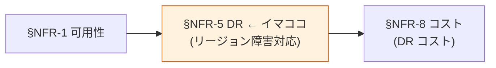

# §NFR-5 DR（災害復旧）

> 上位 SSOT: [../00-index.md](../00-index.md) / [00-index.md](00-index.md)
> 詳細: [../../non-functional-requirements.md §5 NFR-DR](../../non-functional-requirements.md)
> **IPA 非機能要求グレード対応**: **A. 可用性** — 災害対策 / 復旧可能性

---

## §NFR-5.0 前提と背景

### 用語整理

| 用語 | 本基盤での意味 |
|---|---|
| **DR**（Disaster Recovery）| 災害復旧。リージョン障害等に対する備え |
| **RTO**（Recovery Time Objective）| 目標復旧時間 |
| **RPO**（Recovery Point Objective）| 目標復旧地点（許容データ損失時間）|
| **フェイルオーバー** | プライマリ障害時にセカンダリへ自動切替 |
| **PITR**（Point-in-Time Recovery）| 任意時点までの DB 復元 |
| **クロスリージョンレプリカ** | 別リージョンにデータを複製 |

### なぜここ（§NFR-5）で決めるか

DR は **「リージョン全体が落ちても認証を継続できるか」** の話。Cognito は **Route 53 自動フェイルオーバー + User Pool 別リージョン**で対応可能（**月額 +$0.50**）、Keycloak は **Aurora Global DB + ECS Multi-Region**（**月額 +$890**）と、コスト差が大きい。PoC Phase 5 で大阪リージョンでの DR 検証済。

### §NFR-5.0.A 本基盤の DR スタンス

> **RTO/RPO は顧客要件次第で確定。Cognito 採用時は Route 53 自動フェイルオーバー、Keycloak 採用時は Aurora Global DB + ECS Multi-Region を構成する。**

### IPA グレード A. 可用性（災害対策・復旧可能性）とのマッピング

| IPA 中項目 | 本基盤 §NFR-5 該当 | 補足 |
|---|---|---|
| A.3 災害対策 | §NFR-5.1 RTO/RPO / §NFR-5.2 フェイルオーバー | リージョン障害 |
| A.4 復旧可能性 | §NFR-5.3 バックアップ / §NFR-5.4 PITR | データ復旧 |
| A.4.x DR 訓練 | §NFR-5.5 DR 訓練 | 年 N 回 |

### 本章で扱うサブセクション

| サブセクション | 内容 |
|---|---|
| §NFR-5.1 RTO / RPO | 目標復旧時間・地点 |
| §NFR-5.2 フェイルオーバー方式 | 自動 / 手動 |
| §NFR-5.3 バックアップ | 保存期間・クロスリージョン |
| §NFR-5.4 PITR | 任意時点復元 |
| §NFR-5.5 DR 訓練 | 年 N 回の訓練 |

---

## §NFR-5.1 RTO / RPO

> **このサブセクションで定めること**: **目標復旧時間（RTO）**と**目標復旧地点（RPO）**の数値。
> **主な判断軸**: 業務継続性要件、許容ダウンタイム / データ損失
> **§NFR-5 全体との関係**: DR 全体設計の出発点

### 業界の現在地

| RTO 水準 | 達成手段 | コスト感 |
|---|---|---|
| RTO 1 時間 | Active-Passive、自動切替（Cognito Route 53）| **低**（+$0.50/月）|
| RTO 1 分 | Active-Active（Keycloak Aurora Global DB）| **高**（+$890/月）|
| RTO 0 秒（無瞬断）| Multi-Region active-active full | **最高**（インフラ倍）|

### 対応能力マトリクス

| 機能 | Cognito | Keycloak |
|---|:---:|:---:|
| マルチリージョン対応 | ✅ User Pool 別リージョン作成 | ✅ Aurora Global DB |
| 自動フェイルオーバー | ✅ Route 53 Health Check | ⚠ 設計要 |
| RTO 短縮 | 分単位 | 秒単位（Aurora Global DB）|

### ベースライン

| 項目 | 推奨デフォルト | 設定可能範囲 |
|---|---|---|
| RTO（目標復旧時間） | **N 分**（要確認） | 1 分 〜 24 時間 |
| RPO（目標復旧地点） | **N 分**（要確認） | 秒 〜 1 時間 |

### TBD / 要確認

| 確認項目 | 回答例 |
|---|---|
| RTO 目標 | 1 分 / 15 分 / 1 時間 / 1 日 |
| RPO 目標 | 0 / 1 分 / 1 時間 |

---

## §NFR-5.2 フェイルオーバー方式

> **このサブセクションで定めること**: プライマリ障害時の切替方式（自動 / 手動）。
> **主な判断軸**: RTO 要件、運用体制
> **§NFR-5 全体との関係**: RTO 目標を実現する手段

### ベースライン

| 機能 | Cognito | Keycloak |
|---|:---:|:---:|
| フェイルオーバー方式 | ✅ **自動**（Route 53）| ⚠ **手動 or 自動設計** |
| PoC 検証 | ✅ Phase 5（手動切替）| 未検証（本番フェーズ）|

---

## §NFR-5.3 バックアップ

> **このサブセクションで定めること**: バックアップの保存期間・クロスリージョン対応。
> **主な判断軸**: 法定保管要件、コスト
> **§NFR-5 全体との関係**: データ復旧の基盤

### ベースライン

| 項目 | 推奨デフォルト |
|---|---|
| バックアップ保存期間 | 30 日 |
| クロスリージョンバックアップ | **必須** |
| 自動化 | AWS 透過 / RDS Automated Backup |

---

## §NFR-5.4 PITR

> **このサブセクションで定めること**: 任意時点までの復元粒度。

### ベースライン

| 項目 | 推奨デフォルト |
|---|---|
| PITR 粒度 | **5 分** |
| 保存期間 | **35 日** |

---

## §NFR-5.5 DR 訓練

> **このサブセクションで定めること**: 定期的な DR 訓練の頻度。

### ベースライン

| 項目 | 推奨デフォルト |
|---|---|
| DR 訓練 | 年 1-2 回 |

### TBD / 要確認

| 確認項目 | 回答例 |
|---|---|
| DR 訓練頻度 | 年 N 回 / なし |

---

## 参考資料

- [AWS Route 53 Health Check + DNS Failover](https://docs.aws.amazon.com/route53/latest/developerguide/dns-failover.html)
- [Aurora Global DB](https://aws.amazon.com/rds/aurora/global-database/)
- [keycloak-dr-aurora-sync.md](../../../reference/keycloak-dr-aurora-sync.md)
- [IPA 非機能要求グレード 2018 - A. 可用性（災害対策）](https://www.ipa.go.jp/archive/digital/iot-en-ci/jyouryuu/hikinou/index.html)
