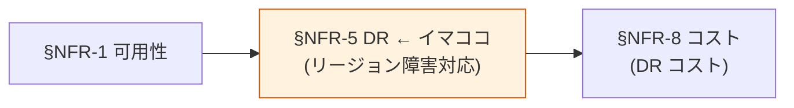

# §NFR-5 DR（災害復旧）

> 上位 SSOT: [../00-index.md](../00-index.md) / [00-index.md](00-index.md)   
> 詳細: [../../non-functional-requirements.md §5 NFR-DR](../../non-functional-requirements.md)   
> **IPA 非機能要求グレード対応**: **A. 可用性** — 災害対策 / 復旧可能性

---

## §NFR-5.0 前提と背景

### 用語整理

| 用語 | 本基盤での意味 |
|---|---|
| **DR**（Disaster Recovery）| 災害復旧。リージョン障害等に対する備え |
| **RTO**（Recovery Time Objective）| 目標復旧時間 |
| **RPO**（Recovery Point Objective）| 目標復旧地点（許容データ損失時間）|
| **フェイルオーバー** | プライマリ障害時にセカンダリへ自動切替 |
| **PITR**（Point-in-Time Recovery）| 任意時点までの DB 復元 |
| **クロスリージョンレプリカ** | 別リージョンにデータを複製 |

### なぜここ（§NFR-5）で決めるか



DR は **「リージョン全体が落ちても認証を継続できるか」** の話。Cognito は **Route 53 自動フェイルオーバー + User Pool 別リージョン**で対応可能（**月額 +$0.50**）、Keycloak は **Aurora Global DB + ECS Multi-Region**（**月額 +$890**）と、コスト差が大きい。PoC Phase 5 で大阪リージョンでの DR 検証済。

### §NFR-5.0.A 本基盤の DR スタンス

> **RTO/RPO は顧客要件次第で確定。Cognito 採用時は Route 53 自動フェイルオーバー、Keycloak 採用時は Aurora Global DB + ECS Multi-Region を構成する。**

### IPA グレード A. 可用性（災害対策・復旧可能性）とのマッピング

| IPA 中項目 | 本基盤 §NFR-5 該当 | 補足 |
|---|---|---|
| A.3 災害対策 | §NFR-5.1 RTO/RPO / §NFR-5.2 フェイルオーバー | リージョン障害 |
| A.4 復旧可能性 | §NFR-5.3 バックアップ / §NFR-5.4 PITR | データ復旧 |
| A.4.x DR 訓練 | §NFR-5.5 DR 訓練 | 年 N 回 |

### 本章で扱うサブセクション

| サブセクション | 内容 |
|---|---|
| §NFR-5.1 RTO / RPO | 目標復旧時間・地点 |
| §NFR-5.2 フェイルオーバー方式 | 自動 / 手動 |
| §NFR-5.3 バックアップ | 保存期間・クロスリージョン |
| §NFR-5.4 PITR | 任意時点復元 |
| §NFR-5.5 DR 訓練 | 年 N 回の訓練 |

---

## §NFR-5.1 RTO / RPO

> **このサブセクションで定めること**: **目標復旧時間（RTO）**と**目標復旧地点（RPO）**の数値。   
> **主な判断軸**: 業務継続性要件、許容ダウンタイム / データ損失   
> **§NFR-5 全体との関係**: DR 全体設計の出発点

### 業界の現在地

| RTO 水準 | 達成手段 | コスト感 |
|---|---|---|
| RTO 1 時間 | Active-Passive、自動切替（Cognito Route 53）| **低**（+$0.50/月）|
| RTO 1 分 | Active-Active（Keycloak Aurora Global DB）| **高**（+$890/月）|
| RTO 0 秒（無瞬断）| Multi-Region active-active full | **最高**（インフラ倍）|

### 対応能力マトリクス

| 機能 | Cognito | Keycloak |
|---|:---:|:---:|
| マルチリージョン対応 | ✅ User Pool 別リージョン作成 | ✅ Aurora Global DB |
| 自動フェイルオーバー | ✅ Route 53 Health Check | ⚠ 設計要 |
| RTO 短縮 | 分単位 | 秒単位（Aurora Global DB）|

### ベースライン

> **詳細は [ADR-051 Multi-Region DR / Failover 詳細設計](../../../adr/051-multi-region-dr-failover.md) を参照**

| 顧客 Tier | RTO | RPO | 適用条件 |
|---|---|---|---|
| **Tier 1 Premium**（規制業種）| **30 分** | **1 分** | 金融 / 医療 / 公的機関 / DORA 適用顧客 |
| **Tier 2 Standard**（一般 B2B 標準）| **1 時間** | **1 分** | デフォルト |
| **Tier 3 Best Effort**（小規模 / PoC）| 4 時間 | 15 分 | 試験運用 |

### 採用方針（ADR-051）

- **Active-Passive Warm Standby**（Active-Active は Split-Brain リスク、運用負荷大）
- **プライマリ ap-northeast-1（東京）+ DR ap-northeast-3（大阪）**
- **Aurora Global Database** 必須（Broker DB + IdP-KC DB）、Cross-Region Replication < 1 sec
- **DynamoDB Global Tables**（ITDR / Adaptive Auth / Tenant Audit / DSAR Requests）
- **KMS Multi-Region Keys (MRK)**（[ADR-045](../../../adr/045-cryptographic-key-management-strategy.md)）
- **S3 Cross-Region Replication**（監査ログ / SPA bundle / Sorry SPA）
- **Failover 自動化 80% + 手動承認 20%**（データ層 Cross-Region は Split-Brain 防止のため手動承認）
- **DR コスト**：プライマリ単独比 +30%（月 +$1,370）、Tier 1 Hot Standby は更に +$2,500/月

### TBD / 要確認

| 確認項目 | ヒアリング ID | 回答例 |
|---|---|---|
| RTO 目標 | **B-DR-1** | Tier 2 標準 1 時間 / Tier 1 規制業種 30 分 |
| RPO 目標 | **B-DR-2** | 1 分（推奨）/ 15 分 |
| 規制業種顧客向け Tier 1 オプション | **B-DR-3** | 必須 / Phase 2 / 不要 |
| DR 訓練頻度 | **B-DR-4** | 半期（推奨、[ADR-044](../../../adr/044-tabletop-exercise-incident-drill.md) S-07）/ 年次 |
| DR Region 選定 | **B-DR-5** | ap-northeast-3 大阪（推奨）/ 別 Region |

---

## §NFR-5.2 フェイルオーバー方式

> **このサブセクションで定めること**: プライマリ障害時の切替方式（自動 / 手動）。   
> **主な判断軸**: RTO 要件、運用体制   
> **§NFR-5 全体との関係**: RTO 目標を実現する手段

### ベースライン

| 機能 | Cognito | Keycloak |
|---|:---:|:---:|
| フェイルオーバー方式 | ✅ **自動**（Route 53）| ⚠ **手動 or 自動設計** |
| PoC 検証 | ✅ Phase 5（手動切替）| 未検証（本番フェーズ）|

---

## §NFR-5.3 バックアップ

> **このサブセクションで定めること**: バックアップの保存期間・クロスリージョン対応。   
> **主な判断軸**: 法定保管要件、コスト   
> **§NFR-5 全体との関係**: データ復旧の基盤

### ベースライン

| 項目 | 推奨デフォルト |
|---|---|
| バックアップ保存期間 | 30 日 |
| クロスリージョンバックアップ | **必須** |
| 自動化 | AWS 透過 / RDS Automated Backup |

---

## §NFR-5.4 PITR

> **このサブセクションで定めること**: 任意時点までの復元粒度。

### ベースライン

| 項目 | 推奨デフォルト |
|---|---|
| PITR 粒度 | **5 分** |
| 保存期間 | **35 日** |

---

## §NFR-5.5 DR 訓練 + クロスアカウント調整

> **このサブセクションで定めること**: 定期的な DR 訓練の頻度と、**共通基盤アカウントとアプリアカウント間の調整プロセス**（事前通知 / 役割分担 / 確認手順）。   
> **主な判断軸**: 訓練の現実性、アプリ側の業務影響、関係者通知のリードタイム   
> **§NFR-5 全体との関係**: DR 設計（§NFR-5.1〜4）の実効性を保証する運用面の最終工程。[§NFR-6.5 F-4](06-operations.md) と整合

### ベースライン

| 項目 | 推奨デフォルト |
|---|---|
| DR 訓練 | **年 1-2 回**（最低 1 回は実フェイルオーバー、もう 1 回は table-top 演習も可）|
| 事前通知リードタイム | アプリ運用へ **1-2 週間前** に告知、顧客へ **3 営業日前** に告知 |
| 訓練時間帯 | **業務影響最小の時間帯**（深夜 / 週末） |

### 訓練時のクロスアカウント役割分担

```mermaid
flowchart LR
    KICK[訓練計画提示<br/>(2 週前)]
    NOTIFY[アプリ運用<br/>に告知]
    DRILL[DR 実施<br/>(共通基盤運用)]
    APPCHK[アプリ側<br/>動作確認<br/>(アプリ運用)]
    RECOVER[復旧]
    REVIEW[振り返り]

    KICK --> NOTIFY --> DRILL --> APPCHK --> RECOVER --> REVIEW

    style DRILL fill:#fff3e0
    style APPCHK fill:#e3f2fd
```

| 主体 | 訓練時の役割 |
|---|---|
| **共通基盤運用** | フェイルオーバー実施、Route 53 切替、Aurora Global DB Promote、Health Check 監視 |
| **アプリ運用** | アプリ側の動作確認（ログイン可 / JWT 検証可 / Refresh 可 / セッション維持）、JWKS 経路の正常性確認 |
| **顧客（任意）** | 業務影響モニタリング、コミュニケーション窓口 |
| **共通インシデント司令塔** | 全体進行管理、エスカレーション判断（[§NFR-6.5 E-4](06-operations.md) のエスカレーション図） |

### DR サイト用 AWS アカウントの構成

| 構成 | 説明 | 推奨度 |
|---|---|:---:|
| **同一アカウント・別リージョン** | 1 つの共通基盤アカウント内で東京 + 大阪を運用。コスト低・運用シンプル | ✅ 推奨（コスト・運用最適）|
| **DR 専用アカウント** | DR サイトを別 AWS アカウントに分離。アカウント丸ごと侵害された場合の保険 | △ 規制要件で必要時 |

### TBD / 要確認

| 確認項目 | 回答例 |
|---|---|
| DR 訓練頻度 | 年 1 回 / 年 2 回 / 半期 1 回 / なし |
| アプリ側の確認体制 | 全アプリ参加 / 主要アプリのみ / 共通基盤側のみで完結 |
| 訓練時の業務影響許容 | 完全停止許容 / Read-Only 許容 / 影響ゼロ必須 |
| DR サイト用アカウント分離 | 同一アカウント別リージョン / DR 専用アカウント |

---

## 参考資料

- [AWS Route 53 Health Check + DNS Failover](https://docs.aws.amazon.com/route53/latest/developerguide/dns-failover.html)
- [Aurora Global DB](https://aws.amazon.com/rds/aurora/global-database/)
- [keycloak-dr-aurora-sync.md](../../../reference/keycloak-dr-aurora-sync.md)
- [IPA 非機能要求グレード 2018 - A. 可用性（災害対策）](https://www.ipa.go.jp/archive/digital/iot-en-ci/jyouryuu/hikinou/index.html)
