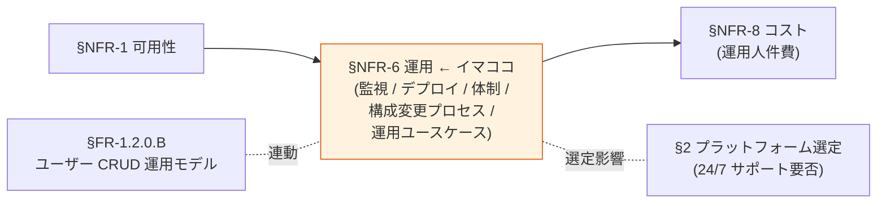
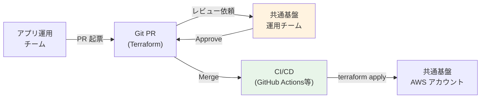

# §NFR-6 運用

> 上位 SSOT: [../00-index.md](../00-index.md) / [00-index.md](00-index.md)   
> 詳細: [../../non-functional-requirements.md §6 NFR-OPS](../../non-functional-requirements.md)   
> **IPA 非機能要求グレード対応**: **C. 運用・保守性** — 通常運用 / 保守運用 / 障害時運用 / 運用環境 / サポート体制

---

## §NFR-6.0 前提と背景

### 用語整理

| 用語 | 本基盤での意味 |
|---|---|
| **監視・メトリクス** | CloudWatch / Datadog 等で稼働状態を可視化 |
| **アラート通知** | しきい値超え時の通知（SNS / PagerDuty）|
| **ログ保存期間** | コンプライアンス・調査用の長期保管 |
| **CVE 対応** | 公開脆弱性への迅速なパッチ適用 |
| **バージョンアップ** | OS / ミドルウェア / アプリの更新 |
| **24/7 サポート** | 24 時間 365 日のオンコール体制 |
| **クロスアカウント運用** | 共通基盤（専用 AWS アカウント）と各アプリ（別 AWS アカウント）間の作業調整・申請プロセス |
| **構成変更プロセス** | App Client / IdP / Realm 等、共通基盤側の構成変更時の申請 → レビュー → 適用フロー |
| **運用主体** | 共通基盤運用チーム / アプリ運用チーム / 顧客 / エンドユーザー / 自動の 5 区分 |

### なぜここ（§NFR-6）で決めるか

運用は **「日常運用 + 障害対応 + 保守 + 構成変更プロセス + 運用ユースケース」** を含む幅広い領域。本基盤は **共通基盤専用 AWS アカウント + アプリは別 AWS アカウント** という構成のため、**クロスアカウントの作業調整・申請プロセス**が運用負荷の中核論点。Cognito は AWS 透過で運用負荷ゼロ、Keycloak OSS は LTS なしで頻繁 upgrade 必要、RHBK は Red Hat サポート付き。**サポート体制要件**が[§2 プラットフォーム選定](../common/02-platform.md) に直結。

### §NFR-6.0.A 本基盤の運用スタンス

> **Cognito 採用時は AWS 透過で運用ゼロ、Keycloak 採用時は IaC + CloudWatch 監視 + 自動デプロイで運用負荷最小化。クロスアカウント境界による作業調整は、（a）ユーザー CRUD は [§FR-1.2.0.B](../fr/01-auth.md) Layer 1-4 でアプリ層に委譲、（b）構成変更は Git PR ベースで軽量化する。商用サポート要件は別途確定。**

### IPA グレード C. 運用・保守性 とのマッピング

| IPA 中項目 | 本基盤 §NFR-6 該当 | 補足 |
|---|---|---|
| C.1 通常運用 | §NFR-6.1 監視・ロギング / §NFR-6.5 運用ユースケース | 日常監視 + 定型作業 |
| C.2 保守運用 | §NFR-6.2 デプロイ・パッチ / §NFR-6.4 構成変更プロセス | バージョンアップ + 構成変更 |
| C.3 障害時運用 | §NFR-6.1 + §NFR-6.3 + §NFR-6.5 緊急対応 | 検知 + 体制 + ユースケース |
| C.4 運用環境 | §NFR-6.1 | 監視ツール選定 |
| C.5 サポート体制 | §NFR-6.3 + §NFR-6.4 | 24/7 / 営業時間 / 構成変更レビュー体制 |

### 本章で扱うサブセクション

| サブセクション | 内容 |
|---|---|
| §NFR-6.1 監視・ロギング | CloudWatch / アラート / 検知 |
| §NFR-6.2 デプロイ・パッチ | バージョンアップ / CVE 対応 / CI/CD |
| §NFR-6.3 サポート体制 | 24/7 / 営業時間 / 運用工数 |
| §NFR-6.4 構成変更プロセス（クロスアカウント） | App Client / IdP / Realm 設定変更の申請 → レビュー → 適用フロー |
| §NFR-6.5 運用ユースケース別 作業フロー | 顧客追加 / アプリ追加 / ユーザー一括メンテ / 緊急対応 等の作業フロー詳細 |

---

## §NFR-6.1 監視・ロギング

> **このサブセクションで定めること**: 本基盤の稼働状態を監視するメトリクス・アラート・ログ保存方針。   
> **主な判断軸**: 監視ツール選定、アラートしきい値、ログ保存期間   
> **§NFR-6 全体との関係**: 障害検知 + 通常運用の中核

### 業界の現在地

- **CloudWatch Metrics + Dashboard**: AWS 標準
- **アラート**: SNS + PagerDuty / Slack 連携
- **ログ保存**: 法定要件次第で 1 年〜10 年

### 対応能力マトリクス

| 機能 | Cognito | Keycloak |
|---|:---:|:---:|
| 監視・メトリクス | ✅ CloudWatch | ✅ Keycloak Metrics + CloudWatch |
| アラート通知 | ✅ CloudWatch Alarm + SNS | ✅ |
| ログ保存（CloudWatch / S3）| ✅ CloudTrail + CloudWatch | ✅ Event Log + CloudWatch |
| ログ検索性 | ✅ CloudWatch Insights | ⚠ Event Listener 自前 |

### ベースライン

| 項目 | 推奨デフォルト |
|---|---|
| 監視ツール | CloudWatch Metrics + Dashboard |
| アラート通知 | CloudWatch Alarm + SNS |
| ログ保存期間 | 法定要件次第（1 年〜10 年）|
| ログ検索 | CloudWatch Insights / S3 + Athena |

### TBD / 要確認

| 確認項目 | 回答例 |
|---|---|
| ログ保存期間 | 1 年 / 3 年 / 6 年 / 10 年 |
| 監視ダッシュボード共有 | 弊社内 / 顧客管理者 / 監査人 |

---

## §NFR-6.2 デプロイ・パッチ

> **このサブセクションで定めること**: バージョンアップ・パッチ適用の方針と頻度。   
> **主な判断軸**: CVE 対応速度、サービス影響、設定変更プロセス   
> **§NFR-6 全体との関係**: 保守運用の中核。Keycloak OSS は LTS なしで負荷大

### 業界の現在地

- **Keycloak OSS**: 年 4 minor + 2-3 年 major、**LTS なし**、6 ヶ月メンテで強制 upgrade
- **Keycloak RHBK**: 26.x = 2 年サポート、27.x 以降 = 3 年
- **Cognito**: AWS 透過、顧客作業ゼロ

### 対応能力マトリクス

| 機能 | Cognito | Keycloak OSS | Keycloak RHBK |
|---|:---:|:---:|:---:|
| バージョンアップ | ✅ AWS 透過 | ⚠ **年 4 回手動** | ⚠ 2-3 年延長サポート |
| CVE パッチ | ✅ AWS 自動 | ⚠ **CVE 監視 + 手動 Image 更新** | ✅ Red Hat 配信 |
| 設定変更プロセス | ✅ Terraform | ⚠ Realm は別管理 | 同左 |
| CI/CD | ✅ Terraform | ✅ Terraform + Docker | 同左 |

### ベースライン

| 項目 | 推奨デフォルト |
|---|---|
| バージョンアップ方針 | Cognito 透過 / Keycloak は LTS （RHBK）を推奨 |
| CVE パッチ適用 | 緊急 N 日以内、定例 N 週間以内 |
| 設定変更プロセス | **IaC（Terraform）+ レビュー** |
| デプロイ自動化 | **CI/CD 必須** |

---

## §NFR-6.3 サポート体制

> **このサブセクションで定めること**: 障害時のサポート体制（24/7 / 営業時間）と運用工数。   
> **主な判断軸**: 顧客 SLA、運用人件費   
> **§NFR-6 全体との関係**: [§2 プラットフォーム選定](../common/02-platform.md) に直結

### 業界の現在地

- **Cognito**: AWS Support（Premium 24/7 可）
- **Keycloak OSS**: コミュニティ（ベストエフォート）
- **Keycloak RHBK**: **Red Hat 24/7** 商用サポート

### 対応能力マトリクス

| 機能 | Cognito | Keycloak OSS | Keycloak RHBK |
|---|:---:|:---:|:---:|
| 24/7 商用サポート | ✅ AWS Premium Support | ❌ | ✅ Red Hat 24/7 |
| 運用工数（月）| ✅ ほぼ不要 | ⚠ ~21 時間/月 | ⚠ ~10 時間/月（半減想定）|
| インシデント対応 | AWS Support | 自社対応 | Red Hat 支援 |

### ベースライン

| 項目 | 推奨デフォルト |
|---|---|
| サポート体制 | 顧客要件次第（24/7 必須 → Cognito or RHBK） |
| 運用工数目安 | Cognito ほぼゼロ / Keycloak 月 21h |
| インシデント SLA | 顧客契約次第 |

### TBD / 要確認

| 確認項目 | 回答例 |
|---|---|
| 24/7 サポート Must | はい / 営業時間のみ / 不要 |
| 運用主体 | 弊社 / 顧客 / 共同 |
| インシデント SLA | RTO 連動 |

---

## §NFR-6.4 構成変更プロセス（クロスアカウント）

> **このサブセクションで定めること**: 共通基盤側の構成（App Client / IdP / Realm 設定 / ネットワーク等）に変更が入る場合の、**申請 → レビュー → 適用** までの標準フロー。共通基盤は専用 AWS アカウント、アプリは別 AWS アカウントという前提のもとで、双方の運用チームがどう協調するかを定義する。   
> **主な判断軸**: 申請の軽量化（チケット vs Git PR）、レビュー責任の所在、緊急変更時の例外ルート   
> **§NFR-6 全体との関係**: クロスアカウント境界による運用摩擦を最小化する制度設計。[§FR-1.2.0.B Layer 1-4](../fr/01-auth.md) の "Configuration 変更系の摩擦" を実装手順で具体化

### 業界の現在地

- **GitOps**（Weaveworks 提唱、2017〜）が IaC 変更管理の業界標準。**「Git が単一の真実、CI/CD が同期実行」**
- **AWS Multi-Account Strategy**（AWS 公式）: 共有サービス（Identity / Network / Logging）を専用アカウントに集約し、PR ベースで変更受付するパターンを推奨
- **Terraform / OpenTofu**: 構成のコード化 + Pull Request レビュー + Plan/Apply の標準ツール
- **Backstage / Port 等の Internal Developer Platform**: アプリチームのセルフサービス申請窓口として 2023〜業界普及

### なぜ「申請ベース」ではなく「Git PR ベース」か

| 観点 | 旧来の申請ベース（チケット / メール） | Git PR ベース |
|---|---|---|
| **変更内容の可視性** | 説明文に依存、後追い困難 | **コード差分で完全可視** |
| **レビュー履歴** | チケット履歴、検索性低 | **Git 履歴、Blame で追える** |
| **適用ミス** | 手動コピペで誤適用リスク | **CI/CD で機械実行、人為ミスゼロ** |
| **緊急対応** | 申請待ち | **PR 即時 review + 緊急 merge** |
| **監査ログ** | 別途記録必要 | **Git ログがそのまま証跡** |
| **やり直し** | 手動逆操作 | **Revert PR で機械的に戻せる** |

### 推奨フロー

### 構成変更の分類と申請フロー

| 変更種別 | 例 | 頻度 | 申請窓口 | レビュー責任 | 適用 | 想定 SLA |
|---|---|:---:|---|---|---|---|
| **A. App Client 追加・削除** | 新規アプリ立ち上げ | 月 1-2 件 | Git PR | 共通基盤運用 | CI/CD 自動 | **PR 提出 → Merge まで 1 営業日** |
| **B. IdP 追加・削除** | 新規顧客オンボーディング | 月 N 件 | Git PR | 共通基盤運用 + セキュリティ | CI/CD 自動 | **同上** |
| **C. クレーム・属性スキーマ追加** | アプリの認可要件追加 | 月 1 件未満 | Git PR | 共通基盤運用 + 影響アプリ | CI/CD 自動 | **PR 提出 → Merge まで 2-3 営業日**（影響評価必要）|
| **D. Realm / User Pool 設定** | パスワードポリシー / セッション TTL 変更 | 半期 1 件 | Git PR | 共通基盤運用 + セキュリティ + 全アプリ通知 | CI/CD 自動 | **PR 提出 → Merge まで 1-2 週間**（影響広範） |
| **E. ネットワーク / IAM 構成変更** | VPC / Security Group / IAM Role | 半期 1 件 | Git PR | 共通基盤運用 + AWS 管理チーム | CI/CD 自動 | **PR 提出 → Merge まで 1-2 週間** |
| **F. 緊急対応（侵害 / 障害）** | 強制ログアウト / Token Revocation / 緊急 IP 制限 | 不定期 | **電話 + 緊急 PR**（Fast Track） | 共通基盤運用 (on-call) | CI/CD 自動 or 緊急 Admin API | **インシデント SLA に準拠（[§NFR-6.3](#nfr-63-サポート体制)）** |

### ベースライン

| 項目 | 推奨デフォルト |
|---|---|
| 構成変更プロセス | **IaC（Terraform）+ Git PR + CI/CD** |
| PR テンプレート | 変更目的 / 影響範囲 / ロールバック手順 / テスト確認 |
| レビュアー要件 | **共通基盤運用チームの 2 名以上**（うち 1 名は影響範囲評価可能な経験者）|
| CI/CD 環境 | dev → staging → production の 3 段階。本番適用は手動承認 |
| 緊急対応の Fast Track | 共通基盤運用 on-call の単独承認で **Skip staging** 可（事後にレビュー）|
| 環境分離 | dev / staging / production を **別 AWS アカウント** で分離 |
| 監査記録 | Git 履歴 + CI/CD 実行ログ + CloudTrail（重複であえて多層） |

### TBD / 要確認

| 確認項目 | 回答例 |
|---|---|
| アプリ運用チームからの PR 提出を許可するか | はい（外部 contributor）/ いいえ（共通基盤運用が代理提出）|
| レビュアー数 | 1 名 / 2 名 / 3 名 |
| Production 適用の承認者 | 共通基盤運用リード / セキュリティ責任者 / CTO |
| 緊急対応の権限 | on-call 単独 / 2 名必須 |
| dev/staging/prod のアカウント分離方針 | 完全分離 / staging のみ共有 |

---

## §NFR-6.5 運用ユースケース別 作業フロー

> **このサブセクションで定めること**: 実際に発生する運用作業を **ユースケースベース** で洗い出し、各ユースケースで「誰が・何を・どこに・どんな頻度で」やるかを明示する。[§NFR-6.4](#nfr-64-構成変更プロセスクロスアカウント) の構成変更プロセスと、[§FR-1.2.0.B](../fr/01-auth.md) の Layer 1-4 運用モデルを、**現場で発生する作業の単位** に翻訳する。   
> **主な判断軸**: 発生頻度、自動化可否、関与する組織、クロスアカウント申請の有無   
> **§NFR-6 全体との関係**: 監視・デプロイ・サポート体制（§NFR-6.1〜3）と構成変更プロセス（§NFR-6.4）を、**ユースケース単位で組み合わせて運用設計** する

### ユースケース一覧（カテゴリ別）

| カテゴリ | 含まれるユースケース |
|---|---|
| **A. 顧客ライフサイクル** | A-1 顧客追加（IdP 接続） / A-2 顧客 IdP 設定変更 / A-3 顧客削除 |
| **B. アプリライフサイクル** | B-1 新規アプリ追加 / B-2 アプリの認可要件追加 / B-3 アプリ廃止 |
| **C. ユーザーライフサイクル（routine）** | C-1 個別ユーザー CRUD / C-2 パスワードリセット / C-3 MFA リセット / C-4 アカウントロック解除 |
| **D. ユーザーライフサイクル（一括）** | D-1 顧客全ユーザー一括インポート / D-2 顧客 offboarding 一括 deprovision / D-3 退職者の deprovision |
| **E. 緊急対応・インシデント** | E-1 クレデンシャル侵害対応 / E-2 強制ログアウト・Token Revocation / E-3 緊急 IP 制限 / E-4 SOC 通知・調査 |
| **F. プラットフォーム保守** | F-1 CVE 緊急パッチ / F-2 定例バージョンアップ / F-3 計画メンテナンス / F-4 DR 訓練 / F-5 鍵ローテーション |
| **G. キャパシティ・規模対応** | G-1 Cognito ティア変更 / G-2 Keycloak ECS スケール / G-3 監視しきい値見直し |

### A. 顧客ライフサイクル

| # | ユースケース | 頻度 | 主体 | クロスアカウント | 標準作業 | 自動化レベル | リードタイム目標 |
|:---:|---|:---:|---|:---:|---|---|---|
| A-1 | **顧客追加（IdP 接続）** | 月 N 件 | 共通基盤運用（実行）+ 顧客（Metadata 提供） | ✅ Git PR | 1. 顧客から Metadata 受領 2. Terraform IdP オブジェクト PR 3. 属性マッピング設定 4. テスト接続 5. 顧客に接続情報通知 | 中（Terraform 化済） | **< 1 営業日**（[§FR-2.3.2](../fr/02-federation.md)）|
| A-2 | **顧客 IdP 設定変更** （証明書ローテ / 属性追加）| 顧客あたり 年 1-2 回 | 共通基盤運用 | ✅ Git PR | 1. 変更内容受領 2. Terraform PR 3. テスト環境で検証 4. 本番適用 5. 顧客に完了通知 | 中 | **2-3 営業日** |
| A-3 | **顧客削除（offboarding）** | 不定期 | 共通基盤運用 + 法務（GDPR 確認）| ✅ Git PR | 1. 顧客削除依頼受領 2. **D-2** で一括 deprovision 3. Terraform IdP 削除 PR 4. データ完全削除（30 日以内、GDPR） 5. 完了証明書発行 | 中（D-2 と組み合わせ） | **30 日以内**（GDPR / 個人情報保護法）|

### B. アプリライフサイクル

| # | ユースケース | 頻度 | 主体 | クロスアカウント | 標準作業 | 自動化レベル | リードタイム目標 |
|:---:|---|:---:|---|:---:|---|---|---|
| B-1 | **新規アプリ追加** （新 App Client 登録）| 月 1-2 件 | アプリ運用（PR 提出）+ 共通基盤運用（レビュー）| ✅ Git PR | 1. App Client 仕様合意 2. Terraform PR 提出 3. 共通基盤運用レビュー 4. Merge → CI/CD で適用 5. Client ID / Secret / JWKS URL 通知 6. アプリ側で JWT 検証実装 | 高（テンプレート PR） | **1-2 営業日** |
| B-2 | **アプリの認可要件追加** （新クレーム / 新スコープ）| 月 1 件未満 | アプリ運用（仕様提示）+ 共通基盤運用（実装）| ✅ Git PR | 1. クレーム仕様合意（影響評価） 2. Realm/Pool スキーマ拡張 PR 3. Protocol Mapper / Lambda Trigger 更新 4. 既存アプリへの影響テスト 5. 本番適用 | 中 | **3-5 営業日** |
| B-3 | **アプリ廃止** | 不定期 | アプリ運用 + 共通基盤運用 | ✅ Git PR | 1. App Client 削除 PR 2. 関連ログのアーカイブ 3. Refresh Token 強制失効 4. 監査記録 | 中 | **2-3 営業日** |

### C. ユーザーライフサイクル（routine）

| # | ユースケース | 頻度 | 主体 | クロスアカウント | 標準作業 | 自動化レベル | リードタイム目標 |
|:---:|---|:---:|---|:---:|---|---|---|
| C-1 | **個別ユーザー CRUD** （追加 / 更新 / 削除）| 日次 | **アプリ運用 委譲管理者** or **SCIM 自動** | ❌ **不要**（[Layer 2/3](../fr/01-auth.md)） | (Layer 2) HR 変更 → SCIM 自動同期 (Layer 3) アプリ運用が Admin REST API で実行 | **高**（SCIM）or 中（Admin API） | **即時**（Layer 2）/ **< 15 分**（Layer 3）|
| C-2 | **パスワードリセット** | 日次 | **エンドユーザー本人**（Layer 1）or アプリ運用（Layer 3）| ❌ **不要** | (Layer 1) ユーザーが Hosted UI / Account Console でセルフリセット (Layer 3) アプリ運用が Admin REST API で強制リセット | **高**（セルフ）| **即時**（セルフ）/ **< 15 分**（管理者）|
| C-3 | **MFA リセット** （端末紛失等）| 週次 | アプリ運用（委譲管理者）or サポート窓口 | ❌ **不要** | 1. ユーザー本人確認（業務手順） 2. Admin REST API で MFA リセット 3. ユーザーに再登録手順通知 | 中 | **< 1 営業日** |
| C-4 | **アカウントロック解除** | 週次 | アプリ運用（委譲管理者）| ❌ **不要** | 1. ロック原因確認（侵害でないか） 2. Admin REST API でロック解除 | 中 | **< 15 分**（侵害でなければ）|

### D. ユーザーライフサイクル（一括）

| # | ユースケース | 頻度 | 主体 | クロスアカウント | 標準作業 | 自動化レベル | リードタイム目標 |
|:---:|---|:---:|---|:---:|---|---|---|
| D-1 | **顧客全ユーザー一括インポート** （オンボーディング）| 顧客追加時 | 共通基盤運用 or アプリ運用（SCIM）| △ 初回設定のみ Git PR | (推奨) SCIM 連携設定 → 自動同期 (代替) CSV/JSON で `ImportUsers` API 一括投入 | 高（SCIM 設定後）| **初回数時間 + 以降は自動** |
| D-2 | **顧客 offboarding 一括 deprovision** | 顧客削除時 | 共通基盤運用 | ❌ 不要 | 1. 対象テナント特定 2. Admin API で一括削除（SCIM Delete or バッチスクリプト） 3. 監査ログ取得 4. データ完全削除確認（30 日以内）| 高 | **24h 以内に論理削除、30 日以内に物理削除** |
| D-3 | **退職者の deprovision** | 日次 | アプリ運用（HR システム → SCIM）| ❌ **不要** | (推奨) HR システムでの退職処理 → SCIM 経由で基盤側で deprovision (代替) アプリ運用が Admin REST API で実行 | **高**（SCIM）| **即時**（SCIM）|

### E. 緊急対応・インシデント

| # | ユースケース | 頻度 | 主体 | クロスアカウント | 標準作業 | 自動化レベル | リードタイム目標 |
|:---:|---|:---:|---|:---:|---|---|---|
| E-1 | **クレデンシャル侵害対応** | 不定期 | 共通基盤運用 on-call + セキュリティ | ⚠ Fast Track | 1. 対象ユーザー特定 2. 強制パスワードリセット（Admin API） 3. E-2 で Token Revocation 4. 監査ログ調査 5. SOC / 顧客 / 法務通知 | 中 | **検知 → 措置 < 15 分** |
| E-2 | **強制ログアウト・Token Revocation** | 不定期 | 共通基盤運用 on-call | ⚠ Fast Track | (Keycloak) Admin API で Token Revocation (Cognito) `AdminUserGlobalSignOut` で Refresh Token 失効 ※ Access Token は TTL 切れまで有効 → アプリ側で JTI ブラックリスト併用 | 中 | **< 5 分**（Refresh のみ）/ Access は TTL 待ち |
| E-3 | **緊急 IP 制限** | 不定期 | 共通基盤運用 on-call + ネットワーク | ⚠ Fast Track | 1. WAF / Security Group で送信元 IP ブロック 2. 影響範囲確認 3. 監査記録 | 中 | **< 15 分** |
| E-4 | **SOC 通知・調査** | インシデント時 | 共通基盤運用 + セキュリティ + 法務 | ✅ 必須 | 1. 監査ログ抽出（CloudTrail / Audit Log） 2. SOC へ通知 3. 影響アプリ・顧客への通知 4. 報告書作成（GDPR / 個人情報保護法）| 低（人手調査）| **当局報告 72h 以内**（GDPR）|

### F. プラットフォーム保守

| # | ユースケース | 頻度 | 主体 | クロスアカウント | 標準作業 | 自動化レベル | リードタイム目標 |
|:---:|---|:---:|---|:---:|---|---|---|
| F-1 | **CVE 緊急パッチ** （Keycloak / OS / Lambda Runtime）| 不定期 | 共通基盤運用 | ⚠ Fast Track | (Cognito) AWS 自動 → 通知のみ (Keycloak) CVE 監視 → Image 更新 → Blue/Green デプロイ | 中（CI/CD あり） | **緊急 N 日以内、定例 N 週間以内** |
| F-2 | **定例バージョンアップ** （Keycloak Minor / OS）| 四半期 | 共通基盤運用 | ✅ Git PR | 1. Release Note 確認 2. staging で検証 3. PR レビュー → 本番適用 4. 関係者通知 | 中 | **計画的（窓 1-2 週前通知）** |
| F-3 | **計画メンテナンス窓** | 月 1 回 | 共通基盤運用 | ✅ 事前通知 | 1. 7 日前にアプリ / 顧客通知 2. メンテ実施 3. 影響確認 4. 完了通知 | 高（Blue/Green でゼロダウン化）| **月 1 回、深夜 2-4 時** |
| F-4 | **DR 訓練**（フェイルオーバー）| 年 1-2 回 | 共通基盤運用 + アプリ運用 | ✅ 事前通知 | 1. 訓練計画提示 2. アプリ運用に事前通知 3. フェイルオーバー実施 4. アプリ側の挙動確認 5. 復旧 + 振り返り | 中 | **年 1-2 回、訓練 1-3 時間** |
| F-5 | **鍵ローテーション** （JWT 署名鍵 / KMS）| 年 1 回（KMS は自動）| 共通基盤運用 | ❌ 不要（透過）| (Cognito) AWS 自動 (Keycloak) Realm Key Rotation 設定 or 手動 | 高（自動）| **透過** |

### G. キャパシティ・規模対応

| # | ユースケース | 頻度 | 主体 | クロスアカウント | 標準作業 | 自動化レベル | リードタイム目標 |
|:---:|---|:---:|---|:---:|---|---|---|
| G-1 | **Cognito ティア変更**（Lite ↔ Essentials ↔ Plus）| 半期 | 共通基盤運用 + 顧客 | ✅ Git PR + コスト承認 | 1. 規模 / 機能要件再評価 2. ティア変更 PR 3. コスト影響説明 → 承認 4. 本番適用 5. 動作確認 | 中 | **2-4 週** |
| G-2 | **Keycloak ECS スケール**（ノード追加 / 縮小）| 不定期 | 共通基盤運用 | ✅ Git PR | (推奨) Auto Scaling で自動 (手動) Terraform PR でタスク数変更 | 高（Auto）| **即時**（Auto）/ **数時間**（手動）|
| G-3 | **監視しきい値見直し** | 四半期 | 共通基盤運用 | ✅ Git PR | 1. 過去四半期の傾向分析 2. CloudWatch Alarm しきい値変更 PR 3. オンコールチームへ周知 | 中 | **四半期 1 回、半日** |

### ベースライン

| 項目 | 推奨デフォルト |
|---|---|
| 申請窓口の統一 | **Git PR を中心**、緊急時は Fast Track（電話 + PR 同時） |
| ユーザー CRUD の権限委譲 | **Layer 1（セルフ）+ Layer 3（委譲管理者）を基本、Layer 2（SCIM）を導入推奨** |
| 構成変更の事前通知 | アプリ運用への通知必須（影響範囲別に 1〜14 日前） |
| インシデント時の連絡経路 | on-call → セキュリティ → 法務 → 顧客 の **エスカレーション図を事前合意** |
| Runbook 整備 | 上記 A〜G の各ユースケースに **手順書（Runbook）を作成・年次見直し** |

### TBD / 要確認

| 確認項目 | 回答例 |
|---|---|
| 顧客追加（A-1）の想定頻度 | 月 N 件 |
| アプリ追加（B-1）の想定頻度 | 月 N 件 |
| SCIM 自動連携（D-3）の採用可否 | はい（HR / Active Directory がソース）/ いいえ |
| 緊急対応の権限保持者 | 共通基盤 on-call のみ / 共通基盤 + セキュリティ / 共通基盤 + 顧客代表 |
| Runbook 維持責任 | 共通基盤運用 / 共同 / 外注 |
| エスカレーション SLA | E-1 検知 → 措置 N 分、E-4 当局報告 72h（GDPR）等の確定 |

---

## 参考資料

- [AWS Support Plans](https://aws.amazon.com/premiumsupport/plans/)
- [Red Hat build of Keycloak Support Lifecycle](https://access.redhat.com/support/policy/updates/red_hat_build_of_keycloak_notes)
- [IPA 非機能要求グレード 2018 - C. 運用・保守性](https://www.ipa.go.jp/archive/digital/iot-en-ci/jyouryuu/hikinou/index.html)
