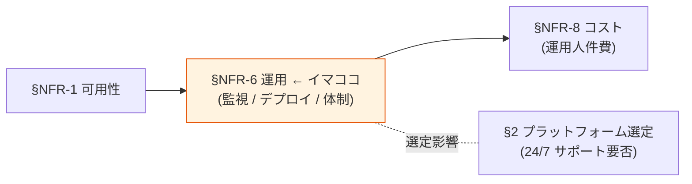

# §NFR-6 運用

> 上位 SSOT: [../00-index.md](../00-index.md) / [00-index.md](00-index.md)
> 詳細: [../../non-functional-requirements.md §6 NFR-OPS](../../non-functional-requirements.md)
> **IPA 非機能要求グレード対応**: **C. 運用・保守性** — 通常運用 / 保守運用 / 障害時運用 / 運用環境 / サポート体制

---

## §NFR-6.0 前提と背景

### 用語整理

| 用語 | 本基盤での意味 |
|---|---|
| **監視・メトリクス** | CloudWatch / Datadog 等で稼働状態を可視化 |
| **アラート通知** | しきい値超え時の通知（SNS / PagerDuty）|
| **ログ保存期間** | コンプライアンス・調査用の長期保管 |
| **CVE 対応** | 公開脆弱性への迅速なパッチ適用 |
| **バージョンアップ** | OS / ミドルウェア / アプリの更新 |
| **24/7 サポート** | 24 時間 365 日のオンコール体制 |

### なぜここ（§NFR-6）で決めるか

運用は **「日常運用 + 障害対応 + 保守」** を含む幅広い領域。Cognito は AWS 透過で運用負荷ゼロ、Keycloak OSS は LTS なしで頻繁 upgrade 必要、RHBK は Red Hat サポート付き。**サポート体制要件**が[§2 プラットフォーム選定](../common/02-platform.md) に直結。

### §NFR-6.0.A 本基盤の運用スタンス

> **Cognito 採用時は AWS 透過で運用ゼロ、Keycloak 採用時は IaC + CloudWatch 監視 + 自動デプロイで運用負荷最小化。商用サポート要件は別途確定。**

### IPA グレード C. 運用・保守性 とのマッピング

| IPA 中項目 | 本基盤 §NFR-6 該当 | 補足 |
|---|---|---|
| C.1 通常運用 | §NFR-6.1 監視・ロギング | 日常監視 |
| C.2 保守運用 | §NFR-6.2 デプロイ・パッチ | バージョンアップ |
| C.3 障害時運用 | §NFR-6.1 + §NFR-6.3 | 検知 + 体制 |
| C.4 運用環境 | §NFR-6.1 | 監視ツール選定 |
| C.5 サポート体制 | §NFR-6.3 | 24/7 / 営業時間 |

### 本章で扱うサブセクション

| サブセクション | 内容 |
|---|---|
| §NFR-6.1 監視・ロギング | CloudWatch / アラート / 検知 |
| §NFR-6.2 デプロイ・パッチ | バージョンアップ / CVE 対応 / CI/CD |
| §NFR-6.3 サポート体制 | 24/7 / 営業時間 / 運用工数 |

---

## §NFR-6.1 監視・ロギング

> **このサブセクションで定めること**: 本基盤の稼働状態を監視するメトリクス・アラート・ログ保存方針。
> **主な判断軸**: 監視ツール選定、アラートしきい値、ログ保存期間
> **§NFR-6 全体との関係**: 障害検知 + 通常運用の中核

### 業界の現在地

- **CloudWatch Metrics + Dashboard**: AWS 標準
- **アラート**: SNS + PagerDuty / Slack 連携
- **ログ保存**: 法定要件次第で 1 年〜10 年

### 対応能力マトリクス

| 機能 | Cognito | Keycloak |
|---|:---:|:---:|
| 監視・メトリクス | ✅ CloudWatch | ✅ Keycloak Metrics + CloudWatch |
| アラート通知 | ✅ CloudWatch Alarm + SNS | ✅ |
| ログ保存（CloudWatch / S3）| ✅ CloudTrail + CloudWatch | ✅ Event Log + CloudWatch |
| ログ検索性 | ✅ CloudWatch Insights | ⚠ Event Listener 自前 |

### ベースライン

| 項目 | 推奨デフォルト |
|---|---|
| 監視ツール | CloudWatch Metrics + Dashboard |
| アラート通知 | CloudWatch Alarm + SNS |
| ログ保存期間 | 法定要件次第（1 年〜10 年）|
| ログ検索 | CloudWatch Insights / S3 + Athena |

### TBD / 要確認

| 確認項目 | 回答例 |
|---|---|
| ログ保存期間 | 1 年 / 3 年 / 6 年 / 10 年 |
| 監視ダッシュボード共有 | 弊社内 / 顧客管理者 / 監査人 |

---

## §NFR-6.2 デプロイ・パッチ

> **このサブセクションで定めること**: バージョンアップ・パッチ適用の方針と頻度。
> **主な判断軸**: CVE 対応速度、サービス影響、設定変更プロセス
> **§NFR-6 全体との関係**: 保守運用の中核。Keycloak OSS は LTS なしで負荷大

### 業界の現在地

- **Keycloak OSS**: 年 4 minor + 2-3 年 major、**LTS なし**、6 ヶ月メンテで強制 upgrade
- **Keycloak RHBK**: 26.x = 2 年サポート、27.x 以降 = 3 年
- **Cognito**: AWS 透過、顧客作業ゼロ

### 対応能力マトリクス

| 機能 | Cognito | Keycloak OSS | Keycloak RHBK |
|---|:---:|:---:|:---:|
| バージョンアップ | ✅ AWS 透過 | ⚠ **年 4 回手動** | ⚠ 2-3 年延長サポート |
| CVE パッチ | ✅ AWS 自動 | ⚠ **CVE 監視 + 手動 Image 更新** | ✅ Red Hat 配信 |
| 設定変更プロセス | ✅ Terraform | ⚠ Realm は別管理 | 同左 |
| CI/CD | ✅ Terraform | ✅ Terraform + Docker | 同左 |

### ベースライン

| 項目 | 推奨デフォルト |
|---|---|
| バージョンアップ方針 | Cognito 透過 / Keycloak は LTS （RHBK）を推奨 |
| CVE パッチ適用 | 緊急 N 日以内、定例 N 週間以内 |
| 設定変更プロセス | **IaC（Terraform）+ レビュー** |
| デプロイ自動化 | **CI/CD 必須** |

---

## §NFR-6.3 サポート体制

> **このサブセクションで定めること**: 障害時のサポート体制（24/7 / 営業時間）と運用工数。
> **主な判断軸**: 顧客 SLA、運用人件費
> **§NFR-6 全体との関係**: [§2 プラットフォーム選定](../common/02-platform.md) に直結

### 業界の現在地

- **Cognito**: AWS Support（Premium 24/7 可）
- **Keycloak OSS**: コミュニティ（ベストエフォート）
- **Keycloak RHBK**: **Red Hat 24/7** 商用サポート

### 対応能力マトリクス

| 機能 | Cognito | Keycloak OSS | Keycloak RHBK |
|---|:---:|:---:|:---:|
| 24/7 商用サポート | ✅ AWS Premium Support | ❌ | ✅ Red Hat 24/7 |
| 運用工数（月）| ✅ ほぼ不要 | ⚠ ~21 時間/月 | ⚠ ~10 時間/月（半減想定）|
| インシデント対応 | AWS Support | 自社対応 | Red Hat 支援 |

### ベースライン

| 項目 | 推奨デフォルト |
|---|---|
| サポート体制 | 顧客要件次第（24/7 必須 → Cognito or RHBK） |
| 運用工数目安 | Cognito ほぼゼロ / Keycloak 月 21h |
| インシデント SLA | 顧客契約次第 |

### TBD / 要確認

| 確認項目 | 回答例 |
|---|---|
| 24/7 サポート Must | はい / 営業時間のみ / 不要 |
| 運用主体 | 弊社 / 顧客 / 共同 |
| インシデント SLA | RTO 連動 |

---

## 参考資料

- [AWS Support Plans](https://aws.amazon.com/premiumsupport/plans/)
- [Red Hat build of Keycloak Support Lifecycle](https://access.redhat.com/support/policy/updates/red_hat_build_of_keycloak_notes)
- [IPA 非機能要求グレード 2018 - C. 運用・保守性](https://www.ipa.go.jp/archive/digital/iot-en-ci/jyouryuu/hikinou/index.html)
