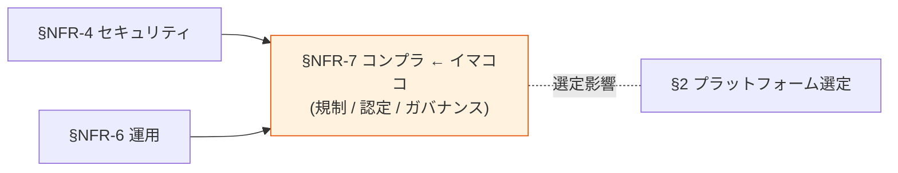

# §NFR-7 コンプライアンス

> 上位 SSOT: [../00-index.md](../00-index.md) / [00-index.md](00-index.md)   
> 詳細: [../../non-functional-requirements.md §7 NFR-COMP](../../non-functional-requirements.md)   
> **IPA 非機能要求グレード対応**: **E. セキュリティ + C. 運用** — 規制対応 / 業界認定 / データガバナンス（IPA 直接対応なし、独立章として扱う）

---

## §NFR-7.0 前提と背景

### 用語整理

| 用語 | 本基盤での意味 |
|---|---|
| **個人情報保護法** | 日本国内の個人情報取扱規制 |
| **GDPR** | EU 一般データ保護規則 |
| **SOC 2 Type II** | 米国系セキュリティ監査基準 |
| **ISO 27001** | 情報セキュリティ管理国際標準 |
| **PCI DSS** | カード会員データ保護基準 |
| **FIPS 140-2** | 米国連邦政府用暗号モジュール認定（→ RHBK 必須化要因）|
| **HIPAA** | 米国医療情報保護法 |
| **ISMAP** | 政府情報システム向けセキュリティ評価制度（日本）|

### なぜここ（§NFR-7）で決めるか



コンプライアンスは **規制への適合**。**FIPS 140-2 が Must なら RHBK 必須**、**ISMAP 対応なら AWS リージョン制約**等、プラットフォーム選定に直結。

### §NFR-7.0.A 本基盤のコンプライアンス・スタンス

> **個人情報保護法を最低ラインとし、業界別規制（GDPR / SOC 2 / ISO 27001 / PCI DSS / FIPS / HIPAA / ISMAP 等）を要件次第で対応。AWS マネージドサービスの認定を活用して効率化する。**

### 規制マッピング

| 規制 | 適用範囲 | 本基盤への影響 |
|---|---|---|
| **個人情報保護法** | 日本国内 | データ最小化 / 削除権 / 監査ログ |
| **GDPR / CCPA** | 海外展開時 | データ主体権利 + データ所在地 |
| **SOC 2 Type II** | 米国系顧客 | アクセス制御 / 監査ログ |
| **ISO 27001** | グローバル | 情報セキュリティ全般 |
| **PCI DSS v4.0** | カード扱い | 暗号化 + 認証 + 監査 |
| **FIPS 140-2** | 米国政府 / 一部金融 | **RHBK 必須化** |
| **HIPAA** | 米国医療 | データ暗号化 + 監査 |
| **ISMAP** | 日本政府機関 | AWS リージョン + ISMAP 認定 |

### 本章で扱うサブセクション

| サブセクション | 内容 |
|---|---|
| §NFR-7.1 規制・法令対応 | 個人情報保護法 / GDPR / データ所在地 |
| §NFR-7.2 業界認定・監査 | SOC 2 / ISO 27001 / PCI DSS / FIPS / HIPAA |
| §NFR-7.3 データガバナンス | 個人データ削除権 / 鍵ローテーション |

---

## §NFR-7.1 規制・法令対応

> **このサブセクションで定めること**: 地域・業界別の法令への適合範囲。   
> **主な判断軸**: 適用地域、データ主体権利、データ所在地制約   
> **§NFR-7 全体との関係**: 法的義務、必須対応領域

### 業界の現在地

- **個人情報保護法**: 2022 年改正で罰則強化、データ主体権利強化
- **GDPR Right to Erasure**: 30 日以内応答義務、EDPB 2026 enforcement framework が backup systems も対象化
- **データ所在地**: 業界・規制次第（金融 / 医療 / 政府は厳格）

### ベースライン

| 項目 | 推奨デフォルト |
|---|---|
| 個人情報保護法 | **Must**（標準準拠） |
| GDPR / CCPA | 海外展開時 |
| データ所在地 | 顧客要件次第（国内 / 特定リージョン） |

### TBD / 要確認

| 確認項目 | 回答例 |
|---|---|
| 適用地域 | 日本のみ / グローバル |
| データ所在地制約 | 国内 / 特定リージョン / なし |

---

## §NFR-7.2 業界認定・監査

> **このサブセクションで定めること**: 業界認定の取得・準拠範囲。   
> **主な判断軸**: 顧客業界、契約要件   
> **§NFR-7 全体との関係**: **FIPS 140-2 / 24/7 サポートはプラットフォーム選定に直結**

### 対応能力マトリクス

| 認定 | Cognito | Keycloak OSS | Keycloak RHBK |
|---|:---:|:---:|:---:|
| SOC 2 Type II | ✅ AWS 認定 | ⚠ 自前運用責任 | ✅ + Red Hat 支援 |
| ISO 27001 | ✅ AWS 認定 | ⚠ 自前 | ✅ + Red Hat 支援 |
| PCI DSS | ✅ AWS 認定 | ⚠ 自前 | ⚠ 自前 + Red Hat 支援 |
| **FIPS 140-2** | ⚠ FIPS Endpoint 経由 | ❌ | ✅ **ネイティブ** |
| HIPAA | ✅ AWS BAA 可 | 自前運用責任 | ✅ + Red Hat 支援 |
| ISMAP | ✅ AWS 認定リージョン | 自前 | 自前 |

### ベースライン

| 項目 | 推奨デフォルト |
|---|---|
| SOC 2 / ISO 27001 | AWS 認定を活用 |
| PCI DSS | 顧客要件次第 |
| **FIPS 140-2** | 要件 Must → **RHBK 必須** |

### TBD / 要確認

| 確認項目 | 回答例 |
|---|---|
| 必須認定 | SOC 2 / ISO 27001 / PCI DSS / FIPS / HIPAA / ISMAP / なし |
| FIPS 140-2 Must | **はい → RHBK 必須** / いいえ |
| 監査ログ法定保存期間 | 1 年 / 3 年 / 6 年（医療）/ 10 年（金融） |

---

## §NFR-7.3 データガバナンス

> **このサブセクションで定めること**: 個人データ削除権、暗号鍵ローテーション、データの可視性・追跡性。   
> **主な判断軸**: GDPR / 個人情報保護法のデータ主体権利   
> **§NFR-7 全体との関係**: 法令対応の運用レベル実装

### ベースライン

| 項目 | 推奨デフォルト |
|---|---|
| 個人データ削除権 | **30 日以内応答**（GDPR / 個人情報保護法）|
| アクセス監査追跡 | **全認証イベント記録** |
| 暗号鍵ローテーション | **年 1 回以上**（KMS 自動）|

### TBD / 要確認

| 確認項目 | 回答例 |
|---|---|
| 削除応答 SLA | 即時 / 24 時間 / 30 日（法定）|

---

## §NFR-7.4 クロスアカウントの監査・コンプライアンス対応

> **このサブセクションで定めること**: 共通基盤アカウントとアプリアカウントの分離前提のもとで、**監査ログのアクセス権限分離 / GDPR 削除応答時の協調 / 監査人 / 規制対応の連絡経路**を明確化する。   
> **主な判断軸**: 監査ログの集約・分離レベル、テナント別アクセス制御、削除応答の関与者調整   
> **§NFR-7 全体との関係**: §NFR-7.1〜7.3 の規制要件を、**マルチアカウント運用** の現実に落とし込む

### 監査ログのアクセス権限分離

| 主体 | アクセス範囲 | 取得方法 |
|---|---|---|
| **共通基盤運用** | 共通基盤全ログ | 共通基盤アカウントの CloudWatch Logs / CloudTrail / Security Lake |
| **共通基盤セキュリティ / SOC** | 共通基盤 + アプリのセキュリティ関連ログ | Security Lake 経由（[OCSF 形式](../fr/09-integration.md)）|
| **アプリ運用** | **自テナント分のみ** | Admin REST API の audit endpoint（テナント Scope）|
| **顧客（テナント管理者）** | **自テナント分のみ** | Account Console / Admin API（テナント Scope）|
| **監査人 / 外部監査** | 監査対象範囲のみ Read-Only | 専用 IAM Role（IAM Identity Center 経由）|

### GDPR / 個人情報保護法 削除応答時の協調

```mermaid
flowchart LR
    User[ユーザー<br/>削除請求]
    Cust[顧客<br/>(テナント管理者)]
    AppOps[アプリ運用]
    AuthOps[共通基盤運用]
    Legal[法務]
    Done[完了<br/>(30 日以内)]

    User --> Cust
    Cust --> AppOps
    AppOps -->|削除要請| AuthOps
    AuthOps -->|協調| AppOps
    AppOps -.連動.- Legal
    AuthOps --> Done
    AppOps --> Done

    style AuthOps fill:#fff3e0
    style AppOps fill:#e3f2fd
```

| ステップ | 主体 | 作業 | SLA |
|:---:|---|---|---|
| 1 | エンドユーザー | 顧客に削除請求 | — |
| 2 | 顧客（テナント管理者）| アプリ運用に転送 | 数日 |
| 3 | アプリ運用 | アプリ DB の個人データ削除 + 共通基盤への削除要請 | 数日 |
| 4 | 共通基盤運用 | 共通基盤ユーザーレコード論理削除（即時）→ 物理削除（30 日以内）| **論理 24h / 物理 30 日** |
| 5 | アプリ運用 + 共通基盤運用 | 削除完了の証明書発行（監査用） | 30 日以内 |
| 6 | 顧客 | エンドユーザーへ完了通知 | 30 日以内 |

→ 削除応答は **アプリ運用と共通基盤運用の協調作業**。[§NFR-6.5 D-2 / A-3](06-operations.md) と整合する Runbook 整備が必須。

### ベースライン

| 項目 | 推奨デフォルト |
|---|---|
| 監査ログ集約 | **Security Lake**（OCSF 形式、共通基盤 + アプリ横断）|
| テナント別アクセス制御 | Admin REST API の **テナント Scope token** で実現 |
| 削除応答プロセス | **3-step Runbook**（アプリ → 共通基盤 → 法務確認） |
| 監査人アクセス | Read-Only Role + 期間限定（監査期間中のみ）|

### TBD / 要確認

| 確認項目 | 回答例 |
|---|---|
| 監査ログの集約先 | Security Lake / Splunk / 個別バケット |
| 顧客に提供する監査ログ可視性 | 完全 Read-Only / 自テナント分のみ / なし |
| 削除応答 SLA の管理責任 | アプリ運用 / 共通基盤運用 / 共同 |
| 外部監査の頻度 | 年 1 回 / 半期 / 認定時のみ |

---

## §NFR-7.5 Customer Audit Support（顧客監査支援）

> **詳細は [ADR-036 Customer Audit Support](../../../adr/036-customer-audit-support.md) を参照**

> **このサブセクションで定めること**: B2B 顧客の SOC 2 / ISO 27001 / PCI DSS / HIPAA / FedRAMP 等の**監査要求に対する支援体制と提供物**。Trust Center 公開 / 個別 DDQ 対応 / オンサイト監査受入の 3 層構成。
> **主な判断軸**: B2B エンタープライズ顧客の獲得意思、規制業種顧客の比率、Compliance Team 体制
> **§NFR-7 全体との関係**: §NFR-7.1〜7.4 は本基盤自社の規制対応。§NFR-7.5 は**顧客の監査要求に応える体制**

### 結論サマリ

| 項目 | 採用方針 |
|---|---|
| **基本方針** | **3 層構成**（Trust Center 公開 / 顧客個別対応 / オンサイト監査受入）|
| **Layer 1 Trust Center** | `compliance.example.com` で SOC 2 概要 / ISO 27001 / GDPR DPA / Subprocessor List 公開 |
| **Layer 2 顧客個別** | DDQ / Compliance Matrix / NDA 下エビデンス提供、SLA 5 営業日 |
| **Layer 3 オンサイト監査** | 大口顧客向け年 1-2 回、リモート可 |
| **公開アーティファクト** | 標準 10 種（SOC 2 / ISO 27001 / PCI DSS AOC / GDPR DPA / SLA / Subprocessor List 等）|

### 段階的導入

| Phase | 内容 | タイミング |
|---|---|---|
| Phase 1 | Subprocessor List + GDPR DPA + SLA 公開 | MVP |
| Phase 2 | SOC 2 Type I 監査受審 | 6 ヶ月後 |
| Phase 3 | **SOC 2 Type II**（年次運用エビデンス）| 1 年後 |
| Phase 4 | **ISO 27001 認証**取得 | 1.5 年後 |
| Phase 5 | PCI DSS 認証（必要時）| 顧客需要次第 |
| Phase 6 | FedRAMP 等（必要時）| 顧客需要次第 |

### 業界実例

Salesforce / Microsoft / AWS / Okta / Auth0 / Atlassian / GitHub / Slack 等、**全業界主要 SaaS が Trust Center 運営**（エンタープライズ顧客の前提条件）。

### コスト試算（年額）

| 項目 | 試算 |
|---|---|
| SOC 2 Type II 監査 | $80K |
| ISO 27001 認証維持 | $40K |
| Compliance Team（1 名）| 〜$150K |
| Trust Center インフラ | $3K |
| **合計** | **〜$273K/年**（エンタープライズ顧客 10 社獲得で回収）|

### TBD / 要確認

| 確認項目 | ヒアリング ID | 回答例 |
|---|---|---|
| エンタープライズ顧客の獲得意思 | **B-CAS-1** | 必須 / 望ましい / 不要 |
| 規制業種顧客の比率見込み | **B-CAS-2** | 金融 N 社 / 医療 N 社 / 公共 N 社 / なし |
| SOC 2 Type II 取得タイミング | **B-CAS-3** | MVP 1 年後 / 2 年後 / 不要 |
| ISO 27001 認証取得 | **B-CAS-4** | 1.5 年後 / 不要 |
| PCI DSS 認証要否 | **B-CAS-5** | 必要（カード処理顧客あり）/ 不要 |
| Compliance Team の体制 | **B-CAS-6** | 専任 1 名 / 兼任 / 外部委託 / なし |
| Trust Center 公開範囲 | **B-CAS-7** | Layer 1+2+3 完全 / Layer 1+2 / Layer 1 のみ |

---

## 参考資料

### プロジェクト内 関連ドキュメント

- **[common/pci-dss-appi-compliance-gap.md](../../../common/pci-dss-appi-compliance-gap.md)** — 🔥 **PCI DSS v4.0.1 + APPI 準拠ギャップ分析**：一次資料 (PCI DSS PDF + PPC ガイドライン PDF) verbatim quote 集 + 現状 Stage A × 規制マッピング + 必須対応 Top 12 + 要件定義 10 ゲーティング論点
- [§FR-7.4.8 PCI DSS / APPI 適合性整理（JIT/SCIM 選定への影響）](../fr/07-user.md)

### 外部資料

- [PCI DSS v4.0.1 (June 2024)](https://www.pcisecuritystandards.org/document_library/) — PCI Security Standards Council 公式（無料登録後 DL）
- [個人情報の保護に関する法律 (e-Gov)](https://laws.e-gov.go.jp/document?lawid=415AC0000000057)
- [PPC ガイドライン 通則編](https://www.ppc.go.jp/files/pdf/260401_guidelines01.pdf) — 個人情報保護委員会
- [PPC 漏えい等の対応](https://www.ppc.go.jp/personalinfo/legal/leakAction/)
- [PPC 外国にある第三者への提供編](https://www.ppc.go.jp/files/pdf/251212_guidelines02.pdf)
- [NIST SP 800-63B Rev 4 - Authentication](https://pages.nist.gov/800-63-4/sp800-63b.html)
- [GDPR Article 17 - Right to Erasure](https://gdpr.eu/article-17-right-to-be-forgotten/)
- [EDPB CEF 2025-2026 Erasure Enforcement](https://www.mccannfitzgerald.com/knowledge/data-privacy-and-cyber-risk/delete-and-disclose-edpb-cef-2025-2026)
- [11 SSO Compliance Requirements Compared - Security Boulevard 2026](https://securityboulevard.com/2026/04/11-sso-compliance-requirements-compared-soc-2-iso-27001-hipaa-pci-dss-and-gdpr/)
- [ISMAP 制度公式](https://www.ismap.go.jp/)
- [Red Hat build of Keycloak FIPS](https://developers.redhat.com/articles/2023/11/21/red-hat-build-keycloak-provides-fips-140-2-support)
