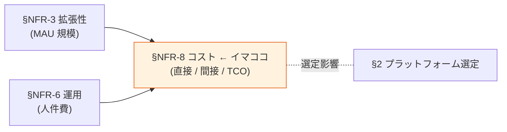
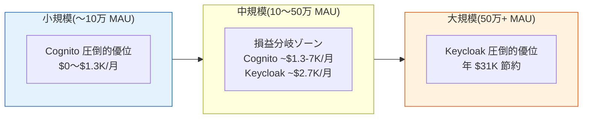

# §NFR-8 コスト

> 上位 SSOT: [../00-index.md](../00-index.md) / [00-index.md](00-index.md)
> 詳細: [../../non-functional-requirements.md §8 NFR-COST](../../non-functional-requirements.md)
> **IPA 非機能要求グレード対応**: （IPA 範囲外 — 本基盤独自の重要要件として独立章）

---

## §NFR-8.0 前提と背景

### 用語整理

| 用語 | 本基盤での意味 |
|---|---|
| **MAU**（Monthly Active User）| 月間アクティブユーザー数。Cognito の課金単位 |
| **TCO**（Total Cost of Ownership）| 初期 + 運用 + 人件費を含む総保有コスト |
| **損益分岐点** | Cognito と Keycloak のコストが逆転する MAU 規模 |
| **直接コスト** | プラットフォーム利用料・インフラ費 |
| **間接コスト** | 運用人件費・サポート費 |

### なぜここ（§NFR-8）で決めるか

コスト要件は **IPA 範囲外**だが、認証基盤の選定では最大級の論点。MAU 規模次第で Cognito vs Keycloak の損益分岐が決まる。

### §NFR-8.0.A 本基盤のコスト・スタンス

> **3 年 TCO で評価する。小規模（〜17.5 万 MAU）は Cognito 優位、大規模は Keycloak 優位。RHBK 採用時は商用サポート費を含めて評価。**

### 本章で扱うサブセクション

| サブセクション | 内容 |
|---|---|
| §NFR-8.1 直接コスト | プラットフォーム利用料・インフラ |
| §NFR-8.2 間接コスト | 運用人件費・サポート費 |
| §NFR-8.3 3 年 TCO | 規模別の総保有コスト |

---

## §NFR-8.1 直接コスト

> **このサブセクションで定めること**: プラットフォーム利用料・インフラ費の試算。
> **主な判断軸**: MAU 規模、ティア選定、機能要件
> **§NFR-8 全体との関係**: コストの主要構成要素

### Cognito 月額コスト（2026 年現在）

| MAU | Lite | Essentials | Plus |
|---|---|---|---|
| 〜10K | **$0**（無料枠）| **$0**（無料枠）| $200 |
| 50K | $220 | $600 | $1,000 |
| 100K | $450 | $1,350 | $2,000 |
| 500K | $1,225 | $7,350 | $10,000 |
| 1M | $2,450 | $14,850 | $20,000 |

### Keycloak 月額コスト（インフラ）

| 項目 | OSS | RHBK |
|---|---|---|
| インフラ（ECS + RDS + ALB）| ~$987 | ~$987 |
| サブスクリプション | $0 | $5,000〜30,000/年/ノード |
| **小計** | **~$987/月** | **~$1,400-3,500/月** |

---

## §NFR-8.2 間接コスト

> **このサブセクションで定めること**: 運用人件費・サポート費の試算。
> **主な判断軸**: 運用工数、24/7 サポート要否
> **§NFR-8 全体との関係**: TCO の重要構成要素

### ベースライン

| 項目 | Cognito | Keycloak OSS | Keycloak RHBK |
|---|---|---|---|
| 運用人件費（月）| ~$0（AWS 透過）| ~$1,680（21h × $80）| ~$840（半減、Red Hat 支援）|
| サポート費 | AWS Support 内 | 自社対応 | RHBK サブスク内 |

---

## §NFR-8.3 3 年 TCO

> **このサブセクションで定めること**: 規模別の総保有コスト試算。
> **主な判断軸**: MAU 規模、サポート水準、3 年運用想定
> **§NFR-8 全体との関係**: 最終的なプラットフォーム選定判断

### 3 年 TCO（規模別、業界ベンチマーク）

| 規模 | Cognito Essentials | Keycloak OSS | Keycloak RHBK |
|---|---|---|---|
| 10 万 MAU | **$54K** | $124K | $200K+ |
| 50 万 MAU | $270K | **$124K** | $200K+ |
| 100 万 MAU | $540K | **$124K** | $200K+ |

→ **損益分岐：約 17.5 万 MAU**（[ADR-006](../../../adr/006-cognito-vs-keycloak-cost-breakeven.md)）
→ **Plus ティア利用時の損益分岐：約 7.5 万 MAU**

### 損益分岐の可視化

### TBD / 要確認

| 確認項目 | 回答例 |
|---|---|
| 想定 1 年後 / 3 年後 MAU | N 万 / M 万 |
| 予算レンジ（3 年 TCO）| $N |
| 24/7 商用サポート要否 | はい（コスト増）/ いいえ |
| RHBK サブスク予算 | 確保可 / 不可 |

---

## 参考資料

- [Amazon Cognito Pricing 2026](https://aws.amazon.com/cognito/pricing/)
- [Keycloak vs Cognito 10k concurrent benchmark - johal.in 2026](https://johal.in/benchmark-keycloak-220-vs-aws-cognito-2026-10k/)
- [ADR-006 Cognito vs Keycloak Cost Breakeven](../../../adr/006-cognito-vs-keycloak-cost-breakeven.md)
- [keycloak-upstream-vs-rhbk.md](../../../reference/keycloak-upstream-vs-rhbk.md)
