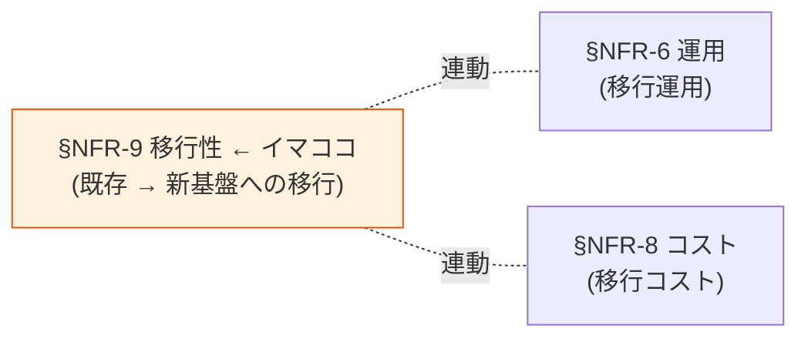

# §NFR-9 移行性

> 上位 SSOT: [../00-index.md](../00-index.md) / [00-index.md](00-index.md)   
> 詳細: [../../non-functional-requirements.md §9 NFR-MIG](../../non-functional-requirements.md)   
> **IPA 非機能要求グレード対応**: **D. 移行性** — 移行時期 / 移行方式 / 移行対象データ / 移行計画

---

## §NFR-9.0 前提と背景

### 用語整理

| 用語 | 本基盤での意味 |
|---|---|
| **既存認証システム** | 顧客が現在利用中の認証基盤（自社製 / 他社製 IdP）|
| **パスワードハッシュ移行** | 既存ユーザーのパスワードを再設定なしで持ち越す |
| **段階的移行** | 全システム一斉切替ではなく、段階的に移行 |
| **データエクスポート** | ベンダーロックイン回避のためのデータ持ち出し |
| **並行稼働** | 旧基盤と新基盤を一時的に並行運用 |

### なぜここ（§NFR-9）で決めるか

移行性は **「導入時の負担最小化」**と**「将来のベンダーロックイン回避」**の両面を扱う。既存ユーザーのパスワードハッシュ持ち越し可否、段階的移行の実現性が論点。

### §NFR-9.0.A 本基盤の移行性スタンス

> **既存システムからの段階的移行をサポート。並行稼働期間を設けて段階移行を可能にする。パスワードハッシュ持ち越しは技術的制約あり、要確認。**

### IPA グレード D. 移行性 とのマッピング

| IPA 中項目 | 本基盤 §NFR-9 該当 | 補足 |
|---|---|---|
| D.1 移行時期 | §NFR-9.0 | プロジェクト計画 |
| D.2 移行方式 | §NFR-9.3 段階的移行 | 一括 / 段階 / 並行稼働 |
| D.3 移行対象データ | §NFR-9.1 ユーザー移行 / §NFR-9.2 パスワードハッシュ | データ範囲 |
| D.4 移行計画 | §NFR-9.0 | 全体計画 |
| ベンダーロックイン回避 | §NFR-9.4 データエクスポート | OIDC 標準準拠 |

### 本章で扱うサブセクション

| サブセクション | 内容 |
|---|---|
| §NFR-9.1 ユーザー移行 | 既存ユーザー DB からの取り込み |
| §NFR-9.2 パスワードハッシュ移行 | 既存ハッシュの持ち越し |
| §NFR-9.3 段階的移行 | 並行稼働 / 段階切替 |
| §NFR-9.4 ベンダーロックイン回避 | エクスポート / OIDC 標準準拠 |

---

## §NFR-9.1 ユーザー移行

> **このサブセクションで定めること**: 既存認証システムからのユーザーアカウント取り込み方法。   
> **主な判断軸**: 既存ユーザー件数、データ形式、移行ウィンドウ   
> **§NFR-9 全体との関係**: 移行の主要対象

### 対応能力マトリクス

| 機能 | Cognito | Keycloak (OSS/RHBK) |
|---|:---:|:---:|
| バルクインポート（CSV / JSON）| ✅ ImportUsers | ✅ Realm Import |
| Lambda Trigger 経由のカスタム移行 | ✅ User Migration Lambda | ✅ Custom UserStorageProvider |
| SCIM 経由の段階的取り込み | ⚠ Lambda 実装 | ✅ プラグイン対応 |

### ベースライン

| 項目 | 推奨デフォルト |
|---|---|
| バルクインポート | **Should**（初期移行用） |
| 段階的取り込み | JIT or SCIM |
| 移行検証 | テストユーザーで事前確認 |

### TBD / 要確認

| 確認項目 | 回答例 |
|---|---|
| 既存ユーザー件数 | N 万 |
| 既存システム種別 | 自社製 / Keycloak / Auth0 / その他 |
| 移行ウィンドウ | 計画停止可 / 無停止必須 |

---

## §NFR-9.2 パスワードハッシュ移行

> **このサブセクションで定めること**: 既存パスワードハッシュの持ち越し可否。   
> **主な判断軸**: ハッシュアルゴリズム互換性、ユーザー体験   
> **§NFR-9 全体との関係**: 「**全員再設定なし**で移行できるか」の核心

### 業界の現在地

- **Cognito**: ハッシュ形式制約あり（特定アルゴリズムのみ対応、互換性次第で再設定必要）
- **Keycloak**: **Custom Hash Provider** で任意のハッシュアルゴリズム実装可（OSS 強み）

### 対応能力マトリクス

| 機能 | Cognito | Keycloak (OSS/RHBK) |
|---|:---:|:---:|
| パスワードハッシュ持ち越し | ⚠ **ハッシュ形式制約あり** | ✅ **Custom Hash Provider** で対応可 |

### ベースライン

| 項目 | 推奨デフォルト |
|---|---|
| 既存ハッシュ持ち越し | 形式次第で判断 |
| 互換不可時 | **初回ログイン時に再設定**（パスワードリセットメール送付）|

### TBD / 要確認

| 確認項目 | 回答例 |
|---|---|
| 既存パスワードハッシュ形式 | bcrypt / PBKDF2 / SHA-256 / 独自 |
| 全員再設定可否 | 可（簡単）/ 不可（持ち越し必須）|

---

## §NFR-9.3 段階的移行 + クロスアカウントの主体分担

> **このサブセクションで定めること**: 全システム一斉切替ではなく、段階的に移行する方式と、**既存システム（アプリアカウント）から共通基盤（共通基盤アカウント）へのデータ移行の主体分担・調整プロセス**。   
> **主な判断軸**: 業務影響最小化、リスク分散、データ移送経路のセキュリティ   
> **§NFR-9 全体との関係**: 移行リスクの主要管理手段。[§NFR-6.5 D-1 一括インポート](06-operations.md) と [§NFR-6.4 構成変更プロセス](06-operations.md) を移行プロジェクトに適用する

### ベースライン

| 項目 | 推奨デフォルト |
|---|---|
| 段階的移行 | **可能**（並行稼働期間を設ける）|
| 並行稼働期間 | 1〜3 ヶ月（システム数次第）|
| ロールバック方針 | 並行期間内は旧基盤へ戻せる |

### 主体分担とクロスアカウント調整

| ステップ | 主体 | 作業 | クロスアカウント |
|:---:|---|---|:---:|
| 1. 既存システム棚卸 | アプリ運用 + 顧客 | 既存ユーザー件数 / 認証方式 / ハッシュ形式 / 属性スキーマ調査 | — |
| 2. 受け入れ側準備 | **共通基盤運用** | User Pool / Realm 作成、属性設計、IdP 設定 | ✅ Git PR |
| 3. データエクスポート | **アプリ運用** | 既存システムから CSV / JSON / LDIF でエクスポート | アプリアカウント内 |
| 4. 転送経路設定 | 共通基盤運用 + アプリ運用 | SCIM 経路 / S3 経由 / VPC PrivateLink 等を確立 | ✅ 両アカウント設定 |
| 5. テスト移行 | 共通基盤運用 + アプリ運用 | 少数ユーザーで完全フロー検証 | ✅ |
| 6. 本番移行 | **共通基盤運用** | バルクインポート実施、検証 | ✅ |
| 7. 切替・並行稼働 | アプリ運用 | アプリの認証先を新基盤に切替、旧基盤と並行運用 | アプリアカウント内 |
| 8. 旧基盤停止 | アプリ運用 | ロールバック不要を確認後、旧基盤停止 | アプリアカウント内 |

### 移行データの転送経路（選択肢）

| 経路 | 説明 | セキュリティ | 推奨度 |
|---|---|---|:---:|
| **SCIM API（推奨）** | アプリアカウントから SCIM Push で逐次同期。本番移行後もこのまま継続利用可 | ✅ TLS + OAuth | ✅ |
| **S3 経由（バッチ）** | 暗号化済 CSV/JSON を S3 に置く → 共通基盤側で読込 | ✅ KMS 暗号化 + Cross-Account S3 | △ 一括移行のみ |
| **VPC PrivateLink** | 両 VPC を PrivateLink でつなぎ、ETL ツールで転送 | ✅ インターネット非経由 | △ 大規模時 |
| **オフライン（USB / 物理）** | 規制で電子経路不可の場合のみ | △ 物理紛失リスク | ❌ 規制要件時のみ |

### TBD / 要確認

| 確認項目 | 回答例 |
|---|---|
| 移行方式 | 段階的 / 一括 |
| システム移行順序 | 重要度低 → 高 / 業務優先度順 |
| データ移送経路 | SCIM / S3 / PrivateLink / オフライン |
| 移行作業の主体分担 | 既存システム = アプリ運用、受け入れ = 共通基盤運用 / 共同 |
| 移行期間中のサポート責任 | 旧基盤 = 既存ベンダー、新基盤 = 共通基盤運用 |

---

## §NFR-9.4 ベンダーロックイン回避

> **このサブセクションで定めること**: 将来別基盤への移行可能性の確保。   
> **主な判断軸**: OIDC 標準準拠、データエクスポート   
> **§NFR-9 全体との関係**: 戦略的な逃げ道確保

### 業界の現在地

- **OIDC 標準準拠**: ベンダー間の移植性を確保
- **Cognito**: AWS 依存はあるが、OIDC 標準準拠なので JWT 検証ロジックは別 IdP でも同じ
- **Keycloak**: OSS で別 AWS / オンプレ / 他クラウドへも移行可能

### 対応能力マトリクス

| 機能 | Cognito | Keycloak |
|---|:---:|:---:|
| OIDC 標準準拠 | ✅ | ✅ |
| データエクスポート | ✅ ListUsers + S3 Export | ✅ Realm Export |
| 別 IdP への移植性 | ⚠ AWS 依存 | ✅ OSS、移行可能 |

### ベースライン

| 項目 | 推奨デフォルト |
|---|---|
| OIDC 標準準拠 | **Must**（[§FR-9.1 プロトコル準拠](../fr/09-integration.md) と整合）|
| データエクスポート | 必要時に可能 |

---

## 参考資料

- [Cognito User Migration Lambda](https://docs.aws.amazon.com/cognito/latest/developerguide/user-pool-lambda-migrate-user.html)
- [Keycloak Custom UserStorageProvider](https://www.keycloak.org/docs/latest/server_development/index.html#_user-storage-spi)
- [IPA 非機能要求グレード 2018 - D. 移行性](https://www.ipa.go.jp/archive/digital/iot-en-ci/jyouryuu/hikinou/index.html)
