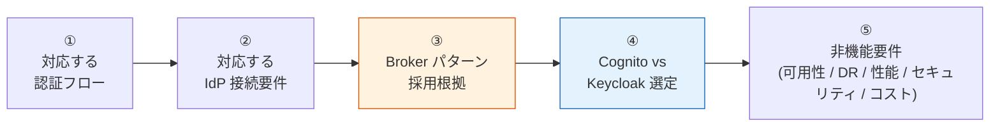
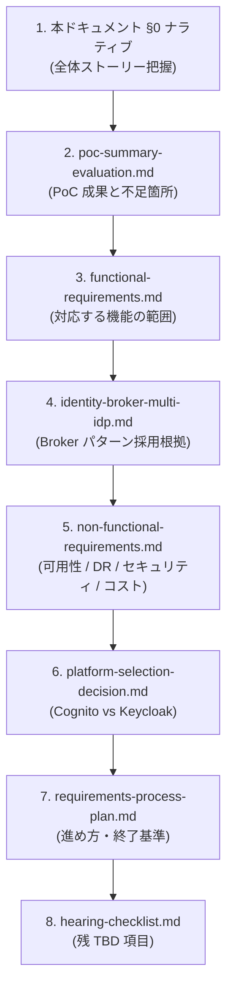
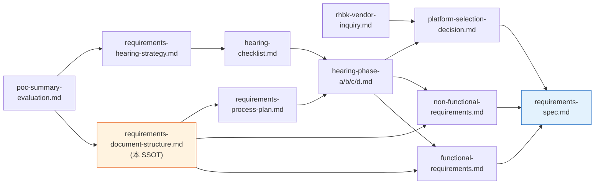

# 要件定義資料の構成案（SSOT）

> 最終更新: 2026-05-13（SSOT 化：§0 ナラティブ / §8 依存関係 / §9 状態ダッシュボード / §10 ID 体系ルール を追加）
> 目的: 要件定義フェーズで作成すべきドキュメント体系・作成順序・**語る順序（ナラティブ）**・状態の単一情報源
> 位置付け: 本ドキュメントは要件定義フェーズの **SSOT (Single Source of Truth)**。プロセス（どう進めるか）は [requirements-process-plan.md](requirements-process-plan.md)、ヒアリング項目は [hearing-checklist.md](hearing-checklist.md) を参照。

---

## 0. 要件定義の語る順序（ナラティブ）

要件定義書（`requirements-spec.md`）および対顧客説明資料は、以下の 5 ステップで論理を組み立てる。**「対応する認証フローを示す → それを実現する構成として Broker を採用 → 実装プラットフォームを選定」** が本フェーズの中核ストーリー。



### 0.1 各ステップで答える問いと参照先

| Step | 答える問い | 一次ソース | 補強ドキュメント |
|:---:|---|---|---|
| ① | **どんな認証フローに対応する基盤か？**（SPA / SSR / Mobile / M2M） | [functional-requirements.md §1.1 FR-AUTH 認証フロー](functional-requirements.md) | [auth-patterns.md](../common/auth-patterns.md)、[system-design-patterns.md](../common/system-design-patterns.md) |
| ② | **どんな顧客 IdP 構成に対応する基盤か？**（Entra ID / Okta / Google / SAML / LDAP） | [functional-requirements.md §2 FR-FED](functional-requirements.md) | [identity-broker-multi-idp.md](../common/identity-broker-multi-idp.md) |
| ③ | **なぜ Broker パターンか？**（代替案として個別連携 / Mesh / Fabric / BYOI と比較） | [identity-broker-multi-idp.md](../common/identity-broker-multi-idp.md) | [sso-implementation-types.md](../reference/sso-implementation-types.md)、[user-types-and-auth.md](../common/user-types-and-auth.md) |
| ④ | **Cognito か Keycloak か？**（要件 × 制約 × コスト） | [platform-selection-decision.md](platform-selection-decision.md) | [ADR-006](../adr/006-cognito-vs-keycloak-cost-breakeven.md)、[ADR-014](../adr/014-auth-patterns-scope.md)、[ADR-015](../adr/015-rhbk-validation-deferred.md) |
| ⑤ | **可用性・DR・性能・コストの目標は？** | [non-functional-requirements.md](non-functional-requirements.md) | [keycloak-network-architecture.md](../common/keycloak-network-architecture.md)、[ADR-010〜013](../adr/) |

### 0.2 ステップ ③（Broker 採用根拠）の論理構造

Broker パターン採用の根拠は ① と ② から導出される（独立した「Broker を採用する理由」ではない）:

| ①／② の要件 | 帰結 |
|---|---|
| FR-AUTH-001〜003 が Must（複数の Grant Type / Client 種別を統一的に提供） | OIDC/OAuth 標準実装の認可サーバーが必要 |
| FR-FED-010 が Must（複数顧客 IdP を並行運用） | 集約点が必要 = **Hub-and-Spoke** |
| FR-FED-011 が Must（顧客追加で各システム変更不要） | 各システムが見る issuer は 1 つ = **Broker が JWT 一元化** |
| FR-FED-009 が Must（IdP ごとのクレーム差異を吸収） | 属性変換層が必要 = **Broker の attribute mapping / Protocol Mapper** |

→ ①②③ の要件が確定すれば、Broker パターン採用は**自動的に導かれる**（選択というより必然）。Cognito vs Keycloak は ④ で「どの Broker 実装か」のみが残論点。

---

## 1. ドキュメント体系の全体像

```
doc/requirements/
├── 00-index.md                          ← 本フォルダのインデックス
│
├── [報告・総括]
│   ├── poc-summary-evaluation.md        ← PoC 総括評価（作成済み）
│   └── poc-presentation.md              ← PoC 報告プレゼン資料（ステークホルダー向け要約）
│
├── [ヒアリング]
│   ├── requirements-hearing-strategy.md ← ヒアリング戦略（作成済み）
│   ├── hearing-phase-a.md               ← Phase A: 事業要件ヒアリング記録
│   ├── hearing-phase-b.md               ← Phase B: 技術要件ヒアリング記録
│   ├── hearing-phase-c.md               ← Phase C: 運用・セキュリティ要件記録
│   └── hearing-phase-d.md               ← Phase D: 最終判断会議記録
│
├── [要件定義書]
│   ├── requirements-spec.md             ← 要件定義書（本体）
│   ├── functional-requirements.md       ← 機能要件一覧
│   ├── non-functional-requirements.md   ← 非機能要件一覧
│   └── platform-selection-decision.md   ← プラットフォーム選定判断書
│
└── [付録]
    ├── migration-strategy.md            ← 移行戦略（既存 → 新基盤）
    └── cost-estimation.md               ← コスト見積もり（詳細版）
```

---

## 2. 各ドキュメントの概要と作成順序

### Phase 1: PoC 報告（Week 1 前半）

| # | ドキュメント | 目的 | ページ数目安 | 状態 |
|---|------------|------|-------------|------|
| 1 | poc-summary-evaluation.md | PoC 成果の総括・不足箇所の特定 | 10-15 | ✅ 作成済み |
| 2 | poc-presentation.md | ステークホルダー向け報告資料 | 5-8 | 📋 作成予定 |

**poc-presentation.md の構成案**:
1. PoC の目的と背景（1 ページ）
2. 検証した認証パターン（2 ページ: 図中心）
3. Cognito vs Keycloak 比較結果（1 ページ: 表）
4. コスト比較（1 ページ: グラフ）
5. 主要な技術的知見（1 ページ）
6. 要件定義で確認すべき事項（1 ページ）
7. 推奨ロードマップ（1 ページ）

### Phase 2: ヒアリング実施（Week 1-3）

| # | ドキュメント | 目的 | 作成タイミング |
|---|------------|------|-------------|
| 3 | requirements-hearing-strategy.md | ヒアリング計画 | ✅ 作成済み |
| 4 | hearing-phase-a.md | 事業要件の確認結果 | Week 1 ヒアリング後 |
| 5 | hearing-phase-b.md | 技術要件の確認結果 | Week 2 ヒアリング後 |
| 6 | hearing-phase-c.md | 運用・セキュリティ要件の確認結果 | Week 3 ヒアリング後 |

### Phase 3: 要件定義書作成（Week 3-4）

| # | ドキュメント | 目的 | 作成タイミング |
|---|------------|------|-------------|
| 7 | requirements-spec.md | 要件定義書（本体） | ヒアリング完了後 |
| 8 | functional-requirements.md | 機能要件の詳細 | 7 と並行 |
| 9 | non-functional-requirements.md | 非機能要件の詳細 | 7 と並行 |
| 10 | platform-selection-decision.md | Cognito / Keycloak 最終判断 | 要件確定後 |

### Phase 4: 付録・補足資料（Week 4-5）

| # | ドキュメント | 目的 | 作成タイミング |
|---|------------|------|-------------|
| 11 | migration-strategy.md | 既存システムからの移行戦略 | 要件確定後 |
| 12 | cost-estimation.md | 詳細コスト見積もり | プラットフォーム確定後 |

---

## 3. 要件定義書（requirements-spec.md）の構成案

要件定義の中核ドキュメント。ヒアリング結果を統合して作成する。

```markdown
# 共有認証基盤 要件定義書

## 1. はじめに
  1.1 文書の目的
  1.2 対象範囲
  1.3 用語定義
  1.4 関連ドキュメント

## 2. ビジネス要件
  2.1 プロジェクトの背景と目的
  2.2 対象システム一覧
  2.3 ステークホルダー
  2.4 ビジネス上の制約（予算・期限・法規制）

## 3. システム概要
  3.1 システム構成図（PoC architecture.md ベース）
  3.2 認証基盤の責任範囲
  3.3 利用システムの責任範囲
  3.4 責任分界点

## 4. 機能要件（→ functional-requirements.md で詳細化）
  4.1 認証機能
    - ローカルユーザー認証
    - フェデレーション認証（Entra ID / Okta / SAML）
    - MFA（TOTP / WebAuthn / SMS）
    - SSO（シングルサインオン / シングルログアウト）
  4.2 認可機能
    - JWT クレーム設計
    - ロールベースアクセス制御
    - テナント分離
  4.3 ユーザー管理機能
    - プロビジョニング（JIT / SCIM / 手動）
    - ユーザー属性管理
    - セルフサービス（パスワードリセット等）
  4.4 テナント管理機能
    - IdP 追加・削除
    - テナント設定管理
  4.5 管理者機能
    - 管理コンソール
    - 監査ログ閲覧
    - 設定変更

## 5. 非機能要件（→ non-functional-requirements.md で詳細化）
  5.1 可用性（SLA / HA 構成）
  5.2 性能（応答時間 / スループット / 同時接続数）
  5.3 拡張性（MAU スケール / IdP 追加 / リージョン追加）
  5.4 セキュリティ
    - トークン管理（TTL / Revocation / ストレージ）
    - 通信暗号化（TLS / mTLS）
    - データ暗号化（at-rest / in-transit）
    - 監査ログ（保存期間 / 改ざん防止）
    - ブルートフォース対策
  5.5 DR / BCP
    - RTO / RPO 目標
    - フェイルオーバー方式
    - バックアップ戦略
  5.6 運用性
    - 監視・アラート
    - ログ管理
    - バージョンアップ方針
    - 変更管理プロセス
  5.7 互換性・移行性
    - 既存システムとの互換性
    - 段階的移行のサポート

## 6. 外部インターフェース
  6.1 利用システムとのインターフェース（OIDC / JWT）
  6.2 外部 IdP とのインターフェース（OIDC / SAML）
  6.3 管理系 API

## 7. データ要件
  7.1 ユーザーデータ（保存項目 / 保存期間 / 暗号化）
  7.2 セッションデータ
  7.3 監査ログデータ
  7.4 データフロー図

## 8. 制約事項
  8.1 技術的制約（AWS リージョン / マネージドサービス制約）
  8.2 法的制約（個人情報保護法 / 業界規制）
  8.3 組織的制約（運用体制 / スキルセット）

## 9. 前提条件
  9.1 PoC で確認済みの前提
  9.2 本番で追加検証が必要な事項

## 10. リスクと対策
  10.1 技術リスク
  10.2 運用リスク
  10.3 ビジネスリスク

## 11. プラットフォーム選定（→ platform-selection-decision.md で詳細化）
  11.1 評価基準と重み付け
  11.2 Cognito / Keycloak 比較スコアリング
  11.3 推奨と根拠

## 12. ロードマップ
  12.1 マイルストーン
  12.2 フェーズ分割（設計 → 開発 → テスト → 移行 → 運用開始）
  12.3 依存関係
```

---

## 4. 機能要件一覧（functional-requirements.md）の構成案

機能要件の **実体（ID 一覧・優先度・PoC 状況）は [functional-requirements.md](functional-requirements.md) を一次ソース**とする。本セクションでは構成原則のみを示す。

### 4.1 カテゴリ体系

| カテゴリ | 接頭辞 | 範囲 | 備考 |
|---|---|---|---|
| 認証 | `FR-AUTH-*` | 認証フロー（§1.1）+ パスワード・ローカルユーザー管理（§1.2） | ID は連続。サブセクションで性質分け |
| フェデレーション | `FR-FED-*` | 外部 IdP 連携、JIT、属性マッピング、マルチ IdP 運用 | Broker パターンの中核 |
| MFA | `FR-MFA-*` | 多要素認証（TOTP / WebAuthn / SMS / 条件付き等） | [ADR-009](../adr/009-mfa-responsibility-by-idp.md) と連動 |
| SSO・ログアウト | `FR-SSO-*` | クライアント間 SSO、各種ログアウト | RFC 8606 等 |
| 認可 | `FR-AUTHZ-*` | クレーム認可、テナント分離、scope、UMA 等 | [authz-architecture-design.md](../common/authz-architecture-design.md) |
| ユーザー管理 | `FR-USER-*` | CRUD、SCIM、セルフサービス、ロール割当 | |
| 管理機能 | `FR-ADMIN-*` | 管理コンソール、テナント管理、監査 | |
| 外部統合 | `FR-INT-*` | OIDC/SAML 準拠、Webhook、Terraform | |

### 4.2 表項目の必須カラム

functional-requirements.md の各表は以下のカラムを必ず持つ:

| カラム | 用途 |
|---|---|
| ID | `FR-{CAT}-NNN` |
| 要件 | 短い記述 |
| 優先度 | Must / Should / Could / Won't / TBD（凡例は functional-requirements.md §凡例） |
| Cognito 列 | ✅ / ⚠ / ❌ + 実現方法の手がかり |
| Keycloak 列 | 同上 |
| PoC | 検証 Phase or ❌ |
| 状態 | ✅ 確定 / 🟡 デフォルト / 🔴 TBD |

---

## 5. 非機能要件一覧（non-functional-requirements.md）の構成案

非機能要件の **実体は [non-functional-requirements.md](non-functional-requirements.md) を一次ソース**とする。本セクションでは構成原則のみを示す。

### 5.1 カテゴリ体系

| カテゴリ | 接頭辞 | 範囲 |
|---|---|---|
| 可用性 | `NFR-AVL-*` | SLA、メンテ窓 |
| 性能 | `NFR-PERF-*` | 応答時間、スループット、レイテンシ |
| 拡張性 | `NFR-SCL-*` | MAU 上限、IdP 追加リードタイム |
| セキュリティ | `NFR-SEC-*` | 暗号化、監査ログ、ブルートフォース対策 |
| DR / BCP | `NFR-DR-*` | RTO / RPO、フェイルオーバー方式 |
| 運用 | `NFR-OPS-*` | 監視、ログ、バックアップ、バージョンアップ |
| 法務 / コンプラ | `NFR-COMPLIANCE-*` | FIPS、データ所在、業界規制 |
| コスト | `NFR-COST-*` | 月額・年額目標、Cognito ティア追加課金 |
| 移行性 | `NFR-MIG-*` | 既存システム互換、段階的移行 |

### 5.2 表項目の必須カラム

| カラム | 用途 |
|---|---|
| ID | `NFR-{CAT}-NNN` |
| 要件 | 短い記述 |
| 目標値 | 数値 or 定性記述（TBD 可） |
| Cognito での実現方法 | |
| Keycloak での実現方法 | |
| PoC 状況 | 計測値 or 未計測 |
| 状態 | ✅ / 🟡 / 🔴 |

---

## 6. プラットフォーム選定判断書（platform-selection-decision.md）の構成案

```markdown
# プラットフォーム選定判断書

## 1. 評価基準

| # | 評価基準 | 重み | 説明 |
|---|---------|------|------|
| 1 | コスト（初期 + 運用） | 高 | 3 年 TCO で比較 |
| 2 | 可用性・SLA | 高 | 可用性目標の達成可否 |
| 3 | カスタマイズ性 | 中 | クレーム・ログイン画面・フロー |
| 4 | 運用負荷 | 高 | 日常運用 + 障害対応の工数 |
| 5 | マルチ IdP 対応 | 中 | 顧客 IdP の種類への対応力 |
| 6 | DR コスト | 中 | DR 構成の追加コスト |
| 7 | エコシステム | 低 | AWS サービス統合 / OSS 連携 |
| 8 | ベンダーロックイン | 低 | 将来の移行可能性 |

## 2. スコアリング（ヒアリング結果を反映して記入）

| 評価基準 | Cognito | Keycloak | 判定 |
|---------|---------|----------|------|
| ... | ... | ... | ... |

## 3. 総合判定と推奨

## 4. リスク・懸念事項

## 5. 承認
```

---

## 7. 作成スケジュール

```
Week 0 (現在):
  ✅ poc-summary-evaluation.md
  ✅ requirements-hearing-strategy.md
  ✅ requirements-document-structure.md（本ドキュメント）

Week 1:
  📋 poc-presentation.md（報告プレゼン）
  📋 hearing-phase-a.md（事業要件ヒアリング実施後）

Week 2:
  📋 hearing-phase-b.md（技術要件ヒアリング実施後）

Week 3:
  📋 hearing-phase-c.md（運用・セキュリティ要件ヒアリング実施後）
  📋 requirements-spec.md（ドラフト着手）
  📋 functional-requirements.md
  📋 non-functional-requirements.md

Week 4:
  📋 hearing-phase-d.md（最終判断会議）
  📋 platform-selection-decision.md
  📋 requirements-spec.md（確定版）

Week 5:
  📋 migration-strategy.md
  📋 cost-estimation.md
```

---

## 8. ドキュメント間の依存関係と読み順

### 8.1 読み順（新規参画者向け）

要件定義フェーズに新たに加わる人が最短で把握するための推奨読み順:



### 8.2 書く順序（作成依存関係）

ドキュメント間の依存（A が B の前提）:



---

## 9. ドキュメント状態ダッシュボード

> 各ドキュメントの作成・更新状況を一元管理。状態は実際の作成状況に応じて更新する。

### 9.1 報告・総括

| ドキュメント | 役割 | 状態 | 最終更新 |
|---|---|:---:|---|
| [poc-summary-evaluation.md](poc-summary-evaluation.md) | PoC 成果総括・不足箇所分析 | ✅ Done | 2026-05-13 |
| poc-presentation.md | ステークホルダー向け報告資料 | 📋 未着手 | — |

### 9.2 ヒアリング

| ドキュメント | 役割 | 状態 | 最終更新 |
|---|---|:---:|---|
| [requirements-hearing-strategy.md](requirements-hearing-strategy.md) | Phase A〜D の進め方 | ✅ Done | 2026-04-21 |
| [hearing-checklist.md](hearing-checklist.md) | 全 67 項目の TBD 一覧 | ✅ Done | 2026-05-13 |
| hearing-phase-a.md | 事業要件ヒアリング記録 | ⏳ 未実施 | — |
| hearing-phase-b.md | 技術要件ヒアリング記録 | ⏳ 未実施 | — |
| hearing-phase-c.md | 運用・セキュリティ要件記録 | ⏳ 未実施 | — |
| hearing-phase-d.md | 最終判断会議記録 | ⏳ 未実施 | — |

### 9.3 要件定義書

| ドキュメント | 役割 | 状態 | 最終更新 |
|---|---|:---:|---|
| **requirements-document-structure.md（本 SSOT）** | 構成・ナラティブ・状態 | 🔄 SSOT 化済（継続更新） | 2026-05-13 |
| [requirements-process-plan.md](requirements-process-plan.md) | 4 段階プロセス・終了基準 | ✅ Done | 2026-05-08 |
| [functional-requirements.md](functional-requirements.md) | 機能要件一覧（~75 件、FR-AUTH §1.1/§1.2 分割済） | 🔄 ヒアリング待ち（TBD 多数） | 2026-05-13 |
| [non-functional-requirements.md](non-functional-requirements.md) | 非機能要件一覧（~75 件） | 🔄 ヒアリング待ち（TBD 多数） | 2026-05-13 |
| [platform-selection-decision.md](platform-selection-decision.md) | Cognito / Keycloak 選定判断 | 🚧 ドラフト（評価基準のみ） | 2026-05-08 |
| [rhbk-vendor-inquiry.md](rhbk-vendor-inquiry.md) | Red Hat 問い合わせ文面 | ✅ Done（送付待ち） | — |
| requirements-spec.md | 要件定義書本体 | 📋 未着手 | — |

### 9.4 付録

| ドキュメント | 役割 | 状態 |
|---|---|:---:|
| migration-strategy.md | 既存システムからの移行戦略 | 📋 未着手 |
| cost-estimation.md | 詳細コスト見積もり | 📋 未着手 |

### 9.5 状態凡例

| 記号 | 意味 |
|:---:|---|
| ✅ Done | 完成。継続的な微修正のみ |
| 🔄 進行中 | 主要内容は揃っているが、ヒアリング結果等で更新中 |
| 🚧 ドラフト | 骨格はあるが内容未確定 |
| ⏳ 未実施 | 前提イベント（ヒアリング等）待ち |
| 📋 未着手 | 着手予定 |

---

## 10. ID 体系と改廃ルール

### 10.1 ID 体系（横断ルール）

| 種別 | 形式 | 例 | 採番ルール |
|---|---|---|---|
| 機能要件 | `FR-{CAT}-NNN` | `FR-AUTH-002` | カテゴリごとに連番。**一度採番した ID は再利用しない**（廃止時も欠番として残す） |
| 非機能要件 | `NFR-{CAT}-NNN` | `NFR-AVL-001` | 同上 |
| ADR | `ADR-NNN` | `ADR-012` | プロジェクト横断連番 |
| ヒアリング | `{Phase}-NNN` | `B-104` | Phase（A/B/C/D）+ 連番 |

### 10.2 サブセクション化の指針

要件群の性質が同一カテゴリ内で分かれる場合、ID は連続のまま**サブセクションで分ける**（既存参照を破壊しない）。

**実例**: FR-AUTH-001〜014 のうち、001〜008 は OAuth/OIDC フロー、009〜014 はパスワード・ローカル管理。意味は別物だが ADR / hearing checklist / NFR から既に番号参照されているため、IDは維持し functional-requirements.md §1.1 / §1.2 でサブセクション化（2026-05-13）。

### 10.3 ドキュメント追加時の手順

1. 本 SSOT §9 ダッシュボードに行を追加
2. §1 体系図に位置づけを追記
3. §0 ナラティブのどの Step に対応するか明記
4. 他ドキュメントからのリンクが必要なら追記

### 10.4 ドキュメント廃止時の手順

1. ファイル削除前に**廃止理由とリンク先を本 SSOT に残す**（短い「廃止」エントリ）
2. 他ドキュメントからのリンクを grep で洗い出して更新
3. doc/old/ への移動も選択肢（読み取り専用扱い）

---

## 11. 関連ドキュメント

- [requirements-process-plan.md](requirements-process-plan.md): 要件定義の進め方（4 段階）
- [requirements-hearing-strategy.md](requirements-hearing-strategy.md): ヒアリング戦略
- [hearing-checklist.md](hearing-checklist.md): ヒアリング項目（単一一覧）
- [functional-requirements.md](functional-requirements.md): 機能要件
- [non-functional-requirements.md](non-functional-requirements.md): 非機能要件
- [platform-selection-decision.md](platform-selection-decision.md): プラットフォーム選定
- [poc-summary-evaluation.md](poc-summary-evaluation.md): PoC 総括
