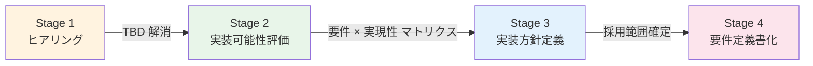

# 要件定義の進め方（Process Plan）

> 最終更新: 2026-05-08
> 目的: 「**各要件について、有無確認 → 実装可能性 → 実装方針** までを要件定義フェーズで確定させる」プロセスの定義

---

## 1. 終了基準（Definition of Done）

要件定義フェーズを完了する条件 = 以下が全て埋まっていること:

| 完了条件 | 達成判定 |
|---------|---------|
| 全機能要件（FR）の **採用 / 不採用** が確定 | `functional-requirements.md` の TBD 列がゼロ |
| 全非機能要件（NFR）の **目標値** が確定 | `non-functional-requirements.md` の TBD 列がゼロ |
| 各採用要件の **実装可能性** が判定済 | ✅ / 🟡 / 🟠 / ❌ のいずれかにマーク |
| 🟡 / 🟠 要件の **実装方針** がドラフト確定 | 設計フェーズで詳細化可能なレベル |
| ❌ 要件は **代替案合意 or 削除** | 顧客と再協議結果が文書化 |
| プラットフォーム選定（Cognito / Keycloak、OSS / RHBK）が確定 | ADR-016, 017 が Accepted |
| 要件定義書（`requirements-spec.md`）が承認済 | 顧客・社内ステークホルダーから承認 |

---

## 2. 全体フロー（4 段階）



| Stage | 期間目安 | 主成果物 |
|-------|:------:|---------|
| 1. ヒアリング | 2〜3 週 | TBD 項目への回答取得（[hearing-checklist.md](hearing-checklist.md)） |
| 2. 実装可能性評価 | 1 週 | 各要件への実現性マーク（✅ / 🟡 / 🟠 / ❌） |
| 3. 実装方針定義 | 1〜2 週 | ADR 起票、PoC 追加検証要否、設計ドラフト |
| 4. 要件定義書化 | 1 週 | requirements-spec.md 承認 |

---

## 3. Stage 1: ヒアリング

### 3.1 目的
全 TBD 項目について顧客の回答を取得し、**Must / Should / Could / Won't** を確定させる。

### 3.2 進め方
- [hearing-checklist.md](hearing-checklist.md) を**唯一の単一ソース**として使用
- Phase A → B → C → D の順に実施（[requirements-hearing-strategy.md](requirements-hearing-strategy.md)）
- 各セッション後、回答を **functional-requirements.md / non-functional-requirements.md の該当行に反映**
- 議事録テンプレ: ヒアリング戦略 §5 参照

### 3.3 早期確定すべき項目（プラットフォーム選定に直結）

ヒアリング初期で先に確定させたい項目（[ADR-014](../adr/014-auth-patterns-scope.md) / [ADR-015](../adr/015-rhbk-validation-deferred.md) の入力）:

| 項目 | 影響 |
|------|------|
| FR-AUTH-005 Token Exchange の要否 | Keycloak 必須要因 |
| FR-AUTH-006 Device Code の要否 | Keycloak 必須要因 |
| FR-AUTH-007 mTLS の要否 | Keycloak 必須要因 |
| FR-FED-006 SAML IdP 発行の要否 | Keycloak 必須要因 |
| FR-FED-007 LDAP 直接連携の要否 | Keycloak 必須要因 |
| NFR-COMP-006 FIPS 認定の要否 | RHBK 必須要因 |
| NFR-SCL-001 想定 MAU | コスト損益分岐 |
| NFR-AVL-001 SLA 目標 | HA 設計 |
| NFR-DR-001/002 RTO/RPO | DR 設計 |

→ **これらが 1 つでも「Yes」になればプラットフォーム選定が事実上絞られる**ため、Phase A/B 前半で早期確認する。

---

## 4. Stage 2: 実装可能性評価

### 4.1 評価分類

各要件に以下のマークを付ける:

| マーク | 意味 | 対応 |
|:----:|------|------|
| ✅ | **PoC 検証済 / 即実装可能** | そのまま採用、設計フェーズで詳細化 |
| 🟡 | **未検証だが実装可能（既知の方法あり）** | PoC 追加検証 or 設計時に深掘り |
| 🟠 | **制約あり / 設計工夫が必要** | ADR 起票、設計フェーズで方針確定 |
| ❌ | **そのプラットフォームでは実現不可** | 代替プラットフォーム or 顧客と再協議 |

### 4.2 評価フレーム

各要件に対して以下を評価:

```
Q1: PoC で動作確認できているか?
  → Yes: ✅
  → No → Q2 へ

Q2: ドキュメント / 公式機能で実現方法が確立しているか?
  → Yes: 🟡（PoC 追加検証が必要なら計画化）
  → No → Q3 へ

Q3: 設計工夫 / 代替実装で対応可能か?
  → Yes: 🟠（設計負荷を見積もり、ADR 起票）
  → No → Q4 へ

Q4: プラットフォーム制約として実現不可か?
  → Yes: ❌（顧客と再協議、代替プラットフォーム検討）
```

### 4.3 評価マトリクスの例（FR-AUTH 抜粋）

| 要件 | Cognito 評価 | Keycloak 評価 | 備考 |
|------|:--------:|:--------:|------|
| FR-AUTH-002 PKCE | ✅ | ✅ | Phase 1 で検証済 |
| FR-AUTH-003 Confidential Client | 🟡 | 🟡 | 公式機能、PoC 未検証 → Phase 9 で検証推奨 |
| FR-AUTH-004 M2M | 🟠 (Cognito) / 🟡 (Keycloak) | 🟡 | Cognito は Resource Server + scope 設計が必要 |
| FR-AUTH-005 Token Exchange | ❌ | 🟡 | Cognito 非対応 → Keycloak 必須化 |

### 4.4 PoC 追加検証の判断基準

🟡 マーク要件のうち、**本番リスクが大きいもの**は Phase 9 として PoC で追加検証する:

| 検証推奨度 | 条件 |
|---------|------|
| 必須 | 顧客が要件として Must を要求し、かつ実装方法に複数の選択肢がある |
| 強推奨 | 性能 / 可用性に直接影響する要件（NFR-PERF / NFR-AVL） |
| 推奨 | クレーム変換・認可ロジック（FR-AUTHZ） |
| 任意 | 単純な公式機能の確認（パスワードポリシー設定等） |

---

## 5. Stage 3: 実装方針定義

### 5.1 設計詳細化の粒度

要件定義段階での **「実装方針が見えている」** 状態の定義:

| 観点 | 要件定義時の到達点 | 設計フェーズで詳細化 |
|------|-----------------|------------------|
| 採用機能 | 機能 ID と Cognito/Keycloak 実現方法を記載 | 設定値・コード詳細 |
| ネットワーク | アーキテクチャ図レベル（既存 [keycloak-network-architecture.md](../common/keycloak-network-architecture.md)） | VPC CIDR、SG 詳細、ACL |
| 認可 | パターン（[authz-architecture-design.md](../common/authz-architecture-design.md)）採用 | クレーム名、ロール定義詳細 |
| 監視 | 監視ツール選定（CloudWatch / Datadog 等） | 個別メトリクス、アラート閾値 |
| 運用 | 運用体制（24/7 / 営業時間 / 委託） | ランブック、エスカレーション |

→ **要件定義時は「方針」、設計時に「具体値」**

### 5.2 ADR 起票の判断

実装方針確定時に、以下に該当する判断は ADR 化:

| ADR 化すべき判断 | 例 |
|---------------|-----|
| トレードオフがある選択 | Pattern B vs C（[ADR-011](../adr/011-auth-frontend-network-design.md)）|
| 後戻りコストが大きい選択 | Cognito vs Keycloak、本番マルチアカウント戦略 |
| 標準パターンから外れる選択 | 特殊な認可モデル採用時 |
| 顧客ステークホルダーへの説明が必要な選択 | RHBK 採用、データ所在地 |

### 5.3 残課題の文書化

❌ / 🟠 マーク要件は以下のいずれかで対応:
- **代替実装で対応**: 設計フェーズへ持ち越し（ADR 起票 + 実装計画）
- **顧客と再協議**: 要件削除 / 優先度変更
- **段階的対応**: フェーズ分けで先送り（リリース 2 以降）

---

## 6. Stage 4: 要件定義書化

### 6.1 確定状態の定義

要件定義書（`requirements-spec.md`）に記載する内容:

| 章 | 内容 | 確定根拠 |
|---|------|---------|
| 機能要件 | 採用要件 ID 一覧 + Cognito/Keycloak 実現方法 | functional-requirements.md（TBD ゼロ） |
| 非機能要件 | 数値目標 + 達成方法 | non-functional-requirements.md（TBD ゼロ） |
| プラットフォーム選定 | Cognito or Keycloak（OSS or RHBK） | ADR-016, 017 |
| 実装可能性 | 各要件への ✅ / 🟡 / 🟠 マーク | Stage 2 評価結果 |
| 実装方針 | 設計フェーズへの引継ぎ事項 | Stage 3 ADR 群 |
| リスク | 残課題・先送り項目 | Stage 3 議事録 |
| ロードマップ | 設計 → 実装 → 移行 | スケジュール |

### 6.2 承認プロセス

```mermaid
flowchart LR
    A[ドラフト作成]
    B[社内レビュー<br/>(技術 + セキュリティ)]
    C[顧客レビュー]
    D[修正反映]
    E[最終承認]

    A --> B --> C --> D --> E
```

---

## 7. 進捗管理

### 7.1 進捗ダッシュボード（推奨フォーマット）

各週の状況を以下で管理:

| Stage | 項目 | 進捗 |
|-------|------|------|
| Stage 1 | ヒアリング Phase A 完了 | ✅ / ⏳ / ❌ |
| Stage 1 | TBD 件数残 | N 件 |
| Stage 2 | 評価完了要件数 / 全要件数 | N / 150 |
| Stage 2 | ❌ 要件への対応決定数 | N 件 |
| Stage 3 | 起票 ADR 数 | N 件 |
| Stage 3 | PoC 追加検証完了数 | N 件 |
| Stage 4 | requirements-spec.md ドラフト % | N % |

### 7.2 アラート条件

| 条件 | アラート | 対応 |
|------|--------|------|
| Stage 1 完了予定週で TBD 残 > 5 件 | 🚨 | スケジュール再調整 |
| ❌ 要件 > 10 件 | 🚨 | プラットフォーム選定見直し |
| Stage 3 で PoC 追加検証要 > 3 件 | ⚠ | Phase 9 計画策定 |

---

## 8. 関連ドキュメント

- [requirements-hearing-strategy.md](requirements-hearing-strategy.md): ヒアリング戦略（Phase A〜D）
- [hearing-checklist.md](hearing-checklist.md): ヒアリング項目チェックリスト（単一一覧）
- [requirements-document-structure.md](requirements-document-structure.md): 要件定義資料の構成案
- [functional-requirements.md](functional-requirements.md): 機能要件
- [non-functional-requirements.md](non-functional-requirements.md): 非機能要件
- [platform-selection-decision.md](platform-selection-decision.md): プラットフォーム選定判断書
- [poc-summary-evaluation.md](poc-summary-evaluation.md): PoC 評価
