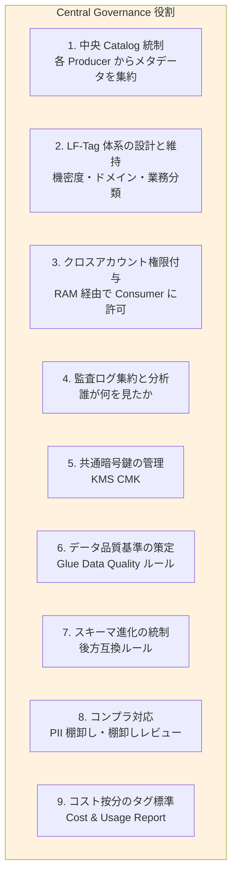

```mermaid

flowchart TD
    subgraph Gov["Central Governance 役割"]
        direction LR

        Catalog["1. 中央 Catalog 統制<br/>各 Producer からメタデータを集約"]
        TagSys["2. LF-Tag 体系の設計と維持<br/>機密度・ドメイン・業務分類"]
        Permission["3. クロスアカウント権限付与<br/>RAM 経由で Consumer に許可"]
        Audit["4. 監査ログ集約と分析<br/>誰が何を見たか"]
        KeyMgmt["5. 共通暗号鍵の管理<br/>KMS CMK"]
        Quality["6. データ品質基準の策定<br/>Glue Data Quality ルール"]
        SchemaGov["7. スキーマ進化の統制<br/>後方互換ルール"]
        Compliance["8. コンプラ対応<br/>PII 棚卸し・棚卸しレビュー"]
        CostAttribution["9. コスト按分のタグ標準<br/>Cost & Usage Report"]
    end

    style Gov fill:#fff3e0


```