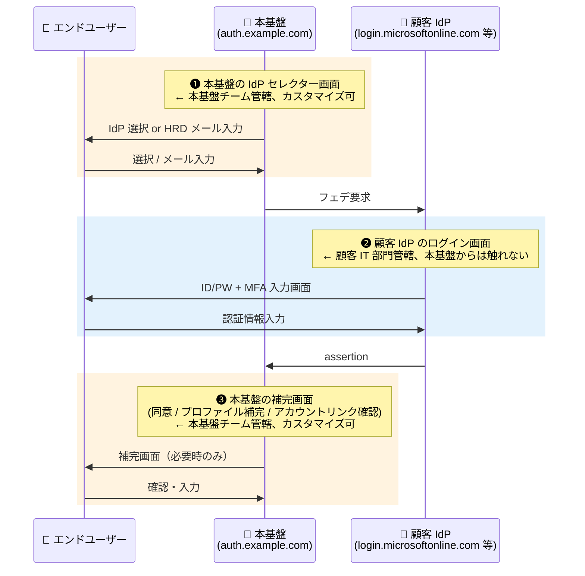
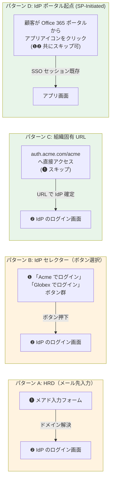
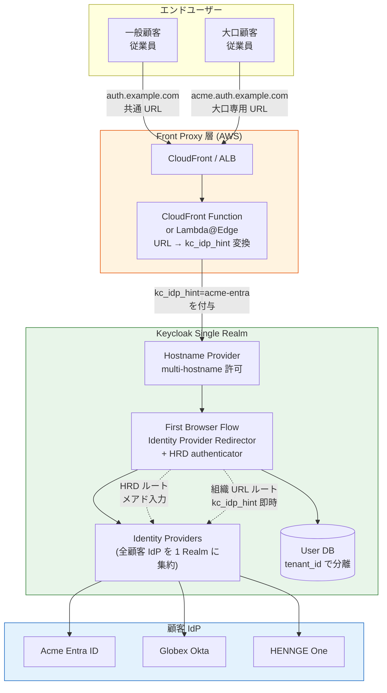

```mermaid
sequenceDiagram
    participant User as 👤 エンドユーザー
    participant Hub as 🏢 本基盤<br/>(auth.example.com)
    participant IdP as 🏢 顧客 IdP<br/>(login.microsoftonline.com 等)

    rect rgb(255, 243, 224)
    Note over Hub: ❶ 本基盤の IdP セレクター画面<br/>← 本基盤チーム管轄、カスタマイズ可
    Hub->>User: IdP 選択 or HRD メール入力
    User->>Hub: 選択 / メール入力
    end

    Hub->>IdP: フェデ要求

    rect rgb(227, 242, 253)
    Note over IdP: ❷ 顧客 IdP のログイン画面<br/>← 顧客 IT 部門管轄、本基盤からは触れない
    IdP->>User: ID/PW + MFA 入力画面
    User->>IdP: 認証情報入力
    end

    IdP->>Hub: assertion

    rect rgb(255, 243, 224)
    Note over Hub: ❸ 本基盤の補完画面<br/>(同意 / プロファイル補完 / アカウントリンク確認)<br/>← 本基盤チーム管轄、カスタマイズ可
    Hub->>User: 補完画面（必要時のみ）
    User->>Hub: 確認・入力
    end
```

```mermaid
flowchart LR
    subgraph A["パターン A: HRD（メール先入力）"]
        A1["❶ メアド入力フォーム"] -->|ドメイン解決| A2["❷ IdP のログイン画面"]
    end

    subgraph B["パターン B: IdP セレクター（ボタン選択）"]
        B1["❶ 「Acme でログイン」<br/>「Globex でログイン」<br/>ボタン群"] -->|ボタン押下| B2["❷ IdP のログイン画面"]
    end

    subgraph C["パターン C: 組織固有 URL"]
        C1["auth.acme.com/acme<br/>へ直接アクセス<br/>(❶ スキップ)"] -->|URL で IdP 確定| C2["❷ IdP のログイン画面"]
    end

    subgraph D["パターン D: IdP ポータル起点 (SP-Initiated)"]
        D1["顧客が Office 365 ポータルから<br/>アプリアイコンをクリック<br/>(❶❷ 共にスキップ可)"] -->|SSO セッション既存| D3["アプリ画面"]
    end

    style A fill:#fff3e0
    style B fill:#fff3e0
    style C fill:#e8f5e9
    style D fill:#e8f5e9

```

```mermaid
flowchart TB
    subgraph Users["エンドユーザー"]
        UA[一般顧客<br/>従業員]
        UB[大口顧客<br/>従業員]
    end

    subgraph FrontProxy["Front Proxy 層 (AWS)"]
        CF[CloudFront / ALB]
        EF["CloudFront Function<br/>or Lambda@Edge<br/>URL → kc_idp_hint 変換"]
    end

    subgraph KC["Keycloak Single Realm"]
        Auth[Hostname Provider<br/>multi-hostname 許可]
        Flow["First Browser Flow<br/>Identity Provider Redirector<br/>+ HRD authenticator"]
        IdPList["Identity Providers<br/>(全顧客 IdP を 1 Realm に集約)"]
        DB[(User DB<br/>tenant_id で分離)]
    end

    subgraph Customers["顧客 IdP"]
        I1[Acme Entra ID]
        I2[Globex Okta]
        I3[HENNGE One]
    end

    UA -->|auth.example.com<br/>共通 URL| CF
    UB -->|acme.auth.example.com<br/>大口専用 URL| CF

    CF --> EF
    EF -->|kc_idp_hint=acme-entra<br/>を付与| Auth
    Auth --> Flow
    Flow --> IdPList
    Flow -.HRD ルート<br/>メアド入力.-> IdPList
    Flow -.組織 URL ルート<br/>kc_idp_hint 即時.-> IdPList
    IdPList --> I1
    IdPList --> I2
    IdPList --> I3
    Flow --> DB

    style FrontProxy fill:#fff3e0,stroke:#e65100
    style KC fill:#e8f5e9,stroke:#2e7d32
    style Customers fill:#e3f2fd,stroke:#1565c0

```