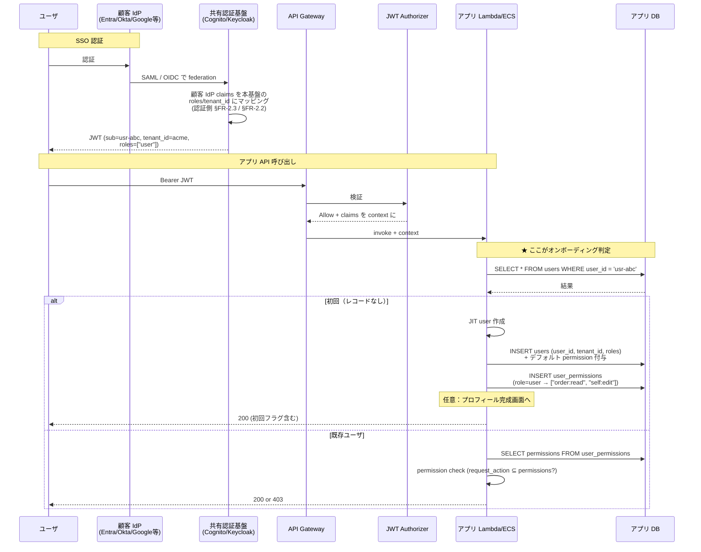
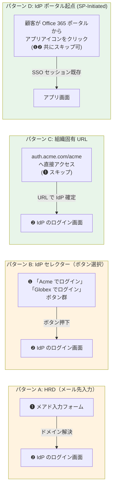
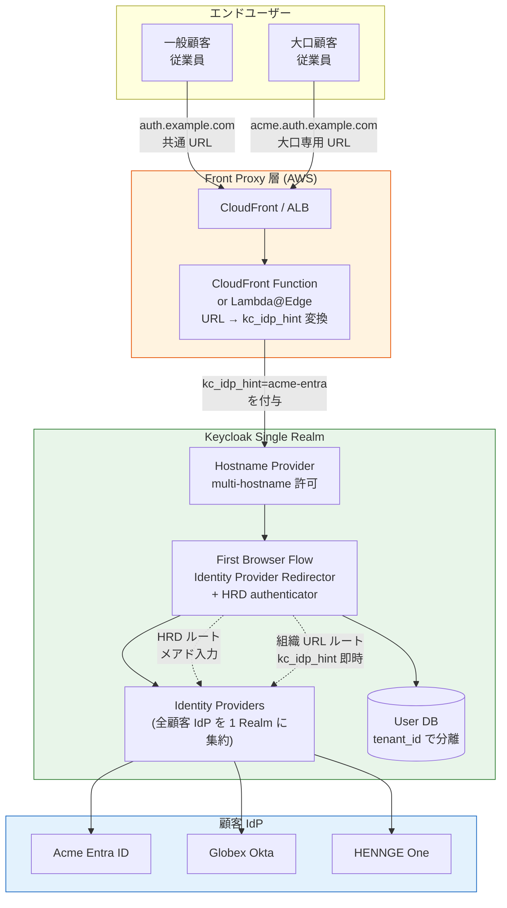

```mermaid
sequenceDiagram
    participant U as ユーザ
    participant IdP as 顧客 IdP<br/>(Entra/Okta/Google等)
    participant Auth as 共有認証基盤<br/>(Cognito/Keycloak)
    participant APIGW as API Gateway
    participant Authz as JWT Authorizer
    participant App as アプリ Lambda/ECS
    participant DB as アプリ DB

    Note over U,IdP: SSO 認証
    U->>IdP: 認証
    IdP->>Auth: SAML / OIDC で federation
    Auth->>Auth: 顧客 IdP claims を本基盤の<br/>roles/tenant_id にマッピング<br/>(認証側 §FR-2.3 / §FR-2.2)
    Auth-->>U: JWT (sub=usr-abc, tenant_id=acme,<br/>roles=["user"])

    Note over U,App: アプリ API 呼び出し
    U->>APIGW: Bearer JWT
    APIGW->>Authz: 検証
    Authz-->>APIGW: Allow + claims を context に
    APIGW->>App: invoke + context

    Note over App,DB: ★ ここがオンボーディング判定
    App->>DB: SELECT * FROM users WHERE user_id = 'usr-abc'
    DB-->>App: 結果

    alt 初回（レコードなし）
        App->>App: JIT user 作成
        App->>DB: INSERT users (user_id, tenant_id, roles)<br/>+ デフォルト permission 付与
        App->>DB: INSERT user_permissions<br/>(role=user → ["order:read", "self:edit"])
        Note over App: 任意：プロフィール完成画面へ
        App-->>U: 200 (初回フラグ含む)
    else 既存ユーザ
        App->>DB: SELECT permissions FROM user_permissions
        App->>App: permission check (request_action ⊆ permissions?)
        App-->>U: 200 or 403
    end

```

```mermaid
flowchart LR
    subgraph A["パターン A: HRD（メール先入力）"]
        A1["❶ メアド入力フォーム"] -->|ドメイン解決| A2["❷ IdP のログイン画面"]
    end

    subgraph B["パターン B: IdP セレクター（ボタン選択）"]
        B1["❶ 「Acme でログイン」<br/>「Globex でログイン」<br/>ボタン群"] -->|ボタン押下| B2["❷ IdP のログイン画面"]
    end

    subgraph C["パターン C: 組織固有 URL"]
        C1["auth.acme.com/acme<br/>へ直接アクセス<br/>(❶ スキップ)"] -->|URL で IdP 確定| C2["❷ IdP のログイン画面"]
    end

    subgraph D["パターン D: IdP ポータル起点 (SP-Initiated)"]
        D1["顧客が Office 365 ポータルから<br/>アプリアイコンをクリック<br/>(❶❷ 共にスキップ可)"] -->|SSO セッション既存| D3["アプリ画面"]
    end

    style A fill:#fff3e0
    style B fill:#fff3e0
    style C fill:#e8f5e9
    style D fill:#e8f5e9

```

```mermaid
flowchart TB
    subgraph Users["エンドユーザー"]
        UA[一般顧客<br/>従業員]
        UB[大口顧客<br/>従業員]
    end

    subgraph FrontProxy["Front Proxy 層 (AWS)"]
        CF[CloudFront / ALB]
        EF["CloudFront Function<br/>or Lambda@Edge<br/>URL → kc_idp_hint 変換"]
    end

    subgraph KC["Keycloak Single Realm"]
        Auth[Hostname Provider<br/>multi-hostname 許可]
        Flow["First Browser Flow<br/>Identity Provider Redirector<br/>+ HRD authenticator"]
        IdPList["Identity Providers<br/>(全顧客 IdP を 1 Realm に集約)"]
        DB[(User DB<br/>tenant_id で分離)]
    end

    subgraph Customers["顧客 IdP"]
        I1[Acme Entra ID]
        I2[Globex Okta]
        I3[HENNGE One]
    end

    UA -->|auth.example.com<br/>共通 URL| CF
    UB -->|acme.auth.example.com<br/>大口専用 URL| CF

    CF --> EF
    EF -->|kc_idp_hint=acme-entra<br/>を付与| Auth
    Auth --> Flow
    Flow --> IdPList
    Flow -.HRD ルート<br/>メアド入力.-> IdPList
    Flow -.組織 URL ルート<br/>kc_idp_hint 即時.-> IdPList
    IdPList --> I1
    IdPList --> I2
    IdPList --> I3
    Flow --> DB

    style FrontProxy fill:#fff3e0,stroke:#e65100
    style KC fill:#e8f5e9,stroke:#2e7d32
    style Customers fill:#e3f2fd,stroke:#1565c0

```