# Google Cloud 共通基盤 GitOps / ChatOps 構成設計書 (v2.0 統合確定版)

本書は v0.1〜v0.8 の検討で確定した内容を1本に統合した確定版です。撤回・修正済みの記述は除去し、図には drawio 化を見据えた図番号（図1〜図23）を付与しています。
v1.5での改訂: 受付方式を「ポータル完結型チケット」へ転換（案件別リポジトリの乱立回避）。
v1.6での追加: 限定メンバー案の再掲（Q16）、チャットのフィジビリティ（図22）、RAG運用設計（図23）。
v1.7での確定: 受付方式を「Issue Form＋限定メンバー」に確定（Q16）。
v1.8での改訂: ①**利用者IFをGitHubに一本化**: 自由質問=Discussions Q&A（AIボットが出典つき一次回答）、申請=Issue Form。ポータルは**担当者コパイロット専用**に縮小（Q17: 1000人規模の席数確認が前提） ②図2の脱落修正（コパイロット・ポータルを追記） ③ジャーニーJ1〜J5を全てシーケンス図に統一。
v1.9での改訂: ①**命名規則の統一**: 「プラットフォーム名＋役割」で表記（例: GitHub Discussions（Q&A受付）） ②付録CにGitHub Discussionsの解説を追加。
v2.0での追加: **参考画面イメージ（SVG）を4点同梱**（images/配下）: GitHub Issue Form申請・GitHub Discussions Q&A・FAQ検索チャット・担当者コパイロット。※いずれも検討用モックであり実画面ではない。
v1.1での追加: ①Firewallの本番/開発2環境を反映（図15） ②案件構成の読み取り専用観測「テーマA-2」新設（§9.5、図16） ③Issue Form解説を付録に追加。
v1.2での追加: 横断機能「自動対応パイプライン」を新設（§11.5、図17・図18）。
v1.3での改訂: テーマCを二面構成に再設計（§11、図19・図20）: 利用者=出典必須のFAQ検索・チャットIF、担当者=回答支援コパイロット。
v1.4での追加: 閲覧権限設計（GitHubはIssue単位の閲覧制御不可という制約の整理）。

---

## 1. 目的と実現テーマ

共通基盤チーム（Project払い出し、共有VPC/Subnet、Firewall、VPC-SC、基盤運用リソースの管理と他案件対応を担当）の運用を、GitOps / ChatOps により高度化する。

| テーマ | 内容 | 到達点 |
|---|---|---|
| **A: 構成管理の自動化** | 構成情報の自動取得 → 差分の分析 → タスク化 | ドリフト・手動変更が24h以内に分類済みタスクになる。棚卸しの自動化 |
| **B: エラーの分析・ハンドリング** | エラーログの分析 → 差分との突合 → 対応案の調査・提案 | エラー通知に「直近の変更との関連」と「対応案」が付いてくる |
| **C: 問い合わせチャット** | 基盤内の相談基盤 + 他案件からの質問受付・解釈・想定回答の提示 | 問い合わせに数分で一次ドラフトが付き、解決がFAQとして自動蓄積される |

**共通原則**: LLM（Gemini）は「分析と提案・起案まで」。実環境への反映は必ず人間の承認を挟む。

---

## 2. 確定した前提条件

| 分類 | 項目 | 確定内容 |
|---|---|---|
| 現状 | FW / VPC-SC | 未IaC化（手動運用）。**FWは現状構造のままIaC化**（階層型ポリシー整理は後日） |
| 現状 | FWの配置 | 共有VPC構成のため、**全案件のFWルールが基盤VPC（ホストProject）に集中**。Subnetは案件ごと。**FWも本番/開発の2環境**がある |
| 現状 | VPC-SC | 共用。**本番/検証等で少数のPerimeterに分かれる**。現状はルール名でしか案件を区別できない |
| 現状 | ルール↔案件の対応 | **台帳（Excel等）が存在** |
| 現状 | 過去の問い合わせ履歴 | **Excel/スプレッドシートに蓄積** |
| 現状 | 基盤運用リソース | プロキシ/踏み台/基盤DBは**専用の基盤Projectに集約** |
| 現状 | 既存IaC | Project払い出し（Project作成〜共有VPC Subnet割当）はTerraform化済み |
| 規模 | Project数 | 払い出し先は50〜200。ただし**管理対象は器（シェル）のみ**。案件内部リソースはスコープ外 |
| ツール | VCS / CI / タスク | **GitHub + GitHub Actions（Workload Identity連携）+ Issues/Projects** |
| ツール | チャット | **Microsoft Teams = 通知専用**（Workflows Webhook受信フロー。旧Incoming Webhookは2026/5廃止済み） |
| ツール | 対話ボット | **持たない**（Azure Bot・Power Automate Premiumとも利用不可のため、対話はGitHubに集約） |
| ツール | LLM | **Vertex AI (Gemini)**。Model Garden経由で他モデル併用の余地。GCP境界内で完結 |
| 統制 | apply | **全経路で人の承認ゲート必須**（PRレビュー + Environments承認の二段） |
| スコープ | OSレイヤ/DBメンテ | 将来対象（Phase 5）。記録・手順のGit寄せのみ先行 |
| 受付 | 問い合わせ | **Issue Form＋限定メンバーで受付**（v1.7確定・Q16）。相互閲覧は許容と判断 |
| 利用者IF | 質問・相談 | **GitHubに一本化**（v1.8）: 自由質問=Discussions Q&A（AIボット一次回答）、申請=Issue Form。ポータルは担当者コパイロット専用に縮小。**前提=代表者1000人規模の席数確保（→Q17）** |

---

## 3. 管理スコープ

### 図1: スコープ境界

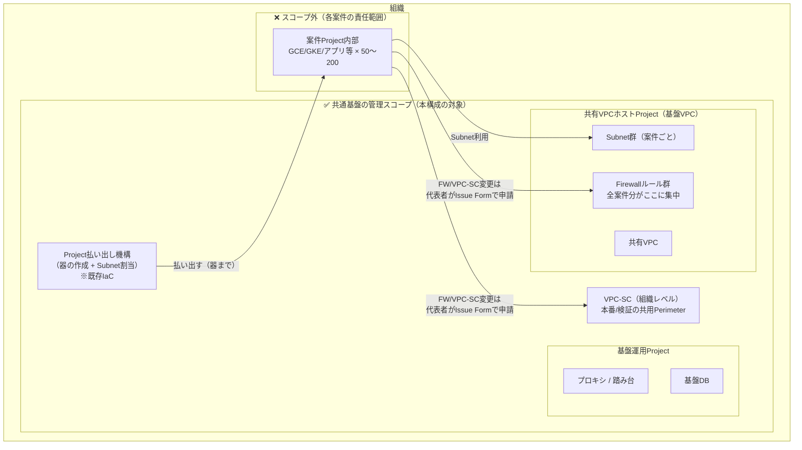

### スコープ定義

| 対象 | In/Out | 扱い |
|---|---|---|
| Project払い出し（器） | In | 既存IaC。ドリフト検知対象（器に関わる設定のみ） |
| 共有VPC・Subnet・Firewall | In | ホストProject側で管理。FWは案件軸テナント構造（§6） |
| VPC-SC（stg/prod Perimeter） | In | 環境別state + 案件YAML台帳（§6, §7） |
| 基盤運用Project | In | IaC対象（可能な範囲）。テーマBの主戦場 |
| 案件Project内部 | Out | 検知・監視とも対象外。問い合わせ経由で基盤側ログを調査する導線のみ |

**共有リソースの含意**: FWとVPC-SCは1つの共有リソースに全案件が同居するため、**あらゆる変更の爆発半径が全案件**。承認ゲート二段とVPC-SCの段階適用（§8）はこの実態への必須の備えである。

---

## 用語・命名規則（v1.9）

本書の構成要素は「**プラットフォーム名 ＋ 役割**」で命名する。どのサービスの機能かを名前だけで判別できるようにするため。

| 表記 | 実体 |
|---|---|
| GitHub Issue Form（申請受付） | GitHub標準のIssueテンプレート機能（付録A） |
| GitHub Discussions（Q&A受付） | GitHub標準の掲示板機能（付録C）。supportリポジトリで質問受付、iacリポジトリで内部相談に使用 |
| GitHub Issues（タスク管理） / GitHub PR / GitHub Actions（CI/CD） / GitHub Environments（apply承認） | GitHub標準機能 |
| Teams（通知） | Microsoft Teams。Workflows Webhook経由の通知専用 |
| Cloud Run: 基盤ポータル（コパイロット） | 自前開発のWebアプリ（担当者専用） |
| Vertex AI Gemini / Vertex AI Search | Google CloudのマネージドAIサービス |

## 4. 全体アーキテクチャ

### 図2: 全体構成

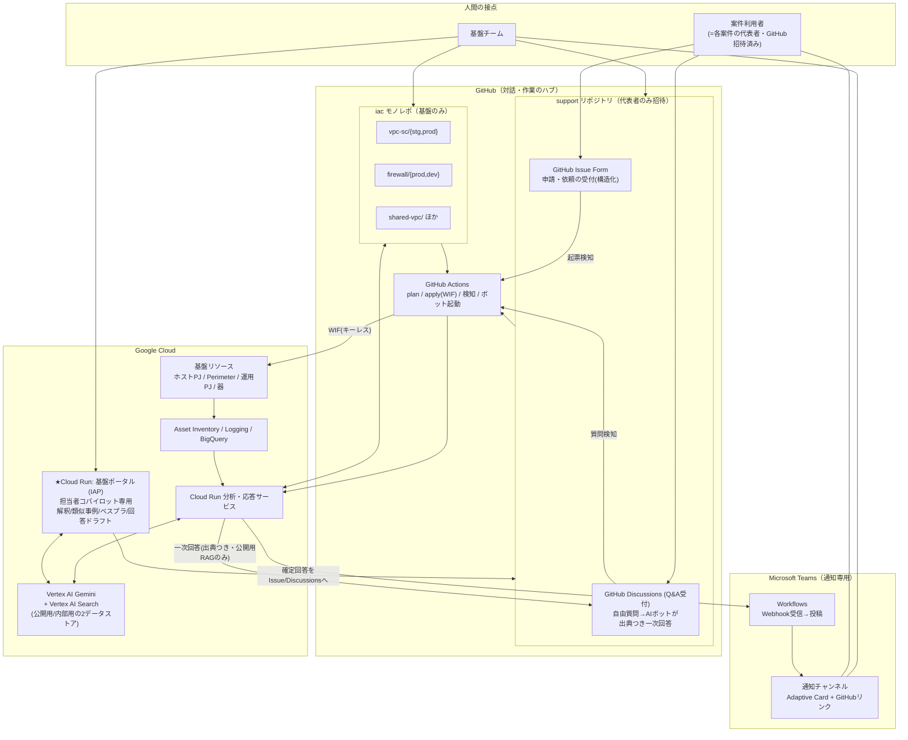

### 設計思想（3つの柱）

1. **Gitが単一の真実**: IaC（＋台帳を兼ねるYAML）とナレッジをGitに置き、「宣言された状態」と「実際の状態（Asset Inventory）」の差分を検知の基準にする。
2. **気づくのはTeams、作業するのはGitHub、コンソールは原則読み取り**: 対話ボットは持たず、UIをGitHubに集約。全対話が検索可能な形で残り、RAGが自動的に育つ。Teams通知には対応先へのディープリンクを必ず添付。
3. **LLMは提案まで、反映は承認済みパイプラインのみ**: 実環境への書き込み権限は人間から剥がし、WIF経由の専用SAだけが承認後にapplyする。

---

## 5. ユーザー接点と操作フロー

### 5.1 アクター定義

| アクター | 誰か | 主な関心事 |
|---|---|---|
| A1: 基盤エンジニア | 共通基盤チーム担当者 | 変更作業、エラー対応、問い合わせ回答 |
| A2: 基盤リーダー/承認者 | チーム内承認権限者 | 変更妥当性の確認、apply承認 |
| A3: 他案件の利用者 | 各案件のインフラ担当 | 申請・困りごと解決・仕様確認 |
| A4: 自動システム | Actions / Cloud Run / Gemini | 検知・分類・起票・ドラフト・通知 |

### 図3: 接点マップ

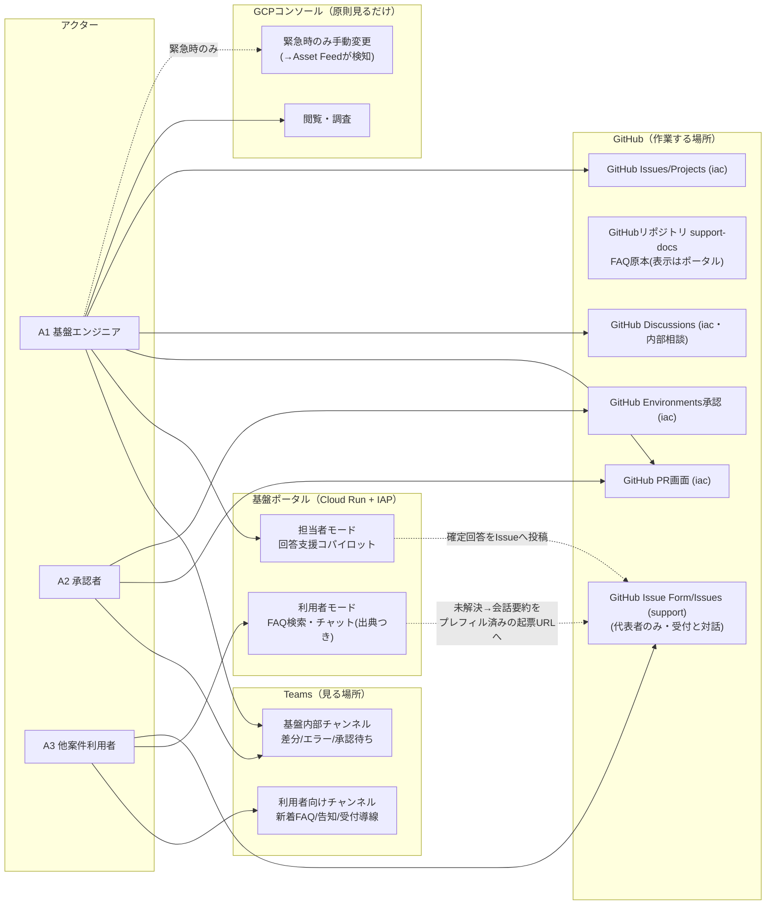

### 5.2 シナリオ別ジャーニー

#### 図4: J1 利用者の問い合わせ〜解決（テーマC・v1.3更新）

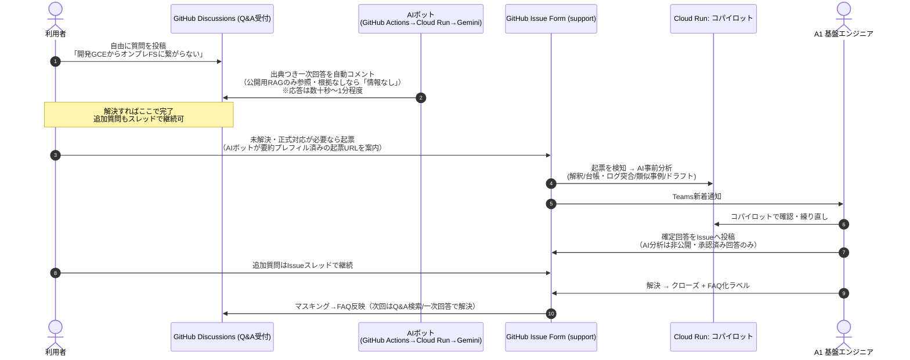

#### 図5: J2 案件からのFW/VPC-SC申請（テーマC→A連携）

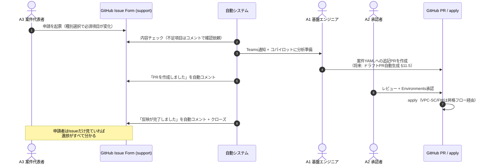

#### 図6: J3 基盤エンジニアの通知起点運用（テーマA/B）

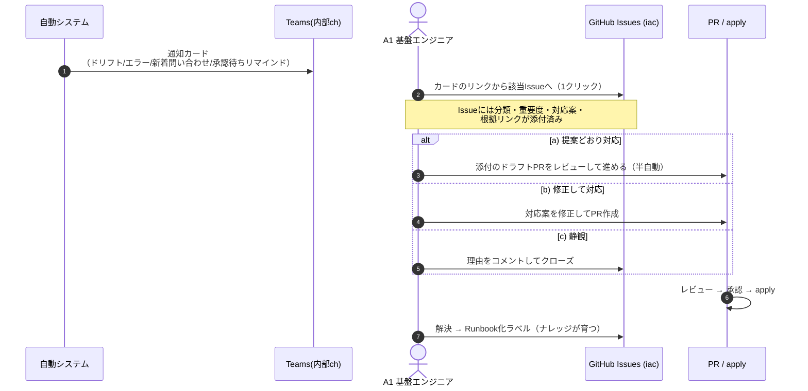

#### 図7: J4 承認者のapply承認

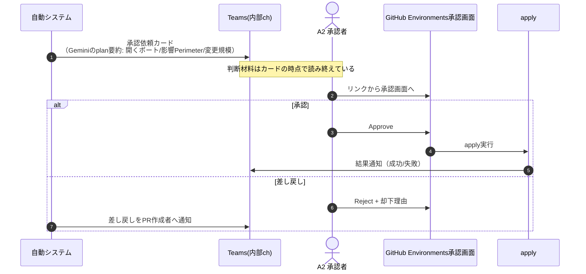

#### 図8: J5 基盤内の相談（Discussions）

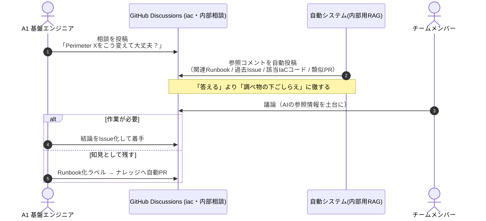

### 5.3 アクセス権限マップ

| 場所 | A1 | A2 | A3 | A4 自動 |
|---|---|---|---|---|
| GitHub Issues/Issue Form (support) | Write(回答はコパイロット経由) | Read | **代表者のみ起票・閲覧・返信**(招待制・相互閲覧許容) | 事前分析・通知(回答は担当者承認後のみ) |
| GitHubリポジトリ support-docs (FAQ原本・表示はポータル) | Write(PR) | Write | **閲覧のみ（ポータル経由・マスキング済）** | Write(FAQ化PR) |
| GitHub Discussions Q&A (support) | Write | Read | **代表者のみ投稿・閲覧** | 一次回答コメント（公開用RAGのみ・出典必須） |
| Cloud Run: 基盤ポータル（コパイロット専用） | **利用可（内部用RAG=全ナレッジ）** | 利用可 | ―（IAP+IAMで遮断） | 分析・ドラフト生成 |
| GitHub PR (iacコード) | Write(PR経由のみ) | Write+必須レビュー | なし | ドラフトPRのみ(自己approve不可) |
| GitHub Environments承認 (iac) | (相互承認Envのみ) | **Approve** | なし | なし |
| GitHub Discussions/Issues (iac) | Write | Write | なし | Write |
| Teams 内部/利用者ch | 参加/参加 | 参加/参加 | −/参加 | 投稿(Webhook) |
| GCPコンソール | Viewer中心+緊急昇格 | Viewer | 自案件のみ | − |
| apply実行権限 | なし | なし | なし | **専用SA(WIF)のみ・承認後** |

**含意**: 「実環境を変更できるのは承認済みパイプラインだけ」の状態を作る。人間は起票・レビュー・承認・緊急時昇格のみ。緊急のコンソール変更もAsset Feedが検知しIaC取込タスクが起票されるため統制が閉じる。

---

## 6. リポジトリ / tfstate 設計

### 図9: リポジトリ構造（案件軸テナント）

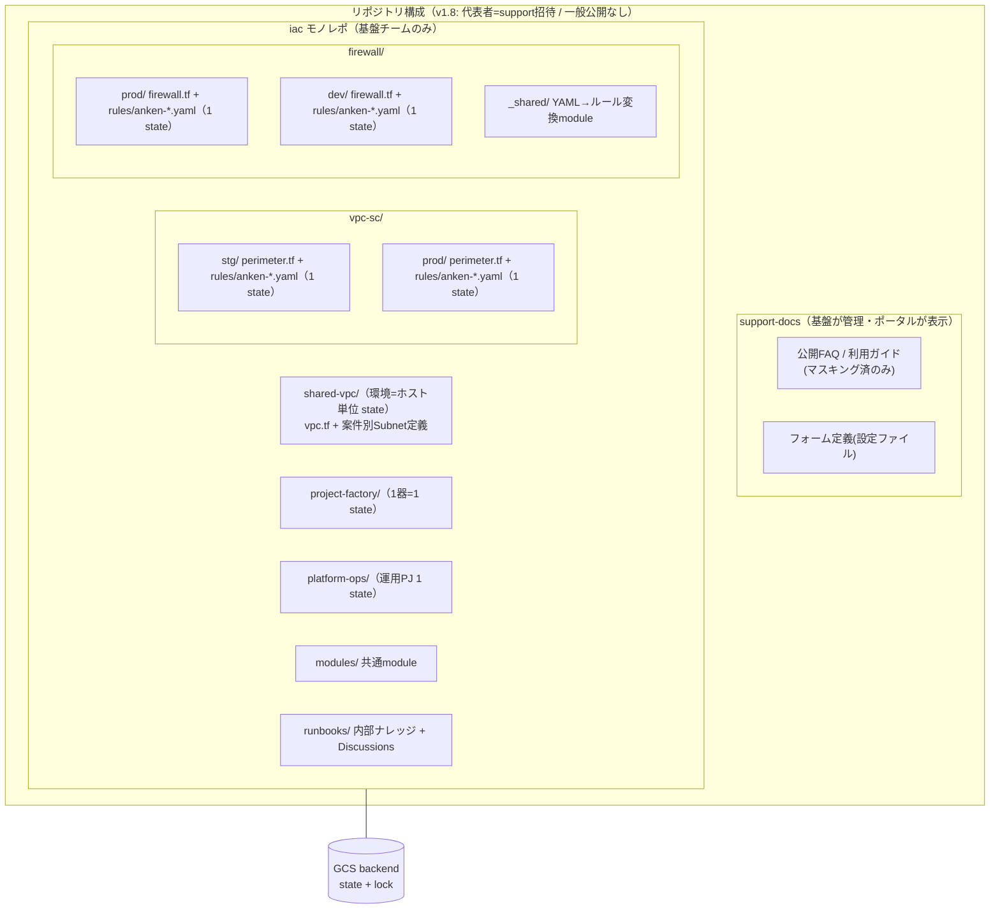

### 設計原則

| 原則 | 内容 |
|---|---|
| **「案件」がテナントの単位** | FW・VPC-SC・Subnetすべて案件IDでファイル分割し命名規則に案件IDを含める。申請(J2)・レビュー・棚卸し・案件終了時の撤去が案件単位で完結 |
| stateの分割 | 実リソースの単位に合わせる。**FW・VPC-SCとも環境（本番/開発・prod/stg）単位のstate**とし、環境内の統制は案件別ファイル分割+CODEOWNERSで行う |
| モノレポ | 基盤チーム一元管理の性質に合致。Actionsはpaths-filterで変更ディレクトリのみmatrix並列plan |
| リポジトリ構成 | iac（基盤のみ）+ support（代表者招待）+ support-docs（FAQ原本）。一般利用者はポータルのみでGitHub不要、**代表者のみGitHubアカウントが必要** |

---

## 7. VPC-SC / FW の「台帳化」

IaC移行と同時に、「ルール名でしか案件を区別できない」現状の痛点を解決する。**YAMLがルール定義と台帳を兼ねる。**

```yaml
# vpc-sc/prod/rules/anken-a.yaml（イメージ）
anken_id: anken-a
ingress_rules:
  - name: allow-anken-a-from-onprem-gcs
    purpose: "オンプレバッチからのGCS読み取り"   # 従来ルール名に押し込んでいた情報
    requested_by_issue: "support#123"           # 申請Issueへのトレース
    approved_date: "2026-08-01"
    review_by: "2027-08-01"                     # 棚卸し期限
    sources: [...]
    identities: [...]
    resources: [...]
```

| 効果 | 内容 |
|---|---|
| トレーサビリティ | ルール ↔ 案件 ↔ 申請Issue ↔ PR が接続される |
| 棚卸しの自動化 | `review_by` 接近をテーマAの定期ジョブが検知 → 該当案件へ継続要否Issueを自動起票。共用Perimeter/FWの肥大化を構造的に防ぐ |
| 案件終了時の撤去 | YAMLファイル1つの削除PRで完結 |
| 拒否ログの仕分け | テーマBが拒否ログを分析する際、台帳で「どの案件のどのルールに関係するか」を特定して通知 |

---

## 8. CI/CD・承認ゲート・VPC-SC段階適用

### 図10: PRフローと二段の人間ゲート

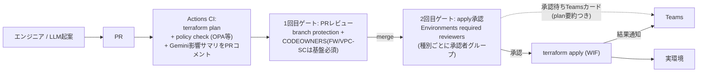

| 項目 | 設計 |
|---|---|
| GCP認証 | Workload Identity連携（SAキー不使用） |
| Environment分割 | `vpcsc-prod` / `vpcsc-stg` / `firewall-prod` / `firewall-dev` / `shared-network` / `projects` / `platform-ops` 等。承認者グループを種別ごとに設定（例: VPC-SC/FWの本番はリーダー、開発・払い出しは相互承認） |
| policy check | 「0.0.0.0/0 ingress禁止」等の組織ルールをOPA/Conftest/gcloud terraform vetでCIに組み込み。LLM起案の暴走に対するガードレールを兼ねる |
| plan可視化 | plan JSON + Geminiの自然言語サマリ（「このPRで新たに開くポートは…」）をPRコメント |
| 滞留対策 | 承認待ち24h超をテーマAがリマインド通知 |
| tfstate | GCS backend + lock |

### 図11: VPC-SC 環境昇格 × dry-run 四段階フロー

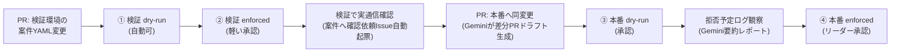

共用Perimeter＝爆発半径が全案件、への安全弁。定型的な実績あるパターンはpolicy checkの機械判定で短縮ルート（①→③→④）を許可する発展も可能。

### 図15: Firewall 環境昇格フロー（開発先行 → 本番）

FWにはVPC-SCのdry-runに相当する機能がないため、**開発環境への先行適用**と**Firewall Rules Loggingによる適用後観察**で安全弁を作る。

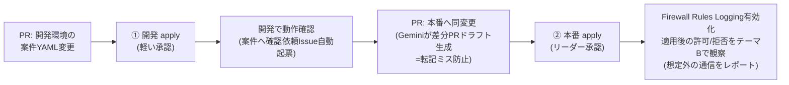

- 本番のFWルールはLoggingを有効化しておき、適用直後の一定期間はテーマBが「新ルールにヒットした通信の要約」をレポートする（意図した通信だけが通っているかの事後確認）。
- 開発→本番の転記はVPC-SC同様、Geminiが環境間差分PRをドラフト生成する。

---

## 9. テーマA: 構成管理の自動化

### 図12: 差分検知〜タスク化フロー

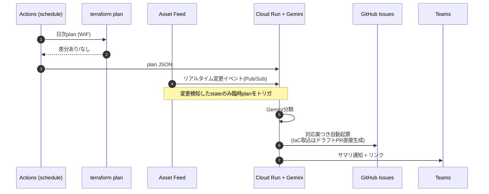

### 検知の3系統と対象・頻度

| 方式 | 対象 | 頻度 | 用途 |
|---|---|---|---|
| ① terraform plan | vpc-sc / firewall / shared-vpc / platform-ops | 日次 | IaC管理下のドリフト棚卸し |
| ① terraform plan | project-factory（器） | 週次 | 軽量な定期棚卸し |
| ② Asset Inventory Feed | 基盤リソースのアセットタイプのみ（Firewall/Subnetwork/ServicePerimeter/Project等） | リアルタイム | 手動変更の即時検知 → 該当stateの臨時planをトリガ |
| ③ Asset Export → BigQuery | 基盤リソースのスナップショット | 週次/月次 | 時点間比較・傾向分析・棚卸しレポート |

### Geminiによる差分の4分類と自動アクション

| 分類 | 例 | 自動アクション |
|---|---|---|
| IaC反映漏れ | 緊急対応で手動追加したFWルール | 「IaC取込PR案」をドラフトPRとして生成+起票 |
| 意図しないドリフト | コンソールでのSubnet変更 | 「revert推奨」起票 + Audit Logから変更者特定を添付 |
| 外部要因 | GCP側デフォルト値変更 | 情報共有Issue |
| 要調査 | 分類不能 | 人間レビュー依頼Issue |

その他: `review_by` 接近ルールの検知→継続要否Issue自動起票（§7）、承認待ち滞留のリマインド（§8）もテーマAの定期ジョブが担う。

### 9.5 テーマA-2: 案件構成の観測（読み取り専用・新設）

各案件Projectの内部リソースは**管理（書き込み・デプロイ）はしない**が、**構成情報の定期取得と変化のレポート**は行う。管理と観測を分けることで、責任分界（案件内部は各案件の責任）を崩さずに「各案件で何が動いているか」を基盤が把握し続けられる。

#### 図16: 案件構成の観測フロー

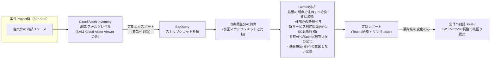

#### 設計上の位置づけ

| 項目 | 内容 |
|---|---|
| テーマAとの違い | テーマAは「IaC（あるべき姿）との差分検知」。A-2は案件内部にIaCが無いため「**前回時点との変化の観測**」。検知ではなく観測レポートと位置づける |
| 権限 | 組織（または案件フォルダ）レベルに**読み取り専用SA（Cloud Asset Viewer）**。書き込み権限は一切持たない |
| ノイズ対策 | 全変化を通知せず、Geminiが「基盤の観点」（FW/VPC-SCに影響しそうな変化、器への変更）に絞ってレポート。閾値・観点はナレッジとして育てる |
| 活用例 | 「案件Xが新たにBigQuery利用開始 → VPC-SCのEgress申請が来る前に先回り提案」「案件Yの器のIAMが手動変更されている → 確認Issue」 |
| 導入時期 | Phase 3（テーマBと同時期）。仕組みは③BQ Exportの拡張であり追加コストが小さい |

---

## 10. テーマB: エラーの分析・ハンドリング

### 図13: エラー分析フロー

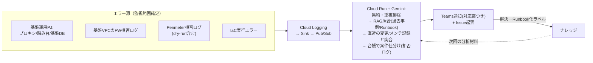

| ポイント | 内容 |
|---|---|
| 価値の中心 | 「**差分×エラーの因果推定**」— このエラーは昨日のFW変更PR/一昨日のDBメンテと関係があるか → revert or 追加設定を提案 |
| 初期ターゲット | ログが基盤運用Projectに集約済みのため、Sink・権限が最小で済むここから開始 |
| VPC-SC拒否ログ | 定型的でLLM分析と相性が良い。台帳（§7）で案件を仕分けしてから通知（他案件起因ノイズの排除）。Phase 0のdry-run観察でこの分析器を先行して育てる |
| ナレッジループ | 解決したらTeams/Issueからワンアクションでrunbooks/へPR → RAG対象に。運用するほど提案精度が上がる |

---

## 11. テーマC: 問い合わせ・相談（v1.3改訂: AIの出力先を相手で分ける）

**設計方針の明確化**: AIを利用者に直接向けるのではなく、①利用者には「FAQ/ガイドに基づく検索・チャットIF」で自己解決を支援し、②AIの分析力（過去事例・ベストプラクティス・台帳/ログ突合）は**基盤担当者の回答支援**に集中投下する。利用者に見えるAI出力は出典つきのFAQ案内のみで、個別回答は常に担当者が承認したものだけが届く。

### インターフェース一覧

| IF | 対象 | 役割 | 実装 |
|---|---|---|---|
| **GitHub Discussions（Q&A受付・supportリポジトリ）** | A3（代表者・招待制） | 自由な質問の投稿。AIボットが**出典つき一次回答を自動コメント**（公開用RAGのみ参照・根拠なしは回答しない・応答数十秒〜1分）。未解決時は要約プレフィル済み起票URLを案内 | Actions（discussionトリガ）→ Cloud Run → Gemini（図22と同じRAG構成） |
| **GitHub Issue Form（申請受付・supportリポジトリ）** | A3（代表者・招待制） | 正式な問い合わせ・**申請**の受付と対話スレッド。申請の構造化はPR自動生成（§11.5）の前提のため維持 | GitHub Issue Form（付録A）。メンバー管理は払い出しIaCで自動化 |
| **担当者コパイロット（v1.8: ポータルはこれ専用に縮小）** | A1 | 問い合わせIssue/Discussionごとのワークスペース。AIの解釈・類似事例・ベストプラクティス・回答ドラフトを提示し、チャットで練り直し → 確定回答をIssue/Discussionへ投稿 | Cloud Run + IAP。利用者向けチャットUIは不要化（全利用者が代表者=GitHub上で完結するため）。将来の利用者拡大時に復活可 |
| **iac: Discussions** | A1 | 基盤内のカジュアル相談・設計議論（変更なし）。関連Runbook・過去Issue・IaCコードの自動参照コメント | GitHub Discussions |

### 図19: 利用者IF（基盤ポータル）のフロー

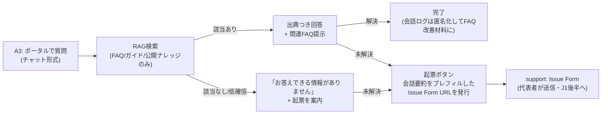

- **グラウンディング必須**: 回答はナレッジに実在する記述に限定し、出典リンクを常に添付。根拠がなければ「分からない」と答えて起票へ誘導する（誤案内の防止を確信度チューニングではなく仕組みで担保）。
- 検索対象は**利用者に公開してよいナレッジ（FAQ・ガイド）のみ**。内部Runbook・IaCコード・他案件のIssueは含めない（権限境界をRAGにも適用）。
- 会話引き継ぎ起票により、利用者は説明の書き直しが不要、担当者は文脈つきで受け取れる。

### 図20: 担当者コパイロットのフロー

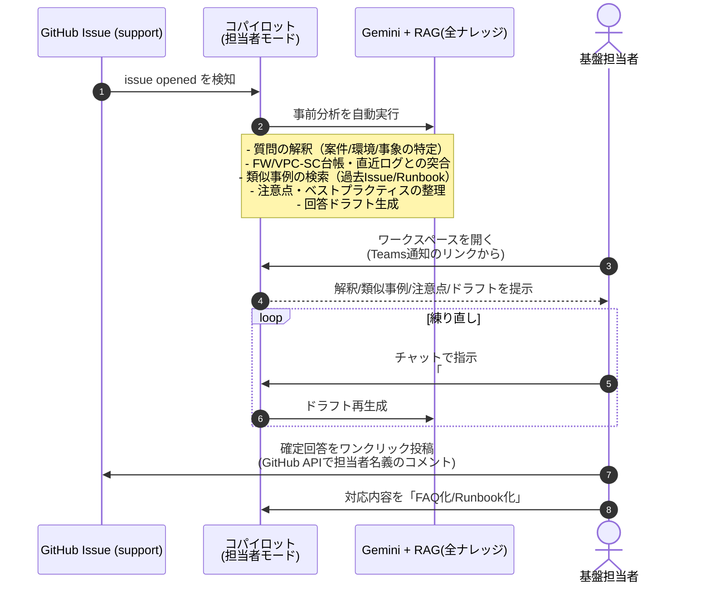

**参考: コパイロット画面のイメージ（モック）**

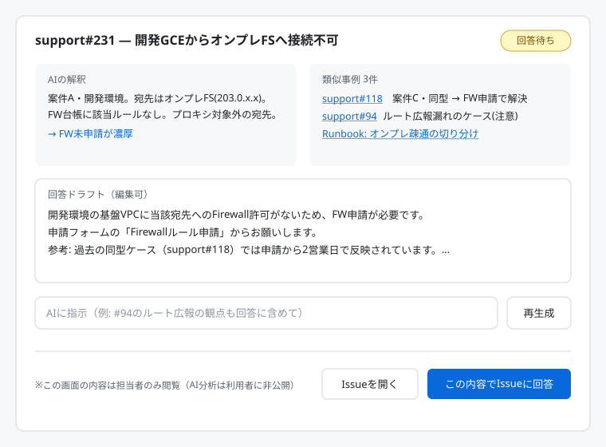


- **担当者側のRAGは全ナレッジ**（内部Runbook・IaCコード・台帳・ログ・全Issue）を参照でき、利用者側とは検索範囲が異なる。これがモード分離の本質。
- コパイロットの事前分析は起票時に自動で走らせておき、担当者が開いた時には材料が揃っている状態にする（J3の「Teams通知→1クリックで文脈へ」と同じ思想）。
- 練り直しの対話ログも記録し、FAQ化時に「回答に至った判断過程」ごとナレッジに残せる（次回の類似事例の質が上がる）。
- Discussionsの自動参照コメント（内部相談の下ごしらえ）は従来どおり。コパイロットは「特定Issueへの回答作成」に特化した作業台という位置づけ。

### 受付方式と閲覧権限の設計（v1.5改訂: ポータル完結型チケット）

**前提となる制約**: GitHubの閲覧権限は**リポジトリ単位**であり、Issue単位の制御はできない。申請にはIP・通信要件等の機微情報が含まれるため、単一supportリポジトリでは案件間で相互閲覧が発生し、案件別リポジトリ分割はリポジトリ乱立（50〜200個）を招く。

#### 検討した選択肢と決定

| 方式 | 案件間分離 | リポジトリ増 | 会話継続 | 判断 |
|---|---|---|---|---|
| Issue Form（単一リポジトリ・全利用者） | × 相互閲覧 | なし | ◎ | 不採用（機微情報） |
| Issue Form＋案件別リポジトリ | ◎ | ×（50〜200個） | ◎ | 不採用（乱立） |
| **Issue Form＋限定メンバー** | △ 招待した代表者間では相互閲覧（Issue単位の制御は不可） | なし | ◎ | **採用（v1.7・Q16で相互閲覧を許容と判断）** |
| ポータル完結型チケット | ◎ アプリ側で制御 | ゼロ | ◎ ポータル内スレッド | 将来オプション（相互閲覧の方針変更・利用者拡大時に移行） |
| Googleフォーム受付 | ○ 本人のみ | ゼロ | ×（返信が分断） | つなぎ・暫定受付に採用可 |
| メール受付 | ○ 本人のみ | ゼロ | ○ | つなぎ候補 |
| ヘルプデスクSaaS | ◎ | ゼロ | ◎ | 新規調達が必要なため見送り（組織に既存があれば再考） |

**決定（v1.7・Q16回答済み）**: 各案件の代表者間での相互閲覧は**許容できる**との判断により、**「Issue Form＋限定メンバー」を採用**する。単一のsupportリポジトリに各案件の代表者（インフラ担当1〜2名）のみを招待し、その代表者だけが起票・閲覧できる。開発不要で即開始でき、会話・履歴はすべてGitHub上に残る。ポータルの自前チケット機能は不要となり、ポータルは**FAQ検索チャット（利用者）＋回答支援コパイロット（担当者）に専念**する。将来、相互閲覧の許容方針が変わった場合はポータル完結型チケット（本節の比較表参照）へ移行できる。

#### 図21: Issue Form＋限定メンバーの受付構成（確定）

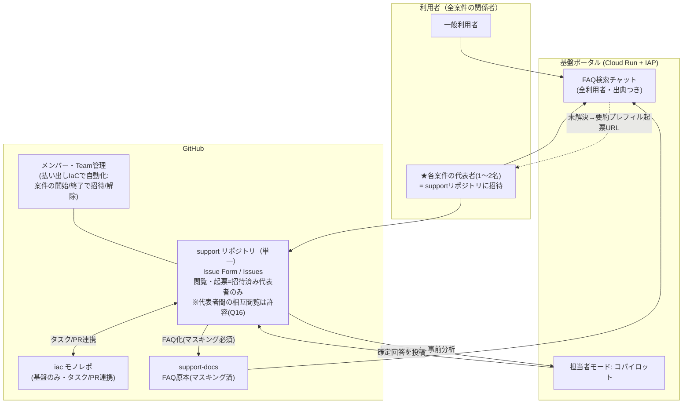

#### 設計ポイント

| 項目 | 設計 |
|---|---|
| メンバー管理 | 案件代表者の招待・解除を**払い出しIaC（Terraform GitHub provider）で管理**。案件開始で招待、終了で解除が自動化され、棚卸しも可能。GitHubライセンス席数（50〜200案件×1〜2名）は事前に見積る |
| 起票の導線 | ポータルのFAQチャットで未解決時、会話要約をプレフィルしたIssue Form URLを発行（Issue Formはクエリパラメータで項目の事前入力が可能）。代表者は内容を確認して送信するだけ |
| 代表者以外の利用者 | ポータルのFAQチャット・Teams告知チャンネルは全員利用可。個別の申請・問い合わせは自案件の代表者経由に集約（受付窓口の一本化はむしろ運用上の利点） |
| 機微情報の扱い | 相互閲覧を許容とはいえ、Issue本文には必要最小限の記載を促す（フォームの説明文で明示）。**FAQ化時のマスキング（Project ID・IP・案件名の抽象化）は維持**（support-docs/ポータルはより広い範囲に公開されるため） |
| AI分析の非公開 | コパイロットの事前分析（台帳突合・類似事例）はIssueに書かず担当者モードにのみ表示。Issueに載るのは担当者承認済みの回答のみ（v1.3方針を維持） |
| 将来オプション | 相互閲覧の方針変更・利用者拡大時は、ポータル完結型チケット（v1.5設計）へ移行可能。Issue履歴はエクスポートして引き継ぐ |

### チャット応答のフィジビリティ（v1.6・図22）

**前提の明確化**: チャットは**Teams経由ではなくWebポータル経由**で提供する。Teamsで対話ボットを動かすにはAzure Bot Serviceが必須であり、本環境では利用不可（v0.3で確定）。Teamsの役割は通知のみで変わらない。

#### 図22: チャット応答の内部動作

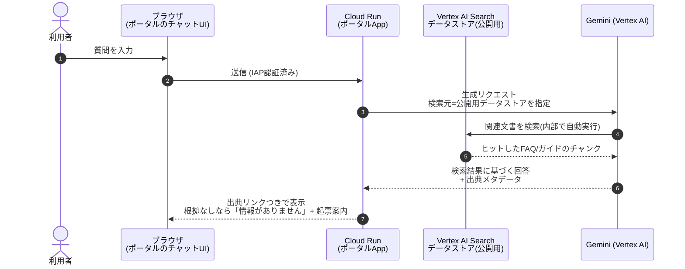

**参考: 検索チャット画面のイメージ（モック）** — v1.8で利用者向けはGitHub Discussionsに一本化したため、このUIは将来オプション（利用者拡大時のポータルチャット）およびコパイロット内の検索UIの参考として掲載する。

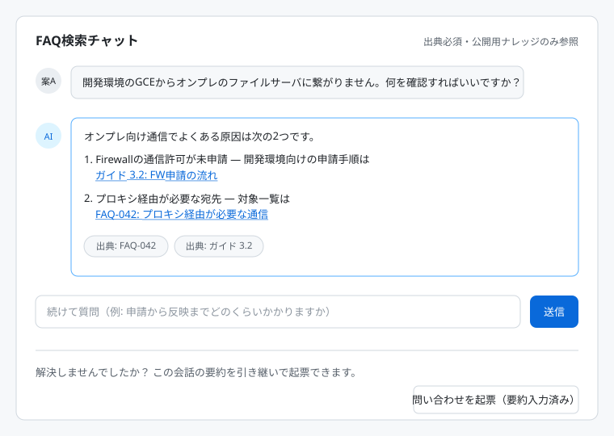

#### フィジビリティ評価

| 観点 | 評価 |
|---|---|
| 実装量 | 小。検索・グラウンディング・出典付与はマネージド機能（Vertex AI Search + Gemini）で提供され、自前実装はUI・呼び出し・モード制御のみ |
| セキュリティ | IAP認証 + VPC-SC境界内で完結。利用者モードは公開用データストアのみ参照（物理分離） |
| 技術的注意点 | Grounding方式（Geminiに検索元を紐づける簡易方式）はエンドユーザー識別ができず文書ACLが効かない。ただし本設計はデータストア自体を公開用/内部用に分離するため影響なし。将来ユーザー単位の文書制御が必要になったらSearch/Answer API + OAuth方式へ切替 |
| 品質統制 | 回答はデータストア内の文書に基づく生成に限定し、根拠が無ければ回答しない設定（グラウンディング必須）。出典を常に表示 |

### RAG運用設計: データ所有・公開範囲・メンテナンス（v1.6・図23）

#### データの所有とガバナンス

| 観点 | 確認結果 |
|---|---|
| データの持ち主 | データストア・元データ（GCS/BigQuery）とも**自組織のGCP Project内リソース**。削除・エクスポートも自由 |
| モデル学習への利用 | Google Cloudのサービス固有規約（トレーニングの制限）により、**顧客の事前許可なく顧客データをモデルのトレーニング/ファインチューニングに使用しない**（全マネージドモデルに適用）。プロンプト・レスポンスも基盤モデルの学習に不使用 |
| 暗号化・境界 | CMEK対応、VPC-SC対応、リージョン（データ所在地）指定可。必要ならゼロ保持設定（キャッシュ無効化等）も可能 |
| 監査 | データアクセス監査ログを有効化し、誰がいつ検索APIを呼んだかを記録 |

#### 公開範囲の制御（採用方式）

| 方式 | 内容 | 本設計での使い方 |
|---|---|---|
| **① データストア分離（採用）** | 公開用ストア（マスキング済FAQ・ガイドのみ）と内部用ストア（全ナレッジ: Runbook・台帳・過去チケット・IaC README）を物理的に分ける | 利用者モード=公開用のみ、担当者コパイロット=内部用。呼び出し先の取り違えが起きない最も確実な方式 |
| **② メタデータフィルタ（併用）** | 文書にカテゴリ・案件ID・機密度等のメタデータを付与し、検索時にフィルタ | 内部用ストア内で「当該案件の過去事例を優先」「アーカイブ済みを除外」等の細粒度制御 |
| ③ ドキュメント単位ACL（不採用） | acl_infoで文書ごとに閲覧者を指定 | データストア作成時に有効化必須（後から変更不可）、1文書あたり読者最大3,000、Grounding方式では機能しない等の制約があり、①＋②で要件を満たせるため採用しない |

#### 図23: RAGメンテナンスパイプライン（Gitを正とする）

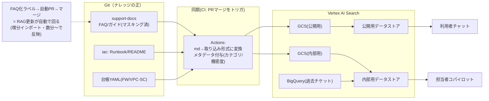

| 運用項目 | 設計 |
|---|---|
| 更新フロー | ナレッジ更新は必ずPR経由（レビューあり）→ マージでCIがGCS同期 → データストア増分インポート。**ドキュメント更新＝RAG更新**で二重管理なし |
| オーナー | ナレッジの所有は基盤チーム。ディレクトリごとの責任者はCODEOWNERSで明示 |
| 鮮度の担保 | FAQ化ループ（チケット解決→マスキング→自動PR）で継続更新。定期（週次）の全量再インポートで整合性を担保。古いFAQはアーカイブメタデータで検索対象から除外 |
| 品質モニタ | 「根拠なし回答率」「起票への遷移率」「担当者によるドラフト差し戻し率」をBQで計測し、ナレッジの穴（よく聞かれるが文書がない領域）を特定→ドキュメント化タスクを自動起票（テーマAの仕組みを流用） |

### Excel問い合わせ履歴のナレッジ移行（Phase 2の鍵・変更なし）

```mermaid
flowchart LR
    XL["既存Excel<br/>問い合わせ履歴"] --> ING["取り込みジョブ"] --> NORM["Gemini正規化:<br/>1件=1つのQ&A文書(md)化<br/>マスク・カテゴリ付与<br/>現行構成との矛盾フラグ"] --> REVW["人間レビュー(PR)<br/>※矛盾候補の判断・省略不可"] --> KBC["ナレッジ(faq/)へコミット"] --> IDX["Vertex AI Search<br/>インデックス化"]
    NORM -. "カテゴリ別件数" .-> BQC["BigQuery<br/>問い合わせ傾向分析"]
```

- 矛盾フラグと人間レビューを省くとRAGが古い回答を再生産するため、レビュー工程は必須。
- 傾向分析（何の問い合わせが多いか）は以後の自動化・ドキュメント化の優先順位付けに使う。
- 移行後の新規Q&AはFAQ化ラベル運用で同じ場所へ自動蓄積され、Excelは廃止。

---

## 11.5 横断機能: 自動対応パイプライン（検知・予定 → タスク → PRまで）

テーマA（差分）・B（エラー）・定期予定の3種のトリガーから、**判定 → タスク化 → 対応内容の生成 → ドラフトPR**までを自動で進める横断機能。実環境への反映（apply）は従来どおり人間の承認ゲートを通る。

### 図17: 自動対応パイプライン全体

```mermaid
flowchart TB
    subgraph TRG["トリガー3種"]
        T1["① 差分検知<br/>(テーマA: ドリフト/手動変更)"]
        T2["② エラーイベント<br/>(テーマB: 拒否ログ/障害/IaC実行失敗)"]
        T3["③ 定期予定<br/>(schedule.yaml: 棚卸しreview_by/<br/>メンテ予定/一時ルール期限/証明書期限)"]
    end

    TRG --> JDG["判定エンジン (Cloud Run + Gemini)<br/>プレイブックと照合:<br/>既知パターンか? 自動化レベルは?"]

    JDG -->|"パターン一致"| L3["Lv3: 対応内容を生成<br/>- 案件YAML/tfの変更差分<br/>- 根拠(ログ/ルール/予定)を添付"]
    JDG -->|"パターン外/低確信"| L2["Lv1-2: Issue起票<br/>+ 対応案コメントまで<br/>(従来どおり)"]

    L3 --> PR3["ドラフトPR自動作成<br/>- plan結果 + Gemini影響サマリ<br/>- 発端のIssue/ログへのリンク"]
    PR3 --> GATE["人間ゲート(変更なし)<br/>PRレビュー → Environments承認"]
    GATE --> APL["apply → 発端Issueへ<br/>完了コメント + クローズ"]
    APL --> REC["結果を記録<br/>(成功率をプレイブックにフィードバック)"]
    L2 -.->|"人間が対応 → 頻出なら"| PB["プレイブック昇格(図18)"]
```

### 自動化レベルの定義（プレイブックがパターンごとに宣言）

| レベル | 自動でやること | 人間がやること | 適用例 |
|---|---|---|---|
| Lv0 | 通知のみ | すべて | 情報共有系 |
| Lv1 | Issue起票（分類・重要度つき） | 調査から | 分類不能な差分・エラー |
| Lv2 | Issue + 対応案コメント | 対応案の検証と実施 | 新規パターンのエラー |
| **Lv3** | **Issue + 対応差分の生成 + ドラフトPR** | **レビューと承認のみ** | 既知パターン（下表） |
| Lv4 | Lv3 + 承認後の自動apply + クローズ | 承認のみ | Lv3で実績を積んだパターン |
| Lv5 | 完全自動（承認なし） | ― | **採用しない**（本構成の統制方針に反する） |

### Lv3（PRまで自動）の初期候補パターン

| トリガー | 判定 | 自動生成するPR |
|---|---|---|
| VPC-SC拒否ログ（テーマB） | 台帳照合で既知案件・既知パターンのEgress/Ingress不足と判定 | 該当案件YAMLへのルール追加PR（まず検証環境向け。図11のフローに乗る） |
| `review_by`期限到来で継続不要の回答（テーマA） | 案件が「不要」と回答済み | 該当ルールの削除PR |
| 一時ルールの期限切れ（③予定） | `expires`フィールド超過 | 削除PR（メンテ用の一時FW許可などに有効） |
| メンテ予定の接近（③予定） | schedule.yamlの予定日−N日 | 事前準備PR（一時ルール追加等）+ 実施後の戻しPR（ペアで生成） |
| ドリフト: IaC反映漏れ（テーマA） | 手動変更が正当と確認済み | IaC取込PR（既存設計） |
| 基盤運用リソースの既知エラー（テーマB） | Runbookに復旧手順あり・構成変更で解決する型 | 設定変更PR（platform-ops） |

### 定期予定の持ち方: schedule.yaml（予定もGitで管理）

```yaml
# iac/schedule/schedule.yaml（イメージ）
maintenance:
  - id: db-patch-2026q3
    title: 基盤DB四半期パッチ
    date: 2026-09-15
    prepare_days_before: 7        # 7日前に準備タスク+事前PRを自動生成
    playbook: db-maintenance      # 使用するプレイブック
recurring:
  - id: fw-rule-review
    cron: "0 9 1 */3 *"           # 四半期棚卸し
    playbook: rule-review
```

外部カレンダー（Outlook等）で管理中の予定がある場合は、当面は転記運用とし、必要ならカレンダー連携を後続で検討する（→確認事項）。

### 図18: プレイブック昇格ループ（自動化が育つ仕組み）

```mermaid
flowchart LR
    E1["新規パターンの<br/>エラー/差分が発生"] --> H1["Lv1-2: 人間が対応<br/>(対応内容はIssue/PRに残る)"] --> K1["Runbook化<br/>(ナレッジ蓄積・既存ループ)"] --> F1["頻出判定<br/>(BQの傾向分析で<br/>同型対応がN回以上)"] --> P1["プレイブック昇格PR<br/>(Geminiが過去対応から<br/>playbook.yamlをドラフト)"] --> R1["基盤チームレビュー<br/>自動化レベルを宣言(Lv3)"] --> A1["次回から自動PR"] --> M1["成功率モニタ<br/>(差し戻し率が高ければ降格)"]
    M1 -.-> R1
```

### プレイブックの実体（機械可読Runbook）

```yaml
# iac/playbooks/vpcsc-egress-add.yaml（イメージ）
id: vpcsc-egress-add
trigger:
  type: log
  match: "VPC-SC拒否 かつ 台帳に該当案件あり かつ 宛先サービスが許可リスト内"
automation_level: 3            # ドラフトPRまで
action:
  template: "vpc-sc/stg/rules/{anken_id}.yaml にegress_rules追記"
  route: "図11の四段階フロー（検証から）"
approvals: 標準（Environments既定）
guardrails:
  - policy checkを必ず通過すること
  - 宛先が許可リスト外なら Lv2 に降格して人間へ
```

### 統制上のポイント

- **人間ゲートは一切減らさない**: 自動化されるのは「調査・起案・PR作成」という準備作業であり、レビューと承認は全パターンで必須。Lv4でも「承認」は残る。
- **ガードレールの多重化**: プレイブックの適用条件 → policy check → CODEOWNERS → Environments承認、の4層。Gemini の判定ミスはPR段階で止まる。
- **降格の仕組み**: 差し戻し率が閾値を超えたパターンは自動化レベルを下げる（図18のモニタ）。「自動化しっぱなし」を防ぐ。

---

## 12. Teams 連携（通知設計）

| 項目 | 設計 |
|---|---|
| 方式 | Workflows（Power Automate）の「Webhook受信→チャンネル投稿」フローのみ。追加ライセンス不要。ペイロードはAdaptive Card形式 |
| チャンネル | 基盤内部（差分/エラー/承認待ち/新着問い合わせ）と利用者向け（新着FAQ/メンテ告知/受付導線）の2系統 |
| カード設計 | 対応先へのディープリンク必須。承認依頼カードにはGeminiのplan要約を埋め込み。利用者向けにはポータルへの導線を常設 |
| 制約の明示 | 送信者表示は「Flow bot」固定。対話機能なし（対話はGitHubへ誘導）。移行期にTeamsで受けた質問は担当がIssue転記 |
| 早期確認事項 | 組織DLPポリシーでWorkflowsアプリが制限されていないか、**Phase 0で通知フローを1本作って実地確認** |

---

## 13. Phase 0 詳細: FW / VPC-SC の IaC 化

### 図14: 台帳起点の三者突合・移行フロー

```mermaid
flowchart TB
    XL2["Excel台帳<br/>(ルール↔案件)"] --> CMP
    EXP2["実環境エクスポート<br/>gcloud / Asset Inventory"] --> CMP
    CMP["Gemini突合ジョブ"]
    CMP --> M1["✅ 一致"]
    CMP --> M2["⚠️ 実環境のみ<br/>(野良ルール)"]
    CMP --> M3["⚠️ 台帳のみ<br/>(実在しない記載)"]
    M1 --> GEN["案件別YAML自動生成<br/>(purpose等は台帳から転記)"]
    M2 --> INV["各案件へ確認Issue自動起票<br/>(supportリポジトリで=Issue運用の実地練習)"]
    M3 --> CLEAN["台帳クリーニング(履歴化)"]
    INV --> GEN
    GEN --> REVP["基盤チームレビュー(PR)"] --> IMPP["terraform import<br/>(importブロック)<br/>→ plan差分ゼロ確認"] --> GOP["運用切替:<br/>手動変更凍結(IAM絞り込み)<br/>以後PR経由のみ"]
```

### Phase 0 の作業項目

| # | 作業 | 備考 |
|---|---|---|
| 0-1 | リポジトリ整備（support / iac）、Actions基盤（WIF、branch protection、CODEOWNERS、Environments） | 図9・図10の骨格 |
| 0-2 | Teams通知フロー1本の実地確認 | Workflows許可の検証を兼ねる |
| 0-3 | 台帳×実環境の突合（図14）→ 案件別YAML生成 → 野良ルール確認キャンペーン | FW・VPC-SC(stg/prod)それぞれ |
| 0-4 | import → plan差分ゼロ確認 | コード生成は `terraform plan -generate-config-out` 等を補助に |
| 0-5 | VPC-SC dry-run運用の確立（図11の①③を先行運用） | dry-runログ観察はテーマBの分析器の先行育成を兼ねる |
| 0-6 | 手動変更の凍結（IAM絞り込み）、新規変更のPR運用開始 | 新規ルールからPR運用を先行開始し、既存は段階importでも可 |

**完了の定義**: 全ルールが案件IDつきYAML台帳に載り、plan差分ゼロ、以後の変更が100% PR経由。

---

## 14. 段階導入ロードマップ

| フェーズ | 内容 | 価値が出るポイント |
|---|---|---|
| **Phase 0** | FW/VPC-SCのIaC化＋台帳化（§13）。GitOps基盤・承認ゲート・Teams通知の整備 | 変更の統制と可視化。以後全ての土台 |
| **Phase 1** | テーマA: 定期plan＋Asset Feed＋Gemini分類→自動起票。棚卸し(review_by)・滞留リマインド。メンテ作業のIssue記録開始 | ドリフトが24h以内にタスク化 |
| **Phase 2** | テーマC: **Issue Form受付とDiscussions Q&Aボットを開始**（受付は開発不要・ボットはActions+Cloud Runの小規模実装）。担当者コパイロットMVP。Excel問い合わせ履歴の移行・FAQ公開 | 一次対応コスト削減、セルフサービス成立 |
| **Phase 3** | テーマB: 基盤運用PJ＋拒否ログの分析・対応案提案。変更/メンテ記録との突合。問い合わせ傾向分析。**テーマA-2: 案件構成の観測レポート開始（§9.5）。自動対応パイプラインの先行導入（§11.5: まずLv3を2〜3パターンに限定して実績づくり）** | エラー対応の初動短縮、問い合わせ・申請の先回り |
| **Phase 4** | 申請→ドラフトPR自動生成（J2完全化）。**自動対応パイプライン本格化（§11.5）: Lv3プレイブック拡充、schedule.yaml起点の予定駆動タスク、実績パターンのLv4昇格**。因果分析高度化。（価値実証後）Teams対話ボット再打診 | 定型対応のリードタイム大幅短縮 |
| **Phase 5** | OSレイヤ/DBメンテのGitOps化（VM Manager / Ansible等） | 運用作業の自動化拡大 |

**先行の仕込み（Phase 1〜3で無理なく）**: メンテ作業のIssueテンプレ記録、手順書のrunbooks/格納、プロキシ設定ファイルのGit管理。IaC化しなくても、記録がGitにあるだけでテーマB（突合）・C（RAG）の精度が上がる。

---

## 15. リスク・留意事項

| リスク | 対策 |
|---|---|
| Workflowsアプリが組織DLPで制限されている | Phase 0冒頭で実地確認（0-2）。不可なら管理者調整。最悪、通知はメール/GitHub通知で代替可能な設計 |
| Geminiの誤分類・誤提案 | 全経路に人間ゲート（承認二段・クローズ判断は人間）。policy checkの機械ガードレール。確信度による出し分け |
| 台帳の鮮度不足（野良ルール多数） | 図14のM2確認キャンペーンをIssueで管理。回答が得られないルールは`review_by`短期設定で棚卸しサイクルに乗せる |
| 共用Perimeter変更の事故 | 四段階フロー（図11）+ 全applyの承認ゲート + dry-run観察レポート |
| RAGが古い回答を再生産 | Excel移行時の矛盾フラグ＋人間レビュー必須（§11）。FAQにも`review_by`的な鮮度管理を導入検討 |
| 移行期の手動変更 | Asset Feedで全件検知→IaC取込タスク自動起票が安全網（Phase 0完了前から稼働可） |
| GitHubライセンス席数（Q17・未確認） | 代表者1000人規模の席数コスト/既存Enterprise契約でのカバー可否を確認。席数が制約になる場合は「案件あたり代表者1名に限定」または利用者IFをポータルチャット方式（v1.5設計）へ切替 |
| 自動生成PRの品質・暴走（§11.5） | 人間ゲート不変（レビュー+承認）。プレイブック適用条件→policy check→CODEOWNERS→Environments承認の4層ガードレール。差し戻し率による自動化レベルの降格。Lv5（承認なし完全自動）は採用しない |

---

## 付録A: Issue Form とは（v1.7で正式採用）

**参考: 申請画面のイメージ（モック）**

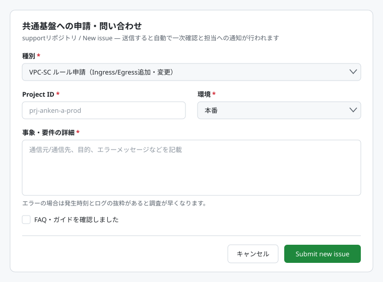


GitHubのIssueは通常フリーテキストだが、Issue Formはリポジトリの `.github/ISSUE_TEMPLATE/` に置いたYAML定義から**自動生成されるWebフォーム**。フォーム画面の開発は不要で、YAMLを書くだけで済む。

- 利用者が「New issue」を押すとテンプレート選択画面が表示され、選ぶとフォーム（選択式dropdown、必須テキスト、チェックボックス等）が開く
- 送信内容は整形されたMarkdownの通常Issueとして起票され、以降はコメントスレッドで対話できる
- 本構成では issue opened をトリガーに担当者コパイロットの事前分析が走り、担当者は材料が揃った状態で回答を作成できる（図4/J1・図20）
- 「種別」「環境」が選択式のためLLMの解釈精度が上がり、申請系はどの案件YAML・どの環境へのPRかを機械的に特定できる。ラベルの自動付与も種別に連動可能

定義YAMLのイメージ（抜粋）:

```yaml
# support/.github/ISSUE_TEMPLATE/request.yml
name: 共通基盤への申請・問い合わせ
description: FW/VPC-SC申請、障害相談、一般質問はこちら
labels: ["triage"]
body:
  - type: dropdown
    id: category
    attributes:
      label: 種別
      options:
        - VPC-SC ルール申請（Ingress/Egress追加・変更）
        - Firewall ルール申請
        - 障害・トラブル相談（通信できない等）
        - 一般質問
    validations:
      required: true
  - type: input
    id: project_id
    attributes:
      label: Project ID
      placeholder: prj-anken-a-prod
    validations:
      required: true
  - type: dropdown
    id: env
    attributes:
      label: 環境
      options: [本番, 開発]
    validations:
      required: true
  - type: textarea
    id: detail
    attributes:
      label: 事象・要件の詳細
      description: 通信元/通信先、目的、エラーメッセージなどを記載
    validations:
      required: true
  - type: checkboxes
    id: confirm
    attributes:
      label: 確認事項
      options:
        - label: FAQ・ガイドを確認しました
```

---

## 付録C: GitHub Discussions とは（Q&A受付の実体）

**GitHubの標準機能**（追加製品ではない）。リポジトリの Settings → Features → Discussions で有効化する。Issueが「対応すべきタスク」を扱うのに対し、Discussionsは「会話・質問・アイデア」を扱う掲示板で、カテゴリ分けができる。

| 項目 | 内容 |
|---|---|
| Q&Aカテゴリ | 質問形式のカテゴリ。回答に「**Answerとしてマーク**」を付けられ、一覧で回答済み/未回答が判別できる（Stack Overflow類似） |
| 権限 | リポジトリの権限に従う（supportリポジトリなら招待済み代表者のみ閲覧・投稿可）。Issue同様、投稿単位の閲覧制御は不可 |
| 自動化トリガ | GitHub Actions の `discussion` / `discussion_comment` イベントで投稿・返信を検知できる |
| API | Discussionsの読み書きは**GraphQL API**が主（IssueのようなREST APIは限定的）。ボットの返信投稿はGraphQL mutationで実装 |
| 本設計での使い方（support） | 質問受付。ボットが一次回答（公開用RAG・出典必須・応答数十秒〜1分）。「Answerマーク」が付いた質問はFAQ化候補として自動収集。未解決はIssue Form起票URL（要約プレフィル）を案内 |
| 本設計での使い方（iac） | 基盤内部の相談（J5）。ボットは関連Runbook・過去Issue・IaCコードの参照コメント（内部用RAG） |
| Issue Formとの使い分け | **自由な質問=Discussions、正式な申請・依頼=Issue Form**。申請を構造化フォームで受けることがPR自動生成（§11.5）の前提のため、両方を維持する |

**参考: Q&A画面のイメージ（モック）** — 質問→AIボットの出典つき一次回答→「回答としてマーク」→未解決時の起票導線、の流れ。

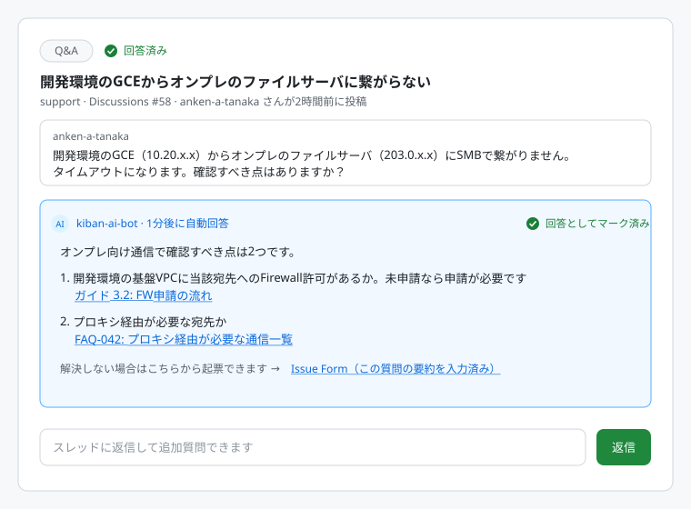

### ボットの動作（実装の要点）

```mermaid
sequenceDiagram
    autonumber
    actor U as 代表者
    participant DS as GitHub Discussions (Q&A受付)
    participant GA as GitHub Actions<br/>(discussionトリガ)
    participant CR as Cloud Run<br/>(応答サービス)
    participant GM as Vertex AI Gemini<br/>+ 公開用データストア

    U->>DS: 質問を投稿
    DS->>GA: discussion created イベント
    GA->>CR: 質問本文を送信（OIDC認証）
    CR->>GM: グラウンディング付き生成<br/>(公開用RAGのみ・根拠必須)
    GM-->>CR: 回答 + 出典
    CR->>DS: GraphQL APIで回答コメントを投稿<br/>(出典リンク + 起票URL案内つき)
    U->>DS: 追加質問（discussion_commentで再応答）
    U->>DS: 解決したら「Answerとしてマーク」
    Note over DS: マーク済みQ&Aは<br/>FAQ化候補として自動収集
```

---

## 付録B: 検討経緯

v0.1（たたき台）→ v0.2（Phase 0具体化・Teams方式・Gemini確定）→ v0.3（GitHub確定・Botなし構成）→ v0.4（GitHub一本化・Excel移行）→ v0.5（規模・統制設計）→ v0.6（ユーザー接点）→ v0.7（スコープ限定・案件軸・台帳化）→ v0.8（環境昇格・台帳起点棚卸し・監視範囲確定）→ v1.0（統合確定版）→ v1.1（FW2環境・案件観測A-2・Issue Form解説）→ v1.2（自動対応パイプライン §11.5）→ v1.3（テーマC二面構成）→ v1.4（閲覧権限の制約整理）→ v1.5（ポータル完結型チケット）→ v1.6（限定メンバー案再掲・チャットフィジビリティ・RAG運用設計）→ v1.7（受付方式確定）→ v1.8（GitHub一本化・図2修正・全ジャーニーのシーケンス図化）→ v1.9（命名規則統一・付録C）→ **v2.0（本書: 参考画面イメージ4点を同梱）**

*次工程: 本書の図1〜図23を原本としたdrawio化、またはPhase 0のWBS展開。*
